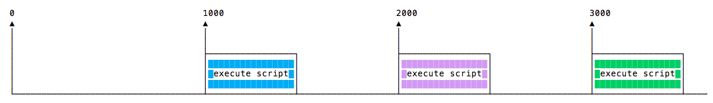

# NodeJS

## 1. Introdución a Node.js

Node.js é un entorno de execución de JavaScript de código aberto e multiplataforma. É unha ferramenta popular para case calquera tipo de proxecto!

Node.js executa o motor JavaScript V8, o núcleo de Google Chrome, fóra do navegador. Isto permite que Node.js teña un gran rendemento.

Unha aplicación Node.js execútase nun único proceso, sen crear un novo fío para cada solicitude. Node.js ofrece un conxunto de primitivas de E/S asíncronas na súa biblioteca  estándar que impiden o bloqueo do código JavaScript e, en xeral, as  bibliotecas de Node.js escríbense utilizando paradigmas non  bloqueadores, o que fai que o comportamento de bloqueo sexa a excepción e non a norma.

Cando Node.js realiza unha operación de E/S, como ler desde a rede, acceder a unha base de datos ou ao sistema de ficheiros, en lugar de bloquear o  fío e perder os ciclos da CPU esperando, Node.js retomará as operacións  cando volva a resposta.

Isto permite que Node.js manexa miles de conexións simultáneas cun único  servidor sen introducir a carga de xestionar a simultaneidade de fíos,  que podería ser unha fonte importante de erros.

Node.js ten unha vantaxe única porque millóns de desenvolvedores frontend que  escriben JavaScript para o navegador agora poden escribir o código do  servidor ademais do código do cliente sen necesidade de aprender unha  linguaxe completamente diferente.

En Node.js pódense usar sen problemas os novos estándares ECMAScript, xa  que non tes que esperar a que todos os teus usuarios actualicen os seus  navegadores; ti es o encargado de decidir que versión de ECMAScript usar cambiando a versión de Node.js. e tamén pode activar funcións  experimentais específicas executando Node.js con bandeiras.

### 1.1. Node.js ten unha gran cantidade de bibliotecas

[`npm`](https://flaviocopes-com.translate.goog/npm/?_x_tr_sl=auto&_x_tr_tl=gl&_x_tr_hl=es)coa súa estrutura sinxela axudou a proliferar o ecosistema de node.js e  agora o rexistro npm alberga case 500.000 paquetes de código aberto que  podes usar libremente.

### 1.2. Un exemplo de aplicación Node.js

O exemplo máis común de Hello World de Node.js é un servidor web:

```
const http = require('http')

const hostname = '127.0.0.1'
const port = 3000

const server = http.createServer((req, res) => {
  res.statusCode = 200
  res.setHeader('Content-Type', 'text/plain')
  res.end('Hello World\n')
})

server.listen(port, hostname, () => {
  console.log(`Server running at http://${hostname}:${port}/`)
})
```

Para executar este fragmento, gárdao como `server.js`ficheiro e execútalo `node server.js`no teu terminal.

Este código inclúe primeiro o [`http`módulo](https://translate.google.com/website?sl=auto&tl=gl&hl=es&u=https://nodejs.org/api/http.html) Node.js .

Node.js ten unha [biblioteca estándar](https://translate.google.com/website?sl=auto&tl=gl&hl=es&u=https://nodejs.org/api/) incrible , incluíndo un soporte de primeira clase para redes.

O `createServer()`método de `http`crea un novo servidor HTTP e devólvoo.

O servidor está configurado para escoitar no porto e nome de host especificados. Cando o servidor está listo, chámase a función de devolución de chamada,  neste caso informándonos de que o servidor está en execución.

Sempre que se recibe unha nova solicitude, chámase o [`request`evento](https://translate.google.com/website?sl=auto&tl=gl&hl=es&u=https://nodejs.org/api/http.html%23http_event_request)[`http.IncomingMessage`](https://translate.google.com/website?sl=auto&tl=gl&hl=es&u=https://nodejs.org/api/http.html%23http_class_http_incomingmessage) , proporcionando dous obxectos: unha solicitude (un obxecto) e unha resposta (un [`http.ServerResponse`](https://translate.google.com/website?sl=auto&tl=gl&hl=es&u=https://nodejs.org/api/http.html%23http_class_http_serverresponse)obxecto).

Eses dous obxectos son esenciais para xestionar a chamada HTTP.

O primeiro proporciona os detalles da solicitude. Neste exemplo sinxelo, isto non se usa, pero pode acceder ás cabeceiras da solicitude e aos datos da solicitude.

O segundo utilízase para devolver os datos á persoa que chama.

Neste caso con

```
res.statusCode = 200
```

establecemos a propiedade statusCode en 200, para indicar unha resposta exitosa.

Establecemos a cabeceira Content-Type:

```
res.setHeader('Content-Type', 'text/plain')
```

e rematamos pechando a resposta, engadindo o contido como argumento a `end()`:

```
res.end('Hello World\n')
```

### 1.3. Marcos e ferramentas de Node.js

Node.js é unha plataforma de baixo nivel, e para facer as cousas máis fáciles e interesantes para os desenvolvedores creáronse miles de bibliotecas  sobre Node.js.

Moitos deses establecéronse ao longo do tempo como opcións populares. Aquí tes unha lista non exhaustiva das que considero moi relevantes e que paga a pena aprender:

- [**Express**](https://translate.google.com/website?sl=auto&tl=gl&hl=es&u=https://expressjs.com/) , unha das formas máis sinxelas pero poderosas de crear un servidor web. O seu enfoque minimalista, sen opinión, centrado nas características fundamentais dun servidor, é clave para o seu éxito.
- [**Meteor**](https://flaviocopes-com.translate.goog/meteor/?_x_tr_sl=auto&_x_tr_tl=gl&_x_tr_hl=es) , unha estrutura de pila completa incriblemente poderosa, que che  proporciona un enfoque isomórfico para crear aplicacións con JavaScript, compartir código no cliente e no servidor. Unha vez que era unha ferramenta estándar que proporcionaba todo, agora intégrase coas bibliotecas de frontend React,[ Vue](https://flaviocopes-com.translate.goog/vue-introduction/?_x_tr_sl=auto&_x_tr_tl=gl&_x_tr_hl=es) e Angular. Tamén se pode usar para crear aplicacións móbiles.
- [**koa**](https://translate.google.com/website?sl=auto&tl=gl&hl=es&u=http://koajs.com/) , construído polo mesmo equipo que está detrás de Express, pretende ser aínda máis sinxelo e pequeno, a partir de anos de coñecemento. O novo proxecto nace da necesidade de crear cambios incompatibles sen perturbar a comunidade existente.
- [**Next.js**](https://flaviocopes-com.translate.goog/nextjs/?_x_tr_sl=auto&_x_tr_tl=gl&_x_tr_hl=es) , un marco para renderizar[ aplicacións React](https://flaviocopes-com.translate.goog/react/?_x_tr_sl=auto&_x_tr_tl=gl&_x_tr_hl=es) renderizadas no lado do servidor .
- [**Micro**](https://translate.google.com/website?sl=auto&tl=gl&hl=es&u=https://github.com/zeit/micro) , un servidor moi lixeiro para crear microservizos HTTP asíncronos.
- [**Socket.io**](https://translate.google.com/website?sl=auto&tl=gl&hl=es&u=https://socket.io/) , un motor de comunicación en tempo real para crear aplicacións de rede.
- [**SvelteKit**](https://translate.google.com/website?sl=auto&tl=gl&hl=es&u=https://kit.svelte.dev/) : Sapper é un marco para construír aplicacións web de todos os tamaños, cunha fermosa experiencia de desenvolvemento e un enrutamento flexible  baseado no sistema de ficheiros. Ofrece SSR e moito máis!
- [**Remix**](https://translate.google.com/website?sl=auto&tl=gl&hl=es&u=https://remix.run/) : Remix é un marco web fullstack para crear excelentes experiencias de usuario para a web. Sae da caixa con todo o que precisa para crear aplicacións web modernas  (tanto frontend como backend) e implementalas en calquera ambiente de  execución baseado en JavaScript (incluíndo Node.js).
- [**Fastify**](https://translate.google.com/website?sl=auto&tl=gl&hl=es&u=https://www.fastify.io/) un marco web rápido e eficiente altamente enfocado a proporcionar a  mellor experiencia para desenvolvedores coa menor sobrecarga e unha  poderosa arquitectura de complementos, inspirada en Hapi e Express.

## 2. Unha breve historia de Node.js

Créalo ou non, Node.js só ten 13 anos.

En comparación, JavaScript ten 26 anos e a Web 33.

13 anos non é moito tempo en tecnoloxía, pero Node.js parece existir para sempre.

Nesta publicación, debuxamos a gran imaxe de Node.js na súa historia, para poñer as cousas en perspectiva.

Un pouco de historia JavaScript é unha linguaxe de programación que foi  creada en Netscape como unha ferramenta de script para manipular páxinas web dentro do seu navegador, Netscape Navigator.

Parte do modelo de negocio de Netscape consistía en vender servidores web,  que incluían un entorno chamado Netscape LiveWire que podía crear  páxinas dinámicas usando JavaScript do servidor. Desafortunadamente, Netscape LiveWire non tivo moito éxito e JavaScript no servidor non se  popularizou ata hai pouco, coa introdución de Node.js.

Un factor clave que levou ao aumento de Node.js foi o momento. Só uns anos antes, JavaScript comezara a ser considerado como unha  linguaxe máis seria, grazas ás aplicacións “Web 2.0” (como Flickr,  Gmail, etc.) que mostraron ao mundo como podía ser unha experiencia  moderna na web.

Os motores JavaScript tamén melloraron considerablemente xa que moitos  navegadores competían para ofrecer aos usuarios o mellor rendemento. Os equipos de desenvolvemento detrás dos principais navegadores  traballaron duro para ofrecer un mellor soporte para JavaScript e atopar formas de facer que JavaScript se executase máis rápido. O motor que Node.js usa baixo o capó, V8 (tamén coñecido como Chrome V8  por ser o motor JavaScript de código aberto de The Chromium Project),  mellorou significativamente debido a esta competencia.

Node.js foi construído no lugar e no momento adecuados, pero a sorte non é o único motivo polo que é popular hoxe en día. Introduce unha gran cantidade de ideas e enfoques innovadores para o  desenvolvemento do servidor JavaScript que xa axudaron a moitos  desenvolvedores.

**2009**

- Nace Node.js
- A primeira versión de [npm](https://flaviocopes-com.translate.goog/npm/?_x_tr_sl=auto&_x_tr_tl=gl&_x_tr_hl=es)

**2010**

- Nace [Express](https://flaviocopes-com.translate.goog/express/?_x_tr_sl=auto&_x_tr_tl=gl&_x_tr_hl=es)
- Nace [Socket.io](https://translate.google.com/website?sl=auto&tl=gl&hl=es&u=https://socket.io)

**2011**

- npm alcanza a versión 1.0
- As grandes empresas comezan a adoptar Node: LinkedIn, Uber, etc

**2012**

- A adopción continúa moi rapidamente

**2013**

- Primeira gran plataforma de blogs usando Node: Ghost
- Nace [Koa](https://translate.google.com/website?sl=auto&tl=gl&hl=es&u=https://koajs.com/)

**2014**

- The Big Fork: [io.js](https://translate.google.com/website?sl=auto&tl=gl&hl=es&u=https://iojs.org/) é un gran fork de Node.js, co obxectivo de introducir compatibilidade con ES6 e avanzar máis rápido

**2015**

- Nace a [Fundación Node.js](https://translate.google.com/website?sl=auto&tl=gl&hl=es&u=https://foundation.nodejs.org/)
- io.js volve fusionarse con Node.js
- Nodo 4 (las versións 1, 2 e 3 foron publicadas anteriormente)

**2016**

- O [incidente de leftpad](https://translate.google.com/website?sl=auto&tl=gl&hl=es&u=https://blog.npmjs.org/post/141577284765/kik-left-pad-and-npm)
- [O fío](https://flaviocopes-com.translate.goog/yarn/?_x_tr_sl=auto&_x_tr_tl=gl&_x_tr_hl=es) nace
- Nodo 6

**2017**

- npm céntrase máis na seguridade
- Nó 8-9
- HTTP/2
- [V8](https://flaviocopes-com.translate.goog/v8/?_x_tr_sl=auto&_x_tr_tl=gl&_x_tr_hl=es) presenta Node na súa suite de probas, convertendo oficialmente a Node nun destino para o motor JS, ademais de Chrome
- 3.000 millóns de descargas por minuto cada semana

**2018**

- Nó 10-11
- Soporte experimental [de módulos ES .mjs](https://flaviocopes-com.translate.goog/es-modules/?_x_tr_sl=auto&_x_tr_tl=gl&_x_tr_hl=es)

**2019**

- Nó 12-13

**2020**

- Nó 14-15
- [GitHub](https://flaviocopes-com.translate.goog/github/?_x_tr_sl=auto&_x_tr_tl=gl&_x_tr_hl=es) (propiedade de Microsoft) adquiriu [NPM](https://flaviocopes-com.translate.goog/npm/?_x_tr_sl=auto&_x_tr_tl=gl&_x_tr_hl=es)

**2021**

- Node.js 16
- Node.js 17

**2022**

- Node.js 18

## 3. Como instalar Node.js

Node.js pódese instalar de diferentes xeitos.

Déixame como ti as máis comúns e cómodas.

Os paquetes oficiais para todas as plataformas principais están dispoñibles en [https://nodejs.org/en/download/](https://translate.google.com/website?sl=auto&tl=gl&hl=es&u=https://nodejs.org/en/download/) .

Alí pode escoller descargar unha versión LTS (LTS significa Soporte a longo prazo) ou a última versión dispoñible. Como é habitual, a última versión contén as novidades máis recentes.

No sitio teñen paquetes para Windows, Linux, macOS.

Unha forma moi cómoda de instalar Node.js é a través dun xestor de paquetes. Neste caso, cada sistema operativo ten o seu.

En macOS, [Homebrew](https://flaviocopes-com.translate.goog/homebrew/?_x_tr_sl=auto&_x_tr_tl=gl&_x_tr_hl=es) é o estándar de facto e, unha vez instalado, permite instalar Node.js moi facilmente, executando este comando na CLI:

```
brew install node
```

Outros xestores de paquetes para Linux e Windows están listados en [https://nodejs.org/en/download/package-manager/](https://translate.google.com/website?sl=auto&tl=gl&hl=es&u=https://nodejs.org/en/download/package-manager/)

`nvm`é unha forma popular de executar Node. Permítelle cambiar facilmente a versión de Node e instalar novas versións para  intentar revertir facilmente se algo se rompe, por exemplo.

Tamén é moi útil probar o teu código con versións antigas de Node.

Consulte [https://github.com/nvm-sh/nvm](https://translate.google.com/website?sl=auto&tl=gl&hl=es&u=https://github.com/nvm-sh/nvm) para obter máis información sobre esta opción.

A miña suxestión é usar o instalador oficial se estás comezando e aínda  non usas Homebrew; se non, Homebrew é a miña solución favorita porque  podo actualizar facilmente o nodo executando `brew upgrade node`.

En calquera caso, cando Node estea instalado, terás acceso ao `node`programa executable na liña de comandos.

## 4. Canto JavaScript necesitas saber para usar Node?

Como principiante, é difícil chegar a un punto no que teñas suficiente confianza nas túas habilidades de programación.

Mentres aprendes a codificar, tamén podes estar confundido onde remata JavaScript e onde comeza Node.js, e viceversa.

Recomendaríache que teñas unha boa comprensión dos principais conceptos de JavaScript antes de mergullarte en Node.js:

- Estrutura léxica
- Expresións
- Tipos
- Variables
- Funcións
- isto
- Funcións de frecha
- Loops
- Loops e alcance
- Arrays
- Literais de modelos
- Punto e coma
- Modo estrito
- ECMAScript 6, 2016, 2017

Con eses conceptos en mente, estás no teu camiño para converterte nun  programador de JavaScript competente, tanto no navegador como en  Node.js.

Os seguintes conceptos tamén son fundamentais para entender a programación asíncrona, que é unha parte fundamental de Node.js:

- [Programación asíncrona e devolucións de chamada](https://flaviocopes-com.translate.goog/javascript-callbacks/?_x_tr_sl=auto&_x_tr_tl=gl&_x_tr_hl=es)
- [Temporizadores](https://flaviocopes-com.translate.goog/javascript-timers/?_x_tr_sl=auto&_x_tr_tl=gl&_x_tr_hl=es)
- [Promesas](https://flaviocopes-com.translate.goog/javascript-promises/?_x_tr_sl=auto&_x_tr_tl=gl&_x_tr_hl=es)
- [Async e Await](https://flaviocopes-com.translate.goog/javascript-async-await/?_x_tr_sl=auto&_x_tr_tl=gl&_x_tr_hl=es)
- [Peches](https://flaviocopes-com.translate.goog/javascript-closures/?_x_tr_sl=auto&_x_tr_tl=gl&_x_tr_hl=es)
- [O bucle de eventos](https://flaviocopes-com.translate.goog/javascript-event-loop/?_x_tr_sl=auto&_x_tr_tl=gl&_x_tr_hl=es)

## 5. Diferenzas entre Node e o navegador

Tanto o navegador como Node.js usan JavaScript como linguaxe de programación.

Crear aplicacións que se executan no navegador é unha cousa completamente diferente que construír unha aplicación Node.js.

A pesar de que sempre é JavaScript, hai algunhas diferenzas clave que fan que a experiencia sexa radicalmente diferente.

Desde a perspectiva dun programador de frontend que usa extensivamente  JavaScript, as aplicacións Node.js traen consigo unha enorme vantaxe: a  comodidade de programar todo, o frontend e o backend, nunha única  linguaxe.

Tes unha oportunidade enorme porque sabemos o difícil que é aprender  completamente e profundamente unha linguaxe de programación e, ao usar a mesma linguaxe para realizar todo o teu traballo na web, tanto no  cliente como no servidor, estás nun posición de vantaxe única.

O que cambia é o ecosistema.

No navegador, a maioría das veces o que estás a facer é interactuar co [DOM](https://flaviocopes-com.translate.goog/dom/?_x_tr_sl=auto&_x_tr_tl=gl&_x_tr_hl=es) ou outras [API da plataforma web](https://flaviocopes-com.translate.goog/web-platform/?_x_tr_sl=auto&_x_tr_tl=gl&_x_tr_hl=es) como as cookies. Eses non existen en Node, por suposto. Non tes o `document`, `window`nin todos os demais obxectos que proporciona o navegador.

E no navegador, non temos todas as API agradables que ofrece Node.js a  través dos seus módulos, como a funcionalidade de acceso ao sistema de  ficheiros.

Outra gran diferenza é que en Node.js controlas o ambiente. A menos que esteas a construír unha aplicación de código aberto que  calquera poida implementar en calquera lugar, sabes en que versión de  Node.js executarás a aplicación. En comparación co entorno do navegador, onde non tes o luxo de escoller  que navegador usarán os teus visitantes, isto é moi cómodo.

Isto significa que pode escribir todo o JavaScript [ES6-7-8-9](https://flaviocopes-com.translate.goog/ecmascript/?_x_tr_sl=auto&_x_tr_tl=gl&_x_tr_hl=es) moderno que admite a súa versión de Node.

Dado que JavaScript móvese tan rápido, pero os navegadores poden ser un  pouco lentos e os usuarios un pouco lentos para actualizar, ás veces, na web, tes que usar versións antigas de JavaScript/ECMAScript.

Podes usar Babel para transformar o teu código para que sexa compatible con  ES5 antes de envialo ao navegador, pero en Node non o necesitarás.

Outra diferenza é que Node utilizaba orixinalmente o [sistema de módulos CommonJS](https://flaviocopes-com.translate.goog/commonjs/?_x_tr_sl=auto&_x_tr_tl=gl&_x_tr_hl=es) , mentres que no navegador usamos [ES Modules](https://flaviocopes-com.translate.goog/es-modules/?_x_tr_sl=auto&_x_tr_tl=gl&_x_tr_hl=es) , un estándar que tamén chegou recentemente a Node.js ( [https://nodejs.org/api/esm.html](https://translate.google.com/website?sl=auto&tl=gl&hl=es&u=https://nodejs.org/api/esm.html) )

En adiante Os módulos ES ( `import`) son a forma de cargar módulos en todo o JavaScript, frontend ou backend, pero Node.js aínda admite a `require`sintaxe.

## 6. O motor JavaScript V8

V8 é o nome do motor JavaScript que alimenta Google Chrome. É o que toma o noso JavaScript e execútao mentres navegas con Chrome.

V8 proporciona o ambiente de execución no que se executa JavaScript. O [DOM](https://flaviocopes-com.translate.goog/dom/?_x_tr_sl=auto&_x_tr_tl=gl&_x_tr_hl=es) e as outras [API da plataforma web](https://flaviocopes-com.translate.goog/web-platform/?_x_tr_sl=auto&_x_tr_tl=gl&_x_tr_hl=es) son proporcionadas polo navegador.

O interesante é que o motor JavaScript é independente do navegador no que está aloxado. Esta característica clave permitiu o auxe de [Node.js. ](https://flaviocopes-com.translate.goog/nodejs/?_x_tr_sl=auto&_x_tr_tl=gl&_x_tr_hl=es)O V8 foi elixido para ser o motor que alimentaba Node.js en 2009 e, a  medida que a popularidade de Node.js explotou, V8 converteuse no motor  que agora alimenta unha cantidade incrible de código do servidor escrito en JavaScript.

O ecosistema Node.js é enorme e grazas a el V8 tamén potencia as aplicacións de escritorio, con proxectos como Electron.

### 6.1. Outros motores JS

Outros navegadores teñen o seu propio motor JavaScript:

- Firefox ten [**Spidermonkey**](https://translate.google.com/website?sl=auto&tl=gl&hl=es&u=https://developer.mozilla.org/en-US/docs/Mozilla/Projects/SpiderMonkey)
- Safari ten **JavaScriptCore** (tamén chamado Nitro)
- Edge baseouse orixinalmente en Chakra, pero máis recentemente foi reconstruído usando Chromium e o motor V8.

e tamén existen moitos outros.

Todos eses motores implementan o estándar ECMA ES-262, tamén chamado [ECMAScript](https://flaviocopes-com.translate.goog/ecmascript/?_x_tr_sl=auto&_x_tr_tl=gl&_x_tr_hl=es) , o estándar usado por JavaScript.

### 6.2. A procura do rendemento

V8 está escrito en C++ e mellora continuamente. É portátil e funciona en Mac, Windows, Linux e outros sistemas.

Nesta introdución da V8, ignoraremos os detalles da implementación de V8:  pódense atopar en sitios máis autorizados (por exemplo, o sitio oficial  de V8) e cambian co paso do tempo, moitas veces radicalmente.

V8 está sempre en evolución, do mesmo xeito que os outros motores  JavaScript que hai, para acelerar a web e o ecosistema Node.js.

Na web, hai anos que hai unha carreira polo rendemento e nós (como  usuarios e desenvolvedores) beneficiámonos moito desta competencia  porque conseguimos máquinas máis rápidas e optimizadas ano tras ano.

### 6.3. Compilación

JavaScript é xeralmente considerado unha linguaxe interpretada, pero os motores  JavaScript modernos xa non só interpretan JavaScript, compílano.

Isto leva ocorrendo desde 2009, cando se engadiu o compilador JavaScript SpiderMonkey a Firefox 3.5, e todos seguiron esta idea.

JavaScript é compilado internamente por V8 con compilación just-in-time (JIT) para acelerar a execución.

Isto pode parecer contra-intuitivo, pero desde a introdución de Google Maps  en 2004, JavaScript evolucionou a partir dunha linguaxe que xeralmente  executaba algunhas ducias de liñas de código para completar aplicacións  con miles a centos de miles de liñas en execución no navegador.

As nosas aplicacións agora poden funcionar durante horas nun navegador, en lugar de ser só unhas regras de validación de formularios ou scripts  simples.

Neste novo mundo, compilar JavaScript ten todo o sentido porque, aínda que  pode levar un pouco máis ter o JavaScript listo, unha vez feito, terá  moito máis rendemento que o código puramente interpretado.

## 7. Execute scripts Node.js desde a liña de comandos

A forma habitual de executar un programa Node.js é executar o `node`comando dispoñible globalmente (unha vez que instale Node.js) e pasar o nome do ficheiro que quere executar.

Se o ficheiro principal da aplicación Node.js é `app.js`, pode chamalo escribindo:

```
node app.js
```

Arriba, estás dicindo explícitamente ao shell que execute o teu script con `node`. Tamén podes inserir esta información no teu ficheiro JavaScript cunha liña "shebang". O "shebang" é a primeira liña do ficheiro e indica ao SO que intérprete debe usar para executar o script. Abaixo está a primeira liña de JavaScript:

```
#!/usr/bin/node
```

Arriba, estamos dando explícitamente o camiño absoluto do intérprete. Non todos os sistemas operativos teñen `node`no cartafol bin, pero todos deberían ter `env`. Podes dicirlle ao SO que se execute `env`co nodo como parámetro:

```
#!/usr/bin/env node

// your code
```

Para usar un shebang, o teu ficheiro debe ter permiso executable. Podes dar `app.js`permiso ao executable executando:

```
chmod u+x app.js
```

Mentres executa o comando, asegúrese de estar no mesmo directorio que contén o `app.js`ficheiro.

### 7.1. Reinicie a aplicación automaticamente

O `node`comando ten que ser executado de novo en bash sempre que haxa un cambio na  aplicación, para reiniciar a aplicación automaticamente, `nodemon`utilízase o módulo.

Instale o módulo nodemon globalmente na ruta do sistema

```
npm i -g nodemon
```

Tamén pode instalar nodemon como unha dependencia do desenvolvemento

```
npm i -D nodemon
```

Esta instalación local de nodemon pódese executar chamándoa desde o script npm, como npm start ou usando npx nodemon.

Execute a aplicación usando nodemon seguido do nome do ficheiro da aplicación.

```
nodemon app.js
```

## 8. Como saír dun programa Node.js

Hai varias formas de finalizar unha aplicación Node.js.

Cando se executa un programa na consola pode pechalo con `ctrl-C`, pero o que queremos discutir aquí é a saída mediante programación.

Comecemos polo máis drástico e vexamos por que é mellor *non* usalo.

O `process`módulo principal ofrece un método práctico que che permite saír mediante programación dun programa Node.js: `process.exit()`.

Cando Node.js executa esta liña, o proceso vese obrigado a finalizar inmediatamente.

Isto significa que calquera devolución de chamada pendente, calquera  solicitude de rede que aínda se está enviando, calquera acceso ao  sistema de ficheiros ou procesos que escriben en `stdout`ou `stderr`- todo vai ser rematado sen gracia de inmediato.

Se isto che parece ben, podes pasar un número enteiro que indique ao sistema operativo o código de saída:

```
process.exit(1)
```

Por defecto o código de saída é `0`, o que significa éxito. Os diferentes códigos de saída teñen un significado diferente, que pode  querer usar no seu propio sistema para que o programa se comunique con  outros programas.

Podes ler máis sobre os códigos de saída en [https://nodejs.org/api/process.html#process_exit_codes](https://translate.google.com/website?sl=auto&tl=gl&hl=es&u=https://nodejs.org/api/process.html%23process_exit_codes)

Tamén pode definir a `process.exitCode`propiedade:

```
process.exitCode = 1
```

e cando remate o programa, Node.js devolverá ese código de saída.

Un programa sairá con graza cando se faga todo o procesamento.

Moitas veces con Node.js iniciamos servidores, como este servidor HTTP:

```
const express = require('express')

const app = express()

app.get('/', (req, res) => {
  res.send('Hi!')
})

app.listen(3000, () => console.log('Server ready'))
```

> Express é un framework que usa o módulo http baixo o capó, app.listen() devolve unha instancia de http. Usarías https.createServer se necesitases servir a túa aplicación mediante HTTPS, xa que app.listen só usa o módulo http.

Este programa nunca vai rematar. Se chamas a `process.exit()`, abortarase calquera solicitude pendente ou en execución. Isto *non é bo* .

É mellor permitir que se complete a solicitude en execución antes de finalizar. Neste caso, cómpre enviar ao comando un sinal SIGTERM e xestionalo co controlador de sinal de proceso:

> Nota: `process`non require un "require", está dispoñible automaticamente.

```
const express = require('express')

const app = express()

app.get('/', (req, res) => {
  res.send('Hi!')
})

const server = app.listen(3000, () => console.log('Server ready'))

process.on('SIGTERM', () => {
  server.close(() => {
    console.log('Process terminated')
  })
})
```

> Que son os sinais? Os sinais son un sistema de intercomunicación POSIX: unha notificación  enviada a un proceso co fin de notificarlle un suceso que ocorreu.

`SIGKILL`é o sinal que indica que un proceso remate inmediatamente, e que idealmente actuaría como `process.exit()`.

`SIGTERM`é o sinal que indica que un proceso remate con gracia. É o sinal que envían os xestores de procesos como `upstart`ou `supervisord`e moitos outros.

Podes enviar este sinal desde dentro do programa, noutra función:

```
process.kill(process.pid, 'SIGTERM')
```

Ou doutro programa en execución de Node.js ou calquera outra aplicación en execución no teu sistema que coñeza o PID do proceso que queres  finalizar.

## 9. Como ler as variables de ambiente de Node.js

O `process`módulo principal de Node.js proporciona a `env`propiedade que aloxa todas as variables de ambiente que se estableceron no momento en que se iniciou o proceso.

O seguinte código execútase `app.js`e establece `USER_ID`e `USER_KEY`.

```
USER_ID=239482 USER_KEY=foobar node app.js
```

Isto pasará ao usuario `USER_ID`como **239482** e `USER_KEY`como **foobar** . Isto é adecuado para probas, pero para produción, probablemente estará configurando algúns scripts bash para exportar variables.

> Nota: `process`non require un "require", está dispoñible automaticamente.

Aquí tes un exemplo que accede ás variables de ambiente `USER_ID`e `USER_KEY`, que establecemos no código anterior.

```
process.env.USER_ID // "239482"
process.env.USER_KEY // "foobar"
```

Do mesmo xeito, pode acceder a calquera variable de ambiente personalizada que estableza.

Se tes varias variables de ambiente no teu proxecto de nodo, tamén podes crear un `.env`ficheiro no directorio raíz do teu proxecto e despois usar o paquete [dotenv](https://translate.google.com/website?sl=auto&tl=gl&hl=es&u=https://www.npmjs.com/package/dotenv) para cargalas durante o tempo de execución.

```
# .env file
USER_ID="239482"
USER_KEY="foobar"
NODE_ENV="development"
```

No teu ficheiro js

```
require('dotenv').config()

process.env.USER_ID // "239482"
process.env.USER_KEY // "foobar"
process.env.NODE_ENV // "development"
```

> Tamén pode executar o seu ficheiro js co `node -r dotenv/config index.js`comando se non quere importar o paquete no seu código.

## 10. Onde aloxar unha aplicación Node.js

Aquí tes unha lista non exhaustiva das opcións que podes explorar cando  queres implementar a túa aplicación e facela accesible ao público.

Listarei as opcións desde as máis simples e restrinxidas ata as máis complexas e poderosas.

### 10.1. A opción máis sinxela de sempre: túnel local

Aínda que teñas unha IP dinámica ou teñas un NAT, podes implementar a túa  aplicación e atender as solicitudes directamente desde o teu ordenador  mediante un túnel local.

Esta opción é adecuada para probas rápidas, demostración dun produto ou para compartir unha aplicación cun grupo moi reducido de persoas.

Unha ferramenta moi agradable para iso, dispoñible en todas as plataformas, é [**ngrok**](https://translate.google.com/website?sl=auto&tl=gl&hl=es&u=https://ngrok.com/) .

Ao usalo, só tes que escribir `ngrok PORT`e o PORT que queres estará exposto a Internet. Recibirás un dominio ngrok.io, pero cunha subscrición de pago podes obter un URL  personalizado e máis opcións de seguranza (lembra que estás abrindo a  túa máquina á Internet pública).

Outro servizo que podes usar é [https://github.com/localtunnel/localtunnel](https://translate.google.com/website?sl=auto&tl=gl&hl=es&u=https://github.com/localtunnel/localtunnel)

### 10.2. Despliegues de configuración cero

#### 10.2.1. Fallo

[Glitch](https://translate.google.com/website?sl=auto&tl=gl&hl=es&u=https://glitch.com) é un parque infantil e unha forma de crear as túas aplicacións máis  rápido que nunca e de velos en directo no seu propio subdominio  glitch.com. Actualmente non podes ter un dominio personalizado, e hai algunhas [restricións](https://translate.google.com/website?sl=auto&tl=gl&hl=es&u=https://glitch.com/faq%23restrictions) , pero é moi bo facer un prototipo. Parece divertido (e isto é unha vantaxe) e non é un ambiente entusiasmado: obtén todo o poder de Node.js, un [CDN](https://flaviocopes-com.translate.goog/cdn/?_x_tr_sl=auto&_x_tr_tl=gl&_x_tr_hl=es) , almacenamento seguro para as credenciais, importación/exportación de GitHub e moito máis.

Ofrecido pola compañía detrás de FogBugz e Trello (e co-creadores de Stack Overflow).

Eu o uso moito para fins de demostración.

#### 10.2.2. Codepen

[Codepen](https://translate.google.com/website?sl=auto&tl=gl&hl=es&u=https://codepen.io) é unha plataforma e comunidade incribles. Podes crear un proxecto con varios ficheiros e implementalo cun dominio personalizado.

### 10.3. Sen servidor

Unha forma de publicar as túas aplicacións e non ter ningún servidor que xestionar é [sen servidor](https://flaviocopes-com.translate.goog/serverless/?_x_tr_sl=auto&_x_tr_tl=gl&_x_tr_hl=es) . Sen servidor é un paradigma no que publicas as túas aplicacións como **funcións** e responden nun punto final de rede (tamén chamado FAAS - Functions As A Service).

Para solucións moi populares son

- [Marco sen servidor](https://translate.google.com/website?sl=auto&tl=gl&hl=es&u=https://serverless.com/framework/)
- [Biblioteca estándar](https://translate.google.com/website?sl=auto&tl=gl&hl=es&u=https://stdlib.com/)

Ambos proporcionan unha capa de abstracción para a publicación en AWS Lambda e outras solucións FAAS baseadas en Azure ou a oferta de Google Cloud.

### 10.4. PAAS

PAAS significa Plataforma como servizo. Estas plataformas eliminan moitas cousas das que doutro xeito deberías preocuparte ao implementar a túa aplicación.

#### 10.4.1. Zeit Agora

> Zeit agora chámase [Vercel](https://translate.google.com/website?sl=auto&tl=gl&hl=es&u=https://vercel.com)

Zeit é unha opción interesante. Só tes que escribir `now`o teu terminal e el encárgase de implementar a túa aplicación. Hai unha versión gratuíta con limitacións, e a versión de pago é máis potente. Esqueces que hai un servidor, só tes que implementar a aplicación.

#### 10.4.2. Nanobox

[Nanobox](https://translate.google.com/website?sl=auto&tl=gl&hl=es&u=https://nanobox.io)

#### 10.4.3. Heroku

Heroku é unha plataforma incrible.

Este é un excelente artigo sobre [como comezar con Node.js en Heroku](https://translate.google.com/website?sl=auto&tl=gl&hl=es&u=https://devcenter.heroku.com/articles/getting-started-with-nodejs) .

#### 10.4.4. Microsoft Azure

Azure é a oferta de Microsoft Cloud.

Consulte como [crear unha aplicación web Node.js en Azure](https://translate.google.com/website?sl=auto&tl=gl&hl=es&u=https://docs.microsoft.com/en-us/azure/app-service/app-service-web-get-started-nodejs) .

#### 10.4.5. Google Cloud Platform

Google Cloud é unha estrutura incrible para as túas aplicacións.

Teñen unha boa [sección de documentación de Node.js](https://translate.google.com/website?sl=auto&tl=gl&hl=es&u=https://cloud.google.com/node/)

### 10.5. Servidor Privado Virtual

Nesta sección atoparás os sospeitosos habituais, ordenados de máis fácil de usar a menos fácil de usar:

- [Océano dixital](https://translate.google.com/website?sl=auto&tl=gl&hl=es&u=https://www.digitalocean.com)
- [Linode](https://translate.google.com/website?sl=auto&tl=gl&hl=es&u=https://www.linode.com/)
- [Amazon Web Services](https://translate.google.com/website?sl=auto&tl=gl&hl=es&u=https://aws.amazon.com) , en particular menciono a Amazon Elastic Beanstalk xa que abstrae un pouco a complexidade de AWS.

Dado que proporcionan unha máquina Linux baleira na que podes traballar, non hai ningún titorial específico para estes.

Hai moitas máis opcións na categoría VPS, son só as que usei e recomendaría.

### 10.6. Metal nu

Outra solución é conseguir un servidor bare metal, instalar unha distribución Linux, conectalo a internet (ou alugar un mensualmente, como podes  facer co servizo [Vultr Bare Metal )](https://translate.google.com/website?sl=auto&tl=gl&hl=es&u=https://www.vultr.com/pricing/baremetal/)

## 11. Como usar o REPL de Node.js

O `node`comando é o que usamos para executar os nosos scripts Node.js:

```
node script.js
```

Se executamos o `node`comando sen ningún script para executar ou sen argumentos, iniciamos unha sesión REPL:

```
node
```

> Nota: REPL significa Read Evaluate Print Loop, e é un ambiente de linguaxe de programación (basicamente unha xanela de consola) que toma unha única  expresión como entrada do usuario e devolve o resultado á consola  despois da execución. A sesión REPL ofrece un xeito cómodo de probar rapidamente o código JavaScript sinxelo.

Se o probas agora no teu terminal, isto é o que ocorre:

```
❯ node
>
```

O comando permanece en modo inactivo e agarda a que introduzamos algo.

> Consello: se non está seguro de como abrir o seu terminal, busque en Google "Como abrir o terminal no seu sistema operativo".

O REPL está esperando a que introduzamos algún código JavaScript, para ser máis precisos.

Comeza sinxelo e entra

```
> console.log('test')
test
undefined
>
```

O primeiro valor, `test`, é a saída que lle dixemos á consola que imprimise, despois obtemos `undefined`cal é o valor de retorno de executar `console.log()`. Node leu esta liña de código, avaliouno, imprimiu o resultado e despois volveu esperar máis liñas de código. Node pasará por estes tres pasos por cada peza de código que executemos no REPL ata que saiamos da sesión. Aí foi onde recibiu o seu nome a REPL.

Node imprime automaticamente o resultado de calquera liña de código JavaScript sen necesidade de indicarlle que o faga. Por exemplo, escriba a seguinte liña e prema Intro:

```
> 5 === '5'
false
>
```

Teña en conta a diferenza nas saídas das dúas liñas anteriores. O Node REPL imprimiu `undefined`despois de executado `console.log()`, mentres que, por outra banda, só imprimiu o resultado de `5 === '5'`. Debes ter en conta que o primeiro é só unha declaración en JavaScript e o segundo é unha expresión.

Nalgúns casos, o código que quere probar pode necesitar varias liñas. Por exemplo, digamos que quere definir unha función que xere un número  aleatorio, na sesión REPL escriba na seguinte liña e prema Intro:

```
function generateRandom() {
...
```

O Node REPL é o suficientemente intelixente como para determinar que  aínda non rematou de escribir o seu código e pasará a un modo de varias  liñas para que escriba máis código. Agora remata a definición da función e preme Intro:

```
function generateRandom() {
...return Math.random()
}
undefined
```

Node sairá do modo multiliña e imprimirá `undefined`xa que non se devolve ningún valor. Este modo multiliña é limitado. Node ofrece un editor máis destacado dentro do REPL. Discutámolo a continuación en Comandos de punto.

### 11.1. Use a pestana para completar automaticamente

O interesante do REPL é que é interactivo.

Mentres escribes o teu código, se premes a `tab`tecla REPL tentará completar automaticamente o que escribiches para que  coincida cunha variable que xa definiches ou cunha predefinida.

### 11.2. Explorando obxectos JavaScript

Proba a introducir o nome dunha clase JavaScript, como `Number`, engade un punto e prema `tab`.

O REPL imprimirá todas as propiedades e métodos aos que pode acceder nesa clase:


### 11.3. Explorar obxectos globais

Podes inspeccionar os globais aos que tes acceso escribindo `global.`e premendo `tab`:


### 11.4. A variable especial _

Se despois dalgún código escribes `_`, imprimirase o resultado da última operación.

### 11.5. A tecla de frecha cara arriba

Se preme a `up`tecla de frecha, terá acceso ao historial das liñas de código anteriores executadas nas sesións REPL actuais e mesmo anteriores.

### 11.6. Comandos de puntos

O REPL ten algúns comandos especiais, todos comezando cun punto `.`. Eles son

- `.help`: mostra a axuda dos comandos de puntos
- `.editor`: activa o modo editor, para escribir código JavaScript multiliña con facilidade. Unha vez que esteas neste modo, introduce ctrl-D para executar o código que escribiches.
- `.break`: ao introducir unha expresión multiliña, ao introducir o comando .break abortará a entrada posterior. O mesmo que premer ctrl-C.
- `.clear`: restablece o contexto REPL a un obxecto baleiro e borra calquera expresión de varias liñas que se está a introducir.
- `.load`: carga un ficheiro JavaScript, relativo ao directorio de traballo actual
- `.save`: garda todo o que introduciu na sesión REPL nun ficheiro (especifique o nome do ficheiro)
- `.exit`: sae da repl (o mesmo que premer ctrl-C dúas veces)

O REPL sabe cando está a escribir unha instrución de varias liñas sen necesidade de invocar `.editor`.

Por exemplo, se comeza a escribir unha iteración como esta:

```
[1, 2, 3].forEach(num => {
```

e preme `enter`, o REPL irá a unha nova liña que comeza con 3 puntos, o que indica que agora pode seguir traballando nese bloque.

```
... console.log(num)
... })
```

Se escribe `.break`ao final dunha liña, o modo multiliña deterase e a instrución non se executará.

### 11.7. Executar REPL desde o ficheiro JavaScript

Podemos importar o REPL nun ficheiro JavaScript usando `repl`.

```
const repl = require('repl')
```

Usando a variable repl podemos realizar varias operacións. Para iniciar o indicador de comandos REPL, escriba a seguinte liña

```
repl.start()
```

Execute o ficheiro na liña de comandos.

```
node repl.js
> const n = 10
```

Podes pasar unha cadea que mostra cando comeza o REPL. O valor predeterminado é '>' (cun espazo ao final), pero podemos definir un aviso personalizado.

```
// a Unix style prompt
const local = repl.start('$ ')
```

Podes mostrar unha mensaxe mentres saes do REPL

```
local.on('exit', () => {
  console.log('exiting repl')
  process.exit()
})
```

## 12. Nodo, acepta argumentos da liña de comandos

Podes pasar calquera número de argumentos ao invocar unha aplicación Node.js usando

```
node app.js
```

Os argumentos poden ser autónomos ou ter unha clave e un valor.

Por exemplo:

```
node app.js joe
```

ou

```
node app.js name=joe
```

Isto cambia como recuperarás este valor no código Node.js.

O xeito de recuperalo é usando o `process`obxecto integrado en Node.js.

Expón unha `argv`propiedade, que é unha matriz que contén todos os argumentos de invocación da liña de comandos.

O primeiro elemento é a ruta completa do `node`comando.

O segundo elemento é a ruta completa do ficheiro que se está a executar.

Todos os argumentos adicionais están presentes desde a terceira posición cara adiante.

Podes iterar sobre todos os argumentos (incluíndo o camiño do nodo e o camiño do ficheiro) usando un bucle:

```
process.argv.forEach((val, index) => {
  console.log(`${index}: ${val}`)
})
```

Podes obter só os argumentos adicionais creando unha nova matriz que exclúa os 2 primeiros parámetros:

```
const args = process.argv.slice(2)
```

Se tes un argumento sen un nome de índice, así:

```
node app.js joe
```

podes acceder a el usando

```
const args = process.argv.slice(2)
args[0]
```

Neste caso:

```
node app.js name=joe
```

`args[0]`é `name=joe`, e cómpre analizalo. A mellor forma de facelo é empregando a [`minimist`](https://translate.google.com/website?sl=auto&tl=gl&hl=es&u=https://www.npmjs.com/package/minimist)biblioteca, que axuda a xestionar os argumentos:

```
const args = require('minimist')(process.argv.slice(2))

args.name // joe
```

Instala o `minimist`paquete necesario usando `npm`(a lección sobre o xestor de paquetes vén [máis tarde](https://translate.google.com/website?sl=auto&tl=gl&hl=es&u=https://nodejs.dev/learn/an-introduction-to-the-npm-package-manager) ).

```
npm install minimist
```

Nesta ocasión cómpre usar guións dobres antes de cada nome de argumento:

```
node app.js --name=joe
```

## 13. Saída á liña de comandos usando Node

### 13.1. Saída básica mediante o módulo de consola

Node.js ofrece un [`console`módulo](https://translate.google.com/website?sl=auto&tl=gl&hl=es&u=https://nodejs.org/api/console.html) que proporciona toneladas de formas moi útiles de interactuar coa liña de comandos.

É basicamente o mesmo que o `console`obxecto que atopas no navegador.

O método máis básico e máis utilizado é `console.log()`, que imprime a cadea que lle pasas á consola.

Se pasas un obxecto, representarao como unha cadea.

Podes pasar varias variables a `console.log`, por exemplo:

```
const x = 'x'
const y = 'y'
console.log(x, y)
```

e Node.js imprimirá ambos.

Tamén podemos dar formato a frases bonitas pasando variables e un especificador de formato.

Por exemplo:

```
console.log('My %s has %d ears', 'cat', 2)
```

- `%s`dar formato a unha variable como cadea
- `%d`dar formato a unha variable como un número
- `%i`dar formato a unha variable só como a súa parte enteira
- `%o`dar formato a unha variable como obxecto

Exemplo:

```
console.log('%o', Number)
```

### 13.2. Limpar a consola

`console.clear()`borra a consola (o comportamento pode depender da consola utilizada)

### 13.3. Elementos de conta

`console.count()`é un método práctico.

Toma este código:

```
const x = 1
const y = 2
const z = 3
console.count(
  'The value of x is ' + x + ' and has been checked .. how many times?'
)
console.count(
  'The value of x is ' + x + ' and has been checked .. how many times?'
)
console.count(
  'The value of y is ' + y + ' and has been checked .. how many times?'
)
```

O que ocorre é que `console.count()`contará o número de veces que se imprime unha cadea e imprimirá a conta ao lado:

Só podes contar mazás e laranxas:

```
const oranges = ['orange', 'orange']
const apples = ['just one apple']
oranges.forEach((fruit) => {
  console.count(fruit)
})
apples.forEach((fruit) => {
  console.count(fruit)
})
```

### 13.4. Restablecer o reconto

O método console.countReset() restablece o contador usado con console.count().

Usaremos o exemplo de mazás e laranxa para demostralo.

```
const oranges = ['orange', 'orange']
const apples = ['just one apple']
oranges.forEach((fruit) => {
  console.count(fruit)
})
apples.forEach((fruit) => {
  console.count(fruit)
})

console.countReset('orange')

oranges.forEach((fruit) => {
  console.count(fruit)
})
```

Observe como a chamada para `console.countReset('orange')`restablecer o contador de valores a cero.

### 13.5. Imprime o rastro da pila

Pode haber casos nos que sexa útil imprimir o rastrexo da pila de chamadas dunha función, quizais para responder á pregunta *como chegou a esa parte do código?*

Podes facelo usando `console.trace()`:

```
const function2 = () => console.trace()
const function1 = () => function2()
function1()
```

Isto imprimirá o rastro da pila. Isto é o que se imprime se o probamos no REPL de Node.js:

```
Trace
    at function2 (repl:1:33)
    at function1 (repl:1:25)
    at repl:1:1
    at ContextifyScript.Script.runInThisContext (vm.js:44:33)
    at REPLServer.defaultEval (repl.js:239:29)
    at bound (domain.js:301:14)
    at REPLServer.runBound [as eval] (domain.js:314:12)
    at REPLServer.onLine (repl.js:440:10)
    at emitOne (events.js:120:20)
    at REPLServer.emit (events.js:210:7)
```

### 13.6. Calcula o tempo empregado

Pode calcular facilmente o tempo que tarda en executarse unha función, usando `time()`e`timeEnd()`

```
const doSomething = () => console.log('test')
const measureDoingSomething = () => {
  console.time('doSomething()')
  // do something, and measure the time it takes
  doSomething()
  console.timeEnd('doSomething()')
}
measureDoingSomething()
```

### 13.7. stdout e stderr

Como vimos, console.log é excelente para imprimir mensaxes na Consola. Isto é o que se chama saída estándar ou `stdout`.

`console.error`imprime no `stderr`fluxo.

Non aparecerá na consola, pero aparecerá no rexistro de erros.

### 13.8. Colorea a saída

Podes colorear a saída do teu texto na consola usando [secuencias de escape](https://translate.google.com/website?sl=auto&tl=gl&hl=es&u=https://gist.github.com/iamnewton/8754917) . Unha secuencia de escape é un conxunto de caracteres que identifica unha cor.

Exemplo:

```
console.log('\x1b[33m%s\x1b[0m', 'hi!')
```

Podes probalo no REPL de Node.js e imprimirase `hi!`en amarelo.

Non obstante, esta é a forma de baixo nivel de facelo. O xeito máis sinxelo de colorear a saída da consola é usando unha biblioteca. [Chalk](https://translate.google.com/website?sl=auto&tl=gl&hl=es&u=https://github.com/chalk/chalk) é unha biblioteca deste tipo e, ademais de colorear, tamén axuda con  outras facilidades de estilo, como facer texto en negra, cursiva ou  subliñado.

Instálao con `npm install chalk@4`, entón podes usalo:

```
const chalk = require('chalk')

console.log(chalk.yellow('hi!'))
```

Usar `chalk.yellow`é moito máis cómodo que tentar lembrar os códigos de escape, e o código é moito máis lexible.

Consulte a ligazón do proxecto publicada arriba para obter máis exemplos de uso.

### 13.9. Crea unha barra de progreso

[Progress](https://translate.google.com/website?sl=auto&tl=gl&hl=es&u=https://www.npmjs.com/package/progress) é un paquete fantástico para crear unha barra de progreso na consola. Instalalo usando`npm install progress`

Este fragmento crea unha barra de progreso de 10 pasos e cada 100 ms complétase un paso. Cando se completa a barra, borramos o intervalo:

```
const ProgressBar = require('progress')

const bar = new ProgressBar(':bar', { total: 10 })
const timer = setInterval(() => {
  bar.tick()
  if (bar.complete) {
    clearInterval(timer)
  }
}, 100)
```

## 14. Acepte a entrada da liña de comandos en Node

Node.js ten un sistema de módulos integrado.

Un ficheiro Node.js pode importar a funcionalidade exposta por outros ficheiros Node.js.

Cando queres importar algo que usas

```
const library = require('./library')
```

para importar a funcionalidade exposta no `library.js`ficheiro que reside no cartafol de ficheiros actual.

Neste ficheiro, a funcionalidade debe estar exposta antes de que poida ser importada por outros ficheiros.

Calquera outro obxecto ou variable definido no ficheiro por defecto é privado e non está exposto ao mundo exterior.

Isto é o que nos permite facer a `module.exports`API que ofrece o [`module`sistema .](https://translate.google.com/website?sl=auto&tl=gl&hl=es&u=https://nodejs.org/api/modules.html)

Cando asignas un obxecto ou unha función como unha `exports`propiedade nova, esa é a cousa que se expón e, como tal, pódese importar noutras  partes da túa aplicación ou tamén noutras aplicacións.

Podes facelo de 2 xeitos.

O primeiro é asignar un obxecto a `module.exports`, que é un obxecto proporcionado fóra da caixa polo sistema de módulos, e isto fará que o teu ficheiro exporte *só ese obxecto* :

```
// car.js
const car = {
  brand: 'Ford',
  model: 'Fiesta',
}

module.exports = car
// index.js
const car = require('./car')
```

A segunda forma é engadir o obxecto exportado como unha propiedade de `exports`. Deste xeito, permítelle exportar varios obxectos, funcións ou datos:

```
const car = {
  brand: 'Ford',
  model: 'Fiesta',
}

exports.car = car
```

ou directamente

```
exports.car = {
  brand: 'Ford',
  model: 'Fiesta',
}
```

E no outro ficheiro, usarao facendo referencia a unha propiedade da túa importación:

```
const items = require('./car')

const { car } = items
```

ou podes usar unha tarefa de desestruturación:

```
const { car } = require('./car')
```

Cal é a diferenza entre `module.exports`e `exports`?

O primeiro expón o obxecto ao que apunta. Este último expón *as propiedades* do obxecto ao que apunta.

`require`sempre devolverá o obxecto `module.exports`ao que apunta.

```
// car.js
exports.car = {
  brand: 'Ford',
  model: 'Fiesta',
}

module.exports = {
  brand: 'Tesla',
  model: 'Model S',
}

// app.js
const tesla = require('./car')
const ford = require('./car').car

console.log(tesla, ford)
```

Isto imprimirase `{ brand: 'Tesla', model: 'Model S' } undefined`xa que o `require`valor de retorno da función se actualizou ao obxecto `module.exports`ao que apunta, polo que non se pode acceder *á propiedade* que se engadiu.`exports`

## 15. Unha introdución ao xestor de paquetes npm

### 15.1. Introdución ao npm

`npm`é o xestor de paquetes estándar para Node.js.

En xaneiro de 2017 informouse de que máis de 350.000 paquetes estaban  listados no rexistro npm, o que o converteu no maior repositorio de  código de idioma único da Terra, e podes estar seguro de que hai un  paquete para (case!) todo.

Comezou como unha forma de descargar e xestionar as dependencias dos paquetes  Node.js, pero desde entón converteuse nunha ferramenta utilizada tamén  en JavaScript frontend.

Hai moitas cousas que `npm`fai.

> [**Yarn**](https://translate.google.com/website?sl=auto&tl=gl&hl=es&u=https://yarnpkg.com/en/) e[ **pnpm**](https://translate.google.com/website?sl=auto&tl=gl&hl=es&u=https://pnpm.io) son alternativas a npm cli. Tamén podes consultalos.

### 15.2. Descargas

`npm`xestiona as descargas de dependencias do teu proxecto.

#### 15.2.1. Instalando todas as dependencias

Se un proxecto ten un `package.json`ficheiro, executando

```
npm install
```

instalará no `node_modules`cartafol todo o que necesite o proxecto, creándoo se aínda non existe.

#### 15.2.2. Instalación dun único paquete

Tamén podes instalar un paquete específico executando

```
npm install <package-name>
```

Ademais, desde npm 5, este comando engádese `<package-name>`ás *dependencias*`package.json` do ficheiro . Antes da versión 5, necesitaba engadir a bandeira .`--save`

Moitas veces verás máis marcas engadidas a este comando:

- `-D`ou `--save-dev`instala e engade a entrada ao `package.json`ficheiro *devDependencies*
- `--no-save`instala pero non engade a entrada ás *dependencias*`package.json` do ficheiro
- `--save-optional`instala e engade a entrada ao `package.json`ficheiro *Dependencias opcionales*
- `--no-optional`evitará que se instalen dependencias opcionais

Tamén se poden usar abreviaturas das bandeiras:

- -S: -garda
- -D: -gardar-dev
- -O: -gardar-opcional

A diferenza entre *devDependencies* e *dependencias* é que a primeira contén ferramentas de desenvolvemento, como unha  biblioteca de probas, mentres que a segunda inclúese coa aplicación en  produción.

En canto ás *Dependencias opcionais,* a diferenza é que a falla de compilación da dependencia non fará que a instalación falle. Pero é responsabilidade do teu programa xestionar a falta de dependencia. Ler máis sobre [as dependencias opcionais](https://translate.google.com/website?sl=auto&tl=gl&hl=es&u=https://docs.npmjs.com/cli/v7/configuring-npm/package-json%23optionaldependencies) .

#### 15.2.3. Actualizando paquetes

A actualización tamén se fai fácil, executando

```
npm update
```

`npm`buscará en todos os paquetes unha versión máis nova que satisfaga as súas restricións de versión.

Tamén podes especificar un único paquete para actualizar:

```
npm update <package-name>
```

### 15.3. Versionado

Ademais das descargas simples, `npm`tamén xestiona **o control de versións** , polo que podes especificar calquera versión específica dun paquete,  ou requirir unha versión superior ou inferior á que necesitas.

Moitas veces descubrirás que unha biblioteca só é compatible cunha versión principal doutra biblioteca.

Ou un erro na última versión dunha lib, aínda sen corrixir, está a causar un problema.

Especificar unha versión explícita dunha biblioteca tamén axuda a que todos teñan a mesma versión exacta dun paquete, de xeito que todo o equipo execute a  mesma versión ata que se `package.json`actualice o ficheiro.

En todos eses casos, o versionado axuda moito e `npm`segue o estándar de versionado semántico (semver).

### 15.4. Tarefas en execución

O ficheiro package.json admite un formato para especificar tarefas de liña de comandos que se poden executar mediante

```
npm run <task-name>
```

Por exemplo:

```
{
  "scripts": {
    "start-dev": "node lib/server-development",
    "start": "node lib/server-production"
  }
}
```

É moi común usar esta función para executar Webpack:

```
{
  "scripts": {
    "watch": "webpack --watch --progress --colors --config webpack.conf.js",
    "dev": "webpack --progress --colors --config webpack.conf.js",
    "prod": "NODE_ENV=production webpack -p --config webpack.conf.js"
  }
}
```

Entón, en lugar de escribir eses comandos longos, que son fáciles de esquecer ou escribir mal, pode executar

```
$ npm run watch
$ npm run dev
$ npm run prod
```

## 16. Onde instala npm os paquetes?

Cando instalas un paquete usando `npm`podes realizar 2 tipos de instalación:

- unha instalación local
- unha instalación global

Por defecto, cando escribe un `npm install`comando, como:

```
npm install lodash
```

o paquete está instalado na árbore de ficheiros actual, baixo o `node_modules`subcartafol.

Cando isto ocorre, `npm`tamén engade a `lodash`entrada na `dependencies`propiedade do `package.json`ficheiro presente no cartafol actual.

Realízase unha instalación global usando a `-g`marca:

```
npm install -g lodash
```

Cando isto ocorre, npm non instalará o paquete no cartafol local, senón que utilizará unha localización global.

Onde, exactamente?

O `npm root -g`comando indicarache onde está esa localización exacta na túa máquina.

En macOS ou Linux, esta localización podería ser `/usr/local/lib/node_modules`. En Windows podería ser`C:\Users\YOU\AppData\Roaming\npm\node_modules`

Non obstante, se usas `nvm`para xestionar versións de Node.js, esa localización sería diferente.

Por exemplo, se o teu nome de usuario é 'joe' e usas `nvm`, a localización dos paquetes mostrarase como `/Users/joe/.nvm/versions/node/v8.9.0/lib/node_modules`.

## 17. Como usar ou executar un paquete instalado usando npm

Cando instalas un paquete no teu `node_modules`cartafol usando `npm`, ou tamén globalmente, como o usas no teu código Node.js?

Digamos que instalas `lodash`, a popular biblioteca de utilidades JavaScript, usando

```
npm install lodash
```

Isto vai instalar o paquete no `node_modules`cartafol local.

Para usalo no teu código, só tes que importalo ao teu programa usando `require`:

```
const _ = require('lodash')
```

E se o teu paquete é un executable?

Neste caso, colocará o ficheiro executable baixo o `node_modules/.bin/`cartafol.

Unha forma sinxela de demostralo é [cowsay](https://translate.google.com/website?sl=auto&tl=gl&hl=es&u=https://www.npmjs.com/package/cowsay) .

O paquete cowsay ofrece un programa de liña de comandos que se pode  executar para que unha vaca diga algo (e outros animais tamén 🦊).

Cando instales o paquete usando `npm install cowsay`, instalarase a si mesmo e algunhas dependencias no `node_modules`cartafol:


Hai un `.bin`cartafol oculto, que contén ligazóns simbólicas aos binarios cowsay:


Como executas eses?

Por suposto, pode escribir `./node_modules/.bin/cowsay`para executalo, e funciona, pero `npx`, incluído nas versións recentes de `npm`(desde a 5.2), é unha opción moito mellor. Só corres:

```
npx cowsay take me out of here
```

e `npx`atopará a localización do executable.


## 18. A guía package.json

Se traballas con JavaScript, ou algunha vez interactuches cun proxecto  JavaScript, Node.js ou un proxecto frontend, seguramente coñeceches o `package.json`ficheiro.

Para que serve? Que deberías saber sobre el e cales son algunhas das cousas interesantes que podes facer con el?

O `package.json`ficheiro é unha especie de manifesto para o teu proxecto. Pode facer moitas cousas, completamente alleas. É un repositorio central de configuración de ferramentas, por exemplo. Tamén é onde `npm`se `yarn`almacenan os nomes e versións de todos os paquetes instalados.

### 18.1. A estrutura do ficheiro

Aquí tes un exemplo de ficheiro package.json:

```
{}
```

Está baleiro! Non hai requisitos fixos sobre o que debe estar nun `package.json`ficheiro para unha aplicación. O único requisito é que respecte o formato JSON, se non, non pode ser  lido por programas que intenten acceder ás súas propiedades mediante  programación.

Se estás a construír un paquete Node.js que queres distribuír `npm`, as cousas cambian radicalmente e debes ter un conxunto de propiedades que axuden a outras persoas a usalo. Veremos máis sobre isto máis adiante.

Este é outro package.json:

```
{
  "name": "test-project"
}
```

Define unha `name`propiedade, que indica o nome da aplicación ou paquete, que está contido no mesmo cartafol onde se atopa este ficheiro.

Aquí tes un exemplo moito máis complexo, que foi extraído dunha aplicación Vue.js de mostra:

```
{
  "name": "test-project",
  "version": "1.0.0",
  "description": "A Vue.js project",
  "main": "src/main.js",
  "private": true,
  "scripts": {
    "dev": "webpack-dev-server --inline --progress --config build/webpack.dev.conf.js",
    "start": "npm run dev",
    "unit": "jest --config test/unit/jest.conf.js --coverage",
    "test": "npm run unit",
    "lint": "eslint --ext .js,.vue src test/unit",
    "build": "node build/build.js"
  },
  "dependencies": {
    "vue": "^2.5.2"
  },
  "devDependencies": {
    "autoprefixer": "^7.1.2",
    "babel-core": "^6.22.1",
    "babel-eslint": "^8.2.1",
    "babel-helper-vue-jsx-merge-props": "^2.0.3",
    "babel-jest": "^21.0.2",
    "babel-loader": "^7.1.1",
    "babel-plugin-dynamic-import-node": "^1.2.0",
    "babel-plugin-syntax-jsx": "^6.18.0",
    "babel-plugin-transform-es2015-modules-commonjs": "^6.26.0",
    "babel-plugin-transform-runtime": "^6.22.0",
    "babel-plugin-transform-vue-jsx": "^3.5.0",
    "babel-preset-env": "^1.3.2",
    "babel-preset-stage-2": "^6.22.0",
    "chalk": "^2.0.1",
    "copy-webpack-plugin": "^4.0.1",
    "css-loader": "^0.28.0",
    "eslint": "^4.15.0",
    "eslint-config-airbnb-base": "^11.3.0",
    "eslint-friendly-formatter": "^3.0.0",
    "eslint-import-resolver-webpack": "^0.8.3",
    "eslint-loader": "^1.7.1",
    "eslint-plugin-import": "^2.7.0",
    "eslint-plugin-vue": "^4.0.0",
    "extract-text-webpack-plugin": "^3.0.0",
    "file-loader": "^1.1.4",
    "friendly-errors-webpack-plugin": "^1.6.1",
    "html-webpack-plugin": "^2.30.1",
    "jest": "^22.0.4",
    "jest-serializer-vue": "^0.3.0",
    "node-notifier": "^5.1.2",
    "optimize-css-assets-webpack-plugin": "^3.2.0",
    "ora": "^1.2.0",
    "portfinder": "^1.0.13",
    "postcss-import": "^11.0.0",
    "postcss-loader": "^2.0.8",
    "postcss-url": "^7.2.1",
    "rimraf": "^2.6.0",
    "semver": "^5.3.0",
    "shelljs": "^0.7.6",
    "uglifyjs-webpack-plugin": "^1.1.1",
    "url-loader": "^0.5.8",
    "vue-jest": "^1.0.2",
    "vue-loader": "^13.3.0",
    "vue-style-loader": "^3.0.1",
    "vue-template-compiler": "^2.5.2",
    "webpack": "^3.6.0",
    "webpack-bundle-analyzer": "^2.9.0",
    "webpack-dev-server": "^2.9.1",
    "webpack-merge": "^4.1.0"
  },
  "engines": {
    "node": ">= 6.0.0",
    "npm": ">= 3.0.0"
  },
  "browserslist": ["> 1%", "last 2 versions", "not ie <= 8"]
}
```

aquí están pasando moitas cousas *:*

- `version`indica a versión actual
- `name`establece o nome da aplicación/paquete
- `description`é unha breve descrición da aplicación/paquete
- `main`establece o punto de entrada para a aplicación
- `private`se se establece para `true`evitar que a aplicación/paquete se publique accidentalmente`npm`
- `scripts`define un conxunto de scripts de nodos que pode executar
- `dependencies`establece unha lista de `npm`paquetes instalados como dependencias
- `devDependencies`establece unha lista de `npm`paquetes instalados como dependencias de desenvolvemento
- `engines`define en que versións de Node.js funciona este paquete/aplicación
- `browserslist`úsase para indicar que navegadores (e as súas versións) quere admitir

Todas esas propiedades son usadas por calquera `npm`ou outras ferramentas que podemos usar.

### 18.2. Desglose das propiedades

Esta sección describe as propiedades que pode usar en detalle. Referímonos a "paquete" pero o mesmo aplícase ás aplicacións locais que non usas como paquetes.

A maioría desas propiedades só se usan en [https://www.npmjs.com/](https://translate.google.com/website?sl=auto&tl=gl&hl=es&u=https://www.npmjs.com/) , outras por scripts que interactúan co teu código, como `npm`ou outros.

#### 18.2.1. nome

Establece o nome do paquete.

Exemplo:

```
"name": "test-project"
```

O nome debe ter menos de 214 caracteres, non debe ter espazos, só pode conter letras minúsculas, guións ( `-`) ou guións baixos ( `_`).

Isto ocorre porque cando un paquete se publica en `npm`, obtén o seu propio URL baseado nesta propiedade.

Se publicaches este paquete publicamente en GitHub, un bo valor para esta propiedade é o nome do repositorio de GitHub.

#### 18.2.2. autor

Lista o nome do autor do paquete

Exemplo:

```
{
  "author": "Joe <joe@whatever.com> (https://whatever.com)"
}
```

Tamén se pode usar con este formato:

```
{
  "author": {
    "name": "Joe",
    "email": "joe@whatever.com",
    "url": "https://whatever.com"
  }
}
```

#### 18.2.3. colaboradores

Ademais do autor, o proxecto pode ter un ou varios colaboradores. Esta propiedade é unha matriz que os lista.

Exemplo:

```
{
  "contributors": ["Joe <joe@whatever.com> (https://whatever.com)"]
}
```

Tamén se pode usar con este formato:

```
{
  "contributors": [
    {
      "name": "Joe",
      "email": "joe@whatever.com",
      "url": "https://whatever.com"
    }
  ]
}
```

#### 18.2.4. erros

Ligazóns ao rastreador de problemas de paquetes, moi probablemente unha páxina de problemas de GitHub

Exemplo:

```
{
  "bugs": "https://github.com/whatever/package/issues"
}
```

#### 18.2.5. páxina de inicio

Establece a páxina de inicio do paquete

Exemplo:

```
{
  "homepage": "https://whatever.com/package"
}
```

#### 18.2.6. versión

Indica a versión actual do paquete.

Exemplo:

```
"version": "1.0.0"
```

Esta propiedade segue a notación de versión semántica (semver) para as  versións, o que significa que a versión sempre se expresa con 3 números: `x.x.x`.

O primeiro número é a versión principal, o segundo a versión secundaria e o terceiro é a versión do parche.

Estes números teñen un significado: unha versión que só soluciona erros é  unha versión de parche, unha versión que introduce cambios compatibles  con versións anteriores é unha versión menor, unha versión importante  pode ter cambios de ruptura.

#### 18.2.7. licenza

Indica a licenza do paquete.

Exemplo:

```
"license": "MIT"
```

#### 18.2.8. palabras clave

Esta propiedade contén unha serie de palabras clave que se asocian co que fai o teu paquete.

Exemplo:

```
"keywords": [
  "email",
  "machine learning",
  "ai"
]
```

Isto axuda a xente a atopar o teu paquete ao navegar por paquetes similares ou ao navegar polo sitio web [https://www.npmjs.com/](https://translate.google.com/website?sl=auto&tl=gl&hl=es&u=https://www.npmjs.com/) .

#### 18.2.9. descrición

Esta propiedade contén unha breve descrición do paquete

Exemplo:

```
"description": "A package to work with strings"
```

Isto é especialmente útil se decides publicar o teu paquete para `npm`que a xente poida descubrir de que se trata.

#### 18.2.10. repositorio

Esta propiedade especifica onde se atopa este repositorio de paquetes.

Exemplo:

```
"repository": "github:whatever/testing",
```

Fíxate no `github`prefixo. Hai outros servizos populares preparados en:

```
"repository": "gitlab:whatever/testing",
"repository": "bitbucket:whatever/testing",
```

Podes configurar explícitamente o sistema de control de versións:

```
"repository": {
  "type": "git",
  "url": "https://github.com/whatever/testing.git"
}
```

Podes usar diferentes sistemas de control de versións:

```
"repository": {
  "type": "svn",
  "url": "..."
}
```

#### 18.2.11. principal

Establece o punto de entrada para o paquete.

Cando importas este paquete nunha aplicación, aí é onde a aplicación buscará as exportacións do módulo.

Exemplo:

```
"main": "src/main.js"
```

#### 18.2.12. privado

se se establece para `true`evitar que a aplicación/paquete se publique accidentalmente`npm`

Exemplo:

```
"private": true
```

#### 18.2.13. guións

Define un conxunto de scripts de nodos que pode executar

Exemplo:

```
"scripts": {
  "dev": "webpack-dev-server --inline --progress --config build/webpack.dev.conf.js",
  "start": "npm run dev",
  "unit": "jest --config test/unit/jest.conf.js --coverage",
  "test": "npm run unit",
  "lint": "eslint --ext .js,.vue src test/unit",
  "build": "node build/build.js"
}
```

Estes scripts son aplicacións de liña de comandos. Pode executalos chamando `npm run XXXX`a ou `yarn XXXX`, onde `XXXX`está o nome do comando. Exemplo: `npm run dev`.

Podes usar calquera nome que queiras para un comando e os scripts poden facer literalmente todo o que queiras.

#### 18.2.14. dependencias

Establece unha lista de `npm`paquetes instalados como dependencias.

Cando instalas un paquete usando npm ou yarn:

```
npm install <PACKAGENAME>
yarn add <PACKAGENAME>
```

ese paquete insírese automaticamente nesta lista.

Exemplo:

```
"dependencies": {
  "vue": "^2.5.2"
}
```

#### 18.2.15. devDependencias

Establece unha lista de `npm`paquetes instalados como dependencias de desenvolvemento.

Diferéncianse `dependencies`porque están destinados a instalarse só nunha máquina de desenvolvemento, non  son necesarios para executar o código en produción.

Cando instalas un paquete usando npm ou yarn:

```
npm install -D <PACKAGENAME>
yarn add --dev <PACKAGENAME>
```

ese paquete insírese automaticamente nesta lista.

Exemplo:

```
"devDependencies": {
  "autoprefixer": "^7.1.2",
  "babel-core": "^6.22.1"
}
```

#### 18.2.16. motores

Establece que versións de Node.js e outros comandos funcionan este paquete/aplicación

Exemplo:

```
"engines": {
  "node": ">= 6.0.0",
  "npm": ">= 3.0.0",
  "yarn": "^0.13.0"
}
```

#### 18.2.17. lista de navegadores

Utilízase para indicar que navegadores (e as súas versións) quere admitir. Fai referencia a ela Babel, Autoprefixer e outras ferramentas, para engadir só os polyfills e as opcións de reserva necesarias aos navegadores aos  que se dirixe.

Exemplo:

```
"browserslist": [
  "> 1%",
  "last 2 versions",
  "not ie <= 8"
]
```

Esta configuración significa que queres admitir as dúas últimas versións  principais de todos os navegadores con polo menos un 1 % de uso (das  estatísticas [de CanIUse.com](https://translate.google.com/website?sl=auto&tl=gl&hl=es&u=https://caniuse.com) ), excepto IE8 e anteriores.

( [ver máis](https://translate.google.com/website?sl=auto&tl=gl&hl=es&u=https://www.npmjs.com/package/browserslist) )

#### 18.2.18. Propiedades específicas do comando

O `package.json`ficheiro tamén pode albergar a configuración específica do comando, por exemplo para Babel, ESLint e moito máis.

Cada un ten unha propiedade específica, como `eslintConfig`, `babel`e outras. Estes son específicos de comandos e podes atopar como utilizalos na documentación do proxecto/comando respectivo.

### 18.3. Versións de paquetes

Viches na descrición anterior números de versión como estes: `~3.0.0`ou `^0.13.0`. Que significan e que outros especificadores de versión podes usar?

Ese símbolo especifica que actualizacións acepta o teu paquete, a partir desa dependencia.

Dado que usando semver (versión semántica) todas as versións teñen 3  díxitos, sendo a primeira a versión principal, a segunda a versión  secundaria e a terceira a versión do parche, tes estas "Regras ["](https://translate.google.com/website?sl=auto&tl=gl&hl=es&u=https://nodejs.dev/learn/semantic-versioning-using-npm/) .

Podes combinar a maioría das versións en intervalos, como este: `1.0.0 || >=1.1.0 <1.2.0`, para usar a 1.0.0 ou unha versión a partir da 1.1.0, pero inferior á 1.2.0.

## 19. O ficheiro package-lock.json

Na versión 5, npm introduciu o `package-lock.json`ficheiro.

Que é iso? Probablemente coñezas o `package.json`ficheiro, que é moito máis común e leva moito máis tempo.

O obxectivo do `package-lock.json`ficheiro é facer un seguimento da versión exacta de cada paquete que está  instalado para que un produto sexa reproducible ao 100% da mesma forma  aínda que os paquetes sexan actualizados polos seus mantedores.

Isto resolve un problema moi específico que `package.json`deixou sen resolver. En package.json pode definir as versións ás que desexa actualizar (parche ou menor), usando a notación **semver , por exemplo:**

- se escribes `~0.13.0`, só queres actualizar as versións de parches: `0.13.1`está ben, pero `0.14.0`non.
- se escribes `^0.13.0`, queres obter actualizacións que non cambien o número distinto de cero máis á esquerda: `0.13.1`, `0.13.2`etc. Se escribes `^1.13.0`, obterás parches e versións menores: `1.13.1`, `1.14.0`e así sucesivamente ata `2.0.0`pero non `2.0.0`.
- se escribe `0.13.0`, esa é a versión exacta que se utilizará, sempre

Non te comprometes a Git o teu cartafol node_modules, que xeralmente é  enorme, e cando intentas replicar o proxecto noutra máquina usando o `npm install`comando, se especificaches a `~`sintaxe e lanzouse unha versión de parche dun paquete, ese vaise instalar. O mesmo para `^`e lanzamentos menores.

> Se especifica versións exactas, como `0.13.0`no exemplo, non se verá afectado por este problema.

Poderías ser ti ou outra persoa que intente inicializar o proxecto no outro lado do mundo executando `npm install`.

Polo tanto, o seu proxecto orixinal e o proxecto recentemente inicializado son realmente diferentes. Aínda que un parche ou un lanzamento menor non introduzan cambios de ruptura, todos sabemos que os erros poden (e, por tanto, chegarán).

O `package-lock.json`establece a súa versión instalada actualmente de cada paquete **en pedra** , e `npm`usará esas versións exactas ao executar `npm ci`.

Este concepto non é novo, e outros xestores de paquetes de linguaxes de  programación (como Composer en PHP) usan un sistema similar durante  anos.

O `package-lock.json`ficheiro debe ser enviado ao teu repositorio de Git, polo que outras persoas o  poden buscar, se o proxecto é público ou tes colaboradores, ou se usas  Git como fonte para implementacións.

As versións das dependencias actualizaranse no `package-lock.json`ficheiro cando executes `npm update`.

### 19.1. Un exemplo

Esta é unha estrutura de exemplo dun `package-lock.json`ficheiro que obtemos cando executamos `npm install cowsay`nun cartafol baleiro:

```
{
  "requires": true,
  "lockfileVersion": 1,
  "dependencies": {
    "ansi-regex": {
      "version": "3.0.0",
      "resolved": "https://registry.npmjs.org/ansi-regex/-/ansi-regex-3.
0.0.tgz",
      "integrity": "sha1-7QMXwyIGT3lGbAKWa922Bas32Zg="
    },
    "cowsay": {
      "version": "1.3.1",
      "resolved": "https://registry.npmjs.org/cowsay/-/cowsay-1.3.1.tgz"
,
      "integrity": "sha512-3PVFe6FePVtPj1HTeLin9v8WyLl+VmM1l1H/5P+BTTDkM
Ajufp+0F9eLjzRnOHzVAYeIYFF5po5NjRrgefnRMQ==",
      "requires": {
        "get-stdin": "^5.0.1",
        "optimist": "~0.6.1",
        "string-width": "~2.1.1",
        "strip-eof": "^1.0.0"
      }
    },
    "get-stdin": {
      "version": "5.0.1",
      "resolved": "https://registry.npmjs.org/get-stdin/-/get-stdin-5.0.
1.tgz",
      "integrity": "sha1-Ei4WFZHiH/TFJTAwVpPyDmOTo5g="
    },
    "is-fullwidth-code-point": {
      "version": "2.0.0",
      "resolved": "https://registry.npmjs.org/is-fullwidth-code-point/-/
is-fullwidth-code-point-2.0.0.tgz",
      "integrity": "sha1-o7MKXE8ZkYMWeqq5O+764937ZU8="
    },
    "minimist": {
      "version": "0.0.10",
      "resolved": "https://registry.npmjs.org/minimist/-/minimist-0.0.10
.tgz",
      "integrity": "sha1-3j+YVD2/lggr5IrRoMfNqDYwHc8="
    },
    "optimist": {
      "version": "0.6.1",
      "resolved": "https://registry.npmjs.org/optimist/-/optimist-0.6.1.tgz",
      "integrity": "sha1-2j6nRob6IaGaERwybpDrFaAZZoY=",

      "requires": {
        "minimist": "~0.0.1",
        "wordwrap": "~0.0.2"
      }
    },
    "string-width": {
      "version": "2.1.1",
      "resolved": "https://registry.npmjs.org/string-width/-/string-width-2.1.1.tgz",
      "integrity": "sha512-nOqH59deCq9SRHlxq1Aw85Jnt4w6KvLKqWVik6oA9ZklXLNIOlqg4F2yrT1MVaTjAqvVwdfeZ7w7aCvJD7ugkw==",
      "requires": {
        "is-fullwidth-code-point": "^2.0.0",
        "strip-ansi": "^4.0.0"
      }
    },
    "strip-ansi": {
      "version": "4.0.0",
      "resolved": "https://registry.npmjs.org/strip-ansi/-/strip-ansi-4.0.0.tgz",
      "integrity": "sha1-qEeQIusaw2iocTibY1JixQXuNo8=",
      "requires": {
        "ansi-regex": "^3.0.0"
      }
    },
    "strip-eof": {
      "version": "1.0.0",
      "resolved": "https://registry.npmjs.org/strip-eof/-/strip-eof-1.0.0.tgz",
      "integrity": "sha1-u0P/VZim6wXYm1n80SnJgzE2Br8="
    },
    "wordwrap": {
      "version": "0.0.3",
      "resolved": "https://registry.npmjs.org/wordwrap/-/wordwrap-0.0.3.tgz",
      "integrity": "sha1-o9XabNXAvAAI03I0u68b7WMFkQc="
    }
  }
}
```

Instalamos `cowsay`, o que depende

- `get-stdin`
- `optimist`
- `string-width`
- `strip-eof`

Á súa vez, eses paquetes requiren outros paquetes, como podemos ver pola `requires`propiedade que algúns teñen:

- `ansi-regex`
- `is-fullwidth-code-point`
- `minimist`
- `wordwrap`
- `strip-eof`

Engádense por orde alfabética ao ficheiro, e cada un ten un `version`campo, un `resolved`campo que apunta á localización do paquete e unha `integrity`cadea que podemos usar para verificar o paquete.

## 20. Busca a versión instalada dun paquete npm

Para ver a versión de todos os paquetes npm instalados, incluídas as súas dependencias:

```
npm list
```

Por exemplo:

```
❯ npm list
/Users/joe/dev/node/cowsay
└─┬ cowsay@1.3.1
  ├── get-stdin@5.0.1
  ├─┬ optimist@0.6.1
  │ ├── minimist@0.0.10
  │ └── wordwrap@0.0.3
  ├─┬ string-width@2.1.1
  │ ├── is-fullwidth-code-point@2.0.0
  │ └─┬ strip-ansi@4.0.0
  │   └── ansi-regex@3.0.0
  └── strip-eof@1.0.0
```

Tamén pode abrir o `package-lock.json`ficheiro, pero isto implica unha análise visual.

`npm list -g`é o mesmo, pero para paquetes instalados globalmente.

Para obter só os seus paquetes de nivel superior (basicamente, os que dixeches a npm que instalase e que listaches no `package.json`), execute `npm list --depth=0`:

```
❯ npm list --depth=0
/Users/joe/dev/node/cowsay
└── cowsay@1.3.1
```

Podes obter a versión dun paquete específico especificando o seu nome:

```
❯ npm list cowsay
/Users/joe/dev/node/cowsay
└── cowsay@1.3.1
```

Isto tamén funciona para as dependencias dos paquetes que instalou:

```
❯ npm list minimist
/Users/joe/dev/node/cowsay
└─┬ cowsay@1.3.1
  └─┬ optimist@0.6.1
    └── minimist@0.0.10
```

Se queres ver cal é a última versión dispoñible do paquete no repositorio npm, executa `npm view [package_name] version`:

```
❯ npm view cowsay version

1.3.1
```

## 21. Instale unha versión antiga dun paquete npm

Podes instalar unha versión antiga dun paquete npm usando a `@`sintaxe:

```
npm install <package>@<version>
```

Exemplo:

```
npm install cowsay
```

instala a versión 1.3.1 (no momento da escritura).

Instale a versión 1.2.0 con:

```
npm install cowsay@1.2.0
```

O mesmo pódese facer cos paquetes globais:

```
npm install -g webpack@4.16.4
```

Tamén pode estar interesado en enumerar todas as versións anteriores dun paquete. Podes facelo con `npm view <package> versions`:

```
❯ npm view cowsay versions

[ '1.0.0',
  '1.0.1',
  '1.0.2',
  '1.0.3',
  '1.1.0',
  '1.1.1',
  '1.1.2',
  '1.1.3',
  '1.1.4',
  '1.1.5',
  '1.1.6',
  '1.1.7',
  '1.1.8',
  '1.1.9',
  '1.2.0',
  '1.2.1',
  '1.3.0',
  '1.3.1' ]
```

## 22. Actualiza todas as dependencias de Node á súa última versión

### 22.1. Como os paquetes se converten en dependencias

Cando instalas un paquete usando `npm install <packagename>`, a última versión descárgase no `node_modules`cartafol. Engádese unha entrada correspondente ao cartafol actual `package.json`e no mesmo.`package-lock.json`

npm determina as dependencias e instala tamén as súas últimas versións.

Digamos que instalas [`cowsay`](https://translate.google.com/website?sl=auto&tl=gl&hl=es&u=https://www.npmjs.com/package/cowsay), unha estupenda ferramenta de liña de comandos que che permite facer que unha vaca diga *cousas* .

Cando executas `npm install cowsay`, esta entrada engádese ao `package.json`ficheiro:

```
{
  "dependencies": {
    "cowsay": "^1.3.1"
  }
}
```

Este é un extracto de `package-lock.json`(elimináronse as dependencias anidadas por motivos de claridade):

```
{
  "requires": true,
  "lockfileVersion": 1,
  "dependencies": {
    "cowsay": {
      "version": "1.3.1",
      "resolved": "https://registry.npmjs.org/cowsay/-/cowsay-1.3.1.tgz",
      "integrity": "sha512-3PVFe6FePVtPj1HTeLin9v8WyLl+VmM1l1H/5P+BTTDkMAjufp+0F9eLjzRnOHzVAYeIYFF5po5NjRrgefnRMQ==",
      "requires": {
        "get-stdin": "^5.0.1",
        "optimist": "~0.6.1",
        "string-width": "~2.1.1",
        "strip-eof": "^1.0.0"
      }
    }
  }
}
```

Agora, eses 2 ficheiros dinnos que instalamos a versión `1.3.1`de cowsay, e a nosa [regra de versión npm](https://translate.google.com/website?sl=auto&tl=gl&hl=es&u=https://docs.npmjs.com/about-semantic-versioning) para as actualizacións é `^1.3.1`. Isto significa que npm pode actualizarse a parches e versións menores: `1.3.2`, `1.4.0`etc.

Se hai unha nova versión menor ou parche e escribimos `npm update`, a versión instalada actualízase e o `package-lock.json`ficheiro énchese con dilixencia coa nova versión.

Desde a versión 5.0.0 de npm, `npm update`actualízase `package.json`con versións menores ou de parche máis novas. Use `npm update --no-save`para evitar a modificación `package.json`.

Para descubrir novos lanzamentos de paquetes, use `npm outdated`.

Aquí está a lista dalgúns paquetes desactualizados nun repositorio:


Algunhas desas actualizacións son lanzamentos *importantes* . Correr `npm update`aquí non axudará. As versións principais *nunca* se actualizan deste xeito porque (por definición) introducen cambios de ruptura e `npm`queren aforrarche problemas.

### 22.2. Actualiza todos os paquetes á última versión

Aproveitando [npm-check-updates](https://translate.google.com/website?sl=auto&tl=gl&hl=es&u=https://www.npmjs.com/package/npm-check-updates) , pode actualizar todas as `package.json`dependencias á versión máis recente.

1. Instala o `npm-check-updates`paquete globalmente:

```
npm install -g npm-check-updates
```

1. Agora executa `npm-check-updates`para actualizar todas as suxestións de versión en `package.json`, permitindo a instalación das novas versións principais:

```
ncu -u
```

1. Finalmente, executa unha instalación estándar:

```
npm install
```

## 23. Versionado semántico usando npm

Se hai algo xenial nos paquetes Node.js, é que todos acordaron usar a versión semántica para a numeración de versións.

O concepto de versión semántica é sinxelo: todas as versións teñen 3 díxitos: `x.y.z`.

- o primeiro díxito é a versión principal
- o segundo díxito é a versión menor
- o terceiro díxito é a versión do parche

Cando fas un novo lanzamento, non só aumentas un número como queiras, senón que tes regras:

- sube a versión principal cando realiza cambios na API incompatibles
- sube a versión secundaria cando engade funcionalidades de forma compatible con versións anteriores
- actualizas a versión do parche cando fai correccións de erros compatibles con versións anteriores

A convención adóptase en todas as linguaxes de programación, e é moi importante que todos os `npm`paquetes se adhiran a ela, porque todo o sistema depende diso.

Por que é tan importante?

Porque `npm`establecemos algunhas regras que podemos usar no `package.json`ficheiro para escoller a que versións pode actualizar os nosos paquetes cando executamos `npm update`.

As regras usan estes símbolos:

- `^`
- `~`
- `>`
- `>=`
- `<`
- `<=`
- `=`
- `-`
- `||`

Vexamos esas regras en detalle:

- `^`: Só fará actualizacións que non cambien o número distinto de cero máis á esquerda, é dicir, pode haber cambios na versión secundaria ou na  versión do parche pero non na versión principal. Se escribe `^13.1.0`, ao executar `npm update`, pode actualizarse a `13.2.0`, `13.3.0`incluso `13.3.1`, `13.3.2`etc., pero non a `14.0.0`ou superior.
- `~`: se escribes `~0.13.0`ao executalo `npm update`pódese actualizar a versións de parches: `0.13.1`está ben, pero `0.14.0`non.
- `>`: acepta calquera versión superior á especificada
- `>=`: acepta calquera versión igual ou superior á que especifique
- `<=`: acepta calquera versión igual ou inferior á que especifique
- `<`: acepta calquera versión inferior á especificada
- `=`: acepta esa versión exacta
- `-`: acepta unha variedade de versións. Exemplo:`2.1.0 - 2.6.2`
- `||`: combinas conxuntos. Exemplo:`< 2.1 || > 2.6`

Podes combinar algunhas desas notacións, por exemplo usar `1.0.0 || >=1.1.0 <1.2.0`para usar 1.0.0 ou unha versión a partir da 1.1.0, pero inferior á 1.2.0.

Tamén hai outras regras:

- ningún símbolo: acepta só a versión específica que especifique ( `1.2.1`)
- `latest`: quere utilizar a última versión dispoñible

## 24. Desinstalar paquetes npm con`npm uninstall`

Para desinstalar un paquete que instalou previamente **localmente** (usando `npm install <package-name>`), execute

```
npm uninstall <package-name>
```

desde o cartafol raíz do proxecto (o cartafol que contén o `node_modules`cartafol). Isto actualizará `dependencies`, `devDependencies`, `optionalDependencies`, e `peerDependencies`en ambos `package.json`os `package-lock.json`ficheiros.

Use `--no-save`a opción se non quere actualizar os ficheiros `package.json`e `package-lock.json`.

Se o paquete está instalado **globalmente** , cómpre engadir a marca `-g`/ :`--global`

```
npm uninstall -g <package-name>
```

por exemplo:

```
npm uninstall -g webpack
```

e pode executar este comando desde calquera lugar do seu sistema porque, para paquetes globais, o directorio actual non importa.

## 25. npm paquetes globais ou locais

A principal diferenza entre os paquetes locais e globais é a seguinte:

- **Os paquetes locais** instálanse no directorio onde executas `npm install <package-name>`, e colócanse no `node_modules`cartafol debaixo deste directorio
- **todos os paquetes globais** colócanse nun único lugar do teu sistema (exactamente onde depende da túa configuración), independentemente de onde executes`npm install -g <package-name>`

No teu código só podes esixir paquetes locais:

```
require('package-name')
```

entón cando deberías instalar dun xeito ou doutro?

En xeral, **todos os paquetes deberían instalarse localmente** .

Isto garante que pode ter decenas de aplicacións no seu ordenador, todas  executando unha versión diferente de cada paquete se é necesario.

A actualización dun paquete global faría que todos os teus proxectos usen a nova versión e, como podes imaxinar, isto pode causar pesadelos en  termos de mantemento, xa que algúns paquetes poden romper a  compatibilidade con outras dependencias, etc.

Todos os proxectos teñen a súa propia versión local dun paquete, aínda que  isto poida parecer un desperdicio de recursos, é mínimo en comparación  coas posibles consecuencias negativas.

Un paquete **debería instalarse globalmente** cando fornece un comando executable que se executa desde o shell (CLI) e reutilizase en todos os proxectos.

Tamén pode instalar comandos executables localmente e executalos usando npx,  pero algúns paquetes están mellor instalados globalmente.

Excelentes exemplos de paquetes globais populares que podes saber que son

- `npm`
- `vue-cli`
- `grunt-cli`
- `mocha`
- `react-native-cli`
- `gatsby-cli`
- `forever`
- `nodemon`

Probablemente teñas algúns paquetes instalados globalmente xa no teu sistema. Podes velos correndo

```
npm list -g --depth 0
```

na súa liña de comandos.

## 26. dependencias npm e dependencias dev

Cando instalas un paquete npm usando `npm install <package-name>`, estás instalándoo como unha **dependencia** .

O paquete aparece automaticamente no ficheiro package.json, baixo a `dependencies`lista (a partir de npm 5. anteriormente, tiñas que especificar manualmente `--save`).

Cando engades a `-D`marca, ou `--save-dev`, estás instalándoo como unha dependencia de desenvolvemento, que o engade á `devDependencies`lista.

As dependencias de desenvolvemento están pensadas como paquetes só de desenvolvemento, que non son necesarios na produción. Por exemplo paquetes de proba, webpack ou Babel.

Cando entras en produción, se escribes `npm install`e o cartafol contén un `package.json`ficheiro, instálanse, xa que npm asume que se trata dunha implementación de desenvolvemento.

Debe establecer a `--production`marca ( `npm install --production`) para evitar instalar esas dependencias de desenvolvemento.

## 27. O corredor do paquete npx Node

`npx`é un comando moi poderoso que estivo dispoñible en **npm** a partir da versión 5.2, lanzado en xullo de 2017.

> Se non queres instalar npm, podes [instalar npx como un paquete autónomo](https://translate.google.com/website?sl=auto&tl=gl&hl=es&u=https://www.npmjs.com/package/npx)

`npx`permítelle executar código creado con Node.js e publicado a través do rexistro npm.

### 27.1. Executa facilmente comandos locais

Os desenvolvedores de Node.js adoitaban publicar a maioría dos comandos  executables como paquetes globais, para que estean no camiño e  executáronse inmediatamente.

Isto foi unha dor porque realmente non podía instalar versións diferentes do mesmo comando.

A execución `npx commandname`busca automaticamente a referencia correcta do comando dentro do `node_modules`cartafol dun proxecto, sen necesidade de coñecer a ruta exacta e sen requirir  que o paquete estea instalado globalmente e no camiño do usuario.

### 27.2. Execución de comandos sen instalación

Hai outra gran característica de `npx`, que permite executar comandos sen instalalos antes.

Isto é bastante útil, sobre todo porque:

1. non precisa instalar nada
2. pode executar diferentes versións do mesmo comando, usando a sintaxe @version

Unha demostración típica do uso `npx`é a través do `cowsay`comando. `cowsay`imprimirá unha vaca dicindo o que escribiu no comando. Por exemplo:

`cowsay "Hello"`imprimirá

```
 _______
< Hello >
 -------
        \   ^__^
         \  (oo)\_______
            (__)\       )\/\
                ||----w |
                ||     ||
```

Isto só funciona se tes o `cowsay`comando instalado globalmente desde npm anteriormente. En caso contrario, recibirá un erro cando intente executar o comando.

`npx`permítelle executar ese comando npm sen instalalo primeiro. Se o comando non se atopa, `npx`instalarase nunha caché central:

```
npx cowsay "Hello"
```

fará o traballo.

Agora, este é un comando divertido e inútil. Outros escenarios inclúen:

- executando a `vue`ferramenta CLI para crear novas aplicacións e executalas:`npx @vue/cli create my-vue-app`
- creando unha nova aplicación React usando `create-react-app`:`npx create-react-app my-react-app`

e moitos máis.

### 27.3. Executa algún código usando unha versión diferente de Node.js

Use o `@`para especificar a versión e combínao co [`node`paquete npm](https://translate.google.com/website?sl=auto&tl=gl&hl=es&u=https://www.npmjs.com/package/node) :

```
npx node@10 -v #v10.18.1
npx node@12 -v #v12.14.1
```

Isto axuda a evitar ferramentas como `nvm`ou outras ferramentas de xestión de versións de Node.js.

### 27.4. Executar fragmentos de código arbitrarios directamente desde un URL

`npx`non o limita aos paquetes publicados no rexistro npm.

Podes executar código que se atopa nunha esencia de GitHub, por exemplo:

```
npx https://gist.github.com/zkat/4bc19503fe9e9309e2bfaa2c58074d32
```

Por suposto, debes ter coidado ao executar código que non controlas, xa que un gran poder leva unha gran responsabilidade.

## 28. O bucle de eventos Node.js

### 28.1. Introdución

O **bucle de eventos** é un dos aspectos máis importantes para entender sobre Node.js.

Por que é isto tan importante? Porque explica como Node.js pode ser asíncrono e ter E/S sen bloqueo, polo que explica basicamente a "función asasina" de Node.js, o que o fixo tan  exitoso.

O código JavaScript de Node.js execútase nun único fío. Só ocorre unha cousa á vez.

Esta é unha limitación que en realidade é moi útil, xa que simplifica moito a forma de programar sen preocuparse polos problemas de concorrencia.

Só tes que prestar atención a como escribes o teu código e evitar calquera cousa que poida bloquear o fío, como chamadas de rede sincrónicas ou  bucles infinitos.

En xeral, na maioría dos navegadores hai un bucle de eventos para cada  pestana do navegador, para illar cada proceso e evitar unha páxina web  con bucles infinitos ou procesamento pesado para bloquear todo o  navegador.

O ambiente xestiona varios bucles de eventos simultáneos, por exemplo, para xestionar chamadas de API. Os traballadores web tamén se executan no seu propio bucle de eventos.

Principalmente debe preocuparse de que *o seu código* se execute nun único bucle de eventos e escribir código tendo isto en conta para evitar bloquealo.

### 28.2. Bloqueo do bucle de eventos

Calquera código JavaScript que tarde demasiado en devolver o control ao ciclo de eventos bloqueará a execución de calquera código JavaScript na páxina,  incluso bloqueará o fío da IU e o usuario non poderá facer clic,  desprazarse pola páxina, etc.

Case todas as primitivas de E/S en JavaScript non están bloqueadas. Solicitudes de rede, operacións do sistema de ficheiros, etc. O bloqueo é a excepción, e é por iso que JavaScript baséase tanto nas  devolucións de chamada e, máis recentemente, nas promesas e nas  async/wait.

### 28.3. A pila de chamadas

A pila de chamadas é unha pila LIFO (Último en entrar, primeiro en saír).

O bucle de eventos verifica continuamente a **pila de chamadas** para ver se hai algunha función que deba executarse.

Mentres o fai, engade calquera chamada de función que atope na pila de chamadas e execútase cada unha en orde.

Coñeces o rastrexo da pila de erros que quizais esteas familiarizado no depurador ou na consola do navegador? O navegador busca os nomes das funcións na pila de chamadas para informarche de que función orixina a chamada actual:


### 28.4. Unha simple explicación do bucle de eventos

Imos escoller un exemplo:

```
const bar = () => console.log('bar')

const baz = () => console.log('baz')

const foo = () => {
  console.log('foo')
  bar()
  baz()
}

foo()
```

Este código imprime

```
foo
bar
baz
```

como se esperaba.

Cando se executa este código, primeiro `foo()`é chamado. Dentro `foo()`chamamos primeiro `bar()`, despois chamamos `baz()`.

Neste punto, a pila de chamadas ten o seguinte aspecto:


O bucle de eventos en cada iteración mira se hai algo na pila de chamadas e execútao:


ata que a pila de chamadas estea baleira.

### 28.5. Execución da función de cola

O exemplo anterior parece normal, non hai nada especial: JavaScript atopa cousas para executar, execútaas en orde.

Vexamos como aprazar unha función ata que a pila estea limpa.

O caso de uso de `setTimeout(() => {}, 0)`é chamar a unha función, pero execútala unha vez que se executaron todas as outras funcións do código.

Tome este exemplo:

```
const bar = () => console.log('bar')

const baz = () => console.log('baz')

const foo = () => {
  console.log('foo')
  setTimeout(bar, 0)
  baz()
}

foo()
```

Este código imprime, quizais sorprendentemente:

```
foo
baz
bar
```

Cando se executa este código, primeiro chámase foo(). Dentro de foo() primeiro chamamos setTimeout, pasando `bar`como argumento, e instruímoslle que se execute inmediatamente o máis rápido posible, pasando 0 como temporizador. Entón chamamos baz().

Neste punto, a pila de chamadas ten o seguinte aspecto:


Aquí está a orde de execución de todas as funcións do noso programa:


Por que está a suceder isto?

### 28.6. A cola de mensaxes

Cando se chama setTimeout(), o navegador ou Node.js inicia o temporizador. Unha vez que caduca o temporizador, neste caso inmediatamente cando poñemos 0 como tempo de espera, a función de devolución de chamada ponse na **cola de mensaxes** .

A cola de mensaxes tamén é onde os eventos iniciados polo usuario, como  os eventos de clic ou de teclado, ou as respostas de recuperación, están en cola antes de que o teu código teña a oportunidade de reaccionar a  eles. Ou tamén eventos DOM como `onload`.

**O bucle dá prioridade á pila de chamadas e primeiro procesa todo o que  atopa na pila de chamadas e, unha vez que non hai nada alí, pasa a  recoller as cousas na cola de mensaxes.**

Non temos que esperar a que funcións como `setTimeout`, fech ou outras cousas fagan o seu propio traballo, porque son proporcionadas polo navegador e viven nos seus propios fíos. Por exemplo, se estableces o `setTimeout`tempo de espera en 2 segundos, non terás que esperar 2 segundos; a espera ocorre noutro lugar.

### 28.7. Fila de traballos ES6

ECMAScript 2015 introduciu o concepto de Job Queue, que é usado por Promises (tamén introducido en ES6/ES2015). É unha forma de executar o resultado dunha función asíncrona canto antes, en lugar de poñerse ao final da pila de chamadas.

As promesas que se resolvan antes de que remate a función actual executaranse inmediatamente despois da función actual.

Semellante a un paseo en montaña rusa nun parque de atraccións: a cola de mensaxes colócache ao fondo da cola, detrás de todas as demais persoas, onde  terás que esperar a túa quenda, mentres que a cola de traballo é o  billete de paso rápido que che permite levar outro paseo xusto despois  de rematar o anterior.

Exemplo:

```
const bar = () => console.log('bar')

const baz = () => console.log('baz')

const foo = () => {
  console.log('foo')
  setTimeout(bar, 0)
  new Promise((resolve, reject) =>
    resolve('should be right after baz, before bar')
  ).then((resolve) => console.log(resolve))
  baz()
}

foo()
```

Isto imprime

```
foo
baz
should be right after baz, before bar
bar
```

Esa é unha gran diferenza entre Promises (e Async/wait, que se basea en  promesas) e as funcións asincrónicas antigas a través de `setTimeout()`ou outras API de plataforma.

Finalmente, velaí como é a pila de chamadas para o exemplo anterior:


## 29. Comprensión do proceso.nextTick()

Mentres intentas comprender o bucle de eventos Node.js, unha parte importante do mesmo é `process.nextTick()`.

Cada vez que o ciclo de eventos fai unha viaxe completa, chamámoslle un tick.

Cando pasamos unha función a `process.nextTick()`, instruímoslle ao motor que invoque esta función ao final da operación actual, antes de que comece o seguinte ciclo de eventos:

```
process.nextTick(() => {
  // do something
})
```

O bucle de eventos está ocupado procesando o código de función actual.

Cando remata esta operación, o motor JS executa todas as funcións pasadas ás `nextTick`chamadas durante esa operación.

É a forma en que podemos dicirlle ao motor JS que procese unha función de forma asíncrona (despois da función actual), pero o antes posible, non a poña en cola.

A chamada `setTimeout(() => {}, 0)`executará a función ao final do seguinte tick, moito máis tarde que cando se usa `nextTick()`que prioriza a chamada e execútaa xusto antes do comezo do seguinte tick.

Use `nextTick()`cando quere asegurarse de que na seguinte iteración do bucle de eventos ese código xa estea executado.

## 30. Comprensión de setImmediate()

Cando quere executar algún fragmento de código de forma asíncrona, pero o antes posible, unha opción é usar a `setImmediate()`función proporcionada por Node.js:

```
setImmediate(() => {
  // run something
})
```

Calquera función pasada como argumento setImmediate() é unha devolución de  chamada que se executa na seguinte iteración do bucle de eventos.

En que se `setImmediate()`diferencia de `setTimeout(() => {}, 0)`(pasar un tempo de espera de 0 ms) e de `process.nextTick()`e `Promise.then()`?

Unha función pasada `process.nextTick()`a executarase na iteración actual do bucle de eventos, despois de que remate a operación actual. Isto significa que sempre se executará antes `setTimeout`e `setImmediate`.

Unha `setTimeout()`devolución de chamada cun atraso de 0 ms é moi semellante a `setImmediate()`. A orde de execución dependerá de varios factores, pero ambos executaranse na seguinte iteración do ciclo de eventos.

`process.nextTick`Engádese unha devolución de chamada a `process.nextTick queue`. `Promise.then()`Engádese unha devolución de chamada a `promises microtask queue`. A `setTimeout`, `setImmediate`engádese a devolución de chamada a `macrotask queue`.

O bucle de eventos primeiro executa tarefas `process.nextTick queue`, despois executa `promises microtask queue`e despois executa `macrotask queue`.

Aquí tes un exemplo para mostrar a orde entre `setImmediate()`, `process.nextTick()`e `Promise.then()`:

```
const baz = () => console.log('baz')
const foo = () => console.log('foo')
const zoo = () => console.log('zoo')
const start = () => {
  console.log('start')
  setImmediate(baz)
  new Promise((resolve, reject) => {
    resolve('bar')
  }).then((resolve) => {
    console.log(resolve)
    process.nextTick(zoo)
  })
  process.nextTick(foo)
}
start()

// start foo bar zoo baz
```

Este código chamará primeiro `start()`e despois `foo()`chamará `process.nextTick queue`. Despois diso, xestionará `promises microtask queue`, que imprime `bar`e engade `zoo()`ao `process.nextTick queue`mesmo tempo. Despois chamará `zoo()`o que se acaba de engadir. Ao final, chámase o `baz()`in .`macrotask queue`

## 31. Descubra os temporizadores de JavaScript

### 31.1.`setTimeout()`

Ao escribir código JavaScript, pode querer atrasar a execución dunha función.

Este é o traballo de `setTimeout`. Especifica unha función de devolución de chamada para executar máis tarde e un  valor que expresa o tempo que desexa que se execute, en milisegundos:

```
setTimeout(() => {
  // runs after 2 seconds
}, 2000)

setTimeout(() => {
  // runs after 50 milliseconds
}, 50)
```

Esta sintaxe define unha nova función. Podes chamar a calquera outra función que queiras ou podes pasar un nome de función existente e un conxunto de parámetros:

```
const myFunction = (firstParam, secondParam) => {
  // do something
}

// runs after 2 seconds
setTimeout(myFunction, 2000, firstParam, secondParam)
```

`setTimeout`devolve o ID do temporizador. Isto xeralmente non se usa, pero pode almacenar este ID e borralo se quere eliminar esta execución de función programada:

```
const id = setTimeout(() => {
  // should run after 2 seconds
}, 2000)

// I changed my mind
clearTimeout(id)
```

#### 31.1.1. Retraso cero

Se especificas o atraso do tempo de espera en `0`, a función de devolución de chamada executarase o antes posible, pero despois da execución da función actual:

```
setTimeout(() => {
  console.log('after ')
}, 0)

console.log(' before ')
```

Este código imprimirase

```
before
after
```

Isto é especialmente útil para evitar bloquear a CPU en tarefas intensivas e permitir que outras funcións se executen mentres se realiza un cálculo  pesado, poñendo funcións en cola no planificador.

> Algúns navegadores (IE e Edge) implementan un `setImmediate()`método que fai exactamente esta mesma funcionalidade, pero non é estándar e [non está dispoñible noutros navegadores](https://translate.google.com/website?sl=auto&tl=gl&hl=es&u=https://caniuse.com/%23feat%3Dsetimmediate) . Pero é unha función estándar en Node.js.

### 31.2.`setInterval()`

`setInterval`é unha función similar a `setTimeout`, cunha diferenza: en lugar de executar a función de devolución de  chamada unha vez, executaraa para sempre, no intervalo de tempo  específico que especifique (en milisegundos):

```
setInterval(() => {
  // runs every 2 seconds
}, 2000)
```

A función anterior execútase cada 2 segundos a menos que lle indiques que pare, usando `clearInterval`, pasándolle o ID de intervalo que `setInterval`devolveu:

```
const id = setInterval(() => {
  // runs every 2 seconds
}, 2000)

clearInterval(id)
```

É común chamar `clearInterval`dentro da función de devolución de chamada setInterval, para que decida automaticamente se debe executarse de novo ou parar. Por exemplo, este código executa algo a menos que App.somethingIWait teña o valor `arrived`:

```
const interval = setInterval(() => {
  if (App.somethingIWait === 'arrived') {
    clearInterval(interval)
  }
  // otherwise do things
}, 100)
```

### 31.3. SetTimeout recursivo

`setInterval`inicia unha función cada n milisegundos, sen ter en conta cando unha función rematou a súa execución.

Se unha función leva sempre a mesma cantidade de tempo, todo está ben:



Quizais a función leva diferentes tempos de execución, dependendo das condicións da rede, por exemplo:


E quizais unha longa execución se solape coa seguinte:


Para evitar isto, pode programar un setTimeout recursivo para que se chame cando remate a función de devolución de chamada:

```
const myFunction = () => {
  // do something

  setTimeout(myFunction, 1000)
}

setTimeout(myFunction, 1000)
```

para conseguir este escenario:


`setTimeout`e `setInterval`están dispoñibles en Node.js, a través do [módulo Temporizadores](https://translate.google.com/website?sl=auto&tl=gl&hl=es&u=https://nodejs.org/api/timers.html) .

Node.js tamén fornece `setImmediate()`, o que equivale a usar `setTimeout(() => {}, 0)`, usado principalmente para traballar co bucle de eventos Node.js.

## 32. O emisor de eventos Node

Se traballaches con JavaScript no navegador, sabes canto se manexa a  interacción do usuario mediante eventos: clics do rato, pulsacións dos  botóns do teclado, reaccións aos movementos do rato, etc.

No lado do backend, Node.js ofrécenos a opción de construír un sistema similar usando o [`events`módulo](https://translate.google.com/website?sl=auto&tl=gl&hl=es&u=https://nodejs.org/api/events.html) .

Este módulo, en particular, ofrece a `EventEmitter`clase, que usaremos para xestionar os nosos eventos.

Inicializa iso usando

```
const EventEmitter = require('events')

const eventEmitter = new EventEmitter()
```

Este obxecto expón, entre moitos outros, os métodos `on`e `emit`.

- `emit`úsase para desencadear un evento
- `on`úsase para engadir unha función de devolución de chamada que se executará cando se desencadee o evento

Por exemplo, imos crear un `start`evento e, como cuestión de proporcionar unha mostra, reaccionamos a iso simplemente iniciando sesión na consola:

```
eventEmitter.on('start', () => {
  console.log('started')
})
```

Cando corremos

```
eventEmitter.emit('start')
```

desencadease a función do controlador de eventos e obtemos o rexistro da consola.

Podes pasar argumentos ao controlador de eventos pasándoos como argumentos adicionais a `emit()`:

```
eventEmitter.on('start', (number) => {
  console.log(`started ${number}`)
})

eventEmitter.emit('start', 23)
```

Argumentos múltiples:

```
eventEmitter.on('start', (start, end) => {
  console.log(`started from ${start} to ${end}`)
})

eventEmitter.emit('start', 1, 100)
```

O obxecto EventEmitter tamén expón outros métodos para interactuar con eventos, como

- `once()`: engade un oínte único
- `removeListener()`/ `off()`: elimina unha escoita de eventos dun evento
- `removeAllListeners()`: elimina todos os oíntes dun evento

Podes ler todos os seus detalles na páxina do módulo de eventos en [https://nodejs.org/api/events.html](https://translate.google.com/website?sl=auto&tl=gl&hl=es&u=https://nodejs.org/api/events.html)

## 33. Traballar con descritores de ficheiros en Node

Antes de poder interactuar cun ficheiro que se atopa no teu sistema de ficheiros, debes obter un descritor de ficheiros.

Un descritor de ficheiro é unha referencia a un ficheiro aberto, un número (fd) que se devolve ao abrir o ficheiro mediante o `open()`método que ofrece o `fs`módulo. Este número ( `fd`) identifica de forma única un ficheiro aberto no sistema operativo:

```
const fs = require('fs')

fs.open('/Users/joe/test.txt', 'r', (err, fd) => {
  // fd is our file descriptor
})
```

Observe o que `r`usamos como segundo parámetro da `fs.open()`chamada.

Esa bandeira significa que abrimos o ficheiro para ler.

Outras bandeiras que usarás habitualmente son:

- `r+`abra o ficheiro para ler e escribir, se o ficheiro non existe non se creará.
- `w+`abra o ficheiro para ler e escribir, situando o fluxo ao comezo do ficheiro. O ficheiro créase se non existe.
- `a`abra o ficheiro para escribir, situando o fluxo ao final do ficheiro. O ficheiro créase se non existe.
- `a+`abra o ficheiro para ler e escribir, situando o fluxo ao final do ficheiro. O ficheiro créase se non existe.

Tamén pode abrir o ficheiro usando o `fs.openSync`método, que devolve o descritor do ficheiro, en lugar de fornecelo nunha devolución de chamada:

```
const fs = require('fs')

try {
  const fd = fs.openSync('/Users/joe/test.txt', 'r')
} catch (err) {
  console.error(err)
}
```

Unha vez que obteñas o descritor do ficheiro, do xeito que elixas, podes  realizar todas as operacións que o requiran, como chamar `fs.close()`e moitas outras operacións que interactúan co sistema de ficheiros.

Tamén pode abrir o ficheiro usando o `fsPromises.open`método baseado en promesas que ofrece o `fs/promises`módulo.

O `fs/promises`módulo está dispoñible só a partir de Node.js v14. Antes da versión 14, despois da versión 10, podes usar `require('fs').promises`no seu lugar. Antes da v10, despois da v8, podes usar `util.promisify`para converter `fs`métodos en métodos baseados en promesas.

```
const fs = require('fs/promises')
// Or const fs = require('fs').promises before v14.
async function example() {
  let filehandle
  try {
    filehandle = await fs.open('/Users/joe/test.txt', 'r')
    console.log(filehandle.fd)
    console.log(await filehandle.readFile({ encoding: 'utf8' }))
  } finally {
    await filehandle.close()
  }
}
example()
```

Aquí tes un exemplo de `util.promisify`:

```
const fs = require('fs')
const util = require('util')

async function example() {
  const open = util.promisify(fs.open)
  const fd = await open('/Users/joe/test.txt', 'r')
}
example()
```

Para ver máis detalles sobre o `fs/promises`módulo, consulta [a API de fs/promises](https://translate.google.com/website?sl=auto&tl=gl&hl=es&u=https://nodejs.org/docs/latest-v17.x/api/fs.html%23promises-api) .

## 34. Estatísticas do ficheiro de nodos

Cada ficheiro inclúe un conxunto de detalles que podemos inspeccionar mediante Node.js.

En particular, utilizando o `stat()`método proporcionado polo `fs`módulo.

Chámao pasando unha ruta do ficheiro e, unha vez que Node.js obteña os  detalles do ficheiro, chamará á función de devolución de chamada que  pasas, con 2 parámetros: unha mensaxe de erro e as estatísticas do  ficheiro:

```
const fs = require('fs')

fs.stat('/Users/joe/test.txt', (err, stats) => {
  if (err) {
    console.error(err)
  }
  // we have access to the file stats in `stats`
})
```

Node.js tamén ofrece un método de sincronización, que bloquea o fío ata que as estatísticas do ficheiro estean listas:

```
const fs = require('fs')

try {
  const stats = fs.statSync('/Users/joe/test.txt')
} catch (err) {
  console.error(err)
}
```

A información do ficheiro inclúese na variable stats. Que tipo de información podemos extraer usando as estatísticas?

Moito, incluíndo:

- se o ficheiro é un directorio ou un ficheiro, usando `stats.isFile()`e`stats.isDirectory()`
- se o ficheiro é unha ligazón simbólica usando`stats.isSymbolicLink()`
- o tamaño do ficheiro en bytes usando `stats.size`.

Hai outros métodos avanzados, pero a maior parte do que usarás na túa programación diaria é esta.

```
const fs = require('fs')

fs.stat('/Users/joe/test.txt', (err, stats) => {
  if (err) {
    console.error(err)
    return
  }

  stats.isFile() // true
  stats.isDirectory() // false
  stats.isSymbolicLink() // false
  stats.size // 1024000 //= 1MB
})
```

Tamén podes usar `fsPromises.stat()`o método baseado en promesas que ofrece o `fs/promises`módulo se queres:

```
const fs = require('fs/promises')

async function example() {
  try {
    const stats = await fs.stat('/Users/joe/test.txt')
    stats.isFile() // true
    stats.isDirectory() // false
    stats.isSymbolicLink() // false
    stats.size // 1024000 //= 1MB
  } catch (err) {
    console.log(err)
  }
}
example()
```

## 35. Rutas de ficheiros de nodos

Cada ficheiro do sistema ten un camiño.

En Linux e macOS, un camiño pode parecer:

```
/users/joe/file.txt
```

mentres que os ordenadores con Windows son diferentes e teñen unha estrutura como:

```
C:\users\joe\file.txt
```

Debes prestar atención ao utilizar rutas nas túas aplicacións, xa que hai que ter en conta esta diferenza.

Inclúe este módulo nos seus ficheiros usando

```
const path = require('path')
```

e podes comezar a usar os seus métodos.

### 35.1. Sacar información dun camiño

Dado un camiño, podes extraer información del usando estes métodos:

- `dirname`: obtén o cartafol principal dun ficheiro
- `basename`: obtén a parte do nome do ficheiro
- `extname`: obtén a extensión do ficheiro

Exemplo:

```
const notes = '/users/joe/notes.txt'

path.dirname(notes) // /users/joe
path.basename(notes) // notes.txt
path.extname(notes) // .txt
```

Podes obter o nome do ficheiro sen a extensión especificando un segundo argumento para `basename`:

```
path.basename(notes, path.extname(notes)) // notes
```

### 35.2. Traballando con camiños

Podes unir dúas ou máis partes dun camiño usando `path.join()`:

```
const name = 'joe'
path.join('/', 'users', name, 'notes.txt') // '/users/joe/notes.txt'
```

Podes obter o cálculo da ruta absoluta dunha ruta relativa usando `path.resolve()`:

```
path.resolve('joe.txt') // '/Users/joe/joe.txt' if run from my home folder
```

Neste caso, Node.js simplemente engadirase `/joe.txt`ao directorio de traballo actual. Se especifica un segundo cartafol de parámetros, `resolve`utilizará o primeiro como base para o segundo:

```
path.resolve('tmp', 'joe.txt') // '/Users/joe/tmp/joe.txt' if run from my home folder
```

Se o primeiro parámetro comeza cunha barra, isto significa que é unha ruta absoluta:

```
path.resolve('/etc', 'joe.txt') // '/etc/joe.txt'
```

`path.normalize()`é outra función útil, que tentará calcular o camiño real, cando contén especificadores relativos como `.`ou `..`, ou barras inclinadas dobres:

```
path.normalize('/users/joe/..//test.txt') // '/users/test.txt'
```

**Nin resolver nin normalizar comprobará se o camiño existe** . Só calculan un camiño en función da información que obtiveron.

## 36. Lectura de ficheiros con Node

A forma máis sinxela de ler un ficheiro en Node.js é usar o `fs.readFile()`método, pasándolle a ruta do ficheiro, a codificación e unha función de  devolución de chamada que se chamará cos datos do ficheiro (e co erro):

```
const fs = require('fs')

fs.readFile('/Users/joe/test.txt', 'utf8', (err, data) => {
  if (err) {
    console.error(err)
    return
  }
  console.log(data)
})
```

Alternativamente, pode usar a versión síncrona `fs.readFileSync()`:

```
const fs = require('fs')

try {
  const data = fs.readFileSync('/Users/joe/test.txt', 'utf8')
  console.log(data)
} catch (err) {
  console.error(err)
}
```

Tamén podes usar o `fsPromises.readFile()`método baseado en promesas que ofrece o `fs/promises`módulo:

```
const fs = require('fs/promises')

async function example() {
  try {
    const data = await fs.readFile('/Users/joe/test.txt', { encoding: 'utf8' })
    console.log(data)
  } catch (err) {
    console.log(err)
  }
}
example()
```

Os tres `fs.readFile()`, `fs.readFileSync()`e `fsPromises.readFile()`le o contido completo do ficheiro na memoria antes de devolver os datos.

Isto significa que os ficheiros grandes van ter un gran impacto no consumo de memoria e na velocidade de execución do programa.

Neste caso, unha mellor opción é ler o contido do ficheiro mediante fluxos.

## 37. Escribir ficheiros con Node

O xeito máis sinxelo de escribir en ficheiros en Node.js é usar a `fs.writeFile()`API.

Exemplo:

```
const fs = require('fs')

const content = 'Some content!'

fs.writeFile('/Users/joe/test.txt', content, (err) => {
  if (err) {
    console.error(err)
  }
  // file written successfully
})
```

Alternativamente, pode usar a versión síncrona `fs.writeFileSync()`:

```
const fs = require('fs')

const content = 'Some content!'

try {
  fs.writeFileSync('/Users/joe/test.txt', content)
  // file written successfully
} catch (err) {
  console.error(err)
}
```

Tamén podes usar o `fsPromises.writeFile()`método baseado en promesas que ofrece o `fs/promises`módulo:

```
const fs = require('fs/promises')

async function example() {
  try {
    const content = 'Some content!'
    await fs.writeFile('/Users/joe/test.txt', content)
  } catch (err) {
    console.log(err)
  }
}
example()
```

Por defecto, esta API substituirá **o contido do ficheiro** se xa existe.

Podes modificar o valor predeterminado especificando unha bandeira:

```
fs.writeFile('/Users/joe/test.txt', content, { flag: 'a+' }, (err) => {})
```

As bandeiras que probablemente usarás son

- `r+`abra o ficheiro para ler e escribir
- `w+`abra o ficheiro para ler e escribir, situando o fluxo ao comezo do ficheiro. O ficheiro créase se non existe
- `a`abra o ficheiro para escribir, situando o fluxo ao final do ficheiro. O ficheiro créase se non existe
- `a+`abra o ficheiro para ler e escribir, situando o fluxo ao final do ficheiro. O ficheiro créase se non existe

(podes atopar máis bandeiras en [https://nodejs.org/api/fs.html#fs_file_system_flags](https://translate.google.com/website?sl=auto&tl=gl&hl=es&u=https://nodejs.org/api/fs.html%23fs_file_system_flags) )

### 37.1. Engadir a un ficheiro

Un método útil para engadir contido ao final dun ficheiro é `fs.appendFile()`(e a súa `fs.appendFileSync()`contraparte):

```
const content = 'Some content!'

fs.appendFile('file.log', content, (err) => {
  if (err) {
    console.error(err)
  }
  // done!
})
```

Aquí tes un `fsPromises.appendFile()`exemplo:

```
const fs = require('fs/promises')

async function example() {
  try {
    const content = 'Some content!'
    await fs.appendFile('/Users/joe/test.txt', content)
  } catch (err) {
    console.log(err)
  }
}
example()
```

### 37.2. Usando fluxos

Todos eses métodos escriben o contido completo no ficheiro antes de devolver o control ao seu programa (na versión asíncrona, isto significa executar a devolución de chamada)

Neste caso, unha mellor opción é escribir o contido do ficheiro mediante fluxos.

## 38. Traballar con cartafoles

O `fs`módulo principal de Node.js ofrece moitos métodos útiles que pode usar para traballar con cartafoles.

### 38.1. Comproba se existe un cartafol

Use `fs.access()`(e a súa contraparte baseada en promesas `fsPromises.access()`) para comprobar se o cartafol existe e Node.js pode acceder a el cos seus permisos.

### 38.2. Crear un novo cartafol

Use `fs.mkdir()`ou `fs.mkdirSync()`ou `fsPromises.mkdir()`para crear un novo cartafol.

```
const fs = require('fs')

const folderName = '/Users/joe/test'

try {
  if (!fs.existsSync(folderName)) {
    fs.mkdirSync(folderName)
  }
} catch (err) {
  console.error(err)
}
```

### 38.3. Le o contido dun directorio

Use `fs.readdir()`ou `fs.readdirSync()`ou `fsPromises.readdir()`para ler o contido dun directorio.

Este anaco de código le o contido dun cartafol, tanto ficheiros como subcartafoles, e devolve o seu camiño relativo:

```
const fs = require('fs')

const folderPath = '/Users/joe'

fs.readdirSync(folderPath)
```

Podes obter o camiño completo:

```
fs.readdirSync(folderPath).map((fileName) => {
  return path.join(folderPath, fileName)
})
```

Tamén pode filtrar os resultados para devolver só os ficheiros e excluír os cartafoles:

```
const isFile = (fileName) => {
  return fs.lstatSync(fileName).isFile()
}

fs.readdirSync(folderPath)
  .map((fileName) => {
    return path.join(folderPath, fileName)
  })
  .filter(isFile)
```

### 38.4. Cambia o nome dun cartafol

Use `fs.rename()`ou `fs.renameSync()`ou `fsPromises.rename()`para renomear o cartafol. O primeiro parámetro é a ruta actual, o segundo a nova ruta:

```
const fs = require('fs')

fs.rename('/Users/joe', '/Users/roger', (err) => {
  if (err) {
    console.error(err)
  }
  // done
})
```

`fs.renameSync()`é a versión sincrónica:

```
const fs = require('fs')

try {
  fs.renameSync('/Users/joe', '/Users/roger')
} catch (err) {
  console.error(err)
}
```

`fsPromises.rename()`é a versión baseada en promesas:

```
const fs = require('fs/promises')

async function example() {
  try {
    await fs.rename('/Users/joe', '/Users/roger')
  } catch (err) {
    console.log(err)
  }
}
example()
```

### 38.5. Eliminar un cartafol

Use `fs.rmdir()`ou `fs.rmdirSync()`ou `fsPromises.rmdir()`para eliminar un cartafol.

Eliminar un cartafol que teña contido pode ser máis complicado do que precisa. Podes pasar a opción `{ recursive: true }`de eliminar recursivamente o contido.

```
const fs = require('fs')

fs.rmdir(dir, { recursive: true }, (err) => {
  if (err) {
    throw err
  }

  console.log(`${dir} is deleted!`)
})
```

> **NOTA:** En Node , `v16.x`a opción `recursive`está **obsoleta** para `fs.rmdir`a API de devolución de chamada, en lugar de utilizar `fs.rm`para eliminar cartafoles que teñan contido neles:

```
const fs = require('fs')

fs.rm(dir, { recursive: true, force: true }, (err) => {
  if (err) {
    throw err
  }

  console.log(`${dir} is deleted!`)
})
```

Ou pode instalar e facer uso do [`fs-extra`](https://translate.google.com/website?sl=auto&tl=gl&hl=es&u=https://www.npmjs.com/package/fs-extra)módulo, que é moi popular e ben mantido. É unha substitución do `fs`módulo, que ofrece máis funcións enriba del.

Neste caso, o `remove()`método é o que queres.

Instalalo usando

```
npm install fs-extra
```

e utilízao así:

```
const fs = require('fs-extra')

const folder = '/Users/joe'

fs.remove(folder, (err) => {
  console.error(err)
})
```

Tamén se pode usar con promesas:

```
fs.remove(folder)
  .then(() => {
    // done
  })
  .catch((err) => {
    console.error(err)
  })
```

ou con async/wait:

```
async function removeFolder(folder) {
  try {
    await fs.remove(folder)
    // done
  } catch (err) {
    console.error(err)
  }
}

const folder = '/Users/joe'
removeFolder(folder)
```

## 39. O módulo Node fs

O `fs`módulo ofrece unha gran cantidade de funcionalidades moi útiles para acceder e interactuar co sistema de ficheiros.

Non hai necesidade de instalalo. Sendo parte do núcleo Node.js, pódese usar simplemente esixíndoo:

```
const fs = require('fs')
```

Unha vez que o fagas, tes acceso a todos os seus métodos, que inclúen:

- `fs.access()`: comproba se o ficheiro existe e Node.js pode acceder a el cos seus permisos
- `fs.appendFile()`: engadir datos a un ficheiro. Se o ficheiro non existe, créase
- `fs.chmod()`: cambia os permisos dun ficheiro especificado polo nome de ficheiro pasado. Relacionados: `fs.lchmod()`,`fs.fchmod()`
- `fs.chown()`: cambia o propietario e o grupo dun ficheiro especificado polo nome de ficheiro pasado. Relacionados: `fs.fchown()`,`fs.lchown()`
- `fs.close()`: pecha un descritor de ficheiro
- `fs.copyFile()`: copia un ficheiro
- `fs.createReadStream()`: crea un fluxo de ficheiros lexible
- `fs.createWriteStream()`: crea un fluxo de ficheiros escribible
- `fs.link()`: crea unha nova ligazón dura a un ficheiro
- `fs.mkdir()`: crea un novo cartafol
- `fs.mkdtemp()`: crea un directorio temporal
- `fs.open()`: abre o ficheiro e devolve un descritor de ficheiro para permitir a manipulación do ficheiro
- `fs.readdir()`: le o contido dun directorio
- `fs.readFile()`: ler o contido dun ficheiro. Relacionados:`fs.read()`
- `fs.readlink()`: ler o valor dunha ligazón simbólica
- `fs.realpath()`: resolve os punteiros relativos á ruta do ficheiro ( `.`, `..`) á ruta completa
- `fs.rename()`: renomear un ficheiro ou cartafol
- `fs.rmdir()`: eliminar un cartafol
- `fs.stat()`: devolve o estado do ficheiro identificado polo nome de ficheiro pasado. Relacionados: `fs.fstat()`,`fs.lstat()`
- `fs.symlink()`: crea unha nova ligazón simbólica a un ficheiro
- `fs.truncate()`: trunca ata a lonxitude especificada o ficheiro identificado polo nome de ficheiro pasado. Relacionados:`fs.ftruncate()`
- `fs.unlink()`: elimina un ficheiro ou unha ligazón simbólica
- `fs.unwatchFile()`: deixa de ver os cambios nun ficheiro
- `fs.utimes()`: cambia a marca de tempo do ficheiro identificado polo nome de ficheiro pasado. Relacionados:`fs.futimes()`
- `fs.watchFile()`: comeza a ver os cambios nun ficheiro. Relacionados:`fs.watch()`
- `fs.writeFile()`: escribir datos nun ficheiro. Relacionados:`fs.write()`

Unha cousa peculiar do `fs`módulo é que todos os métodos son asíncronos por defecto, pero tamén poden funcionar de forma sincrónica ao engadir `Sync`.

Por exemplo:

- `fs.rename()`
- `fs.renameSync()`
- `fs.write()`
- `fs.writeSync()`

Isto fai unha gran diferenza no fluxo de aplicacións.

> Node.js 10 inclúe [soporte experimental](https://translate.google.com/website?sl=auto&tl=gl&hl=es&u=https://nodejs.org/api/fs.html%23fs_fs_promises_api) para unha API baseada en promesas

Por exemplo, imos examinar o `fs.rename()`método. A API asíncrona úsase cunha devolución de chamada:

```
const fs = require('fs')

fs.rename('before.json', 'after.json', (err) => {
  if (err) {
    return console.error(err)
  }

  // done
})
```

Unha API síncrona pódese usar deste xeito, cun bloque try/catch para xestionar erros:

```
const fs = require('fs')

try {
  fs.renameSync('before.json', 'after.json')
  // done
} catch (err) {
  console.error(err)
}
```

A diferenza fundamental aquí é que a execución do seu script bloquearase  no segundo exemplo, ata que a operación do ficheiro teña éxito.

Podes usar a API baseada en promesas proporcionada polo `fs/promises`módulo para evitar usar a API baseada en devolución de chamada, o que pode provocar [un inferno de devolución de chamada](https://translate.google.com/website?sl=auto&tl=gl&hl=es&u=http://callbackhell.com/) . Aquí tes un exemplo:

```
// Example: Read a file and change its content and read
// it again using callback-based API.
const fs = require('fs')

const fileName = '/Users/joe/test.txt'
fs.readFile(fileName, 'utf8', (err, data) => {
  if (err) {
    console.log(err)
    return
  }
  console.log(data)
  const content = 'Some content!'
  fs.writeFile(fileName, content, (err2) => {
    if (err2) {
      console.log(err2)
      return
    }
    console.log('Wrote some content!')
    fs.readFile(fileName, 'utf8', (err3, data3) => {
      if (err3) {
        console.log(err3)
        return
      }
      console.log(data3)
    })
  })
})
```

A API baseada na devolución de chamada pode aumentar o inferno de  devolución de chamada cando hai demasiadas devolucións de chamada  aniñadas. Simplemente podemos usar a API baseada en promesas para evitalo:

```
// Example: Read a file and change its content and read
// it again using promise-based API.
const fs = require('fs/promises')

async function example() {
  const fileName = '/Users/joe/test.txt'
  try {
    const data = await fs.readFile(fileName, 'utf8')
    console.log(data)
    const content = 'Some content!'
    await fs.writeFile(fileName, content)
    console.log('Wrote some content!')
    const newData = await fs.readFile(fileName, 'utf8')
    console.log(newData)
  } catch (err) {
    console.log(err)
  }
}
example()
```

## 40. O módulo Node path

O `path`módulo ofrece unha gran cantidade de funcionalidades moi útiles para acceder e interactuar co sistema de ficheiros.

Non hai necesidade de instalalo. Sendo parte do núcleo Node.js, pódese usar simplemente esixíndoo:

```
const path = require('path')
```

Este módulo proporciona `path.sep`o que proporciona o separador de segmentos de ruta ( `\`en Windows e `/`en Linux / macOS) e `path.delimiter`que proporciona o delimitador de ruta ( `;`en Windows e `:`en Linux / macOS).

Estes son os `path`métodos:

#### 40.0.1.`path.basename()`

Devolve a última parte dun camiño. Un segundo parámetro pode filtrar a extensión do ficheiro:

```
require('path').basename('/test/something') // something
require('path').basename('/test/something.txt') // something.txt
require('path').basename('/test/something.txt', '.txt') // something
```

#### 40.0.2.`path.dirname()`

Devolve a parte do directorio dunha ruta:

```
require('path').dirname('/test/something') // /test
require('path').dirname('/test/something/file.txt') // /test/something
```

#### 40.0.3.`path.extname()`

Devolve a parte de extensión dun camiño

```
require('path').extname('/test/something') // ''
require('path').extname('/test/something/file.txt') // '.txt'
```

#### 40.0.4.`path.format()`

Devolve unha cadea de ruta desde un obxecto. Isto é o contrario de `path.parse`
 `path.format`aceptar un obxecto como argumento coas seguintes claves:

- `root`: a raíz
- `dir`: o camiño do cartafol que comeza desde a raíz
- `base`: o nome do ficheiro + extensión
- `name`: o nome do ficheiro
- `ext`: a extensión do ficheiro

`root`ignórase se `dir`se proporciona 
 `ext`e `name`ignórase se `base`existe

```
// POSIX
require('path').format({ dir: '/Users/joe', base: 'test.txt' }) //  '/Users/joe/test.txt'

require('path').format({ root: '/Users/joe', name: 'test', ext: '.txt' }) //  '/Users/joe/test.txt'

// WINDOWS
require('path').format({ dir: 'C:\\Users\\joe', base: 'test.txt' }) //  'C:\\Users\\joe\\test.txt'
```

#### 40.0.5.`path.isAbsolute()`

Devolve verdadeiro se é un camiño absoluto

```
require('path').isAbsolute('/test/something') // true
require('path').isAbsolute('./test/something') // false
```

#### 40.0.6.`path.join()`

Une dúas ou máis partes dun camiño:

```
const name = 'joe'
require('path').join('/', 'users', name, 'notes.txt') // '/users/joe/notes.txt'
```

#### 40.0.7.`path.normalize()`

Intenta calcular o camiño real cando contén especificadores relativos como `.`ou `..`, ou barras inclinadas dobres:

```
require('path').normalize('/users/joe/..//test.txt') // '/users/test.txt'
```

#### 40.0.8.`path.parse()`

Analiza un camiño a un obxecto cos segmentos que o compoñen:

- `root`: a raíz
- `dir`: o camiño do cartafol que comeza desde a raíz
- `base`: o nome do ficheiro + extensión
- `name`: o nome do ficheiro
- `ext`: a extensión do ficheiro

Exemplo:

```
require('path').parse('/users/test.txt')
```

resulta en

```
{
  root: '/',
  dir: '/users',
  base: 'test.txt',
  ext: '.txt',
  name: 'test'
}
```

#### 40.0.9.`path.relative()`

Acepta 2 camiños como argumentos. Devolve a ruta relativa do primeiro ao segundo, en función do directorio de traballo actual.

Exemplo:

```
require('path').relative('/Users/joe', '/Users/joe/test.txt') // 'test.txt'
require('path').relative('/Users/joe', '/Users/joe/something/test.txt') // 'something/test.txt'
```

#### 40.0.10.`path.resolve()`

Podes obter o cálculo da ruta absoluta dunha ruta relativa usando `path.resolve()`:

```
require('path').resolve('joe.txt') // '/Users/joe/joe.txt' if run from my home folder
```

Ao especificar un segundo parámetro, `resolve`utilizarase o primeiro como base para o segundo:

```
require('path').resolve('tmp', 'joe.txt') // '/Users/joe/tmp/joe.txt' if run from my home folder
```

Se o primeiro parámetro comeza cunha barra, isto significa que é unha ruta absoluta:

```
require('path').resolve('/etc', 'joe.txt') // '/etc/joe.txt'
```

## 41. O módulo Node os

Este módulo ofrece moitas funcións que pode usar para recuperar información  do sistema operativo subxacente e do ordenador no que se executa o  programa e interactuar con el.

```
const os = require('os')
```

Hai algunhas propiedades útiles que nos indican algunhas cousas clave relacionadas co manexo de ficheiros:

`os.EOL`dá a secuencia delimitadora de liñas. Está `\n`en Linux e macOS, e `\r\n`en Windows.

`os.constants.signals`indícanos todas as constantes relacionadas co manexo de sinais de proceso, como SIGHUP, SIGKILL, etc.

`os.constants.errno`establece as constantes para os informes de erros, como EADDRINUSE, EOVERFLOW e moito máis.

Podes lelos todos en [https://nodejs.org/api/os.html#os_signal_constants](https://translate.google.com/website?sl=auto&tl=gl&hl=es&u=https://nodejs.org/api/os.html%23os_signal_constants) .

Vexamos agora os principais métodos que `os`proporciona:

### 41.1.`os.arch()`

Devolve a cadea que identifica a arquitectura subxacente, como `arm`, `x64`, `arm64`.

### 41.2.`os.cpus()`

Devolve información sobre as CPU dispoñibles no teu sistema.

Exemplo:

```
/*
[
  {
    model: 'Intel(R) Core(TM)2 Duo CPU     P8600  @ 2.40GHz',
    speed: 2400,
    times: {
      user: 281685380,
      nice: 0,
      sys: 187986530,
      idle: 685833750,
      irq: 0,
    },
  },
  {
    model: 'Intel(R) Core(TM)2 Duo CPU     P8600  @ 2.40GHz',
    speed: 2400,
    times: {
      user: 282348700,
      nice: 0,
      sys: 161800480,
      idle: 703509470,
      irq: 0,
    },
  },
]
*/
```

### 41.3.`os.freemem()`

Devolve o número de bytes que representan a memoria libre no sistema.

### 41.4.`os.homedir()`

Devolve o camiño ao directorio de inicio do usuario actual.

Exemplo:

```
'/Users/joe'
```

### 41.5.`os.hostname()`

Devolve o nome do host.

### 41.6.`os.loadavg()`

Devolve o cálculo realizado polo sistema operativo sobre a media de carga.

Só devolve un valor significativo en Linux e macOS.

Exemplo:

```
//[3.68798828125, 4.00244140625, 11.1181640625]
```

### 41.7.`os.networkInterfaces()`

Devolve os detalles das interfaces de rede dispoñibles no seu sistema.

Exemplo:

```
{ lo0:
   [ { address: '127.0.0.1',
       netmask: '255.0.0.0',
       family: 'IPv4',
       mac: 'fe:82:00:00:00:00',
       internal: true },
     { address: '::1',
       netmask: 'ffff:ffff:ffff:ffff:ffff:ffff:ffff:ffff',
       family: 'IPv6',
       mac: 'fe:82:00:00:00:00',
       scopeid: 0,
       internal: true },
     { address: 'fe80::1',
       netmask: 'ffff:ffff:ffff:ffff::',
       family: 'IPv6',
       mac: 'fe:82:00:00:00:00',
       scopeid: 1,
       internal: true } ],
  en1:
   [ { address: 'fe82::9b:8282:d7e6:496e',
       netmask: 'ffff:ffff:ffff:ffff::',
       family: 'IPv6',
       mac: '06:00:00:02:0e:00',
       scopeid: 5,
       internal: false },
     { address: '192.168.1.38',
       netmask: '255.255.255.0',
       family: 'IPv4',
       mac: '06:00:00:02:0e:00',
       internal: false } ],
  utun0:
   [ { address: 'fe80::2513:72bc:f405:61d0',
       netmask: 'ffff:ffff:ffff:ffff::',
       family: 'IPv6',
       mac: 'fe:80:00:20:00:00',
       scopeid: 8,
       internal: false } ] }
```

### 41.8.`os.platform()`

Devolve a plataforma para a que foi compilado Node.js:

- `darwin`
- `freebsd`
- `linux`
- `openbsd`
- `win32`
- … máis

### 41.9.`os.release()`

Devolve unha cadea que identifica o número de versión do sistema operativo

### 41.10.`os.tmpdir()`

Devolve o camiño ao cartafol temporal asignado.

### 41.11.`os.totalmem()`

Devolve o número de bytes que representan a memoria total dispoñible no sistema.

### 41.12.`os.type()`

Identifica o sistema operativo:

- `Linux`
- `Darwin`en macOS
- `Windows_NT`en Windows

### 41.13.`os.uptime()`

Devolve o número de segundos que estivo funcionando o ordenador desde o último reinicio.

### 41.14.`os.userInfo()`

Devolve un obxecto que contén os valores `username`, `uid`, `gid`, `shell`e`homedir`

## 42. O módulo de eventos Node

O `events`módulo ofrécenos a clase EventEmitter, que é clave para traballar con eventos en Node.js.

```
const EventEmitter = require('events')

const door = new EventEmitter()
```

O oínte do evento ten estes eventos incorporados:

- `newListener`cando se engade un oínte
- `removeListener`cando se elimina un oínte

Aquí tes unha descrición detallada dos métodos máis útiles:

### 42.1.`emitter.addListener()`

Alias para `emitter.on()`.

### 42.2.`emitter.emit()`

Emite un evento. Chama de forma sincronizada a todos os oíntes de eventos na orde en que foron rexistrados.

```
door.emit('slam') // emitting the event "slam"
```

### 42.3.`emitter.eventNames()`

Devolve unha matriz de cadeas que representan os eventos rexistrados no `EventEmitter`obxecto actual:

```
door.eventNames()
```

### 42.4.`emitter.getMaxListeners()`

Obtén a cantidade máxima de oíntes que se pode engadir a un `EventEmitter`obxecto, que é 10 por defecto, pero que se pode aumentar ou reducir usando`setMaxListeners()`

```
door.getMaxListeners()
```

### 42.5.`emitter.listenerCount()`

Obter o reconto de oíntes do evento pasado como parámetro:

```
door.listenerCount('open')
```

### 42.6.`emitter.listeners()`

Obtén unha matriz de oíntes do evento pasado como parámetro:

```
door.listeners('open')
```

### 42.7.`emitter.off()`

Alias para `emitter.removeListener()`engadir en Node.js 10

### 42.8.`emitter.on()`

Engade unha función de devolución de chamada que se chama cando se emite un evento.

Uso:

```
door.on('open', () => {
  console.log('Door was opened')
})
```

### 42.9.`emitter.once()`

Engade unha función de devolución de chamada que se chama cando se emite un evento por primeira vez despois de rexistrar isto. Esta devolución de chamada só se chamará unha vez, nunca máis.

```
const EventEmitter = require('events')

const ee = new EventEmitter()

ee.once('my-event', () => {
  // call callback function once
})
```

### 42.10.`emitter.prependListener()`

Cando engades un oínte usando `on`ou `addListener`, engádese o último na cola de oíntes e chámase o último. Usalo `prependListener`engádese e chámase antes que outros oíntes.

### 42.11.`emitter.prependOnceListener()`

Cando engades un oínte usando `once`, engádese o último na cola de oíntes e chámase o último. Usalo `prependOnceListener`engádese e chámase antes que outros oíntes.

### 42.12.`emitter.removeAllListeners()`

Elimina todos os oíntes dun `EventEmitter`obxecto que escoitan un evento específico:

```
door.removeAllListeners('open')
```

### 42.13.`emitter.removeListener()`

Elimina un oínte específico. Podes facelo gardando a función de devolución de chamada nunha variable,  cando se engade, para poder facer referencia a ela máis tarde:

```
const doSomething = () => {}
door.on('open', doSomething)
door.removeListener('open', doSomething)
```

### 42.14.`emitter.setMaxListeners()`

Establece a cantidade máxima de oíntes que se pode engadir a un `EventEmitter`obxecto, que por defecto é 10 pero que se pode aumentar ou baixar.

```
door.setMaxListeners(50)
```

## 43. O módulo Node http

O módulo principal HTTP é un módulo clave para a rede Node.js.

Pódese incluír usando

```
const http = require('http')
```

O módulo proporciona algunhas propiedades e métodos e algunhas clases.

### 43.1. Propiedades

#### 43.1.1.`http.METHODS`

Esta propiedade enumera todos os métodos HTTP admitidos:

```
> require('http').METHODS
[ 'ACL',
  'BIND',
  'CHECKOUT',
  'CONNECT',
  'COPY',
  'DELETE',
  'GET',
  'HEAD',
  'LINK',
  'LOCK',
  'M-SEARCH',
  'MERGE',
  'MKACTIVITY',
  'MKCALENDAR',
  'MKCOL',
  'MOVE',
  'NOTIFY',
  'OPTIONS',
  'PATCH',
  'POST',
  'PROPFIND',
  'PROPPATCH',
  'PURGE',
  'PUT',
  'REBIND',
  'REPORT',
  'SEARCH',
  'SUBSCRIBE',
  'TRACE',
  'UNBIND',
  'UNLINK',
  'UNLOCK',
  'UNSUBSCRIBE' ]
```

#### 43.1.2.`http.STATUS_CODES`

Esta propiedade enumera todos os códigos de estado HTTP e a súa descrición:

```
> require('http').STATUS_CODES
{ '100': 'Continue',
  '101': 'Switching Protocols',
  '102': 'Processing',
  '200': 'OK',
  '201': 'Created',
  '202': 'Accepted',
  '203': 'Non-Authoritative Information',
  '204': 'No Content',
  '205': 'Reset Content',
  '206': 'Partial Content',
  '207': 'Multi-Status',
  '208': 'Already Reported',
  '226': 'IM Used',
  '300': 'Multiple Choices',
  '301': 'Moved Permanently',
  '302': 'Found',
  '303': 'See Other',
  '304': 'Not Modified',
  '305': 'Use Proxy',
  '307': 'Temporary Redirect',
  '308': 'Permanent Redirect',
  '400': 'Bad Request',
  '401': 'Unauthorized',
  '402': 'Payment Required',
  '403': 'Forbidden',
  '404': 'Not Found',
  '405': 'Method Not Allowed',
  '406': 'Not Acceptable',
  '407': 'Proxy Authentication Required',
  '408': 'Request Timeout',
  '409': 'Conflict',
  '410': 'Gone',
  '411': 'Length Required',
  '412': 'Precondition Failed',
  '413': 'Payload Too Large',
  '414': 'URI Too Long',
  '415': 'Unsupported Media Type',
  '416': 'Range Not Satisfiable',
  '417': 'Expectation Failed',
  '418': 'I\'m a teapot',
  '421': 'Misdirected Request',
  '422': 'Unprocessable Entity',
  '423': 'Locked',
  '424': 'Failed Dependency',
  '425': 'Unordered Collection',
  '426': 'Upgrade Required',
  '428': 'Precondition Required',
  '429': 'Too Many Requests',
  '431': 'Request Header Fields Too Large',
  '451': 'Unavailable For Legal Reasons',
  '500': 'Internal Server Error',
  '501': 'Not Implemented',
  '502': 'Bad Gateway',
  '503': 'Service Unavailable',
  '504': 'Gateway Timeout',
  '505': 'HTTP Version Not Supported',
  '506': 'Variant Also Negotiates',
  '507': 'Insufficient Storage',
  '508': 'Loop Detected',
  '509': 'Bandwidth Limit Exceeded',
  '510': 'Not Extended',
  '511': 'Network Authentication Required' }
```

#### 43.1.3.`http.globalAgent`

Apunta á instancia global do obxecto Axente, que é unha instancia da `http.Agent`clase.

Utilízase para xestionar a persistencia das conexións e a reutilización dos  clientes HTTP, e é un compoñente clave da rede HTTP de Node.js.

`http.Agent`Máis adiante na descrición da clase.

### 43.2. Métodos

#### 43.2.1.`http.createServer()`

Devolve unha nova instancia da `http.Server`clase.

Uso:

```
const server = http.createServer((req, res) => {
  // handle every single request with this callback
})
```

#### 43.2.2.`http.request()`

Fai unha solicitude HTTP a un servidor, creando unha instancia da `http.ClientRequest`clase.

#### 43.2.3.`http.get()`

Similar a `http.request()`, pero configura automaticamente o método HTTP en GET e chama `req.end()`automaticamente.

### 43.3. Clases

O módulo HTTP ofrece 5 clases:

- `http.Agent`
- `http.ClientRequest`
- `http.Server`
- `http.ServerResponse`
- `http.IncomingMessage`

#### 43.3.1.`http.Agent`

Node.js crea unha instancia global da `http.Agent`clase para xestionar a persistencia e a reutilización das conexións para os  clientes HTTP, un compoñente clave da rede HTTP de Node.js.

Este obxecto asegúrase de que todas as solicitudes realizadas a un servidor estean en cola e que se reutilice un só socket.

Tamén mantén unha piscina de enchufes. Isto é fundamental por razóns de rendemento.

#### 43.3.2.`http.ClientRequest`

Un `http.ClientRequest`obxecto créase cando se chama `http.request()`ou .`http.get()`

Cando se recibe unha resposta, `response`chámase o evento coa resposta, cunha `http.IncomingMessage`instancia como argumento.

Os datos devoltos dunha resposta pódense ler de dúas formas:

- podes chamar ao `response.read()`método
- no `response`manejador de eventos pode configurar un detector de eventos para o `data`evento, para que poida escoitar os datos transmitidos.

#### 43.3.3.`http.Server`

Esta clase é xeralmente instanciada e devólvese cando se crea un novo servidor usando `http.createServer()`.

Unha vez que teñas un obxecto servidor, tes acceso aos seus métodos:

- `close()`impide que o servidor acepte novas conexións
- `listen()`inicia o servidor HTTP e escoita as conexións

#### 43.3.4.`http.ServerResponse`

Creado por un `http.Server`e pasado como segundo parámetro ao `request`evento que se desencadea.

Comúnmente coñecido e usado no código como `res`:

```
const server = http.createServer((req, res) => {
  // res is an http.ServerResponse object
})
```

O método que sempre chamarás no manejador é `end()`, que pecha a resposta, a mensaxe está completa e o servidor pode enviala ao cliente. Debe chamarse en cada resposta.

Estes métodos úsanse para interactuar coas cabeceiras HTTP:

- `getHeaderNames()`obter a lista dos nomes das cabeceiras HTTP xa configuradas
- `getHeaders()`obter unha copia das cabeceiras HTTP xa configuradas
- `setHeader('headername', value)`establece un valor de cabeceira HTTP
- `getHeader('headername')`obtén unha cabeceira HTTP xa configurada
- `removeHeader('headername')`elimina unha cabeceira HTTP xa definida
- `hasHeader('headername')`devolve verdadeiro se a resposta ten esa cabeceira definida
- `headersSent()`devolve verdadeiro se as cabeceiras xa se enviaron ao cliente

Despois de procesar as cabeceiras, pode envialas ao cliente chamando a `response.writeHead()`, que acepta o statusCode como primeiro parámetro, a mensaxe de estado opcional e o obxecto de cabeceiras.

Para enviar datos ao cliente no corpo da resposta, usa `write()`. Enviará datos almacenados no búfer ao fluxo de resposta HTTP.

Se as cabeceiras aínda non se enviaron mediante `response.writeHead()`, enviará primeiro as cabeceiras, co código de estado e a mensaxe que se  establecen na solicitude, que pode editar establecendo os valores `statusCode`e propiedades:`statusMessage`

```
response.statusCode = 500
response.statusMessage = 'Internal Server Error'
```

#### 43.3.5.`http.IncomingMessage`

Un `http.IncomingMessage`obxecto é creado por:

- `http.Server`ao escoitar o `request`evento
- `http.ClientRequest`ao escoitar o `response`evento

Pódese usar para acceder á resposta:

- estado usando os seus `statusCode`e `statusMessage`métodos
- cabeceiras usando o seu `headers`método ou`rawHeaders`
- Método HTTP usando o seu `method`método
- Versión HTTP usando o `httpVersion`método
- URL usando o `url`método
- socket subxacente usando o `socket`método

Accédese aos datos mediante fluxos, xa que `http.IncomingMessage`implementa a interface Readable Stream.

## 44. Fluxos de Node.js

### 44.1. Que son as correntes

Os fluxos son un dos conceptos fundamentais que impulsan as aplicacións Node.js.

Son unha forma de manexar ficheiros de lectura/escritura, comunicacións de  rede ou calquera tipo de intercambio de información de extremo a extremo dunha forma eficiente.

Os fluxos non son un concepto exclusivo de Node.js. Introducíronse no sistema operativo Unix hai décadas e os programas poden interactuar  entre si pasando fluxos a través do operador de canalización ( `|`).

Por exemplo, de xeito tradicional, cando lle dis ao programa que lea un  ficheiro, o ficheiro é lido na memoria, de principio a fin, e logo  procesalo.

Usando fluxos les peza por peza, procesando o seu contido sen gardar todo na memoria.

O [`stream`módulo](https://translate.google.com/website?sl=auto&tl=gl&hl=es&u=https://nodejs.org/api/stream.html) Node.js proporciona a base sobre a que se constrúen todas as API de transmisión. Todos os fluxos son instancias de [EventEmitter](https://translate.google.com/website?sl=auto&tl=gl&hl=es&u=https://nodejs.org/api/events.html%23events_class_eventemitter)

### 44.2. Por que streams

Os fluxos ofrecen basicamente dúas vantaxes importantes fronte ao uso doutros métodos de tratamento de datos:

- **Eficiencia da memoria** : non precisa cargar grandes cantidades de datos na memoria antes de poder procesalas
- **Eficiencia no tempo** : leva moito menos tempo comezar a procesar os datos, xa que pode  comezar a procesalos en canto os teña, en lugar de esperar a que toda a  carga útil de datos estea dispoñible.

### 44.3. Un exemplo de corrente

Un exemplo típico é ler ficheiros desde un disco.

Usando o `fs`módulo Node.js, podes ler un ficheiro e envialo a través de HTTP cando se establece unha nova conexión co teu servidor HTTP:

```
const http = require('http')
const fs = require('fs')

const server = http.createServer(function (req, res) {
  fs.readFile(`${__dirname}/data.txt`, (err, data) => {
    res.end(data)
  })
})
server.listen(3000)
```

`readFile()`le o contido completo do ficheiro e invoca a función de devolución de chamada cando remate.

`res.end(data)`na devolución de chamada devolverá o contido do ficheiro ao cliente HTTP.

Se o ficheiro é grande, a operación levará bastante tempo. Aquí está o mesmo escrito usando fluxos:

```
const http = require('http')
const fs = require('fs')

const server = http.createServer((req, res) => {
  const stream = fs.createReadStream(`${__dirname}/data.txt`)
  stream.pipe(res)
})
server.listen(3000)
```

En lugar de esperar ata que o ficheiro estea completamente lido, comezamos a transmitilo ao cliente HTTP en canto teñamos un anaco de datos listo  para enviar.

### 44.4. tubo ()

O exemplo anterior usa a liña `stream.pipe(res)`: o `pipe()`método chámase no fluxo de ficheiros.

Que fai este código? Leva a fonte e encamínaa a un destino.

Chámao no fluxo de orixe, polo que, neste caso, o fluxo de ficheiro envíase á resposta HTTP.

O valor de retorno do `pipe()`método é o fluxo de destino, que é unha cousa moi conveniente que nos permite encadear varias `pipe()`chamadas, como esta:

```
src.pipe(dest1).pipe(dest2)
```

Esta construción é o mesmo que facer

```
src.pipe(dest1)
dest1.pipe(dest2)
```

### 44.5. API de Node.js alimentadas por fluxos

Debido ás súas vantaxes, moitos módulos principais de Node.js proporcionan capacidades nativas de manexo de fluxos, sobre todo:

- `process.stdin`devolve un fluxo conectado a stdin
- `process.stdout`devolve un fluxo conectado a stdout
- `process.stderr`devolve un fluxo conectado a stderr
- `fs.createReadStream()`crea un fluxo lexible nun ficheiro
- `fs.createWriteStream()`crea un fluxo escribible nun ficheiro
- `net.connect()`inicia unha conexión baseada en fluxo
- `http.request()`devolve unha instancia da clase http.ClientRequest, que é un fluxo escribible
- `zlib.createGzip()`comprimir datos usando gzip (un algoritmo de compresión) nun fluxo
- `zlib.createGunzip()`descomprimir un fluxo gzip.
- `zlib.createDeflate()`comprimir datos usando deflate (un algoritmo de compresión) nun fluxo
- `zlib.createInflate()`descomprimir un fluxo desinflado

### 44.6. Diferentes tipos de correntes

Hai catro clases de fluxos:

- `Readable`: un fluxo dende o que podes canalizar, pero non por onde (podes recibir datos, pero non enviarlle datos). Cando introduces datos nun fluxo lexible, estes almacenan no búfer ata que un consumidor comeza a ler os datos.
- `Writable`: un fluxo ao que podes canalizar, pero non desde o que (podes enviar datos, pero non recibir del)
- `Duplex`: un fluxo ao que podes canalizar e desde onde podes canalizar, basicamente unha combinación dun fluxo de lectura e escritura
- `Transform`: un fluxo de transformación é semellante a un dúplex, pero a saída é unha transformación da súa entrada

### 44.7. Como crear un fluxo lexible

Obtemos o fluxo Readable do [`stream`módulo](https://translate.google.com/website?sl=auto&tl=gl&hl=es&u=https://nodejs.org/api/stream.html) e inicialímolo e implementamos o `readable._read()`método.

Primeiro cree un obxecto de fluxo:

```
const Stream = require('stream')

const readableStream = new Stream.Readable()
```

despois implementar `_read`:

```
readableStream._read = () => {}
```

Tamén podes implementar `_read`usando a `read`opción:

```
const readableStream = new Stream.Readable({
  read() {},
})
```

Agora que o fluxo está inicializado, podemos enviarlle datos:

```
readableStream.push('hi!')
readableStream.push('ho!')
```

### 44.8. Como crear un fluxo escribible

Para crear un fluxo de escritura ampliamos o `Writable`obxecto base e implementamos o seu método _write().

Primeiro cree un obxecto de fluxo:

```
const Stream = require('stream')

const writableStream = new Stream.Writable()
```

despois implementar `_write`:

```
writableStream._write = (chunk, encoding, next) => {
  console.log(chunk.toString())
  next()
}
```

Agora podes canalizar un fluxo lexible en:

```
process.stdin.pipe(writableStream)
```

### 44.9. Como obter datos dun fluxo lexible

Como lemos os datos dun fluxo lexible? Usando un fluxo escribible:

```
const Stream = require('stream')

const readableStream = new Stream.Readable({
  read() {},
})
const writableStream = new Stream.Writable()

writableStream._write = (chunk, encoding, next) => {
  console.log(chunk.toString())
  next()
}

readableStream.pipe(writableStream)

readableStream.push('hi!')
readableStream.push('ho!')
```

Tamén podes consumir un fluxo lexible directamente, usando o `readable`evento:

```
readableStream.on('readable', () => {
  console.log(readableStream.read())
})
```

### 44.10. Como enviar datos a un fluxo escribible

Usando o `write()`método de fluxo:

```
writableStream.write('hey!\n')
```

### 44.11. Sinalización dun fluxo escribible que rematou de escribir

Use o `end()`método:

```
const Stream = require('stream')

const readableStream = new Stream.Readable({
  read() {},
})
const writableStream = new Stream.Writable()

writableStream._write = (chunk, encoding, next) => {
  console.log(chunk.toString())
  next()
}

readableStream.pipe(writableStream)

readableStream.push('hi!')
readableStream.push('ho!')

readableStream.on('close', () => writableStream.end())
writableStream.on('close', () => console.log('ended'))

readableStream.destroy()
```

No exemplo anterior, `end()`chámase dentro dun oínte ao `close`evento no fluxo lexible para garantir que non se chame antes de que todos os  eventos de escritura pasaran pola canalización, xa que facelo faría que  se `error`emitise un evento. Ao chamar `destroy()`ao fluxo lexible fai que `close`se emita o evento. O oínte do `close`evento no fluxo escribible demostra a finalización do proceso xa que se emite despois da chamada a `end()`.

### 44.12. Como crear un fluxo de transformación

Obtemos o fluxo Transform do [`stream`módulo](https://translate.google.com/website?sl=auto&tl=gl&hl=es&u=https://nodejs.org/api/stream.html) e inicialímolo e implementamos o `transform._transform()`método.

Primeiro cree un obxecto de fluxo de transformación:

```
const { Transform } = require('stream')

const transformStream = new Transform()
```

despois implementar `_transform`:

```
transformStream._transform = (chunk, encoding, callback) => {
  transformStream.push(chunk.toString().toUpperCase())
  callback()
}
```

Fluxo lexible por tubo:

```
process.stdin.pipe(transformStream).pipe(process.stdout)
```

## 45. Nodo, a diferenza entre desenvolvemento e produción

Podes ter diferentes configuracións para ambientes de produción e desenvolvemento.

Node.js asume que sempre se está a executar nun ambiente de desenvolvemento. Podes indicar a Node.js que estás a executar en produción configurando a `NODE_ENV=production`variable de ambiente.

Isto adoita facerse executando o comando

```
export NODE_ENV=production
```

no intérprete de comandos, pero é mellor poñelo no ficheiro de configuración do intérprete de comandos (por exemplo, `.bash_profile`co intérprete de comandos de Bash) porque, se non, a configuración non persiste en caso de reiniciar o sistema.

Tamén pode aplicar a variable de ambiente antecedíndoa ao comando de inicialización da súa aplicación:

```
NODE_ENV=production node app.js
```

Esta variable de ambiente é unha convención que tamén se usa amplamente en bibliotecas externas.

Configurar o ambiente en `production`xeral garante que

- o rexistro mantense nun nivel mínimo e esencial
- prodúcense máis niveis de caché para optimizar o rendemento

Por exemplo, Pug, a biblioteca de modelos empregada por Express, compila en modo de depuración se `NODE_ENV`non está configurada como `production`. As vistas exprés compílanse en cada solicitude no modo de desenvolvemento, mentres que en produción son almacenadas na memoria caché. Hai moitos máis exemplos.

Podes usar instrucións condicionais para executar código en diferentes ambientes:

```
if (process.env.NODE_ENV === 'development') {
  // ...
}
if (process.env.NODE_ENV === 'production') {
  // ...
}
if (['production', 'staging'].indexOf(process.env.NODE_ENV) >= 0) {
  // ...
}
```

Por exemplo, nunha aplicación Express, podes usar isto para configurar diferentes controladores de erros por ambiente:

```
if (process.env.NODE_ENV === 'development') {
  app.use(express.errorHandler({ dumpExceptions: true, showStack: true }))
}

if (process.env.NODE_ENV === 'production') {
  app.use(express.errorHandler())
}
```

## 46. Tratamento de erros en Node.js

Os erros en Node.js xestionanse mediante excepcións.

### 46.1. Creando excepcións

Créase unha excepción usando a `throw`palabra clave:

```
throw value
```

Tan pronto como JavaScript executa esta liña, o fluxo normal do programa detense e o control retírase ao **controlador de excepcións** máis próximo .

Normalmente, no código do lado do cliente `value`pode haber calquera valor de JavaScript, incluíndo unha cadea, un número ou un obxecto.

En Node.js, non lanzamos cadeas, só lanzamos obxectos de erro.

### 46.2. Obxectos de erro

Un obxecto de erro é un obxecto que é unha instancia do obxecto Error ou que amplía a clase Error, que se proporciona no [módulo principal de Erro](https://translate.google.com/website?sl=auto&tl=gl&hl=es&u=https://nodejs.org/api/errors.html) :

```
throw new Error('Ran out of coffee')
```

ou

```
class NotEnoughCoffeeError extends Error {
  // ...
}
throw new NotEnoughCoffeeError()
```

### 46.3. Manexo de excepcións

Un manejador de excepcións é unha instrución `try`/ .`catch`

Calquera excepción suscitada nas liñas de código incluídas no `try`bloque tratarase no `catch`bloque correspondente:

```
try {
  // lines of code
} catch (e) {}
```

`e`neste exemplo está o valor de excepción.

Podes engadir varios controladores, que poden detectar diferentes tipos de erros.

### 46.4. Captando excepcións non detectadas

Se se lanza unha excepción non detectada durante a execución do programa, o programa fallará.

Para resolver isto, escoita o `uncaughtException`evento no `process`obxecto:

```
process.on('uncaughtException', (err) => {
  console.error('There was an uncaught error', err)
  process.exit(1) // mandatory (as per the Node.js docs)
})
```

Non é necesario importar o `process`módulo principal para iso, xa que se inxecta automaticamente.

### 46.5. Excepcións con promesas

Usando promesas podes encadear diferentes operacións e xestionar erros ao final:

```
doSomething1()
  .then(doSomething2)
  .then(doSomething3)
  .catch((err) => console.error(err))
```

Como sabe onde ocorreu o erro? Realmente non o sabes, pero podes xestionar os erros en cada unha das funcións que chamas ( `doSomethingX`), e dentro do controlador de erros lanzar un novo erro, que vai chamar ao `catch`controlador externo:

```
const doSomething1 = () => {
  // ...
  try {
    // ...
  } catch (err) {
    // ... handle it locally
    throw new Error(err.message)
  }
  // ...
}
```

Para poder xestionar erros localmente sen manexalos na función que chamamos, podemos romper a cadea. Podes crear unha función en cada unha `then()`e procesar a excepción:

```
doSomething1()
  .then(() => {
    return doSomething2().catch((err) => {
      // handle error
      throw err // break the chain!
    })
  })
  .then(() => {
    return doSomething3().catch((err) => {
      // handle error
      throw err // break the chain!
    })
  })
  .catch((err) => console.error(err))
```

### 46.6. Erro ao tratar con async/wait

Usando async/wait, aínda necesitas detectar erros e faino deste xeito:

```
async function someFunction() {
  try {
    await someOtherFunction()
  } catch (err) {
    console.error(err.message)
  }
}
```

## 47. Construír un servidor HTTP

Aquí tes unha mostra do servidor web HTTP Hello World:

```
const http = require('http')

const port = process.env.PORT || 3000

const server = http.createServer((req, res) => {
  res.statusCode = 200
  res.setHeader('Content-Type', 'text/html')
  res.end('<h1>Hello, World!</h1>')
})

server.listen(port, () => {
  console.log(`Server running at port ${port}`)
})
```

Imos analizalo brevemente. Incluímos o [`http`módulo](https://translate.google.com/website?sl=auto&tl=gl&hl=es&u=https://nodejs.org/api/http.html) .

Usamos o módulo para crear un servidor HTTP.

O servidor está configurado para escoitar no porto especificado, `3000`. Cando o servidor está listo, `listen`chámase a función de devolución de chamada.

A función de devolución de chamada que pasamos é a que se vai executar en cada solicitude que se reciba. Sempre que se recibe unha nova  solicitude, chámase o [`request`evento](https://translate.google.com/website?sl=auto&tl=gl&hl=es&u=https://nodejs.org/api/http.html%23http_event_request)[`http.IncomingMessage`](https://translate.google.com/website?sl=auto&tl=gl&hl=es&u=https://nodejs.org/api/http.html%23http_class_http_incomingmessage) , proporcionando dous obxectos: unha solicitude (un obxecto) e unha resposta (un [`http.ServerResponse`](https://translate.google.com/website?sl=auto&tl=gl&hl=es&u=https://nodejs.org/api/http.html%23http_class_http_serverresponse)obxecto).

`request`proporciona os detalles da solicitude. A través del accedemos ás cabeceiras da solicitude e aos datos da solicitude.

`response`úsase para encher os datos que imos devolver ao cliente.

Neste caso con

```
res.statusCode = 200
```

establecemos a propiedade statusCode en 200, para indicar unha resposta exitosa.

Tamén establecemos a cabeceira Content-Type:

```
res.setHeader('Content-Type', 'text/html')
```

e rematamos pechando a resposta, engadindo o contido como argumento a `end()`:

```
res.end('<h1>Hello, World!</h1>')
```

## 48. Realización de solicitudes HTTP con Node.js

### 48.1. Realiza unha solicitude GET

Hai moitas formas de realizar unha solicitude HTTP GET en Node.js, dependendo do nivel de abstracción que queiras usar.

A forma máis sinxela de realizar unha solicitude HTTP usando Node.js é usar a [biblioteca Axios](https://translate.google.com/website?sl=auto&tl=gl&hl=es&u=https://github.com/axios/axios) :

```
const axios = require('axios')

axios
  .get('https://example.com/todos')
  .then((res) => {
    console.log(`statusCode: ${res.status}`)
    console.log(res)
  })
  .catch((error) => {
    console.error(error)
  })
```

Non obstante, Axios require o uso dunha biblioteca de terceiros.

É posible unha solicitude GET só usando os módulos estándar Node.js, aínda que é máis detallado que a opción anterior:

```
const https = require('https')

const options = {
  hostname: 'example.com',
  port: 443,
  path: '/todos',
  method: 'GET',
}

const req = https.request(options, (res) => {
  console.log(`statusCode: ${res.statusCode}`)

  res.on('data', (d) => {
    process.stdout.write(d)
  })
})

req.on('error', (error) => {
  console.error(error)
})

req.end()
```

### 48.2. Realiza unha solicitude POST

Do mesmo xeito que facer unha solicitude HTTP GET, pode utilizar a [biblioteca Axios](https://translate.google.com/website?sl=auto&tl=gl&hl=es&u=https://github.com/axios/axios) para realizar unha solicitude POST:

```
const axios = require('axios')

axios
  .post('https://whatever.com/todos', {
    todo: 'Buy the milk',
  })
  .then((res) => {
    console.log(`statusCode: ${res.status}`)
    console.log(res)
  })
  .catch((error) => {
    console.error(error)
  })
```

Ou alternativamente, use os módulos estándar Node.js:

```
const https = require('https')

const data = JSON.stringify({
  todo: 'Buy the milk',
})

const options = {
  hostname: 'whatever.com',
  port: 443,
  path: '/todos',
  method: 'POST',
  headers: {
    'Content-Type': 'application/json',
    'Content-Length': data.length,
  },
}

const req = https.request(options, (res) => {
  console.log(`statusCode: ${res.statusCode}`)

  res.on('data', (d) => {
    process.stdout.write(d)
  })
})

req.on('error', (error) => {
  console.error(error)
})

req.write(data)
req.end()
```

### 48.3. POÑER e BORRAR

As solicitudes PUT e DELETE usan o mesmo formato de solicitude POST; só tes que cambiar o `options.method`valor polo método adecuado.

## 49. Obter datos do corpo da solicitude HTTP

Aquí é como pode extraer os datos que se enviaron como JSON no corpo da solicitude.

Se está a usar Express, é moi sinxelo: use o `express.json()`middleware que está dispoñible en Express v4.16.0 en diante.

Por exemplo, para obter o corpo desta solicitude:

```
const axios = require('axios')

axios.post('https://whatever.com/todos', {
  todo: 'Buy the milk',
})
```

Este é o código do servidor correspondente:

```
const express = require('express')

const app = express()

app.use(
  express.urlencoded({
    extended: true,
  })
)

app.use(express.json())

app.post('/todos', (req, res) => {
  console.log(req.body.todo)
})
```

Se non estás usando Express e queres facelo en vanilla Node.js, tes que  traballar un pouco máis, por suposto, xa que Express resume moito disto  para ti.

A clave para entender é que cando inicializa o servidor HTTP mediante `http.createServer()`, chámase a devolución de chamada cando o servidor obtivo todas as cabeceiras HTTP, pero non o corpo da solicitude.

O `request`obxecto pasado na devolución de chamada da conexión é un fluxo.

Polo tanto, debemos escoitar o contido do corpo que se procesa e procesalo en anacos.

Primeiro obtemos os datos escoitando os `data`eventos de fluxo e, cando rematan os datos, `end`chámase o evento de fluxo unha vez:

```
const server = http.createServer((req, res) => {
  // we can access HTTP headers
  req.on('data', (chunk) => {
    console.log(`Data chunk available: ${chunk}`)
  })
  req.on('end', () => {
    // end of data
  })
})
```

Polo tanto, para acceder aos datos, supoñendo que esperamos recibir unha  cadea, debemos concatenar os anacos nunha cadea cando escoitamos o fluxo `data`, e cando o fluxo `end`, analizamos a cadea en JSON:

```
const server = http.createServer((req, res) => {
  let data = ''
  req.on('data', (chunk) => {
    data += chunk
  })
  req.on('end', () => {
    console.log(JSON.parse(data).todo) // 'Buy the milk'
    res.end()
  })
})
```

A partir de Node.js v10 `for await .. of`hai unha sintaxe dispoñible para o seu uso. Simplifica o exemplo anterior e fai que pareza máis lineal:

```
const server = http.createServer(async (req, res) => {
  const buffers = []

  for await (const chunk of req) {
    buffers.push(chunk)
  }

  const data = Buffer.concat(buffers).toString()

  console.log(JSON.parse(data).todo) // 'Buy the milk'
  res.end()
})
```