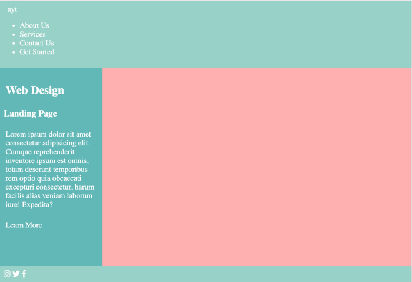

# Flexbox vs. CSS Grid

## ou

# CSS Grid + Flexbox

Pódes usar por separado tanto [CSS Grid](https://developer.mozilla.org/es/docs/Web/CSS/CSS_Grid_Layout) como [Flexbox](https://medium.com/swlh/how-i-use-flexbox-to-create-a-one-page-website-81db78e61738) para o deseño dunha páxina web, pero en outros moitos casos se poden usar a un tempo, explotando as caracteristicas de cada un deles onde sexan máis operativas ou convenientes. 

Neses casos, e sen que sexa unha norma xeral, CSS Grid adoita usarse para deseños estruturais de páxina mentres que Flexbox adoita usarse para aliñar os elementos da UI. 

Para ver como se desenvolve isto en código real imos crear unha pequena páxina web.


## Paso 1:<br>planificar antes de codificar

O truco para non dar paus de cego ao codificar é planificar previamente.

&larr; *Partimos dun deseño xenérico e sinxelo*
Primeiro se identifican os elementos pai e fillo en función da idea de deseño que se quere representar. 


### Determinar o número de filas

Ordear os elementos da páxina horizontalmente, vendo cantas filas se precisan para distribuilos. 

*Debuxa os elementos como caixas. Os que están na mesma liña horizontal (imaxinaria) estarán na mesma fila, por exemplo `aside`, e `article`.*


---


### Determinar o número de columnas

Ordear os elementos en grupos verticalmente. Os elementos ao longo da mesma liña vertical (imaxinaria) consideraranse na mesma columna.

*Ter en conta que a herda da grella só chega aos fillos directos do contedor da grella; así os elementos dentro de `article` serán ignorados e xa non herdarán nada da mesma.*


---

## Crear unha guía

Despois de determinar o número de columnas e filas, temos unha guía que poderemos seguir ao codificar. Marca as liñas da grella e anota os elementos pai e fillo.


---

# Paso 2: comenzar co HTML

<!-- Como se trata dun esquema sinxelo podes escribir todo o html e logo traballar no CSS.-->

---

```html
...
  <div class="grid-wrapper">
    <header>
      Header
    </header>
    <aside>
      <h4>Aside</h4>
      <p>Lorem ipsum dolor sit amet consectetur adipisicing elit. Cumque reprehenderit inventore ipsum est omnis, totam deserunt temporibus rem optio quia obcaecati excepturi consectetur, harum facilis alias veniam laborum iure! Expedita?</p>
    </aside>
    <article>
      <h1>Article</h1>
      <p>Lorem ipsum dolor sit amet consectetur adipisicing elit. Inventore commodi ratione pariatur eius et ullam odio temporibus corrupti autem atque quaerat soluta saepe, ex dolorum laboriosam dolore minus repudiandae. Iste! Odit velit amet quisquam ut
        placeat quia tempore molestiae consectetur ab facilis eius necessitatibus veniam autem, veritatis magnam magni ea tempora et. Perferendis molestiae cum saepe voluptas tenetur aperiam optio! Corporis officia consectetur ipsa explicabo ipsum debitis.
        Voluptate excepturi aspernatur ipsa recusandae aliquam tempore officiis ullam quis, enim eveniet magnam amet unde temporibus veniam, culpa reiciendis aliquid corrupti! Quaerat, magni.</p>
      <div class="flex-wrapper">
        <span class="image">test</span>
        <span class="image">test</span>
        <span class="image">test</span>
      </div>
    </article>
    <footer>Footer</footer>
  </div>
  ...
```

---

# Paso 3: crear a folla de estilos CSS e enlazala co arquivo html.

Tamén podes engadir algún reset á folla de estilos, ou importar algun recurso para usar na páxina: fontes, iconas,...

```css
/*  reset xenerico - mellorar en proxectos complexos */
* {
  margin: 0;
  padding: 0;
}

/* determinar a altura do elemento raíz - root */
html, body {
  height: 100%;
}
```

---

## Crear a cuadrícula

> CSS Grid pode ser intimidante ao principio xa que hai varias formas de crear unha grella. <!-- Polo tanto, é menos confuso manter unha sintaxe determinada ao aprender. -->

```css
.grid-wrapper {
  display: grid; /* declaración da raíz da grella*/
  grid-column: 1/3;
}
```

Isto transfórma  `div.grid-wrapper` nun contedor de grella. Os seus fillos directos son agora elementos da cuadrícula. Sen embargo os elementos que están dentro dos seus fillos directos non se verán afectados.

---

A continuación, especificamolo ancho das filas e a altura das columnas da grella.

- **Filas:** faremos que `header` e `footer` se expandan para cubrir o ancho total da páxina:

```css
aside, article, footer {
  /* indicamos as areas da grella e o seu comportamento */
  grid-template-rows: min-content auto min-content;
}
```

- **Columnas:** queremos que `aside` ocupe 1/4 do ancho da páxina e `article` o resto:

```css
grid-template-columns: 1fr 3fr;
```

> A unidade `fr` representa unha fracción do espazo dispoñible no contedor da grella. En canto a `header`e `footer`, non teño que pensar nelas xa que se espallaban polas dúas columnas, ocupando un ancho de `4fr`.

---

## Colocar os elementos nas celas da grella

Especificar o tamaño de cada elemento da cuadrícula e a posición de localización usando as propiedades `grid-column` e `grid-row`.

O encabezado e o pé de páxina cubrirán a área de 2 columnas. A modo longo de `grid-column: 1/3` é:

```css
grid-column-start: 1;
grid-column-end: 3;
```

Só significa que comeza na primeira liña vertical e remata na terceira liña vertical.

---

Así mesmo, a declaración `grid-row: 2/3`significa que comeza na segunda liña horizontal e remata na terceira liña horizontal.

```css
grid-row-start: 2;
grid-row-end: 3;
```

---

```css
aside {
  grid-column: 1/2;
  grid-row: 2/3;
  background-color: #5EB7B7;
}

header {
  grid-column: 1/3;
  grid-row: 1/2;
  background-color: #96D1C7;
}

footer {
  grid-column: 1/3;
  grid-row: 3/4;
  background-color: #96D1C7;
}

article {
  grid-column: 2/3;
  grid-row: 2/3;
  background-color: #FC7978;
}
```

---


---

## Creando ``flex-container`` e ``flex-child``

A continuación, traballamos no espazo entre os elementos dentro de `article`.

Un `div` coa clase `flex-wrap` é a envoltura arredor dos elementos de clase `image`. 

```css
. flex-wra {
    display: flex;
}
```

*Non é necesario cambiar a dirección dos elementos flexibles, xa que estarán dispostos de esquerda a dereita por defecto*.

---

Para mellorar a capacidade de resposta da páxina, comporbamos que o ancho dos elementos flexibles se axuste segundo o ancho da páxina. 

Isto pódese conseguir configurando as tres imaxes `flex-grow: 1 `.

```css
.image{
  background-color: #ccc;
  flex-grow: 1;
  margin-bottom: 20px
}
```

---


---

## Vista móbil

En móbiles, tendemos a colocar as cousas cara abaixo en lugar de dispoñelas lateralmente xa que o tamaño da pantalla é limitado. Para conseguilo:

Engade unha consulta multimedia para aplicar `display: block`no meu contedor de reixa cando o tamaño da pantalla sexa pequeno. Ese é un xeito moi bo non?

```css
@media (max-width: 600px) {
.grid-wrapper { 
  display: block;
 }
}
```


---

Os elementos flexibles dentro de `article` necesitan máis traballo xa que aínda están dispostos nunha fila. Para cambiar de fila a columna, `flex-direction: column `

```css
@media (max-width: 600px) {
...

.flex-wrap {
  flex-direction: column;
}
...
}
```

---


Para fins de estilo, tamén engadimos un `margin-bottom`a cada elemento flexible para crear un espazo entre as imaxes.

```css
@media (max-width: 600px) {
...

.image {
  margin-bottom: 12px
}
.image:last-child{
  margin-bottom: 20px
}
}
```


---

Como sempre, o último paso será comprobar se hai algún problema de aliñamento en diferentes puntos de interrupción cambiando o ancho do navegador.


---

```css
aside, header, footer, article, span {
  padding: 10px;
}

html, body {
  height: 100%;
  margin: 0;
}

body {
  color: white;
  font-family: sans-serif;
  font-size: 1.2em;
}

.grid-wrapper {
  /*changed the height from 100% to auto as the layout breaks when the height of the content 'overflows'.*/
  height: auto;
  display: grid;
  grid-template-columns: 1fr 3fr;
  grid-template-rows: min-content auto min-content;
  background-color: #FFAFB0;
}

aside {
  grid-column: 1/2;
  grid-row: 2/3;
  background-color: #5EB7B7;
}

header {
  grid-column: 1/3;
  grid-row: 1/2;
  background-color: #96D1C7;
}

footer {
  grid-column: 1/3;
  grid-row: 3/4;
  background-color: #96D1C7;
}

article {
  grid-column: 2/3;
  grid-row: 2/3;
/*   background-color: #FC7978; */
  border: 1px solid black;
}

.flex-wrapper {
  display: flex; 
}

.image {
  display: inline-block;
  height: 1500px;
  margin: 1500px;
  background-color: #D6D5D5;
  flex-grow: 1;
  margin: 0 20px;
}

h1, h4, p {
  padding: 5px;
}

 @media only screen and (max-width: 850px) {

   /*changes to code to arrange aside below article. */
 .grid-wrapper {
     display: flex;
     flex-direction: column;
   } 
   
   aside {
     order: 1
   }
   
   footer {
     order: 2;
   }
   
   /*end of changes*/
   
   .flex-wrapper {
    flex-direction: column;
  }
   
   .image {
     margin-bottom: 20px;
   }
}
```

---

## Reixa

- `display: grid`
- `grid-template-columns`e `grid-template-rows`(nótese na forma plural)
- `grid-column`e `grid-row`(nótese na forma singular)

## Flexbox

- `display: flex`
- `flex-direction`
- `flex-grow`

---


> **Nota posterior:**
>
> Editei o CSS no meu CodePen despois de dous comentarios de dous lectores. Grazas aos dous!
>
> \- nas liñas 68 a 79 para cambiar a orde de vista `aside`e `article`na vista móbil.
>
> \- na liña 18 para cambiar a altura do 100% a automática. Isto evitará que o deseño se rompa cando o contido do envoltorio de grade desborde.
>
> Tamén publiquei a [parte 2 deste artigo](https://medium.com/@lim.aliceyt/how-i-use-css-grid-and-flexbox-to-create-a-one-page-website-part-2-e575edb422fe) onde modifiquei o modelo para crear un sitio real. Lea se estás interesado!

---

# 2

## Coa axuda do modelo creado na parte 1

Crear un sitio web desde cero pode levar moito tempo. Non obstante, dado que moitos sitios web teñen un aspecto estándar, podemos reducir o tempo de desenvolvemento creando os nosos propios modelos que podemos crear e modificar cando sexa necesario.

---


---

<!-- O modelo que estou a usar é do meu [último artigo sobre como uso CSS Grid e Flexbox para crear un sitio web dunha soa páxina](https://medium.com/swlh/how-i-use-css-grid-and-flexbox-to-create-a-one-page-website-262aeea3592a) .-->


---

# Paso 1. Planificación antes de codificar

Axustar o deseño:

```
header
```

- Engadir envoltorio de navegación e ligazóns de navegación na esquina dereita.
- Cambiar a navegación a un contedor flexible para que as ligazóns de navegación se mostren nunha fila nunha pantalla grande e nunha columna nunha pantalla pequena.
- Engadir un logotipo na esquina superior esquerda.

---

```
aside
```

- Conservar `aside` para o contido destacado.
- Engadir un subtítulo con texto - en maiúsculas.
- Cambiar a contedor flexible para que poida usar ``flex-grow`` para encher o espazo

---

```
article
```

- Cambia `article` a `div` para incluir unha imaxe destacada.
- Engadir imaxe usando a propiedade `background-image` xa que buscamos que cambie o tamaño segundo o tamaño da pantalla.
- Elimina o resto de contido.

---

```
footer
```

- Engadir tres iconas e aliñalas no lado esquerdo.

---

# Paso 2. Modificar HTML e CSS

Tendo en conta os cambios anteriores, vexamos como queda o HTML e o CSS.

---

```html
<body>
  <div class="grid-wrapper">
    <header>
      <span class="logo">XTC</span>
        <ul id="navigation">
            <li>About us</li>
            <li>Services</li>
            <li>Contact us</li>
            <li class="get-started">Get started</li>
        </ul>
    </header>
    <aside>
      <h1>Web design</h1>
      <h3>Landing page</h3>
      <p>Lorem ipsum dolor sit amet consectetur adipisicing elit. Cumque reprehenderit inventore ipsum est omnis, totam deserunt temporibus rem optio quia obcaecati excepturi consectetur, harum facilis alias veniam laborum iure! Expedita?</p>
        <p>Dolor sit</p>
    </aside>
    <div class="background"></div>
    <footer>
        <i class="fab fa-instagram"></i>
        <i class="fab fa-twitter"></i>
        <i class="fab fa-facebook-f"></i>
    </footer>
  </div>
</body>
```

---


Engádir dúas etiquetas `link` na cabeceira a [Google Font](https://fonts.google.com/) e [Font Awesome](https://fontawesome.com/?from=io) para poder usar a fonte seleccionada de Google Font e iconas de Font Awesome.

---

```html
<!-- /* google fonts*/ -->
<link rel="preconnect" href="https://fonts.googleapis.com">
<link rel="preconnect" href="https://fonts.gstatic.com" crossorigin>
<link href="https://fonts.googleapis.com/css2?family=Poppins&display=swap" rel="stylesheet">

<!-- /*fontawesome*/ -->
<link rel="stylesheet" href="https://cdnjs.cloudflare.com/ajax/libs/font-awesome/6.2.1/css/all.min.css" integrity="sha512-MV7K8+y+gLIBoVD59lQIYicR65iaqukzvf/nwasF0nqhPay5w/9lJmVM2hMDcnK1OnMGCdVK+iQrJ7lzPJQd1w==" crossorigin="anonymous" referrerpolicy="no-referrer" />
```

---



## Modificar os estilos &rarr;

---

```
body
```

Cambiar a fonte predeterminada.

No selector do corpo. Como as propiedades da fonte son propiedades herdadas, esta aplicarase a fonte especificada en toda a páxina web a non ser que o anule.

---

```
header
```

- Engadir un logotipo na esquina superior esquerda.
- Manter o menu a dereita

Para crear un deseño onde os dous elementos se coloquen en extremos opostos, transformar ``header`` nun contedor de cuadrícula.

---

```css
header {
 display: grid;
 grid-template-columns: 1fr 1fr;
}
```

Os elementos dentro de ``header``, o logotipo e as ligazóns de navegación, agora son elementos de grade.

---


---

- Cambiar a navegación a un contedor flexible para que as ligazóns de navegación se mostren nunha fila nunha pantalla grande e nunha columna nunha pantalla pequena.

```css
#nav{
   display: flex
} 
```

---

- Engadir envoltorio de navegación e ligazóns de navegación na esquina dereita.

- Engadir `justify-content: flex-end` para empuxar as ligazóns de navegación ao final da fila.

- Quitar o estilo de lista nas ligazóns de navegación coa declaración `list-style-type:none`.

---

```
aside
```

- Engadir un subtítulo con texto en maiúscula.

Para o subtítulo, declarar

 `text-transform: uppercase`

 para cambiar o texto a maiúscula. 

- Aumentar o tamaño de letra predeterminado do título e do subtítulo para que destaquen na páxina.

- En canto ás cores, reutilizar as cores máis escuras da imaxe destacada para as cores das fontes para manter a paleta de cores consistente.

- Ampliar a posición de `aside` para superpoñelo coa cabeceira cambiando a propiedade `grid-column`. Isto é para subir o contido xa que o deseño parece desequilibrado doutro xeito.

---


---

```
.background
```

- Cambiar `article` a `div` para conter a imaxe destacada.

- Cambiar `article` polo selector `div.background` e no HTML reemprazar `article` por `div class="background"`.

- Engadir a imaxe usando a propiedade `background-image ` para que cambie o tamaño segundo o tamaño da pantalla.

---


<!-- Deseñado por [Freepik](http://www.freepik.com/) -->

---

```css
.background {
  background-image: url("/background2.png");
  background-size: cover;
  background-position: left center;
  background-repeat: no-repeat;
}
```

- O valor de `cover` para `background-size` escala a imaxe sen deformala. Posicionamento da imaxe  `background-position: left center`.

- Cambiar a posición do novo selector  `.background` na grella para que a imaxe se solape cos `header` e `footer`.

---

```
footer
```

- Engadir tres iconas en HTML - se aliñaran no lado esquerdo por defecto-. Espacialos aumentando as marxes entre as iconas.

```css
.fab { 
font-size: 1,5rem; 
margin: 10px; 
}
```

Unha vista previa do sitio. (Hai que facer algún traballo máis antes de poder dalo por rematado).

---


---

- Eliminar as cores de fondo do modelo orixinal.
- Cambiar a cor do tipo de letra a negro declarando `color: black` no selector `body`.

De novo, confiamos nas propiedades herdadas onde a cor da fonte será herdada polos fillos do elemento `body` (e netos e bisnetos... etc.).

---


---

**Unha ligazón con estilo como un botón**

- Engadir estilos á ligazón de navegación para *Comezar*. `color: white`

- Engadir unha altura e un ancho ao logotipo e convertelo nun círculo usando a propiedade `border-radius`.

*Sempre que a altura e a anchura teñan a mesma lonxitude e o raio do bordo teña un valor igual ou superior ao 50 %, o elemento transformarase dun cadrado a un círculo.*

---


---

- cambiar a propiedade `z-index` do logotipo
- ou cambiar o `z-index` da cabeceira, que establece ao mesmo tempo o `z-index` dos seus fillos, é dicir, as ligazóns de navegación.

Como os elementos superpostos cun `z-index` maior cobren os que teñen un máis pequeno, damos un valor de 1 para que sexa superior ao valor da imaxe.

---


---


---

# Vista móbil

a imaxe destacada desaparece na vista do móbil?

Isto ocorre porque eliminamos a grella cando a páxina se mostra nunha pantalla pequena e o div que contén a imaxe agora ten unha altura de 0 xa que non lle declaramos unha altura nin ten contido `real`.

En lugar de engadirlle algo de altura, imos redeseñar a vista móbil.

---

Engadir a imaxe usando a propiedade `background-image` do selector  `.grid-wrapper` e cambiamos o deseño de navegación de fila a columna.

Ter en conta que usaremos outra imaxe na que non se eliminaron os bordos. A imaxe anterior non se pode usar debido á `background-blend-mode`propiedade que vou usar.

```css
.grid-wrapper {
  background-image: url(“/background.jpg”);
  background-size: cover;
  background-position: center;
  background-color: lightgray;
  background-blend-mode: screen;
}
```

---


Agora, o texto non se pode ler facilmente contra a imaxe debido ao choque de cores. Polo tanto, o xeito máis sinxelo é desvanecer as cores da imaxe de fondo. Non podo usar a propiedade `opacity` xa que iso tamén esvae o texto. Polo tanto, podemos usar o seguinte método:

- Engadir unha cor de fondo máis clara á imaxe de fondo e mestúraas ambas aplicando a declaración `background-blend-mode: screen`.

---

Aínda no texto, reduzo o espazo entre letras do subtítulo "Páxina de destino" para que se poida mostrar nunha soa liña.

---


---

# Segunda revisión

A continuación, comprobar outros puntos de interrupción comprobando os diferentes tamaños de pantalla usando Chrome [DevTools](https://developers.google.com/web/tools/chrome-devtools) .

Caramba... O meu pé de páxina xa non está fixado na parte inferior da páxina despois de que elimine a grade na vista móbil. Parece ben pero son un pouco esixente.

---


---

Para solucionar este problema, cambio `.grid-wrapper` a un contedor flexible e engadir un crecemento flexible a `aside` para que o pé de páxina volva ao fondo.

---

```css
.grid-wrapper {
  display: flex;
  flex-direction: column;
}
aside {
  flex-grow: 1;
}
```

---


## Final

```html
<!DOCTYPE html>
<html lang="en">
  <head>
    <meta charset="UTF-8" />
    <meta name="viewport" content="width=device-width, initial-scale=1.0" />
    <meta http-equiv="X-UA-Compatible" content="ie=edge" />
    <link
      href="https://fonts.googleapis.com/css?family=Poppins&display=swap"
      rel="stylesheet"
    />
    <link rel="stylesheet" href="main.css" />
    <link
      rel="stylesheet"
      href="https://use.fontawesome.com/releases/v5.5.0/css/all.css"
      integrity="sha384-B4dIYHKNBt8Bc12p+WXckhzcICo0wtJAoU8YZTY5qE0Id1GSseTk6S+L3BlXeVIU"
      crossorigin="anonymous"
    />

    <title>ayt - demo</title>
  </head>
  <body>
    <div class="grid-wrapper">
      <header>
        <span class="logo">a</span>
        <ul id="navigation">
          <li>About Us</li>
          <li>Services</li>
          <li>Contact Us</li>
          <li class="get-started">Get Started</li>
        </ul>
      </header>
      <aside>
        <h1>Web Design</h1>
        <h3>Landing Page</h3>
        <p>
          Lorem ipsum dolor sit amet consectetur adipisicing elit. Cumque
          reprehenderit inventore ipsum est omnis, totam deserunt temporibus rem
          optio quia obcaecati excepturi consectetur, harum facilis alias veniam
          laborum iure! Expedita?
        </p>
        <p class="button">Learn More</p>
      </aside>
      <div class="background"></div>
      <footer>
        <i class="fab fa-instagram"></i>
        <i class="fab fa-twitter"></i>
        <i class="fab fa-facebook-f"></i>
        <span class="sign-off">
          Created by
          <a href="https://medium.com/@lim.aliceyt">aliceyt</a>.
        </span>
      </footer>
    </div>
  </body>
</html>
```

---

```css
aside,
header,
footer,
article,
span {
  padding: 10px;
}

html,
body {
  height: 100%;
  margin: 0;
}

body {
  font-family: san-serif;
  font-size: 1.2em;
}

.grid-wrapper {
  height: 100%;
  display: grid;
  grid-template-columns: 1fr 3fr;
  grid-template-rows: min-content auto min-content;
}

aside {
  grid-column: 1/2;
  grid-row: 2/3;
}

header {
  grid-column: 1/3;
  grid-row: 1/2;
}

footer {
  grid-column: 1/3;
  grid-row: 3/4;
}

.flex-wrapper {
  display: flex;
}

h1,
p {
  padding: 5px;
}

@media only screen and (max-width: 850px) {
  .grid-wrapper {
    display: block;
  }

  .flex-wrapper {
    flex-direction: column;
  }

  .image {
    margin-bottom: 20px;
  }
}

/*additional styles*/

body {
  font-family: -apple-system, BlinkMacSystemFont, "Segoe UI", Roboto, Oxygen,
    Ubuntu, Cantarell, "Open Sans", "Helvetica Neue", sans-serif;
  font-size: 1rem;
}

header {
  display: grid;
  grid-template-columns: 1fr 1.5fr;
  z-index: 1;
}

.logo {
  font-size: 1.3rem;
  grid-column: 1/2;
  grid-row: 1/3;
  background-color: #5d6bc0;
  width: 30px;
  height: 30px;
  text-align: center;
  color: white;
  border-radius: 50%;
  margin: 10px;
}

li {
  list-style-type: none;
  display: inline;
  padding: 0 10px;
}

#navigation {
  grid-column: 2/3;
  grid-row: 1/2;
  display: flex;
  justify-content: flex-end;
  font-weight: 700;
}

aside {
  grid-column: 1/2;
  grid-row: 1/3;
  display: flex;
  flex-direction: column;
  justify-content: center;
  z-index: 3;
}

h1 {
  font-size: 6.5rem;
  margin: 0;
  color: #074fe2;
  line-height: 5rem;
  margin: 15px 0;
}

h3 {
  margin: 0;
  text-transform: uppercase;
  letter-spacing: 1rem;
  color: #03b19f;
}

.button {
  width: 30%;
  padding: 10px;
  font-size: 1rem;
  border-radius: 20px;
  text-align: center;
  font-weight: 700;
  background-color: #074fe2;
  box-shadow: 0 2px 2px 0 rgba(0, 0, 0, 0.14),
    0 3px 1px -2px rgba(0, 0, 0, 0.12), 0 1px 5px 0 rgba(0, 0, 0, 0.2);
  color: white;
}

.get-started {
  padding: 2px 10px;
  background-color: #074fe2;
  color: white;
  text-transform: uppercase;
  border-radius: 20px;
}

.background {
  grid-column: 2/3;
  grid-row: 1/4;
  background-image: url("./background2.png");
  background-size: cover;
  background-position: left center;
  background-repeat: no-repeat;
}

.fab {
  font-size: 1.4rem;
  margin: 10px;
}

@media only screen and (max-width: 850px) {
  .grid-wrapper {
    background-image: url("./background.jpg");
    background-size: cover;
    background-position: center;
    background-color: lightgray;
    background-blend-mode: screen;
    display: flex;
    flex-direction: column;
  }

  h1 {
    font-size: 5.5rem;
    margin-top: 0;
    padding-top: 10px;
  }

  h3 {
    letter-spacing: 0.8rem;
  }

  ul {
    flex-direction: column;
    text-align: right;
    width: 150px;
    justify-self: end;
    margin: 0;
  }

  li {
    padding: 1px 5px 1px 0;
  }

  li:last-child {
    margin: 5px 0;
    display: block;
  }

  aside {
    flex-grow: 1;
  }
}

.sign-off {
  font-weight: 700;
}
```


---

- [Basic Concepts of Flexbox by MDN](https://developer.mozilla.org/en-US/docs/Web/CSS/CSS_Flexible_Box_Layout/Basic_Concepts_of_Flexbox)
- [Flexbox by MDN](https://developer.mozilla.org/en-US/docs/Learn/CSS/CSS_layout/Flexbox)
- [CSS Grid Layout by MDN](https://developer.mozilla.org/en-US/docs/Web/CSS/CSS_Grid_Layout)
- https://css-tricks.com/snippets/css/complete-guide-grid/
- [CSS Grid vs. Flexbox: Which Should You Use and When? (tutsplus.com)](https://webdesign.tutsplus.com/articles/flexbox-vs-css-grid-which-should-you-use--cms-30184)
- [Grid vs. Flexbox: What to Use and When? (octobot.io)](https://www.octobot.io/blog/grid-vs-flexbox/)

- [Understanding the CSS Grid Layout Module](https://webdesign.tutsplus.com/series/understanding-the-css-grid-layout-module--cms-1079)
- [A Comprehensive Guide to Flexbox Ordering & Reordering](https://webdesign.tutsplus.com/tutorials/a-comprehensive-guide-to-flexbox-ordering-reordering--cms-31564)
- [A Comprehensive Guide to Flexbox Sizing](https://webdesign.tutsplus.com/tutorials/a-comprehensive-guide-to-flexbox-sizing--cms-31948)
- [A Comprehensive Guide to Flexbox Alignment](https://webdesign.tutsplus.com/tutorials/a-comprehensive-guide-to-flexbox-alignment--cms-30183)
- https://medium.com/swlh/how-i-use-flexbox-to-create-a-one-page-website-81db78e61738
- https://betterprogramming.pub/how-i-use-css-grid-and-flexbox-to-create-a-one-page-website-part-2-e575edb422fe
- Xeradores:
  - https://dev.to/theme_selection/css-grid-generator-55l9

---

xan2023
