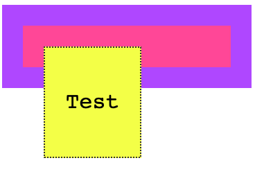
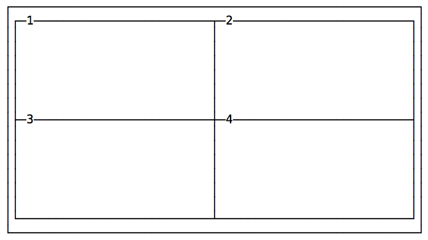
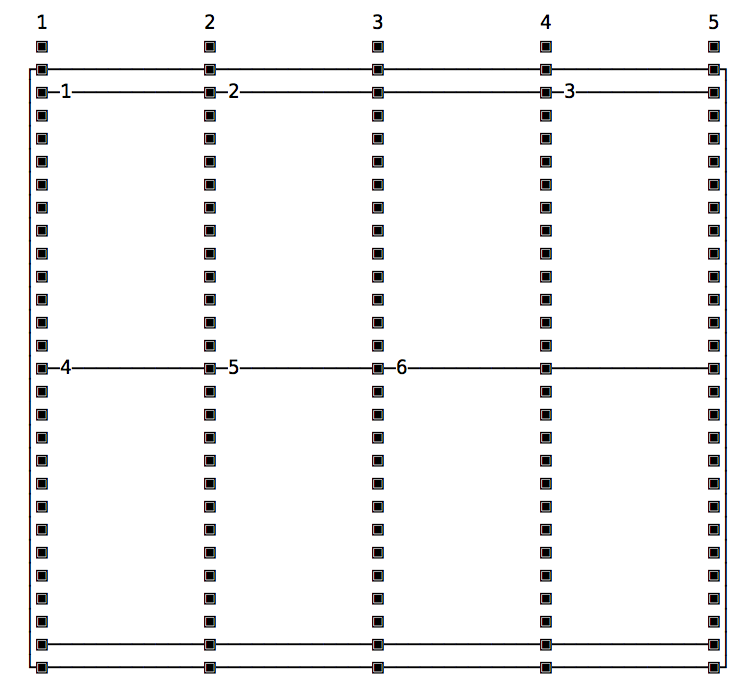
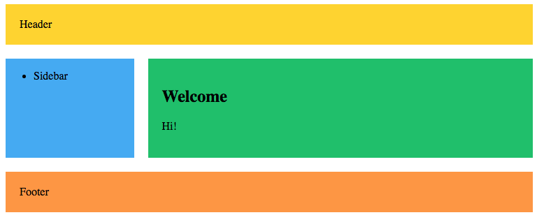
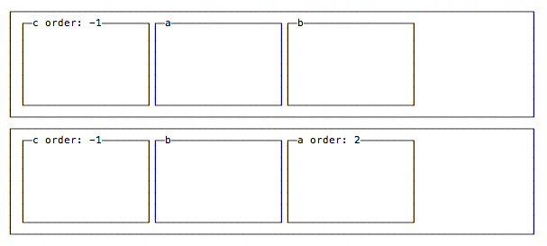
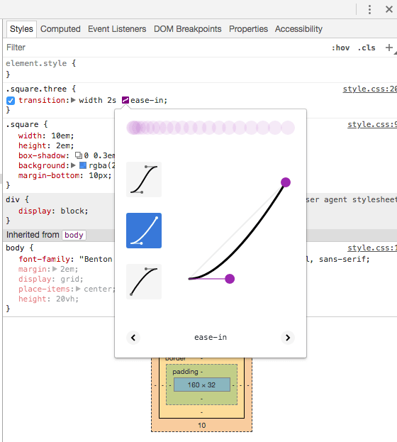
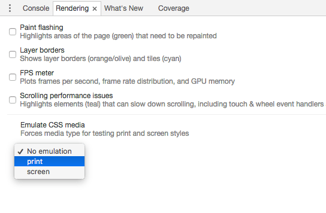

# Follas de estilo en cascada. CSS

CSS, abreviatura de follas de estilo en cascada, é un dos principais bloques de construción da web. A súa historia remóntase aos anos 90 e xunto co HTML cambiou moito dende os seus humildes inicios.

Creando sitios web desde antes de que existise CSS, vin a súa evolución.

CSS é unha ferramenta incrible, e nos últimos anos creceu moito,  introducindo moitas funcións fantásticas como CSS Grid, Flexbox e CSS  Custom Properties.

Este manual está dirixido a un público amplo.

Primeiro, o principiante. Explico CSS desde cero dunha forma sucinta pero completa, para que poidas usar este libro para aprender CSS dende o básico.

Despois, o profesional. A miúdo considérase CSS como unha cousa secundaria para aprender, especialmente polos desenvolvedores de JavaScript. Saben que CSS non é unha linguaxe de programación real, son programadores e,  polo tanto, non deberían molestarse en aprender CSS da forma correcta. Tamén escribín este libro para ti.

A continuación, a persoa que coñece CSS desde hai uns anos pero que non tivo a oportunidade de aprender cousas novas nel. Falaremos amplamente das novas funcionalidades de CSS, as que van construír a web da vindeira década.

CSS mellorou moito nos últimos anos e está a evolucionar rapidamente.

Aínda que non escribas CSS para gañar a vida, saber como funciona CSS pode  axudarche a aforrarche algúns dores de cabeza cando necesites entendelo  de cando en vez, por exemplo mentres modificas unha páxina web.

**CSS** (abreviatura de **Cascading Style Sheets** ) é a linguaxe que usamos para dar estilo a un ficheiro HTML e  indicarlle ao navegador como debe renderizar os elementos da páxina.

> Neste libro falo exclusivamente sobre estilos de documentos HTML, aínda que CSS tamén se pode usar para estilizar outras cousas.

Un ficheiro CSS contén varias regras CSS.

Cada regra está composta por 2 partes:

- o **selector**
- o **bloque de declaración**

O selector é unha cadea que identifica un ou máis elementos da páxina,  seguindo unha sintaxe especial da que pronto falaremos extensamente.

O bloque de declaración contén unha ou máis **declaracións** , á súa vez compostas por un par **propiedade** e **valor** .

Esas son todas as cousas que temos en CSS.

Organizar coidadosamente as propiedades, asociándoas valores e anexalas a  elementos específicos da páxina mediante un selector é o argumento  completo deste libro electrónico.

## 2. Introdución ao CSS

### 2.1. Como se ve o CSS

**Un conxunto de regras** CSS ten unha parte chamada **selector** , e a outra parte chamada **declaración** . A declaración contén varias **regras** , cada unha composta por unha **propiedade** e un **valor** .

Neste exemplo, `p`é o selector e aplica unha regra que establece o valor `20px`da `font-size`propiedade:

```css
p {
  font-size: 20px;
}
```

Apiláronse varias regras unha tras outra:

```css
p {
  font-size: 20px;
}

a {
  color: blue;
}
```

Un selector pode apuntar a un ou máis elementos:

```css
p, a {
  font-size: 20px;
}
```

e pode orientar etiquetas HTML, como a anterior, ou elementos HTML que conteñan un determinado atributo de clase con `.my-class`, ou elementos HTML que teñan un `id`atributo específico con `#my-id`.

Os selectores máis avanzados permítenche escoller elementos cuxo atributo  coincida cun valor específico, ou tamén elementos que responden a  pseudo-clases (máis detalles máis adiante)

### 2.2. Punto e coma

Cada regra CSS remata cun punto e coma. **Os puntos e coma non** son opcionais, excepto despois da última regra, pero suxiro que os uses sempre para a  coherencia e para evitar erros se engades outra propiedade e esquezas  engadir o punto e coma na liña anterior.

### 2.3. Formato e sangría

Non hai ningunha regra fixa para o formato. Este CSS é válido:

```css
p {
           font-size: 20px;}

a {color: blue;
}
```

pero unha dor ver. Cómprese con algunhas convencións, como as que ves nos exemplos anteriores: os  selectors de paus e os corchetes de peche á esquerda, sangría 2 espazos  para cada regra, teñen o corchete de apertura na mesma liña do selector, separados por un espazo.

O uso correcto e coherente do espazado e da sangría é unha axuda visual para comprender o código.

## 3. Unha breve historia do CSS

Antes de continuar, quero darche un breve resumo da historia de CSS.

CSS naceu pola necesidade de dar estilo ás páxinas web. Antes de que se presentase CSS, a xente quería un xeito de dar estilo ás súas páxinas web, que parecían moi similares e "académicas" no seu día. Non podes facer moito en termos de personalización.

HTML 3.2 introduciu a opción de definir cores en liña como atributos de elementos HTML e etiquetas de presentación como `center`e `font`, pero iso pasou rapidamente a unha situación que non era ideal.

CSS permítenos mover todo o relacionado coa presentación do HTML ao CSS,  para que HTML poida volver ser o formato que define a estrutura do  documento, en lugar de como deberían verse as cousas no navegador.

O CSS está a evolucionar continuamente e o CSS que usaches hai 5 anos  quizais estea desactualizado, xa que xurdiron novas técnicas CSS  idiomáticas e cambiaron os navegadores.

É difícil imaxinar os tempos nos que naceu CSS e o diferente que era a web.

Daquela tiñamos varios navegadores competidores, sendo os principais Internet Explorer ou Netscape Navigator.

As páxinas estileron usando HTML, con etiquetas de presentación especiais como `bold`e atributos especiais, a maioría dos cales agora están en desuso.

Isto significaba que tiñas unha cantidade limitada de oportunidades de personalización.

A maior parte das decisións de estilo deixáronse ao navegador.

Ademais, construíches un sitio especificamente para un deles, porque cada un  introduciu etiquetas non estándar diferentes para dar máis poder e  oportunidades.

Pronto a xente deuse conta da necesidade dunha forma de dar estilo ás páxinas, dun xeito que funcionase en todos os navegadores.

Despois da idea inicial proposta en 1994, CSS obtivo o seu primeiro lanzamento  en 1996, cando se publicou a recomendación CSS Level 1 ("CSS 1").

CSS Level 2 ("CSS 2") publicouse en 1998.

Desde entón, comezou a traballar no nivel 3 de CSS. O grupo de traballo de  CSS decidiu dividir cada función e traballar nela por separado, en  módulos.

Os navegadores non foron especialmente rápidos á hora de implementar CSS. Tivemos que esperar ata 2002 para que o primeiro navegador implementase a  especificación CSS completa: IE para Mac, como se describe ben nesta  publicación de Trucos CSS: [https://css-tricks.com/look-back-history-css/](https://css-tricks.com/look-back-history-css/)

Internet Explorer implementou o modelo de caixa de forma incorrecta dende o  principio, o que provocou anos de dor tentando aplicar o mesmo estilo de forma consistente en todos os navegadores. Tivemos que usar varios trucos e trucos para que os navegadores renderizaran as cousas como queriamos.

Hoxe as cousas están moito, moito mellor. Podemos simplemente usar os estándares CSS sen pensar en peculiaridades, a maioría das veces, e CSS nunca foi máis poderoso.

Xa non temos números de versión oficiais para CSS, pero o Grupo de  Traballo CSS publica unha "instantánea" dos módulos que actualmente se  consideran estables e listos para ser incluídos nos navegadores. Esta é a última instantánea, de 2018: [https://www.w3.org/TR/css-2018/](https://www.w3.org/TR/css-2018/)

O nivel 2 de CSS segue sendo a base para o CSS que escribimos hoxe, e temos moitas máis funcións construídas sobre el.

## 4. Engadir CSS a unha páxina HTML

CSS está anexo a unha páxina HTML de diferentes xeitos.

### 4.1. 1: Usando a `link`etiqueta

A `link`etiqueta é a forma de incluír un ficheiro CSS. Esta é a forma preferida de usar CSS tal e como se pretende empregar: todas  as páxinas do teu sitio inclúen un ficheiro CSS e cambiar unha liña nese ficheiro afecta á presentación de todas as páxinas do sitio.

Para usar este método, engade unha `link`etiqueta co `href`atributo que apunte ao ficheiro CSS que quere incluír. Engádeo dentro da `head`etiqueta do sitio (non dentro da `body`etiqueta):

```
<link rel="stylesheet" type="text/css" href="myfile.css" />
```

Os atributos `rel`e `type`tamén son obrigatorios, xa que indican ao navegador a que tipo de ficheiro estamos ligando.

### 4.2. 2: usando a `style`etiqueta

En lugar de usar a `link`etiqueta para apuntar a folla de estilo separada que contén o noso CSS, podemos engadir o CSS directamente dentro dunha `style`etiqueta. Esta é a sintaxe:

```
<style>
  ...our CSS...;
</style>
```

Usando este método podemos evitar crear un ficheiro CSS separado. Creo que esta é unha boa forma de experimentar antes de "formalizar" CSS nun ficheiro separado ou de engadir unha liña especial de CSS só a un  ficheiro.

### 4.3. 3: estilos en liña

Os estilos en liña son a terceira forma de engadir CSS a unha páxina. Podemos engadir un `style`atributo a calquera etiqueta HTML e engadirlle CSS.

```
<div style="">...</div>
```

Exemplo:

```
<div style="background-color: yellow">...</div>
```

## 5. Selectores

Un selector permítenos asociar unha ou máis declaracións a un ou máis elementos da páxina.

### 5.1. Selectores básicos

Supoñamos que temos un `p`elemento na páxina e queremos mostrar as palabras nel usando a cor amarela.

Podemos **apuntar** a ese elemento usando este selector `p`, que apunta a todo o elemento usando a `p`etiqueta da páxina. Unha simple regra CSS para conseguir o que queremos é:

```
p {
  color: yellow;
}
```

Cada etiqueta HTML ten un selector correspondente, por exemplo: `div`, `span`, `img`.

Se un selector coincide con varios elementos, todos os elementos da páxina veranse afectados polo cambio.

Os elementos HTML teñen 2 atributos que se usan moi habitualmente dentro  de CSS para asociar estilos a un elemento específico da páxina: `class`e `id`.

Hai unha gran diferenza entre estes dous: dentro dun documento HTML pode repetir o mesmo `class`valor en varios elementos, pero só pode usar un `id`unha vez. Como corolario, usando clases pode seleccionar un elemento con 2 ou máis  nomes de clases específicos, algo que non é posible usando ids.

As clases identifícanse mediante o `.`símbolo, mentres que os identificadores utilizan o `#`símbolo.

Exemplo usando unha clase:

```
<p class="dog-name">Roger</p>
.dog-name {
  color: yellow;
}
```

Exemplo usando un ID:

```
<p id="dog-name">Roger</p>
#dog-name {
  color: yellow;
}
```

### 5.2. Combinación de selectores

Ata agora vimos como orientar un elemento, unha clase ou un id. Imos introducir selectores máis potentes.

#### 5.2.1. Orientación a un elemento cunha clase ou id

Podes apuntar a un elemento específico que teña unha clase ou identificador adxunto.

Exemplo usando unha clase:

```
<p class="dog-name">Roger</p>
p.dog-name {
  color: yellow;
}
```

Exemplo usando un ID:

```
<p id="dog-name">Roger</p>
p#dog-name {
  color: yellow;
}
```

Por que queres facelo, se a clase ou o identificador xa proporciona unha forma de orientar ese elemento? Pode que teñas que facelo para ter máis especificidade. Veremos o que significa máis adiante.

#### 5.2.2. Orientado a varias clases

Podes orientar un elemento cunha clase específica usando `.class-name`, como viches anteriormente. Podes orientar un elemento con 2 (ou máis) clases combinando os nomes de clases separados cun punto, sen espazos.

Exemplo:

```
<p class="dog-name roger">Roger</p>
.dog-name.roger {
  color: yellow;
}
```

#### 5.2.3. Combinando clases e identificadores

Do mesmo xeito, podes combinar unha clase e unha identificación.

Exemplo:

```
<p class="dog-name" id="roger">Roger</p>
.dog-name#roger {
  color: yellow;
}
```

### 5.3. Agrupación de selectores

Pode combinar selectores para aplicar as mesmas declaracións a varios selectores. Para iso, sepáraos cunha coma.

Exemplo:

```
<p>My dog name is:</p>
<span class="dog-name"> Roger </span>
p,
.dog-name {
  color: yellow;
}
```

Podes engadir espazos nesas declaracións para que sexan máis claras:

```
p,
.dog-name {
  color: yellow;
}
```

### 5.4. Siga a árbore de documentos cos selectores

Vimos como orientar un elemento da páxina mediante un nome de etiqueta, unha clase ou un identificador.

Podes crear un selector máis específico combinando varios elementos para seguir a estrutura da árbore do documento. Por exemplo, se tes unha `span`etiqueta aniñada dentro dunha `p`etiqueta, podes apuntar a esa sen aplicar o estilo a unha `span`etiqueta non incluída nunha `p`etiqueta:

```
<span> Hello! </span>
<p>
  My dog name is:
  <span class="dog-name"> Roger </span>
</p>
p span {
  color: yellow;
}
```

Mira como usamos un espazo entre as dúas fichas `p`e `span`.

Isto funciona aínda que o elemento da dereita teña varios niveis de profundidade.

Para facer a dependencia estrita no primeiro nivel, podes usar o `>`símbolo entre as dúas fichas:

```
p > span {
  color: yellow;
}
```

Neste caso, se a `span`non é un primeiro fillo do `p`elemento, non se lle aplicará a nova cor.

Os nenos directos terán o estilo aplicado:

```
<p>
  <span> This is yellow </span>
  <strong>
    <span> This is not yellow </span>
  </strong>
</p>
```

Os selectores de irmáns adxacentes permítennos estilizar un elemento só se está precedido dun elemento específico. Facémolo usando o `+`operador:

Exemplo:

```
p + span {
  color: yellow;
}
```

Isto asignará a cor amarela a todos os elementos de span precedidos dun `p`elemento:

```
<p>This is a paragraph</p>
<span>This is a yellow span</span>
```

Temos moitos máis selectores que podemos usar:

- selectores de atributos
- pseudo selectores de clases
- selectores de pseudo elementos

Descubriremos todo sobre eles nas seguintes seccións.

## 6. Fervenza

Cascade é un concepto fundamental de CSS. Despois de todo, está no propio nome, o primeiro C de CSS - Follas de estilo en cascada - debe ser algo importante.

Qué significa?

Cascade é o proceso, ou algoritmo, que determina as propiedades aplicadas a cada elemento da páxina. Tentando converxer a partir dunha lista de regras CSS que se definen en varios lugares.

Faino tendo en conta:

- especificidade
- importancia
- herdanza
- orde no ficheiro

Tamén se ocupa de resolver conflitos.

Dúas ou máis regras CSS competidoras para a mesma propiedade aplicada ao  mesmo elemento deben elaborarse segundo a especificación CSS, para  determinar cal hai que aplicar.

Aínda que só teñas un ficheiro CSS cargado pola túa páxina, hai outro CSS que formará parte do proceso. Temos o navegador (axente de usuario) CSS. Os navegadores veñen cun conxunto de regras predeterminadas, todas diferentes entre os navegadores.

Entón o teu CSS entra en xogo.

A continuación, o navegador aplica calquera folla de estilo de usuario,  que tamén se pode aplicar mediante extensións do navegador.

Todas esas regras entran en xogo ao renderizar a páxina.

Veremos agora os conceptos de especificidade e herdanza.

## 7. Especificidade

Que ocorre cando un elemento ten como obxectivo varias regras, con selectores diferentes, que afectan á mesma propiedade?

Por exemplo, imos falar deste elemento:

```html
<p class="dog-name">Roger</p>
```

Podemos ter

```css
.dog-name {
  color: yellow;
}
```

e outra regra que se dirixe a `p`, que establece a cor noutro valor:

```css
p {
  color: red;
}
```

E outra norma que apunta `p.dog-name`. Que regra vai ter prioridade sobre as outras, e por que?

Introduza especificidade. **A regra máis específica gañará** . Se dúas ou máis regras teñen a **mesma especificidade, gaña a última que aparece** .

Ás veces, o que é máis específico na práctica é un pouco confuso para os principiantes. Eu diría que tamén é confuso para os expertos que non miran esas regras que con frecuencia, ou simplemente as ignoran.

### 7.1. Como calcular a especificidade

A especificidade calcúlase mediante unha convención.

Temos 4 slots, e cada un deles comeza en 0: `0 0 0 0 0`. A ranura da esquerda é a máis importante e a máis dereita é a menos importante.

Igual que funciona para números do sistema decimal: `1 0 0 0`é maior que `0 1 0 0`.

#### 7.1.1. Slot 1

A primeira ranura, a máis dereita, é a menos importante.

Aumentamos este valor cando temos un **selector de elementos** . Un elemento é un nome de etiqueta. Se tes máis dun selector de elementos na regra, incrementas en consecuencia o valor almacenado neste espazo.

Exemplos:

```css
p {
} /* 0 0 0 1 */
span {
} /* 0 0 0 1 */
p span {
} /* 0 0 0 2 */
p > span {
} /* 0 0 0 2 */
div p > span {
} /* 0 0 0 3 */
```

#### 7.1.2. Slot 2

O segundo slot increméntase en 3 cousas:

- selectores de clases
- selectores de pseudo-clase
- selectores de atributos

Cada vez que unha regra cumpre unha destas, incrementamos o valor da segunda columna desde a dereita.

Exemplos:

```css
.name {
} /* 0 0 1 0 */
.users .name {
} /* 0 0 2 0 */
[href$='.pdf'] {
} /* 0 0 1 0 */
:hover {
} /* 0 0 1 0 */
```

Por suposto, os selectores do slot 2 pódense combinar cos selectores do slot 1:

```css
div .name {
} /* 0 0 1 1 */
a[href$='.pdf'] {
} /* 0 0 1 1 */
.pictures img:hover {
} /* 0 0 2 1 */
```

Un bo truco coas clases é que podes repetir a mesma clase e aumentar a especificidade. Por exemplo:

```css
.name {
} /* 0 0 1 0 */
.name.name {
} /* 0 0 2 0 */
.name.name.name {
} /* 0 0 3 0 */
```

#### 7.1.3. Espazo 3

O slot 3 contén o máis importante que pode afectar a súa especificidade CSS nun ficheiro CSS: o `id`.

Cada elemento pode ter un `id`atributo asignado, e podemos usalo na nosa folla de estilo para orientar o elemento.

Exemplos:

```css
#name {
} /* 0 1 0 0 */
.user #name {
} /* 0 1 1 0 */
#name span {
} /* 0 1 0 1 */
```

#### 7.1.4. Espazo 4

O slot 4 está afectado polos estilos en liña. Calquera estilo en liña terá prioridade sobre calquera regra definida nun ficheiro CSS externo ou dentro da `style`etiqueta na cabeceira da páxina.

Exemplo:

```css
<p style="color: red">Test</p> /* 1 0 0 0 */
```

Aínda que calquera outra regra do CSS defina a cor, esta regra de estilo en liña aplicarase. Excepto nun caso: se `!important`se usa, que enche o slot 5.

### 7.2. Importancia

A especificidade non importa se unha regra remata con `!important`:

```css
p {
  font-size: 20px !important;
}
```

Esa regra primará sobre calquera norma con máis especificidade

Engadir `!important`unha regra CSS vai facer que esa regra sexa máis importante que calquera outra regra, segundo as regras de especificidade. A única forma en que outra regra pode ter prioridade é ter `!important`tamén, e ter maior especificidade nos outros slots menos importantes.

### 7.3. Consellos

En xeral, debes usar a cantidade de especificidade que necesites, pero non máis. Deste xeito, podes crear outros selectores para sobrescribir as regras establecidas polas regras anteriores sen enloquecer.

`!important`é unha ferramenta moi debatida que nos ofrece CSS. Moitos expertos en CSS defenden o seu uso. Atópome usándoo especialmente cando probe algún estilo e unha regra CSS ten tanta especificidade que teño que usar `!important`para facer que o navegador aplique o meu novo CSS.

Pero xeralmente, `!important`non debería ter lugar nos teus ficheiros CSS.

`id`Tamén se debate moito o uso do atributo para estilo CSS, xa que ten unha especificidade moi alta. Unha boa alternativa é usar clases, que teñen menos especificidade, polo que son máis fáciles de traballar e son máis potentes (podes ter varias  clases para un elemento e unha clase pódese reutilizar varias veces).

### 7.4. Ferramentas para calcular a especificidade

Podes usar o sitio [https://specificity.keegan.st/](https://specificity.keegan.st/) para realizar o cálculo da especificidade automaticamente.

É útil especialmente se estás tentando descubrir cousas, xa que pode ser unha boa ferramenta de comentarios.

## 8. Herdanza

Cando estableces algunhas propiedades nun selector en CSS, herdanas todos os fillos dese selector.

Eu dixen *algúns* , porque non todas as propiedades mostran este comportamento.

Isto ocorre porque algunhas propiedades teñen sentido para ser herdadas. Isto axúdanos a escribir CSS de forma moito máis concisa, xa que non temos  que establecer explícitamente esa propiedade de novo en todos os fillos.

Algunhas outras propiedades teñen máis sentido para *non* ser herdadas.

Pense nos tipos de letra: non é necesario aplicar o `font-family`a cada etiqueta da súa páxina. Estableces o `body`tipo de letra da etiqueta e todos os nenos herdano, xunto con outras propiedades.

A `background-color`propiedade, por outra banda, ten pouco sentido para ser herdada.

### 8.1. Propiedades que herdan

Aquí tes unha lista das propiedades que herdan. A lista non é completa, pero esas regras son só as máis populares que probablemente usarás:

- fronteira-colapso
- espazamento de fronteiras
- lado do subtítulo
- cor
- cursor
- dirección
- celas baleiras
- familia-tipo
- tamaño de letra
- estilo de letra
- variante da fonte
- peso de letra
- axuste do tamaño da fonte
- fonte-estirar
- tipo de letra
- espazamento de letras
- altura da liña
- imaxe-estilo-lista
- posición-estilo-lista
- tipo de estilo de lista
- estilo de lista
- orfos
- citas
- tamaño de pestana
- aliñación de texto
- texto-alinear-último
- texto-decoración-cor
- sangría de texto
- texto-xustificar
- texto-sombra
- texto-transformación
- visibilidade
- espazo en branco
- viúvas
- ruptura de palabras
- espazamento de palabras

### 8.2. Obrigando propiedades a herdar

E se tes unha propiedade que non se herda por defecto, e queres que sexa, nun fillo?

Nos fillos, establece o valor da propiedade coa palabra clave especial `inherit`.

Exemplo:

```css
body {
  background-color: yellow;
}

p {
  background-color: inherit;
}
```

### 8.3. Forzando propiedades a NON herdar

Pola contra, pode ter unha propiedade herdada e quere evitalo.

Podes usar o`revert` palabra clave para revertela. Neste caso, o valor volve ao valor orixinal que lle deu o navegador na folla de estilo predeterminada.

Na práctica, isto úsase raramente, e a maioría das veces só establecerás  outro valor para a propiedade para sobrescribir ese valor herdado.

### 8.4. Outros valores especiais

Ademais das `inherit`palabras `revert`clave especiais que acabamos de ver, tamén podes establecer calquera propiedade para:

- `initial`: use a folla de estilo do navegador predeterminada se está dispoñible. Se non, e se a propiedade herda por defecto, herda o valor. En caso contrario non facer nada.
- `unset`: se a propiedade herda por defecto, herda. En caso contrario non facer nada.

## 9. Importación

Desde calquera ficheiro CSS pode importar outro ficheiro CSS mediante a `@import`directiva.

Aquí tes como usalo:

```css
@import url(myfile.css);
```

url() pode xestionar URL absolutos ou relativos.

Unha cousa importante que debes saber é iso`@import` as directivas deben colocarse antes que calquera outro CSS no ficheiro, ou serán ignoradas.

Podes usar descritores multimedia para cargar só un ficheiro CSS no medio específico:

```css
@import url(myfile.css) all;
@import url(myfile-screen.css) screen;
@import url(myfile-print.css) print;
```

## 10. Selectores de atributos

Xa introducimos varios dos selectores de CSS básicos: usar selectores de  elementos, clase, id, como combinalos, como orientar varias clases, como crear varios selectores na mesma regra, como seguir a xerarquía de  páxinas con fillo e fillo directo. seleccionadores, e irmáns adxacentes.

Nesta sección analizaremos os selectores de atributos e falaremos de pseudoclases e pseudoelementos nas seguintes dúas seccións.

### 10.1. Selectores de presenza de atributos

O primeiro tipo de selector é o selector de presenza de atributos.

Podemos comprobar se un elemento **ten** un atributo mediante a `[]`sintaxe. `p[id]`seleccionará todas as `p`etiquetas da páxina que teñan un `id`atributo, independentemente do seu valor:

```css
p[id] {
  /* ... */
}
```

### 10.2. Selectores de valores de atributo exactos

Dentro dos corchetes pode comprobar o valor do atributo usando `=`, e o CSS só se aplicará se o atributo coincide co valor exacto especificado:

```css
p[id='my-id'] {
  /* ... */
}
```

### 10.3. Coincidir cunha parte do valor de atributo

Aínda que `=`comprobemos o valor exacto, temos outros operadores:

- `*=`comproba se o atributo contén o parcial
- `^=`comproba se o atributo comeza co parcial
- `$=`comproba se o atributo remata co parcial
- `|=`comproba se o atributo comeza co parcial e vai seguido dun guión (común nas clases, por exemplo), ou só contén o parcial
- `~=`comproba se o parcial está contido no atributo, pero separado por espazos do resto

Todas as comprobacións que mencionamos distinguen entre **maiúsculas e minúsculas** .

Se engades un `i`xusto antes do corchete de peche, a verificación non distingue entre maiúsculas e minúsculas. É compatible con moitos navegadores, pero non en todos, consulta [https://caniuse.com/#feat=css-case-insensitive](https://caniuse.com/%23feat%3Dcss-case-insensitive) .

## 11. Pseudoclases

As pseudoclases son palabras clave predefinidas que se usan para seleccionar un elemento en función do seu **estado** , ou para apuntar a un fillo específico.

Comezan cun **só dous puntos** `:` .

Pódense usar como parte dun selector e son moi útiles para crear un estilo de  ligazóns activas ou visitadas, por exemplo, cambiar o estilo ao pasar o  cursor, enfocar ou apuntar ao primeiro fillo ou filas impares. Moi útil en moitos casos.

Estas son as pseudoclases máis populares que probablemente usarás:

| Pseudo clase        | Obxectivos                                                   |
| ------------------- | ------------------------------------------------------------ |
| `:active`           | un elemento activado polo usuario (por exemplo, no que se fai clic). Usado principalmente en ligazóns ou botóns |
| `:checked`          | unha caixa de verificación, opción ou tipos de entrada de radio que estean activados |
| `:default`          | o predeterminado nun conxunto de opcións (como, opción nunha selección ou botóns de opción) |
| `:disabled`         | un elemento desactivado                                      |
| `:empty`            | un elemento sen fillos                                       |
| `:enabled`          | un elemento que está activado (oposto a `:disabled`)         |
| `:first-child`      | o primeiro fillo dun grupo de irmáns                         |
| `:focus`            | o elemento con foco                                          |
| `:hover`            | un elemento pasou co rato                                    |
| `:last-child`       | o último fillo dun grupo de irmáns                           |
| `:link`             | unha ligazón que non foi visitada                            |
| `:not()`            | pasou calquera elemento que non coincida co selector. Ex`:not(span)` |
| `:nth-child()`      | un elemento que coincida coa posición especificada           |
| `:nth-last-child()` | un elemento que coincida coa posición específica, comezando polo final |
| `:only-child`       | un elemento sen irmáns                                       |
| `:required`         | un elemento de formulario co `required`conxunto de atributos |
| `:root`             | representa o `html`elemento. É como orientar `html`, pero é máis específico. Útil en [variables CSS](https://flaviocopes.com/css-variables/) . |
| `:target`           | o elemento que coincide co fragmento de URL actual (para a navegación interna na páxina) |
| `:valid`            | elementos de formulario que validaron correctamente no lado do cliente |
| `:visited`          | unha ligazón que foi visitada                                |

Imos facer un exemplo. Un común, en realidade. Quere crear un estilo nunha ligazón, polo que debe crear unha regra CSS para orientar o `a`elemento:

```css
a {
  color: yellow;
}
```

As cousas parecen funcionar ben, ata que fai clic nunha ligazón. A ligazón volve á cor predefinida (azul) cando fai clic nela. Despois, cando abres a ligazón e volves á páxina, agora a ligazón é azul.

Por que ocorre iso?

Porque a ligazón cando se fai clic cambia de estado e pasa ao `:active`estado. E cando foi visitado, está no `:visited`estado. Para sempre, ata que o usuario borre o historial de navegación.

Entón, para que a ligazón sexa amarela correctamente en todos os estados, cómpre escribir

```css
a,
a:visited,
a:active {
  color: yellow;
}
```

`:nth-child()`merece unha mención especial. Pódese usar para apuntar a nenos pares ou impares con `:nth-child(odd)`e `:nth-child(even)`.

Úsase habitualmente nas listas para colorear as liñas impares de forma diferente ás pares:

```css
ul:nth-child(odd) {
  color: white;
  background-color: black;
}
```

Tamén podes usalo para apuntar aos 3 primeiros fillos dun elemento con `:nth-child(-n+3)`. Ou pode estilizar 1 de cada 5 elementos con `:nth-child(5n)`.

Algunhas pseudoclases só se usan para imprimir, como `:first`, `:left`, `:right`, polo que pode orientar a primeira páxina, todas as páxinas da esquerda e todas as páxinas da dereita, que normalmente teñen un estilo  lixeiramente diferente.

## 12. Pseudoelementos

Os pseudoelementos utilízanse para estilizar unha parte específica dun elemento.

Comezan con dous dous puntos `::`.

> Ás veces, os detectará en estado salvaxe cun só dous puntos, pero esta é  só unha sintaxe compatible por razóns de compatibilidade con versións  anteriores. Debes usar dous dous puntos para distinguilos das pseudoclases.

`::before`e `::after`son probablemente os pseudoelementos máis utilizados. Utilízanse para engadir contido antes ou despois dun elemento, como iconas, por exemplo.

Aquí está a lista dos pseudoelementos:

| Pseudoelemento   | Obxectivos                                                   |
| ---------------- | ------------------------------------------------------------ |
| `::after`        | crea un pseudoelemento despois do elemento                   |
| `::before`       | crea un pseudoelemento antes do elemento                     |
| `::first-letter` | pódese usar para estilizar a primeira letra dun bloque de texto |
| `::first-line`   | pódese usar para estilizar a primeira liña dun bloque de texto |
| `::selection`    | apunta ao texto seleccionado polo usuario                    |

Imos facer un exemplo. Digamos que quere facer que a primeira liña dun parágrafo sexa lixeiramente maior en tamaño de letra, algo común na tipografía:

```css
p::first-line {
  font-size: 2rem;
}
```

Ou quizais queres que a primeira letra sexa máis ousada:

```css
p::first-letter {
  font-weight: bolder;
}
```

`::after`e `::before`son un pouco menos intuitivos. Recordo que os usaba cando tiña que engadir iconas usando CSS.

Especifica a `content`propiedade para inserir calquera tipo de contido despois ou antes dun elemento:

```css
p::before {
  content: url(/myimage.png);
}

.myElement::before {
  content: 'Hey Hey!';
}
```

## 13. Cores

Por defecto, unha páxina HTML é representada polos navegadores web, por desgraza, en canto ás cores utilizadas.

Temos un fondo branco, cor negra e ligazóns azuis. Iso é.

Afortunadamente CSS dános a posibilidade de engadir cores aos nosos deseños.

Temos estas propiedades:

- `color`
- `background-color`
- `border-color`

Todos eles aceptan un **valor de cor** , que pode ter diferentes formas.

### 13.1. Cores nomeadas

En primeiro lugar, temos palabras clave CSS que definen as cores. CSS comezou con 16, pero hoxe hai un gran número de nomes de cores:

- `aliceblue`
- `antiquewhite`
- `aqua`
- `aquamarine`
- `azure`
- `beige`
- `bisque`
- `black`
- `blanchedalmond`
- `blue`
- `blueviolet`
- `brown`
- `burlywood`
- `cadetblue`
- `chartreuse`
- `chocolate`
- `coral`
- `cornflowerblue`
- `cornsilk`
- `crimson`
- `cyan`
- `darkblue`
- `darkcyan`
- `darkgoldenrod`
- `darkgray`
- `darkgreen`
- `darkgrey`
- `darkkhaki`
- `darkmagenta`
- `darkolivegreen`
- `darkorange`
- `darkorchid`
- `darkred`
- `darksalmon`
- `darkseagreen`
- `darkslateblue`
- `darkslategray`
- `darkslategrey`
- `darkturquoise`
- `darkviolet`
- `deeppink`
- `deepskyblue`
- `dimgray`
- `dimgrey`
- `dodgerblue`
- `firebrick`
- `floralwhite`
- `forestgreen`
- `fuchsia`
- `gainsboro`
- `ghostwhite`
- `gold`
- `goldenrod`
- `gray`
- `green`
- `greenyellow`
- `grey`
- `honeydew`
- `hotpink`
- `indianred`
- `indigo`
- `ivory`
- `khaki`
- `lavender`
- `lavenderblush`
- `lawngreen`
- `lemonchiffon`
- `lightblue`
- `lightcoral`
- `lightcyan`
- `lightgoldenrodyellow`
- `lightgray`
- `lightgreen`
- `lightgrey`
- `lightpink`
- `lightsalmon`
- `lightseagreen`
- `lightskyblue`
- `lightslategray`
- `lightslategrey`
- `lightsteelblue`
- `lightyellow`
- `lime`
- `limegreen`
- `linen`
- `magenta`
- `maroon`
- `mediumaquamarine`
- `mediumblue`
- `mediumorchid`
- `mediumpurple`
- `mediumseagreen`
- `mediumslateblue`
- `mediumspringgreen`
- `mediumturquoise`
- `mediumvioletred`
- `midnightblue`
- `mintcream`
- `mistyrose`
- `moccasin`
- `navajowhite`
- `navy`
- `oldlace`
- `olive`
- `olivedrab`
- `orange`
- `orangered`
- `orchid`
- `palegoldenrod`
- `palegreen`
- `paleturquoise`
- `palevioletred`
- `papayawhip`
- `peachpuff`
- `peru`
- `pink`
- `plum`
- `powderblue`
- `purple`
- `rebeccapurple`
- `red`
- `rosybrown`
- `royalblue`
- `saddlebrown`
- `salmon`
- `sandybrown`
- `seagreen`
- `seashell`
- `sienna`
- `silver`
- `skyblue`
- `slateblue`
- `slategray`
- `slategrey`
- `snow`
- `springgreen`
- `steelblue`
- `tan`
- `teal`
- `thistle`
- `tomato`
- `turquoise`
- `violet`
- `wheat`
- `white`
- `whitesmoke`
- `yellow`
- `yellowgreen`

plus `tranparent`, e `currentColor`que apunta á `color`propiedade, por exemplo útil para que a `border-color`herda.

Están definidos no [Módulo de cor CSS, Nivel 4](https://www.w3.org/TR/css-color-4/) . Non distinguen entre maiúsculas e minúsculas.

A Wikipedia ten unha [bonita táboa](https://en.wikipedia.org/wiki/Web_colors) que che permite escoller a cor perfecta polo seu nome.

As cores nomeadas non son a única opción.

### 13.2. RGB e RGBa

Podes usar a `rgb()`función para calcular unha cor a partir da súa notación RGB, que define a cor en función das súas partes vermello-verde-azul. De 0 a 255:

```css
p {
  color: rgb(255, 255, 255); /* white */
  background-color: rgb(0, 0, 0); /* black */
}
```

`rgba()`permítelle engadir a canle alfa para introducir unha parte transparente. Pode ser un número do 0 ao 1:

```css
p {
  background-color: rgba(0, 0, 0, 0.5);
}
```

### 13.3. Notación hexadecimal

Outra opción é expresar as partes RGB das cores na notación hexadecimal, que está composta por 3 bloques.

Negro, que se `rgb(0,0,0)`expresa como `#000000`ou `#000`(podemos atallo os 2 números a 1 se son iguais).

Branco, `rgb(255,255,255)`pódese expresar como `#ffffff`ou `#fff`.

A notación hexadecimal permite expresar un número de 0 a 255 en só 2 díxitos, xa que poden ir de 0 a "15" (f).

Podemos engadir a canle alfa engadindo 1 ou 2 díxitos máis ao final, por exemplo `#00000033`. Non todos os navegadores admiten a notación acurtada, polo que utiliza os 6 díxitos para expresar a parte RGB.

### 13.4. HSL e HSLa

Esta é unha incorporación máis recente a CSS.

HSL = Hue Saturation Lightness.

Nesta notación, o negro é `hsl(0, 0%, 0%)`e o branco é `hsl(0, 0%, 100%)`.

Se estás máis familiarizado co HSL que co RGB debido aos teus coñecementos pasados, definitivamente podes usalo.

Tamén tes `hsla()`que engade a canle alfa á mestura, de novo un número do 0 ao 1:`hsl(0, 0%, 0%, 0.5)`

## 14. Unidades

Unha das cousas que usarás todos os días en CSS son as unidades. Utilízanse para establecer lonxitudes, recheos, marxes, aliñar elementos, etc.

Cousas como `px`, `em`, `rem`, ou porcentaxes.

Están en todas partes. Tamén hai algúns escuros. Imos repasar cada un deles nesta sección.

### 14.1. Píxeles

A unidade de medida máis utilizada. En realidade, un píxel non se correlaciona cun píxel físico da túa  pantalla, xa que iso varía moito segundo o dispositivo (pense nos  dispositivos de alta DPI fronte aos dispositivos que non son retina).

Hai unha convención que fai que esta unidade funcione de forma consistente en todos os dispositivos.

### 14.2. Porcentaxes

Outra medida moi útil, as porcentaxes permítenche especificar valores en  porcentaxes da propiedade correspondente a ese elemento pai.

Exemplo:

```css
.parent {
  width: 400px;
}

.child {
  width: 50%; /* = 200px */
}
```

### 14.3. Unidades de medida do mundo real

Temos esas unidades de medida que se traducen do mundo exterior. A maioría inútiles na pantalla, poden ser útiles para imprimir follas de estilo. Eles son:

- `cm`un centímetro (mapa a 37,8 píxeles)
- `mm`un milímetro (0,1 cm)
- `q`un cuarto de milímetro
- `in`unha polgada (mapa a 96 píxeles)
- `pt`un punto (1 polgada = 72 puntos)
- `pc`a pica (1 pica = 12 puntos)

### 14.4. Unidades relativas

- `em`é o valor asignado a ese elemento `font-size`, polo que o seu valor exacto cambia entre elementos. Non cambia dependendo da fonte utilizada, só polo tamaño da fonte. En tipografía isto mide o ancho da `m`letra.
- `rem`é semellante a `em`, pero en lugar de variar o tamaño da fonte do elemento actual, usa o `html`tamaño da fonte do elemento raíz ( ). Estableces ese tamaño de letra unha vez e `rem`será unha medida coherente en toda a páxina.
- `ex`é como `em`, pero inserido para medir o ancho de `m`, mide a altura da `x`letra. Pode cambiar dependendo da fonte utilizada e do tamaño da fonte.
- `ch`é como `ex`pero en vez de medir a altura `x`mide o ancho de `0`(cero).

### 14.5. Unidades de visualización

- `vw`a **unidade de ancho da vista** representa unha porcentaxe do ancho da vista. `50vw`significa o 50 % do ancho da vista.
- `vh`a **unidade de altura da vista** representa unha porcentaxe da altura da vista. `50vh`significa o 50% da altura da vista.
- `vmin`a **unidade mínima da vista** representa o mínimo entre a altura ou o ancho en termos de porcentaxe. `30vmin`é o 30% do ancho ou alto actual, dependendo de cal sexa máis pequeno
- `vmax`a **unidade máxima da ventana gráfica** representa o máximo entre a altura ou o ancho en termos de porcentaxe. `30vmax`é o 30% do ancho ou alto actual, dependendo de cal sexa máis grande

### 14.6. Unidades de fracción

`fr`son unidades de fracción e úsanse en CSS Grid para dividir o espazo en fraccións.

Falaremos deles no contexto de CSS Grid máis adiante.

## 15.`url()`

Cando falamos de imaxes de fondo, `@import`, e máis, usamos a `url()`función para cargar un recurso:

```css
div {
  background-image: url(test.png);
}
```

Neste caso usei un URL relativo, que busca o ficheiro no cartafol onde se define o ficheiro CSS.

Podería retroceder un nivel

```css
div {
  background-image: url(../test.png);
}
```

ou entrar nun cartafol

```css
div {
  background-image: url(subfolder/test.png);
}
```

Ou podería cargar un ficheiro a partir da raíz do dominio onde está aloxado o CSS:

```css
div {
  background-image: url(/test.png);
}
```

Ou podería usar un URL absoluto para cargar un recurso externo:

```css
div {
  background-image: url(https://mysite.com/test.png);
}
```

## 16.`calc()`

A `calc()`función permíteche realizar operacións matemáticas básicas sobre valores, e é  especialmente útil cando precisas sumar ou restar un valor de lonxitude  dunha porcentaxe.

Así é como funciona:

```css
div {
  max-width: calc(80% - 100px);
}
```

Devolve un valor de lonxitude, polo que se pode usar en calquera lugar que espere un valor de píxel.

Podes realizar

- adicións utilizando`+`
- resta utilizando`-`
- multiplicación usando`*`
- división usando`/`

> Unha advertencia: coa suma e a resta, o espazo ao redor do operador é obrigatorio, se non, non funciona como se esperaba.

Exemplos:

```css
div {
  max-width: calc(50% / 3);
}
div {
  max-width: calc(50% + 3px);
}
```

## 17. Fondos

O fondo dun elemento pódese cambiar usando varias propiedades CSS:

- `background-color`
- `background-image`
- `background-clip`
- `background-position`
- `background-origin`
- `background-repeat`
- `background-attachment`
- `background-size`

e a propiedade taquigrafía `background`, que permite acurtar definicións e agrupalas nunha soa liña.

```css
background-color`acepta un valor de cor, que pode ser unha das palabras clave de cor, ou un valor `rgb`ou :`hsl
p {
  background-color: yellow;
}

div {
  background-color: #333;
}
```

En lugar de usar unha cor, podes usar unha imaxe como fondo dun elemento, especificando o URL da localización da imaxe:

```css
div {
  background-image: url(image.png);
}
```

`background-clip`permítelle determinar a área utilizada pola imaxe de fondo ou a cor. O valor predeterminado é `border-box`, que se estende ata o bordo exterior do bordo.

Outros valores son

- `padding-box`para estender o fondo ata o bordo de recheo, sen o bordo
- `content-box`para estender o fondo ata o bordo do contido, sen o recheo
- `inherit`para aplicar o valor do pai

Cando use unha imaxe como fondo, quererá establecer a posición da colocación da imaxe usando a `background-position`propiedade: `left`, `right`, `center`son todos valores válidos para o eixe X e `top`, `bottom`para o eixe Y:

```css
div {
  background-position: top right;
}
```

Se a imaxe é máis pequena que o fondo, debes configurar o comportamento usando `background-repeat`. Debería `repeat-x`, `repeat-y`ou `repeat`en todos os eixos? Este último é o valor predeterminado. Outro valor é `no-repeat`.

`background-origin`permítelle escoller onde se debe aplicar o fondo: a todo o elemento incluíndo o recheo (predeterminado) usando `padding-box`, a todo o elemento incluído o bordo usando `border-box`, ao elemento sen o recheo usando `content-box`.

Con `background-attachment`podemos engadir o fondo á vista, para que o desprazamento non afecte ao fondo:

```css
div {
  background-attachment: fixed;
}
```

Por defecto o valor é `scroll`. Hai outro valor, `local`. A mellor forma de visualizar o seu comportamento é [este Codepen](https://codepen.io/BernLeech/pen/mMNKJV) .

A última propiedade de fondo é `background-size`. Podemos usar 3 palabras clave: `auto`, `cover`e `contain`. `auto`é o predeterminado.

`cover`expande a imaxe ata que todo o elemento quede cuberto polo fondo.

`contain`deixa de expandir a imaxe de fondo cando unha dimensión (x ou y) cobre todo o bordo máis pequeno da imaxe, polo que está totalmente contida no  elemento.

Tamén pode especificar un valor de lonxitude e, se é así, establece o ancho  da imaxe de fondo (e a altura defínese automaticamente):

```css
div {
  background-size: 100%;
}
```

Se especificas dous valores, un é o ancho e o segundo é a altura:

```css
div {
  background-size: 800px 600px;
}
```

A propiedade taquigrafía `background`permite acurtar definicións e agrupalas nunha soa liña.

Este é un exemplo:

```css
div {
  background: url(bg.png) top left no-repeat;
}
```

Se usas unha imaxe e non se puido cargar, podes establecer unha cor alternativa:

```css
div {
  background: url(image.png) yellow;
}
```

Tamén podes establecer un degradado como fondo:

```css
div {
  background: linear-gradient(#fff, #333);
}
```

## 18. Comentarios

CSS ofrécelle a posibilidade de escribir comentarios nun ficheiro CSS ou na `style`etiqueta da cabeceira da páxina

O formato é o `/* this is a comment */`estilo C (ou estilo JavaScript, se o prefires) comentarios.

Este é un comentario de varias liñas. Ata que engades a `*/`ficha de peche, comentaranse todas as liñas que se atopan despois da de apertura.

Exemplo:

```css
#name {
  display: block;
} /* Nice rule! */

/* #name { display: block; } */

#name {
  display: block; /*
	color: red;
	*/
}
```

CSS non ten comentarios en liña, como `//`en C ou JavaScript.

Pero preste atención: se engades `//`antes dunha regra, a regra non se aplicará, parecendo que o comentario funcionou. En realidade, CSS detectou un erro de sintaxe e debido ao seu  funcionamento ignorou a liña co erro e pasou directamente á seguinte  liña.

Coñecer este enfoque permíteche escribir comentarios en liña a propósito, aínda que tes que ter coidado porque non podes engadir texto aleatorio como  se pode facer nun comentario de bloque.

Por exemplo:

```css
// Nice rule!
#name {
  display: block;
}
```

Neste caso, debido a como funciona CSS, a `#name`regra é realmente comentada. Podes atopar máis detalles [aquí](https://www.xanthir.com/b4U10) se che parece interesante. Para evitar dispararte no pé, simplemente evita usar comentarios en liña e confía nos comentarios bloqueados.

## 19. Propiedades personalizadas

Nos últimos anos os preprocesadores CSS tiveron moito éxito. Era moi común que os proxectos greenfield comezasen con Less ou Sass. E aínda é unha tecnoloxía moi popular.

Os principais beneficios destas tecnoloxías son, na miña opinión:

- Permiten aniñar selectores
- Ofrece unha funcionalidade de importación sinxela
- Danche variables

CSS moderno ten unha función nova e poderosa chamada **CSS Custom Properties** , tamén coñecida como **CSS Variables** .

CSS non é unha linguaxe de programación como [JavaScript](https://flaviocopes.com/javascript/) , Python, PHP, Ruby ou Go onde as variables son clave para facer algo útil. CSS é moi limitado no que pode facer, e é principalmente unha sintaxe  declarativa para indicar aos navegadores como deben mostrar unha páxina  HTML.

Pero unha variable é unha variable: un nome que fai referencia a un valor e  as variables en CSS axudan a reducir a repetición e as inconsistencias  no teu CSS, ao centralizar a definición de valores.

E introduce unha característica única que os preprocesadores CSS nunca terán: **pode acceder e cambiar o valor dunha Variable CSS mediante programación mediante JavaScript** .

### 19.1. Conceptos básicos de uso de variables

Unha variable CSS defínese cunha sintaxe especial, antepoñendo **dous guións** a un nome ( `--variable-name`), despois dous puntos e un valor. Como isto:

```css
:root {
  --primary-color: yellow;
}
```

(máis `:root`tarde)

Podes acceder ao valor da variable usando `var()`:

```css
p {
  color: var(--primary-color);
}
```

O valor da variable pode ser calquera valor CSS válido, por exemplo:

```css
:root {
  --default-padding: 30px 30px 20px 20px;
  --default-color: red;
  --default-background: #fff;
}
```

### 19.2. Crea variables dentro de calquera elemento

As variables CSS pódense definir dentro de calquera elemento. Algúns exemplos:

```
:root {
  --default-color: red;
}

body {
  --default-color: red;
}

main {
  --default-color: red;
}

p {
  --default-color: red;
}

span {
  --default-color: red;
}

a:hover {
  --default-color: red;
}
```

O que cambia neses exemplos diferentes é o **alcance** .

### 19.3. Ámbito das variables

Engadir variables a un selector fai que estes dispoñibles para todos os fillos do mesmo.

No exemplo anterior viu o uso de `:root`cando se define unha variable CSS:

```
:root {
  --primary-color: yellow;
}
```

`:root`é unha pseudoclase CSS que identifica o elemento raíz dunha árbore.

No contexto dun documento HTML, usar o `:root`selector apunta ao `html`elemento, agás que `:root`ten maior especificidade (ten prioridade).

No contexto dunha imaxe SVG, `:root`sinala a `svg`etiqueta.

Engadir unha propiedade personalizada CSS para que `:root`estea dispoñible para todos os elementos da páxina.

Se engades unha variable dentro dun `.container`selector, só estará dispoñible para os fillos de `.container`:

```
.container {
  --secondary-color: yellow;
}
```

e usalo fóra deste elemento non vai funcionar.

As variables pódense **reasignar** :

```
:root {
  --primary-color: yellow;
}

.container {
  --primary-color: blue;
}
```

Por fóra `.container`, `--primary-color`será *amarelo* , pero por dentro será *azul* .

Tamén pode asignar ou sobrescribir unha variable dentro do HTML usando **estilos en liña** :

```
<main style="--primary-color: orange;">
  <!-- ... -->
</main>
```

> As variables CSS seguen as regras normais de cascada CSS, con prioridade establecida segundo a especificidade

### 19.4. Interactuar cun valor de variable CSS usando JavaScript

O máis interesante das variables CSS é a posibilidade de acceder a elas e editalas mediante JavaScript.

Así é como estableces un valor variable usando JavaScript simple:

```
const element = document.getElementById('my-element')
element.style.setProperty('--variable-name', 'a-value')
```

Este código a continuación pódese usar para acceder a un valor de variable, no caso de que a variable estea definida en `:root`:

```
const styles = getComputedStyle(document.documentElement)
const value = String(styles.getPropertyValue('--variable-name')).trim()
```

Ou, para aplicar o estilo a un elemento específico, no caso de establecer variables cun ámbito diferente:

```
const element = document.getElementById('my-element')
const styles = getComputedStyle(element)
const value = String(styles.getPropertyValue('--variable-name')).trim()
```

### 19.5. Xestionando valores non válidos

Se se asigna unha variable a unha propiedade que non acepta o valor da variable, considérase non válida.

Por exemplo, pode pasar un valor de píxel a unha `position`propiedade ou un valor rem a unha propiedade de cor.

Neste caso, a liña considérase non válida e ignórase.

### 19.6. Soporte de navegador

O soporte do navegador para as variables CSS é **moi bo** , [segundo Can I Use](https://www.caniuse.com/%23feat%3Dcss-variables) .

As variables CSS están aquí para quedarse, e podes usalas hoxe se non  precisas admitir Internet Explorer e as versións antigas dos outros  navegadores.

Se precisas admitir navegadores máis antigos, podes usar bibliotecas como [PostCSS](https://flaviocopes.com/postcss/) ou [Myth](http://www.myth.io/) , pero perderás a capacidade de interactuar coas variables a través de  JavaScript ou as ferramentas para desenvolvedores do navegador, xa que  se transfiren a un bo CSS antigo sen variables (e como tal , perde a  maior parte do poder das variables CSS).

### 19.7. As variables CSS distinguen entre maiúsculas e minúsculas

Esta variable:

```
--width: 100px;
```

é diferente de:

```
--Width: 100px;
```

### 19.8. Matemáticas en variables CSS

Para facer matemáticas en Variables CSS, cómpre usar `calc()`, por exemplo:

```
:root {
  --default-left-padding: calc(10px * 2);
}
```

### 19.9. Consultas de medios con variables CSS

Nada especial aquí. As variables CSS normalmente aplícanse ás consultas multimedia:

```
body {
  --width: 500px;
}

@media screen and (max-width: 1000px) and (min-width: 700px) {
  --width: 800px;
}

.container {
  width: var(--width);
}
```

### 19.10. Establecendo un valor alternativo para var()

`var()`acepta un segundo parámetro, que é o valor alternativo predeterminado cando o valor da variable non está definido:

```
.container {
  margin: var(--default-margin, 30px);
}
```

## 20. Tipos de letra

Nos albores da web só tiñas un puñado de fontes das que podías escoller.

Afortunadamente hoxe podes cargar calquera tipo de letra nas túas páxinas.

CSS gañou moitas boas capacidades ao longo dos anos no que se refire ás fontes.

A `font`propiedade é a abreviatura de varias propiedades:

- `font-family`
- `font-weight`
- `font-stretch`
- `font-style`
- `font-size`

Vexamos cada un deles e despois trataremos `font`.

Despois falaremos de como cargar fontes personalizadas, usando `@import`ou `@font-face`, ou cargando unha folla de estilo de fonte.

### 20.1.`font-family`

Establece a *familia* de fontes que utilizará o elemento.

Por que "familia"? Porque o que coñecemos como tipo de letra está composto en realidade por varios subtipos de letra. que proporcionan todo o estilo (negrita, cursiva, lixeiro..) que precisamos.

Aquí tes un exemplo da aplicación Font Book do meu Mac: a familia de fontes Fira Code alberga varias fontes dedicadas debaixo:


Esta propiedade permítelle seleccionar un tipo de letra específico, por exemplo:

```
body {
  font-family: Helvetica;
}
```

Podes establecer varios valores, polo que se utilizará a segunda opción se a  primeira non se pode usar por algún motivo (se non se atopa na máquina  ou fallou a conexión de rede para descargar a fonte, por exemplo):

```
body {
  font-family: Helvetica, Arial;
}
```

Usei ata agora algunhas fontes específicas, as que chamamos **Web Safe Fonts** , xa que están preinstaladas en diferentes sistemas operativos.

Dividímolos en fontes Serif, Sans-Serif e Monospace. Aquí tes unha lista dalgúns dos máis populares:

**Serif**

- Xeorxia
- Palatino
- Times New Roman
- Veces

**Sans Serif**

- Arial
- Helvética
- Verdana
- Xenebra
- Tahoma
- Lucida Grande
- Impacto
- Trebuchet MS
- Arial Negro

**Monoespacial**

- Courier Novo
- Correo
- Consola Lucida
- Mónaco

Podes usar todas esas `font-family`propiedades, pero non se garante que estean aí para todos os sistemas. Tamén existen outros con diferentes niveis de apoio.

Tamén podes usar nomes xenéricos:

- `sans-serif`unha fonte sen ligaduras
- `serif`unha fonte con ligaduras
- `monospace`unha fonte especialmente boa para o código
- `cursive`usado para simular pezas manuscritas
- `fantasy`o nome o di todo

Estes úsanse normalmente ao final dunha `font-family`definición, para proporcionar un valor alternativo no caso de que non se poida aplicar nada máis:

```
body {
  font-family: Helvetica, Arial, sans-serif;
}
```

### 20.2.`font-weight`

Esta propiedade define o ancho dunha fonte. Podes usar eses valores predefinidos:

- normal
- negriña
- máis negra (relativo ao elemento pai)
- máis lixeiro (relativo ao elemento principal)

Ou usando as palabras clave numéricas

- 100
- 200
- 300
- 400, asignado a`normal`
- 500
- 600
- 700 asignados a`bold`
- 800
- 900

onde 100 é a fonte máis clara e 900 é a máis negra.

Algúns deses valores numéricos poden non corresponder a unha fonte, porque debe proporcionarse na familia de fontes. Cando falta un, CSS fai que ese número sexa polo menos tan en negra como o  anterior, polo que pode ter números que apunten á mesma fonte.

### 20.3.`font-stretch`

Permite escoller unha cara estreita ou ancha da fonte, se está dispoñible.

Isto é importante: a fonte debe estar equipada con diferentes caras.

Os valores permitidos son, de máis estreito a máis amplo:

- `ultra-condensed`

- `extra-condensed`
- `condensed`
- `semi-condensed`
- `normal`
- `semi-expanded`
- `expanded`
- `extra-expanded`
- `ultra-expanded`

### 20.4.`font-style`

Permite aplicar un estilo cursiva a unha fonte:

```
p {
  font-style: italic;
}
```

Esta propiedade tamén permite os valores `oblique`e `normal`. Hai moi pouca diferenza, ou ningunha, entre usar `italic`e `oblique`. O primeiro é máis fácil para min, xa que HTML xa ofrece un `i`elemento que significa cursiva.

### 20.5.`font-size`

Esta propiedade úsase para determinar o tamaño das fontes.

Podes pasar 2 tipos de valores:

1. un valor de lonxitude, como `px`, `em`, `rem`etc, ou unha porcentaxe
2. unha palabra clave de valor predefinido

No segundo caso, os valores que podes usar son:

- xx-pequeno
- x-pequeno
- pequena
- medio
- grande
- x-grande
- xx-grande
- menor (relativo ao elemento pai)
- maior (relativo ao elemento pai)

Uso:

```
p {
  font-size: 20px;
}

li {
  font-size: medium;
}
```

### 20.6.`font-variant`

Esta propiedade utilizouse orixinalmente para cambiar o texto en maiúsculas e só tiña 3 valores válidos:

- `normal`
- `inherit`
- `small-caps`

Maiúsculas significa que o texto aparece en "maiúsculas" xunto ás súas letras maiúsculas.

### 20.7.`font`

A `font`propiedade permítelle aplicar diferentes propiedades de tipo de letra nunha única, reducindo o desorde.

Debemos establecer polo menos 2 propiedades, `font-size`e `font-family`as outras son opcionais:

```
body {
  font: 20px Helvetica;
}
```

Se engadimos outras propiedades, hai que poñelas na orde correcta.

Esta é a orde:

```
font: <font-stretch> <font-style> <font-variant> <font-weight> <font-size>
  <line-height> <font-family>;
```

Exemplo:

```
body {
  font: italic bold 20px Helvetica;
}

section {
  font: small-caps bold 20px Helvetica;
}
```

### 20.8. Cargando fontes personalizadas usando`@font-face`

`@font-face`permítelle engadir un novo nome de familia de fontes e asignalo a un ficheiro que contén unha fonte.

Este tipo de letra será descargado polo navegador e usado na páxina, e foi  un cambio tan fundamental na tipografía na web: agora podemos usar  calquera tipo de letra que queiramos.

Podemos engadir `@font-face`declaracións directamente ao noso CSS, ou enlazar a un CSS dedicado a importar o tipo de letra.

No noso ficheiro CSS tamén podemos usar `@import`para cargar ese ficheiro CSS.

Unha `@font-face`declaración contén varias propiedades que usamos para definir o tipo de letra, incluíndo `src`, o URI (un ou máis URI) do tipo de letra. Isto segue a política da mesma orixe, o que significa que as fontes só se  poden descargar desde a orixe actual (dominio + porto + protocolo).

As fontes adoitan estar nos formatos

- `woff`(Formato de fonte aberta web)
- `woff2`(Web Open Font Format 2.0)
- `eot`(Tipo aberto incorporado)
- `otf`(Tipo de letra OpenType)
- `ttf`(Tipo de letra TrueType)

As seguintes propiedades permítennos definir as propiedades do tipo de letra que imos cargar, como vimos anteriormente:

- `font-family`
- `font-weight`
- `font-style`
- `font-stretch`

### 20.9. Unha nota sobre o rendemento

Por suposto, cargar unha fonte ten implicacións de rendemento que debes ter en conta ao crear o deseño da túa páxina.

## 21. Tipografía

Xa falamos dos tipos de letra, pero hai máis sobre estilos de texto.

Nesta sección falaremos das seguintes propiedades:

- `text-transform`
- `text-decoration`
- `text-align`
- `vertical-align`
- `line-height`
- `text-indent`
- `text-align-last`
- `word-spacing`
- `letter-spacing`
- `text-shadow`
- `white-space`
- `tab-size`
- `writing-mode`
- `hyphens`
- `text-orientation`
- `direction`
- `line-break`
- `word-break`
- `overflow-wrap`

### 21.1.`text-transform`

Esta propiedade pode transformar o caso dun elemento.

Hai 4 valores válidos:

- `capitalize`para poñer en maiúscula a primeira letra de cada palabra
- `uppercase`para todo o texto en maiúscula
- `lowercase`para minúsculas todo o texto
- `none`para desactivar a transformación do texto, usado para evitar herdar a propiedade

Exemplo:

```
p {
  text-transform: uppercase;
}
```

### 21.2.`text-decoration`

Esta propiedade está destinada a engadir decoración ao texto, incluíndo

- `underline`
- `overline`
- `line-through`
- `blink`
- `none`

Exemplo:

```
p {
  text-decoration: underline;
}
```

Tamén pode definir o estilo da decoración e a cor.

Exemplo:

```
p {
  text-decoration: underline dashed yellow;
}
```

Os valores de estilo válidos son `solid`, `double`, `dotted`, .`dashed``wavy`

Podes facer todo nunha liña ou usar as propiedades específicas:

- `text-decoration-line`
- `text-decoration-color`
- `text-decoration-style`

Exemplo:

```
p {
  text-decoration-line: underline;
  text-decoration-color: yellow;
  text-decoration-style: dashed;
}
```

### 21.3.`text-align`

Por defecto, aliñar texto ten o `start`valor, é dicir, o texto comeza no "inicio", orixe 0, 0 da caixa que o contén. Isto significa que a parte superior esquerda nos idiomas de esquerda a  dereita e a parte superior dereita nos idiomas de dereita a esquerda.

Os valores posibles son `start`, `end`, `left`, `right`, `center`, `justify`(boa ter un espazo coherente nos extremos das liñas):

```
p {
  text-align: right;
}
```

### 21.4.`vertical-align`

Determina como se aliñan verticalmente os elementos en liña.

Temos varios valores para esta propiedade. Primeiro podemos asignar un valor de lonxitude ou porcentaxe. Eses utilízanse para aliñar o texto nunha posición superior ou inferior  (usando valores negativos) que a liña base do elemento pai.

Despois temos as palabras clave:

- `baseline`(o predeterminado), aliña a liña base coa liña base do elemento pai
- `sub`fai un elemento subíndice, simulando o `sub`resultado do elemento HTML
- `super`fai un elemento superíndice, simulando o `sup`resultado do elemento HTML
- `top`aliña a parte superior do elemento coa parte superior da liña
- `text-top`aliña a parte superior do elemento coa parte superior da fonte do elemento pai
- `middle`aliña o medio do elemento co medio da liña do pai
- `bottom`aliña a parte inferior do elemento coa parte inferior da liña
- `text-bottom`aliña a parte inferior do elemento coa parte inferior da fonte do elemento pai

### 21.5.`line-height`

Isto permítelle cambiar a altura dunha liña. Cada liña de texto ten unha certa altura de fonte, pero despois hai un espazo adicional vertical entre as liñas. Esta é a altura da liña:

```
p {
  line-height: 0.9rem;
}
```

### 21.6.`text-indent`

Sangrar a primeira liña dun parágrafo por unha lonxitude definida ou unha porcentaxe do ancho do parágrafo:

```
p {
  text-indent: -10px;
}
```

### 21.7.`text-align-last`

Por defecto, a última liña dun parágrafo está aliñada seguindo o `text-align`valor. Use esta propiedade para cambiar ese comportamento:

```
p {
  text-align-last: right;
}
```

### 21.8.`word-spacing`

Modifica o espazo entre cada palabra.

Podes usar a `normal`palabra clave para restablecer os valores herdados ou usar un valor de lonxitude:

```
p {
  word-spacing: 2px;
}

span {
  word-spacing: -0.2em;
}
```

### 21.9.`letter-spacing`

Modifica o espazo entre cada letra.

Podes usar a `normal`palabra clave para restablecer os valores herdados ou usar un valor de lonxitude:

```
p {
  letter-spacing: 0.2px;
}

span {
  letter-spacing: -0.2em;
}
```

### 21.10.`text-shadow`

Aplicar unha sombra ao texto. Por defecto, o texto agora ten sombra.

Esta propiedade acepta unha cor opcional e un conxunto de valores que se establecen

- a compensación X da sombra do texto
- a compensación Y da sombra do texto
- o raio de desenfoque

Se non se especifica a cor, a sombra usará a cor do texto.

Exemplos:

```
p {
  text-shadow: 0.2px 2px;
}

span {
  text-shadow: yellow 0.2px 2px 3px;
}
```

### 21.11.`white-space`

Establece como CSS xestiona o espazo en branco, as liñas novas e as pestanas dentro dun elemento.

Os valores válidos que contraen espazos en branco son:

- `normal`colapsa o espazo en branco. Engade liñas novas cando é necesario cando o texto chega ao final do contedor
- `nowrap`colapsa o espazo en branco. Non engade unha liña nova cando o texto chega ao final do contedor e suprime calquera salto de liña engadido ao texto
- `pre-line`colapsa o espazo en branco. Engade liñas novas cando é necesario cando o texto chega ao final do contedor

Os valores válidos que conservan espazos en branco son:

- `pre`preserva o espazo en branco. Non engade unha liña nova cando o texto chega ao final do contedor, pero conserva o salto de liña engadido ao texto
- `pre-wrap`preserva o espazo en branco. Engade liñas novas cando é necesario cando o texto chega ao final do contedor

### 21/12.`tab-size`

Establece o ancho do carácter de tabulación. De forma predeterminada, é 8, e podes establecer un valor enteiro que  estableza os espazos de caracteres que necesita ou un valor de  lonxitude:

```
p {
  tab-size: 2;
}

span {
  tab-size: 4px;
}
```

### 21/13.`writing-mode`

Define se as liñas de texto se dispoñen horizontal ou verticalmente e a dirección na que avanzan os bloques.

Os valores que podes usar son

- `horizontal-tb`(predeterminado)
- `vertical-rl`o contido está disposto verticalmente. As novas liñas colócanse á esquerda das anteriores
- `vertical-lr`o contido está disposto verticalmente. Póñense novas liñas á dereita da anterior

### 21/14.`hyphens`

Determina se os guións deben engadirse automaticamente ao ir a unha nova liña.

Os valores válidos son

- `none`(predeterminado)
- `manual`só engade un guión cando xa hai un guión visible ou un guión oculto (un carácter especial)
- `auto`engadir guións cando se determine o texto pode ter un guión.

### 21.15.`text-orientation`

Cando `writing-mode`está en modo vertical, determina a orientación do texto.

Os valores válidos son

- `mixed`é o predeterminado, e se un idioma é vertical (como o xaponés) conserva  esa orientación, mentres xira o texto escrito en linguas occidentais
- `upright`fai que todo o texto estea orientado verticalmente
- `sideways`fai todo o texto orientado horizontalmente

### 21/16.`direction`

Establece a dirección do texto. Os valores válidos son `ltr`e `rtl`:

```
p {
  direction: rtl;
}
```

### 21/17.`word-break`

Esta propiedade especifica como romper liñas dentro das palabras.

- `normal`(predeterminado) significa que o texto só se divide entre palabras, non dentro dunha palabra
- `break-all`o navegador pode romper unha palabra (pero non se engaden guións)
- `keep-all`suprimir o envoltorio suave. Usado principalmente para texto CJK (chinés/xaponés/coreano).

Falando de texto CJK, a propiedade `line-break`úsase para determinar como se rompen as liñas de texto. Non son un experto neses idiomas, así que evitarei cubrilo.

### 21.18.`overflow-wrap`

Se unha palabra é demasiado longa para caber nunha liña, pode desbordarse fóra do recipiente.

> Esta propiedade tamén se coñece como `word-wrap`, aínda que non é estándar (pero aínda funciona como un alias)

Este é o comportamento predeterminado ( `overflow-wrap: normal;`).

Podemos usar:

```
p {
  overflow-wrap: break-word;
}
```

para rompelo na lonxitude exacta da liña, ou

```
p {
  overflow-wrap: anywhere;
}
```

se o navegador ve que hai unha oportunidade de envoltura suave nalgún lugar antes. Non se engaden guións, en ningún caso.

Esta propiedade é moi semellante a `word-break`. Quizais queiramos escoller este para as linguas occidentais, mentres que `word-break`ten un tratamento especial para as linguas non occidentais.

## 22. Modelo de caixa

Cada elemento CSS é esencialmente unha caixa. Cada elemento é unha caixa xenérica.

O modelo de caixa explica o tamaño dos elementos baseándose nunhas poucas propiedades CSS.

De dentro a fóra temos:

- a área de contido
- acolchado
- fronteira
- marxe

A mellor forma de visualizar o modelo de caixa é abrir o navegador DevTools e comprobar como se mostra:


Aquí podes ver como Firefox me indica as propiedades dun `span`elemento que destaquei. Fixen clic co botón dereito nel, premei Inspeccionar elemento e fun ao panel Deseño de DevTools.

Mira, o espazo azul claro é a área de contido. Rodeándoo hai o acolchado, despois o borde e finalmente a marxe.

Por defecto, se establece un ancho (ou alto) no elemento, aplicarase á **área de contido** . Todos os cálculos de recheo, bordos e marxes realízanse fóra do valor, polo que tes que telo en conta cando fagas o teu cálculo.

Podes cambiar este comportamento usando Box Sizing.

## 23. Fronteira

O bordo é unha capa fina entre o recheo e a marxe. Editando o bordo podes facer que os elementos debuxen o seu perímetro na pantalla.

Podes traballar en bordos usando estas propiedades:

- `border-style`
- `border-color`
- `border-width`

A propiedade `border`pódese usar como abreviatura para todas esas propiedades.

`border-radius`úsase para crear esquinas redondeadas.

Tamén tes a capacidade de usar imaxes como bordos, unha capacidade que che proporciona `border-image`e as súas propiedades específicas separadas:

- `border-image-source`
- `border-image-slice`
- `border-image-width`
- `border-image-outset`
- `border-image-repeat`

Comecemos por `border-style`.

### 23.1. O estilo de fronteira

A `border-style`propiedade permítelle escoller o estilo do bordo. As opcións que podes usar son:

- `dotted`

- `dashed`
- `solid`
- `double`
- `groove`
- `ridge`
- `inset`
- `outset`
- `none`
- `hidden`


Consulta [este Codepen](https://codepen.io/flaviocopes/pen/yraaxq) para ver un exemplo en directo

O estilo predeterminado é `none`, polo que para que o bordo apareza en absoluto, cómpre cambialo por outra cousa. `solid`é unha boa opción a maioría das veces.

Podes establecer un estilo diferente para cada bordo usando as propiedades

- `border-top-style`
- `border-right-style`
- `border-bottom-style`
- `border-left-style`

ou pode usalos `border-style`con varios valores para definilos, usando a orde habitual Arriba-Dereita-Abaixo-Esquerda:

```
p {
  border-style: solid dotted solid dotted;
}
```

### 23.2. O ancho do bordo

`border-width`úsase para definir o ancho do bordo.

Podes usar un dos valores predefinidos:

- `thin`
- `medium`(valor predeterminado)
- `thick`

ou expresar un valor en píxeles, em ou rem ou calquera outro valor de lonxitude válido.

Exemplo:

```
p {
  border-width: 2px;
}
```

Podes establecer o ancho de cada bordo (arriba-dereita-inferior-esquerda) por separado usando 4 valores:

```
p {
  border-width: 2px 1px 2px 1px;
}
```

ou pode usar as propiedades de bordo específicas `border-top-width`, `border-right-width`, `border-bottom-width`, `border-left-width`.

### 23.3. A cor do bordo

`border-color`úsase para definir a cor do bordo.

Se non estableces unha cor, o bordo por defecto está coloreado usando a cor do texto do elemento.

Podes pasar calquera valor de cor válido a `border-color`.

Exemplo:

```
p {
  border-color: yellow;
}
```

Podes establecer a cor de cada bordo (arriba-dereita-inferior-esquerda) por separado usando 4 valores:

```
p {
  border-color: black red yellow blue;
}
```

ou pode usar as propiedades de bordo específicas `border-top-color `, `border-right-color `, `border-bottom-color `, `border-left-color `.

### 23.4. A propiedade de taquigrafía fronteira

Esas 3 propiedades mencionadas, `border-width`, `border-style`e `border-color`pódense definir usando a propiedade abreviatura `border`.

Exemplo:

```css
p {
  border: 2px black solid;
}
```

Tamén pode usar as propiedades específicas do bordo `border-top`, `border-right`, `border-bottom`, `border-left`.

Exemplo:

```
p {
  border-left: 2px black solid;
  border-right: 3px red dashed;
}
```

### 23.5. O radio da fronteira

`border-radius`úsase para establecer cantos redondeados ao bordo. Debes pasar un valor que se utilizará como raio do círculo que se utilizará para redondear o bordo.

Uso:

```
p {
  border-radius: 3px;
}
```

Tamén pode usar as propiedades específicas do bordo `border-top-left-radius`, `border-top-right-radius`, `border-bottom-left-radius`, `border-bottom-right-radius`.

### 23.6. Usando imaxes como bordos

Unha cousa moi interesante cos bordos é a posibilidade de usar imaxes para peinalas. Isto permíteche ser moi creativo coas fronteiras.

Temos 5 propiedades:

- `border-image-source`
- `border-image-slice`
- `border-image-width`
- `border-image-outset`
- `border-image-repeat`

e a taquigrafía `border-image`. Non vou entrar en moitos detalles aquí xa que as imaxes como bordes  necesitarían unha cobertura máis profunda como a que podo facer neste  pequeno capítulo. Recomendo ler a [entrada do almanaque CSS Trucos sobre border-image](https://css-tricks.com/almanac/properties/b/border-image/) para obter máis información.

## 24. Acolchado

A `padding`propiedade CSS úsase habitualmente en CSS para engadir espazo no lado interior dun elemento.

Lembra:

- `margin`engade espazo fóra do bordo dun elemento
- `padding`engade espazo dentro do bordo dun elemento

### 24.1. Propiedades específicas do acolchado

`padding`ten 4 propiedades relacionadas que alteran o recheo dun único bordo á vez:

- `padding-top`
- `padding-right`
- `padding-bottom`
- `padding-left`

O uso destes é moi sinxelo e non se pode confundir, por exemplo:

```
padding-left: 30px;
padding-right: 3em;
```

### 24.2. Usando a `padding`taquigrafía

`padding`é unha abreviatura para especificar varios valores de recheo ao mesmo  tempo e, dependendo do número de valores introducidos, compórtase de  forma diferente.

#### 24.2.1. 1 valor

Usar un único valor aplícase a **todos** os recheos: arriba, dereita, inferior, esquerda.

```
padding: 20px;
```

#### 24.2.2. 2 valores

Usando 2 valores aplícase o primeiro á **parte inferior e superior** , e o segundo á **esquerda e á dereita** .

```
padding: 20px 10px;
```

#### 24.2.3. 3 valores

Usando 3 valores aplícase o primeiro á **parte superior** , o segundo á **esquerda e á dereita** , o terceiro á **parte inferior** .

```
padding: 20px 10px 30px;
```

#### 24.2.4. 4 valores

Usando 4 valores aplícase o primeiro á **parte superior** , o segundo á **dereita** , o terceiro á **parte inferior** e o cuarto á **esquerda** .

```
padding: 20px 10px 5px 0px;
```

Polo tanto, a orde é *arriba-dereita-abaixo-esquerda* .

### 24.3. Valores aceptados

`padding `acepta valores expresados en calquera tipo de unidade de lonxitude, os máis comúns son px, em, rem, pero [existen moitos outros](https://developer.mozilla.org/en-US/docs/Web/CSS/length) .

## 25. Marxe

A `margin`propiedade CSS úsase habitualmente en CSS para engadir espazo ao redor dun elemento.

Lembra:

- `margin`engade espazo fóra do bordo dun elemento
- `padding`engade espazo dentro do bordo dun elemento

### 25.1. Propiedades específicas da marxe

`margin`ten 4 propiedades relacionadas que alteran a marxe dunha única aresta á vez:

- `margin-top`
- `margin-right`
- `margin-bottom`
- `margin-left`

O uso destes é moi sinxelo e non se pode confundir, por exemplo:

```
margin-left: 30px;
margin-right: 3em;
```

### 25.2. Usando a `margin`taquigrafía

`margin`é unha abreviatura para especificar varias marxes ao mesmo tempo e,  dependendo do número de valores introducidos, compórtase de forma  diferente.

#### 25.2.1. 1 valor

Usar un único valor aplícase a **todas** as marxes: arriba, dereita, inferior, esquerda.

```
margin: 20px;
```

#### 25.2.2. 2 valores

Usando 2 valores aplícase o primeiro á **parte inferior e superior** , e o segundo á **esquerda e á dereita** .

```
margin: 20px 10px;
```

#### 25.2.3. 3 valores

Usando 3 valores aplícase o primeiro á **parte superior** , o segundo á **esquerda e á dereita** , o terceiro á **parte inferior** .

```
margin: 20px 10px 30px;
```

#### 25.2.4. 4 valores

Usando 4 valores aplícase o primeiro á **parte superior** , o segundo á **dereita** , o terceiro á **parte inferior** e o cuarto á **esquerda** .

```
margin: 20px 10px 5px 0px;
```

Polo tanto, a orde é *arriba-dereita-abaixo-esquerda* .

### 25.3. Valores aceptados

`margin`acepta valores expresados en calquera tipo de unidade de lonxitude, os máis comúns son px, em, rem, pero [existen moitos outros](https://developer.mozilla.org/en-US/docs/Web/CSS/length) .

Tamén acepta valores porcentuais e o valor especial `auto`.

### 25.4. Usando `auto`para centrar elementos

`auto`pódese usar para indicarlle ao navegador que seleccione automaticamente unha  marxe, e úsase máis habitualmente para centrar un elemento deste xeito:

```
margin: 0 auto;
```

Como se dixo anteriormente, usar 2 valores aplícase o primeiro á **parte inferior e superior** e o segundo á **esquerda e á dereita** .

A forma moderna de centrar elementos é usar [Flexbox](https://flaviocopes.com/flexbox/) e a súa `justify-content: center;`directiva.

Os navegadores máis antigos, por suposto, non implementan Flexbox, e se precisas admitilos `margin: 0 auto;`aínda é unha boa opción.

### 25.5. Usando unha marxe negativa

`margin`é a única propiedade relacionada co tamaño que pode ter un valor negativo. Tamén é moi útil. Establecer unha marxe superior negativa fai que un elemento se mova sobre os  elementos anteriores e, dado un valor negativo suficiente, sairá da  páxina.

Unha marxe inferior negativa move cara arriba os elementos despois dela.

Unha marxe dereita negativa fai que o contido do elemento se expanda máis aló do seu tamaño de contido permitido.

Unha marxe esquerda negativa move o elemento que queda sobre os elementos  que o preceden e, dado un valor negativo suficiente, sairá da páxina.

## 26. Tamaño da caixa

O comportamento predeterminado dos navegadores ao calcular o ancho dun elemento é aplicar o ancho e o alto calculados á **área de contido** , sen ter en conta o recheo, o bordo e a marxe.

Este enfoque demostrou ser bastante complicado de traballar.

Podes cambiar este comportamento configurando a `box-sizing`propiedade.

A `box-sizing`propiedade é unha gran axuda. Ten 2 valores:

- `border-box`
- `content-box`

`content-box`é o predeterminado, o que tiñamos durante séculos antes de `box-sizing`converterse nunha cousa.

`border-box`é o novo e xenial que buscamos. Se o configuras nun elemento:

```
.my-div {
  box-sizing: border-box;
}
```

o cálculo de ancho e alto inclúe o recheo e o bordo. Só se deixa fóra a marxe, o que é razoable xa que na nosa mente tamén  adoitamos ver iso como algo separado: a marxe está fóra da caixa.

Esta propiedade é un pequeno cambio pero ten un gran impacto. CSS Tricks incluso declarou un [día internacional de concienciación sobre o tamaño das caixas](https://css-tricks.com/international-box-sizing-awareness-day/) , só dicindo, e recoméndase aplicalo a todos os elementos da páxina, fóra da caixa, con isto:

```
*,
*:before,
*:after {
  box-sizing: border-box;
}
```

## 27. Exhibición

A `display`propiedade dun obxecto determina como é renderizado polo navegador.

É unha propiedade moi importante, e probablemente a que teña o maior número de valores que pode usar.

Eses valores inclúen:

- `block`
- `inline`
- `none`
- `contents`
- `flow`
- `flow-root`
- `table`(e todas `table-*`)
- `flex`
- `grid`
- `list-item`
- `inline-block`
- `inline-table`
- `inline-flex`
- `inline-grid`
- `inline-list-item`

ademais doutros que probablemente non uses, como `ruby`.

A elección de calquera destes alterará considerablemente o comportamento do navegador co elemento e os seus fillos.

Nesta sección analizaremos os máis importantes non tratados noutro lugar:

- `block`
- `inline`
- `inline-block`
- `none`

Veremos algúns dos outros en capítulos posteriores, incluíndo a cobertura de `table`, `flex`e `grid`.

### 27.1.`inline`

Inline é o valor de visualización predeterminado para cada elemento en CSS.

Todas as etiquetas HTML móstranse en liña fóra da caixa excepto algúns elementos como `div`, `p`e `section`, que son definidos `block`polo axente de usuario (o navegador).

Os elementos en liña non teñen ningunha marxe nin recheo aplicado.

O mesmo para o alto e o ancho.

Podes *engadilos* , pero o aspecto na páxina non cambiará: o navegador calcúlaos e aplicalos automaticamente.

### 27.2.`inline-block`

Similar a `inline`, pero con `inline-block` `width`e `height`aplícanse como especificaches.

### 27.3.`block`

Como se mencionou, normalmente os elementos móstranse en liña, con excepción dalgúns elementos, incluíndo

- `div`
- `p`
- `section`
- `ul`

que son configurados `block`polo navegador.

Con `display: block`, os elementos apílanse un detrás do outro, verticalmente, e cada elemento ocupa o 100 % da páxina.

Os valores asignados ás propiedades `width`e `height`son respectados, se os establece, xunto con `margin`e `padding`.

### 27.4.`none`

Usar `display: none`fai desaparecer un elemento. Aínda está alí no HTML, pero non é visible no navegador.

## 28. Posicionamento

O posicionamento é o que nos fai determinar onde aparecen os elementos na pantalla e como aparecen.

Podes mover elementos e situalos exactamente onde queiras.

Nesta sección tamén veremos como cambian as cousas nunha páxina en función de como `position`interactúan elementos diferentes entre si.

Temos unha propiedade CSS principal: `position`.

Pode ter eses 5 valores:

- `static`
- `relative`
- `absolute`
- `fixed`
- `sticky`

### 28.1. Posicionamento estático

Este é o valor predeterminado dun elemento. Os elementos posicionados estáticos móstranse no fluxo de páxina normal.

### 28.2. Posicionamento relativo

Se estableces `position: relative`un elemento, agora podes posicionalo cun desfase, usando as propiedades

- arriba
- certo
- fondo
- esquerda

que se denominan **propiedades de compensación** . Aceptan un valor de lonxitude ou unha porcentaxe.

Tome [este exemplo que fixen en Codepen](https://codepen.io/flaviocopes/pen/WWGgrR) . Creo un contenedor principal, un contenedor fillo e unha caixa interior con algún texto:

```
<div class="parent">
  <div class="child">
    <div class="box">
      <p>Test</p>
    </div>
  </div>
</div>
```

con algúns CSS para dar algunhas cores e recheo, pero non afecta o posicionamento:

```
.parent {
  background-color: #af47ff;
  padding: 30px;
  width: 300px;
}

.child {
  background-color: #ff4797;
  padding: 30px;
}

.box {
  background-color: #f3ff47;
  padding: 30px;
  border: 2px solid #333;
  border-style: dotted;
  font-family: courier;
  text-align: center;
  font-size: 2rem;
}
```

aquí está o resultado:


Podes tentar engadir calquera das propiedades que mencionei antes ( `top`, `right`, `bottom`, `left`) a `.box`, e non pasará nada. A posición é `static`.

Agora, se nos poñemos `position: relative`na caixa, ao principio ao parecer nada cambia. Pero o elemento agora pode moverse usando as propiedades `top`, `right`, , e `bottom`agora `left`podes alterar a súa posición en relación ao elemento que o contén.

Por exemplo:

```
.box {
  /* ... */
  position: relative;
  top: -60px;
}
```


Un valor negativo de `top`fará que a caixa se mueva en relación ao seu recipiente.

Ou

```
.box {
  /* ... */
  position: relative;
  top: -60px;
  left: 180px;
}
```


Fíxate como o espazo que ocupa a caixa permanece conservado no recipiente, coma se aínda estivese no seu sitio.

Outra propiedade que agora funcionará é `z-index`alterar a colocación do eixe z. Xa falaremos diso máis adiante.

### 28.3. Posicionamento absoluto

Ao configurar `position: absolute`un elemento eliminarase do fluxo do documento e xa non seguirá o fluxo de posicionamento da páxina orixinal.

Lembras no posicionamento relativo que observamos que se conservaba o espazo  que ocupaba orixinalmente un elemento aínda que se movese?

Co posicionamento absoluto, tan pronto como poñemos `position: absolute`en `.box`, o seu espazo orixinal está agora colapsado e só a orixe (coordenadas x, y) permanece igual.

```
.box {
  /* ... */
  position: absolute;
}
```



Agora podemos mover a caixa como queiramos, usando as propiedades `top`, `right`, `bottom`, `left`:

```
.box {
  /* ... */
  position: absolute;
  top: 0px;
  left: 0px;
}
```


ou

```
.box {
  /* ... */
  position: absolute;
  top: 140px;
  left: 50px;
}
```


As coordenadas son relativas ao contedor máis próximo que non é `static`.

Isto significa que se engadimos `position: relative`ao `.child`elemento e poñemos `top`e `left`a 0, a caixa non se situará na marxe superior esquerda da *xanela* , senón que se situará nas coordenadas 0, 0 de `.child`:

```
.child {
  /* ... */
  position: relative;
}

.box {
  /* ... */
  position: absolute;
  top: 0px;
  left: 0px;
}
```


Isto é o que ocorre se `.child`é estático (o predeterminado):

```
.child {
  /* ... */
  position: static;
}

.box {
  /* ... */
  position: absolute;
  top: 0px;
  left: 0px;
}
```


Do mesmo xeito que para o posicionamento relativo, pode usar `z-index`para alterar a colocación do eixe z.

### 28.4. Posicionamento fixo

Do mesmo xeito que co posicionamento absoluto, cando se asigna un elemento `position: fixed`elimínase do fluxo da páxina.

A diferenza co posicionamento absoluto é a seguinte: agora os elementos  sempre sitúanse en relación á xanela, en lugar do primeiro contedor non  estático.

```
.box {
  /* ... */
  position: fixed;
}
```


```
.box {
  /* ... */
  position: fixed;
  top: 0;
  left: 0;
}
```


Outra gran diferenza é que os elementos non se ven afectados polo desprazamento. Unha vez que coloque un elemento pegajoso nalgún lugar, desprazarse pola páxina non o elimina da parte visible da páxina.

### 28.5. Posicionamento pegajoso

Aínda que os valores anteriores existen desde hai moito tempo, este introduciuse recentemente e aínda non se admite ( [ver caniuse.com](https://caniuse.com/%23feat%3Dcss-sticky) )

O compoñente UITableView iOS é o que se me ocorre cando penso en `position: sticky`. Sabes cando te desprazas pola lista de contactos e a primeira letra está  pegada na parte superior, para indicarche que estás a ver os contactos  desa carta en particular?

Usamos JavaScript para emular iso, pero este é o enfoque adoptado por CSS para permitilo de forma nativa.

## 29. Flotando e despexando

Flotar foi un tema moi importante no pasado.

Utilizouse en moitos hacks e usos creativos porque era unha das poucas formas en  que, xunto coas táboas, podíamos realmente implementar algúns deseños. No pasado adoitabamos facer flotar a barra lateral cara á esquerda, por  exemplo, para mostrala no lado esquerdo da pantalla e engadimos algunha  marxe ao contido principal.

Afortunadamente os tempos cambiaron e hoxe temos Flexbox e Grid para axudarnos coa  maquetación, e float volveu ao seu ámbito orixinal: colocar contido nun  lado do elemento contenedor e facer que os seus irmáns aparezan ao seu  redor.

A `float`propiedade admite 3 valores:

- `left`
- `right`
- `none`(por defecto)

Digamos que temos un cadro que contén un parágrafo con algún texto e que o parágrafo tamén contén unha imaxe.

Aquí tes algún código:

```
<div class="parent">
  <div class="child">
    <div class="box">
      <p>
        This is some random paragraph and an image.
         The image is in the
        middle of the text. The image is in the middle of the text. The image is
        in the middle of the text. The image is in the middle of the text. The
        image is in the middle of the text. The image is in the middle of the
        text. The image is in the middle of the text. The image is in the middle
        of the text. The image is in the middle of the text.
      </p>
    </div>
  </div>
</div>
.parent {
  background-color: #af47ff;
  padding: 30px;
  width: 500px;
}

.child {
  background-color: #ff4797;
  padding: 30px;
}

.box {
  background-color: #f3ff47;
  padding: 30px;
  border: 2px solid #333;
  border-style: dotted;
  font-family: courier;
  text-align: justify;
  font-size: 1rem;
}
```

e a aparencia visual:


Como podes ver, o fluxo normal por defecto considera a imaxe en liña e fai espazo para ela na propia liña.

Se engadimos `float: left`á imaxe, e algún recheo:

```
img {
  float: left;
  padding: 20px 20px 0px 0px;
}
```

este é o resultado:


e isto é o que obtemos aplicando un flotador: correcto, axustando o recheo en consecuencia:

```
img {
  float: right;
  padding: 20px 0px 20px 20px;
}
```


Un elemento flotante elimínase do fluxo normal da páxina e o outro contido flúe ao seu redor.

[Vexa o exemplo en Codepen](https://codepen.io/flaviocopes/pen/WWGqPr?editors%3D1100)

Non está limitado a imaxes flotantes, tamén. Aquí cambiamos a imaxe cun `span`elemento:

```
<div class="parent">
  <div class="child">
    <div class="box">
      <p>
        This is some random paragraph and an image.
        <span>Some text to float</span> The image is in the middle of the text.
        The image is in the middle of the text. The image is in the middle of
        the text. The image is in the middle of the text. The image is in the
        middle of the text. The image is in the middle of the text. The image is
        in the middle of the text. The image is in the middle of the text. The
        image is in the middle of the text.
      </p>
    </div>
  </div>
</div>
span {
  float: right;
  margin: 20px 0px 20px 20px;
  padding: 10px;
  border: 1px solid black;
}
```

e este é o resultado:


### 29.1. Limpeza

Que pasa cando flotas máis dun elemento?

Se ao flotar atopan outra imaxe flotante, por defecto están apiladas unha á beira da outra, horizontalmente. Ata que non haxa sitio, e comezarán a apilarse nunha nova liña.

Digamos que tiñamos 3 imaxes en liña dentro dunha `p`etiqueta:


`float: left`Se a esas imaxes engadimos :

```
img {
  float: left;
  padding: 20px 20px 0px 0px;
}
```

isto é o que teremos:


se engades `clear: left`imaxes, estas vanse apilar verticalmente e non horizontalmente:


Usei o `left`valor para `clear`. Permite

- `left`para limpar os flotadores esquerdos
- `right`para limpar flotadores dereita
- `both`para limpar os flotadores esquerdo e dereito
- `none`(predeterminado) desactiva o borrado

## 30. índice z

Cando falamos de posicionamento, mencionei que pode usar a `z-index`propiedade para controlar o posicionamento do eixe Z dos elementos.

É moi útil cando tes varios elementos que se solapan entre si, e tes que  decidir cal é visible, o máis próximo ao usuario e cal debes ocultar  detrás del.

Esta propiedade toma un número (sen decimais) e utiliza ese número para  calcular que elementos aparecen máis preto do usuario, no eixe Z.

Canto maior sexa o valor do índice z, máis se colocará un elemento máis preto do usuario.

Ao decidir que elemento debe ser visible e cal debe colocarse detrás del, o navegador fai un cálculo sobre o valor do índice z.

O valor predeterminado é `auto`, unha palabra clave especial. Usando `auto`, a orde do eixe Z determínase pola posición do elemento HTML na páxina; o último irmán aparece primeiro, xa que se define o último.

Por defecto, os elementos teñen o `static`valor da `position`propiedade. Neste caso, a `z-index`propiedade non fai ningunha diferenza: debe configurarse en `absolute`, `relative`ou `fixed`para funcionar.

Exemplo:

```
.my-first-div {
  position: absolute;
  top: 0;
  left: 0;
  width: 600px;
  height: 600px;
  z-index: 10;
}

.my-second-div {
  position: absolute;
  top: 0;
  left: 0;
  width: 500px;
  height: 500px;
  z-index: 20;
}
```

`.my-second-div`Mostrarase o elemento con clase , e detrás del `.my-first-div`.

Aquí usamos 10 e 20, pero podes usar calquera número. Tamén os números negativos. É habitual escoller números non consecutivos, polo que podes colocar elementos no medio. Se usa números consecutivos no seu lugar, necesitaría volver calcular o índice z de cada elemento implicado no posicionamento.

## 31. Reixa CSS

CSS Grid é o novo neno da cidade CSS e, aínda que aínda non é totalmente  compatible con todos os navegadores, será o futuro sistema de deseños.

CSS Grid é un enfoque fundamentalmente novo para construír esquemas usando CSS.

Manteña un ollo na páxina CSS Grid Layout en caniuse.com ( [https://caniuse.com/#feat=css-grid](https://caniuse.com/%23feat%3Dcss-grid) ) para descubrir que navegadores o admiten actualmente. No momento de escribir este artigo, abril de 2019, todos os principais  navegadores (agás IE, que nunca terá soporte para iso) xa admiten esta  tecnoloxía, cubrindo o 92% de todos os usuarios.

CSS Grid non é un competidor de Flexbox. Interoperan e colaboran en deseños complexos, porque CSS Grid funciona en 2  dimensións (filas E columnas) mentres que Flexbox funciona nunha única  dimensión (filas OU columnas).

Construír deseños para a web foi tradicionalmente un tema complicado.

Non vou afondar nas razóns desta complexidade, que é un tema complexo por  si só, pero podes considerarte un ser humano moi afortunado porque hoxe  en día tes 2 ferramentas moi potentes e ben apoiadas á túa disposición:

- **CSS Flexbox**
- **Reixa CSS**

Estas 2 son as ferramentas para construír os deseños web do futuro.

A menos que necesites admitir navegadores antigos como IE8 e IE9, non hai motivos para xogar con cousas como:

- Disposicións de táboas
- Flotadores
- hacks clearfix
- `display: table`hacks

Nesta guía tes todo o que necesitas saber para pasar dun coñecemento cero de CSS Grid a ser un usuario competente.

### 31.1. O básico

O deseño da grade CSS actívase nun elemento contenedor (que pode ser unha `div`etiqueta ou calquera outra) configurando `display: grid`.

Do mesmo xeito que con flexbox, pode definir algunhas propiedades no  contedor e algunhas propiedades en cada elemento individual da grade.

Estas propiedades combinadas determinarán o aspecto final da reixa.

As propiedades máis básicas do recipiente son `grid-template-columns`e `grid-template-rows`.

#### 31.1.1. columnas de modelos de cuadrícula e filas de modelos de grade

Esas propiedades definen o número de columnas e filas da grade e tamén definen o ancho de cada columna/fila.

O seguinte fragmento define unha grade con 4 columnas de 200 píxeles de  ancho cada unha e 2 filas cunha altura de 300 píxeles cada unha.

```
.container {
  display: grid;
  grid-template-columns: 200px 200px 200px 200px;
  grid-template-rows: 300px 300px;
}
```


Aquí tes outro exemplo de grade con 2 columnas e 2 filas:

```
.container {
  display: grid;
  grid-template-columns: 200px 200px;
  grid-template-rows: 100px 100px;
}
```



#### 31.1.2. Dimensións automáticas

Moitas veces pode ter un tamaño de cabeceira fixo, un tamaño de pé de páxina  fixo e o contido principal que é flexible en altura, dependendo da súa  lonxitude. Neste caso pode usar a `auto`palabra clave:

```
.container {
  display: grid;
  grid-template-rows: 100px auto 100px;
}
```

#### 31.1.3. Diferentes dimensións de columnas e filas

Nos exemplos anteriores fixemos cuadrículas regulares usando os mesmos  valores para as filas e os mesmos valores para as columnas.

Podes especificar calquera valor para cada fila/columna, para crear moitos deseños diferentes:

```
.container {
  display: grid;
  grid-template-columns: 100px 200px;
  grid-template-rows: 100px 50px;
}
```


Outro exemplo:

```
.container {
  display: grid;
  grid-template-columns: 10px 100px;
  grid-template-rows: 100px 10px;
}
```


#### 31.1.4. Engadindo espazo entre as celas

A menos que se especifique, non hai espazo entre as celas.

Podes engadir espazos usando estas propiedades:

- `grid-column-gap`
- `grid-row-gap`

ou a sintaxe taquigráfica `grid-gap`.

Exemplo:

```
.container {
  display: grid;
  grid-template-columns: 100px 200px;
  grid-template-rows: 100px 50px;
  grid-column-gap: 25px;
  grid-row-gap: 25px;
}
```


O mesmo esquema usando a taquigrafía:

```
.container {
  display: grid;
  grid-template-columns: 100px 200px;
  grid-template-rows: 100px 50px;
  grid-gap: 25px;
}
```

#### 31.1.5. Generando elementos en varias columnas e/ou filas

Cada elemento da cela ten a opción de ocupar máis dunha caixa na fila e  expandirse horizontal ou verticalmente para obter máis espazo,  respectando as proporcións da grade establecidas no contedor.

Estas son as propiedades que usaremos para iso:

- `grid-column-start`
- `grid-column-end`
- `grid-row-start`
- `grid-row-end`

Exemplo:

```
.container {
  display: grid;
  grid-template-columns: 200px 200px 200px 200px;
  grid-template-rows: 300px 300px;
}
.item1 {
  grid-column-start: 2;
  grid-column-end: 4;
}
.item6 {
  grid-column-start: 3;
  grid-column-end: 5;
}
```


Os números corresponden á liña vertical que separa cada columna, comezando por 1:



O mesmo principio aplícase a `grid-row-start`e `grid-row-end`, excepto que esta vez en vez de tomar máis columnas, unha cela leva máis filas.

##### 31.1.5.1. Sintaxe taquigráfica

Esas propiedades teñen unha sintaxe abreviada proporcionada por:

- `grid-column`
- `grid-row`

O uso é sinxelo, aquí tes como replicar o deseño anterior:

```
.container {
  display: grid;
  grid-template-columns: 200px 200px 200px 200px;
  grid-template-rows: 300px 300px;
}
.item1 {
  grid-column: 2 / 4;
}
.item6 {
  grid-column: 3 / 5;
}
```

Outro enfoque é establecer a columna/fila de inicio e establecer cantas debería ocupar usando `span`:

```
.container {
  display: grid;
  grid-template-columns: 200px 200px 200px 200px;
  grid-template-rows: 300px 300px;
}
.item1 {
  grid-column: 2 / span 2;
}
.item6 {
  grid-column: 3 / span 2;
}
```

### 31.2. Máis configuración de reixa

#### 31.2.1. Usando fraccións

Especificar o ancho exacto de cada columna ou fila non é ideal en todos os casos.

Unha fracción é unha unidade de espazo.

O seguinte exemplo divide unha grade en 3 columnas co mesmo ancho, 1/3 do espazo dispoñible cada unha.

```
.container {
  grid-template-columns: 1fr 1fr 1fr;
}
```

#### 31.2.2. Usando porcentaxes e rem

Tamén podes usar porcentaxes e mesturar e combinar fraccións, píxeles, rem e porcentaxes:

```
.container {
  grid-template-columns: 3rem 15% 1fr 2fr;
}
```

#### 31.2.3. Usando`repeat()`

`repeat()`é unha función especial que leva un número que indica o número de veces  que se repetirá unha fila/columna e a lonxitude de cada unha.

Se todas as columnas teñen o mesmo ancho, pode especificar o deseño usando esta sintaxe:

```
.container {
  grid-template-columns: repeat(4, 100px);
}
```

Isto crea 4 columnas co mesmo ancho.

Ou usando fraccións:

```
.container {
  grid-template-columns: repeat(4, 1fr);
}
```

#### 31.2.4. Especifique un ancho mínimo para unha fila

Caso de uso común: ten unha barra lateral que nunca se contrae máis que unha determinada cantidade de píxeles cando redimensiona a xanela.

Aquí tes un exemplo no que a barra lateral ocupa 1/4 da pantalla e nunca leva menos de 200 píxeles:

```
.container {
  grid-template-columns: minmax(200px, 3fr) 9fr;
}
```

Tamén pode establecer só un valor máximo usando a `auto`palabra clave:

```
.container {
  grid-template-columns: minmax(auto, 50%) 9fr;
}
```

ou só un valor mínimo:

```
.container {
  grid-template-columns: minmax(100px, auto) 9fr;
}
```

#### 31.2.5. Colocando elementos utilizando`grid-template-areas`

Por defecto, os elementos colócanse na grade utilizando a súa orde na estrutura HTML.

Usando `grid-template-areas`Pode definir áreas de modelo para movelas na grade e tamén para xerar un elemento en varias filas/columnas en lugar de usar `grid-column`.

Aquí tes un exemplo:

```
<div class="container">
  <main>...</main>
  <aside>...</aside>
  <header>...</header>
  <footer>...</footer>
</div>
.container {
  display: grid;
  grid-template-columns: 200px 200px 200px 200px;
  grid-template-rows: 300px 300px;
  grid-template-areas:
    'header header header header'
    'sidebar main main main'
    'footer footer footer footer';
}
main {
  grid-area: main;
}
aside {
  grid-area: sidebar;
}
header {
  grid-area: header;
}
footer {
  grid-area: footer;
}
```

A pesar da súa orde orixinal, os elementos colócanse onde `grid-template-areas`se definen, dependendo da `grid-area`propiedade asociada a eles.

##### 31.2.5.1. Engadindo celas baleiras nas áreas do modelo

Podes establecer unha cela baleira usando o punto `.`en lugar do nome da área en `grid-template-areas`:

```
.container {
  display: grid;
  grid-template-columns: 200px 200px 200px 200px;
  grid-template-rows: 300px 300px;
  grid-template-areas:
    '. header header .'
    'sidebar . main main'
    '. footer footer .';
}
```

### 31.3. Enche unha páxina cunha cuadrícula

Podes facer que unha grella estenda para encher a páxina usando `fr`:

```
.container {
  display: grid;
  height: 100vh;
  grid-template-columns: 1fr 1fr 1fr 1fr;
  grid-template-rows: 1fr 1fr;
}
```

### 31.4. Un exemplo: cabeceira, barra lateral, contido e pé de páxina

Aquí tes un exemplo sinxelo de usar CSS Grid para crear un deseño do sitio  que fornece un encabezado, unha parte principal con barra lateral á  esquerda e contido á dereita e un pé de páxina despois.



Aquí está o marcado:

```
<div class="wrapper">
  <header>Header</header>
  <article>
    <h1>Welcome</h1>
    <p>Hi!</p>
  </article>
  <aside>
    <ul>
      <li>Sidebar</li>
    </ul>
  </aside>
  <footer>Footer</footer>
</div>
```

e aquí está o CSS:

```
header {
  grid-area: header;
  background-color: #fed330;
  padding: 20px;
}
article {
  grid-area: content;
  background-color: #20bf6b;
  padding: 20px;
}
aside {
  grid-area: sidebar;
  background-color: #45aaf2;
}
footer {
  padding: 20px;
  grid-area: footer;
  background-color: #fd9644;
}
.wrapper {
  display: grid;
  grid-gap: 20px;
  grid-template-columns: 1fr 3fr;
  grid-template-areas:
    'header  header'
    'sidebar content'
    'footer  footer';
}
```

Engadín algunhas cores para facelo máis bonito, pero basicamente asigna un `grid-area`nome a cada etiqueta diferente, que se usa na `grid-template-areas`propiedade en `.wrapper`.

Cando o deseño é máis pequeno podemos poñer a barra lateral debaixo do contido mediante unha consulta multimedia:

```
@media (max-width: 500px) {
  .wrapper {
    grid-template-columns: 4fr;
    grid-template-areas:
      'header'
      'content'
      'sidebar'
      'footer';
  }
}
```

[Ver en CodePen](https://codepen.io/flaviocopes/pen/JZWOEK)

### 31.5. Envolvendo

Estes son os conceptos básicos de CSS Grid. Hai moitas cousas que non incluín nesta introdución, pero quería facelo moi sinxelo, comezar a usar este novo sistema de deseño sen facer que se  sinta abrumador.

## 32. Flexbox

Flexbox, tamén chamado Flexible Box Module, é un dos dous sistemas de deseño modernos, xunto con CSS Grid.

En comparación con CSS Grid (que é bidimensional), flexbox é un **modelo de deseño unidimensional** . Controlará o deseño baseado nunha fila ou nunha columna, pero non xuntos ao mesmo tempo.

O obxectivo principal de flexbox é permitir que os elementos enchen todo o espazo que ofrece o seu recipiente, dependendo dalgunhas regras que  estableza.

A non ser que necesites admitir navegadores antigos como IE8 e IE9, Flexbox é a ferramenta que che permite esquecerche de usar

- Disposicións de táboas
- Flotadores
- hacks clearfix
- `display: table`hacks

Mergullémonos no flexbox e convertémonos nun mestre del en moi pouco tempo.

### 32.1. Soporte de navegador

No momento de escribir este artigo (febreiro de 2018), é compatible co  97,66% dos usuarios, todos os navegadores máis importantes  implementárono desde hai anos, polo que ata os navegadores máis antigos  (incluído IE10+) están cubertos:


Aínda que debemos esperar uns anos para que os usuarios se poñan ao día de  CSS Grid, Flexbox é unha tecnoloxía máis antiga e pódese usar agora  mesmo.

### 32.2. Activa Flexbox

Un deseño de caixa flexible aplícase a un contedor mediante a configuración

```
display: flex;
```

ou

```
display: inline-flex;
```

o contido **dentro do contedor** aliñarase mediante flexbox.

### 32.3. Propiedades do recipiente

Algunhas propiedades de flexbox aplícanse ao contedor, que establece as regras xerais para os seus elementos. Eles son

- `flex-direction`
- `justify-content`
- `align-items`
- `flex-wrap`
- `flex-flow`

#### 32.3.1. Aliñar filas ou columnas

A primeira propiedade que vemos, **`flex-direction`**, determina se o contedor debe aliñar os seus elementos como filas ou como columnas:

- `flex-direction: row`coloca os elementos como unha **fila** , na dirección do texto (de esquerda a dereita para os países occidentais)
- `flex-direction: row-reverse`coloca os elementos igual `row`pero na dirección oposta
- `flex-direction: column`coloca os elementos nunha **columna** , ordenando de arriba abaixo
- `flex-direction: column-reverse`coloca elementos nunha columna, igual que `column`pero na dirección oposta
- 

#### 32.3.2. Aliñación vertical e horizontal

De xeito predeterminado, os elementos comezan pola esquerda se `flex-direction`é unha fila e dende a parte superior se `flex-direction`é unha columna.


Pode cambiar este comportamento usando `justify-content`para cambiar o aliñamento horizontal e `align-items`para cambiar o aliñamento vertical.

##### 32.3.2.1. Cambia a aliñación horizontal

**`justify-content`**ten 5 valores posibles:

- `flex-start`: aliñar ao lado esquerdo do recipiente.
- `flex-end`: aliñar ao lado dereito do recipiente.
- `center`: aliñar no centro do recipiente.
- `space-between`: visualización con igual espazo entre eles.
- `space-around`: visualización con igual espazo ao seu redor


##### 32.3.2.2. Cambia a aliñación vertical

**`align-items`**ten 5 valores posibles:

- `flex-start`: aliñar coa parte superior do recipiente.
- `flex-end`: aliñar ao fondo do recipiente.
- `center`: aliñar no centro vertical do recipiente.
- `baseline`: visualización na liña base do recipiente.
- `stretch`: os elementos están estirados para adaptarse ao recipiente.


##### 32.3.2.3. Unha nota sobre`baseline`

`baseline`parece semellante ao `flex-start`deste exemplo, debido a que as miñas caixas son demasiado sinxelas. Consulte [este Codepen](https://codepen.io/flaviocopes/pen/oExoJR) para ter un exemplo máis útil, que tirei dun Pen creado orixinalmente por [Martin Michálek](https://twitter.com/machal) . Como podes ver alí, as dimensións dos elementos están aliñadas.

#### 32.3.3. Envolver

De forma predeterminada, os elementos dun contenedor flexbox mantéñense  nunha soa liña, reducindo-os para que caian no contenedor.

Para forzar que os elementos se estendan en varias liñas, use `flex-wrap: wrap`. Isto distribuirá os elementos segundo a orde establecida en `flex-direction`. Use `flex-wrap: wrap-reverse`para inverter esta orde.

Unha propiedade abreviada chamada `flex-flow`permítelle especificar `flex-direction`e `flex-wrap`nunha soa liña, engadindo `flex-direction`primeiro o valor, seguido do `flex-wrap`valor, por exemplo: `flex-flow: row wrap`.

### 32.4. Propiedades que se aplican a cada elemento

Desde agora, vimos as propiedades que podes aplicar ao contedor.

Os elementos individuais poden ter certa independencia e flexibilidade, e  podes modificar o seu aspecto usando estas propiedades:

- `order`
- `align-self`
- `flex-grow`
- `flex-shrink`
- `flex-basis`
- `flex`

Vémolos en detalle.

#### 32.4.1. Mover elementos antes/despois doutro usando orde

Os elementos son ordenados en función da orde que se lles asigna. Por defecto, cada elemento ten orde `0`e a aparición no HTML determina a orde final.

Podes anular esta propiedade usando `order`en cada elemento separado. Esta é unha propiedade que defines no elemento, non no contedor. Podes facer que un elemento apareza antes que todos os demais establecendo un valor negativo.



#### 32.4.2. Aliñación vertical mediante align-self

Un elemento pode optar por **anular** a `align-items`configuración do recipiente mediante **`align-self`**, que ten os mesmos 5 valores posibles de `align-items`:

- `flex-start`: aliñar coa parte superior do recipiente.
- `flex-end`: aliñar ao fondo do recipiente.
- `center`: aliñar no centro vertical do recipiente.
- `baseline`: visualización na liña base do recipiente.
- `stretch`: os elementos están estirados para adaptarse ao recipiente.


#### 32.4.3. Crece ou encolle un elemento se é necesario

##### 32.4.3.1. crecemento flexible

O valor predeterminado para calquera elemento é 0.

Se todos os elementos se definen como 1 e un defínese como 2, o elemento máis grande ocupará o espazo de dous elementos "1".

##### 32.4.3.2. flex-retráctil

O valor predeterminado para calquera elemento é 1.

Se todos os elementos se definen como 1 e un como 3, o elemento máis grande reducirase 3 veces os outros. Cando hai menos espazo dispoñible, ocupará 3 veces menos.

##### 32.4.3.3. base flexible

Se se define como `auto`, dimensiona un elemento segundo o seu ancho ou alto e engade espazo adicional en función da `flex-grow`propiedade.

Se se establece en 0, non engade ningún espazo adicional para o elemento ao calcular o deseño.

Se especificas un valor de número de píxel, usarao como valor de lonxitude (o ancho ou o alto depende de se é unha fila ou un elemento de columna)

##### 32.4.3.4. dobrar

Esta propiedade combina as 3 propiedades anteriores:

- `flex-grow`
- `flex-shrink`
- `flex-basis`

e proporciona unha sintaxe abreviada:`flex: 0 1 auto`

## 33. Táboas

As táboas no pasado utilizábanse moito en CSS, xa que eran unha das únicas formas de crear un deseño de páxina elegante.

Hoxe con Grid e Flexbox podemos mover as táboas de novo ao traballo que estaban destinados a facer: decorar táboas.

Imos comezar polo HTML. Esta é unha táboa básica:

```
<table>
  <thead>
    <tr>
      <th scope="col">Name</th>
      <th scope="col">Age</th>
    </tr>
  </thead>
  <tbody>
    <tr>
      <th scope="row">Flavio</th>
      <td>36</td>
    </tr>
    <tr>
      <th scope="row">Roger</th>
      <td>7</td>
    </tr>
  </tbody>
</table>
```

Por defecto non é moi atractivo. O navegador ofrece algúns estilos estándar, e iso é todo:


Podemos usar CSS para estilizar todos os elementos da táboa, por suposto.

Comecemos pola fronteira. Unha bonita fronteira pode percorrer un longo camiño.

Podemos aplicalo no `table`elemento, e tamén nos elementos internos, como `th`e `td`:

```
table,
th,
td {
  border: 1px solid #333;
}
```

Se o combinamos con algunha marxe, obtemos un bo resultado:


Unha cousa común coas táboas é a posibilidade de engadir unha cor a unha fila e unha cor diferente a outra. Isto é posible usando o selector `:nth-child(odd)`ou `:nth-child(even)`:

```
tbody tr:nth-child(odd) {
  background-color: #af47ff;
}
```

Isto dános:


Se engades `border-collapse: collapse;`ao elemento da táboa, todos os bordos colapsanse nun só:


## 34. Centrado

Centrar cousas en CSS é unha tarefa moi diferente se necesitas centrar horizontal ou verticalmente.

Neste post explico os escenarios máis habituais e como resolvelos. [Se Flexbox](https://flaviocopes.com/flexbox/) proporciona unha nova solución, ignoro as técnicas antigas porque hai que avanzar, e Flexbox é compatible con navegadores dende hai anos, incluído IE10.

### 34.1. Centrar horizontalmente

#### 34.1.1. Texto

O texto é moi sinxelo de centrar horizontalmente usando a `text-align`propiedade definida en `center`:

```
p {
  text-align: center;
}
```

#### 34.1.2. Bloques

A forma moderna de centrar calquera cousa que non sexa texto é usar Flexbox:

```
#mysection {
  display: flex;
  justify-content: center;
}
```

calquera elemento do seu interior `#mysection`estará centrado horizontalmente.


Aquí tes o enfoque alternativo se non queres usar Flexbox.

Calquera cousa que non sexa texto pódese centrar aplicando unha marxe automática á esquerda e á dereita e configurando o ancho do elemento:

```
section {
  margin: 0 auto;
  width: 50%;
}
```

o anterior `margin: 0 auto;`é unha abreviatura de:

```
section {
  margin-top: 0;
  margin-bottom: 0;
  margin-left: auto;
  margin-right: auto;
}
```

Lembra establecer o elemento en `display: block`se é un elemento en liña.

### 34.2. Centrar verticalmente

Tradicionalmente esta sempre foi unha tarefa difícil. Agora Flexbox ofrécenos unha boa forma de facelo do xeito máis sinxelo posible:

```
#mysection {
  display: flex;
  align-items: center;
}
```

calquera elemento do seu interior `#mysection`estará centrado verticalmente.


### 34.3. Centrar tanto vertical como horizontalmente

As técnicas de Flexbox para centrar vertical e horizontalmente pódense  combinar para centrar completamente un elemento na páxina.

```
#mysection {
  display: flex;
  align-items: center;
  justify-content: center;
}
```


O mesmo pódese facer usando [CSS Grid](https://flaviocopes.com/css-grid/) :

```
body {
  display: grid;
  place-items: center;
  height: 100vh;
}
```

## 35. Listas

As listas son unha parte moi importante de moitas páxinas web.

CSS pode estilolos usando varias propiedades.

`list-style-type`úsase para establecer un marcador predefinido para ser usado pola lista:

```
li {
  list-style-type: square;
}
```

Temos moitos valores posibles, que podes ver aquí [https://developer.mozilla.org/en-US/docs/Web/CSS/list-style-type](https://developer.mozilla.org/en-US/docs/Web/CSS/list-style-type) con exemplos da súa aparencia. Algúns dos máis populares son `disc`, `circle`, `square`e `none`.

`list-style-image`úsase para usar un marcador personalizado cando un marcador predefinido non é apropiado:

```
li {
  list-style-image: url(list-image.png);
}
```

`list-style-position`permítelle engadir o marcador `outside`(o predeterminado) ou `inside`do contido da lista, no fluxo da páxina e non fóra dela

```
li {
  list-style-position: inside;
}
```

A `list-style`propiedade abreviada permítenos especificar todas esas propiedades na mesma liña:

```
li {
  list-style: url(list-image.png) inside;
}
```

## 36. Consultas de medios e deseño responsive

Nesta sección, primeiro imos presentar os tipos de medios e os descritores de funcións multimedia, despois explicaremos as consultas de medios.

### 36.1. Tipos de medios

Usados en consultas de medios e declaracións @import, os tipos de medios  permítennos determinar en que medios se carga un ficheiro CSS ou unha  peza de CSS.

Temos os seguintes **tipos de medios**

- `all`significa todos os medios
- `print`usado ao imprimir
- `screen`usado cando a páxina se presenta nunha pantalla
- `speech`usado para lectores de pantalla

`screen`é o predeterminado.

No pasado tiñamos máis deles, pero a maioría están obsoletos porque  demostraron que non son unha forma eficaz de determinar as necesidades  do dispositivo.

Podemos usalos en declaracións @import como esta:

```
@import url(myfile.css) screen;
@import url(myfile-print.css) print;
```

Podemos cargar un ficheiro CSS en varios tipos de medios separando cada un cunha coma:

```
@import url(myfile.css) screen, print;
```

O mesmo funciona para a `link`etiqueta en HTML:

```
<link rel="stylesheet" type="text/css" href="myfile.css" media="screen" />
<link
  rel="stylesheet"
  type="text/css"
  href="another.css"
  media="screen, print"
/>
```

Non nos limitamos só a usar tipos de medios no `media`atributo e na `@import`declaración. Hai máis

### 36.2. Descriptores de funcións multimedia

En primeiro lugar, imos presentar **os descritores de funcións multimedia** . Son palabras clave adicionais que podemos engadir ao `media`atributo de `link`ou á `@import`declaración, para expresar máis condicionais sobre a carga do CSS.

Aquí está a lista deles:

- `width`
- `height`
- `device-width`
- `device-height`
- `aspect-ratio`
- `device-aspect-ratio`
- `color`
- `color-index`
- `monochrome`
- `resolution`
- `orientation`
- `scan`
- `grid`

Cada un deles ten un min-_ e un max-_ correspondentes, por exemplo:

- `min-width`,`max-width`
- `min-device-width`,`max-device-width`

etcétera.

Algúns deles aceptan un valor de lonxitude que se pode expresar en `px`ou `rem`ou calquera valor de lonxitude. É o caso de `width`, `height`, `device-width`, `device-height`.

Por exemplo:

```
@import url(myfile.css) screen and (max-width: 800px);
```

Teña en conta que envolvemos cada bloque usando descritores de funcións multimedia entre parénteses.

Algúns aceptan un valor fixo. `orientation`, usado para detectar a orientación do dispositivo, acepta `portrait`ou `landscape`.

Exemplo:

```
<link rel="stylesheet" type="text/css" href="myfile.css" media="screen and (orientation: portrait)" />
```

`scan`, usado para determinar o tipo de pantalla, acepta `progressive`(para pantallas modernas) ou `interlace`(para dispositivos CRT máis antigos)

Algúns outros queren un número enteiro.

Como `color`que inspecciona o número de bits por compoñente de cor utilizado polo dispositivo. Moi baixo nivel, pero só precisas saber que está aí para o teu uso (como `grid`, `color-index`, `monochrome`).

`aspect-ratio`e `device-aspect-ratio`acepte un valor de proporción que represente a relación entre ancho e alto da  ventana gráfica, que se expresa como unha fracción.

Exemplo:

```
@import url(myfile.css) screen and (aspect-ratio: 4/3);
```

`resolution`representa a densidade de píxeles do dispositivo, expresada nun [tipo de datos de resolución](https://developer.mozilla.org/en-US/docs/Web/CSS/resolution) como `dpi`.

Exemplo:

```
@import url(myfile.css) screen and (min-resolution: 100dpi);
```

### 36.3. Operadores lóxicos

Podemos combinar regras usando `and`:

```
<link rel="stylesheet" type="text/css" href="myfile.css" media="screen and (max-width: 800px)" />
```

Podemos realizar un tipo de operación lóxica "ou" usando comas, que combina varias consultas multimedia:

```
@import url(myfile.css) screen, print;
```

Podemos usar `not`para negar unha consulta de medios:

```
@import url(myfile.css) not screen;
```

> Importante: `not`só se pode usar para negar unha consulta multimedia completa, polo que  debe colocarse ao principio da mesma (ou despois dunha coma)

### 36.4. Consultas de medios

Todas as regras anteriores que vimos aplicadas a @import ou á `link`etiqueta HTML tamén se poden aplicar dentro do CSS.

Debes envolvelos nunha `@media () {}`estrutura.

Exemplo:

```
@media screen and (max-width: 800px) {
  /* enter some CSS */
}
```

e esta é a base para **o deseño responsive** .

As consultas de medios poden ser bastante complexas. Este exemplo só aplica o CSS se é un dispositivo de pantalla, a anchura está entre 600 e 800 píxeles e a orientación é horizontal:

```
@media screen and (max-width: 800px) and (min-width: 600px) and (orientation: landscape) {
  /* enter some CSS */
}
```

## 37. Consultas de características

As consultas de funcións son unha habilidade recente e relativamente descoñecida de CSS, pero [ben admitida](https://caniuse.com/%23feat%3Dcss-featurequeries) .

Podemos usalo para comprobar se unha función é compatible co navegador mediante a `@supports`palabra clave.

Por exemplo, creo que isto é especialmente útil, no momento de escribir,  para comprobar se un navegador admite a grella CSS, por exemplo, o que  se pode facer usando:

```
@supports (display: grid) {
  /* apply this CSS */
}
```

Comprobamos se o navegador admite o `grid`valor da `display`propiedade.

Podemos usalo `@supports`para calquera propiedade CSS, para comprobar calquera valor.

Tamén podemos usar os operadores lóxicos `and`e `or`para `not`construír consultas de características complexas:

```
@supports (display: grid) and (display: flex) {
  /* apply this CSS */
}
```

## 38. Filtros

Os filtros permítennos realizar operacións sobre elementos.

Cousas que normalmente fas con Photoshop ou outro software de edición de fotos, como cambiar a opacidade ou o brillo, etc.

Vostede usa a `filter`propiedade. Aquí tes un exemplo aplicado a unha imaxe, pero esta propiedade pódese usar en *calquera* elemento:

```
img {
  filter: <something>;
}
```

Podes usar varios valores aquí:

- `blur()`
- `brightness()`
- `contrast()`
- `drop-shadow()`
- `grayscale()`
- `hue-rotate()`
- `invert()`
- `opacity()`
- `sepia()`
- `saturate()`
- `url()`

Observe as parénteses despois de cada opción, porque todas requiren un parámetro.

Por exemplo:

```
img {
  filter: opacity(0.5);
}
```

significa que a imaxe será 50 % transparente, porque `opacity()`toma un valor de 0 a 1 ou unha porcentaxe.

Tamén podes aplicar varios filtros á vez:

```
img {
  filter: opacity(0.5) blur(2px);
}
```

Falemos agora de cada filtro en detalles.

#### 38.0.1.`blur()`

Desenfoca o contido dun elemento. Pásalle un valor, expresado en `px`ou `em`ou `rem`que se utilizará para determinar o raio de desenfoque.

Exemplo:

```
img {
  filter: blur(4px);
}
```

#### 38.0.2.`opacity()`

`opacity()`toma un valor de 0 a 1, ou unha porcentaxe, e determina a transparencia da imaxe en función del.

`0`, ou `0%`, significa totalmente transparente. `1`, ou `100%`, ou superior, significa totalmente visible.

Exemplo:

```
img {
  filter: opacity(0.5);
}
```

CSS tamén ten unha `opacity`propiedade. `filter`non obstante, pódese acelerar por hardware, dependendo da implementación, polo que este debería ser o método preferido.

#### 38.0.3.`drop-shadow()`

`drop-shadow()`mostra unha sombra detrás do elemento, que segue a canle alfa. Isto significa que se ten unha imaxe transparente, aplícase unha sombra á forma da imaxe, non á caixa da imaxe. Se a imaxe non ten unha canle alfa, a sombra aplicarase a toda a caixa da imaxe.

Acepta un mínimo de 2 parámetros, ata 5:

- *offset-x* establece a compensación horizontal. Pode ser negativo.
- *offset-y* establece a compensación vertical. Pode ser negativo.
- *blur-radius* , opcional, establece o raio de desenfoque para a sombra. O valor predeterminado é 0, sen desenfoque.
- *spread-radius* , opcional, establece o raio de propagación. Expresado en `px`, `rem`ou`em`
- *cor* , opcional, establece a cor da sombra.

Podes establecer a cor sen establecer o raio de propagación ou o raio de desenfoque. CSS entende que o valor é unha cor e non un valor de lonxitude.

Exemplo:

```
img {
  filter: drop-shadow(10px 10px 5px orange);
}
img {
  filter: drop-shadow(10px 10px orange);
}
img {
  filter: drop-shadow(10px 10px 5px 5px #333);
}
```

#### 38.0.4.`grayscale()`

Fai que o elemento teña unha cor gris.

Pasa un valor de 0 a 1 ou de 0% a 100%, onde 1 e 100% significan  completamente gris, e 0 ou 0% significan que a imaxe non se toca e que  permanecen as cores orixinais.

Exemplo:

```
img {
  filter: grayscale(50%);
}
```

#### 38.0.5.`sepia()`

Fai que o elemento teña unha cor sepia.

Pasa un valor de 0 a 1 ou de 0% a 100%, onde 1 e 100% significan  completamente sepia, e 0 ou 0% significan que a imaxe non se toca e que  permanecen as cores orixinais.

Exemplo:

```
img {
  filter: sepia(50%);
}
```

#### 38.0.6.`invert()`

Inverte as cores dun elemento. Inverter unha cor significa buscar o oposto dunha cor na roda de cores HSL. Só tes que buscar "roda de cores" en Google se non tes idea de que significa iso. Por exemplo, o oposto do amarelo é azul, o oposto do vermello é cian. Cada cor ten un oposto.

Pasa un número, do 0 ao 1 ou do 0% ao 100%, que determina a cantidade de inversión. 1 ou 100% significa inversión total, 0 ou 0% significa ningunha inversión.

O 0,5 ou o 50% sempre representará unha cor gris ao 50%, porque sempre acabas no medio da roda.

Exemplo:

```
img {
  filter: invert(50%);
}
```

#### 38.0.7.`hue-rotate()`

A roda de cores HSL represéntase en graos. Usando `hue-rotate()`pode xirar a cor usando unha rotación positiva ou negativa.

A función acepta un `deg`valor.

Exemplo:

```
img {
  filter: hue-rotate(90deg);
}
```

#### 38.0.8.`brightness()`

Altera o brillo dun elemento.

0 ou 0% dá un elemento negro total. 1 ou 100% dá unha imaxe sen cambios

Os valores superiores ao 1 ou ao 100 % fan que a imaxe sexa máis brillante ata chegar a un elemento branco total.

Exemplo:

```
img {
  filter: brightness(50%);
}
```

#### 38.0.9.`contrast()`

Altera o contraste dun elemento.

0 ou 0% dá un elemento gris total. 1 ou 100% dá unha imaxe sen cambios

Valores superiores a 1 ou 100% dan máis contraste.

Exemplo:

```
img {
  filter: contrast(150%);
}
```

#### 38.0.10.`saturate()`

Altera a saturación dun elemento.

0 ou 0% dá un elemento en escala de grises total (con menos saturación). 1 ou 100% dá unha imaxe sen cambios

Valores superiores a 1 ou 100% dan máis saturación.

Exemplo:

```
img {
  filter: saturate();
}
```

#### 38.0.11.`url()`

Este filtro permite aplicar un filtro definido nun ficheiro SVG. Apuntas á localización do ficheiro SVG.

Exemplo:

```
img {
  filter: url(filter.svg);
}
```

Os filtros SVG están fóra do alcance deste libro, pero podes ler máis nesta publicación de Smashing Magazine: [https://www.smashingmagazine.com/2015/05/why-the-svg-filter-is-awesome/](https://www.smashingmagazine.com/2015/05/why-the-svg-filter-is-awesome/)

## 39. Transforma

As transformacións permítenche traducir, xirar, escalar e sesgar elementos no espazo 2D ou 3D. Son unha característica CSS moi interesante, especialmente cando se combinan con animacións.

### 39.1. Transformacións 2D

A `transform`propiedade acepta estas funcións:

- `translate()`para mover elementos
- `rotate()`para xirar elementos
- `scale()`para escalar elementos en tamaño
- `skew()`torcer ou inclinar un elemento
- `matrix()`unha forma de realizar calquera das operacións anteriores usando unha matriz de 6 elementos, unha sintaxe menos amigable pero menos detallada

Tamén temos funcións específicas de eixes:

- `translateX()`mover elementos no eixe X
- `translateY()`para mover elementos no eixe Y
- `scaleX()`para escalar elementos en tamaño no eixe X
- `scaleY()`para escalar elementos en tamaño no eixe Y
- `skewX()`para torcer ou inclinar un elemento no eixe X
- `skewY()`para torcer ou inclinar un elemento no eixe Y

Aquí tes un exemplo de transformación que cambia o `.box`ancho do elemento en 2 (duplicándoo) e a altura en 0,5 (reducíndoo á metade):

```
.box {
  transform: scale(2, 0.5);
}
```

[`transform-origin`](https://developer.mozilla.org/en-US/docs/Web/CSS/transform-origin)permítenos establecer a orixe (as `(0, 0)`coordenadas) para a transformación, deixándonos cambiar o centro de rotación.

### 39.2. Combinando varias transformacións

Podes combinar varias transformacións separando cada función cun espazo.

Por exemplo:

```
transform: rotateY(20deg) scaleX(3) translateY(100px);
```

### 39.3. Transformacións 3D

Podemos dar un paso máis e mover os nosos elementos nun espazo 3D en lugar de nun espazo 2D. Con 3D, estamos engadindo outro eixe, Z, que engade profundidade ás imaxes.

Usando a `perspective`propiedade podes especificar a que distancia está o obxecto 3D do visor.

Exemplo:

```
.3delement {
  perspective: 100px;
}
```

`perspective-origin`determina o aspecto da posición do espectador, como a miramos nos eixes X e Y.

Agora podemos usar funcións adicionais que controlan o eixe Z, que se suman ás outras transformacións do eixe X e Y:

- `translateZ()`
- `rotateZ()`
- `scaleZ()`

e as abreviaturas correspondentes `translate3d()`, `rotate3d()`e `scale3d()`como abreviaturas para usar as funcións `translateX()`, `translateY()`e `translateZ()`etc.

As transformacións 3D son demasiado avanzadas para este manual, pero son un gran tema para explorar por conta propia.

## 40. Transicións

As transicións CSS son a forma máis sinxela de crear unha animación en CSS.

Nunha transición, cambias o valor dunha propiedade e dis a CSS que o cambie  lentamente segundo algúns parámetros, cara a un estado final.

As transicións CSS están definidas por estas propiedades:

| Propiedade                   | Descrición                                                   |
| ---------------------------- | ------------------------------------------------------------ |
| `transition-property`        | a propiedade CSS que debería realizar a transición           |
| `transition-duration`        | a duración da transición                                     |
| `transition-timing-function` | a función de temporización utilizada pola animación (valores comúns: lineal, facilidade). Por defecto: facilidade |
| `transition-delay`           | número opcional de segundos para esperar antes de iniciar a animación |

A `transition`propiedade é unha abreviatura útil:

```
.container {
  transition: property duration timing-function delay;
}
```

### 40.1. Exemplo de transición CSS

Este código implementa unha transición CSS:

```
.one,
.three {
  background: rgba(142, 92, 205, 0.75);
  transition: background 1s ease-in;
}

.two,
.four {
  background: rgba(236, 252, 100, 0.75);
}

.circle:hover {
  background: rgba(142, 92, 205, 0.25); /* lighter */
}
```

Vexa o exemplo en Glitch [https://flavio-css-transitions-example.glitch.me](https://flavio-css-transitions-example.glitch.me)

Ao pasar os elementos `.one`e `.three`, os círculos roxos, hai unha animación de transición que facilita o  cambio de fondo, mentres que os círculos amarelos non, porque non teñen a `transition`propiedade definida.

### 40.2. Valores da función de temporización de transición

`transition-timing-function`permite especificar a curva de aceleración da transición.

Hai algúns valores sinxelos que podes usar:

- `linear`
- `ease`
- `ease-in`
- `ease-out`
- `ease-in-out`

[Este Glitch](https://flavio-css-transitions-easings.glitch.me) mostra como funcionan na práctica.

Podes crear unha función de cronometraxe completamente personalizada usando [curvas de Bezier cúbicas](https://developer.mozilla.org/en-US/docs/Web/CSS/single-transition-timing-function) . Isto é bastante avanzado, pero basicamente calquera destas funcións anteriores está construída usando curvas bezier. Temos nomes útiles xa que son comúns.

### 40.3. Transicións CSS en Browser DevTools

As [ferramentas de desenvolvemento do navegador](https://flaviocopes.com/browser-devtools/) ofrecen unha boa forma de visualizar as transicións.

Isto é Chrome:



Isto é Firefox:


Desde eses paneis podes editar en directo a transición e experimentar directamente na páxina sen volver cargar o teu código.

### 40.4. Que propiedades podes animar usando animacións CSS

Unha morea! Son os mesmos que podes animar usando CSS Transitions, tamén.

Aquí está a lista completa:

- `background`
- `background-color`
- `background-position`
- `background-size`
- `border`
- `border-color`
- `border-width`
- `border-bottom`
- `border-bottom-color`
- `border-bottom-left-radius`
- `border-bottom-right-radius`
- `border-bottom-width`
- `border-left`
- `border-left-color`
- `border-left-width`
- `border-radius`
- `border-right`
- `border-right-color`
- `border-right-width`
- `border-spacing`
- `border-top`
- `border-top-color`
- `border-top-left-radius`
- `border-top-right-radius`
- `border-top-width`
- `bottom`
- `box-shadow`
- `caret-color`
- `clip`
- `color`
- `column-count`
- `column-gap`
- `column-rule`
- `column-rule-color`
- `column-rule-width`
- `column-width`
- `columns`
- `content`
- `filter`
- `flex`
- `flex-basis`
- `flex-grow`
- `flex-shrink`
- `font`
- `font-size`
- `font-size-adjust`
- `font-stretch`
- `font-weight`
- `grid-area`
- `grid-auto-columns`
- `grid-auto-flow`
- `grid-auto-rows`
- `grid-column-end`
- `grid-column-gap`
- `grid-column-start`
- `grid-column`
- `grid-gap`
- `grid-row-end`
- `grid-row-gap`
- `grid-row-start`
- `grid-row`
- `grid-template-areas`
- `grid-template-columns`
- `grid-template-rows`
- `grid-template`
- `grid`
- `height`
- `left`
- `letter-spacing`
- `line-height`
- `margin`
- `margin-bottom`
- `margin-left`
- `margin-right`
- `margin-top`
- `max-height`
- `max-width`
- `min-height`
- `min-width`
- `opacity`
- `order`
- `outline`
- `outline-color`
- `outline-offset`
- `outline-width`
- `padding`
- `padding-bottom`
- `padding-left`
- `padding-right`
- `padding-top`
- `perspective`
- `perspective-origin`
- `quotes`
- `right`
- `tab-size`
- `text-decoration`
- `text-decoration-color`
- `text-indent`
- `text-shadow`
- `top`
- `transform.`
- `vertical-align`
- `visibility`
- `width`
- `word-spacing`
- `z-index`

## 41. Animacións

As animacións CSS son unha boa forma de crear animacións visuais, non  limitadas a un só movemento como CSS Transitions, senón moito máis  articuladas.

Aplícase unha animación a un elemento mediante a `animation`propiedade.

```
.container {
  animation: spin 10s linear infinite;
}
```

`spin`é o nome da animación, que debemos definir por separado. Tamén lle indicamos a CSS que faga que a animación dure 10 segundos, que a  realice de forma lineal (sen aceleración nin ningunha diferenza na súa  velocidade) e que a repita infinitamente.

Debes **definir como funciona a túa animación** usando **fotogramas clave** . Exemplo de animación que xira un elemento:

```
@keyframes spin {
  0% {
    transform: rotateZ(0);
  }
  100% {
    transform: rotateZ(360deg);
  }
}
```

Dentro da `@keyframes`definición podes ter tantos waypoints intermedios como queiras.

Neste caso, indicamos a CSS que faga que a propiedade de transformación xire o eixe Z de 0 a 360 graos, completando o ciclo completo.

Podes usar calquera transformación CSS aquí.

Observe como isto non dita nada sobre o intervalo temporal que debe tomar a animación. Isto defínese cando o usas mediante `animation`.

### 41.1. Un exemplo de animacións CSS

Quero debuxar catro círculos, todos cun punto de partida en común, todos a 90 graos de distancia entre si.

```
<div class="container">
  <div class="circle one"></div>
  <div class="circle two"></div>
  <div class="circle three"></div>
  <div class="circle four"></div>
</div>
body {
  display: grid;
  place-items: center;
  height: 100vh;
}

.circle {
  border-radius: 50%;
  left: calc(50% - 6.25em);
  top: calc(50% - 12.5em);
  transform-origin: 50% 12.5em;
  width: 12.5em;
  height: 12.5em;
  position: absolute;
  box-shadow: 0 1em 2em rgba(0, 0, 0, 0.5);
}

.one,
.three {
  background: rgba(142, 92, 205, 0.75);
}

.two,
.four {
  background: rgba(236, 252, 100, 0.75);
}

.one {
  transform: rotateZ(0);
}

.two {
  transform: rotateZ(90deg);
}

.three {
  transform: rotateZ(180deg);
}

.four {
  transform: rotateZ(-90deg);
}
```

Podes velos neste Glitch: [https://flavio-css-circles.glitch.me](https://flavio-css-circles.glitch.me)

Imos facer que esta estrutura (todos os círculos xuntos) xire. Para iso, aplicamos unha animación no contedor e definimos esa animación como unha rotación de 360 graos:

```css
@keyframes spin {
  0% {
    transform: rotateZ(0);
  }
  100% {
    transform: rotateZ(360deg);
  }
}

.container {
  animation: spin 10s linear infinite;
}
```

Mírao en [https://flavio-css-animations-tutorial.glitch.me](https://flavio-css-animations-tutorial.glitch.me)

Podes engadir máis fotogramas clave para ter animacións máis divertidas:

```css
@keyframes spin {
  0% {
    transform: rotateZ(0);
  }
  25% {
    transform: rotateZ(30deg);
  }
  50% {
    transform: rotateZ(270deg);
  }
  75% {
    transform: rotateZ(180deg);
  }
  100% {
    transform: rotateZ(360deg);
  }
}
```

Vexa o exemplo en [https://flavio-css-animations-four-steps.glitch.me](https://flavio-css-animations-four-steps.glitch.me)

### 41.2. As propiedades de animación CSS

As animacións CSS ofrecen moitos parámetros diferentes que podes modificar:

| Propiedade                  | Descrición                                                   |
| --------------------------- | ------------------------------------------------------------ |
| `animation-name`            | o nome da animación, fai referencia a unha animación creada usando`@keyframes` |
| `animation-duration`        | canto tempo debe durar a animación, en segundos              |
| `animation-timing-function` | a función de temporización utilizada pola animación (valores comúns: `linear`, `ease`). Por defecto:`ease` |
| `animation-delay`           | número opcional de segundos para esperar antes de iniciar a animación |
| `animation-iteration-count` | cantas veces se debe realizar a animación. Espera un número, ou `infinite`. Por defecto: 1 |
| `animation-direction`       | a dirección da animación. Pode ser `normal`, `reverse`, `alternate`ou `alternate-reverse`. Nos últimos 2, vaise alternando cara adiante e despois cara atrás |
| `animation-fill-mode`       | define como darlle estilo ao elemento cando remate a animación, despois de que remate o seu número de conta de iteracións. `none`ou `backwards`volver aos primeiros estilos de fotogramas clave. `forwards`e `both`use o estilo definido no último fotograma clave |
| `animation-play-state`      | se se establece en `paused`, interrompe a animación. O predeterminado é`running` |

A `animation`propiedade é unha abreviatura de todas estas propiedades, nesta orde:

```css
.container {
  animation: name duration timing-function delay iteration-count direction
    fill-mode play-state;
}
```

Este é o exemplo que usamos anteriormente:

```css
.container {
  animation: spin 10s linear infinite;
}
```

### 41.3. Eventos de JavaScript para animacións CSS

Usando JavaScript podes escoitar os seguintes eventos:

- `animationstart`
- `animationend`
- `animationiteration`

Teña coidado con `animationstart`, porque se a animación comeza coa carga da páxina, o código JavaScript  sempre se executa despois de procesar o CSS, polo que a animación xa  está iniciada e non podes interceptar o evento.

```css
const container = document.querySelector('.container')

container.addEventListener(
  'animationstart',
  (e) => {
    //do something
  },
  false
)

container.addEventListener(
  'animationend',
  (e) => {
    //do something
  },
  false
)

container.addEventListener(
  'animationiteration',
  (e) => {
    //do something
  },
  false
)
```

### 41.4. Que propiedades podes animar usando animacións CSS

Unha morea! Son os mesmos que podes animar usando CSS Transitions, tamén.

Aquí está a lista completa:

- `background`
- `background-color`
- `background-position`
- `background-size`
- `border`
- `border-color`
- `border-width`
- `border-bottom`
- `border-bottom-color`
- `border-bottom-left-radius`
- `border-bottom-right-radius`
- `border-bottom-width`
- `border-left`
- `border-left-color`
- `border-left-width`
- `border-radius`
- `border-right`
- `border-right-color`
- `border-right-width`
- `border-spacing`
- `border-top`
- `border-top-color`
- `border-top-left-radius`
- `border-top-right-radius`
- `border-top-width`
- `bottom`
- `box-shadow`
- `caret-color`
- `clip`
- `color`
- `column-count`
- `column-gap`
- `column-rule`
- `column-rule-color`
- `column-rule-width`
- `column-width`
- `columns`
- `content`
- `filter`
- `flex`
- `flex-basis`
- `flex-grow`
- `flex-shrink`
- `font`
- `font-size`
- `font-size-adjust`
- `font-stretch`
- `font-weight`
- `grid-area`
- `grid-auto-columns`
- `grid-auto-flow`
- `grid-auto-rows`
- `grid-column-end`
- `grid-column-gap`
- `grid-column-start`
- `grid-column`
- `grid-gap`
- `grid-row-end`
- `grid-row-gap`
- `grid-row-start`
- `grid-row`
- `grid-template-areas`
- `grid-template-columns`
- `grid-template-rows`
- `grid-template`
- `grid`
- `height`
- `left`
- `letter-spacing`
- `line-height`
- `margin`
- `margin-bottom`
- `margin-left`
- `margin-right`
- `margin-top`
- `max-height`
- `max-width`
- `min-height`
- `min-width`
- `opacity`
- `order`
- `outline`
- `outline-color`
- `outline-offset`
- `outline-width`
- `padding`
- `padding-bottom`
- `padding-left`
- `padding-right`
- `padding-top`
- `perspective`
- `perspective-origin`
- `quotes`
- `right`
- `tab-size`
- `text-decoration`
- `text-decoration-color`
- `text-indent`
- `text-shadow`
- `top`
- `transform.`
- `vertical-align`
- `visibility`
- `width`
- `word-spacing`
- `z-index`

## 42. Normalización de CSS

A folla de estilo do navegador predeterminada é o conxunto de regras que  ten o navegador para aplicar un estilo mínimo aos elementos.

A maioría das veces eses estilos son moi útiles.

Dado que cada navegador ten o seu propio conxunto, é común atopar un terreo común.

En lugar de eliminar todos os valores predeterminados, como fai un dos enfoques **de restablecemento de CSS** , o proceso de normalización elimina as incoherencias do navegador, mantendo un conxunto básico de regras nas que pode confiar.

Normalize.css [http://necolas.github.io/normalize.css](https://necolas.github.io/normalize.css) é a solución máis utilizada para este problema.

Debes cargar o ficheiro CSS normalizador antes que calquera outro CSS.

## 43. Tratamento de erros

CSS é resistente. Cando atopa un erro, non actúa como JavaScript que empaqueta todas as súas  cousas e desaparece por completo, finalizando toda a execución do script despois de atopar o erro.

CSS tenta moito facer o que quere.

Se unha liña ten un erro, sáltao e salta á seguinte liña sen ningún erro.

Se esqueces o punto e coma nunha liña:

```css
p {
  font-size: 20px
  color: black;
  border: 1px solid black;
}
```

**non** se aplicará a liña co erro E a seguinte , pero a terceira regra aplicarase con éxito na páxina. Basicamente, escanea todo ata que atopa un punto e coma, pero cando chega a el, a regra é agora `font-size: 20px color: black;`, que non é válida, polo que o salta.

Ás veces é complicado darse conta de que hai un erro nalgún lugar e onde está ese erro, porque o navegador non nolo indicará.

É por iso que existen ferramentas como [CSS Lint](http://csslint.net/) .

## 44. Prefixos de provedores

Os prefixos de provedores son unha das formas que usan os navegadores para ofrecernos aos desenvolvedores CSS acceso a funcións máis novas que  aínda non se consideran estables.

Antes de continuar, ten en conta que este enfoque está a diminuír en popularidade, a favor do uso de **bandeiras experimentais** , que deben estar activadas de forma explícita no navegador do usuario.

Por que? Porque os desenvolvedores en lugar de considerar os prefixos de provedores  como unha forma de previsualizar as funcións, enviáronos en produción,  algo que o Grupo de Traballo CSS considera prexudicial.

Principalmente porque unha vez que engades unha bandeira e os desenvolvedores comezan a usala en produción, os navegadores están nunha mala posición se se dan  conta de que algo debe cambiar. Con bandeiras, non podes enviar unha función a menos que poidas presionar a todos os teus visitantes para que habiliten esa bandeira no seu  navegador (só bromeando, non o intentes).

Dito isto, vexamos cales son os prefixos de provedores.

Lémbroos especificamente por traballar con CSS Transitions no pasado. En lugar de só usar a `transition`propiedade, tiñas que facer isto:

```css
.myClass {
  -webkit-transition: all 1s linear;
  -moz-transition: all 1s linear;
  -ms-transition: all 1s linear;
  -o-transition: all 1s linear;
  transition: all 1s linear;
}
```

Agora só usas

```css
.myClass {
  transition: all 1s linear;
}
```

xa que a propiedade está agora ben soportada por todos os navegadores modernos.

Os prefixos empregados son:

- `-webkit-`(Chrome, Safari, iOS Safari / iOS WebView, Android)
- `-moz-`(Safari)
- `-ms-`(Edge, Internet Explorer)

- `-o-`(Opera, Opera Mini)

Dado que Opera está baseado en Chromium e Edge tamén o estará, `-o-`e `-ms-`probablemente pasará de moda en breve. Pero como dixemos, os prefixos de provedores no seu conxunto tamén están pasando de moda.

Escribir prefixos é difícil, principalmente pola incerteza. Necesitas un prefixo para unha propiedade? Varios recursos en liña tamén están desactualizados, o que dificulta aínda máis facelo ben. Proxectos como [Autoprefixer](https://github.com/postcss/autoprefixer) poden automatizar o proceso na súa totalidade sen que teñamos que  descubrir se se necesita máis un prefixo ou se a función agora é estable e o prefixo debe ser eliminado. Utiliza datos de caniuse.com, un sitio de referencia moi bo para todo o relacionado co soporte do navegador.

Se usas React ou Vue, proxectos como `create-react-app`e Vue CLI, dúas formas habituais de comezar a construír unha aplicación, úsao `autoprefixer`fóra da caixa, para que nin sequera teñas que preocuparte por iso.

## 45. CSS para imprimir

Aínda que cada vez miramos máis as nosas pantallas, a impresión segue sendo unha cousa.

Incluso con publicacións no blog. Lembro que unha vez en 2009 coñecín a unha persoa que me dixo que facía que o  seu asistente persoal imprimise todas as publicacións do blog que  publicaba (si, mirei en branco un pouco). Definitivamente inesperado.

O meu caso de uso principal para mirar a impresión adoita ser imprimir nun PDF. Podería crear algo dentro do navegador e quero facelo dispoñible como PDF.

Os navegadores fan isto moi sinxelo, xa que Chrome predeterminado como  "Gardar" cando se intenta imprimir un documento e unha impresora non  está dispoñible, e Safari ten un botón dedicado na barra de menú:


### 45.1. Imprimir CSS

Algunhas cousas comúns que pode querer facer ao imprimir é ocultar algunhas  partes do documento, quizais o pé de páxina, algo na cabeceira, a barra  lateral.

Quizais queiras usar un tipo de letra diferente para imprimir, que é totalmente lexítimo.

Se tes un CSS grande para imprimir, é mellor que uses un ficheiro separado para iso. Os navegadores só o descargarán ao imprimir:

```
<link rel="stylesheet" src="print.css" type="text/css" media="print" />
```

### 45.2. CSS @media print

Unha alternativa ao enfoque anterior son as consultas de medios. Calquera cousa que engadas dentro deste bloque:

```
@media print {
  /* ... */
}
```

só se aplicará aos documentos impresos.

### 45.3. Ligazóns

HTML é xenial debido ás ligazóns. Chámase HyperText por unha boa razón. Ao imprimir é posible que perdamos moita información, dependendo do contido.

CSS ofrece unha boa forma de resolver este problema editando o contido, engadindo a ligazón despois do `<a>`texto da etiqueta, usando:

```
@media print {
  a[href*='//']:after
  {
    content: ' (' attr(href) ') ';
    color: $primary;
  }
}
```

Pretende `a[href*='//']`facelo só para ligazóns externas. Podería ter ligazóns internas para fins de navegación e indexación interna, que serían inútiles na maioría dos meus casos de uso. Se tamén queres que se impriman ligazóns internas, só tes que facer:

```
@media print {
  a:after {
    content: ' (' attr(href) ') ';
    color: $primary;
  }
}
```

### 45.4. Marxes das páxinas

Podes engadir marxes a cada páxina. `cm`ou `in`é unha boa unidade para a impresión en papel.

```
@page {
  margin-top: 2cm;
  margin-bottom: 2cm;
  margin-left: 2cm;
  margin-right: 2cm;
}
```

`@page`tamén se pode usar para apuntar só á primeira páxina, usando `@page :first`, ou só ás páxinas esquerda e dereita usando `@page :left`e `@page: right`.

### 45.5. Saltos de páxina

Quizais queira engadir un salto de páxina despois dalgúns elementos ou antes deles. Use `page-break-after`e `page-break-before`:

```
.book-date {
  page-break-after: always;
}

.post-content {
  page-break-before: always;
}
```

Esas propiedades [aceptan unha gran variedade de valores](https://developer.mozilla.org/en-US/docs/Web/CSS/page-break-after) .

### 45.6. Evite romper imaxes no medio

Eu experimentei isto con Firefox: as imaxes por defecto córtanse no medio e continúan na páxina seguinte. Tamén pode ocorrer co texto.

Use

```
p {
  page-break-inside: avoid;
}
```

e envolve as túas imaxes nunha `p`etiqueta. A orientación `img`directa non funcionou nas miñas probas.

Isto aplícase tamén a outros contidos, non só ás imaxes. Se notas que algo está cortado cando non queres, usa esta propiedade.

### 45.7. Depurar a presentación de impresión

As ferramentas de desenvolvemento de Chrome ofrecen formas de emular o deseño de impresión:


Unha vez que se abra o panel, cambie a emulación de renderizado a `print`:



...

*in progress*