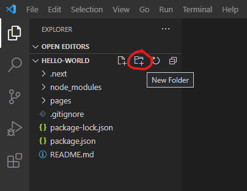
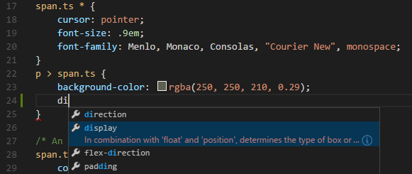
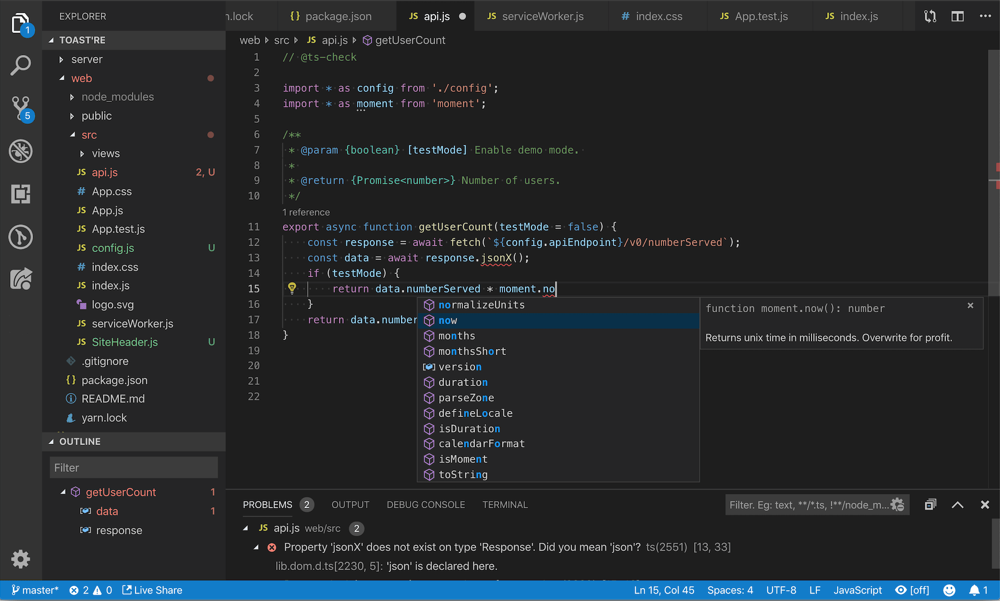
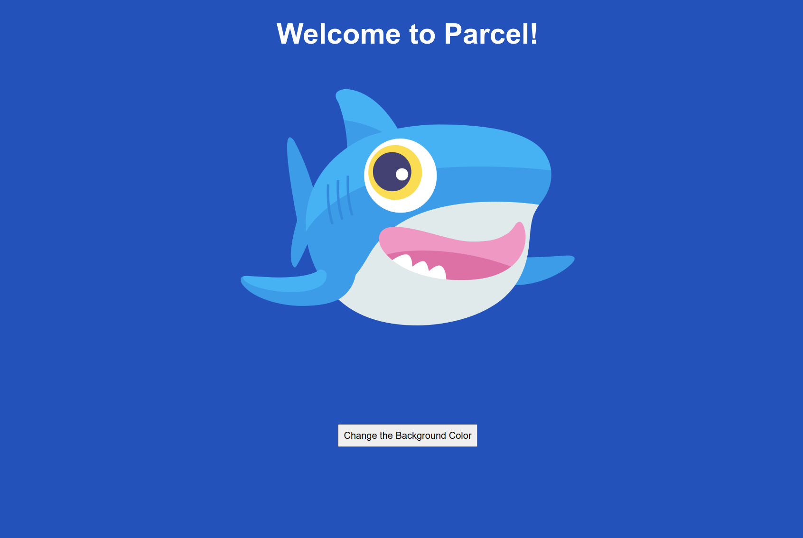
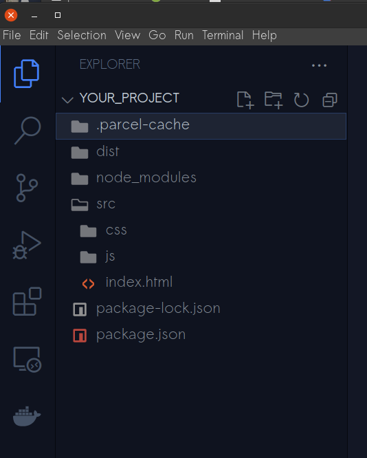

# Como armar unha aplicación web con Parcel.js


## Introdución

Ao desenvolver un sitio ou unha aplicación web, é unha boa práctica **separar o código en anacos máis pequenos e máis manexables**. En produción, solicitar todos os teus recursos individualmente pode enlentecer a túa aplicación. Un _bundler_ é unha ferramenta que se usa para resolver este problema de latencia combinando e fusionando o teu código nun único arquivo. Isto limita a cantidade de solicitudes HTTP a un servidor a conta deses recursos. Usar un _empaquetador de paquetes_ é útil para optimizar a experiencia tanto para o usuario como para o programador.

[Parcel.js](https://parceljs.org/) é un xestor de paquetes de código aberto. Soporta moitos idiomas populares como Typescript ou SASS, e tamén pode xestionar tipos de arquivos como imaxes e fontes. Parcel inclúe algunhas ferramentas adicionais integradas: un servidor de desenvolvemento, diagnósticos, minificación e incluso compresión de imaxes. Se o teu proxecto require configuracións adicionais, tes a opción de usar os moitos complementos de Parcel.

Neste tutorial, usarás Parcel para crear e agrupar unha pequena aplicación web que contén arquivos HTML, CSS e JavaScript. Traballará indistintamente cun editor de texto e un terminal. Tamén aprenderá a configurar Parcel con scripts npm personalizados para axudar a executar e construír a súa aplicación.

## Requisitos previos

Para seguir este tutorial, necesitarás:

- Comprensión de HTML, CSS e JavaScript. Podes aprender sobre estes nas nosas series de titoriais [Como crear un sitio web con HTML](https://www.digitalocean.com/community/tutorial_series/how-to-build-a-website-with-html) , [Como crear estilos de HTML con CSS](https://www.digitalocean.com/community/tutorial_series/how-to-style-html-with-css) e [Como codificar en JavaScript .](https://www.digitalocean.com/community/tutorial_series/how-to-code-in-javascript)
- Un editor de texto como [Visual Studio Code](https://code.visualstudio.com/download) . Podes usar calquera editor de texto que che guste.
- Coñecemento dun terminal. Podes aprender a usar un terminal nas nosas guías [Introdución ao terminal Linux](https://www.digitalocean.com/community/tutorials/an-introduction-to-the-linux-terminal) e [Aprender a amar o teu terminal .](https://www.digitalocean.com/community/conceptual_articles/learning-to-love-your-terminal)
- Node.js instalado na túa máquina local. Siga o noso tutorial sobre [Como instalar Node.js e crear un ambiente de desenvolvemento local](https://www.digitalocean.com/community/tutorial_series/how-to-install-node-js-and-create-a-local-development-environment) para o seu ambiente específico.

Con Node.js configurado na túa máquina, xa estás preparado para comezar os seguintes pasos.

## Paso 1 - Instalación do xestor de paquetes

Abre o teu editor de texto preferido e un terminal ou símbolo do sistema e asegúrate de estar no directorio de nivel superior do teu proxecto antes de continuar co seguinte paso.

`mkdir meu-proxecto`

`cd meu-proxecto`

Dentro do directorio `meu-proxecto`, usa a terminal ou símbolo do sistema para inicializar o proxecto co comando:

```bash
npm init
```

Este comando activará unha serie de solicitudes sobre o teu proxecto. Podes premer `ENTER` para moverte por cada pregunta ou cambiar calquera das opcións predeterminadas á túa configuración preferida. Cando remates, e se non cambiaches ningunha das opcións predeterminadas, terás un novo arquivo `package.json` que inclúe a seguinte información:

`meu-proxecto/package.json`

```json
{
  "name": "meu-proxecto",
  "version": "1.0.0",
  "description": "",
  "main": "index.js",
  "scripts": {
    "test": "echo \"Error: no test specified\" && exit 1"
  },
  "author": "",
  "license": "ISC"
}
```

A continuación, instala o xestor de paquetes localmente usando a bandeira `--save-dev`:

`meu-proxecto`

```bash
npm install --save-dev parcel
```

A marca ou bandeira `--save-dev` garda o paquete de instalación como unha dependencia de desenvolvemento. Isto significa que o teu proxecto dependerá de Parcel durante o proceso de desenvolvemento para xestionar e crear a túa aplicación.

Unha vez instalado, incluiranse no teu proxecto un arquivo adicional `package-lock.json` e un directorio `node_modules`. O arquivo `package-lock.json` xérase automaticamente durante a instalación con `npm`. Describe todas as dependencias das que depende o teu proxecto para funcionar correctamente. Se estás interesado na información que contén este arquivo, [podes buscar na documentación de npm](https://docs.npmjs.com/cli/v8/configuring-npm/package-lock-json) . Do mesmo xeito que o arquivo `package-lock.json`, o cartafol `node_modules` contén tódolos diferentes paquetes dos que depende o teu proxecto. Ter en conta, con todo, que os arquivos xerados automaticamente neste escenario **non están destinados a ser editados directamente**.

No teu arquivo `package.json`, observa que agora inclúe `parcel` como dependencia de desenvolvemento:

`meu-proxecto/package.json`

```json
...
"devDependencies": {
    "parcel": "^2.7.0"
  }
…
```

Co xestor de paquetes instalado como unha dependencia local, xa estás preparado para comezar a traballar na túa aplicación.

## Paso 2 - Creación dos arquivos da aplicación

No seguinte exemplo, crearás unha pequena aplicación que cambia a cor de fondo cando se fai clic nun botón. Parcel implantarase no proxecto despois de que se creen estes arquivos de aplicación.

Parcel pode aceptar calquera arquivo como punto de entrada para a súa solicitude. Un arquivo de **punto de entrada** é onde comeza a execución da súa aplicación. Desde este punto de entrada, Parcel crea a túa aplicación con todas as dependencias ás que apuntas, que inclúen ligazóns a arquivos CSS e JavaScript. Usarás un arquivo HTML, `index.html`, como punto de entrada á túa aplicación.

Co teu editor de texto, crea un cartafol `src` dentro do cartafol `meu-proxecto` para almacenar e organizar o teu código:



Dentro dese cartafol `src`, crea un arquivo `index.html`. En Visual Studio Code, `Right Click` dentro do cartafol `src` e selecciona `New File`. Nomea este arquivo `index.html`.

Inclúe as seguintes liñas no teu arquivo `index.html`:

`meu-proxecto/src/index.html`

```html
<!DOCTYPE html>
<html lang="gl">
  <head>
    <meta charset="utf-8" />
    <meta http-equiv="X-UA-Compatible" content="IE=edge" />
    <meta name="viewport" content="width=device-width, initial-scale=1.0" />
    <link rel="stylesheet" href="css/style.css" />
    <title>Proxecto con Parcel</title>
  </head>
  <body>
    <h1>Benvidos a Parcel!</h1>

    <div class="sammy-wrapper">
      <div class="img-wrapper sammy-1">
        
      </div>
    </div>

    <button>Cambia a cor de fondo!</button>

    <script type="module" src="js/app.js"></script>
  </body>
</html>
```

Este arquivo HTML é a páxina de destino da túa aplicación. Inclúe ligazóns a unha folla de estilo e un guión. Estes arquivos almacenaranse nos seus respectivos cartafoles para manter o código separado e organizado. Lembra gardar o teu arquivo despois das actualizacións. En VS Code, podes gardar o teu arquivo premendo `CTRL+S` ou `CMD+S`.

Dentro do teu directorio `src`, crea outro cartafol chamado `css`. Despois, dentro do teu cartafol `css`, crea unha folla de estilo CSS chamada `style.css`:



Inclúe o seguinte CSS dentro do arquivo `style.css`:

`meu-proxecto/src/css/style.css`

```css
html {
  box-sizing: border-box;
}
*,
*:before,
*:after {
  box-sizing: inherit;
  padding: 0;
  margin: 0;
}
body {
  display: flex;
  flex-direction: column;
  align-items: center;
  font-family: sans-serif;
  color: white;
  background: var(--bg, rgb(26, 80, 190));
  font-size: 16px;
}
h1 {
  font-size: 3rem;
  padding: 2rem;
}
.img-wrapper {
  max-width: 600px;
  padding: 0 1rem;
  margin: 2rem;
  cursor: pointer;
}
.img-wrapper img {
  width: 100%;
}
button {
  font-size: inherit;
  font-size: 1rem;
  padding: 0.5rem;
  margin: 8rem 0;
}
```

A continuación, dentro do teu cartafol `src`, crea un cartafol `js` para albergar o teu código JavaScript:



Dentro do teu `js`cartafol, crea un `app.js`arquivo co seguinte código:

`meu-proxecto/src/js/app.js`

```javascript
const btn = document.querySelector("button");
const body = document.querySelector("body");

let availableColors = [
  "darkslateblue",
  "midnightblue",
  "teal",
  "tomato",
  "seagreen",
  "royalblue",
  "saddlebrown",
  "indigo",
  "olivedrab",
  "rosybrown",
];

btn.addEventListener("click", function () {
  const randomizeColor = Math.floor(Math.random() * availableColors.length);
  body.style.setProperty("--bg", availableColors[randomizeColor]);
});
```

O código JavaScript selecciona aleatoriamente unha cor da matriz `availableColors` e despois cambia o fondo a esa cor ao facer clic.

En conxunto, a arquitectura actual do teu sitio será a seguinte:

```bash
meu-proxecto/
|── node_modules
|── src/
|   |── css/
|   |   |── style.css
|   |── js/
|   |   |── app.js
|   |── index.html
|── package.json
|── package-lock.json
```

Cos elementos esenciais da túa aplicación creados, agora podes usar Parcel para ver e configurar a aplicación.

## Paso 3: executar a aplicación nun servidor de desenvolvemento

Unha forma de ver a túa aplicación sería abrir o teu arquivo HTML nun navegador. Non obstante, se fixeches cambios nalgún dos teus arquivos, terías que actualizar manualmente o navegador cada vez que se fai un cambio. Parcel inclúe un servidor de desenvolvemento que se executa na túa máquina. Cando realizas cambios no teu código mentres se está a executar o teu servidor de desenvolvemento, Parcel actualiza automaticamente a túa aplicación no teu navegador sen necesidade de actualizar. Isto é a miúdo referido como _Hot Reloading_. Deste xeito, non tes que deter o servidor, aplicar os teus cambios e reiniciar o servidor de novo para ver os teus cambios.

Por exemplo, cando se está a executar o servidor de desenvolvemento de Parcel, podes cambiar o atributo `background` da túa folla de estilo `meu-proxecto/src/css/style.css` a `red`, e garda os cambios. Despois de gardar, notarás o cambio inmediatamente no teu navegador sen ter que deter o servidor de desenvolvemento nin actualizar.

No teu terminal, asegúrate de estar dentro do directorio `meu-procecto`. Unha vez que esteas alí, executa o seguinte código para iniciar o teu servidor de desenvolvemento:

`meu-proxecto`

```bash
npx parcel src/index.html
```

```bash
Output❯ npx parcel src/index.html
Server running at http://localhost:1234
✨ Built in 5ms
```

Agora está en execución o servidor de desenvolvemento integrado de Parcel. O comando `npx parcel` toma o teu punto de entrada `src/index.html` e crea a túa aplicación cos recursos necesarios. A saída tamén indica que a aplicación se está a executar en `http://localhost:1234`.

Para ver a túa aplicación en execución, abra o teu navegador web e boga ata `http://localhost:1234`:

_Sammy the Shark dáche a benvida ao teu servidor de desenvolvemento de Parcel._

Dentro do teu cartafol `meu-proxecto`, xeráronse dous novos cartafoles cando executaches o comando `npx parcel`. O cartafol `.parcel-cache` contén información sobre o teu proxecto que Parcel utiliza para reconstruír a túa aplicación. Cando fagas cambios nos teus arquivos, Parcel detectará eses cambios e volverá executar a compilación con estes arquivos en lugar de comezar desde cero.

O outro cartafol, `dist`, contén os arquivos xerados dinámicamente que Parcel creou para ti. Ter en conta que este cartafol inclúe os teus arquivos HTML, CSS e JavaScript, pero todos están nomeados `index` con caracteres aleatorios no medio. Tamén inclúe arquivos`.map`. Parcel xera o que se chama un _mapa de orixe_ cando usa o comando `npx parcel`. O mapa fonte indícalle ao navegador como localizar o código fonte orixinal a partir do código do paquete. Utilízase para axudar a depurar o código en desenvolvemento e produción:



Xéranse dous novos cartafoles despois de executar o comando `npx parcel`.

Para que quede claro, non realizas ningún traballo nestes arquivos. De feito, se eliminas estes cartafoles, tanto o `.parcel-cache` como `dist`, estes xeraranse e actualizaranse automaticamente cando volvas executar o comando `npx parcel` de novo.

> **Nota:** Ás veces, cando realizas modificacións importantes no código, podes notar que eses cambios non se reflicten no navegador. Se isto ocorre, podes probar a actualizar o navegador. Se aínda tes un problema, detén o teu servidor premendo `CTRL+C` no teu terminal. A continuación, elimina os cartafoles `.parcel-cache` e . `dist`. O cartafol `.parcel-cache` pode albergar restos de código antigo e, eliminalo, pode eliminar puntos de conflito. Despois de eliminalos, executa o comando `npx parcel src/index.html` de novo. Isto rexenera os cartafoles `'.parcel-cache` e `dist` e os arquivos co teu código actualizado.

Cando remates de examinar os teus novos cartafoles e arquivos, detén o teu servidor premendo `CTRL+C` na terminal ou símbolo do sistema.

## Paso 4: creación de scripts npm para iniciar e construír a túa aplicación

En lugar de executar o comando `npx parcel src/index.html` dentro da terminal cada vez que queiras comprobar o teu servidor de desenvolvemento, podes crear un script npm dentro do arquivo `package.json` que execute esta tarefa repetitiva e automatizar ese paso. Tamén podes incluír un script adicional para crear a túa aplicación cando todo estea listo para a produción.

Comeza abrindo o arquivo `meu-proxect/package.json` no teu editor de texto. E inclúe nel as seguintes liñas:

`meu-proxecto/package.json`

```json
{
  "name": "meu-proxecto",
  "version": "1.0.0",
  "description": "",
  "source": "src/index.html",
  "scripts": {
    "start": "parcel",
    "build": "parcel build --dist-dir public"
  },
  "author": "",
  "license": "ISC"
  ...
```

No arquivo `package.json` substituíches `"main": "index.js"` por `"source": "src/index.html"`. [`"source"`indica a entrada, ou arquivo fonte, da túa aplicación](https://github.com/parcel-bundler/parcel/issues/5243) e a ruta específica ao arquivo. Tamén incluíches os dous _scripts_ seguintes:

- `"start": "parcel"`

  O nome deste comando é `"start"`. Podes nomear isto como queiras. `"parcel"` é o comando real que queres que realice o teu script. Neste caso, `"parcel"` fai exactamente o que fai o comando `npx parcel` anterior: inicia o servidor de desenvolvemento co teu arquivo de punto de entrada e constrúeo cos recursos que incluíches. Xa que especificaches a orixe do punto de entrada no eido `"source"`, Parcel sabe onde atopar este arquivo.

- `"build": "parcel build --dist-dir public"`

  O nome deste outro comando é `"build"`. Podes poñerlle o nome que queiras. O comando `”parcel build”` constrúe e optimiza o teu código para a produción. Normalmente execútase despois de que remates de desenvolver a túa aplicación. O directorio predeterminado de Parcel para a túa saída chámase `dist`. A etiqueta ou marca `--dist-dir public` define o cartafol de saída para os teus arquivos de produción, e chámase `public` para evitar confusións co cartafol de desenvolvemento `dist` predeterminado.

Agora, en lugar de escribir `npx parcel src/index.html` na túa terminal para iniciar o servidor de desenvolvemento, podes escribir `npm start`:

`meu-proxecto`

```bash
npm start
```

```bash
Output❯ npm start

> your_project@1.0.0 start
> parcel

Server running at http://localhost:1234
✨ Built in 5ms
```

O comando `npm start` é un xeito abreviado de iniciar o servidor de desenvolvemento.

Abre o teu navegador web e navegua ata `http://localhost:1234`. A páxina de destino da túa aplicación debe ser a mesma que antes.

Co arquivo de configuración completo, podes continuar desenvolvendo e probando a túa aplicación. Cando a túa aplicación estea lista para a produción, podes executar o seguinte paso.

## Paso 5: Crear aplicación para produción

Unha das principais características dun xestor de paquetes é a fusión de tipos de arquivos. Isto é o que fai Parcel por ti cando executas o comando `build`. Por exemplo, se tiveses varios arquivos CSS que dependeran uns dos outros dentro do teu directorio `src/css`, Parcel combinaría eses arquivos nun arquivo único cando usas o comando `npm run build`. O mesmo ocorrería con calquera dos teus arquivos JavaScript. Podes [obter máis información sobre como o fai Parcel mergullando na súa documentación](https://parceljs.org/plugin-system/overview/) .

Cando a túa aplicación estea lista para a produción, use o comando `build` que incluíches no teu arquivo `package.json` para crear os arquivos de produción.

Primeiro, asegúrate de estar no directorio de nivel superior e `meu-proxecto`, a continuación, introduce o seguinte comando no teu terminal ou símbolo do sistema:

```bash
npm run build
```

```bash
Output❯ npm run build

> your_project@1.0.0 build
> parcel build

✨ Built in 767ms

public/index.html            781 B    239ms
public/index.9daf4050.css    582 B     21ms
public/index.a9c94235.js     532 B    179ms
```

Como se indicou anteriormente, a saída predeterminada de Parcel para os teus arquivos está no cartafol `dist`. Xa que especificaches o script `build` para enviar os teus arquivos a un directorio chamado `public`, Parcel xera este cartafol e pon os arquivos de produción nel. Os arquivos deste cartafol son diferentes aos de desenvolvemento, xa que están combinados, minificados e optimizados. Podes obter máis información sobre os [arquivos de produción e o que fai Parcel para optimizar o teu código a partir da súa documentación](https://parceljs.org/features/production/) .

Por exemplo, se abres o teu arquivo `public/index.html`, deberíase verse un código:

`meu-proxecto/public/index.html`

```html
<!DOCTYPE html>
<html lang="en">
  <head>
    <meta charset="utf-8" />
    <meta http-equiv="X-UA-Compatible" content="IE=edge" />
    <meta name="viewport" content="width=device-width, initial-scale=1.0" />
    <link rel="stylesheet" href="/index.9daf4050.css" />
    <title>Your Parcel Project</title>
  </head>
  <body>
    <h1>Welcome to Parcel!</h1>
    <div class="sammy-wrapper">
      <div class="img-wrapper sammy-1">
        
      </div>
    </div>
    <button>Change the Background Color</button>
    <script type="module" src="/index.a9c94235.js"></script>
  </body>
</html>
```

Do mesmo xeito que non traballas no cartafol `dist`, tampouco realizas ningún traballo dentro do cartafol `public`. Se precisas facer un cambio no teu código, fai os cambios directamente cos arquivos do cartafol `src`.

Do mesmo xeito que o comando `npm start`, podes reconstruír os teus arquivos de produción co comando `npm run build` despois de facer cambios. O teu cartafol `public` e os arquivos que hai dentro del son os que subiras ao servidor de produción cando esteas listo para facelo.

## Conclusión

Se estás interesado en saber máis sobre Parcel, [podes consultar a súa documentación oficial](https://parceljs.org/docs/) .

---

[How to bundle a web app with parcel.js](https://www.digitalocean.com/community/tutorials/how-to-bundle-a-web-app-with-parcel-js)

Publicado o 28 de setembro de 2022 · Actualizado o 28 de setembro de 2022

---

Tradución XAN2023
