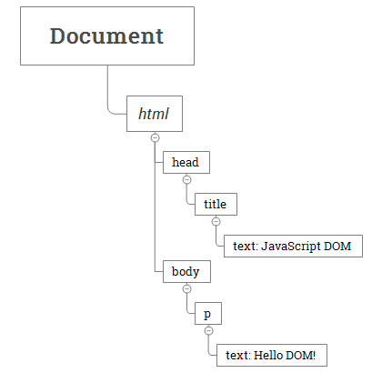
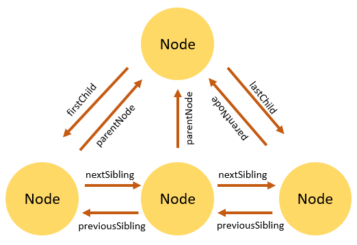

# Modelo de obxectos de documento en JavaScript

**Resumo**: neste artigo verás que se entende por **modelo de obxecto de documento** en JavaScript, e que utilidades ten.

## Que é o Document Object Model (DOM)?

O Document Object Model (DOM) é unha interface de programación de aplicacións(API) para manipular documentos HTML.

O DOM representa un documento HTML como unha árbore de nodos. O DOM ofrece funcións que che permiten engadir, eliminar e modificar partes do documento de forma eficaz.

Ter en conta que o DOM é independente da plataforma e nos modos da linguaxe para manipular documentos HTML e XML.

## Un documento como xerarquía de nodos

O DOM representa un documento HTML como unha xerarquía de nodos. Observa o seguinte documento HTML:

```html
<html>
  <head>
    <title>JavaScript DOM</title>
  </head>
  <body>
    <p>Boas DOM!</p>
  </body>
</html>
```

Observado dende o navegador a seguinte árbore representa o anterior documento HTML:



Nesta árbore DOM, o nodo `document` é o nodo raíz. O nodo raíz ten un nodo fillo que é o elemento `<html>`. O elemento `<html>` chámase _document_ - é o elemento _document_-.

Cada documento só pode ter un elemento `document`. Nun documento HTML, o elemento `document` é o elemento `<html>`. Cada etiqueta do documento HTML ou marca pode ser representada por un nodo na árbore DOM.

### Tipos de nodos

Cada nodo da árbore DOM identifícase por un **tipo de nodo**. JavaScript usa números enteiros para determinar os tipos de nodos. A seguinte táboa ilustra as constantes do tipo de nodo:

| Constante                          | Valor | Descrición                                                                 |
| :--------------------------------- | :---- | :------------------------------------------------------------------------- |
| `Node.ELEMENT_NODE`                | `1`   | Un nodo `Element` como `<p>` ou `<div>`.                                   |
| `Node.TEXT_NODE`                   | `3`   | O `Text` real dentro dun `Element` ou `Attr`.                              |
| `Node.CDATA_SECTION_NODE`          | `4`   | A sección `CDATASection`, como `<!CDATA[[ … ]]>`.                          |
| `Node.PROCESSING_INSTRUCTION_NODE` | `7`   | A `ProcessingInstruction` dun documento XML, como `<?xml-stylesheet … ?>`. |
| `Node.COMMENT_NODE`                | `8`   | Un nodo `Comment`, como `<!-- … -->`.                                      |
| `Node.DOCUMENT_NODE`               | `9`   | Un nodo `Document`.                                                        |
| `Node.DOCUMENT_TYPE_NODE`          | `10`  | Un nodo `DocumentType`, como `<!DOCTYPE html>`.                            |
| `Node.DOCUMENT_FRAGMENT_NODE`      | `11`  | Un nodo `DocumentFragment`.                                                |

Para obter o tipo de nodo, usa a propiedade `nodeType`:

```js
node.nodeType;
```

Podes comparar a propiedade `nodeType` coas constantes anteriores para determinar o tipo de nodo. Por exemplo:

```js
if (node.nodeType == Node.ELEMENT_NODE) {
  // node é o elemento nodo
}
```

### As propiedades `nodeName` e `nodeValue`

Un nodo ten dúas propiedades importantes: `nodeName` e `nodeValue` que proporcionan información específica sobre o nodo.

Os valores destas propiedades dependen do tipo de nodo. Por exemplo, se o tipo de nodo é o nodo do elemento, `nodeName` sempre é o mesmo que o nome da etiqueta do elemento e `nodeValue` sempre é `null`.

Por este motivo, é mellor probar o tipo de nodo antes de usar estas propiedades:

```js
if (node.nodeType == Node.ELEMENT_NODE) {
  let name = node.nodeName; // tag name like <p>
}
```

### Nodo e elemento

Ás veces é fácil confundir entre o `Node` e o `Element`.

Un nodo é un nome xenérico de calquera obxecto da árbore DOM. Pode ser calquera elemento DOM incorporado, como _`document`_. Ou pode ser calquera etiqueta HTML especificada no documento HTML como `<div>` ou `<p>`.

Un elemento é un nodo cun tipo de nodo específico `Node.ELEMENT_NODE`, que é igual a 1.

Noutras palabras, o nodo é o tipo xenérico de elemento. O elemento é un tipo específico do nodo co tipo de nodo `Node.ELEMENT_NODE`.

A seguinte imaxe ilustra a relación entre os tipos `Node` e `Element`:


Ter en conta que `getElementById()` e `querySelector()` devolve un obxecto co tipo `Element` mentres `getElementsByTagName()` ou [`querySelectorAll()`](https://www.javascripttutorial.net/javascript-dom/javascript-queryselector/) devolve `NodeList` que é unha colección de nós.

### Relacións de nodos

Calquera nodo ten relacións con outros nodos da árbore DOM. As relacións son as mesmas que as descritas nunha árbore xenealóxica tradicional.

Por exemplo, `<body>` é un [nodo fillo](https://www.javascripttutorial.net/javascript-dom/javascript-get-child-element/) do nodo `<html>` e `<html>` é o [pai](https://www.javascripttutorial.net/javascript-dom/javascript-get-parent-element-parentnode/) do nodo `<body>`.

O nodo `<body>` é o [irmán](https://www.javascripttutorial.net/javascript-dom/javascript-siblings/) do nodo `<head>` porque comparten o mesmo pai inmediato, que é o elemento `<html>`.

A seguinte imaxe ilustra as relacións entre nós:



## Resumo

- Un documento HTML ou XML pódese representar como unha árbore de nodos, como unha árbore xenealóxica tradicional.
- Cada marcación pódese representar como un nodo cun tipo de nodo específico.
- O elemento é un tipo específico de nodo co tipo de nodo `Node.ELEMENT_NODE`.
- Na árbore DOM, un nodo ten relacións con outros nodos.

---

ref:

https://developer.mozilla.org/es/docs/Web/API/Document_Object_Model/Traversing_an_HTML_table_with_JavaScript_and_DOM_Interfaces

https://www.javascripttutorial.net/javascript-dom/document-object-model-in-javascript/
