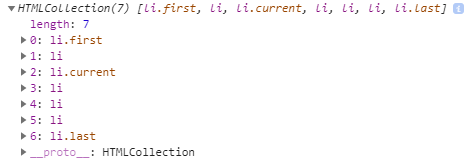

# Obter o elemento principal parentNode

**Resumo**: nesta sección, aprenderás a obter o nodo pai dun elemento usando o atributo JavaScript `parentNode` do obxecto `Node`.

## Introdución ao atributo parentNode

Para obter o nodo pai dun nodo especificado na árbore DOM, usa a propiedade `parentNode`:

```js
let parent = node.parentNode;
```

`parentNode` é de só lectura.

Os nodos `Document` e `DocumentFragment` non teñen un pai. Polo tanto, o `parentNode` será sempre `null`.

Se creas un novo nodo pero non o anexas á árbore DOM, o `parentNode` dese nodo tamén será `null`.

## Exemplo de JavaScript parentNode

Consulta o seguinte documento HTML:

```html
<!DOCTYPE html>
<html>
  <head>
    <meta charset="utf-8" />
    <title>JavaScript parentNode</title>
  </head>
  <body>
    <div id="main">
      <p class="note">This is a note!</p>
    </div>

    <script>
      let note = document.querySelector(".note");
      console.log(note.parentNode);
    </script>
  </body>
</html>
```

A seguinte imaxe mostra a saída na Consola:


Cómo funciona:

- En primeiro lugar, selecciona o elemento coa clase `.note` mediante o método `querySelector()`.
- En segundo lugar, busca o nodo pai do elemento.

## Resumo

- `node.parentNode` devolve o nodo pai de só lectura dun nodo especificado ou `null` se non existe.
- `document` e `DocumentFragment` non teñen un nodo pai.

# Irmáns JavaScript

**Resumo**: nesta sección, aprenderás a seleccionar os irmáns seguintes, os irmáns anteriores e todos os irmáns dun elemento.

Digamos que tes a seguinte lista de elementos:

```html
<ul id="menu">
  <li>Home</li>
  <li>Products</li>
  <li class="current">Customer Support</li>
  <li>Careers</li>
  <li>Investors</li>
  <li>News</li>
  <li>About Us</li>
</ul>
```

## Obtén os próximos irmáns

Para obter o seguinte irmán dun elemento, usa o atributo `nextElementSibling`:

```js
let nextSibling = currentNode.nextElementSibling;
```

Devolve o elemento especificado se é `nextElementSibling` ou `null` se é o último da lista.

O seguinte exemplo usa a propiedade `nextElementSibling` para obter o seguinte irmán do elemento da lista que ten a clase `current`:

```js
let current = document.querySelector(".current");
let nextSibling = current.nextElementSibling;

console.log(nextSibling);
```

Saída:

```html
<li>Careers</li>
```

Neste exemplo:

- En primeiro lugar, seleccionase o elemento da lista cuxa clase é `current` ao usar o `querySelector()`.
- En segundo lugar, obtende o seguinte irmán dese elemento da lista usando a propiedade `nextElementSibling`.

Para obter todos os próximos irmáns dun elemento, podes usar o seguinte código:

```js
let current = document.querySelector(".current");
let nextSibling = current.nextElementSibling;

while (nextSibling) {
  console.log(nextSibling);
  nextSibling = nextSibling.nextElementSibling;
}
```

## Obtén os irmáns anteriores

Para obter os irmáns anteriores dun elemento, usa o atributo `previousElementSibling`:

```js
let current = document.querySelector(".current");
let prevSibling = currentNode.previousElementSibling;
```

A propiedade `previousElementSibling` devolve `null` se o elemento actual é o primeiro da lista.

O seguinte exemplo usa a propiedade `previousElementSibling` para obter os irmáns anteriores do elemento da lista que ten a clase `current`:

```js
let current = document.querySelector(".current");
let prevSiblings = current.previousElementSibling;

console.log(prevSiblings);
```

E o seguinte exemplo selecciona todos os irmáns anteriores do elemento da lista que ten a clase `current`:

```js
let current = document.querySelector(".current");
let prevSibling = current.previousElementSibling;
while (prevSibling) {
  console.log(prevSibling);
  prevSibling = current.previousElementSibling;
}
```

## Obter todos os irmáns dun elemento

Para obter todos os irmáns dun elemento, usaremos a lóxica:

- En primeiro lugar, selecciona o pai do elemento cuxos irmáns queres atopar.
- En segundo lugar, seleccione o primeiro elemento fillo dese elemento pai.
- En terceiro lugar, engade o primeiro elemento a unha matriz de irmáns.
- En cuarto lugar, selecciona o seguinte irmán do primeiro elemento.
- Finalmente, repite os pasos 3 e 4 ata que non queden irmáns. No caso de que o irmán sexa o elemento orixinal, omita o terceiro paso.

A seguinte función ilustra os pasos:

```js
let getSiblings = function (e) {
  // for collecting siblings
  let siblings = [];
  // if no parent, return no sibling
  if (!e.parentNode) {
    return siblings;
  }
  // first child of the parent node
  let sibling = e.parentNode.firstChild;

  // collecting siblings
  while (sibling) {
    if (sibling.nodeType === 1 && sibling !== e) {
      siblings.push(sibling);
    }
    sibling = sibling.nextSibling;
  }
  return siblings;
};
```

Xúntao todo:

```html
<!DOCTYPE html>
<html>
  <head>
    <meta charset="utf-8" />
    <title>JavaScript Siblings</title>
  </head>
  <body>
    <ul id="menu">
      <li>Home</li>
      <li>Products</li>
      <li class="current">Customer Support</li>
      <li>Careers</li>
      <li>Investors</li>
      <li>News</li>
      <li>About Us</li>
    </ul>

    <script>
      let getSiblings = function (e) {
        // for collecting siblings
        let siblings = [];
        // if no parent, return no sibling
        if (!e.parentNode) {
          return siblings;
        }
        // first child of the parent node
        let sibling = e.parentNode.firstChild;
        // collecting siblings
        while (sibling) {
          if (sibling.nodeType === 1 && sibling !== e) {
            siblings.push(sibling);
          }
          sibling = sibling.nextSibling;
        }
        return siblings;
      };

      let siblings = getSiblings(document.querySelector(".current"));
      siblingText = siblings.map((e) => e.innerHTML);
      console.log(siblingText);
    </script>
  </body>
</html>
```

Saída:

```json
["Home", "Products", "Careers", "Investors", "News", "About Us"]
```

## Resumo

- `nextElementSibling` devolve o seguinte irmán dun elemento ou `null`se o elemento é o último da lista.
- `previousElementSibling` devolve o irmán anterior dun elemento ou `null` se o elemento é o primeiro da lista.
- Para obter todos os irmáns dun elemento, podes usar unha función auxiliar que utilice a propiedade `nextElementSibling`.

# Obtención de elementos fillos dun nodo en JavaScript

**Resumo**: nesta sección, aprenderás a obter o primeiro elemento fillo, o último elemento fillo e todos os fillos dun elemento especificado.

Supón que tes o seguinte fragmento HTML:

```html
<!DOCTYPE html>
<html>
  <head>
    <meta charset="utf-8" />
    <title>JS Get Child Elements</title>
  </head>
  <body>
    <ul id="menu">
      <li class="first">Home</li>
      <li>Products</li>
      <li class="current">Customer Support</li>
      <li>Careers</li>
      <li>Investors</li>
      <li>News</li>
      <li class="last">About Us</li>
    </ul>
  </body>
</html>
```

## Obter o primeiro elemento fillo

Para obter o primeiro elemento fillo dun elemento especificado, usa a propiedade `firstChild` do elemento:

```js
let firstChild = parentElement.firstChild;
```

Se `parentElement` non ten ningún elemento fillo, `firstChild` devolve `null`. A propiedade `firstChild` devolve un nodo fillo que pode ser calquera tipo de nodo, como un nodo de elementos, un nodo de texto ou un nodo de comentarios. O seguinte script mostra o primeiro fillo do elemento `#menu`:

```js
let content = document.getElementById("menu");
let firstChild = content.firstChild.nodeName;
console.log(firstChild);
```

Saída:

```css
#text
```

A xanela da consola móstrase `#text` porque se insire un nodo de texto para manter o espazo en branco entre a apertura das etiquetas `<ul>` e `<li>`. Este espazo en branco crea un nodo `#text`.

Ter en conta que calquera espazo en branco, como un espazo único, varios espazos, retornos e tabulacións creará un nodo `#text`. Para eliminar o nodo `#text`, pode eliminar os espazos en branco do seguinte xeito:

```html
<article id="content">
  <h2>Heading</h2>
  <p>First paragraph</p>
</article>
```

Ou para obter o primeiro fillo só co nodo Element, pode usar a propiedade `firstElementChild`:

```js
let firstElementChild = parentElement.firstElementChild;
```

O seguinte código devolve o primeiro elemento da lista que é o primeiro elemento fillo do menú:

```js
let content = document.getElementById("menu");
console.log(content.firstElementChild);
```

Saída:

```html
<li class="first">Home</li>
```

Neste exemplo:

- En primeiro lugar, selecciona o elemento `#menu` mediante o método `getElementById()`.
- En segundo lugar, obtén o primeiro elemento fillo usando a propiedade `firstElementChild`.

## Obter o último elemento fillo

Para obter o último elemento fillo dun nodo, usa a propiedade `lastChild`:

```js
let lastChild = parentElement.lastChild;
```

No caso de que `parentElement` non teña ningún elemento fillo, `lastChild` devolve `null`. Do mesmo xeito que a propiedade `firstChild`, a propiedade `lastChild` devolve o primeiro nodo do elemento, nodo de texto ou nodo de comentario. Se queres seleccionar só o último elemento fillo co tipo de nodo de elemento, usa a propiedade `lastElementChild`:

```js
let lastChild = parentElement.lastElementChild;
```

O seguinte código devolve o elemento da lista que é o último elemento fillo do menú:

```js
let menu = document.getElementById("menu");
console.log(main.lastElementChild);
```

Saída:

```html
<li class="last">About Us</li>
```

## Obter todos os elementos fillos

Para obter unha vista `NodeList` de elementos fillos dun elemento especificado, usa a propiedade `childNodes`:

```js
let children = parentElement.childNodes;
```

A propiedade `childNodes` devolve todos os elementos fillos con calquera tipo de nodo. Para obter o elemento fillo só co tipo de nodo de elemento, usa a propiedade `children`:

```js
let children = parentElement.children;
```

O seguinte exemplo selecciona todos os elementos fillos do elemento co id `main`:

```js
let menu = document.getElementById("menu");
let children = menu.children;
console.log(children);
```

Saída:



## Resumo

- `firstChild` e `lastChild` devolven o primeiro e o último fillo dun nodo, que pode ser calquera tipo de nodo, incluído o nodo de texto, o nodo de comentario e o nodo de elementos.
- `firstElementChild` e `lastElementChild` devolven o primeiro e o último nodo Element fillo.
- `childNodes` devolve un `NodeList` de todos os nodos fillos de calquera tipo de nodo dun nodo especificado. Os fillos devolven todos os nodos fillos dun nodo `Element` especificado.
