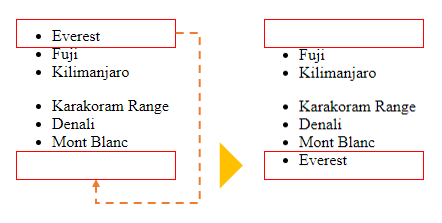

# `CreateElement`

**Resumo**: nesta sección, aprenderás a usar o JavaScript `document.createElement()` para crear un novo elemento HTML e anexalo á árbore DOM.

Para crear un elemento HTML, usa o método `document.createElement()`:

```js
let element = document.createElement(htmlTag);
```

`document.createElement()` acepta un nome de etiqueta HTML e devolve un novo nodo -`node`- co tipo `Element`.

## 1) Creando un novo exemplo div

Supón que tes o seguinte documento HTML:

```html
<!DOCTYPE html>
<html>
  <head>
    <meta charset="utf-8" />
    <title>JS CreateElement Demo</title>
  </head>
  <body></body>
</html>
```

O seguinte exemplo usa `document.createElement()` para crear un novo elemento `<div>`:

```js
let div = document.createElement("div");
```

E engade un fragmento HTML a `div`:

```js
div.innerHTML = "<p>CreateElement example</p>";
```

Para anexar o elemento `div` ao documento, utiliza o método `appendChild()`:

```js
document.body.appendChild(div);
```

Xuntámolo todo:

```html
<!DOCTYPE html>
<html>
  <head>
    <meta charset="utf-8" />
    <title>JS CreateElement Demo</title>
  </head>
  <body>
    <script>
      let div = document.createElement("div");
      div.id = "content";
      div.innerHTML = "<p>CreateElement example</p>";
      document.body.appendChild(div);
    </script>
  </body>
</html>
```

### Engadindo un ID ao div

Se queres engadir un id a un `div`, estableces o atributo `id` do elemento nun valor, como este:

```js
let div = document.createElement("div");
div.id = "content";
div.innerHTML = "<p>CreateElement example</p>";

document.body.appendChild(div);
```

### Engadir unha clase ao div

O seguinte exemplo establece a clase CSS `note` nun novo div:

```js
let div = document.createElement("div");
div.id = "content";
div.className = "note";
div.innerHTML = "<p>CreateElement example</p>";

document.body.appendChild(div);
```

### Engadir texto a un div

Para engadir un anaco de texto a un `<div>`, podes usar a propiedade `innerHTML` como no exemplo anterior ou crear un novo nodo `Text` e engadilo a `div`:

```js
// create a new div and set its attributes
let div = document.createElement("div");
div.id = "content";
div.className = "note";

// create a new text node and add it to the div
let text = document.createTextNode("CreateElement example");
div.appendChild(text);

// add div to the document
document.body.appendChild(div);
```

### Engadir un elemento a un div

Para engadir un elemento a un `div`, crea un elemento e engádeo ao elemento `div` usando o método `appendChild()`:

```js
let div = document.createElement("div");
div.id = "content";
div.className = "note";

// create a new heading and add it to the div
let h2 = document.createElement("h2");
h2.textContent = "Add h2 element to the div";
div.appendChild(h2);

// add div to the document
document.body.appendChild(div);
```

## 2) Exemplo de creación de novos elementos de lista (`li`).

Digamos que tes unha lista de elementos:

```html
<ul id="menu">
  <li>Home</li>
</ul>
```

O seguinte código engade dous elementos `li` ao `ul`:

```js
let li = document.createElement("li");
li.textContent = "Products";
menu.appendChild(li);

li = document.createElement("li");
li.textContent = "About Us";

// select the ul menu element
const menu = document.querySelector("#menu");
menu.appendChild(li);
```

Saída:

```html
<ul id="menu">
  <li>Home</li>
  <li>Products</li>
  <li>About Us</li>
</ul>
```

## 3) Creación dun exemplo de elemento `script`

Ás veces, podes querer cargar un arquivo JavaScript de forma dinámica. Para iso, podes usar `document.createElement()` para crear o elemento `script` e engadilo ao documento.

O seguinte exemplo ilustra como crear un novo elemento `script` e cargar o arquivo `/lib.js` no documento:

```js
let script = document.createElement("script");
script.src = "/lib.js";
document.body.appendChild(script);
```

Primeiro podes crear unha nova función auxiliar que cargue un arquivo JavaScript desde unha URL:

```js
function loadJS(url) {
  let script = document.createElement("script");
  script.src = url;
  document.body.appendChild(script);
}
```

E despois usa a función auxiliar para cargar o arquivo `/lib.js`:

```js
loadJS("/lib.js");
```

Para cargar un arquivo JavaScript de forma asíncrona, establece o atributo `async` do elemento `script` en `true`:

```js
function loadJSAsync(url) {
  let script = document.createElement("script");
  script.src = url;
  script.async = true;
  document.body.appendChild(script);
}
```

## Resumo

- `document.createElement()` Crea un novo elemento HTML.
- `element.appendChild()` Engade un elemento HTML a un elemento existente.

# `appendChild`

**Resumo**: nesta sección, aprenderás a usar o método `appendChild()` para engadir un nodo ao final da lista de nodos fillos dun nodo pai especificado.

## Introdución ao método `appendChild()`

`appendChild()` é un método da interface `Node`. O método `appendChild()` permite engadir un nodo ao final da lista de nodos fillos dun nodo pai especificado.

O seguinte ilustra a sintaxe do `appendChild()`método:

```
parentNode.appendChild(childNode);
```

Neste método, `childNode` é o nodo a engadir ao nodo pai dado. O método `appendChild()` devolve o fillo anexo.

Se `childNode` é unha referencia a un nodo existente no documento, o método `appendChild()` moverá `childNode` desde a súa posición actual á nova.

## Exemplos de JavaScript `appendChild()`

Poñamos algúns exemplos de uso do método `appendChild()`.

### 1) `appendChild()`, exemplo sinxelo

Supón que tes o seguinte marcado HTML:

```html
<ul id="menu"></ul>
```

O seguinte exemplo usa ométodo `appendChild()` para engadir tres elementos de lista ao elemento `<ul>`:

```js
function createMenuItem(name) {
  let li = document.createElement("li");
  li.textContent = name;
  return li;
}
// get the ul#menu
const menu = document.querySelector("#menu");
// add menu item
menu.appendChild(createMenuItem("Home"));
menu.appendChild(createMenuItem("Services"));
menu.appendChild(createMenuItem("About Us"));
```

Como funciona:

- En primeiro lugar, a función `createMenuItem()` crea un novo elemento de lista cun nome especificado mediante o método `createElement()`.
- En segundo lugar, se selecciona o elemento `<ul>` con id `menu` usando o método `querySelector()`.
- En terceiro lugar, chámase á función `createMenuItem()` para crear un novo elemento de menú e se usa o método `appendChild()` para engadir o elemento de menú ao elemento `<ul>`.

Saída:

```html
<ul id="menu">
  <li>Home</li>
  <li>Services</li>
  <li>About Us</li>
</ul>
```

Xúntao todo:

```html
<!DOCTYPE html>
<html>
  <head>
    <meta charset="utf-8" />
    <title>JavaScript appendChild() Demo</title>
  </head>
  <body>
    <ul id="menu"></ul>

    <script>
      function createMenuItem(name) {
        let li = document.createElement("li");
        li.textContent = name;
        return li;
      }
      // get the ul#menu
      const menu = document.querySelector("#menu");
      // add menu item
      menu.appendChild(createMenuItem("Home"));
      menu.appendChild(createMenuItem("Services"));
      menu.appendChild(createMenuItem("About Us"));
    </script>
  </body>
</html>
```

### 2) Mover un nodo dentro do documento

Asumindo que tes dúas listas de elementos:

```html
<ul id="first-list">
  <li>Everest</li>
  <li>Fuji</li>
  <li>Kilimanjaro</li>
</ul>

<ul id="second-list">
  <li>Karakoram Range</li>
  <li>Denali</li>
  <li>Mont Blanc</li>
</ul>
```

O seguinte exemplo usa `appendChild()` para mover o primeiro elemento fillo da primeira lista á segunda:

```js
// get the first list
const firstList = document.querySelector("#first-list");
// take the first child element
const everest = firstList.firstElementChild;
// get the second list
const secondList = document.querySelector("#second-list");
// append the everest to the second list
secondList.appendChild(everest);
```

Como funciona:

- En primeiro lugar, selecciona o primeiro elemento polo seu id (`first-list`) usando o método `querySelector()`.
- En segundo lugar, selecciona o primeiro elemento fillo da primeira lista.
- En terceiro lugar, selecciona o segundo elemento polo seu id (`second-list`) usando o método `querySelector()`.
- Finalmente, engade o primeiro elemento fillo da primeira lista á segunda lista usando o método `appendChild()`.

Aquí está a lista antes e despois de mudar:



## Resumo

- Usar o método `appendChild()` para engadir un nodo ao final da lista de nodos fillos dun nodo pai especificado.
- Pódese usar `appendChild()` para mover un nodo fillo existente á nova posición dentro do documento.

# `textContent`

**Resumo**: nesta sección, aprenderás a usar a propiedade JavaScript `textContent` para obter o contido de texto dun nodo e os seus descendentes.

## Lectura desde un nodo `textContent`

Para obter o contido de texto dun nodo e os seus descendentes, usa a propiedade `textContent`:

```js
let text = node.textContent;
```

Supón que tes o seguinte fragmento HTML:

```html
<div id="note">
  JavaScript textContent Demo!
  <span style="display:none">Hidden Text!</span>
  <!-- my comment -->
</div>
```

O seguinte exemplo usa a propiedade `textContent` para obter o texto do elemento `<div>`:

```js
let note = document.getElementById("note");
console.log(note.textContent);
```

Como funciona.

- En primeiro lugar, selecciona o elemento `div` coa nota de identificación mediante o método `getElementById()`.
- A continuación, amosa o texto do nodo accedendo á propiedade `textContent`.

Saída:

```text
JavaScript textContent Demo!
Hidden Text!
```

Como podes ver claramente na saída, a propiedade `textContent` devolve a concatenación de cada [nodo fillo](https://www.javascripttutorial.net/javascript-dom/javascript-get-child-element/) `textContent`, excluíndo os comentarios (e tamén as instrucións de procesamento).

### `textContent` vs.`innerText`

Por outra banda, `innerText` ten en conta o estilo CSS e devolve só texto lexible por humanos. Por exemplo:

```js
let note = document.getElementById("note");
console.log(note.innerText);
```

Saída:

```text
JavaScript textContent Demo!
```

Como podes ver, o texto e os comentarios ocultos non son devoltos.

Dado que a propiedade `innerText` usa o CSS actualizado para calcular o texto, o acceso a el desencadeará un refluxo, que é computacionalmente custoso.

Prodúcese un **refluxo** cando un navegador web precisa procesar e debuxar partes ou toda unha páxina web de novo.

## Configuración para un nodo `textContent`

Ademais de ler `textContent`, tamén podes usar a propiedade `textContent` para definir o texto dun nodo:

```js
node.textContent = newText;
```

Cando se configura `textContent` nun nodo, todos os fillos do nodo serán eliminados e substituídos por un único nodo de texto co valor `newText`. Por exemplo:

```js
let note = document.getElementById("note");
note.textContent = "This is a note";
```

## Resumo

- Usa a propiedade `textContent` para devolver a concatenación de cada nodo fillo `textContent`. Podes usalo para definir un texto para un nodo.
- `innerText` devolve o texto lexible por humanos que ten en conta CSS.

# `innerHTML`

**Resumo**: nesta sección, aprenderás a usar a propiedade JavaScript `innerHTML` dun elemento para obter ou establecer un marcado HTML contido no elemento.

`innerHTML` é unha propiedade de `Element` que che permite obter ou configurar o marcado HTML contido no elemento:

```js
element.innerHTML = "new content";
element.innerHTML;
```

## Lendo a propiedade innerHTML dun elemento

Para obter o marcado HTML contido nun elemento, usa a seguinte sintaxe:

```js
let content = element.innerHTML;
```

Cando le `innerHTML` un elemento, o navegador web ten que serializar o fragmento HTML dos descendentes do elemento.

### 1) Exemplo simple de JavaScript interno

Supón que tes o seguinte marcado:

```html
<ul id="menu">
  <li>Home</li>
  <li>Services</li>
</ul>
```

O seguinte exemplo usa a propiedade `innerHTML` para obter o contido do elemento `<ul>`:

```js
let menu = document.getElementById("menu");
console.log(menu.innerHTML);
```

Como funciona:

- En primeiro lugar, seleccione o elemento `<ul>` polo seu id ( `menu`) usando o método `getElementById()`.
- A continuación, obtén o contido HTML do elemento `<ul>` usando o `innerHTML`.

Saída:

```js
<li>Home</li>
<li>Services</li>
```

### 2) Examinando a fonte HTML actual

A propiedade `innerHTML` devolve a fonte HTML actual do documento, incluíndo todos os cambios que se fixeron desde que se cargou a páxina.

Vexa o seguinte exemplo:

```html
<!DOCTYPE html>
<html>
  <head>
    <meta charset="utf-8" />
    <title>JavaScript innerHTML</title>
  </head>
  <body>
    <ul id="menu">
      <li>Home</li>
      <li>Services</li>
    </ul>
    <script>
      let menu = document.getElementById("menu");

      // create new li element
      let li = document.createElement("li");
      li.textContent = "About Us";
      // add it to the ul element
      menu.appendChild(li);

      console.log(menu.innerHTML);
    </script>
  </body>
</html>
```

Saída:

```html
<li>Home</li>
<li>Services</li>
<li>About Us</li>
```

Como funciona.

- Primeiro, obtén o elemento `<ul>` co id `menu` usando o método `getElementById()`.
- En segundo lugar, crea un elemento `<li>` novo e engádeo ao elemento `<ul>` usando os métodos `createElement()` e `appendChild()`.
- En terceiro lugar, obtén o HTML do elemento `<ul>` usando a propiedade `innerHTML` do elemento `<ul>`. Os contidos do elemento `<ul>` inclúen o contido inicial e o contido dinámico creado dinámicamente por JavaScript.

## Configurando a propiedade `innerHTML` dun elemento

Para establecer o valor da propiedade `innerHTML`, usa esta sintaxe:

```js
element.innerHTML = newHTML;
```

A configuración substituirá o contido existente dun elemento polo contido novo.

Por exemplo, pódese eliminar todo o contido do documento borrando o contido do elemento `document.body`:

```js
document.body.innerHTML = "";
```

### ⚠️ Risco de seguridade

HTML5 especifica que unha etiqueta `<script>` inserida con innerHTML non debe executarse.

Supón que tes o seguinte documento `index.html`:

```html
<!DOCTYPE html>
<html lang="en">
  <head>
    <meta charset="UTF-8" />
    <meta name="viewport" content="width=device-width, initial-scale=1.0" />
    <title>JS innerHTML example</title>
  </head>

  <body>
    <div id="main"></div>
    <script src="app.js"></script>
  </body>
</html>
```

E o arquivo `app.js` ten o seguinte aspecto:

```js
const scriptHTML = `<script>alert("Alert from innerHTML");</script>`;
const main = document.getElementById("main");

main.innerHTML = scriptHTML;
```

Neste exemplo, o `alert()` interior da etiqueta `<script>` non se executará.

Non obstante, se se cambia o código fonte do seguinte `app.js`:

```js
const main = document.getElementById("main");

const externalHTML = ``;
// shows the alert
main.innerHTML = externalHTML;
```

Neste exemplo, a imaxe co src '1' non se cargará correctamente. Polo tanto, executarase o
erro que executa [`alert()`](https://www.javascripttutorial.net/javascript-bom/javascript-alert/).

En lugar de ter unha simple `alert()`, os hackers poden incluír código malicioso, e os usuarios que abran a páxina web serán vulnerables.

Polo tanto, non debes configurar os contidos sobre os que non ten control `innerHTML` ou te enfrontarás a un risco potencial de seguridade.

Se queres inserir texto sinxelo no documento, podes usar a propiedade `textContent` en lugar do `innerHTML`. Non se analizará `textContent` como HTML senón como texto en bruto.

## Resumo

- Usa a propiedade `innerHTML` dun elemento para obter ou definir o HTML contido no elemento.
- A propiedade `innerHTML` devolve a fonte HTML actual do elemento, incluíndo calquera cambio que se fixera desde que se cargou a páxina.
- Non o uses `innerHTML` para configurar novos contidos sobres os que non tes control para evitar un risco de seguridade.

# `innerHTML` vs `createElement`

**Resumo**: nesta sección aprenderás a diferenza entre `innerHTML` e `createElement()` cando se trata de crear novos elementos na árbore DOM.

## #1) `createElement` é máis eficiente

Supó que tes un elemento `div` co contedor de clases:

```html
<div class="container"></div>
```

Podes crear novos elementos ao elemento `div` creando un elemento e engadíndoo:

```js
let div = document.querySelector(".container");

let p = document.createElement("p");
p.textContent = "JS DOM";
div.appendChild(p);
```

Tamén podes manipular o HTML dun elemento directamente usando o seguinte `innerHTML`:

```js
let div = document.querySelector(".container");
div.innerHTML += "<p>JS DOM</p>";
```

O uso de `innerHTML` é máis limpo e curto cando queres engadir atributos ao elemento:

```js
let div = document.querySelector(".container");
div.innerHTML += '<p class="note">JS DOM</p>';
```

Non obstante, o uso de `innerHTML` fai que os navegadores web analicen e recreen todos os nós DOM dentro do elemento div. Polo tanto, é menos eficiente que crear un novo elemento e engadilo ao div. Noutras palabras, crear un elemento novo e engadilo á árbore DOM proporciona un mellor rendemento que o `innerHTML`.

## #2) `createElement` é máis seguro

Como xa se mencionou, só debes usar `innerHTML` cando os datos proveñan dunha fonte de confianza como unha base de datos.

Se estableces contidos sobre os que non tes control no HTML interno, é posible que o código malicioso se inxecte e execute.

## #3) Usando `DocumentFragment` para compoñer nodos DOM

Asumindo que tes unha lista de elementos e necesitas en cada iteración:

```js
let div = document.querySelector(".container");

for (let i = 0; i < 1000; i++) {
  let p = document.createElement("p");
  p.textContent = `Paragraph ${i}`;
  div.appendChild(p);
}
```

Este código dá como resultado o recálculo de estilos, pintura e deseño en cada iteración. Isto non é moi eficiente.

Para superar isto, normalmente se usa `DocumentFragment` para compoñer nodos DOM e engádeo á árbore DOM:

```js
let div = document.querySelector(".container");

// compose DOM nodes
let fragment = document.createDocumentFragment();
for (let i = 0; i < 1000; i++) {
  let p = document.createElement("p");
  p.textContent = `Paragraph ${i}`;
  fragment.appendChild(p);
}

// append the fragment to the DOM tree
div.appendChild(fragment);
```

Neste exemplo, compuxemos os nodos DOM usando o obxecto `DocumentFragment` e engadimos o fragmento á árbore DOM activa unha vez ao final.

Un fragmento de documento non se vincula á árbore DOM activa, polo tanto, non incorre en ningún rendemento.

# `DocumentFragment`

**Resumo**: nesta sección aprenderás sobre a interface de JavaScript `DocumentFragment` para compoñer nodos DOM e actualizalos á árbore DOM activa.

## Introdución á interface JavaScript DocumentFragment

A interface `DocumentFragment` é unha versión lixeira do `Document` que almacena unha peza da estrutura do documento como un documento estándar. Non obstante, `DocumentFragment` non forma parte da árbore DOM activa.

Se realizas cambios no fragmento do documento, non afectará ao documento nin incorrerá en ningún rendemento.

Normalmente, se usa `DocumentFragment` para compoñer nodos DOM e engadir ou insírir á árbore DOM activa mediante o método `appendChild()` ou `insertBefore()`.

Para crear un novo fragmento de documento, usa o construtor `DocumentFragment` deste xeito:

```js
let fragment = new DocumentFragment();
```

Ou podes usar o método `createDocumentFragment()` do obxecto `Document`:

```js
let fragment = document.createDocumentFragment();
```

`DocumentFragment` herda os métodos do seu pai, `Node`, e tamén implementa os da interface `ParentNode` como `querySelector()` e `querySelectorAll()`.


## Exemplo de `DocumentFragment`

Supón que tes un elemento `<ul>` co id `language`:

```html
<ul id="language"></ul>
```

O seguinte código crea unha lista de elementos `<li>` (`<li>`) e anexa cada un ao elemento `<ul>`usando `DocumentFragment`:

```js
let languages = ["JS", "TypeScript", "Elm", "Dart", "Scala"];

let langEl = document.querySelector("#language");

let fragment = new DocumentFragment();
languages.forEach((language) => {
  let li = document.createElement("li");
  li.innerHTML = language;
  fragment.appendChild(li);
});

langEl.appendChild(fragment);
```

<iframe src="https://www.javascripttutorial.net/sample/dom/documentfragment/" height="150" style="box-sizing: border-box; margin: 0px; max-width: 100%; border: none; min-height: 70px; width: 1064px; padding: 1rem;"></iframe>

Como funciona:

- En primeiro lugar, selecciona o elemento `<ul>` polo seu id usando o método `querySelector()`.
- En segundo lugar, crea un novo fragmento de documento.
- En terceiro lugar, para cada elemento da matriz `languages`, crea un elemento de lista, asigna os elementos da lista `innerHTML` a `language`, e engade todos os elementos da lista recén creados ao fragmento de documento.
- Finalmente, engade o fragmento de documento ao elemento `<ul>`.

Xúntao todo:

```html
<!DOCTYPE html>
<html lang="en">
  <head>
    <meta charset="UTF-8" />
    <meta name="viewport" content="width=device-width, initial-scale=1.0" />
    <title>DocumentFragment Demo</title>
  </head>
  <body>
    <ul id="language"></ul>

    <script>
      let languages = ["JS", "TypeScript", "Elm", "Dart", "Scala"];

      let langEl = document.querySelector("#language");
      let fragment = new DocumentFragment();

      languages.forEach((language) => {
        let li = document.createElement("li");
        li.innerHTML = language;
        fragment.appendChild(li);
      });

      langEl.appendChild(fragment);
    </script>
  </body>
</html>
```

## Resumo

- Use o `DocumentFragment` para compoñer nodos DOM antes de actualizalos á árbore DOM activa para obter un mellor rendemento.

# `before()`

**Resumo**: nesta sección, aprenderás a usar o método `before()` de JavaScript para inserir un nodo antes dun elemento.

## Introdución ao método JavaScript `before()`.

O método `element.before()` permite inserir un ou máis nós antes do `element`. O seguinte código mostra a sintaxe do método `before()`:

```js
Element.before(node);
```

Nesta sintaxe, o método`before()` insire o nodo antes do Elemento na árbore DOM.

Por exemplo, supoña que tes un elemento `<p>` e queres inserir un elemento `<h1>` antes del, podes usar o método `before()` deste xeito:

```js
p.before(h1);
```

Para inserir varios nodos antes dun elemento, pasa os nodos ao método `before()` do seguinte xeito:

```js
Element.before(node1, node2, ...nodeN);
```

Ademais, o método `before()` acepta unha ou máis cadeas en lugar de nós. Neste caso, o método `before()` trata as cadeas como nodos `Text`:

```js
Element.before(str1, str2, ...strN);
```

O método `before()` devolve `undefined`. Se non se pode inserir un nodo, o método `before()` lanza unha excepción `HierarchyRequestError`.

## Exemplos de JavaScript `before()`.

Poñamos algúns exemplos de uso do método JavaScript `before()`.

### 1) Usando `before()` para inserir un nodo antes dun elemento

O seguinte exemplo usa o método `before()` para inserir `<h1>` antes dun parágrafo:

```html
<!DOCTYPE html>
<html lang="en">
  <head>
    <meta charset="UTF-8" />
    <meta name="viewport" content="width=device-width, initial-scale=1.0" />
    <title>JavaScript DOM - before()</title>
  </head>

  <body>
    <p>This is JavaScript DOM before() method demo.</p>

    <script>
      const p = document.querySelector("p");

      // create a new h1 element
      const h1 = document.createElement("h1");
      h1.innerText = "JavaScript DOM - before()";

      // insert the h1 before the paragraph
      p.before(h1);
    </script>
  </body>
</html>
```

Como funciona.

Primeiro, se obtén o elemento `<p>` usando o método `querySelector()`:

```js
const p = document.querySelector("p");
```

En segundo lugar, crea un novo elemento de título e establece o seu `innerText`:

```js
const h1 = document.createElement("h1");
h1.innerText = "JavaScript DOM - before()";
```

En terceiro lugar, insire o elemento `<h1>` antes do elemento parágrafo:

```js
p.before(h1);
```

### 2) Usando JavaScript `before()` para inserir varios nodos antes dun elemento

O seguinte exemplo usa o método `before()` para inserir varios nodos antes dun elemento:

```html
<!DOCTYPE html>
<html lang="en">
  <head>
    <meta charset="UTF-8" />
    <meta name="viewport" content="width=device-width, initial-scale=1.0" />
    <title>JavaScript DOM - before()</title>
  </head>

  <body>
    <ul>
      <li>Angular</li>
      <li>Vue</li>
    </ul>
    <script>
      const list = document.querySelector("ul");

      const libs = ["React", "Meteor", "Polymer"];
      const items = libs.map((lib) => {
        const item = document.createElement("li");
        item.innerText = lib;
        return item;
      });

      list.firstChild.before(...items);
    </script>
  </body>
</html>
```

Como funciona:

En primeiro lugar, selecciona o elemento ul usando o método `querySelector()`:

```js
const list = document.querySelector("ul");
```

En segundo lugar, define unha matriz de cadeas. Na práctica, podes obtelo dunha chamada á API.

```js
const libs = ["React", "Meteor", "Polymer"];
```

En terceiro lugar, transforma a matriz de cadeas nunha matriz de elementos li usando o método `map()`:

```js
const items = libs.map((lib) => {
  const item = document.createElement("li");
  item.innerText = lib;
  return item;
});
```

Finalmente, insire os elementos do elemento da lista antes do primeiro fillo do elemento ul:

```js
list.firstChild.before(...items);
```

Ter en conta que `...items` usa o [operador spread](https://www.javascripttutorial.net/es6/javascript-spread/) para estender o elemento da matriz `items`.

O elemento `<ul>` terá o seguinte aspecto:

```html
<ul>
  <li>React</li>
  <li>Meteor</li>
  <li>Polymer</li>
  <li>Angular</li>
  <li>Vue</li>
</ul>
```

Os tres primeiros elementos (React, Meteor e Polymer) foron inseridos antes do elemento Angular, que foi o primeiro fillo do elemento `<ul>`.

### 3) Usando `before()` para inserir cadeas

Cando se usan cadeas no método `before()`, o método `before()` trataráas como nodos `Text`. Por exemplo:

```html
<!DOCTYPE html>
<html lang="en">
  <head>
    <meta charset="UTF-8" />
    <meta name="viewport" content="width=device-width, initial-scale=1.0" />
    <title>JavaScript DOM - before()</title>
    <style>
      button {
        padding: 0.75em 1em;
        background-color: #f7df1e;
        color: #000;
        cursor: pointer;
        border-radius: 50vw;
      }
    </style>
  </head>

  <body>
    <button>Donate Here</button>
    <script>
      const button = document.querySelector("button");
      button.firstChild.before("🧡 ");
    </script>
  </body>
</html>
```

## Resumo

- Usa o método `element.before()` para inserir un ou máis nós antes do elemento.

# `after()`

**Resumo**: nesta sección, aprenderás a usar o método `after()` para inserir un nodo despois dun elemento.

## Introdución ao método JavaScript `after()`.

`after()` é un método do tipo `Element`. O método `element.after()` permítelle inserir un ou máis nodos despois do `element`.

Aquí está a sintaxe do método `after()`:

```js
Element.after(node);
```

Nesta sintaxe, o método `after()` insire o nodo despois do Elemento na árbore DOM.

Por exemplo, supoñamos que tes un elemento `<h1>` e queres inserir un elemento `<p>` despois del, podes usar o método `after()` deste xeito:

```js
h1.after(p);
```

Para inserir varios nodos despois dun elemento, pasa os nodos ao método `after()` do seguinte xeito:

```js
Element.after(node1, node2, ...nodeN);
```

O método `after()` tamén acepta unha ou máis cadeas. Neste caso, o método `after()` trata as cadeas como nodos `Text`:

```js
Element.after(str1, str2, ...strN);
```

O método `after()` devolve `undefined`. Se non se pode inserir un nodo, xerará unha excepción `HierarchyRequestError`.

## Exemplos de `after()`.

Poñamos algúns exemplos de uso do método JavaScript `after()`.

### 1) Usando JavaScript `after()` para inserir un nodo despois dun elemento

O seguinte exemplo usa o método `after()` para inserir un parágrafo despois dun elemento `<h1>`:

```html
<!DOCTYPE html>
<html lang="en">
  <head>
    <meta charset="UTF-8" />
    <meta name="viewport" content="width=device-width, initial-scale=1.0" />
    <title>JavaScript DOM - after()</title>
  </head>

  <body>
    <h1>JavaScript DOM - after()</h1>

    <script>
      const h1 = document.querySelector("h1");

      // create a new paragraph element
      const p = document.createElement("p");
      p.innerText = "This is JavaScript DOM after() method demo";

      // insert the paragraph after the heading
      h1.after(p);
    </script>
  </body>
</html>
```

Como funciona.

En primeiro lugar, obtén o elemento de título usando o método `querySelector()`:

```js
const h1 = document.querySelector("h1");
```

En segundo lugar, crea un novo elemento de parágrafo e establece o seu `innerText`:

```js
const p = document.createElement("p");
p.innerText = "This is JavaScript DOM after() method demo";
```

En terceiro lugar, insire o elemento `<p>` despois do elemento `<h1>`:

```js
h1.after(p);
```

### 2) Usando `after()` para inserir varios nodos despois dun elemento

O seguinte exemplo usa o método `after()` para inserir varios nodos despois dun elemento:

```html
<!DOCTYPE html>
<html lang="en">
  <head>
    <meta charset="UTF-8" />
    <meta name="viewport" content="width=device-width, initial-scale=1.0" />
    <title>JavaScript DOM - after()</title>
  </head>
  <body>
    <ul>
      <li>Angular</li>
      <li>Vue</li>
    </ul>
    <script>
      const list = document.querySelector("ul");

      const libs = ["React", "Meteor", "Polymer"];
      const items = libs.map((lib) => {
        const item = document.createElement("li");
        item.innerText = lib;
        return item;
      });

      list.lastChild.after(...items);
    </script>
  </body>
</html>
```

Como funciona:

En primeiro lugar, selecciona o elemento ul usando o método `querySelector()`:

```js
const list = document.querySelector("ul");
```

En segundo lugar, define unha matriz de cadeas. Na práctica, podes obtelo dunha chamada á API.

```js
const libs = ["React", "Meteor", "Polymer"];
```

En terceiro lugar, transforma a matriz de cadeas nunha matriz de elementos li usando o método `map()`:

```js
const items = libs.map((lib) => {
  const item = document.createElement("li");
  item.innerText = lib;
  return item;
});
```

Finalmente, insire os elementos do elemento da lista despois do último fillo do elemento ul:

```js
list.lastChild.after(...items);
```

Ter en conta que `...items` usa o [operador spread](https://www.javascripttutorial.net/es6/javascript-spread/) para estender o elemento da matriz `items`.

O elemento ul terá o seguinte aspecto:

```js
<ul>
  <li>Angular</li>
  <li>Vue</li>
  <li>React</li>
  <li>Meteor</li>
  <li>Polymer</li>
</ul>
```

Os tres últimos elementos (React, Meteor e Polymer) foron inseridos despois do elemento `Vue`, que era o último fillo do elemento `<ul>`.

### 3) Usando `after()` para inserir cadeas

Cando uses cadeas no método `after()`, trataráas como nodos `Text`. Por exemplo:

```html
<!DOCTYPE html>
<html lang="en">
  <head>
    <meta charset="UTF-8" />
    <meta name="viewport" content="width=device-width, initial-scale=1.0" />
    <title>JavaScript DOM - after()</title>
    <style>
      button {
        padding: 0.75em 1em;
        background-color: #f7df1e;
        color: #000;
        cursor: pointer;
        border-radius: 50vw;
      }
    </style>
  </head>
  <body>
    <button>Donate Here</button>
    <script>
      const button = document.querySelector("button");
      button.firstChild.after(" 🧡");
    </script>
  </body>
</html>
```

## Resumo

- Usa o método `element.after()` para inserir un ou máis nodos despois do elemento.

# `append`

**Resumo**: nesta sección, aprenderás a usar o método `append()` para inserir un conxunto de obxectos `Node` ou obxectos `DOMString` despois do último fillo dun nodo pai.

## Introdución ao método JavaScript `append()`.

O método `parentNode.append()` insire un conxunto de obxectos `Node` ou obxectos `DOMString` despois do último fillo dun [nodo pai](https://www.javascripttutorial.net/javascript-dom/javascript-get-parent-element-parentnode/) :

```js
parentNode.append(...nodes);
parentNode.append(...DOMStrings);
```

O método `append()` inserirá obxectos `DOMString` como nodos `Text`.

Ter en conta que a `DOMString` é unha cadea UTF-16 que se asigna directamente a unha cadea.

O método `append()` non ten valor de retorno. Significa que o método `append()` devolve implicitamente `undefined`.

## Exemplos do método JavaScript `append()`.

Poñamos algúns exemplos de uso do método `append()`.

### 1) Usando o método `append()` para engadir un exemplo de elemento

Supón que tes o seguinte elemento `ul`:

```html
<ul id="app">
  <li>JavaScript</li>
</ul>
```

O seguinte exemplo mostra como crear unha lista de elementos `li` e anexalos ao elemento `ul`:

```js
let app = document.querySelector("#app");

let langs = ["TypeScript", "HTML", "CSS"];

let nodes = langs.map((lang) => {
  let li = document.createElement("li");
  li.textContent = lang;
  return li;
});

app.append(...nodes);
```

HTML de saída:

```html
<ul id="app">
  <li>JavaScript</li>
  <li>TypeScript</li>
  <li>HTML</li>
  <li>CSS</li>
</ul>
```

Como funciona:

- En primeiro lugar, selecciona o elemento `ul` mediante o `id` co método `querySelector()`.
- En segundo lugar, declarar unha matriz de linguas.
- En terceiro lugar, para cada linguaxe, crea un elemento `li` novo co que `textContent` lle atribúe unha lingua.
- Finalmente, engade elementos `li` ao elemento `ul` mediante o método `append()`.

### 2) Usando o método `append()` para engadir texto a un exemplo de elemento

Supoña que tes o seguinte HTML:

```html
<div id="app"></div>
```

Podes usar o método `append()` para engadir un texto a un elemento:

```js
let app = document.querySelector("#app");
app.append("append() Text Demo");

console.log(app.textContent);
```

HTML de saída:

```html
<div id="app">append() Text Demo</div>
```

## `append` vs `appendChild()`

Aquí están as diferenzas entre `append()`e `appendChild()`:

| Diferenzas          | `append()`                   | `appendChild()`        |
| ------------------- | ---------------------------- | ---------------------- |
| Valor de retorno    | `undefined`                  | O obxecto `Node` anexo |
| Entrada             | Múltiples Obxectos `Node`    | Un só obxecto `Node`   |
| Tipos de parámetros | Aceptar `Node` e `DOMString` | Só `Node`              |

## Resumo

- Usar o método`parentNode.append()` para engadir un conxunto de obxectos `Node` ou obxectos `DOMString` despois do último nodo fillo do `parentNode`.

# `insertAdjacentHTML`

**Resumo**: nesta sección, aprenderás a usar o método `insertAdjacentHTML()` para inserir HTML no documento.

## Introdución ao método JavaScript `insertAdjacentHTML()`.

`insertAdjacentHTML()` è un método da interface `Element` para que poidas invocalo desde calquera elemento.

`insertAdjacentHTML()` o método analiza un anaco de texto HTML e insire os nodos resultantes na árbore DOM nunha posición especificada:

```js
element.insertAdjacentHTML(positionName, text);
```

O método `insertAdjacentHTML()` ten dous parámetros:

### 1) posición

`positionName` é unha cadea que representa a posición relativa ao elemento. `positionName` acepta un dos catro valores seguintes:

- `'beforebegin'`: antes do elemento
- `'afterbegin'`: antes do seu primeiro fillo do elemento.
- `'beforeend'`: despois do último fillo do elemento
- `'afterend'`: despois do elemento

Teña en conta que os `'beforebegin'` e `'afterend'` só son relevantes se o elemento está na árbore DOM e ten un elemento pai.

O método `insertAdjacentHTML()` non ten valor de retorno ou `undefined` por defecto.

A seguinte visualización ilustra o nome da posición:


### 2) texto

O parámetro `text` é unha cadea que o método `insertAdjacentHTML()` analiza como HTML ou XML. Non poden ser obxectos `Node`

### Consideración de seguridade

Do mesmo xeito que o `innerHTML`, se usas a entrada do usuario para pasar ao método `insertAdjacentHTML()`, sempre debes escapar del para evitar riscos de seguridade.

## Exemplo do método JavaScript `insertAdjacentHTML()`.

O seguinte exemplo de JavaScript usa o método `insertAdjacentHTML()` para inserir varios elementos na páxina coas posicións relativas ao `ul`elemento:

```
 <!DOCTYPE html>
 <html lang="en">
 <head>
     <meta charset="UTF-8">
     <meta name="viewport" content="width=device-width, initial-scale=1.0">
     <title>insertAdjacentHTML() Demo</title>
 </head>
 <body>
     <ul id="list">
         <li>CSS</li>
     </ul>

     <script>
         let list = document.querySelector('#list');

         list.insertAdjacentHTML('beforebegin', '<h2>Web Technology</h2>');
         list.insertAdjacentHTML('afterbegin', '<li>HTML</li>');
         list.insertAdjacentHTML('beforeend', '<li>JavaScript</li>');
         list.insertAdjacentHTML('afterend', '<p>For frontend developers</p>');
     </script>
 </body>
 </html>
```

<iframe src="https://www.javascripttutorial.net/sample/dom/insertadjacenthtml/index.html" height="200" style="box-sizing: border-box; margin: 0px; max-width: 100%; border: none; min-height: 70px; width: 1064px; padding: 1rem;"></iframe>

Como funciona:

- En primeiro lugar, seleccione o `ul`elemento polo seu id `list`usando o `querySelector()`método.
- A continuación, use o `insertAdjacentHTML()`método para inserir un elemento de título 2 antes do `ul`elemento. A posición é `'beforebegin'`.
- Despois, use o `insertAdjacentHTML()`método para inserir un novo elemento de lista antes do primeiro fillo do elemento ul. A posición é `'afterbegin'`.
- Despois diso, use o `insertAdjacentHTML()`método para inserir un novo elemento de lista despois do último fillo do elemento ul coa posición `'beforeend'`.
- Finalmente, inserir use o `insertAdjacentHTML()`método para inserir un novo elemento de parágrafo despois do elemento ul coa posición `'afterend'`.

## Resumo

- Use o `insertAdjacentHTML()`método para inserir un texto como Nodos na árbore DOM nunha posición especificada.
- Escape sempre do texto introducido polo usuario que pasa ao `insertAdjacentHTML()`método para evitar riscos de seguridade.

# `replaceChild`

**Resumo** : nesta sección aprenderás a usar o `Node.replaceChild()`método JavaScript para substituír un elemento HTML por outro novo.

Para substituír un elemento HTML, usa o `node.replaceChild()`método:

```
parentNode.replaceChild(newChild, oldChild);

```

Neste método, `newChild`é o novo nodo para substituír o `oldChild`nodo que é o antigo nodo fillo que se vai substituír.

Supoña que tes a seguinte lista de elementos:

```
<ul id="menu">
    <li>Homepage</li>
    <li>Services</li>
    <li>About</li>
    <li>Contact</li>
</ul>

```

O seguinte exemplo crea un novo elemento de lista e substitúe o primeiro elemento de lista do menú por outro novo:

```
let menu = document.getElementById('menu');
// create a new node
let li = document.createElement('li');
li.textContent = 'Home';
// replace the first list item

menu.replaceChild(li, menu.firstElementChild);

```

Poñelo todo xunto.

```
<!DOCTYPE html>
<html>
<head>
<meta charset="utf-8">
<title>JavaScript DOM: Replace Elements</title>
</head>
<body>
    <ul id="menu">
        <li>Homepage</li>
        <li>Services</li>
        <li>About</li>
        <li>Contact</li>
    </ul>
    <script>
        let menu = document.getElementById('menu');
        // create a new node
        let li = document.createElement('li');
        li.textContent = 'Home';
        // replace the first list item

        menu.replaceChild(li, menu.firstElementChild);
    </script>
</body>
</html>
```

## Resumo

- Utilízase `Node.replaceChild()`para substituír un elemento fillo dun nodo por un elemento novo.

# `cloneNode`

**Resumo** : nesta sección, aprenderás a usar o `cloneNode()`método JavaScript para clonar un elemento.

É `cloneNode()`un método da `Node`interface que che permite clonar un elemento:

```
let clonedNode = originalNode.cloneNode(deep);
```

### Pamaraters

### `deep`

O `cloneNode()`método acepta un parámetro opcional `deep`:

- Se `deep`é `true`, entón o nodo orixinal e todos os seus descendentes son clonados.
- Se `deep`é `false`, só se clonará o nodo orixinal. _Non_ se clonarán todos os descendentes do nodo .

O `deep`parámetro predeterminado se `false`omite.

### `originalNode`

O `originalNode`é o elemento a clonar.

### Valor de retorno

O `cloneNode()`devolve unha copia do `originalNode`.

### Notas de uso

Ademais da estrutura DOM, `cloneNode()`copia todos os atributos e escoitas en liña do nodo orixinal. Non obstante, non copia os oíntes de eventos engadidos mediante `addEventListener()`nin a asignación ás propiedades do elemento, como `originalNode.onclick = eventHandler()`.

Se clona un nodo cun `id`atributo e coloca o nodo clonado no mesmo documento, duplicarase `id`. Neste caso, cómpre cambiar `id`antes de engadilo á árbore DOM.

## `cloneNode()`Exemplo de JavaScript

O seguinte exemplo usa o `cloneNode()`método para copiar o `<ul>`elemento e colocalo no mesmo documento:

```
<!DOCTYPE html>
<html>
<head>
    <meta charset="utf-8">
    <title>JavaScript cloneNode() Demo</title>
</head>
<body>
    <ul id="menu">
        <li>Home</li>
        <li>Services</li>
        <li>About</li>
        <li>Contact</li>
    </ul>
    <script>
        let menu = document.querySelector('#menu');
        let clonedMenu = menu.cloneNode(true);
        clonedMenu.id = 'menu-mobile';
        document.body.appendChild(clonedMenu);
    </script>
</body>
</html>

```

Como funciona.

- En primeiro lugar, seleccione o `<ul>`menú co id usando o `querySelector()`método.
- En segundo lugar, crea un clon profundo do `<ul>`elemento usando o `cloneNode()`método.
- En terceiro lugar, cambia o `id`elemento clonado para evitar a duplicación.
- Finalmente, engade o elemento clonado aos nodos fillos do método `document.body`usando `appendChild()`.

Saída:


## Resumo

- Use o `node.cloneNode()`método para clonar o nodo.
- Pasa `true`ao `cloneNode()`método para crear un clon profundo dun elemento DOM.

# `removeChild`

**Resumo** : nesta sección, aprenderás a usar o `removeChild()`método JavaScript para eliminar un nodo fillo dun nodo pai.

## Introdución ao `removeChild()`método JavaScript

Para eliminar un elemento fillo dun nodo, usa o `removeChild()`método:

```
let childNode = parentNode.removeChild(childNode);
```

É `childNode`o nodo fillo do `parentNode`que queres eliminar. Se `childNode`non é o nodo fillo do `parentNode`, o método lanza unha excepción.

Devolve `removeChild()`o nodo fillo eliminado da árbore DOM pero gárdao na memoria, que se pode usar máis tarde.

Se non queres manter o nodo fillo eliminado na memoria, utiliza a seguinte sintaxe:

```
parentNode.removeChild(childNode);

```

O nodo fillo estará na memoria ata que sexa destruído polo colector de lixo de JavaScript.

## `removeChild()`Exemplo de JavaScript

Supoña que tes a seguinte lista de elementos:

```
<ul id="menu">
    <li>Home</li>
    <li>Products</li>
    <li>About Us</li>
</ul>

```

O seguinte exemplo usa `removeChild()`para eliminar o último elemento da lista:

```
let menu = document.getElementById('menu');
menu.removeChild(menu.lastElementChild);

```

Como funciona:

- Primeiro, obtén o `ul`elemento co id `menu`usando o `getElementById()`método.
- A continuación, elimine o último elemento do `ul`elemento mediante o `removeChild()`método. A `menu.lastElementChild`propiedade devolve o último elemento fillo do `menu`.

Poñelo todo xunto.

```
<!DOCTYPE html>
<html>
<head>
    <meta charset="utf-8">
    <title>JavaScript removeChild()</title>
</head>
<body>
    <ul id="menu">
        <li>Home</li>
        <li>Products</li>
        <li>About Us</li>
    </ul>
    <script>
        let menu = document.getElementById('menu');
        menu.removeChild(menu.lastElementChild);
    </script>
</body>
</html>
```

## Eliminando todos os nodos fillos dun elemento

Para eliminar todos os nodos fillos dun elemento, debes seguir os seguintes pasos:

- Obter o primeiro nodo do elemento usando a `firstChild`propiedade.
- Eliminando repetidamente o nodo fillo ata que non quede ningún nodo fillo.

O seguinte código mostra como eliminar todos os elementos da lista do `menu`elemento:

```
let menu = document.getElementById('menu');
while (menu.firstChild) {
    menu.removeChild(menu.firstChild);
}
```

Podes eliminar todos os nodos fillos dun elemento configurando a `innerHTML`propiedade do nodo pai en branco:

```
let menu = document.getElementById('menu');
menu.innerHTML = '';
```

## Resumo

- Utilízase `parentNode.removeChild()`para eliminar un nodo fillo dun nodo pai.
- Lanza `parentNode.removeChild()`unha excepción se o nodo fillo non se pode atopar no nodo pai.

# `insertBefore`

**Resumo** : nesta sección, aprenderás a usar o JavaScript `insertBefore()`para inserir un nodo antes doutro como un nodo fillo dun nodo pai especificado.

## Introdución ao `insertBefore()`método JavaScript

Para inserir un nodo antes doutro como nodo fillo dun nodo pai, usa o `parentNode.insertBefore()`método:

```
parentNode.insertBefore(newNode, existingNode);

```

Neste método:

- É `newNode`o novo nodo a inserir.
- É `existingNode`o nodo antes do cal se insire o novo nodo. Se `existingNode`é `null`, `insertBefore()`insire o `newNode`ao final dos `parentNode`nodos fillos de.

O `insertBefore()`devolve o nodo fillo inserido.

## `insertBefore()`Función auxiliar de JavaScript

A seguinte `insertBefore()`función insire un novo nodo antes dun nodo especificado:

```
function insertBefore(newNode, existingNode) {
    existingNode.parentNode.insertBefore(newNode, existingNode);
}

```

## `insertBefore()`Exemplo de JavaScript

Supoña que tes a seguinte lista de elementos:

```
<ul id="menu">
    <li>Services</li>
    <li>About</li>
    <li>Contact</li>
</ul>

```

O seguinte exemplo usa o `insertBefore()`método para inserir un novo nodo como primeiro elemento da lista:

```
let menu = document.getElementById('menu');
// create a new li node
let li = document.createElement('li');
li.textContent = 'Home';

// insert a new node before the first list item
menu.insertBefore(li, menu.firstElementChild);
```

Como funciona.

- Primeiro, obtén o `menu`elemento usando o `getElementById()`método.
- En segundo lugar, crea un novo elemento de lista usando o `createElement()`método.
- En terceiro lugar, insira o elemento de lista antes do primeiro elemento fillo do `menu`elemento usando o `insertBefore()`método.

Poñelo todo xunto.

```
<!DOCTYPE html>
<html>

<head>
    <meta charset="utf-8">
    <title>JavaScript insertBefore()</title>
</head>

<body>
    <ul id="menu">
        <li>Services</li>
        <li>About</li>
        <li>Contact</li>
    </ul>
    <script>
        let menu = document.getElementById('menu');
        // create a new li node
        let li = document.createElement('li');
        li.textContent = 'Home';

        // insert a new node before the first list item
        menu.insertBefore(li, menu.firstElementChild);
    </script>
</body>

</html>

```

## Resumo

- Use o `parentNode.insertBefore()`para inserir un novo nodo antes dun nodo existente como un nodo fillo dun nodo pai.

# insertAfter

**Resumo** : nesta sección, aprenderás a inserir un novo nodo despois dun nodo existente como nodo fillo dun nodo pai.

Esta sección foi escrito cando a API DOM non admitía o `after()`método. Agora, pode usar o `after()`método para inserir un nodo despois dun elemento.

JavaScript DOM proporciona o `insertBefore()`método que lle permite inserir un novo nodo despois dun nodo existente como un nodo fillo.

Para inserir un novo nodo despois dun nodo existente como nodo fillo, pode usar o seguinte enfoque:

- En primeiro lugar, [seleccione o seguinte nodo irmán](https://www.javascripttutorial.net/javascript-dom/javascript-get-parent-element-parentnode/) do nodo existente.
- A continuación, [seleccione o nodo pai](https://www.javascripttutorial.net/javascript-dom/javascript-get-parent-element-parentnode/) do nodo existente e chame ao `insertBefore()`método no nodo pai para inserir un novo nodo antes dese nodo irmán inmediato.

A seguinte `insertAfter()`función ilustra a lóxica:

```
function insertAfter(newNode, existingNode) {
    existingNode.parentNode.insertBefore(newNode, existingNode.nextSibling);
}
```

Supoña que tes a seguinte lista de elementos:

```
<ul id="menu">
    <li>Home</li>
    <li>About</li>
    <li>Contact</li>
</ul>
```

O seguinte insire un novo nodo despois do último elemento da lista:

```
let menu = document.getElementById('menu');
// create a new li node
let li = document.createElement('li');
li.textContent = 'Services';

// insert a new node after the last list item
insertAfter(li,  menu.lastElementChild);
```

Como funciona:

- En primeiro lugar, seleccione o `ul`elemento polo seu id ( `menu`) usando o `getElementById()`método.
- En segundo lugar, crea un novo elemento de lista usando o `createElement()`método.
- En terceiro lugar, use o `insertAfter`método () para inserir un elemento de lista despois do último elemento de lista.

Poñelo todo xunto.

```
<!DOCTYPE html>
<html>
<head>
    <meta charset="utf-8">
    <title>JavaScript insertAfter() Demo</title>
</head>
<body>
    <ul id="menu">
        <li>Home</li>
        <li>About</li>
        <li>Contact</li>
    </ul>
    <script>
        function insertAfter(newNode, existingNode) {
            existingNode.parentNode.insertBefore(newNode, existingNode.nextSibling);
        }

        let menu = document.getElementById('menu');
        // create a new li node
        let li = document.createElement('li');
        li.textContent = 'Services';
        insertAfter(li,  menu.lastElementChild);
    </script>
</body>

</html>
```

O menú parece o seguinte despois da inserción:

```
<ul id="menu">
    <li>Home</li>
    <li>About</li>
    <li>Contact</li>
    <li>Services</li>
</ul>
```

## Resumo

- JavaScript DOM aínda non admitiu o `insertAfter()`método.
- Use o `insertBefore()`método e a `nextSibling`propiedade para inserir un novo antes dun nodo existente como fillo dun nodo pai.
