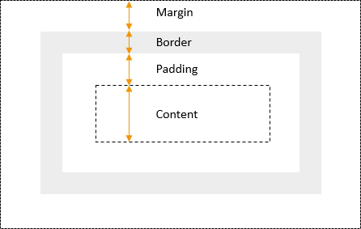
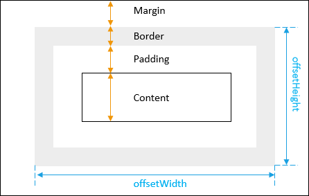
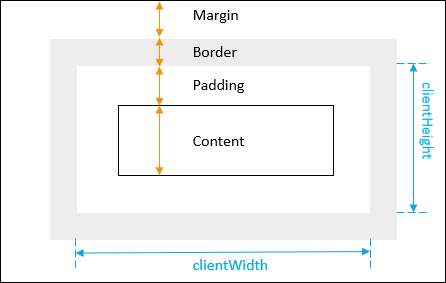

# Estilo JavaScript

**Resumo**: nesta sección, aprenderás a usar a propiedade ``style`` para manipular o estilo en liña dos elementos HTML.

## Establecer estilos en liña

Para establecer o estilo en liña dun elemento, usar a propiedade `style` dese elemento:

```js
element.style
```

A propiedade `style` devolve o obxecto de só lectura `CSSStyleDeclaration` que contén unha lista de propiedades CSS. Por exemplo, para establecer a cor dun elemento como `red`, usa o seguinte código:

```js
element.style.color = 'red';
```

Se a propiedade CSS contén guións ( `-`), por exemplo, `-webkit-text-stroke` se pode usar a notación tipo matriz (`[]`) para acceder á propiedade:

```js
element.style.['-webkit-text-stock'] = 'unset';
```

A seguinte táboa mostra as propiedades CSS máis comúns:

| **CSS**               | **JavaScript**       |
| :-------------------- | :------------------- |
| background            | background           |
| background-attachment | backgroundAttachment |
| background-color      | backgroundColor      |
| background-image      | backgroundImage      |
| background-position   | backgroundPosition   |
| background-repeat     | backgroundRepeat     |
| border                | border               |
| border-bottom         | borderBottom         |
| border-bottom-color   | borderBottomColor    |
| border-bottom-style   | borderBottomStyle    |
| border-bottom-width   | borderBottomWidth    |
| border-color          | borderColor          |
| border-left           | borderLeft           |
| border-left-color     | borderLeftColor      |
| border-left-style     | borderLeftStyle      |
| border-left-width     | borderLeftWidth      |
| border-right          | borderRight          |
| border-right-color    | borderRightColor     |
| border-right-style    | borderRightStyle     |
| border-right-width    | borderRightWidth     |
| border-style          | borderStyle          |
| border-top            | borderTop            |
| border-top-color      | borderTopColor       |
| border-top-style      | borderTopStyle       |
| border-top-width      | borderTopWidth       |
| border-width          | borderWidth          |
| clear                 | clear                |
| clip                  | clip                 |
| color                 | color                |
| cursor                | cursor               |
| display               | display              |
| filter                | filter               |
| float                 | cssFloat             |
| font                  | font                 |
| font-family           | fontFamily           |
| font-size             | fontSize             |
| font-variant          | fontVariant          |
| font-weight           | fontWeight           |
| height                | height               |
| left                  | left                 |
| letter-spacing        | letterSpacing        |
| line-height           | lineHeight           |
| list-style            | listStyle            |
| list-style-image      | listStyleImage       |
| list-style-position   | listStylePosition    |
| list-style-type       | listStyleType        |
| margin                | margin               |
| margin-bottom         | marginBottom         |
| margin-left           | marginLeft           |
| margin-right          | marginRight          |
| margin-top            | marginTop            |
| overflow              | overflow             |
| padding               | padding              |
| padding-bottom        | paddingBottom        |
| padding-left          | paddingLeft          |
| padding-right         | paddingRight         |
| padding-top           | paddingTop           |
| page-break-after      | pageBreakAfter       |
| page-break-before     | pageBreakBefore      |
| position              | position             |
| stroke-dasharray      | strokeDasharray      |
| stroke-dashoffset     | strokeDashoffset     |
| stroke-width          | strokeWidth          |
| text-align            | textAlign            |
| text-decoration       | textDecoration       |
| text-indent           | textIndent           |
| text-transform        | textTransform        |
| top                   | top                  |
| vertical-align        | verticalAlign        |
| visibility            | visibility           |
| width                 | width                |
| z-index               | zIndex               |

Para anular completamente o estilo en liña existente, establecer a propiedade  `cssText` do obxecto `style`. Por exemplo:

```js
element.style.cssText = 'color:red;background-color:yellow';
```

Ou podes usar o método `setAttribute()`m:

```js
element.setAttribute('style','color:red;background-color:yellow');
```

Unha vez configurado o estilo en liña, pode modificar unha ou máis propiedades CSS:

```js
element.style.color = 'blue';
```

Se non queres sobrescribir completamente as propiedades CSS existentes, podes concatenar a nova propiedade CSS como `cssText`:

```js
element.style.cssText += 'color:red;background-color:yellow';
```

Neste caso, o operador `+= ` engade a nova cadea de estilo á existente.

A seguinte función auxiliar `css()`  úsase para definir varios estilos para un elemento a partir dun obxecto de pares clave-valor:

```js
function css(e, styles) {
    for (const property in styles)
        e.style[property] = styles[property];
}
```

Podes usar esta función `css()` para definir varios estilos para un elemento co ``id`` `#content` do seguinte xeito:

```js
let content = document.querySelector('#content');
css(content, { background: 'yellow', border: 'solid 1px red'});
```

O seguinte exemplo usa o obxecto `style` para establecer as propiedades CSS dun parágrafo co ``id`` `content`:

```html
<!DOCTYPE html>
<html>
<head>
    <meta charset="utf-8">
    <title>JS Style Demo</title>
</head>
<body>
    <p id="content">JavaScript Setting Style Demo!</p>
    <script>
        let p = document.querySelector('#content');
        p.style.color = 'red';
        p.style.fontWeight = 'bold';
    </script>
</body>
</html>
```

**Como funciona:**

- En primeiro lugar, selecciona o elemento de parágrafo cuxo `id` é `content` usando o método `querySelector()`.
- A continuación, establece as propiedades da cor e do peso da fonte do parágrafo configurando as propiedades `color` e `fontWeight` do obxecto `style`.

## Obtención de estilos en liña

A propiedade `style` devolve os estilos en liña dun elemento. Non é moi útil na práctica porque a propiedade `style` non devolve as regras que veñen doutros lugares, por exemplo, estilos dunha folla de estilo externa.

Para aplicar todos os estilos a un elemento, debes usar o método `window.getComputedStyle()`.

## Resumo

- Usar as propiedades do obxecto `element.style` para establecer as propiedades CSS en liña para o elemento HTML.

# ``getComputedStyle``

**Resumo**: nesta sección, aprenderás a usar o método `getComputedStyle()` para obter as propiedades CSS calculadas dun elemento.

## Introdución ao método `getComputedStyle()`

`getComputedStyle()` é un método do obxecto `window`, que devolve un obxecto que contén o estilo calculado e un elemento:

```js
let style = window.getComputedStyle(element [,pseudoElement]);
```

### Parámetros

O método `getComputedStyle()` acepta dous argumentos:

- `element` é o elemento que quere devolver os estilos calculados. Se pasa outro tipo de nodo, por exemplo, nodo de texto, o método xerará un erro.
- `pseudoElement` especifica o pseudoelemento que debe coincidir. Por defecto é `null`.

Por exemplo, se queres obter o valor calculado de todas as propiedades CSS dunha ligazón co estado de ``hover``, pasa os seguintes argumentos ao método `getComputedStyle()`:

```js
let link = document.querySelector('a');
let style = getComputedStyle(link,':hover');
console.log(style);
```

Ter en conta que `window` é o obxecto global, polo tanto, pódese omitir ao chamar ao método `getComputedStyle()`.

### Valor de retorno

O método `getComputedStyle()` devolve un obxecto de estilo en directo que é unha instancia do obxecto `CSSStyleDeclaration`. O estilo actualízase automaticamente cando se cambian os estilos do elemento.

## Exemplos de `getComputedStyle()`

Poñamos algúns exemplos de uso do método `getComputedStyle()`.

### 1) Exemplo sinxelo de`getComputedStyle()`

Considera o seguinte exemplo:

```html
<!DOCTYPE html>
<html>

<head>
    <meta charset="utf-8">
    <title>JS getComputedStyle() Demo</title>
    <style type="text/css">
        .message {
            background-color: #fff3d4;
            border: solid 1px #f6b73c;
            padding: 20px;
            color: black;
        }
    </style>
</head>
<body>

    <p class="message" style="color:red">
        This is a JS getComputedStyle() Demo!
    </p>

    <script>
        let message = document.querySelector('.message');
        let style = getComputedStyle(message);

        console.log('color:', style.color);
        console.log('background color:', style.backgroundColor);
    </script>
</body>
</html>

```

> *Ter en conta que, para efectos de demostración, mesturamos todos os CSS e JavaScript con HTML. Na práctica, debes separalos en diferentes arquivos.*

**Saída:**

```css
color: rgb(255, 0, 0)
background color: rgb(255, 243, 212)
```

**Como funciona:**

- En primeiro lugar, definir as regras CSS para a clase `message` na sección de cabeceira do arquivo HTML. A cor do texto é negra.
- En segundo lugar, declarar un elemento de parágrafo cuxa cor de texto sexa vermella tal e como se define no estilo en liña. Esta regra anulará a definida na sección de cabeceira.
- En terceiro lugar, usar o método `getComputedStyle()` para obter todo o estilo calculado do elemento de parágrafo. A propiedade da cor é vermella como se indica na xanela da consola ( `rgb(255, 0, 0)`) como se esperaba.

### 2) Exemplo de pseudo-elementos e `getComputedStyle()`

O seguinte exemplo usa o método `getComputedStyle()` para extraer información de estilo dun pseudoelemento:

```html
<html>
<head>
    <title>JavaScript getComputedStyle() Demo</title>
    <style>
        body {
            font: arial, sans-serif;
            font-size: 1em;
            line-height: 1.6;
        }

        p::first-letter {
            font-size: 1.5em;
            font-weight: normal
        }
    </style>
</head>
<body>
    <p id='main'>JavaScript getComputedStyle() Demo for pseudo-elements</p>
    <script>
        let p = document.getElementById('main');
        let style = getComputedStyle(p, '::first-letter');
        console.log(style.fontSize);
    </script>
</body>
</html>
```

**Saída:**

```js
24px
```

**Como funciona:**

- En primeiro lugar, definir regras CSS para a primeira letra de calquera elemento de parágrafo na sección de cabeceira do arquivo HTML.
- A continuación, usar o método `getComputedStyle()` para extraer o estilo calculado do pseudoelemento. O tamaño da fonte da primeira letra do parágrafo co identificador é de 24 píxeles.

## Resumo

- `getComputedStyle()` é un método do obxecto `window`.
- `getComputedStyle()` é o método devolve un obxecto que contén o estilo calculado dun elemento.

# ``className``

**Resumo**: nesta sección, aprenderás a usar a propiedade `className` para manipular as clases CSS dun elemento.

## Introdución a ``className``

`className` é a propiedade dun elemento que devolve unha lista separada por espazos de clases CSS do elemento como cadea:

```js
element.className
```

Supón que tes o seguinte elemento `ul`:

```html
<ul id="menu" class="vertical main">
   <li>Homepage</li>
   <li>Services</li>
   <li>About</li>
   <li>Contact</li>
</ul>
```

O seguinte código mostra as clases do elemento `ul` na xanela da consola:

```js
let menu = document.querySelector('#menu');
console.log(menu.className);
```

**Saída:**

```bash
vertical main
```

Para engadir unha nova clase a un elemento mediante a propiedade `className`, pode [concatenar](https://www.javascripttutorial.net/javascript-string-concat/) o nome da clase existente cun novo:

```js
element.className += newClassName;
```

O operador  `+=` **concatena** `newClassName` a lista de clases existente do elemento. Polo tanto, cómpre prefixar o nome da nova clase cun espazo como este:

```js
let menu = document.querySelector('#menu');
menu.className += ' new';
console.log(menu.className);
```

**Saída:**

```bash
'vertical main new'
```

Na práctica, usarás `classList`para engadir unha nova clase ás clases existentes dun elemento:

```js
let menu = document.querySelector('#menu');
menu.classList.add('new');
console.log(menu.className);
```

**Saída:**

```bash
'vertical main new'
```

Para sobrescribir completamente todas as clases dun elemento, usa un operador de asignación sinxelo. Por exemplo:

```js
element.className = "class1 class2";
```

Para obter unha lista completa de clases dun elemento, só precisa acceder á propiedade `className`:

```
let classes = element.className;
```

Como `class` é unha palabra clave en JavaScript, úsase o nome `className` en lugar de `class`.

`class` tamén é un atributo HTML:

```html
<div id="note" class="info yellow-bg red-text">JS className</div>
```

mentres `className` é unha propiedade do elemento DOM :

```js
let note = document.querySelector('#note');
console.log(note.className);
```

Saída:

```bash
info yellow-bg red-text
```

Un elemento ten outra propiedade que che axuda a manipular mellor as súas clases CSS chamada `classList`.

## Resumo

- `className` devolve unha lista separada por espazos de clases dun elemento como cadea.

# ``classList``

**Resumo**: nesta sección, aprenderás a usar a propiedade `classList` para traballar coas clases CSS dun elemento.

## Introdución á propiedade `classList`

`classList` é unha propiedade de só lectura dun elemento que devolve unha colección activa de clases CSS:

```js
const classes = element.classList;
```

É `classList`un `DOMTokenList`obxecto que representa o contido do atributo de clase do elemento.

Aínda que `classList` é de só lectura, podes manipular as clases que contén usando varios métodos.

## Exemplos de `classList`

Poñamos algúns exemplos de manipulación de clases CSS do elemento a través da interface `classList`.

### 1) Obter as clases CSS dun elemento

Supón que tes un elemento `div` con dúas clases: `main` e `red`.

```js
<div id="content" class="main red">JavaScript classList</div>
```

O seguinte código mostra a lista de clases do elemento `div` na xanela da consola:

```js
let div = document.querySelector('#content');
for (let cssClass of div.classList) {
    console.log(cssClass);
}
```

**Saída:**

```
main
red
```

**Como funciona:**

- En primeiro lugar, selecciona o elemento `div` co ``id`` `content` usando o método `querySelector()`.
- A continuación, *itera* sobre os elementos do `classList` e móstranse as clases na xanela da consola.

### 2) Engadir unha ou máis clases á lista de clases dun elemento

Para engadir unha ou máis clases CSS á lista de clases dun elemento, use o método `add()` do `classList`.

Por exemplo, o seguinte código engade a clase  `info` á lista de clases do elemento `div` co ``id`` `content`:

```
let div = document.querySelector('#content');
div.classList.add('info');
```

O seguinte exemplo engade varias clases CSS á lista de clases dun elemento:

```js
let div = document.querySelector('#content');
div.classList.add('info','visible','block');
```

### 3) Eliminar a clase do elemento

Para eliminar unha clase CSS da lista de clases dun elemento, usamos o método `remove()`:

```js
let div = document.querySelector('#content');
div.classList.remove('visible');
```

Do mesmo xeito que co método `add()`, podes eliminar varias clases dunha vez:

```js
let div = document.querySelector('#content');
div.classList.remove('block','red');
```

### 4) Substituir unha clase do elemento

Para substituír unha clase CSS existente por outra nova, usa o método `replace()`:

```js
let div = document.querySelector('#content');
div.classList.replace('info','warning');
```

### 5) Comprobar se un elemento ten unha clase especificada

Para comprobar se o elemento ten unha clase especificada, usa o método `contains()`:

```js
let div = document.querySelector('#content');
div.classList.contains('warning'); // true
```

O método `contains()` devolve `true` se `classList` contén unha clase especificada; en caso contrario devolve `false` .

### 6) Cambiar unha clase

Se a lista de clases dun elemento contén un nome de clase especificado, o método ``toggle()`` elimínao. Se a lista de clases non contén o nome da clase, o método ``toggle()`` engádeo á lista de clases.

O seguinte exemplo usa o método `toggle()` para alternar a clase `visible` dun elemento co ``id`` `content`:

```js
let div = document.querySelector('#content');
div.classList.toggle('visible');
```

### Resumo

- A propiedade do elemento `classList` devolve a colección activa de clases CSS do elemento.
- Usa `add()` e `remove()` para engadir clases CSS e eliminar clases CSS da lista de clases dun elemento.
- Usa o método `replace()` para substituír unha clase existente por outra nova.
- Usa o método `contains()` para comprobar se a lista de clases dun elemento contén unha clase especificada
- Usa o método `toggle()` para alternar unha clase.

# Obter o ancho e o alto dun elemento

**Resumo**: nesta sección, aprenderás a obter a dimensión calculada actual dun elemento, incluíndo o ancho e o alto.

A seguinte imaxe mostra o modelo de caixa CSS que inclúe un elemento de bloque con contido, recheo, bordo e marxe:



Para obter o ancho e o alto do elemento que inclúen o recheo e o bordo, utiliza as propiedades `offsetWidth` e `offsetHeight` do elemento:

```js
let box = document.querySelector('.box');
let width = box.offsetWidth;
let height = box.offsetHeight;
```

A seguinte imaxe ilustra o `offsetWidth` e `offsetHeight` dun elemento:



Ver o seguinte exemplo:

```html
<!DOCTYPE html>
<html lang="en">

<head>
    <meta charset="UTF-8">
    <meta name="viewport" content="width=device-width, initial-scale=1.0">
    <title>Getting the Width and Height of an Element</title>
</head>

<body>
    <div class="box" style="width:100px;height:150px;border:solid 1px #000;padding:10px"></div>
    <script>
        let box = document.querySelector('.box');
        let width = box.offsetWidth;
        let height = box.offsetHeight;
        console.log({ width, height });
    </script>
</body>
</html>
```

**Saída:**

```bash
{width: 122, height: 172}
```

Neste exemplo:

- O ancho é de 100 píxeles
- O bordo é de 1px a cada lado, polo que é de 2px entre ambos
- O recheo 10px en cada lado, polo que é de 20px entre ambos

Polo tanto, o ancho total é 122px. Do mesmo xeito, a altura é de 172 px.

Para obter o ancho e o alto dun elemento como punto flotante despois da transformación CSS, usa o método `getBoundingClientRect()` do elemento DOM. Por exemplo:

```html
<!DOCTYPE html>
<html lang="en">
  <head>
    <meta charset="UTF-8" />
    <meta name="viewport" content="width=device-width, initial-scale=1.0" />
    <title>Getting the Width and Height of an Element</title>
  </head>

  <body>
    <div
      class="box"
      style="width:100px;height:150px;border:solid 1px #000;padding:10px"
    ></div>
    <script>
      let box = document.querySelector(".box");
      let width = box.offsetWidth;
      let height = box.offsetHeight;
      console.log({ width, height });

      const domRect = box.getBoundingClientRect();
      console.log(domRect);
    </script>
  </body>
</html>
```

**Saída:**

```json
{width: 122, height: 172}

DOMRect {x: 7.997685432434082, y: 7.997685432434082, width: 121.95602416992188, height: 171.95602416992188, top: 7.997685432434082, …}
```

## ``clientWidth`` e ``clientHeight``

Para obter o ancho e o alto do elemento que inclúe o recheo pero sen o bordo, usa as propiedades `clientWidth` e `clientHeight`

```js
let box = document.querySelector('.box');
let width = box.clientWidth;
let height = box.clientHeight;
```

A seguinte imaxe ilustra o `clientWidth`e `clientHeight`dun elemento:



Para obter a marxe dun elemento, usa o método `getComputedStyle()`:

```js
let box = document.querySelector(".box");
let style = getComputedStyle(box);

let marginLeft = parseInt(style.marginLeft);
let marginRight = parseInt(style.marginRight);
let marginTop = parseInt(style.marginTop);
let marginBottom = parseInt(style.marginBottom);
```

Para obter o ancho do bordo dun elemento, usa a propiedade do obxecto `style` devolto polo método `getComputedStyle()`:

```js
let box = document.querySelector(".box");
let style = getComputedStyle(box);

let borderTopWidth = parseInt(style.borderTopWidth) || 0;
let borderLeftWidth = parseInt(style.borderLeftWidth) || 0;
let borderBottomWidth = parseInt(style.borderBottomWidth) || 0;
let borderRightWidth = parseInt(style.borderRightWidth) || 0;
```

Para obter o alto e o ancho da xanela, usa o seguinte código:

```js
let width =
  window.innerWidth ||
  document.documentElement.clientWidth ||
  document.body.clientWidth;
let height =
  window.innerHeight ||
  document.documentElement.clientHeight ||
  document.body.clientHeight;
```

## Resumo

- Usar as propiedades ``offsetWidth`` e ``offsetHeight`` do elemento DOM para obter o seu ancho e alto.

---

nov 2023
