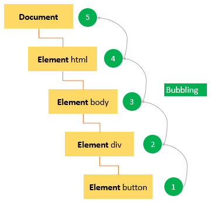
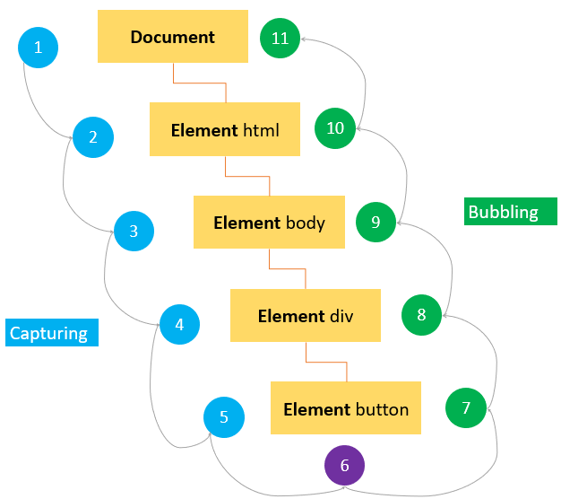
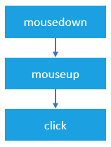
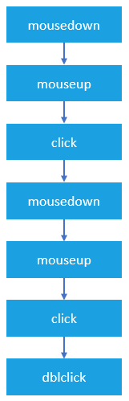
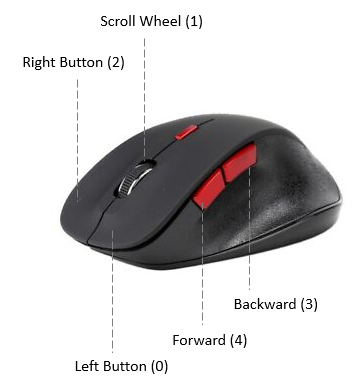
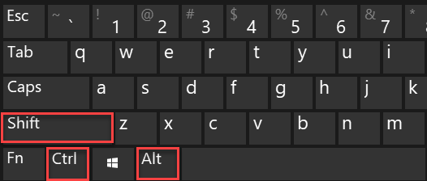
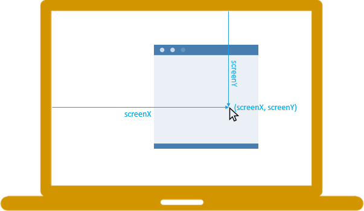

# Eventos JavaScript

**Resumo**: nesta sección, aprenderás sobre os eventos de JavaScript, os modelos de eventos e como xestionar eventos.

## Introdución aos eventos

**Un evento é unha acción que ocorre no navegador web**, que o navegador web lle envía para que se poida responder a el.

Por exemplo, cando os usuarios fan clic nun botón dunha páxina web, pódese querer responder a este evento`click` [mostrando unha caixa de diálogo](https://www.javascripttutorial.net/javascript-bom/javascript-alert/) .

Cada evento pode ter un controlador de eventos que é un bloque de código que se executará cando se produza o evento.

Un controlador de eventos tamén se coñece como *escoita de eventos*. Escoita o evento e execútase cando se produce.

Supón que tes un botón co ``id`` `btn`:

```html
<button id="btn">Click Me!</button>
```

Para definir o código que se executará ao facer clic no botón, cómpre rexistrar un controlador de eventos mediante o método `addEventListener()`:

```
let btn = document.querySelector('#btn');

function display() {
    alert('It was clicked!');
}

btn.addEventListener('click',display);
```

Cómo funciona.

- En primeiro lugar, selecciona o botón co ID `btn`usando o `querySelector()`método.
- A continuación, defina unha [función](https://www.javascripttutorial.net/javascript-function/) chamada `display()`como controlador de eventos.
- Finalmente, rexistre un controlador de eventos usando o `addEventListener()`para que cando os usuarios preman no botón, a `display()`función se execute.

Unha forma máis curta de rexistrar un controlador de eventos é colocar todo o código nunha función anónima, como esta:

```
let btn = document.querySelector('#btn');

btn.addEventListener('click',function() {
    alert('It was clicked!');
});
```

## Fluxo de eventos

Asumindo que tes o seguinte documento HTML:

```
<!DOCTYPE html>
<html>
<head>
    <title>JS Event Demo</title>
</head>
<body>
    <div id="container">
        <button id='btn'>Click Me!</button>
    </div>
</body>
```

Cando fas clic no botón, estás facendo clic non só no botón senón tamén no contedor do botón, o `div`, e toda a páxina web.

O fluxo de eventos explica a orde na que os eventos se reciben na páxina desde o elemento onde ocorre o evento e se propagan a través da árbore DOM.

Existen dous modelos de eventos principais: a burbulla de eventos e a captura de eventos.

### Burbulla de eventos

No modelo de burbulla de eventos, un evento comeza no elemento máis específico e logo flúe cara arriba cara ao elemento menos específico (o `document`ou incluso `window`).

Cando fai clic no botón, o `click`evento ocorre na seguinte orde:

1. botón
2. div co contedor de id
3. corpo
4. html
5. documento

O `click`evento ocorre primeiro no botón que é o elemento no que se fixo clic. A continuación, o `click`evento sube pola árbore DOM, disparando en cada nodo ao longo do seu camiño ata chegar ao `document`obxecto.

A seguinte imaxe ilustra o efecto de burbulla do evento cando os usuarios fan clic no botón:

[](https://www.javascripttutorial.net/wp-content/uploads/2020/02/JavaScript-event-bubbling.png)

Teña en conta que os navegadores web modernos fan burbullar o evento ata o `window`obxecto.

### Captura de eventos

No modelo de captura de eventos, un evento comeza no elemento menos específico e flúe cara abaixo cara ao elemento máis específico.

Cando fai clic no botón, o `click`evento ocorre na seguinte orde:

1. documento
2. html
3. corpo
4. div co contedor de id
5. botón

A seguinte imaxe ilustra o efecto de captura de eventos:

[](https://www.javascripttutorial.net/wp-content/uploads/2020/02/JavaScript-event-capturing.png)

### Fluxo de eventos de nivel 2 DOM

Os eventos de nivel 2 DOM especifican que o fluxo de eventos ten tres fases:

- En primeiro lugar, prodúcese a captura de eventos, que ofrece a oportunidade de interceptar o evento.
- Entón, o obxectivo real recibe o evento.
- Finalmente, prodúcese un burbullo de eventos, que permite unha resposta final ao evento.

A seguinte imaxe ilustra o modelo de eventos de nivel 2 DOM cando os usuarios fan clic no botón:

[](https://www.javascripttutorial.net/wp-content/uploads/2020/02/JavaScript-DOM-Level-2-Event.png)

## Obxecto evento

Cando ocorre o evento, o navegador web pasou un `Event`obxecto ao controlador de eventos:

```
let btn = document.querySelector('#btn');

btn.addEventListener('click', function(event) {
    console.log(event.type);
});
```

Saída:

```
'click'
```

A seguinte táboa mostra as propiedades e métodos máis utilizados do `event`obxecto:

| Propiedade / Método | Descrición                                                                                                                 |
| :------------------ | :------------------------------------------------------------------------------------------------------------------------- |
| burbullas           | verdadeiro se o evento burbullas                                                                                           |
| cancelable          | verdadeiro se se pode cancelar o comportamento predeterminado do evento                                                    |
| Obxectivo actual    | o elemento actual sobre o que se dispara o evento                                                                          |
| defaultPrevented    | devolve verdadeiro se se chamou a preventDefault().                                                                        |
| detalle             | máis información sobre o evento                                                                                            |
| EventFase           | 1 para a fase de captura, 2 para o obxectivo, 3 para o burbullo                                                            |
| preventDefault()    | cancelar o comportamento predeterminado para o evento. Este método só é efectivo se a `cancelable`propiedade é verdadeira  |
| stopPropagation ()  | cancelar calquera outra captura ou burbulla de eventos. Este método só se pode usar se a `bubbles`propiedade é verdadeira. |
| obxectivo           | o elemento obxectivo do evento                                                                                             |
| tipo                | o tipo de evento que se desencadeou                                                                                        |

Teña en conta que o `event`obxecto só é accesible dentro do controlador de eventos. Unha vez que se executaron todos os controladores de eventos, o obxecto do evento destrúese automaticamente.

### preventDefault()

Para evitar o comportamento predeterminado dun evento, usa o `preventDefault()`método.

Por exemplo, cando fai clic nunha ligazón, o navegador desprázao ata o URL especificado no `href`atributo:

```
<a href="https://www.javascripttutorial.net/">JS Tutorial</a>
```

Non obstante, pode evitar este comportamento usando o `preventDefault()`método do `event`obxecto:

```
let link = document.querySelector('a');

link.addEventListener('click',function(event) {
    console.log('clicked');
    event.preventDefault();
});
```

Teña en conta que o `preventDefault()`método non impide que o evento faga burbullas no DOM. E un evento pódese cancelar cando a súa `cancelable`propiedade sexa `true`.

### stopPropagation ()

O `stopPropagation()`método detén inmediatamente o fluxo dun evento a través da árbore DOM. Non obstante, non detén o comportamento predeterminado dos navegadores.

Vexa o seguinte exemplo:

```
let btn = document.querySelector('#btn');

btn.addEventListener('click', function(event) {
    console.log('The button was clicked!');
    event.stopPropagation();
});

document.body.addEventListener('click',function(event) {
    console.log('The body was clicked!');
});

```

Sen o `stopPropagation()`método, vería dúas mensaxes na xanela da consola.

Non obstante, o `click`evento nunca chega ao `body`porque `stopPropagation()`foi chamado no `click`controlador de eventos do botón.

## Resumo

- Un evento é unha acción que ocorre no navegador web, por exemplo, un clic do rato.
- O fluxo de eventos ten dous modelos principais: burbulla de eventos e captura de eventos.
- O evento de nivel 2 DOM especifica que o fluxo de eventos ten tres fases: burbulla de eventos, o evento ocorre no elemento exacto e captura de eventos.
- Utilízao `addEventListener()`para rexistrar un evento que conecta un evento cun oínte de eventos
- `event`Só se pode acceder ao obxecto dentro do escoitador de eventos.
- Use `preventDefault()`o método para evitar o comportamento predeterminado dun evento, pero non detén o fluxo de eventos.
- Use `stopPropagation()`o método para deter o fluxo dun evento a través da árbore DOM, pero non cancela o comportamento predeterminado do navegador.

# Manexo de eventos en JavaScript

**Resumo** : neste tutorial, aprenderás as distintas formas de realizar o manexo de eventos en JavaScript.

Cando se produce un [evento](https://www.javascripttutorial.net/javascript-dom/javascript-events/) , podes crear un controlador de eventos que é unha peza de código que se executará para responder a ese evento. Un controlador de eventos tamén se coñece como escoita de eventos. Escoita o evento e responde en consecuencia aos incendios do evento.

Un escoitador de eventos é unha [función](https://www.javascripttutorial.net/javascript-function/) cun nome explícito se é reutilizable ou unha función anónima no caso de que se use unha vez.

Un evento pode ser xestionado por un ou varios controladores de eventos. Se un evento ten varios controladores de eventos, todos os controladores de eventos executaranse cando se desencadee o evento.

Hai tres formas de asignar controladores de eventos.

## 1) Atributos do controlador de eventos HTML

Os controladores de eventos normalmente teñen nomes que comezan por `on`, por exemplo, o controlador de eventos para o `click`evento é `onclick`.

Para asignar un controlador de eventos a un evento asociado a un elemento HTML, pode usar un atributo HTML co nome do controlador de eventos. Por exemplo, para executar algún código cando se fai clic nun botón, usa o seguinte:

```
<input type="button" value="Save" onclick="alert('Clicked!')">
```

Neste caso, cando se fai clic no botón, móstrase a caixa [de alerta .](https://www.javascripttutorial.net/javascript-bom/javascript-alert/)

Cando asigna código JavaScript como valor do `onclick`atributo, cómpre escapar dos caracteres HTML como ampersand ( `&`), comiñas dobres ( `"`), menos que ( `<`), etc., ou obterá un erro de sintaxe.

Un controlador de eventos definido no HTML pode chamar a unha función definida nun script. Por exemplo:

```
<script>
    function showAlert() {
        alert('Clicked!');
    }
</script>
<input type="button" value="Save" onclick="showAlert()">
```

Neste exemplo, o botón chama á `showAlert()`función cando se fai clic.

É `showAlert()`unha función definida nun `<script>`elemento separado e pódese colocar nun ficheiro JavaScript externo.

### Notas importantes

Os seguintes son algúns puntos importantes cando usa os controladores de eventos como atributos do elemento HTML:

En primeiro lugar, o código do controlador de eventos pode acceder ao `event`obxecto sen definilo explícitamente:

```
<input type="button" value="Save" onclick="alert(event.type)">
```

En segundo lugar, o `this`valor dentro do controlador de eventos é equivalente ao elemento de destino do evento:

```
<input type="button" value="Save" onclick="alert(this.value)">
```

En terceiro lugar, o controlador de eventos pode acceder ás propiedades do elemento, por exemplo:

```
<input type="button" value="Save" onclick="alert(value)">
```

### Desvantaxes do uso dos atributos do controlador de eventos HTML

A asignación de controladores de eventos mediante atributos HTML considérase como malas prácticas e debe evitarse na medida do posible polas seguintes razóns:

En primeiro lugar, o código do controlador de eventos mestúrase co código HTML, o que fará que o código sexa máis difícil de manter e estender.

En segundo lugar, é unha cuestión de tempo. Se o elemento se carga completamente antes do código JavaScript, os usuarios poden comezar a interactuar co elemento na páxina web, o que provocará un erro.

Por exemplo, supoña que a seguinte `showAlert()`función está definida nun ficheiro JavaScript externo:

```
<input type="button" value="Save" onclick="showAlert()">
```

E cando a páxina está completamente cargada e JavaScript non foi cargado, a `showAlert()`función non está definida. Se os usuarios fan clic no botón neste momento, producirase un erro.

## 2) Controladores de eventos DOM Nivel 0

Cada elemento ten propiedades de controlador de eventos como `onclick`. Para asignar un controlador de eventos, configura a propiedade nunha función como se mostra no exemplo:

```
let btn = document.querySelector('#btn');

btn.onclick = function() {
    alert('Clicked!');
};
```

Neste caso, a función anónima convértese no método do `button`elemento. Polo tanto, o `this`valor é equivalente ao elemento. E pode acceder ás propiedades do elemento dentro do controlador de eventos:

```
let btn = document.querySelector('#btn');

btn.onclick = function() {
    alert(this.id);
};
```

Saída:

```
btn
```

Usando o `this`valor dentro do controlador de eventos, pode acceder ás propiedades e métodos do elemento.

Para eliminar o controlador de eventos, establece o valor da propiedade do controlador de eventos en `null`:

```
btn.onclick = null;
```

Os controladores de eventos DOM Level 0 aínda se están utilizando amplamente debido á súa sinxeleza e compatibilidade con varios navegadores.

## 3) Controladores de eventos DOM Nivel 2

Os controladores de eventos de nivel 2 de DOM proporcionan dous métodos principais para xestionar os oíntes de eventos rexistrados ou anulados:

- `addEventListener()`- rexistrar un controlador de eventos
- `removeEventListener()`– eliminar un controlador de eventos

Estes métodos están dispoñibles en todos os nodos DOM.

## O `addEventListener()`método

O `addEventListener()`método acepta tres argumentos: un nome de evento, unha función de controlador de eventos e un valor booleano que lle indica ao método que chame ao controlador de eventos durante a fase de captura ( `true`) ou durante a fase de burbulla ( `false`). Por exemplo:

```
let btn = document.querySelector('#btn');
btn.addEventListener('click',function(event) {
    alert(event.type); // click
});
```

É posible engadir varios controladores de eventos para xestionar un único evento, como este:

```
let btn = document.querySelector('#btn');
btn.addEventListener('click',function(event) {
    alert(event.type); // click
});

btn.addEventListener('click',function(event) {
    alert('Clicked!');
});
```

## O `removeEventListener()`método

Elimina `removeEventListener()`un detector de eventos que se engadiu a través do `addEventListener()`. Non obstante, cómpre pasar os mesmos argumentos que se pasaron ao `addEventListener()`. Por exemplo:

```
let btn = document.querySelector('#btn');

// add the event listener
let showAlert = function() {
    alert('Clicked!');
};
btn.addEventListener('click', showAlert);

// remove the event listener
btn.removeEventListener('click', showAlert);

```

Non funcionará o uso dun detector de eventos anónimo como o seguinte:

```
let btn = document.querySelector('#btn');
btn.addEventListener('click',function() {
   alert('Clicked!');
});

// won't work
btn.removeEventListener('click', function() {
   alert('Clicked!');
});
```

## Resumo

- Hai tres formas de asignar un controlador de eventos: o atributo do controlador de eventos HTML, a propiedade do controlador de eventos do elemento e `addEventListener()`.
- Debe evitarse asignar un controlador de eventos a través do atributo HTML de controlador de eventos.

# Eventos de carga da páxina JavaScript

**Resumo** : neste tutorial aprenderás sobre os eventos relacionados coa carga da páxina, incluíndo , `DOMContentLoaded`, e .` load``beforeunload``unload `

## Visión xeral dos eventos de carga da páxina JavaScript

Cando abre unha páxina, ocorren os seguintes eventos en secuencia:

- `DOMContentLoaded`– o navegador cargou HTML completamente e completou a construción da árbore DOM. Non obstante, non cargou recursos externos como follas de estilo e imaxes. Neste caso, pode comezar a seleccionar nodos DOM ou inicializar a interface.
- `load`– o navegador cargou completamente o HTML e tamén recursos externos como imaxes e follas de estilo.

Cando saes da páxina, os seguintes eventos desenvólvense en secuencia:

- `beforeunload`– dispara antes de que se descarguen a páxina e os recursos. Podes usar este evento para mostrar un diálogo de confirmación para confirmar se realmente queres saír da páxina. Ao facelo, pode evitar a perda de datos no caso de que estea enchendo un formulario e prema accidentalmente nunha ligazón para navegar a outra páxina.
- `unload`– dispara cando a páxina está completamente descargada. Podes usar este evento para enviar os datos analíticos ou para limpar recursos.

## Xestionar eventos de carga de páxinas JavaScript

Para xestionar os eventos da páxina, pode chamar ao `addEventListener()`método no `document`obxecto:

```
document.addEventListener('DOMContentLoaded',() => {
    // handle DOMContentLoaded event
});

document.addEventListener('load',() => {
    // handle load event
});

document.addEventListener('beforeunload',() => {
    // handle beforeunload event
});

document.addEventListener('unload',() => {
    // handle unload event
});

```

O seguinte exemplo ilustra como xestionar os eventos de carga da páxina:

```html
<!DOCTYPE html>
<html>
  <head>
    <title>JS Page Load Events</title>
  </head>

  <body>
    <script>
      addEventListener("DOMContentLoaded", (event) => {
        console.log("The DOM is fully loaded.");
      });

      addEventListener("load", (event) => {
        console.log("The page is fully loaded.");
      });

      addEventListener("beforeunload", (event) => {
        // show the confirmation dialog
        event.preventDefault();
        // Google Chrome requires returnValue to be set.
        event.returnValue = "";
      });

      addEventListener("unload", (event) => {
        // send analytic data
      });
    </script>
  </body>
</html>
```

## `onLoad`

**Resumo** : neste tutorial, aprenderás a xestionar o evento de carga que se desencadea no documento, a imaxe e os elementos do script en JavaScript.

## Evento de carga da xanela

Para o `window`obxecto, o `load`evento desenvólvese cando toda a páxina web (HTML) se cargou por completo, incluíndo todos os recursos dependentes, incluídos ficheiros JavaScript, ficheiros CSS e imaxes.

Para xestionar o `load`evento, rexistra un oínte de eventos mediante o `addEventListener()`método:

```
window.addEventListener('load', (event) => {
    console.log('The page has fully loaded');
});
```

Ou use a `onload`propiedade do `window`obxecto:

```
window.onload = (event) => {
    console.log('The page has fully loaded');
};
```

Se mantés un sistema herdado, podes descubrir que o `load`controlador de eventos está rexistrado no elemento do corpo do documento HTML, así:

```
<!DOCTYPE html>
<html>
<head>
    <title>JS load Event Demo</title>
</head>
<body onload="console.log('Loaded!')">
</body>
</html>Idioma do código:  HTML, XML  ( xml )
```

É unha boa práctica usar o `addEventListener()`método para asignar o `onload`controlador de eventos sempre que sexa posible.

## Evento de carga da imaxe

O `load`evento tamén dispara sobre imaxes. Para xestionar o `load`evento en imaxes, usa o `addEventListener()`método dos elementos da imaxe.

O seguinte exemplo usa o `load`controlador de eventos para determinar se unha imaxe, que existe na árbore DOM, foi completamente cargada:

```
<!DOCTYPE html>
<html>
<head>
    <title>Image load Event Demo</title>
</head>
<body>
    
    <script>
        let logo = document.querySelector('#logo');

        logo.addEventListener('load', (event) => {
            console.log('Logo has been loaded!');
        });

        logo.src = "logo.png";
    </script>
</body>
</html>
Idioma do código:  HTML, XML  ( xml )
```

Podes asignar un `onload`controlador de eventos directamente usando o `onload`atributo do ``elemento, así:

```

Idioma do código:  HTML, XML  ( xml )
```

Se crea un elemento de imaxe de forma dinámica, pode asignar un `onload`controlador de eventos antes de establecer a `src`propiedade do seguinte xeito:

```
window.addEventListener('load' () => {
    let logo = document.createElement('img');
    // assign and onload event handler
    logo.addEventListener('load', (event) => {
        console.log('The logo has been loaded');
    });
    // add logo to the document
    document.body.appendChild(logo);
    logo.src = 'logo.png';
});

```

**Como funciona:**

- En primeiro lugar, cree un elemento de imaxe despois de que o documento se cargue por completo colocando o código dentro do controlador de eventos do evento de carga da xanela.
- En segundo lugar, asigne o `onload`controlador de eventos á imaxe.
- En terceiro lugar, engade a imaxe ao documento.
- Finalmente, asigne un URL de imaxe ao `src`atributo. A imaxe descargarase no elemento tan pronto como `src`se estableza a propiedade.

## Evento de carga do script

O `<script>`elemento tamén admite o `load`evento lixeiramente diferente das formas estándar. O `load`evento do script permítelle comprobar se un ficheiro JavaScript foi completamente cargado.

A diferenza das imaxes, o navegador web comeza a descargar ficheiros JavaScript só despois de `src`asignar a propiedade e `<script>`engadir o elemento ao documento.

O seguinte código carga o `app.js`ficheiro despois de cargar completamente a páxina. Asigna un `onload`manejador de eventos para comprobar se se `app.js`cargou por completo.

```
window.addEventListener('load', checkJSLoaded)

function checkJSLoaded() {
    // create the script element
    let script = document.createElement('script');

    // assign an onload event handler
    script.addEventListener('load', (event) => {
        console.log('app.js file has been loaded');
    });

    // load the script file
    script.src = 'app.js';
    document.body.appendChild(script);
}
```

## Resumo

- O `load`evento ocorre cando o documento foi completamente cargado, incluíndo recursos dependentes como ficheiros JavaScript, ficheiros CSS e imaxes.
- Os elementos ``e `<script>`tamén apoian o `load`evento.
- Use o `addEventListener()`método para rexistrar un `onload`controlador de eventos.

# DOMCContentLoaded

**Resumo** : neste tutorial aprenderás sobre o `DOMContentLoaded`evento JavaScript.

Disígnase `DOMContentLoaded`cando se carga o contido DOM, sen esperar a que as imaxes e as follas de estilo rematen de cargarse.

Debes xestionar o `DOMContentLoaded`evento cando colocas o JavaScript na `head`páxina pero fai referencia a elementos no corpo, por exemplo:

```
<!DOCTYPE html>
<html>

<head>
    <title>JS DOMContentLoaded Event</title>
    <script>
        let btn = document.getElementById('btn');
        btn.addEventListener('click', (e) => {
            // handle the click event
            console.log('clicked');
        });
    </script>
</head>

<body>
    <button id="btn">Click Me!</button>
</body>

</html>
Idioma do código:  HTML, XML  ( xml )
```

Neste exemplo, facemos referencia ao botón `body`do JavaScript no `head`.

Como o DOM non se cargou cando o motor JavaScript analiza o JavaScript no `head`, o botón co ID `btn`non existe.

Para solucionar isto, coloca o código dentro dun `DOMContentLoaded`controlador de eventos, así:

```
<!DOCTYPE html>
<html>

<head>
    <title>JS DOMContentLoaded Event</title>
    <script>
        document.addEventListener('DOMContentLoaded', () => {
            let btn = document.getElementById('btn');
            btn.addEventListener('click', () => {
                // handle the click event
                console.log('clicked');
            });
        });
    </script>
</head>

<body>
    <button id="btn">Click Me!</button>
</body>

</html>
Idioma do código:  HTML, XML  ( xml )
```

Cando coloques JavaScript na cabeceira, causará pescozos de botella e atrasos de renderización, polo que é mellor mover o script antes da `</body>`etiqueta. Neste caso, non precisa colocar o código no `DOMContentLoaded`evento, así:

```
<!DOCTYPE html>
<html>

<head>
    <title>JS DOMContentLoaded Event</title>
</head>

<body>
    <button id="btn">Click Me!</button>
    <script>
        document.addEventListener('DOMContentLoaded', () => {
            let btn = document.getElementById('btn');
            btn.addEventListener('click', () => {
                // handle the click event
                console.log('clicked');
            });
        });
    </script>
</body>
</html>
Idioma do código:  HTML, XML  ( xml )
```

## Resumo

- O `DOMContentLoaded`evento desenvólvese cando se carga o contido DOM, sen esperar a que as imaxes e as follas de estilo rematen de cargarse.
- Só xestiona `DOMContentLoaded`o evento se colocas o código JavaScript no `head`, que fai referencia a elementos da sección do corpo.

# `unload`

**Resumo** : neste tutorial aprenderás a usar o `unload`evento JavaScript que se activa cando o documento está totalmente descargado.

Teña en conta que nunca debe usar o evento de descarga, é só como referencia.

## Introdución ao `unload`evento JavaScript

O `unload`evento desenvólvese cando un documento se descargou completamente. Normalmente, o `unload`evento desenvólvese cando navegas dunha páxina a outra.

O evento de descarga desenvólvese despois de:

- evento [antes de descargar](https://www.javascripttutorial.net/javascript-dom/javascript-beforeunload-event/)
- evento pagehide

Neste momento, o documento HTML está no seguinte estado:

- A IU non é visible para os usuarios e non é efectiva.
- Todos os recursos como img, iframe, etc., aínda existen.
- Un erro non deterá o fluxo de descarga.

Na práctica, nunca deberías usar o `unload`evento porque non é fiable en dispositivos móbiles e [causa un problema con bfcache](https://web.dev/bfcache/#never-use-the-unload-event) .

## Xestionando o evento de descarga de JavaScript

Para xestionar o `unload`evento, podes usar o `addEventListener()`método:

```
addEventListener('unload', (event) => {
    console.log('The page is unloaded');
});
```

Ou asigne un controlador de eventos á `onunload`propiedade do `window`obxecto:

```
window.onunload = (event) => {
    console.log('The page is unloaded');
};
```

Ou asigne un controlador de eventos ao `onunload`atributo do `<body>`elemento:

```
<!DOCTYPE html>
<html>
<head>
    <title>JS unload Event Demo</title>
</head>
<body onunload="console.log('The page is unloaded')">

</body>
</html>Idioma do código:  HTML, XML  ( xml )
```

É unha boa práctica usar o `addEventListener()`para rexistrar o controlador de eventos de descarga.

## Resumo

- JavaScript activa o `unload`evento cando un documento foi completamente descargado.
- Na práctica, non use o `unload`evento.

# Evento antes de descargar JavaScript

**Resumo** : neste tutorial aprenderás sobre o `beforeunload`evento JavaScript que che permite mostrar un diálogo de confirmación antes de saír dunha páxina web.

## `beforeunload`Evento de introdución ao JavaScript

Antes de descargar a páxina web e os seus recursos, `beforeunload`desenvólvese o evento. Neste momento, a páxina web aínda está visible e tes a oportunidade de cancelar o evento.

Para rexistrarte no `beforeunload`evento, usa o `window.addEventListener()`método:

```
window.addEventListener('beforeunload',(event) =>{
    // do something here
});
```

Xa que `window`é o obxecto global, podes omitilo así:

```
addEventListener('beforeunload',(event) =>{
    // do something here
});Idioma do código:  PHP  ( php )
```

Se unha páxina web ten un `beforeunload`detector de eventos e estás a piques de saír da páxina, o `beforeunload`evento activará un diálogo de confirmación para confirmar se realmente queres saír da páxina.

Se o confirmas, o navegador navegará á nova páxina. En caso contrario, cancela a navegación.

Segundo a especificación, cómpre chamar ao `preventDefault()`método dentro do `beforeunload`controlador de eventos para mostrar o diálogo de confirmación. Non obstante, non todos os navegadores implementan isto:

```
addEventListener('beforeunload',(event) => {
    event.preventDefault();
});Idioma do código:  PHP  ( php )
```

Historicamente, algúns navegadores permítenche mostrar unha mensaxe personalizada no diálogo de confirmación. Con isto pretendía informar aos usuarios de que perderán datos se navegan. Desafortunadamente, esta función úsase a miúdo para estafar aos usuarios. Como resultado, xa non se admite unha mensaxe personalizada.

En función da especificación HTML, as chamadas a `alert()`, `confirm()`, e `prompt()`ignóranse no `beforeunload`manejador de eventos.

## `beforeunload`Exemplo de evento JavaScript

O seguinte exemplo anexa un controlador de eventos ao `beforeunload`evento. Se fai clic na ligazón para navegar a outra páxina, o navegador mostrará un diálogo de confirmación.

```
<!DOCTYPE html>
<html lang="en">

<head>
    <meta charset="UTF-8">
    <meta name="viewport" content="width=device-width, initial-scale=1.0">
    <title>JS beforeunload Event</title>
</head>

<body>
    <a href="https://www.javascripttutorial.net/">JavaScript Tutorial</a>
    <script>
        window.addEventListener('beforeunload', (event) => {
            event.preventDefault();
            // Google Chrome requires returnValue to be set.
            event.returnValue = '';
        });
    </script>
</body>

</html>Idioma do código:  HTML, XML  ( xml )
```

## Resumo

- O `beforeunload`evento desenvólvese antes da páxina web e os seus recursos están a piques de descargarse.
- Use `beforeunload`para confirmar se os usuarios realmente queren abandonar a páxina para evitar a perda de datos.

# Eventos do rato JavaScript

**Resumo** : neste tutorial aprenderás sobre os eventos básicos do rato e as súas propiedades en JavaScript.

## Introdución aos eventos do rato JavaScript

Os eventos do rato desenvólvense cando usas o rato para interactuar cos elementos da páxina. Os eventos de nivel 3 DOM definen nove eventos do rato.

### `mousedown`,, `mouseup`e`click`

Cando `click`un elemento, desenvólvese como mínimo tres eventos do rato na seguinte secuencia:

1. Os `mousedown`lumes cando preme o botón do rato sobre o elemento.
2. Os `mouseup`lumes cando soltas o botón do rato sobre o elemento.
3. Os `click`lumes cando un `mousedown`e un `mouseup`detectados no elemento.

[](https://www.javascripttutorial.net/wp-content/uploads/2020/02/javascript-mouse-event-click-event.png)

Se presiona o botón do rato nun elemento e move o rato fóra do elemento, e despois solta o botón do rato. O único `mousedown`evento dispara sobre o elemento.

Do mesmo xeito, se presiona o botón do rato, move o rato sobre o elemento e solta o botón do rato, o único `mouseup`evento desenvólvese no elemento.

En ambos os casos, o `click`evento nunca se dispara.

### `dblclick`

Na práctica, raramente usas o `dblclick`evento. O `dblclick`evento desenvólvese cando fai dobre clic sobre un elemento.

Son necesarios dous clics en eventos para que `dblclick`se dispare un evento. O `dblclick`evento ten catro eventos desencadeados na seguinte orde:

1.  `mousedown`
2.  `mouseup`
3.  `click`
4.  `mousedown`
5.  `mouseup`
6.  `click`
7.  `dblclick`



Como podes ver, os `click`eventos sempre teñen lugar antes do `dblclick`evento. Se rexistras ambos `click`e `dblclick`os controladores de eventos no mesmo elemento, non saberás exactamente que usuario fixo clic ou fixo dobre clic no elemento.

### `mousemove`

O `mousemove`evento desenvólvese repetidamente cando moves o cursor do rato arredor dun elemento. Mesmo cando moves o rato un píxel, o `mousemove`evento segue desencadeando. Fará que a páxina sexa lenta, polo tanto, só rexistras `mousemove`o manejador de eventos só cando o necesites e eliminas inmediatamente o manejador de eventos en canto xa non se use, así:

```
element.onmousemove = mouseMoveEventHandler;
// ...
//  later, no longer use
element.onmousemove = null;
```

### `mouseover`/`mouseout`

Disénciase `mouseover`cando o cursor do rato está fóra do elemento e despois móvese dentro dos límites do elemento.

Disénciase `mouseout`cando o cursor do rato está sobre un elemento e despois move outro elemento.

### `mouseenter`/`mouseleave`

Disénciase `mouseenter`cando o cursor do rato está fóra dun elemento e despois móvese dentro dos límites do elemento.

Disénciase `mouseleave`cando o cursor do rato está sobre un elemento e despois móvese cara ao exterior dos límites do elemento.

Ambos `mouseenter`e `mouseleave`non burbulla e non se dispara cando o cursor do rato se move sobre os elementos descendentes.

## Rexistrando controladores de eventos do rato

Para rexistrar un evento do rato, debes seguir estes pasos:

- En primeiro lugar, seleccione o elemento usando `querySelector()`ou `getElementById()`método.
- A continuación, rexistre o evento do rato usando o `addEventListener()`método.

Por exemplo, supoña que tes o seguinte botón:

```
<button id="btn">Click Me!</button>Idioma do código:  HTML, XML  ( xml )
```

Para rexistrar un controlador de eventos de clic do rato, usa o seguinte código:

```
let btn = document.querySelector('#btn');

btn.addEventListener('click',(event) => {
    console.log('clicked');
});
```

ou pode asignar un controlador de eventos do rato á propiedade do elemento:

```
let btn = document.querySelector('#btn');

btn.onclick = (event) => {
    console.log('clicked');
};
```

Nos sistemas legados, pode descubrir que o controlador de eventos está asignado no atributo HTML do elemento:

```
<button id="btn" onclick="console.log('clicked')">Click Me!</button>Idioma do código:  HTML, XML  ( xml )
```

É unha boa práctica usar sempre o `addEventListener()`para rexistrar un controlador de eventos do rato.

## Detección de botóns do rato

O `event`obxecto pasado ao controlador de eventos do rato ten unha propiedade chamada `button`que indica que botón do rato foi presionado para activar o evento.

O botón do rato está representado por un número:

- 0: preme o botón principal do rato, normalmente o botón esquerdo.
- 1: preme o botón auxiliar, normalmente o botón central ou o botón da roda.
- 2: preme o botón secundario, normalmente o botón dereito.
- 3: preme o cuarto botón, normalmente o botón Atrás do navegador.
- 4: preme o quinto botón, normalmente o botón _de avance do navegador_ .



Vexa o seguinte exemplo:

```
<!DOCTYPE html>
<html>
<head>
    <title>JS Mouse Events - Button Demo</title>
</head>
<body>
    <button id="btn">Click me with any mouse button: left, right, middle, ...</button>
    <p id="message"></p>
    <script>
        let btn = document.querySelector('#btn');

        // disable context menu when right-mouse clicked
        btn.addEventListener('contextmenu', (e) => {
            e.preventDefault();
        });

        // show the mouse event message
        btn.addEventListener('mouseup', (e) => {
            let msg = document.querySelector('#message');
            switch (e.button) {
                case 0:
                    msg.textContent = 'Left mouse button clicked.';
                    break;
                case 1:
                    msg.textContent = 'Middle mouse button clicked.';
                    break;
                case 2:
                    msg.textContent = 'Right mouse button clicked.';
                    break;
                default:
                    msg.textContent = `Unknown mouse button code: ${event.button}`;
            }
        });
    </script>
</body>
</html>
Idioma do código:  HTML, XML  ( xml )
```

Neste exemplo, cando fai clic no botón co rato (clic co botón esquerdo, clic co botón dereito e clic co botón central), móstrase unha mensaxe correspondente no `<div>`elemento.

<iframe src="https://www.javascripttutorial.net/sample/dom/mouse-events/mouse-buttons/index.html" height="200" style="box-sizing: border-box; margin: 0px; max-width: 100%; border: none; min-height: 70px; width: 1064px; padding: 1rem;"></iframe>

## Teclas modificadoras

Cando fai clic nun elemento, pode premer unha ou máis teclas modificadoras: Maiúsculas, Ctrl, Alt e Meta.

[](https://www.javascripttutorial.net/wp-content/uploads/2020/02/javascript-mouse-event-modifier-keys.png)

Teña en conta que a tecla Meta é a tecla de Windows nos teclados de Windows e a tecla Comando no teclado de Apple.

Para detectar se se presionaron estas teclas modificadoras, pode usar o `event`obxecto pasado ao controlador de eventos do rato.

O `event`obxecto ten catro propiedades booleanas, onde cada unha delas está definida `true`se se mantén premida a tecla ou `false`se non se preme.

Vexa o seguinte exemplo:

```
<!DOCTYPE html>
<html>
<head>
    <title>JS Modifier Keys Demo</title>
</head>
<body>
    <button id="btnKeys">Click me with Alt, Shift, Ctrl pressed</button>
    <p id="messageKeys"></p>

    <script>
        let btnKeys = document.querySelector('#btnKeys');

        btnKeys.addEventListener('click', (e) => {
            let keys = [];

            if (e.shiftKey) keys.push('shift');
            if (e.ctrlKey) keys.push('ctrl');
            if (e.altKey) keys.push('alt');
            if (e.metaKey) keys.push('meta');

            let msg = document.querySelector('#messageKeys');
            msg.textContent = `Keys: ${keys.join('+')}`;
        });
    </script>
</body>
</html>Idioma do código:  HTML, XML  ( xml )
```

<iframe src="https://www.javascripttutorial.net/sample/dom/mouse-events/modifier-keys/index.html" height="200" style="box-sizing: border-box; margin: 0px; max-width: 100%; border: none; min-height: 70px; width: 1064px; padding: 1rem;"></iframe>

## Obtención de coordenadas da pantalla

As propiedades `screenX`e `screenY`do evento pasadas ao controlador de eventos do rato devolven as coordenadas da pantalla da localización do rato en relación coa pantalla enteira.



Por outra banda, as propiedades `clientX`e `clientY`proporcionan as coordenadas horizontais e verticais dentro da área de cliente da aplicación na que ocorreu o evento do rato:


Consulta a seguinte demostración:

```
<!DOCTYPE html>
<html>
<head>
    <title>JS Mouse Location Demo</title>
    <style>
        #track {
            background-color: goldenrod;
            height: 200px;
            width: 400px;
        }
    </style>
</head>
<body>
    <p>Move your mouse to see its location.</p>
    <div id="track"></div>
    <p id="log"></p>

    <script>
        let track = document.querySelector('#track');
        track.addEventListener('mousemove', (e) => {
            let log = document.querySelector('#log');
            log.innerText = `
            Screen X/Y: (${e.screenX}, ${e.screenY})
            Client X/Y: (${e.clientX}, ${e.clientY})`
        });
    </script>
</body>
</html>Idioma do código:  HTML, XML  ( xml )
```

<iframe src="https://www.javascripttutorial.net/sample/dom/mouse-events/mouse-location/index.html" height="400" style="box-sizing: border-box; margin: 0px; max-width: 100%; border: none; min-height: 70px; width: 1064px; padding: 1rem;"></iframe>

## Resumo

- O nivel 3 DOM define nove eventos do rato.
- Use `addEventListener()`o método para rexistrar un controlador de eventos do rato.
- Indica `event.button`que botón do rato se premeu para activar o evento do rato.
- As teclas modificadoras: alt, shift, ctrl e meta (Mac) pódense obter mediante as propiedades do obxecto do evento pasado ao controlador de eventos do rato.
- As propiedades `screenX`e `screenY`devolven as coordenadas horizontais e verticais do punteiro do rato en coordenadas da pantalla.
- As propiedades `clientX`e `clientY`do `event`obxecto devolven coordenadas horizontais e verticais dentro da área de cliente da aplicación na que ocorreu o evento do rato.

# Eventos do teclado JavaScript

**Resumo** : neste tutorial aprenderás a traballar con eventos do teclado JavaScript, incluíndo `keydown`, `keypress`e `keyup`.

## Introdución aos eventos do teclado JavaScript

Cando interactúas co teclado, desenvólvense os [eventos do teclado. ](https://www.javascripttutorial.net/javascript-dom/javascript-events/)Hai tres eventos principais do teclado:

- `keydown`– dispara cando preme unha tecla do teclado e dispara repetidamente mentres mantés premida a tecla.
- `keyup`– dispara cando soltas unha tecla do teclado.
- `keypress`– desenvólvese cando preme un teclado de caracteres como `a`, `b`, ou `c`, non a tecla de frecha esquerda, o teclado de inicio ou o teclado de finalización… `keypress`Tamén se dispara repetidamente mentres mantés premida a tecla do teclado.

Os eventos do teclado adoitan dispararse na caixa de texto, aínda que todos os elementos os admiten.

Cando preme unha tecla de carácter unha vez no teclado, desenvólvense tres eventos de teclado na seguinte orde:

1. `keydown`
2. `keypress`
3. `keyup`

Ambos `keydown`eventos `keypress`desenvólvense antes de que se faga calquera cambio na caixa de texto, mentres que o evento de teclado desenvólvese despois de que se fixeran os cambios na caixa de texto. Se mantés premida unha tecla de carácter, as `keydown`e `keypress`son activadas varias veces ata que soltas a tecla.

Cando preme unha tecla sen carácter, `keydown`primeiro desenvólvese o evento seguido do `keyup`evento. Se mantés premida a tecla sen carácter, dispararase `keydown`varias veces ata que soltas a tecla.

## Manexo de eventos do teclado

Para xestionar un evento de teclado, siga estes pasos:

- En primeiro lugar, selecciona o elemento no que se disparará o evento do teclado. Normalmente, é unha caixa de texto.
- A continuación, use o `element.addEventListener()`para rexistrar un controlador de eventos.

Supoña que tes a seguinte caixa de texto co ID `message`:

```
<input type="text" id="message">Idioma do código:  HTML, XML  ( xml )
```

O seguinte ilustra como rexistrar oíntes de eventos do teclado:

```
let msg = document.getDocumentById('#message');

msg.addEventListener("keydown", (event) => {
    // handle keydown
});

msg.addEventListener("keypress", (event) => {
    // handle keypress
});

msg.addEventListener("keyup", (event) => {
    // handle keyup
});Idioma do código:  PHP  ( php )
```

Se preme unha tecla de carácter, chamaranse os tres controladores de eventos.

## As propiedades do evento do teclado

O evento do teclado ten dúas propiedades importantes: `key`e `code`. A `key`propiedade devolve o carácter que se premeu mentres que a `code`propiedade devolve o código físico da tecla.

Por exemplo, se preme a `z`tecla do carácter, `event.key`volve `z`e `event.code`volve `KeyZ`.

Vexa o seguinte exemplo:

```
<!DOCTYPE html>
<html>
<head>
    <title>JavaScript Keyboard Events: Key/Code</title>
</head>
<body>
    <input type="text" id="message">

    <script>
        let textBox = document.getElementById('message');
        textBox.addEventListener('keydown', (event) => {
            console.log(`key=${event.key},code=${event.code}`);

        });
    </script>
</body>
</html>Idioma do código:  HTML, XML  ( xml )
```

Se escribe o carácter `z`, verá a seguinte mensaxe:

```
key=z,code=KeyZ
```

**Como funciona:**

- En primeiro lugar, selecciona a caixa de texto co ID `message`usando o `getElementById()`método.
- A continuación, rexistra un `keydown`oínte de eventos e rexistra a tecla e o código da tecla que se premeu.

## Resumo

- Cando preme unha tecla de carácter no teclado, os eventos `keydown`, `keypress`, e `keyup`desenvólvense secuencialmente. Non obstante, se preme unha tecla sen carácter, só se activan os eventos `keydown`e .`keyup`
- O `event`obxecto de teclado ten dúas propiedades importantes: `key`e `code` propiedades que permiten detectar que tecla se premeu.
- A `key`propiedade devolve o valor do `key`pulsado mentres que o `code`representa unha tecla física do teclado.

# Eventos de desprazamento de JavaScript

**Resumo** : neste tutorial aprenderás sobre os eventos de desprazamento de JavaScript e como xestionar correctamente os eventos de desprazamento.

## Introdución aos eventos de desprazamento de JavaScript

Cando desprazas un documento ou un elemento, desenvólvense os eventos de desprazamento. Podes activar os eventos de desprazamento das seguintes formas, por exemplo:

- Usando a barra de desprazamento manualmente
- Usando a roda do rato
- Premendo nunha ligazón de identificación
- Funcións de chamada en JavaScript

Para rexistrar un `scroll`controlador de eventos, chama ao `addEventListener()`método no elemento de destino, así:

```
targetElement.addEventListener('scroll', (event) => {
    // handle the scroll event
});Idioma do código:  PHP  ( php )
```

ou asignar un controlador de eventos á `onscroll`propiedade do elemento de destino:

```
targetElement.onscroll = (event) => {
    // handle the scroll event
};
```

## Desprazando o documento

Normalmente, xestionas os `scroll`eventos do `window`obxecto para xestionar o desprazamento de toda a páxina web.

O seguinte mostra como anexar un controlador de eventos ao `scroll`evento dunha páxina:

```
window.addEventListener('scroll',(event) => {
    console.log('Scrolling...');
});
```

Ou pode usar a `onscroll`propiedade do `window`obxecto:

```
window.onscroll = function(event) {
    //
};
```

A `onscroll`propiedade do `window`obxecto é a mesma que `document.body.onscroll`podes usalos indistintamente, por exemplo:

```
document.body.onscroll = null;
console.log(window.onscroll); // null

```

### Desprazamentos de desprazamento

O `window`obxecto ten dúas propiedades relacionadas cos eventos de desprazamento: `scrollX`e `scrollY`.

As propiedades `scrollX`e `scrollY`devolven o número de píxeles que o documento está actualmente desprazado horizontal e verticalmente. Os `scrollX`e `scrollY`son valores de punto flotante de dobre precisión, polo que se necesitas valores enteiros, podes usar o `Math.round()`para redondealos.

Os `scrollX`e `scrollY`son 0 se o documento non se moveu en absoluto.

Os `pageXOffset`e `pageYOffset`son alias das propiedades `scrollX`e `scrollY`.

## Desprazamento dun elemento

Como o `window`obxecto, podes anexar un `scroll`controlador de eventos a calquera elemento HTML. Non obstante, para realizar un seguimento da compensación de desprazamento, usa `scrollTop`e `scrollLeft`en lugar de `scrollX`e `scrollY`.

A `scrollTop`propiedade establece ou obtén o número de píxeles que o contido do elemento se despraza verticalmente. A `scrollLeft`propiedade obtén e establece o número de píxeles aos que se despraza o contido dun elemento desde o seu bordo esquerdo.

O seguinte exemplo mostra como xestionar o `scroll`evento do `div`elemento co id `scrollDemo`:

```
<!DOCTYPE html>
<html>
<head>
    <title>JS Scroll Events</title>
    <style>
        #scrollDemo {
            height: 200px;
            width: 200px;
            overflow: auto;
            background-color: #f0db4f
        }

        #scrollDemo p {
            /* show the scrollbar */
            height: 300px;
            width: 300px;
        }
    </style>
</head>
<body>
    <div id="scrollDemo">
        <p>JS Scroll Event Demo</p>
    </div>

    <div id="control">
        <button id="btnScrollLeft">Scroll Left</button>
        <button id="btnScrollTop">Scroll Top</button>
    </div>

    <script>
        let control = document.querySelector('#control');

        control.addEventListener('click', function (e) {
            // get the scrollDemo
            let div = document.getElementById('scrollDemo');
            // get the target
            let target = e.target;
            // handle each button's click
            switch (target.id) {
                case 'btnScrollLeft':
                    div.scrollLeft += 20;
                    break;

                case 'btnScrollTop':
                    div.scrollTop += 20;
                    break;
            }
        });
    </script>
</body>
</html>
Idioma do código:  HTML, XML  ( xml )
```

<iframe src="https://www.javascripttutorial.net/sample/dom/scroll/" height="300" style="box-sizing: border-box; margin: 0px; max-width: 100%; border: none; min-height: 70px; width: 1064px; padding: 1rem;"></iframe>

## As mellores formas de xestionar os eventos de desprazamento

Moitos `scroll`eventos desenvólvense mentres te desprazas por unha páxina ou un elemento. Se anexas un detector de eventos ao `scroll`evento, o código do controlador de eventos necesita tempo para executarse.

Isto provocará un problema coñecido como scroll jank. O efecto de desprazamento provoca un atraso para que a páxina non se sinta ancorada ao teu dedo.

### Acelerado de eventos

É moito mellor manter o `scroll`manejador de eventos lixeiro e executalo cada N milisegundos usando un temporizador. Entón, en lugar de usar o seguinte código (e nunca deberías usalo):

```
window.scroll = () => {
    // place the scroll handling logic here
};

```

Debes usar o seguinte código:

```
let scrolling = false;

window.scroll = () => {
    scrolling = true;
};

setInterval(() => {
    if (scrolling) {
        scrolling = false;
        // place the scroll handling logic here
    }
},300);

```

**Como funciona:**

- Primeiro, establece a `scrolling`bandeira en `false`. Se o `scroll`evento se dispara, pon a `scrolling`bandeira `true`dentro do `scroll`controlador de eventos.
- A continuación, execute o `scroll`controlador de eventos usando `setInterval()`cada 300 milisegundos se os `scroll`eventos foron desencadeados.

Esta forma de xestionar o `scroll`evento chámase **limitación de eventos** que acelera `onscroll`a operación subxacente dun 's cada 300 milisegundos. A limitación ralentiza a velocidade de execución do controlador de eventos de desprazamento.

### Eventos pasivos

Recentemente, os navegadores web modernos admiten eventos pasivos para eventos de entrada como `scroll`, `touchstart`, `wheel`, etc. Permite que o fío da IU xestione o evento inmediatamente antes de pasar o control ao teu controlador de eventos personalizado.

Nos navegadores web que admiten eventos pasivos, cómpre engadir a `passive`bandeira a calquera escoita de eventos que non chame a `preventDefault()`, así:

```
document.addEventListener(
    'scroll',
    (event) => {
        // handle scroll event
    },
    { passive: true }
);

```

Sen a `passive`opción, o código do controlador de eventos sempre será invocado antes de que o fío da IU realice o desprazamento.

Consulta [aquí](https://caniuse.com/#feat=passive-event-listener) cales son os navegadores que admiten eventos pasivos .

## Resumo

- O `scroll`evento desenvólvese cando te desprazas por unha páxina web ou un elemento.
- Para unha páxina, as propiedades `scrollX`e `scrollY`devolven o número de píxeles que o documento está actualmente desprazado horizontal e verticalmente.
- Para un elemento, as propiedades `scrollTop`e `scrollLeft`establecen ou obteñen o número de píxeles que o contido do elemento se despraza verticalmente e desprázase desde o seu bordo esquerdo.
- Use a técnica de limitación de eventos para xestionar mellor os eventos de desprazamento. Nos navegadores web modernos, pode usar escoitadores de eventos pasivos.

# scrollIntoView

**Resumo** : neste tutorial, aprenderás a desprazar un elemento na vista usando o seu `scrollIntoView()`método.

Supoña que tes unha lista de elementos e queres que un elemento específico se destaque e se desprace á vista.

Para conseguilo, pode usar o `element.scrollIntoView()`método. Acepta `element.scrollIntoView()`un valor booleano ou un obxecto:

```
element.scrollIntoView(alignToTop);
```

ou

```
element.scrollIntoView(options);Idioma do código:  CSS  ( css )
```

O método acepta un dos dous argumentos seguintes:

### `alignToTop`

É `alignToTop`un valor booleano.

Se se define como `true`, o método aliñará a parte superior do elemento coa parte superior da ventana gráfica ou a parte superior da área visible do antepasado que se pode desprazar.

Se se `alignToTop`define como `false`, o método aliñará a parte inferior do elemento á parte inferior da ventana gráfica ou á parte inferior da área visible do antepasado que se pode desprazar.

Por defecto, `alignToTop`é `true`.

### `options`

O `options`argumento é un obxecto que dá máis control sobre o aliñamento do elemento na vista. Non obstante, a compatibilidade do navegador web pode ser lixeiramente diferente.

O `options`obxecto ten as seguintes propiedades:

- `behavior`A propiedade define a animación de transición. A `behavior`propiedade acepta dous valores: `auto`ou `smooth`. Por defecto é `auto`.
- `block`a propiedade define o aliñamento vertical. Acepta un dos catro valores: `start`, `center`, `end`ou `nearest`. Por defecto, é `start`.
- `inline`a propiedade define o aliñamento horizontal. Tamén acepta un dos catro valores: `start`, `center`, `end`ou `nearest`. Por defecto é `nearest`.

## Exemplo de JavaScript scrollIntoView().

Supoña que tes unha páxina HTML cunha lista da linguaxe de programación como segue:

```
<!DOCTYPE html>
<html lang="en">
<head>
    <meta charset="UTF-8">
    <meta name="viewport" content="width=device-width, initial-scale=1.0">
    <title>JS scrollIntoView Demo</title>
    <link rel="stylesheet" href="style.css">
</head>
<body>
    <div class="container">
        <button class="btn">Scroll Into View</button>
        <ul>
            <li>C</li>
            <li>Java</li>
            <li>Python</li>
            <li>C++</li>
            <li>C#</li>
            <li>Go</li>
            <li>Visual Basic</li>
            <li>JavaScript</li>
            <li>PHP</li>
            <li>SQL</li>
            <li>R</li>
            <li>Swift</li>
            <li class="special">JavaScript</li>
            <li>MATLAB</li>
            <li>Assembly language</li>
            <li>Ruby</li>
            <li>PL/SQL</li>
            <li>Classic Visual Basic</li>
            <li>Perl</li>
            <li>Scratch</li>
            <li>Objective-C</li>
        </ul>
    </div>
    <script src="scrollIntoView.js"></script>
</body>
</html>
Idioma do código:  HTML, XML  ( xml )
```

Sen desprazarse, o `JavaScript`elemento da lista, que ten unha clase chamada `special`, non está na ventana gráfica. Cando `"Scroll Into View"`se fai clic no botón, o `JavaScript`elemento da lista desprázase á vista:

```
let btn = document.querySelector('.btn');
let el = document.querySelector('.special');

btn.addEventListener('click', function () {
    el.scrollIntoView(true);
});

```

**Como funciona:**

- Primeiro, [selecciona](https://www.javascripttutorial.net/javascript-dom/javascript-queryselector/) o botón coa `btn`clase e lista o elemento coa `special`clase.
- A continuación, anexa un detector de eventos ao evento de clic do botón.
- Finalmente, desprácese polo `JavaScript`elemento da lista na ventana gráfica chamando ao método`el.scrollIntoView(true)` no manexador de eventos de clic.

<iframe src="https://www.javascripttutorial.net/sample/dom/scrollintoview/" height="400" style="box-sizing: border-box; margin: 0px; max-width: 100%; border: none; min-height: 70px; width: 1064px; padding: 1rem;"></iframe>

[Aquí está a demostración de JavaScript scrollIntoView().](https://www.javascripttutorial.net/sample/dom/scrollintoview/)

Para aliñar o `JavaScript`elemento da lista na parte inferior da vista, pasa `false`o valor ao `scrollIntoView()`método:

```
let btn = document.querySelector('.btn');
let el = document.querySelector('.special');

btn.addEventListener('click', function() {
    el.scrollIntoView(false);
});
```

Neste tutorial, aprendeu a usar o `scrollIntoView()`método JavaScript para desprazar un elemento na ventana gráfica.

# Eventos de enfoque de JavaScript

**Resumo** : neste tutorial, aprenderás sobre os eventos de foco de JavaScript que fan un seguimento dos elementos nos que se centran os usuarios.

## Introdución aos eventos de foco de JavaScript

Os `focus`eventos desenvólvense cando un elemento recibe ou perde o foco. Estes son os dous eventos principais:

- `focus`dispara cando un elemento recibiu foco.
- `blur`dispara cando un elemento perdeu o foco.

Os `focusin`e `focusout`disparan ao mesmo tempo que `focus`e `blur`, con todo, burbullan mentres que o `focus`e `blur`non.

Os seguintes elementos son enfocables:

- A **xanela** gaña foco cando a avanzas usando `Alt+Tab`ou facendo clic nela e perde o foco cando a envias de volta.
- **Ligazóns** cando usas un rato ou un teclado.
- **Campos de formulario** como texto de entrada cando usa un teclado ou un rato.
- Elementos con **tabindex** , tamén cando se usa un teclado ou un rato.

## Exemplos de eventos de foco de JavaScript

O seguinte exemplo mostra como xestionar os eventos `focus`e `blur`. Cando moves o foco ao `password`campo, o fondo cambia a `yellow`. Se moves o rato ao `username`campo, o fondo cambia a `white`.

```
<!DOCTYPE html>
<html>
<head>
    <title>JavaScript Focus Events</title>
</head>
<body>
    <p>Move focus to the password field to see the effect:</p>

    <form id="form">
        <input type="text" placeholder="username">
        <input type="password" placeholder="password">
    </form>

    <script>
        const pwd = document.querySelector('input[type="password"]');

        pwd.addEventListener('focus', (e) => {
            e.target.style.backgroundColor = 'yellow';
        });

        pwd.addEventListener('blur', (e) => {
            e.target.style.backgroundColor = '';
        });
    </script>
</body>
</html>Idioma do código:  HTML, XML  ( xml )
```

## Resumo

- Use o `focus`evento para xestionar o estado do elemento cando ten ou perde o foco.

# Evento de cambio hash de JavaScript

**Resumo** : neste tutorial aprenderás sobre o `hashchange`evento JavaScript e como manexalo de forma eficaz.

## Introdución ao `hashchange`evento JavaScript

O hash do URL é todo o que segue o signo de libra ( `#`) no URL. Por exemplo, supoña que tes o seguinte URL:

```
https://www.javascripttutorial.net/javascript-dom/javascript-hashchange/#header
```

O URL hash é `header`. Se o hash do URL cambia a `footer`, así:

```
https://www.javascripttutorial.net/javascript-dom/javascript-hashchange/#footer
```

O `hashchange`evento desenvólvese cando o hash do URL cambia dun a outro. Neste exemplo, cambia de `#header`a `#footer`.

Para anexar un detector de eventos ao `hashchange`evento, chama ao `addEventListener()`método no `window`obxecto:

```
window.addEventListener('hashchange',() =>{
    console.log('The URL has has changed');
});
```

Para obter o hash do URL actual, accede á propiedade hash do `location`obxecto:

```
window.addEventListener('hashchange',() => {
    console.log(`The current URL hash is ${location.hash}`);
});
```

Ademais, pode xestionar o `hashchange`evento asignando un detector de eventos á `onhashchange`propiedade do `window`obxecto:

```
window.onhashchange = () => {
    // handle hashchange event here
};
```

## Resumo

- O `hashchange`evento desenvólvese cando o hash do URL cambiou.
- Para rexistrar un detector de eventos, chama ao `addEventListener()`método ou asigna un detector de eventos á `onhashchange`propiedade do `window`obxecto.

# Delegación de eventos JavaScript

**Resumo** : neste tutorial, aprenderá a usar a delegación de eventos JavaScript que engade un único controlador de eventos ao elemento principal en lugar de ter que rexistrar varios controladores de eventos aos elementos fillos.

## Introdución á delegación de eventos de JavaScript

Supoña que tes o seguinte menú:

```
<ul id="menu">
    <li><a id="home">home</a></li>
    <li><a id="dashboard">Dashboard</a></li>
    <li><a id="report">report</a></li>
</ul>Idioma do código:  HTML, XML  ( xml )
```

Para xestionar o `click`evento de cada elemento do menú, pode engadir os `click`controladores de eventos correspondentes:

```
let home = document.querySelector('#home');
home.addEventListener('home',(event) => {
    console.log('Home menu item was clicked');
});

let dashboard = document.querySelector('#dashboard');
dashboard.addEventListener('dashboard',(event) => {
    console.log('Dashboard menu item was clicked');
});

let report = document.querySelector('#report');
report.addEventListener('report',(event) => {
    console.log('Report menu item was clicked');
});

```

En JavaScript, se tes un gran número de [controladores de eventos](https://www.javascripttutorial.net/javascript-dom/handling-events-in-javascript/) nunha páxina, estes controladores de eventos afectarán directamente o rendemento polos seguintes motivos:

- En primeiro lugar, cada controlador de eventos é unha [función](https://www.javascripttutorial.net/javascript-function/) que tamén é un [obxecto](https://www.javascripttutorial.net/javascript-objects/) que ocupa memoria. Cantos máis obxectos na memoria, máis lento será o rendemento.
- En segundo lugar, leva tempo asignar todos os controladores de eventos, o que provoca un atraso na interactividade da páxina.

Para solucionar este problema, podes aproveitar o [evento burbulla](https://www.javascripttutorial.net/javascript-dom/javascript-events/) .

En lugar de ter varios controladores de eventos, pode asignar un único controlador de eventos para xestionar todos os `click`eventos:

```
let menu = document.querySelector('#menu');

menu.addEventListener('click', (event) => {
    let target = event.target;

    switch(target.id) {
        case 'home':
            console.log('Home menu item was clicked');
            break;
        case 'dashboard':
            console.log('Dashboard menu item was clicked');
            break;
        case 'report':
            console.log('Report menu item was clicked');
            break;
    }
});
```

Cómo funciona.

- Cando fai clic en calquera `<a>`elemento dentro do `<ul>`elemento co id `menu`, o `click`evento aparece no elemento pai que é o `<ul>`elemento. Polo tanto, en lugar de xestionar o `click`evento do `<a>`elemento individual, pode capturar o `click`evento no elemento pai.
- No `click`detector de eventos, pode acceder á `target`propiedade que fai referencia ao elemento que envía o evento. Para obter o `id`elemento que realmente desencadea o evento, usa a `target.id`propiedade.
- Unha vez que teña o `id`elemento que desencadea o `click`evento, pode ter un código que xestione o evento de forma correspondente.

A forma en que tratamos o problema dos controladores de demasiados eventos chámase delegación de eventos.

A delegación de eventos refírese á técnica de aproveitar o burbullamento de eventos para xestionar eventos a un nivel superior no DOM que o elemento no que se orixinou o evento.

## Beneficios da delegación de eventos de JavaScript

Cando sexa posible, pode ter un único controlador de eventos no `document`que xestionará todos os eventos dun tipo particular. Ao facelo, obtén os seguintes beneficios:

- Menos uso de memoria, mellor rendemento.
- Menos tempo necesario para configurar os controladores de eventos na páxina.
- O `document`obxecto está dispoñible inmediatamente. Mentres o elemento estea representado, pode comezar a funcionar correctamente sen demora. Non necesitas esperar aos eventos `DOMContentLoaded`ou `load`.

## Resumo

- Ter un gran número de controladores de eventos ocupará memoria e degradará o rendemento dunha páxina.
- A técnica de delegación de eventos utiliza o burbullo de eventos para xestionar o evento a un nivel superior no DOM que o elemento no que se orixinou o evento.

# Evento de envío de JavaScript

**Resumo** : neste tutorial, aprenderás a crear e enviar eventos mediante programación usando `Event`o constructor e `dispatchEvent()`o método.

Normalmente, os eventos xéranse mediante accións do usuario, como [clics do rato](https://www.javascripttutorial.net/javascript-dom/javascript-mouse-events/) e [pulsacións de teclas](https://www.javascripttutorial.net/javascript-dom/javascript-keyboard-events/) . Ademais, pódense xerar eventos a partir do código.

Para xerar un evento mediante programación, siga estes pasos:

- Primeiro, crea un novo `Event`obxecto usando `Event`o constructor.
- A continuación, desencadea o evento usando `element.dispatchEvent()`o método.

## Construtor de eventos

Para crear un novo evento, usa o `Event`construtor deste xeito:

```
let event = new Event(type, [,options]);
```

O `Event`construtor acepta dous parámetros:

### tipo

é unha cadea que especifica o tipo de evento como `'click'`.

### opcións

é un obxecto con dúas propiedades opcionais:

- `bubbles`: é un valor booleano que determina se o evento burbulla ou non. Se é así `true`, o evento burbulla e viceversa.
- `cancelable`: tamén é un valor booleano que especifica se o evento se pode cancelar cando é `true`.

Por defecto, o `options`obxecto é:

```
{ bubbles: false, cancelable: false}Idioma do código:  CSS  ( css )
```

Por exemplo, o seguinte crea un novo `click`evento co `options`obxecto predeterminado:

```
let clickEvent = new Event('click');
```

## método dispatchEvent

Despois de crear un evento, pode disparalo nun elemento de destino usando o `dispatchEvent()`método como este:

```
element.dispatchEvent(event);Idioma do código:  CSS  ( css )
```

Por exemplo, o seguinte código mostra como crear o `click`evento e activalo nun botón:

HTML:

```
<button class="btn">Test</button>Idioma do código:  HTML, XML  ( xml )
```

JavaScript:

```
let btn = document.querySelector('.btn');

 btn.addEventListener('click', function () {
        alert('Mouse Clicked');
 });

let clickEvent = new Event('click');
btn.dispatchEvent(clickEvent);

```

[Fai clic nesta ligazón para ver a demostración](https://www.javascripttutorial.net/sample/dom/dispatchevent/) .

Neste exemplo, o controlador de eventos execútase coma se o `click`evento fose xerado por accións do usuario.

Se o evento provén das accións do usuario, a `event.isTrusted`propiedade establécese en `true`. No caso de que o evento sexa xerado por código, `event.isTrusted`é `false`. Polo tanto, pode examinar o valor da `event.isTrusted`propiedade para comprobar a "autenticidade" do evento.

O `Event`é o tipo base do `UIEvent`cal é o tipo base doutros tipos de eventos específicos como `MouseEvent`, `TouchEvent`, `FocusEvent`e `KeyboardEvent`.

É unha boa práctica usar o construtor de eventos especializado como MouseEvent en lugar de usar o `Event`tipo xenérico porque estes construtores proporcionan máis información específica para os eventos.

Por exemplo, o `MouseEvent`evento ten moitas outras propiedades, como `clientX`e `clientY`que especifican as coordenadas horizontais e verticais nas que se produciu o evento en relación coa ventana gráfica:

```
let clickEvent = new MouseEvent("click", {
    bubbles: true,
    cancelable: true,
    clientX: 150,
    clientY: 150
});
```

A seguinte ligazón mostra a lista completa de propiedades do [MouseEvent](https://www.w3.org/TR/uievents/#idl-mouseevent)

## Resumo

- Use o constructor de eventos específico, como o método `MouseEvent`e chamada `dispatchEvent()`nun elemento para xerar un evento a partir do código.
- Utilízase `event.isTrusted`para examinar se o evento se xera a partir de código ou accións do usuario.

# Eventos personalizados de JavaScript

**Resumo** : neste tutorial, aprenderá sobre os eventos personalizados de JavaScript, como crear un evento personalizado e envialo.

## Introdución aos eventos personalizados de JavaScript

A seguinte [función](https://www.javascripttutorial.net/javascript-function/) destaca un elemento cambiando a súa cor de fondo a `yellow`:

```
function highlight(elem) {
    const bgColor = 'yellow';
    elem.style.backgroundColor = bgColor;
}
```

Para executar un fragmento de código despois de resaltar o elemento, podes facer unha [devolución de chamada](https://www.javascripttutorial.net/javascript-callback/) :

```
function highlight(elem, callback) {
    const bgColor = 'yellow';
    elem.style.backgroundColor = bgColor;

    if(callback && typeof callback === 'function') {
        callback(elem);
    }
}

```

O seguinte chama a `highlight()`función e engade un bordo a un `<div>`elemento:

```
<!DOCTYPE html>
<html lang="en">
<head>
    <meta charset="UTF-8">
    <meta name="viewport" content="width=device-width, initial-scale=1.0">
    <title>JS Custom Event Demo</title>
</head>
<body>
    <div class="note">JS Custom Event Demo</div>
    <script>
        function highlight(elem, callback) {
            const bgColor = 'yellow';
            elem.style.backgroundColor = bgColor;

            if (callback && typeof callback === 'function') {
                callback(elem);
            }
        }

        let note = document.querySelector('.note');
        function addBorder(elem) {
            elem.style.border = "solid 1px red";
        }

        highlight(note, addBorder);
    </script>
</body>
</html>Idioma do código:  HTML, XML  ( xml )
```

Para facer o código máis flexible, podes usar o evento personalizado.

### Creación de eventos personalizados JavaScript

Para crear un evento personalizado, usa o `CustomEvent()`construtor:

```
let event = new CustomEvent(eventType, options);
```

Ten `CustomEvent()`dous parámetros:

- É `eventType`unha cadea que representa o nome do evento.
- É `options`un obxecto que ten a `detail`propiedade que contén calquera información personalizada sobre o evento.

O seguinte exemplo mostra como crear un novo evento personalizado chamado `highlight`:

```
let event = new CustomEvent('highlight', {
    detail: {backgroundColor: 'yellow'}
});

```

### Envío de eventos personalizados de JavaScript

Despois de crear un evento personalizado, debes anexar o evento a un elemento DOM e activalo mediante o `dispatchEvent()`método:

```
domElement.dispatchEvent(event);
```

## Exemplo de eventos personalizados

Xúntao todo:

```
<!DOCTYPE html>
<html lang="en">
<head>
    <meta charset="UTF-8">
    <meta name="viewport" content="width=device-width, initial-scale=1.0">
    <title>JavaScript Custom Event</title>
</head>
<body>
    <div class="note">JS Custom Event</div>
    <script>
        function highlight(elem) {
            const bgColor = 'yellow';
            elem.style.backgroundColor = bgColor;

            // create the event
            let event = new CustomEvent('highlight', {
                detail: {
                    backgroundColor: bgColor
                }
            });
            // dispatch the event
            elem.dispatchEvent(event);
        }

        // Select the div element
        let div = document.querySelector('.note');

        // Add border style
        function addBorder(elem) {
            elem.style.border = "solid 1px red";
        }

        // Listen to the highlight event
        div.addEventListener('highlight', function (e) {
            addBorder(this);

            // examine the background
            console.log(e.detail);
        });

        // highlight div element
        highlight(div);
    </script>
</body>
</html>Idioma do código:  HTML, XML  ( xml )
```

**Como funciona:**

- En primeiro lugar, declara a `highlight()`función que resalta un elemento e desencadea o `highlight`evento.
- En segundo lugar, seleccione o `<div>`elemento mediante o `querySelector()`método.
- En terceiro lugar, escoita o `highlight`evento. Dentro do oínte de eventos, chama á `addBorder()`función e mostra a `detail`propiedade na Consola.
- Finalmente, chame á `highlight()`función que desencadeará o `highlight`evento.

## Por que usar eventos personalizados

Os eventos personalizados permítenche desacoplar o código que queres executar despois de que se complete outra peza de código. Por exemplo, pode separar os oíntes de eventos nun script separado. Ademais, podes ter varios oíntes de eventos para o mesmo evento personalizado.

## Resumo

- Use o `CustomEvent()`constructor para crear un evento personalizado e `dispatchEvent()`activalo.
