# 01. Como cambiar a visibilidade do contrasinal

**Resumo** : neste tutorial, aprenderás a cambiar a visibilidade dunha entrada de contrasinal usando JavaScript simple.

Un campo de contrasinal ofrece unha forma de que os usuarios introduzan un contrasinal de forma segura mostrando o `*`carácter en lugar dos caracteres reais.

Non obstante, é probable que algúns usuarios escriban o contrasinal incorrecto. Para axudalos a ver o contrasinal que están introducindo actualmente, podes engadir un botón que lles permita cambiar a visibilidade do contrasinal.

Para facer visible o contrasinal, siga estes pasos:

- En primeiro lugar, cree un `<input>`elemento co tipo de `password`e unha icona que permita aos usuarios premer nel para cambiar a visibilidade do contrasinal.
- En segundo lugar, vincula un controlador de eventos ao evento de clic da icona. Se se fai clic na icona, alterna o `type`atributo do campo de contrasinal entre `text`e `password`. A entrada co tipo `text`mostrará o contrasinal real.
- En terceiro lugar, cambia a icona para facelo máis fácil de usar. Este paso é opcional.

Para facelo máis sinxelo, utilizaremos dúas iconas da icona Bootstrap para cambiar a visibilidade do contrasinal.

O seguinte mostra o código HTML da páxina:

```
<!DOCTYPE html>
<html lang="en">

<head>
    <meta charset="UTF-8" />
    <meta name="viewport" content="width=device-width, initial-scale=1.0" />
    <title>Toggle Password Visibility</title>
    <link rel="stylesheet" href="https://cdn.jsdelivr.net/npm/bootstrap-icons@1.3.0/font/bootstrap-icons.css" />
    <link rel="stylesheet" href="css/style.css" />
</head>

<body>
    <div class="container">
        <h1>Sign In</h1>
        <form method="post">
            <p>
                <label for="username">Username:</label>
                <input type="text" name="username" id="username">
            </p>
            <p>
                <label for="password">Password:</label>
                <input type="password" name="password" id="password" />
                <i class="bi bi-eye-slash" id="togglePassword"></i>
            </p>
            <button type="submit" id="submit" class="submit">Log In</button>
        </form>
    </div>
    <script>
        const togglePassword = document.querySelector("#togglePassword");
        const password = document.querySelector("#password");

        togglePassword.addEventListener("click", function () {
            // toggle the type attribute
            const type = password.getAttribute("type") === "password" ? "text" : "password";
            password.setAttribute("type", type);

            // toggle the icon
            this.classList.toggle("bi-eye");
        });

        // prevent form submit
        const form = document.querySelector("form");
        form.addEventListener('submit', function (e) {
            e.preventDefault();
        });
    </script>
</body>

</html>Idioma do código:  HTML, XML  ( xml )
```

A páxina HTML ten un elemento de entrada co tipo `password`e un `<i>`elemento coas clases CSS proporcionadas por Bootstrap CSS.

O CSS Bootstrap permítelle usar a clase `bi-eye`do `<i>`elemento para mostrar a icona do ollo. Para cambiar a icona de ollo a ollo, só tes que cambiar a clase do `<i>`elemento a`bi-eye-slash`

Para colocar a icona dentro da entrada do contrasinal, pode usar a marxe negativa do `<i>`elemento do seguinte xeito:

```
form i {
    margin-left: -30px;
    cursor: pointer;
}Idioma do código:  CSS  ( css )
```

O resto do CSS é sinxelo.

No JavaScript:

En primeiro lugar, seleccione a icona de alternar contrasinal e o campo de entrada de contrasinal usando o `querySelector()`método:

```
const togglePassword = document.querySelector('#togglePassword');
const password = document.querySelector('#password');
```

A continuación, [anexa un detector de eventos](https://www.javascripttutorial.net/dom/events/add-an-event-handler/) á `togglePassword`icona e alterna o `type`atributo do campo de contrasinal e a [clase da icona](https://www.javascripttutorial.net/dom/css/toggle-a-class-of-an-element/) :

```
togglePassword.addEventListener('click', function (e) {
    // toggle the type attribute
    const type = password.getAttribute('type') === 'password' ? 'text' : 'password';
    password.setAttribute('type', type);
    // toggle the eye / eye slash icon
    this.classList.toggle('bi-eye');
});
```

<iframe src="https://www.javascripttutorial.net/sample/dom/miniprojects/toggle-password-visibility/index.html" height="350px" style="box-sizing: border-box; margin: 0px; max-width: 100%; border: none; min-height: 70px; width: 1064px; padding: 1rem;"></iframe>

Para ver toda a páxina, podes [consultala aquí](https://www.javascripttutorial.net/sample/dom/miniprojects/toggle-password-visibility/index.html) .

# 02. Aprende a función de debote de JavaScript creando a aplicación de busca de Wikipedia

**Resumo** : neste tutorial, aprenderás sobre a función de eliminación de rebote de JavaScript e como usala para mellorar o rendemento da aplicación.

Para comprender a función de eliminación de rebotes, vai construír unha [aplicación de busca na Wikipedia](https://www.javascripttutorial.net/sample/dom/wikipedia-search/) usando a técnica de programación de rebotes.

## Crea a estrutura do cartafol do proxecto

En primeiro lugar, crea un novo cartafol chamado `wikipedia-search`que almacenará os ficheiros dos proxectos.

En segundo lugar, cree tres cartafoles dentro do `wikipedia-search`cartafol chamado `js`, `css`e `img`. Estes cartafoles almacenarán ficheiros JavaScript, CSS e imaxes en consecuencia.

En terceiro lugar, crea o `style.css`no `css`cartafol e no `app.js`tamén `js`, descarga a seguinte imaxe e cópiaa no `img`cartafol. Usarás o logotipo para crear a IU da aplicación.


Finalmente, cree un `index.html`ficheiro no cartafol raíz.

A estrutura do proxecto terá o seguinte aspecto:

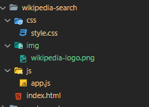

## Construír a páxina HTML

Abre o ficheiro index.html e engade o seguinte código:

```
<!DOCTYPE html>
<html lang="en">
<head>
    <meta charset="UTF-8">
    <meta name="viewport" content="width=device-width, initial-scale=1.0">
    <title>Wikipedia Search</title>
    <link rel="stylesheet" href="css/style.css">
</head>
<body>
    <header>
        
        <h1>Wikipedia Search</h1>
        <input type="text" name="searchTerm" id="searchTerm" placeholder="Enter a search term...">
    </header>
    <main id="searchResult"></main>
    <script src="js/app.js"></script>
</body>
</html>Idioma do código:  HTML, XML  ( xml )
```

Neste ficheiro HTML:

- En primeiro lugar, ligue ao `style.css`ficheiro na `<head>`sección.
- En segundo lugar, engade unha `<script>`etiqueta cuxas `src`ligazóns ao `app.js`ficheiro e colócaa xusto antes da `</body>`etiqueta.
- En terceiro lugar, engade dúas seccións ao corpo da páxina HTML. A primeira sección é a cabeceira que mostra o logotipo da Wikipedia, o título e a caixa de busca. A segunda sección inclúe a `<main>`etiqueta que mostrará o resultado da busca.

## Copia o código CSS

Navegue ata o ficheiro [style.css](https://www.javascripttutorial.net/sample/dom/wikipedia-search/css/style.css) , copie o seu código e pégueo no `style.css`ficheiro do `css`cartafol. Cando abras o `index.html`ficheiro, deberías ver algo así como [a seguinte páxina](https://www.javascripttutorial.net/sample/dom/wikipedia-search/) .

## Xestionar eventos de entrada

En primeiro lugar, selecciona os `<input>`elementos e resultados da busca usando o `querySelector()`método:

```
const searchTermElem = document.querySelector('#searchTerm');
const searchResultElem = document.querySelector('#searchResult');
```

En segundo lugar, establece o foco no `<input>`elemento chamando ao `focus()`método:

```
searchTermElem.focus();Idioma do código:  CSS  ( css )
```

En terceiro lugar, anexa un `input`detector de eventos para o `<input>`elemento:

```
searchTermElem.addEventListener('input', function (event) {
    console.log(event.target.value);
});
```

Se escribes algo de texto no `<input>`elemento, verás que `input`ocorre o evento, que mostra o texto na Consola.

Por exemplo, cando escribe o `debounce`elemento `<input>`:

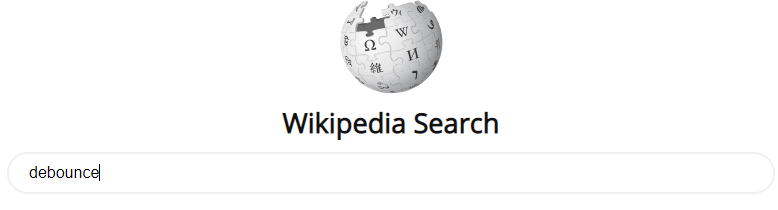

… verás os seguintes textos na Consola:

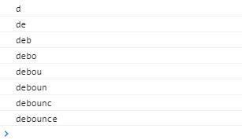

## Obtén os resultados da busca usando a API de Wikipedia

A API de Wikipedia é bastante sinxela. Non require unha clave API.

Para obter os temas por un termo de busca, cómpre engadir o `srsearch`parámetro de consulta:

```
&srsearch=<searchTerm>Idioma do código:  HTML, XML  ( xml )
```

ao seguinte URL:

```
https://en.wikipedia.org/w/api.php?action=query&list=search&prop=info|extracts&inprop=url&utf8=&format=json&origin=*&srlimit=10
```

... e enviar unha `GET`solicitude HTTP.

Por exemplo, pode obter os temas relacionados coa `debounce`palabra clave enviando unha `GET`solicitude HTTP ao seguinte URL:

```
https://en.wikipedia.org/w/api.php?action=query&list=search&prop=info|extracts&inprop=url&utf8=&format=json&origin=*&srlimit=10&srsearch=debounce
```

Por certo, pode abrir o URL anterior no navegador web para ver a resposta.

Desde JavaScript, pode usar a [API de recuperación](https://www.javascripttutorial.net/javascript-fetch-api/) , que está dispoñible en todos os navegadores web modernos, para enviar unha `GET`solicitude HTTP.

O seguinte crea a `search()`función acepta un termo de busca, fai unha `GET`solicitude HTTP a Wikipedia e mostra os resultados da busca na Consola:

```
const search = async (searchTerm) => {
    try {
        const url = `https://en.wikipedia.org/w/api.php?action=query&list=search&prop=info|extracts&inprop=url&utf8=&format=json&origin=*&srlimit=10&srsearch=${searchTerm}`;
        const response = await fetch(url);
        const searchResults = await response.json();

        // show the search result in the console
        console.log({
            'term': searchTerm,
            'results': searchResults.query.search
        });

    } catch (error) {
        console.log(error);
    }
}
```

Cómo funciona.

En primeiro lugar, constrúe o URL da API engadindo o `srsearch`parámetro de consulta ao punto final:

```
const url = `https://en.wikipedia.org/w/api.php?action=query&list=search&prop=info|extracts&inprop=url&utf8=&format=json&origin=*&srlimit=10&srsearch=${searchTerm}`;
```

En segundo lugar, use o `fetch()`método para enviar unha `GET`solicitude HTTP. Dado que o `fetch()`método devolve unha promesa, cómpre usar `await`a palabra clave para esperar a resposta.

A promesa devolta pola `fetch()`función ten moitos métodos, un deles é `json()`. O `json()`método tamén devolve outra promesa que se resolve nun resultado en formato JSON.

Debido á `await`palabra clave, cómpre marcar a `search()`función como unha `async`función como esta:

```
const search = async (searchTerm) = {
   /// ...
};
```

O obxecto devolto do `json()`método ten moitas propiedades. E para obter os resultados da busca, cómpre acceder á `searchResults.query.search`propiedade.

Para probar o `search()`método, chámao no `input`detector de eventos do seguinte xeito:

```
searchTermElem.addEventListener('input', function (event) {
    search(event.target.value);
});
```

O seguinte mostra o `app.js`ficheiro completo:

```
const searchTermElem = document.querySelector('#searchTerm');
const searchResultElem = document.querySelector('#searchResult');

searchTermElem.select();

searchTermElem.addEventListener('input', function (event) {
    search(event.target.value);
});

const search = async (searchTerm) => {
    try {
        const url = `https://en.wikipedia.org/w/api.php?action=query&list=search&prop=info|extracts&inprop=url&utf8=&format=json&origin=*&srlimit=10&srsearch=${searchTerm}`;
        const response = await fetch(url);
        const searchResults = await response.json();

        // show the search result in the console
        console.log({
            'term': searchTerm,
            'results': searchResults.query.search
        });

    } catch (error) {
        console.log(error);
    }
}
```

Agora, se abres o `index.html`ficheiro e escribes a `debounce`palabra clave no elemento de entrada, verás os seguintes resultados na Consola:

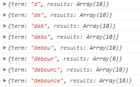

A saída indica que a `search()`función se executa para cada carácter que escriba. Chama á API para cada entrada de texto, o que non é eficiente.

Para limitar o número de solicitudes, enviarás solicitudes de API só cando sexa necesario. Noutras palabras, enviará unha solicitude de API só despois de que os usuarios fagan unha pausa ou deixen de escribir durante un período de tempo, por exemplo, medio segundo.

Para facelo, pode usar o [setTimeout()](https://www.javascripttutorial.net/javascript-bom/javascript-settimeout/) e `clearTimeout()`a función:

- Cando os usuarios escriban un carácter, use a `setTimeout()`función para programar a execución da función search() despois dun período de tempo.
- Se os usuarios seguen escribindo, cancela ese temporizador usando a `clearTimeout()`función. No caso de que os usuarios fagan unha pausa ou deixen de escribir, deixe que o temporizador execute a función programada para buscar.

O seguinte mostra a nova versión da `search()`función:

```
let timeoutId;

const search = (searchTerm) => {
    // reset the previous timer
    if (timeoutId) {
        clearTimeout(timeoutId);
    }

    // set up a new timer
    timeoutId = setTimeout(async () => {
        try {
            const url = `https://en.wikipedia.org/w/api.php?action=query&list=search&prop=info|extracts&inprop=url&utf8=&format=json&origin=*&srlimit=10&srsearch=${searchTerm}`;
            const response = await fetch(url);
            const searchResults = await response.json();

            // show the search result in the console
            console.log({
                'term': searchTerm,
                'results': searchResults.query.search
            });
        } catch (error) {
            console.log(error);
        }
    }, 500);
};
```

Dado que o `await`código relacionado se move á función de devolución de chamada do `setTimeout()`, cómpre marcar a devolución de chamada coa `async`palabra clave e eliminar a `async`palabra clave da `search()`función.

Se abres o `index.html`ficheiro no navegador web e escribes a palabra clave debonce sen facer unha pausa (durante medio segundo) e paras, verás que a aplicación só realizará unha solicitude da API.

E esta técnica coñécese como **debouncing** .

## O que é desbotar

Se tes unha tarefa que leva moito tempo, como unha solicitude de API que se dispara a miúdo, afectará o rendemento da aplicación.

**Desbouncing** é unha técnica de programación que limita o número de veces que se chama unha función.

### Desenvolver unha función de debote reutilizable

A `debounce()`función debe aceptar unha función ( `fn`), limita o número de chamadas a ela e devolve unha función:

```
const debounce = (fn) => {
   return (arg) => {
      // logic to limit the number of call fn
      fn(arg);
   };
};
```

O seguinte usa as funcións `clearTimeout()`e `setTimeout()`para eliminar a `fn`función:

```
const debounce = (fn) => {
    let timeoutId;

    return (arg) => {
        // cancel the previous timer
        if (timeoutId) {
            clearTimeout(timeoutId);
        }
        // setup a new timer
        timeoutId = setTimeout(() => {
            fn(arg);
        }, 500);
    };
};
```

Normalmente, a `fn`función aceptará máis dun argumento. Para invocar a `fn`función cunha lista de argumentos, usa o `apply()`método:

```
const debounce = (fn, delay=500) => {
    let timeoutId;

    return (...args) => {
        // cancel the previous timer
        if (timeoutId) {
            clearTimeout(timeoutId);
        }
        // setup a new timer
        timeoutId = setTimeout(() => {
            fn.apply(null, args);
        }, delay);
    };
};
```

Cómo funciona:

- En primeiro lugar, substitúe o número codificado `500`polo `delay`argumento para que poida especificar o tempo de espera antes de executar a `fn`función. O valor predeterminado do atraso é 500 ms.
- En segundo lugar, engade o `...args`á función devolta. É `...arg`un [parámetro de descanso](https://www.javascripttutorial.net/es6/javascript-rest-parameters/) que che permite recoller todos os argumentos da `fn()`función nunha matriz `args`.
- En terceiro lugar, `fn.apply(null, args)`executa a `fn()`función cos argumentos especificados na `args`matriz.

### Use a función de rebote

O seguinte elimina a lóxica de rebote da `search()`función e utiliza a `debounce()`función no seu lugar:

```
const search = debounce(async (searchTerm) => {
    try {
        const url = `https://en.wikipedia.org/w/api.php?action=query&list=search&prop=info|extracts&inprop=url&utf8=&format=json&origin=*&srlimit=10&srsearch=${searchTerm}`;
        const response = await fetch(url);
        const searchResults = await response.json();

        // show the search result in the console
        console.log({
            'term': searchTerm,
            'results': searchResults.query.search
        });
    } catch (error) {
        console.log(error);
    }
});
```

## Converte os resultados da busca a HTML

Mostraremos o título e o fragmento de cada resultado da busca na saída. Antes de facelo, necesitaremos algunhas funcións de utilidade:

### Elimina etiquetas HTML

O `title`e `snippet`do resultado da busca da chamada á API pode conter etiquetas HTML. E é seguro eliminar todas as etiquetas HTML antes de renderizalas.

A seguinte función de utilidade elimina as etiquetas HTML dunha cadea:

```
const stripHtml = (html) => {
    let div = document.createElement('div');
    div.textContent = html;
    return div.textContent;
};

```

A `stripHtml()`función acepta unha cadea HTML. Crea un `<div>`elemento temporal, asígnalle `innerHTML`a cadea HTML e devolve a súa `textContent`propiedade.

Teña en conta que esta función só funcionará nos navegadores web porque depende da API DOM do navegador web.

### Resalte o termo de busca

É máis intuitivo se os termos da busca están destacados no resultado da busca.

Esta `highlight()`función destaca todas as ocorrencias do `keyword`in the `str`envolvendo cada ocorrencia da palabra clave nunha `<span>`etiqueta coa `highlight`clase:

```
const highlight = (str, keyword, className = "highlight") => {
    const hl = `<span class="${className}">${keyword}</span>`;
    return str.replace(new RegExp(keyword, 'gi'), hl);
};
```

Teña en conta que a función usa a [expresión regular](https://www.javascripttutorial.net/javascript-regular-expression/) para substituír todas as ocorrencias de `keyword`polo `<span>`elemento.

### Converte os resultados da busca a HTML

A seguinte `generateSearchResultHTML()`función converte os resultados da busca a HTML:

```
const generateHTML= (results, searchTerm) => {
    return results
        .map(result => {
            const title = highlight(stripHtml(result.title), searchTerm);
            const snippet = highlight(stripHtml(result.snippet), searchTerm);

            return `<article>
                <a href="https://en.wikipedia.org/?curid=${result.pageid}">
                    <h2>${title}</h2>
                </a>
                <div class="summary">${snippet}...</div>
            </article>`;
        })
        .join('');
}
```

Cómo funciona.

- En primeiro lugar, use o `map()`método para devolver a representación HTML de cada resultado da busca e o `join()`método para unir os resultados da busca (en formato HTML) nunha única cadea HTML.
- En segundo lugar, elimina as etiquetas HTML e resalta o termo de busca na chamada á API `title`e devolta.`snippet`

## Mostra os resultados da busca

Cambia o `search()`método que usa a `generateSearchResultHTML()`función e engade o seu resultado ao `searchResultElem`. Ademais, restablece o resultado da busca se o termo de busca está baleiro:

```
const search = debounce(async (searchTerm) => {

    // if the search term is removed,
    // reset the search result
    if (!searchTerm) {
        // reset the search result
        searchResultElem.innerHTML = '';
        return;
    }

    try {
        // make an API request
        const url = `https://en.wikipedia.org/w/api.php?action=query&list=search&prop=info|extracts&inprop=url&utf8=&format=json&origin=*&srlimit=10&srsearch=${searchTerm}`;
        const response = await fetch(url);
        const searchResults = await response.json();

        // render search result
        const searchResultHtml = generateSearchResultHTML(searchResults.query.search, searchTerm);

        // add the search result to the searchResultElem
        searchResultElem.innerHTML = searchResultHtml;
    } catch (error) {
        console.log(error);
    }
});
```

Agora, se abres `index.html`no navegador web, verás a [aplicación que funciona.](https://www.javascripttutorial.net/sample/dom/wikipedia-search/)

## Resumo

Neste tutorial, aprendeu os seguintes puntos clave:

- Use a `fetch()`API para facer `GET`solicitudes HTTP.
- Use as `async/await`palabras clave para que o código asíncrono pareza máis limpo.
- Comprender a técnica de programación de rebotes e desenvolver unha `debounce()`función JavaScript reutilizable.

# 03. Contador de palabras JavaScript

**Resumo** : neste tutorial, aprenderás a crear unha aplicación de contador de palabras usando JavaScript de vainilla.

Aquí está a [aplicación de contador de palabras](https://javascripttutorial.net/sample/dom/word-counter/index.html) que vas crear.

## Crea a estrutura do proxecto

En primeiro lugar, cree o cartafol do proxecto chamado `word-counter`.

En segundo lugar, no `word-counter`proxecto, cree os cartafoles `css`e `js`, que almacenarán ficheiros CSS e JavaScript en consecuencia.

En terceiro lugar, cree un `style.css`ficheiro dentro do `css`cartafol e dous ficheiros JavaScript chamados `word-counter.js`e `app.js`dentro do `js`cartafol.

Finalmente, cree o `index.html`ficheiro no cartafol raíz do proxecto.

A estrutura do cartafol do proxecto final será así:

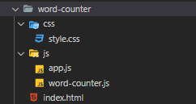

## Crea o ficheiro HTML

Primeiro, edite o `index.html`ficheiro e coloque os ficheiros CSS e JavaScript no `index.html`ficheiro:

```
<!DOCTYPE html>
<html lang="en">
<head>
    <meta charset="UTF-8">
    <meta name="viewport" content="width=device-width, initial-scale=1.0">
    <title>JavaScript Word Counter</title>
    <link rel="stylesheet" href="css/style.css">
</head>
<body>

    <script src="js/word-counter.js"></script>
    <script src="js/app.js"></script>
</body>
</html>Idioma do código:  HTML, XML  ( xml )
```

A aplicación WordCounter terá un `<textarea>`elemento sinxelo. Cando introduza algún texto, mostrará o número de caracteres e palabras que introduciu.

Para facelo, necesitarás ter `<textarea>`e `<div>`elementos:

- O `<textarea>`elemento permitirache introducir texto.
- E o `<div>`elemento mostrará o número de caracteres e palabras introducidos no `<textarea>`elemento.

Por defecto, o `<div>`elemento debe mostrar 0 caracteres e 0 palabras.

En segundo lugar, engade os elementos `<textarea>`e `<div>`ao `index.html`ficheiro despois da `<body>`etiqueta de apertura e antes da primeira `<script>`etiqueta:

```
<!DOCTYPE html>
<html lang="en">
<head>
    <meta charset="UTF-8">
    <meta name="viewport" content="width=device-width, initial-scale=1.0">
    <title>JavaScript Word Counter</title>
    <link rel="stylesheet" href="css/style.css">
</head>
<body>

<h1>Word Counter</h1>
    <label for="text">Enter some text below:</label>
    <textarea id="text" rows="10" cols="60"></textarea>
    <div id="stat">You've written 0 words and 0 characters.</div>
    <script src="js/word-counter.js"></script>
    <script src="js/app.js"></script>
</body>
</html>Idioma do código:  HTML, XML  ( xml )
```

## Crea a clase WordCounter

Primeiro, crearás a `WordCounter`clase no `word-counter.js`ficheiro:

```
class WordCounter {
}
```

A `WordCounter`clase aceptará un `<textarea>`elemento. Escoitará o `input`evento do `<textarea>`elemento e calculará o número de caracteres e palabras que `<textarea>`ten o elemento.

En segundo lugar, engade o `constructor`á `WordCounter`clase. Aceptará `constructor`un `<textarea>`elemento.

Dentro do `constructor`, inicializará a `inputText`propiedade da clase ao `inputText`argumento e anexará o `input`detector de eventos ao `inputText`elemento:

```
class WordCounter {
    constructor(inputText) {
        this.inputText = inputText;
        this.inputText.addEventListener('input', this.count);
    }
    count(){
    }
}
```

O `this.count()`método executarase cada vez que `input`ocorra o evento. Volveremos para implementar a lóxica do `count()`método máis tarde.

En terceiro lugar, engade un novo método á `WordCounter`clase, que calcula o número de caracteres e palabras:

```
class WordCounter {
    constructor(inputText) {
        this.inputText = inputText;
        this.inputText.addEventListener('input', this.count);
    }
    count(){
    }
    getWordStat(str) {
        let matches = str.match(/\S+/g);
        return {
            characters: str.length,
            words: matches ? matches.length : 0,
        };
    }
}
```

The `getWordStat()` method uses a [regular expression](https://www.javascripttutorial.net/javascript-regular-expression/) `/\S/g` to return the number words of a string. It also uses the string `length` property of the input string `str` to get the number of characters.

Third, the `count()` method will need to call the `getWordStat()` to calculate the number of words and characters of the `inputText` element.

To get the text of the `<textarea>` element, you use its `value` property:

```
...
count() {
   let wordStat = this.getWordStat(this.inputText.value.trim());
   // how to expose the wordStat to the outside
   // ..
}Code language: JavaScript (javascript)
```

And the `count()` method also needs to communicate with the outside the number of words and characters.

To do this, you have two options: using a [callback](https://www.javascripttutorial.net/javascript-callback/) and a [custom event](https://www.javascripttutorial.net/javascript-dom/javascript-custom-events/). We’ll use a [custom event](https://www.javascripttutorial.net/javascript-dom/javascript-custom-events/) in this tutorial.

If you want to know how to use a callback, check it out the [countdown timer tutorial](https://www.javascripttutorial.net/javascript-dom/javascript-countdown-timer/).

Fourth, add a new method called `emitEvent` to the `WordCounter` class:

```
emitEvent(wordStat) {
        // Create count event
        let countEvent = new CustomEvent('count', {
            bubbles: true,
            cancelable: true,
            detail: {
                wordStat
            }
        });
        // dispatch the count event
        this.inputText.dispatchEvent(countEvent);
}Code language: JavaScript (javascript)
```

The `emitEvent()` method accepts a `wordStat` object. Inside the method, we create a custom event for the `inputText` element called `count` using the `CustomEvent` constructor and dispatch the `count` event using the `dispatchEvent` method.

Later, you’ll attach an event listener to the `count` event and access the `wordStat` object using the `event.detail.wordStat` syntax.

The `emitEvent()` should be called every time the `input` event occurs. Therefore, we invoke the `emitEvent()` inside the `count()` method:

```
count(){
   let wordStat = this.getWordStat(this.inputText.value.trim());
   this.emitEvent(wordStat);
}Code language: JavaScript (javascript)
```

The `WordCounter` class will look like the following:

```
class WordCounter {
    constructor(inputText) {
        this.inputText = inputText;
        this.inputText.addEventListener('input', this.count);
    }
    count(){
        let wordStat = this.getWordStat(this.inputText.value.trim());
        this.emitEvent(wordStat);
    }

    emitEvent(wordStat) {
        // Create count event
        let countEvent = new CustomEvent('count', {
            bubbles: true,
            cancelable: true,
            detail: {
                wordStat
            }
        });
        // dispatch the count event
        this.inputText.dispatchEvent(countEvent);

    }
    getWordStat(str) {
        let matches = str.match(/\S+/g);
        return {
            characters: str.length,
            words: matches ? matches.length : 0,
        };
    }
}Code language: JavaScript (javascript)
```

## Add logic to app.js file

First, select the `<textarea>` and `<div>` element using the [`querySelector()` ](https://www.javascripttutorial.net/javascript-dom/javascript-queryselector/)method:

```
const inputText = document.querySelector('#text');
const statElem = document.querySelector('#stat');
Code language: JavaScript (javascript)
```

Second, create a new instance of the `WordCounter` class and pass the `inputText` element into its constructor:

```
new WordCounter(inputText);Code language: JavaScript (javascript)
```

Third, define a new function called `render()` that updates the word and character counts to the `statElem` element.

The `render()` function accepts a custom event object:

```
const render = (event) => {
    statElem.innerHTML = `<p>You've written <span class="highlight">${event.detail.wordStat.words} words</span>
        and <span class="highlight">${event.detail.wordStat.characters} characters</span>.</p>`;
}
Code language: HTML, XML (xml)
```

Fourth, add an event listener to `count` even and execute the `render()` method each time the `count` event occurs:

```
inputText.addEventListener('count', render);Code language: JavaScript (javascript)
```

The `app.js` will look like the following:

```
const inputText = document.querySelector('#text');
const statElem = document.querySelector('#stat');

// create a new instance of WordCounter
new WordCounter(inputText);


const render = (event) => {
    statElem.innerHTML = `<p>You've written <span class="highlight">${event.detail.wordStat.words} words</span>
        and <span class="highlight">${event.detail.wordStat.characters} characters</span>.</p>`;
}

inputText.addEventListener('count', render);Code language: JavaScript (javascript)
```

Now, if you open the `index.html` file in the web browser, you’ll see the following error:

```
Uncaught TypeError: Cannot read property 'value' of undefined at HTMLTextAreaElement.countCode language: HTML, XML (xml)
```

And the problem occurred in the `count()` method of the `WordCounter` class:

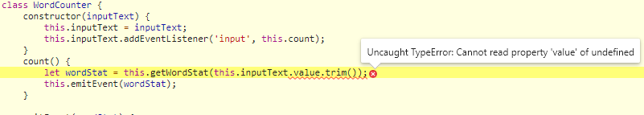

It’s showing that the `this.inputText` is `undefined`. Therefore, accessing the `value` property of the `this.inputText` causes an error.

## Solve this issue

When an `input` event occurs on the `inputText` element, the `count()` method executes.

And the object that executes the `count()` method is the `inputText` object, not the instance of the `WordCounter` class.

Significa que dentro do `count()`método, o `this`valor fai referencia ao `inputText`elemento, non ao `WordCounter`obxecto.

Para demostralo, pode rexistrar o `this`valor dentro do `count()`método do seguinte xeito:

```
count() {
    console.log(this);
}
```

... e actualice de `index.html`novo, verá o `<textarea>`elemento na consola cada vez que escriba algún texto no `<textarea>`:

```
<textarea id="text" rows="10" cols="60"></textarea>
Idioma do código:  HTML, XML  ( xml )
```

Dado que o `this`valor dentro do `count()`método fai referencia ao `<textarea>`elemento, non ten a `inputText`propiedade. E tampouco ten o `emitEvent()`método.

Para solucionar o problema, cómpre cambiar o escoitador de eventos a unha [función de frecha](https://www.javascripttutorial.net/es6/javascript-arrow-function/) como esta:

```
constructor(inputText) {
   this.inputText = inputText;
    this.inputText.addEventListener('input', () => {
        this.count();
    });
}
```

Cando usa a función de frecha, o `this`valor fai referencia ao obxecto do bloque circundante que é `WordCounter`neste caso. Noutras palabras, pode acceder a todas as propiedades e métodos do WordCounter do `count()`método.

A clase final `WordCounter`será así:

```
class WordCounter {
    constructor(inputText) {
        this.inputText = inputText;
        this.inputText.addEventListener('input', () => {
            this.count();
        });
    }
    count() {
        let wordStat = this.getWordStat(this.inputText.value.trim());
        this.emitEvent(wordStat);
    }

    emitEvent(wordStat) {
        // Create count event
        let countEvent = new CustomEvent('count', {
            bubbles: true,
            cancelable: true,
            detail: {
                wordStat
            }
        });
        // dispatch the count event
        this.inputText.dispatchEvent(countEvent);

    }
    getWordStat(str) {
        let matches = str.match(/\S+/g);
        return {
            characters: str.length,
            words: matches ? matches.length : 0,
        };
    }
}
```

[Fai clic aquí para ver a aplicación de contador de palabras en acción.](https://javascripttutorial.net/sample/dom/word-counter/index.html)

## Resumo

Neste tutorial, aprendeu a desenvolver unha aplicación de contador de palabras usando JavaScript vainilla. E as seguintes son as claves:

- Como crear e emitir un evento personalizado.
- Como resolver o `this`problema usando as funcións de frecha.

# 03. Validación de formularios Javascript

**Resumo** : neste tutorial aprenderás sobre a validación de formularios JavaScript creando un formulario de rexistro desde cero.

## Que é a validación de formularios

Antes [de enviar os datos ao servidor](https://www.javascripttutorial.net/javascript-dom/javascript-form/) , debes comprobar os datos no navegador web para asegurarte de que os datos enviados teñen o formato correcto.

Para proporcionar comentarios rápidos, pode usar JavaScript para validar os datos. Isto chámase validación do lado do cliente.

Se non leva a validación do lado do cliente, pode causar unha mala experiencia de usuario. Neste caso, pode sentir un atraso notable porque os datos do formulario leva tempo para transferir entre os navegadores web e o servidor.

A diferenza da validación do lado do cliente que se realiza no navegador web, a validación do lado do servidor realízase no servidor. Sempre é fundamental implementar a validación do lado do servidor.

O motivo é que a validación do lado do cliente é bastante fácil de evitar. Os usuarios malintencionados poden desactivar JavaScript e enviar datos incorrectos ao teu servidor.

Neste tutorial, centrarase só na validación do lado do cliente.

## Opcións de validación do lado do cliente

Cando se trate de validación do lado do cliente, terá dúas opcións:

- Validación de JavaScript: desenvolve a lóxica de validación mediante JavaScript. Ou podes usar unha biblioteca para facelo.
- Validación de formularios integrada: pode utilizar as funcións de validación de formularios HTML5. Esta validación ten un mellor rendemento que a validación de JavaScript. Non obstante, non é tan personalizable como a validación de JavaScript.

## Validación de JavaScript

Creará un formulario de rexistro sinxelo con catro campos de entrada: nome de usuario, correo electrónico, contrasinal e confirmar o contrasinal.

Cando fas clic no rexistro sen cubrir nada ou cubrir un formato de datos incorrecto, o formulario mostrará mensaxes de erro:

[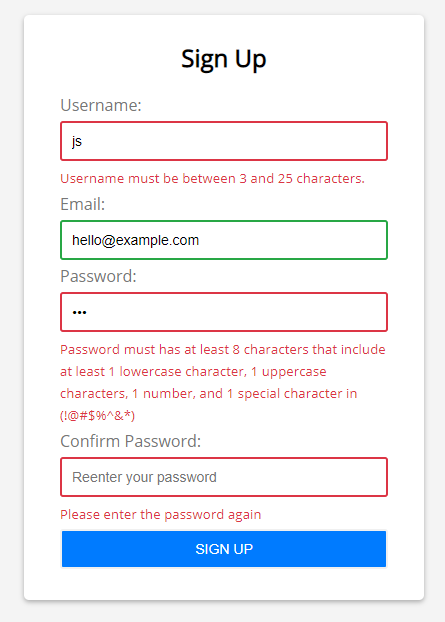](https://javascripttutorial.net/sample/dom/form-validation/)

Validarás o seguinte:

- O nome de usuario non pode estar en branco e ten polo menos 3 caracteres e non pode ter máis de 25 caracteres.
- O correo electrónico é obrigatorio e válido.
- O contrasinal ten oito caracteres ou máis. E debe conter 1 carácter en minúscula, 1 carácter en maiúscula, 1 número e polo menos un carácter especial neste conxunto ( `!@#$%^&*`).
- O contrasinal de confirmación debe ser o mesmo que o contrasinal.

## Crea a estrutura do proxecto

En primeiro lugar, cree o `form-validation`cartafol que almacena todos os ficheiros de código fonte do proxecto.

En segundo lugar, cree os cartafoles `js`e `css`dentro do `form-validation`cartafol.

En terceiro lugar, cree o `style.css`no `css`cartafol, o `app.js`no `js`cartafol e `index.html`directamente no `form-validation`cartafol.

A estrutura final do proxecto será a seguinte:

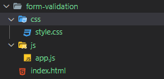

## Construír o formulario HTML

Primeiro, abra o `index.html`ficheiro e introduza o seguinte código:

```
<!DOCTYPE html>
<html>
<head>
    <title>JavaScript Form Validation Demo</title>
    <link rel="stylesheet" href="css/style.css">
</head>
<body>

    <script src="js/app.js"></script>
</body>

</html>Idioma do código:  HTML, XML  ( xml )
```

Neste ficheiro HTML, colocamos o `style.css`ficheiro na `head`sección e `app.js`o ficheiro na sección do corpo antes da `</body>`etiqueta de peche.

En segundo lugar, engade o seguinte marcado HTML para crear o formulario de rexistro. O ficheiro index.html final terá o seguinte aspecto:

```
 <!DOCTYPE html>
<html>
<head>
    <title>JavaScript Form Validation Demo</title>
    <link rel="stylesheet" href="css/style.css">
</head>
<body>
    <div class="container">
        <form id="signup" class="form">
            <h1>Sign Up</h1>
            <div class="form-field">
                <label for="username">Username:</label>
                <input type="text" name="username" id="username" autocomplete="off">
                <small></small>
            </div>

            <div class="form-field">
                <label for="email">Email:</label>
                <input type="text" name="email" id="email" autocomplete="off">
                <small></small>
            </div>

            <div class="form-field">
                <label for="password">Password:</label>
                <input type="password" name="password" id="password" autocomplete="off">
                <small></small>
            </div>


            <div class="form-field">
                <label for="confirm-password">Confirm Password:</label>
                <input type="password" name="confirm-password" id="confirm-password" autocomplete="off">
                <small></small>
            </div>

            <div class="form-field">
                <input type="submit" value="Sign Up">
            </div>
        </form>
    </div>

    <script src="js/app.js"></script>
</body>
</html>Idioma do código:  HTML, XML  ( xml )
```

O máis destacable do formulario de inscrición é que cada campo está envolto nunha `div`clase coa clase `form-field`.

Cada campo de formulario ten tres elementos:

- Unha etiqueta
- Un campo de entrada
- Un `<small>`elemento

Usarás a `<small>`etiqueta para mostrar a mensaxe de erro aos usuarios.

Se un campo de entrada non é válido, poñeremos o seu bordo en cor vermella engadindo a `error`clase ao `form-field`elemento. Quedará así:

```
<div class="form-field error">
   <label for="username">Username:</label>
   <input type="text" name="username" id="username" autocomplete="off">
   <small></small>
</div>
```

Se o valor dun campo de entrada é válido, poñeremos a cor verde do seu bordo engadindo a `success`clase ao `form-field`elemento do seguinte xeito:

```
<div class="form-field success">
   <label for="username">Username:</label>
   <input type="text" name="username" id="username" autocomplete="off">
   <small></small>
</div>
```

Consulte o [style.css](https://javascripttutorial.net/sample/dom/form-validation/css/style.css) para obter detalles sobre as clases `.error`e `.success`.

## Seleccione os campos do formulario e engade o detector de eventos de envío

No `app.js`ficheiro, primeiro empregarás o `document.querySelector()`método para seleccionar os campos de entrada e o formulario:

```
const usernameEl = document.querySelector('#username');
const emailEl = document.querySelector('#email');
const passwordEl = document.querySelector('#password');
const confirmPasswordEl = document.querySelector('#confirm-password');

const form = document.querySelector('#signup');
```

E despois anexa o `submit`escoita de eventos ao formulario usando o método [addEventListener()](https://www.javascripttutorial.net/dom/events/add-an-event-handler/) :

```
form.addEventListener('submit', function (e) {
    // prevent the form from submitting
    e.preventDefault();

});
```

No oínte do evento, cómpre chamar ao `e.preventDefault()`para evitar que o formulario se envíe unha vez que se faga clic no botón Enviar.

## Desenvolver funcións de utilidade

Antes de validar o formulario, pode desenvolver algunhas funcións de utilidade reutilizables para comprobar se:

- É necesario un campo.
- A lonxitude dun campo está entre min e max.
- O correo electrónico ten un formato válido.
- O contrasinal é seguro.

A seguinte `isRequired()`función devolve verdadeiro se o argumento de entrada está baleiro:

```
const isRequired = value => value === '' ? false : true;
```

A seguinte `isBetween()`función devolve false se o `length`argumento non está entre o argumento `min`e `max`:

```
const isBetween = (length, min, max) => length < min || length > max ? false : true;
```

Para comprobar que o correo electrónico é válido, usará unha [expresión regular](https://www.javascripttutorial.net/javascript-regular-expression/) :

```
const isEmailValid = (email) => {
    const re = /^(([^<>()\[\]\\.,;:\s@"]+(\.[^<>()\[\]\\.,;:\s@"]+)*)|(".+"))@((\[[0-9]{1,3}\.[0-9]{1,3}\.[0-9]{1,3}\.[0-9]{1,3}\])|(([a-zA-Z\-0-9]+\.)+[a-zA-Z]{2,}))$/;
    return re.test(email);
};
```

Para comprobar se un contrasinal é seguro, que coincide cun patrón especificado, tamén utilizará unha expresión regular:

```
const isPasswordSecure = (password) => {
    const re = new RegExp("^(?=.*[a-z])(?=.*[A-Z])(?=.*[0-9])(?=.*[!@#\$%\^&\*])(?=.{8,})");
    return re.test(password);
};
```

A seguinte táboa ilustra o significado de cada parte da expresión regular utilizada para validar o contrasinal:

| Contrasinal RegEx | Significado                                                   |
| :---------------- | :------------------------------------------------------------ |
| ^                 | O contrasinal comeza                                          |
| (?=.\*[az])       | O contrasinal debe conter polo menos un carácter en minúscula |
| (?=.\*[AZ])       | O contrasinal debe conter polo menos un carácter en maiúscula |
| (?=.\*[0-9])      | O contrasinal debe conter polo menos un número                |
| (?=._[!@#$%^&_])  | O contrasinal debe conter polo menos un carácter especial.    |
| (?=.{8,})         | O contrasinal debe ter oito caracteres ou máis                |

## Desenvolver funcións que mostren o erro/éxito

A seguinte `showError()`función destaca o bordo do campo de entrada e mostra unha mensaxe de erro se o campo de entrada non é válido:

```
const showError = (input, message) => {
    // get the form-field element
    const formField = input.parentElement;
    // add the error class
    formField.classList.remove('success');
    formField.classList.add('error');

    // show the error message
    const error = formField.querySelector('small');
    error.textContent = message;
};
```

Cómo funciona.

Primeiro, obtén o [elemento pai](https://www.javascripttutorial.net/javascript-dom/javascript-get-parent-element-parentnode/) do campo de entrada, que é o `<div>`elemento que contén a `form-field`clase:

```
const formField = input.parentElement;
```

En segundo lugar, elimina a `success`clase e engade a `error`clase ao `form-field`elemento:

```
formField.classList.remove('success');
formField.classList.add('error');
```

En terceiro lugar, selecciona o `<small>`elemento dentro do `form-field`elemento:

```
const error = formField.querySelector('small');
```

Teña en conta que usa `formField.querySelector()`o `document.querySelector()`.

Finalmente, establece a mensaxe de erro na súa `textContent`propiedade do `<small>`elemento:

```
error.textContent = message;
```

A función que mostra o indicador de éxito é semellante á `showError()`función:

```
const showSuccess = (input) => {
    // get the form-field element
    const formField = input.parentElement;

    // remove the error class
    formField.classList.remove('error');
    formField.classList.add('success');

    // hide the error message
    const error = formField.querySelector('small');
    error.textContent = '';
}
```

A diferenza da `showError()`función, a `showSuccess()`función elimina a `error`clase, engade a `success`clase e establece a mensaxe de erro en branco.

Agora, pode usar a función de utilidade anterior para comprobar cada campo.

## Desenvolver funcións de validación de campos de entrada

Desenvolverá catro funcións para validar os valores dos campos do formulario:

### 1) Validar o campo do nome de usuario

A seguinte `checkUsername()`función usa:

- A `isRequired()`función para comprobar se se proporciona o nome de usuario.
- A `isBetween()`función para comprobar se a lonxitude do nome de usuario está entre 3 e 25 caracteres.
- As funcións `showError()`e `showSuccess()`para mostrar o indicador de erro e éxito.

A función devolve `true`se o campo pasa as comprobacións.

```
const checkUsername = () => {

    let valid = false;
    const min = 3,
        max = 25;
    const username = usernameEl.value.trim();

    if (!isRequired(username)) {
        showError(usernameEl, 'Username cannot be blank.');
    } else if (!isBetween(username.length, min, max)) {
        showError(usernameEl, `Username must be between ${min} and ${max} characters.`)
    } else {
        showSuccess(usernameEl);
        valid = true;
    }
    return valid;
}
```

### 2) Validar o campo de correo electrónico

A `checkEmail()`función volve `true`se o correo electrónico é válido.

Usa as funcións `isRequired()`e `isEmailValid()`para comprobar. E usa as funcións `showError()`e `showSuccess()`para proporcionar comentarios en caso de erro e éxito.

```
const checkEmail = () => {
    let valid = false;
    const email = emailEl.value.trim();
    if (!isRequired(email)) {
        showError(emailEl, 'Email cannot be blank.');
    } else if (!isEmailValid(email)) {
        showError(emailEl, 'Email is not valid.')
    } else {
        showSuccess(emailEl);
        valid = true;
    }
    return valid;
}
```

### 3) Validar o campo de contrasinal

A seguinte `checkPassword()`función comproba o campo de contrasinal se se fornece e coincide co formato necesario:

```
const checkPassword = () => {

    let valid = false;

    const password = passwordEl.value.trim();

    if (!isRequired(password)) {
        showError(passwordEl, 'Password cannot be blank.');
    } else if (!isPasswordSecure(password)) {
        showError(passwordEl, 'Password must has at least 8 characters that include at least 1 lowercase character, 1 uppercase characters, 1 number, and 1 special character in (!@#$%^&*)');
    } else {
        showSuccess(passwordEl);
        valid = true;
    }

    return valid;
};
```

### 4) Validar o campo de confirmación do contrasinal

A `checkConfirmPassword()`función comproba se o contrasinal de confirmación é o mesmo que o contrasinal.

```
const checkConfirmPassword = () => {
    let valid = false;
    // check confirm password
    const confirmPassword = confirmPasswordEl.value.trim();
    const password = passwordEl.value.trim();

    if (!isRequired(confirmPassword)) {
        showError(confirmPasswordEl, 'Please enter the password again');
    } else if (password !== confirmPassword) {
        showError(confirmPasswordEl, 'Confirm password does not match');
    } else {
        showSuccess(confirmPasswordEl);
        valid = true;
    }

    return valid;
};
```

## Modificando o controlador de eventos de envío

Agora, pode usar as funcións que validan os campos de entrada no controlador de eventos de envío:

```
form.addEventListener('submit', function (e) {
    // prevent the form from submitting
    e.preventDefault();

    // validate forms
    let isUsernameValid = checkUsername(),
        isEmailValid = checkEmail(),
        isPasswordValid = checkPassword(),
        isConfirmPasswordValid = checkConfirmPassword();

    let isFormValid = isUsernameValid &&
        isEmailValid &&
        isPasswordValid &&
        isConfirmPasswordValid;

    // submit to the server if the form is valid
    if (isFormValid) {

    }
});
```

Cómo funciona:

- Primeiro, chame a cada función individual para validar os campos de nome de usuario, correo electrónico, contrasinal e confirmar o contrasinal.
- En segundo lugar, use o `&&`operador para determinar se o formulario é válido. O formulario só é válido se todos os campos son válidos.
- Finalmente, enviar os datos ao servidor se o formulario é válido especificou a `isFormValid`bandeira. Teña en conta que o envío de datos do formulario ao servidor non se trata neste tutorial.

Agora podes abrir o `index.html`ficheiro, introducir algúns valores e facer clic no botón enviar para probalo.

## Engade a función de comentarios instantáneos

O formulario só mostra o erro ou o éxito cando fai clic no botón **Rexistrarse** .

Para proporcionar comentarios instantáneos, podes anexar un detector de eventos ao `input`evento de cada campo e validalo.

É aínda mellor usar a [delegación de eventos](https://www.javascripttutorial.net/javascript-dom/javascript-event-delegation/) para anexar o `input`escoitador de eventos ao formulario e validar cada campo en función do ID de campo actual, así:

```
form.addEventListener('input', function (e) {
    switch (e.target.id) {
        case 'username':
            checkUsername();
            break;
        case 'email':
            checkEmail();
            break;
        case 'password':
            checkPassword();
            break;
        case 'confirm-password':
            checkConfirmPassword();
            break;
    }
});
```

Se abres o formulario `index.html`e introduces algúns datos, verás que o formulario mostra o erro ou o éxito ao instante.

Ademais, melloras o rendemento do formulario usando a técnica de desbote.

Tecnicamente, esperarás a que os usuarios deteñan a escritura durante un pequeno período de tempo ou deixen de escribir antes de validar a entrada.

[Para obter máis detalles sobre a técnica de eliminación de rebote, consulta este tutorial.](https://www.javascripttutorial.net/javascript-dom/javascript-debounce/)

O seguinte ilustra a `debounce()`función:

```
const debounce = (fn, delay = 500) => {
    let timeoutId;
    return (...args) => {
        // cancel the previous timer
        if (timeoutId) {
            clearTimeout(timeoutId);
        }
        // setup a new timer
        timeoutId = setTimeout(() => {
            fn.apply(null, args)
        }, delay);
    };
};
```

Agora, pode pasar o `input`controlador de eventos á `debounce()`función para eliminalo:

```
form.addEventListener('input', debounce(function (e) {
    switch (e.target.id) {
        case 'username':
            checkUsername();
            break;
        case 'email':
            checkEmail();
            break;
        case 'password':
            checkPassword();
            break;
        case 'confirm-password':
            checkConfirmPassword();
            break;
    }
}));
```

Se introduces datos nun campo de formulario para activar o `input`evento, verás que a mensaxe de erro ou éxito terá un pouco de atraso.

O seguinte mostra o `app.js`ficheiro completo:

```
const usernameEl = document.querySelector('#username');
const emailEl = document.querySelector('#email');
const passwordEl = document.querySelector('#password');
const confirmPasswordEl = document.querySelector('#confirm-password');

const form = document.querySelector('#signup');


const checkUsername = () => {

    let valid = false;

    const min = 3,
        max = 25;

    const username = usernameEl.value.trim();

    if (!isRequired(username)) {
        showError(usernameEl, 'Username cannot be blank.');
    } else if (!isBetween(username.length, min, max)) {
        showError(usernameEl, `Username must be between ${min} and ${max} characters.`)
    } else {
        showSuccess(usernameEl);
        valid = true;
    }
    return valid;
};


const checkEmail = () => {
    let valid = false;
    const email = emailEl.value.trim();
    if (!isRequired(email)) {
        showError(emailEl, 'Email cannot be blank.');
    } else if (!isEmailValid(email)) {
        showError(emailEl, 'Email is not valid.')
    } else {
        showSuccess(emailEl);
        valid = true;
    }
    return valid;
};

const checkPassword = () => {
    let valid = false;


    const password = passwordEl.value.trim();

    if (!isRequired(password)) {
        showError(passwordEl, 'Password cannot be blank.');
    } else if (!isPasswordSecure(password)) {
        showError(passwordEl, 'Password must has at least 8 characters that include at least 1 lowercase character, 1 uppercase characters, 1 number, and 1 special character in (!@#$%^&*)');
    } else {
        showSuccess(passwordEl);
        valid = true;
    }

    return valid;
};

const checkConfirmPassword = () => {
    let valid = false;
    // check confirm password
    const confirmPassword = confirmPasswordEl.value.trim();
    const password = passwordEl.value.trim();

    if (!isRequired(confirmPassword)) {
        showError(confirmPasswordEl, 'Please enter the password again');
    } else if (password !== confirmPassword) {
        showError(confirmPasswordEl, 'The password does not match');
    } else {
        showSuccess(confirmPasswordEl);
        valid = true;
    }

    return valid;
};

const isEmailValid = (email) => {
    const re = /^(([^<>()\[\]\\.,;:\s@"]+(\.[^<>()\[\]\\.,;:\s@"]+)*)|(".+"))@((\[[0-9]{1,3}\.[0-9]{1,3}\.[0-9]{1,3}\.[0-9]{1,3}\])|(([a-zA-Z\-0-9]+\.)+[a-zA-Z]{2,}))$/;
    return re.test(email);
};

const isPasswordSecure = (password) => {
    const re = new RegExp("^(?=.*[a-z])(?=.*[A-Z])(?=.*[0-9])(?=.*[!@#\$%\^&\*])(?=.{8,})");
    return re.test(password);
};

const isRequired = value => value === '' ? false : true;
const isBetween = (length, min, max) => length < min || length > max ? false : true;


const showError = (input, message) => {
    // get the form-field element
    const formField = input.parentElement;
    // add the error class
    formField.classList.remove('success');
    formField.classList.add('error');

    // show the error message
    const error = formField.querySelector('small');
    error.textContent = message;
};

const showSuccess = (input) => {
    // get the form-field element
    const formField = input.parentElement;

    // remove the error class
    formField.classList.remove('error');
    formField.classList.add('success');

    // hide the error message
    const error = formField.querySelector('small');
    error.textContent = '';
}


form.addEventListener('submit', function (e) {
    // prevent the form from submitting
    e.preventDefault();

    // validate fields
    let isUsernameValid = checkUsername(),
        isEmailValid = checkEmail(),
        isPasswordValid = checkPassword(),
        isConfirmPasswordValid = checkConfirmPassword();

    let isFormValid = isUsernameValid &&
        isEmailValid &&
        isPasswordValid &&
        isConfirmPasswordValid;

    // submit to the server if the form is valid
    if (isFormValid) {

    }
});


const debounce = (fn, delay = 500) => {
    let timeoutId;
    return (...args) => {
        // cancel the previous timer
        if (timeoutId) {
            clearTimeout(timeoutId);
        }
        // setup a new timer
        timeoutId = setTimeout(() => {
            fn.apply(null, args)
        }, delay);
    };
};

form.addEventListener('input', debounce(function (e) {
    switch (e.target.id) {
        case 'username':
            checkUsername();
            break;
        case 'email':
            checkEmail();
            break;
        case 'password':
            checkPassword();
            break;
        case 'confirm-password':
            checkConfirmPassword();
            break;
    }
}));
```

E [aquí está a forma final](https://javascripttutorial.net/sample/dom/form-validation/) .

## Resumo

- Que é a validación do lado do cliente e a diferenza entre a validación do lado do cliente e do servidor.
- Como compoñer un formulario e combinar JavaScript e CSS para validar campos de entrada.
- Como usar [expresións regulares](https://www.javascripttutorial.net/javascript-regular-expression/) para comprobar se os valores dos campos están no formato correcto.
- Como usar a técnica [de delegación de eventos](https://www.javascripttutorial.net/javascript-dom/javascript-event-delegation/) .
- Como usar a [técnica de desbote](https://www.javascripttutorial.net/javascript-dom/javascript-debounce/) para mellorar o rendemento da validación do formulario.

# 04. Temporizador de conta atrás JavaScript

**Resumo** : neste tutorial, aprenderás a desenvolver un temporizador de conta atrás JavaScript reutilizable.

## Que é un temporizador de conta atrás

Un temporizador de conta atrás é un reloxo virtual que se executa nunha páxina de destino. E conta atrás a partir dunha data determinada para indicar o comezo (ou o final) dun evento.

Nos sitios web de comercio electrónico, podes usar un temporizador de conta atrás para mostrar o comezo (ou o final) dunha oferta. O propósito do temporizador de conta atrás é instar aos clientes a que tomen medidas como comprar produtos ou servizos.

Neste tutorial, aprenderás a crear un temporizador de conta atrás en JavaScript desde cero. E aprenderás a usalo para crear un temporizador de conta atrás para o ano novo.

O seguinte mostra a [páxina de destino da conta atrás final do ano novo](https://javascripttutorial.net/sample/dom/countdown-timer/) .

Teña en conta que o temporizador de conta atrás que vas construír é reutilizable para que poidas utilizalo en calquera páxina de destino. Ademais, podes usar esta conta atrás para crear varios temporizadores de conta atrás nunha única páxina.

## Crea a estrutura do proxecto

En primeiro lugar, cree un cartafol do proxecto chamado `countdown-timer`. Dentro dese cartafol, cree tres subcartafoles: `js`, `css`, e `img`que almacenarán os ficheiros JavaScript, CSS e imaxes.

En segundo lugar, cree os ficheiros `style.css`no `css`cartafol `app.js`e `countdown.js`os ficheiros no `js`cartafol e `index.html`no `countdown-timer`cartafol:

En terceiro lugar, [descarga esta imaxe de fogos artificiais](https://www.javascripttutorial.net/sample/dom/countdown-timer//img/new-year.jpg) e cópiaa no `img`cartafol. Usarás esta imaxe como fondo da páxina de conta atrás do ano novo.

A estrutura do proxecto terá o seguinte aspecto:

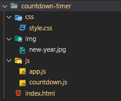

## Crea a páxina HTML

A páxina HTML é bastante sinxela porque xerará a maior parte do código HTML a partir de JavaScript.

O seguinte mostra a páxina HTML completa:

```
<!DOCTYPE html>
<html lang="en">
<head>
    <meta charset="UTF-8">
    <meta name="viewport" content="width=device-width, initial-scale=1.0">
    <title>JavaScript Countdown Timer - New Year Countdown</title>
    <link rel="stylesheet" href="css/style.css">
</head>
<body>
    <h1>New Year Countdown</h1>
    <div class="countdown-timer"></div>
    <div class="message"></div>
    <div class="year"></div>

    <script src="js/countdown.js"></script>
    <script src="js/app.js"></script>

</body>
</html>Idioma do código:  HTML, XML  ( xml )
```

No `index.html`ficheiro, colocas unha ligazón ao `style.css`ficheiro na `<head>`sección e os ficheiros `countdown.js`e `app.js`na `<body>`sección.

Teña en conta que o `countdown.js`ficheiro debe aparecer antes do `app.js`ficheiro porque `app.js`utilizará os obxectos do `countdown.js`ficheiro.

A `<body>`sección ten catro elementos:

- Un título 1 ( `<h1>`). Este elemento mostrará un título. Pode ser calquera cousa que describa a conta atrás, por exemplo, a conta atrás do ano novo.
- A `<div>`coa clase `countdown-timer`. Este elemento mostrará a conta atrás.
- A `<div>`coa `message`clase. Este elemento mostrará a mensaxe cando finalice a conta atrás.
- E `<div>`coa `year`clase. Este elemento mostrará o ano novo, por exemplo, 2021.

## Unha visión xeral rápida do obxecto Date

Para crear o temporizador, terás que traballar co `Date`obxecto, que está dispoñible en todos os navegadores web.

O `Date`obxecto representa un único momento no tempo. Contén un número que representa os milisegundos desde o 1 de xaneiro de 1970 UTC.

O seguinte mostra como crear un novo `Date`obxecto que represente a data e a hora actual:

```
const now = new Date();
```

E este exemplo mostra como chamar ao `getTime()`método do `Date`obxecto para obter o número de milisegundos xa que `January 1, 1970 00:00:00 UTC`:

```
const time = now.getTime();
console.log(time);
```

Para crear un novo `Date`obxecto cunha data e hora especificadas, pode pasar unha cadea de data ao `Date()`construtor como este:

```
const d = new Date('February 02, 2020 01:02:03');
console.log(d.getTime()); // 1580580123000
```

Para calcular o número de milisegundos entre dúas veces, chama ao `getTime()`método e utiliza o `-`operador. Por exemplo:

```
const d1 = new Date('September 17, 2020 00:00:00');
const d2 = new Date('September 19, 2020 01:00:00');

const time = d2.getTime() - d1.getTime();
console.log(time); // 176400000
```

### Calcula o tempo restante

O temporizador de conta atrás terá que calcular os días, horas, minutos e segundos restantes a partir dun número de milisegundos e mostrar esta información nunha páxina web.

O seguinte declara unha variable de tempo co valor de 150000 milisegundos:

```
const time = 150000; // ms
```

Para converter milisegundos en minutos, divídese os milisegundos por 1000 para obter os segundos e divídese os segundos por 60 para obter os minutos. Por exemplo:

```
console.log(time / 1000 / 60);
```

Saída:

```
2.5Idioma do código:  CSS  ( css )
```

Para obter os minutos restantes (2), utiliza a `Math.floor()`función:

```
const minutes = Math.floor(time / 1000 / 60);
console.log(minutes); // 2
```

Para obter os segundos restantes (30), usa o operador de módulo ( % ) que devolve o resto da división:

```
const seconds = Math.floor(time / 1000) % 60;
console.log(seconds); // 30
```

## Desenvolver a clase Countdown

Primeiro, crea unha nova `CountDown`clase no `countdown.js`ficheiro:

```
class CountDown {
}
```

A `CountDown`clase debe inicializarse con tres argumentos:

- unha data vencida.
- unha devolución de chamada que se encarga de renderizar o temporizador de conta atrás.
- e outra devolución de chamada que se chamará cando finalice a conta atrás.

O construtor da `CountDown`clase terá o seguinte aspecto:

```
class CountDown {
    constructor(expiredDate, onRender, onComplete) {
        this.onRender = onRender;
        this.onComplete = onComplete;
        // handle the expired Date
        ..
    }
}
```

En función do `expiredDate`argumento, pode calcular o tempo restante en milisegundos:

```
const currentTime = new Date().getTime();
const timeRemaining = expiredDate.getTime() - currentTime;
```

Xa que terás que acceder ao tempo restante ( `timeRemaining`) a través dos métodos da clase, deberías definilo como unha propiedade da `CountDown`clase.

### O método setExpiredDate().

O seguinte define un novo método chamado `setExpiredDate()`que inicializa a `timeRemaining`propiedade:

```
 setExpiredDate(expiredDate) {
    // get the current time
    const currentTime = new Date().getTime();
    // calculate the remaining time
    this.timeRemaining = expiredDate.getTime() - currentTime;
}
```

Se `timeRemaining`é maior que cero, o `setExpiredDate()`método executará o `start()`método para iniciar o temporizador. En caso contrario, executará o `complete()`método.

O `setExpiredDate()`aspecto será así:

```
setExpiredDate(expiredDate) {
    // get the current time
    const currentTime = new Date().getTime();

    // calculate the remaining time
    this.timeRemaining = expiredDate.getTime() - currentTime;

    // should the countdown completes or start
    this.timeRemaining > 0 ?
        this.start() :
        this.complete();
}
```

Teña en conta que usamos o [operador ternario](https://www.javascripttutorial.net/javascript-ternary-operator/) `?:` para executar o método `complete()`or `start()`en función do valor da `this.timeRemaining`propiedade.

### O método complete().

O `complete()`método comproba se `onComplete`se pasa a devolución de chamada e invocao. Se `onComplete`non está dispoñible, `complete()`non fará nada.

```
complete() {
    if (typeof this.onComplete === 'function') {
        onComplete();
    }
}
```

### método start().

O `start()`método reduce a `timeRemaining`propiedade cada segundo (1000 ms).

Se o tempo restante é inferior a cero, o `start()`método:

- Primeiro, chame ao `complete()`método.
- En segundo lugar, borre o temporizador usando a `clearInterval()`función.

```
start() {
    //  setup a timer
    const intervalId = setInterval(() => {
        // update the timer
        this.timeRemaining -= 1000;

        if (this.timeRemaining < 0) {
            // call the callback
            complete();

            // clear the interval if expired
            clearInterval(intervalId);
        }

    }, 1000);
}
```

No caso de que o tempo restante sexa maior que cero, o `start()`método debería chamar a un método que execute a `onRender`devolución de chamada.

### O método getTime().

O seguinte `getTime()`método devolve un obxecto que contén os días, horas, minutos e segundos restantes en función da `timeRemaining`propiedade.

```
  getTime() {
    return {
        days: Math.floor(this.timeRemaining / 1000 / 60 / 60 / 24),
        hours: Math.floor(this.timeRemaining / 1000 / 60 / 60) % 24,
        minutes: Math.floor(this.timeRemaining / 1000 / 60) % 60,
        seconds: Math.floor(this.timeRemaining / 1000) % 60
    };
}
```

### O método update().

O seguinte define o `update()`método que chama a `onRender()`devolución de chamada co obxecto de tempo restante actual devolto polo `getTime()`método:

```
update() {
    if (typeof this.onRender === 'function') {
        this.onRender(this.getTime());
    }
}
```

O `start()`método chamará ao `update()`método ao principio e cada segundo despois:

```
start() {
    // update the countdown
    this.update();

    //  setup a timer
    const intervalId = setInterval(() => {
        // update the timer
        this.timeRemaining -= 1000;

        if (this.timeRemaining < 0) {
            // call the callback
            complete();

            // clear the interval if expired
            clearInterval(intervalId);
        } else {
            this.update();
        }

    }, 1000);
}
```

A continuación móstrase a `CountDown`clase completa:

```
class CountDown {
    constructor(expiredDate, onRender, onComplete) {
        this.setExpiredDate(expiredDate);

        this.onRender = onRender;
        this.onComplete = onComplete;
    }

    setExpiredDate(expiredDate) {
        // get the current time
        const currentTime = new Date().getTime();

        // calculate the remaining time
        this.timeRemaining = expiredDate.getTime() - currentTime;

        this.timeRemaining <= 0 ?
            this.complete() :
            this.start();
    }


    complete() {
        if (typeof this.onComplete === 'function') {
            onComplete();
        }
    }
    getTime() {
        return {
            days: Math.floor(this.timeRemaining / 1000 / 60 / 60 / 24),
            hours: Math.floor(this.timeRemaining / 1000 / 60 / 60) % 24,
            minutes: Math.floor(this.timeRemaining / 1000 / 60) % 60,
            seconds: Math.floor(this.timeRemaining / 1000) % 60
        };
    }

    update() {
        if (typeof this.onRender === 'function') {
            this.onRender(this.getTime());
        }
    }

    start() {
        // update the countdown
        this.update();

        //  setup a timer
        const intervalId = setInterval(() => {
            // update the timer
            this.timeRemaining -= 1000;

            if (this.timeRemaining < 0) {
                // call the callback
                complete();

                // clear the interval if expired
                clearInterval(intervalId);
            } else {
                this.update();
            }

        }, 1000);
    }
}
```

## Constrúe a conta atrás do ano novo

En primeiro lugar, crea unha nova función chamada `getNewYear()`método que devolve o ano novo:

```
const getNewYear = () => {
    const currentYear = new Date().getFullYear();
    return new Date(`January 01 ${currentYear + 1} 00:00:00`);
};
```

En segundo lugar, seleccione e actualice o `.year`elemento. Mostrará un número de ano de catro díxitos do ano novo, por exemplo, 2021:

```
// update the year element
const year = document.querySelector('.year');
year.innerHTML = getNewYear().getFullYear();
```

En terceiro lugar, seleccione os elementos `.countdown-timer`, `.message`e :`h1`

```
// select elements
const app = document.querySelector('.countdown-timer');
const message = document.querySelector('.message');
const heading = document.querySelector('h1');
```

En cuarto lugar, define unha función de formato que enche un número co `'0'`se o número é inferior a 10. Por exemplo, 5 será `05`. Pero 10 seguirán sendo os mesmos.

```
const format = (t) => {
    return t < 10 ? '0' + t : t;
};
```

En quinto lugar, define un `render()`método que compoña o marcado HTML a partir do obxecto de tempo e actualízao ao `.countdown-timer`elemento. Mostrará os días, horas, minutos e segundos restantes.

```
const render = (time) => {
    app.innerHTML = `
        <div class="count-down">
            <div class="timer">
                <h2 class="days">${format(time.days)}</h2>
                <small>Days</small>
            </div>
            <div class="timer">
                <h2 class="hours">${format(time.hours)}</h2>
                <small>Hours</small>
            </div>
            <div class="timer">
                <h2 class="minutes">${format(time.minutes)}</h2>
                <small>Minutes</small>
            </div>
            <div class="timer">
                <h2 class="seconds">${format(time.seconds)}</h2>
                <small>Seconds</small>
            </div>
        </div>
        `;
};
Idioma do código:  HTML, XML  ( xml )
```

En quinto lugar, cando se completa a conta atrás, mostra unha mensaxe, por exemplo, `"Happy New Year"`.

A seguinte `showMessage()`función mostra a `Happy New Year`mensaxe. Ademais, borra o contido do `.countdown-timer`elemento e oculta o elemento de título:

```
const showMessage = () => {
    message.innerHTML = `Happy New Year ${newYear}!`;
    app.innerHTML = '';
    heading.style.display = 'none';
};
```

En sexto lugar, a conta atrás do Ano Novo debería mostrar a mensaxe de felicitación de Feliz Ano Novo durante un período de tempo e, a continuación, mostrar de novo a conta atrás para o Ano Novo.

O seguinte define unha función que oculta a mensaxe de saúdo e mostra o elemento de título:

```
const hideMessage = () => {
    message.innerHTML = '';
    heading.style.display = 'block';
}
```

En sétimo lugar, define unha `complete()`función que mostre a mensaxe durante un período de tempo e despois a oculta. Ademais, establece `expiredDate`o ano novo:

```
const complete = () => {
    showMessage();
    // restart the countdown after showing the
    // greeting message for a day ()
    setTimeout(() => {
        hideMessage();
        countdownTimer.setExpiredDate(getNewYear());
    }, 1000 * 60 * 24);
};
```

Finalmente, cree a nova instancia e pase a data, función e función `CountDown`de ano novo ao seu construtor:` render``complete `

```
const countdownTimer = new CountDown(
    getNewYear(),
    render,
    complete
);
```

O seguinte mostra o `app.js`ficheiro completo:

```js
// Get the new year
const getNewYear = () => {
  const currentYear = new Date().getFullYear();
  return new Date(`January 01 ${currentYear + 1} 00:00:00`);
};

// update the year element
const year = document.querySelector(".year");
year.innerHTML = getNewYear().getFullYear();

// select elements
const app = document.querySelector(".countdown-timer");
const message = document.querySelector(".message");
const heading = document.querySelector("h1");

const format = (t) => {
  return t < 10 ? "0" + t : t;
};

const render = (time) => {
  app.innerHTML = `
        <div class="count-down">
            <div class="timer">
                <h2 class="days">${format(time.days)}</h2>
                <small>Days</small>
            </div>
            <div class="timer">
                <h2 class="hours">${format(time.hours)}</h2>
                <small>Hours</small>
            </div>
            <div class="timer">
                <h2 class="minutes">${format(time.minutes)}</h2>
                <small>Minutes</small>
            </div>
            <div class="timer">
                <h2 class="seconds">${format(time.seconds)}</h2>
                <small>Seconds</small>
            </div>
        </div>
        `;
};

const showMessage = () => {
  message.innerHTML = `Happy New Year ${newYear}!`;
  app.innerHTML = "";
  heading.style.display = "none";
};

const hideMessage = () => {
  message.innerHTML = "";
  heading.style.display = "block";
};

const complete = () => {
  showMessage();

  // restart the countdown after showing the
  // greeting message for a day ()
  setTimeout(() => {
    hideMessage();
    countdownTimer.setExpiredDate(getNewYear());
  }, 1000 * 60 * 60 * 24);
};

const countdownTimer = new CountDown(getNewYear(), render, complete);
```

Se abres o `index.html`, verás que a [conta atrás do ano novo](https://www.javascripttutorial.net/sample/dom/countdown-timer/) está en marcha.

## Resumo

Neste tutorial, aprendeches a:

- Use a [clase ES6](https://www.javascripttutorial.net/es6/javascript-class/) para definir un compoñente de temporizador de conta atrás reutilizable.
- Usa o `Date`obxecto para manipular o tempo.
- Use setInterval() e clearInterval() para crear e cancelar unha acción de repetición temporizada.

# 05. Desprazamento infinito de JavaScript

**Resumo** : neste tutorial, aprenderás a implementar a función de desprazamento infinito de JavaScript.

## O que vas construír

A seguinte imaxe ilustra a aplicación web que vas construír:

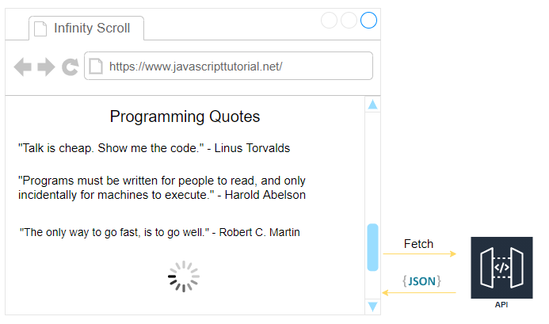

A páxina mostrará unha lista de comiñas procedentes dunha API. Por defecto, mostra 10 comiñas.

Se se despraza ata a parte inferior da páxina, a aplicación web mostrará un indicador de carga. Ademais, chamará á API para buscar máis comiñas e anexalas á lista actual.

O URL da API que vai usar é o seguinte:

```
https://api.javascripttutorial.net/v1/quotes/?page=1&limit=10
```

A API acepta dúas cadeas de consulta: `page`e `limit`. Estas cadeas de consulta permítenche paxinar as comiñas do servidor.

As comiñas divídense nas páxinas determinadas pola `page`cadea de consulta. E cada páxina ten un número de comiñas especificado polo `limit`parámetro.

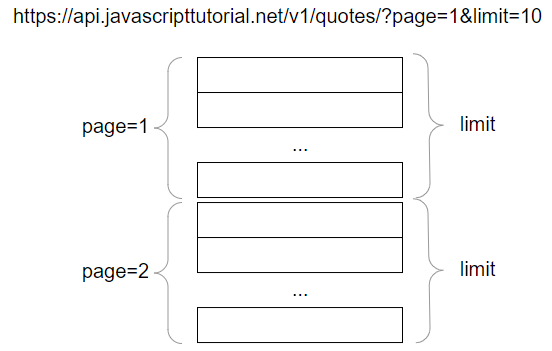

[Fai clic aquí para ver a aplicación web final que usa a función de desprazamento infinito de JavaScript.](https://www.javascripttutorial.net/sample/dom/infinite-scroll/)

## Crear unha estrutura de proxecto

En primeiro lugar, cree un novo cartafol chamado `infinite-scroll`. Dentro dese cartafol, cree dous subcartafoles `css`e `js`.

En segundo lugar, cree o `style.css`no `css`cartafol e `app.js`no `js`cartafol.

En terceiro lugar, cree un novo ficheiro HTML index.html no `infinite-scroll`cartafol.

A estrutura do cartafol do proxecto final será así:

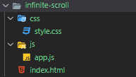

## Engade código ao ficheiro index.html

Abre o `index.html`e engade o seguinte código:

```
<!DOCTYPE html>
<html lang="en">
<head>
    <meta charset="UTF-8">
    <meta name="viewport" content="width=device-width, initial-scale=1.0">
    <title>JavaScript Infinite Scroll - Quotes</title>
    <link rel="stylesheet" href="css/style.css">
</head>
<body>

    <div class="container">
        <h1>Programming Quotes</h1>

        <div class="quotes">
        </div>

        <div class="loader">
            <div></div>
            <div></div>
            <div></div>
        </div>
    </div>
    <script src="js/app.js"></script>
</body>
</html>Idioma do código:  HTML, XML  ( xml )
```

No `index.html`ficheiro, coloque o `style.css`na sección de cabeceira e `app.js`na sección de corpo.

A sección do corpo ten un `div`co nome da clase `container`. O elemento container ten catro elementos fillos:

- Un título un (h1) que mostra o título da páxina.
- A `div`coa clase `quotes`que será o elemento pai de todas as comiñas.
- Un cargador que mostra o indicador de carga. Por defecto, o indicador de carga é invisible.

## Facendo a aplicación.js

O seguinte usa o `querySelector()`para seleccionar `div`con clase `quotes`e o `loader`.

```
const quotesEl = document.querySelector('.quotes');
const loader = document.querySelector('.loader');
```

### A función getQuotes().

A seguinte `getQuotes()`función chama á API e devolve as comiñas:

```
const getQuotes = async (page, limit) => {
    const API_URL = `https://api.javascripttutorial.net/v1/quotes/?page=${page}&limit=${limit}`;
    const response = await fetch(API_URL);
    // handle 404
    if (!response.ok) {
        throw new Error(`An error occurred: ${response.status}`);
    }
    return await response.json();
}
```

A `getQuotes()`función acepta dous argumentos: `page`e `limit`. Usa a [API Fetch](https://www.javascripttutorial.net/javascript-fetch-api/) para obter datos da API.

Xa que `fetch()`devolve unha [promesa](https://www.javascripttutorial.net/es6/javascript-promises/) , pode usar a `await`sintaxe para obter a resposta. E chama ao `json()`método do obxecto de resposta para obter os datos json.

O `getQuotes()`devolve unha promesa que se resolverá cos datos JSON.

Dado que a `getQuotes()`función usa a `await`palabra clave, ten que ser unha `async`función.

### A función showQuotes().

O seguinte define a `showQuotes()`función que xera os `<blockquote>`elementos da `quotes`matriz e engádeos ao `quotes`elemento:

```
// show the quotes
const showQuotes = (quotes) => {
    quotes.forEach(quote => {
        const quoteEl = document.createElement('blockquote');
        quoteEl.classList.add('quote');

        quoteEl.innerHTML = `
            <span>${quote.id})</span>
            ${quote.quote}
            <footer>${quote.author}</footer>
        `;

        quotesEl.appendChild(quoteEl);
    });
};
```

Cómo funciona:

Usa `showQuotes()`o `forEach()`método para iterar sobre a `quotes`matriz.

Para cada obxecto de cita, crea o `<blockquote>`elemento coa `quote`clase:

```
<blockquote class="quote">
</blockquote>Idioma do código:  HTML, XML  ( xml )
```

E xera a representación HTML dun obxecto de cita usando a sintaxe [literal do modelo](https://www.javascripttutorial.net/es6/javascript-template-literals/) . Engade o HTML ao `<blockquote>`elemento.

O seguinte mostra un exemplo do `<blockquote>`elemento xerado:

```
<blockquote class="quote">
   <span>1)</span>
      Talk is cheap. Show me the code.
    <footer>Linus Torvalds</footer>
</blockquote>Idioma do código:  HTML, XML  ( xml )
```

Ao final de cada iteración, a función engade o `<blockquote>`elemento aos elementos fillos do `quotesEl`elemento mediante o `appendChild()`método.

### Mostrar/ocultar funcións do indicador de carga

O seguinte define dúas funcións que mostran e ocultan o elemento indicador de carga:

```
const hideLoader = () => {
    loader.classList.remove('show');
};

const showLoader = () => {
    loader.classList.add('show');
};
```

O indicador de carga ten a opacidade 0, que é invisible por defecto. A `.show`clase establece a opacidade do indicador de carga en 1 que o fará visible.

Para ocultar o indicador de carga, elimina a `show`clase do elemento indicador de carga. Do mesmo xeito, para mostrar o indicador de carga, engade a `show`clase á súa lista de clases.

### Definir variables de control

O seguinte declara a `currentPage`variable e inicialízaa a un:

```
 let currentPage = 1;
```

Cando desprácese cara abaixo ata o final da páxina, a aplicación fará unha solicitude de API para obter as seguintes cotizacións. Antes de facelo, cómpre aumentar a `currentPage`variable nun.

Para especificar o número de comiñas que quere obter á vez, pode usar unha constante como esta:

```
const limit = 10;
```

A seguinte `total`variable almacena o total de comiñas devoltas pola API:

```
let total = 0;
```

### A función hasMoreQuotes().

A seguinte `hasMoreQuotes()`función devolve `true`se:

- É a primeira busca ( `total === 0`)
- Ou hai máis comiñas para buscar da API ( `startIndex`< `total`)

```
const hasMoreQuotes = (page, limit, total) => {
    const startIndex = (page - 1) * limit + 1;
    return total === 0 || startIndex < total;
};
```

### A función loadQuotes().

A continuación defínese unha función que realiza catro accións:

- Mostra o indicador de carga.
- Obtén as comiñas da API chamando á `getQuotes()`función se hai máis comiñas que buscar.
- Mostra as citas na páxina.
- Ocultar o indicador de carga.

```
// load quotes
const loadQuotes = async (page, limit) => {
    // show the loader
    showLoader();
    try {
        // if having more quotes to fetch
        if (hasMoreQuotes(page, limit, total)) {
            // call the API to get quotes
            const response = await getQuotes(page, limit);
            // show quotes
            showQuotes(response.data);
            // update the total
            total = response.total;
        }
    } catch (error) {
        console.log(error.message);
    } finally {
        hideLoader();
    }
};
```

Se a `getQuotes()`función se executa moi rápido, non verá o indicador de carga.

Para asegurarse de que o indicador de carga sempre se mostra, pode usar a `setTimeout()`función:

```
// load quotes
const loadQuotes = async (page, limit) => {

    // show the loader
    showLoader();

    // 0.5 second later
    setTimeout(async () => {
        try {
            // if having more quotes to fetch
            if (hasMoreQuotes(page, limit, total)) {
                // call the API to get quotes
                const response = await getQuotes(page, limit);
                // show quotes
                showQuotes(response.data);
                // update the total
                total = response.total;
            }
        } catch (error) {
            console.log(error.message);
        } finally {
            hideLoader();
        }
    }, 500);

};
```

Ao engadir a `setTimeout()`función, o indicador de carga mostrarase durante polo menos medio segundo. E pode axustar o atraso cambiando o segundo argumento da `setTimeout()`función.

### Adxunta o evento de desprazamento

Para cargar máis comiñas cando os usuarios se desprazan ata a parte inferior da páxina, cómpre anexar un [controlador de eventos de desprazamento](https://www.javascripttutorial.net/javascript-dom/javascript-scroll-events/) .

O controlador de eventos de desprazamento chamará á `loadQuotes()`función se se cumpren as seguintes condicións:

- En primeiro lugar, a posición de desprazamento está na parte inferior da páxina.
- En segundo lugar, hai máis citas para buscar.

O controlador de eventos de desprazamento tamén aumentará a `currentPage`variable antes de cargar as seguintes comiñas.

```
 window.addEventListener('scroll', () => {
    const {
        scrollTop,
        scrollHeight,
        clientHeight
    } = document.documentElement;

    if (scrollTop + clientHeight >= scrollHeight - 5 &&
        hasMoreQuotes(currentPage, limit, total)) {
        currentPage++;
        loadQuotes(currentPage, limit);
    }
}, {
    passive: true
});
```

### Inicializa a páxina

Cando a páxina se cargue por primeira vez, cómpre chamar á `loadQuotes()`función para cargar o primeiro lote de comiñas:

```
loadQuotes(currentPage, limit);
```

### Envolve o código app.js nun IIFE

Para evitar o conflito de variables e funcións que definiu, pode envolver todo o código no `app.js`ficheiro nun [IIFE](https://www.javascripttutorial.net/javascript-immediately-invoked-function-expression-iife/) .

A final `app.js`será así:

```
(function () {

    const quotesEl = document.querySelector('.quotes');
    const loaderEl = document.querySelector('.loader');

    // get the quotes from API
    const getQuotes = async (page, limit) => {
        const API_URL = `https://api.javascripttutorial.net/v1/quotes/?page=${page}&limit=${limit}`;
        const response = await fetch(API_URL);
        // handle 404
        if (!response.ok) {
            throw new Error(`An error occurred: ${response.status}`);
        }
        return await response.json();
    }

    // show the quotes
    const showQuotes = (quotes) => {
        quotes.forEach(quote => {
            const quoteEl = document.createElement('blockquote');
            quoteEl.classList.add('quote');

            quoteEl.innerHTML = `
            <span>${quote.id})</span>
            ${quote.quote}
            <footer>${quote.author}</footer>
        `;

            quotesEl.appendChild(quoteEl);
        });
    };

    const hideLoader = () => {
        loaderEl.classList.remove('show');
    };

    const showLoader = () => {
        loaderEl.classList.add('show');
    };

    const hasMoreQuotes = (page, limit, total) => {
        const startIndex = (page - 1) * limit + 1;
        return total === 0 || startIndex < total;
    };

    // load quotes
    const loadQuotes = async (page, limit) => {

        // show the loader
        showLoader();

        // 0.5 second later
        setTimeout(async () => {
            try {
                // if having more quotes to fetch
                if (hasMoreQuotes(page, limit, total)) {
                    // call the API to get quotes
                    const response = await getQuotes(page, limit);
                    // show quotes
                    showQuotes(response.data);
                    // update the total
                    total = response.total;
                }
            } catch (error) {
                console.log(error.message);
            } finally {
                hideLoader();
            }
        }, 500);

    };

    // control variables
    let currentPage = 1;
    const limit = 10;
    let total = 0;


    window.addEventListener('scroll', () => {
        const {
            scrollTop,
            scrollHeight,
            clientHeight
        } = document.documentElement;

        if (scrollTop + clientHeight >= scrollHeight - 5 &&
            hasMoreQuotes(currentPage, limit, total)) {
            currentPage++;
            loadQuotes(currentPage, limit);
        }
    }, {
        passive: true
    });

    // initialize
    loadQuotes(currentPage, limit);

})();
```

Aquí está a versión final [da aplicación web](https://www.javascripttutorial.net/sample/dom/infinite-scroll/) .
