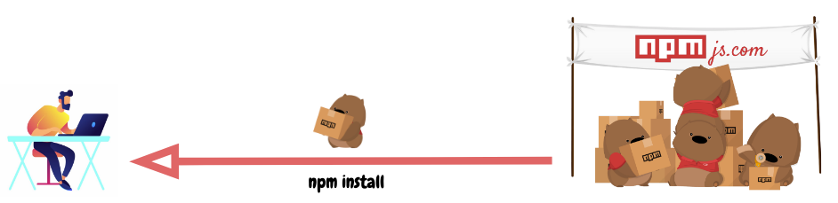
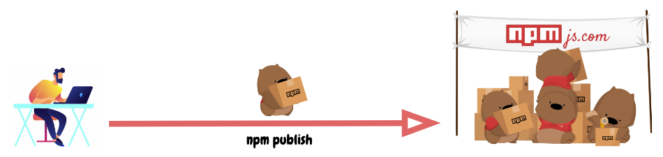
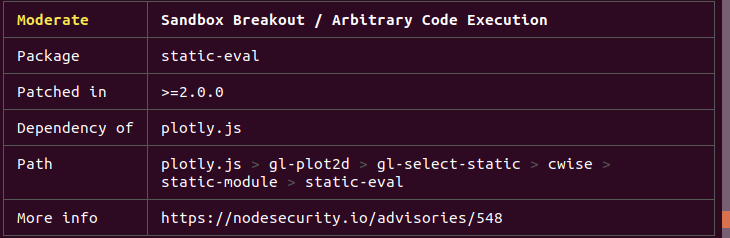

# NPM

Un dos principais factores do éxito de Node é npm, o seu popular xestor de paquetes, que permite aos desenvolvedores de JavaScript compartir paquetes útiles como lodash e moment de forma rápida e sinxela.

NPM, ou "Xestor de paquetes de Node", é o xestor de paquetes predeterminado para o tempo de execución Node.js de JavaScript.

NPM consta de dúas partes principais:

- unha ferramenta CLI (interface de liña de comandos) para publicar e descargar paquetes, e
- un repositorio en liña que aloxa paquetes JavaScript

Podemos entender o repositorio [npmjs.com](https://npmjs.com) como un centro que recibe paquetes de produtos dos autores de paquetes npm e distribúe estes produtos aos usuarios de paquetes npm.

Os comandos npm son o exercito de traballadores que podemos requirir como asistentes persoais cando os solicitamos como dependencias dun proxecto: 

​                   

O proceso de publicación dun paquete para os teus compañeiros de JS sería algo así:

​                   

Vexamos como este exército axuda aos desenvolvedores que queren usar paquetes JavaScript nos seus proxectos.

## package.json

Cada proxecto en JavaScript, xa sexa Node.js ou unha aplicación de  navegador, pódese definir como un paquete npm coa súa propia información de paquete e o seu guión `package.json` para describir o proxecto.

Para xerar o teu `package.json` só tes que executar o comando `npm init` para *inicializar* un proxecto JavaScript/Node.js. Durante o proceso engadiremos os metadatos básicos da aplicación:

- `name`: o nome da túa biblioteca/proxecto JavaScript.
- `version`: a versión do teu proxecto. Aínda que non obrigatorio para o desenvolvemento de aplicacións, este campo pode ser útil como indicador da versión.
- `description`: descrición do proxecto.
- `license`: licenza do proxecto.

### scripts npm

`package.json` admite unha propiedade `scripts` que se pode definir para executar ferramentas de liña de comandos que se instalan no contexto local do proxecto. Por exemplo, a sección de `scripts` dun proxecto npm pode verse así:

```json
{
  "scripts": {
    "build": "tsc",
    "format": "prettier --write **/*.ts",
    "format-check": "prettier --check **/*.ts",
    "lint": "eslint src/**/*.ts",
    "pack": "ncc build",
    "test": "jest",
    "all": "npm run build && npm run format && npm run lint && npm run pack && npm test"
  }
}
```

No exemplo se sinala a algúns paquetes de npm coma `eslint`, `prettier`, `ncc` ou `jest` . Os paquetes non necesariamente teñen que estar instalados como executables globais, basta que estean instalados localmente dentro de`node_modules/.bin/` e servidas como dependencias para o noso proxecto.

### dependencies vs devDependencies

Estas dúas propiedades se mostran en forma de obxectos clave-valor cos nomes das bibliotecas npm como clave e as súas versións [con formato semántico](https://semver.org/) como valor. Este é un exemplo [do modelo TypeScript Action de Github](https://github.com/actions/typescript-action) :

```json
{
  "dependencies": {
    "@actions/core": "^1.2.3",
    "@actions/github": "^2.1.1"
  },
  "devDependencies": {
    "@types/jest": "^25.1.4",
    "@types/node": "^13.9.0",
    "@typescript-eslint/parser": "^2.22.0",
    "@zeit/ncc": "^0.21.1",
    "eslint": "^6.8.0",
    "eslint-plugin-github": "^3.4.1",
    "eslint-plugin-jest": "^23.8.2",
    "jest": "^25.1.0",
    "jest-circus": "^25.1.0",
    "js-yaml": "^3.13.1",
    "prettier": "^1.19.1",
    "ts-jest": "^25.2.1",
    "typescript": "^3.8.3"
  }
}
```

Estas dependencias instálanse mediante o comando `npm install` coas marcas `--save` ou `--save-dev` que indican se o paquete vai destinado ao ambiente de produción, a primeira marcas, ou desenvolvemento, a segunda.  Están destinados a ser usados para ambientes de produción e desenvolvemento/proba respectivamente. 

É importante comprender os posibles signos de versionado semántico (supoñendoenón podes ler sobre o modelo `major.minor.patch` de [semver]([V 2.0.0 | Semantic Versioning (semver.org)](https://semver.org/lang/es/)) ):

- `^`: último lanzamento menor. Por exemplo, unha especificación `^1.0.4` pode instalar unha versión `1.3.0` se esa é a última versión secundaria da serie `1` principal.
- `~`: última versión do parche. Do mesmo xeito que para `^`  coas versións menores, a especificación `~1.0.4` pode instalar a versión `1.0.7` se esa é a última versión secundaria da serie menor `1.0`.

As versións exactas do paquete requirido estarán documentadas no `package-lock.json` do proxecto.

### package-lock.json

Este arquivo describe as versións exactas das dependencias utilizadas nun proxecto JavaScript npm. Se `package.json` é unha etiqueta descritiva xenérica, `package-lock.json` é unha táboa de ingredientes.

E do mesmo xeito que non adoitamos ler a táboa de ingredientes dun produto (a non ser que esteas moi aburrido ou necesites saber), `package-lock.json` non está pensado para ser lido liña por liña polos desenvolvedores.

`package-lock.json` adoita ser xerado polo comando `npm install` e tamén é lido pola nosa ferramenta CLI de NPM para garantir a reprodución dos contornos de compilación para o proxecto, con `npm ci`.

### npm install

Este é o comando máis usado na actualidade cando desenvolvemos aplicacións JavaScript/Node.js.

Por defecto, `npm install <package-name>` instalará a última versión dun paquete co sinal  `^` de versión. No contexto dun proxecto npm, `npm install` descargará paquetes no cartafol `node_modules` do proxecto segundo as especificacións de `package.json`, actualizando a versión do paquete (e á súa vez rexenerando `package-lock.json`) sempre que poida en función da coincidencia de versións `^` ou `~`

Podes especificar unha marca global `-g` se queres instalar un paquete no contexto global e poder usalo en  calquera lugar da túa máquina (isto é común para paquetes de ferramentas de liña de comandos como [live-server](https://github.com/tapio/live-server), pero pouco satisfactorio para maioría dos paquetes ).

npm fixo que a instalación de paquetes JavaScript sexa tan fácil que este comando adoita usarse incorrectamente. Isto fai que npm sexa o foco de moitas bromas de programadores como estas:

​                   

Aquí é onde a marca `--production`  vén ao rescate! Xa vimos como pódense ter `dependencies` e  `devDependencies` para o seu uso na produción e na contorna de desenvolvemento respectivamente. A bandeira `--production`  é como se crean as diferenzas en `node_modules`.

Ao engadir esta marca ao comando `npm install`, só instalaremos paquetes de `dependencies`, reducindo así drasticamente o tamaño do noso cartafol `node_modules` ao que sexa absolutamente necesario para que as nosas aplicacións estean en funcionamento.

E por suposto non deberíamos traer `devDependencies` a contorna de produción!

### npm ci

Do mesmo xeito que, se `package-lock.json` aínda non existe no proxecto, se xera cando se chama a `npm install`, `npm ci` consume este arquivo para descargar a versión exacta de cada paquete individual do que depende o proxecto.

Así é como podemos asegurarnos de que o contexto do noso proxecto segue sendo exactamente o mesmo en diferentes máquinas, xa sexan os nosos portátiles utilizados para o desenvolvemento ou entornas de construción de CI (integración continua) como Github Actions.

### npm audit

Coa enorme cantidade de paquetes que se publicaron e que se poden instalar facilmente, os paquetes npm son susceptibles a malos autores con intencións maliciosas como [estas](hhttps://medium.com/@jsoverson/how-two-malicious-npm-packages-targeted-sabotaged-one-other-fed7199099c8) .

Ao entender que había un problema no ecosistema, a organización npm.js tivo a [idea](https://blog.npmjs.org/post/173719309445/npm-audit-identify-and-fix-insecure) de crear `npm audit`.   `npm audit` ofrece aos desenvolvedores información sobre as vulnerabilidades e se hai versións con solucións para actualizar. Por exemplo,

​                   

Se as correccións están dispoñibles nas próximas actualizacións de versións sen ruptura, pódese empregar `npm audit fix`  para actualizar automaticamente as versións das dependencias afectadas.

## Como publicar paquetes NPM como "vendedores"

Ademais de poder utilizar a ferramenta NPM CLI como consumidor, tamén se pode usar como autor (e converterse nun creador de código aberto de JavaScript).

### publish npm

Enviar un paquete ao centro de [xestión npmjs.com](https://npmjs.com) é moi sinxelo xa que só necesitamos executar `npm publish`. A parte complicada, que **non** é específica para os autores do paquete npm, é determinar a versión do paquete.

A regra xeral segundo [semver.org](https://semver.org) :

1. Versión MAJOR cando realizas cambios na API incompatibles,
2. Versión MENOR cando engades funcionalidades de forma compatible con versións anteriores e
3. Versión PATCH cando fai correccións de erros compatibles con versións anteriores.

É aínda máis importante seguir a regra anterior cando publiques os teus  paquetes para asegurarte de non romper o código de ninguén xa que a  versión predeterminada que coincide en npm é `^` (tamén coñecida como a seguinte versión secundaria).

## ❤️ npm ❤️ JavaScript ❤️ Node.js ❤️

Iso é todo o que necesitamos saber para comezar a manexar npm con eficacia e comandar o noso fermoso exército de dependencias e paquetes.

---

xan 2023