## Funcións de JavaScript que debes coñecer para dominar React

Hoxe, [React](https://kinsta.com/es/secciones/react/) é unha das [bibliotecas JavaScript](https://kinsta.com/es/blog/bibliotecas-javascript/) máis populares . Pódese usar para crear aplicacións dinámicas e sensibles, permite un mellor rendemento e pódese ampliar facilmente. A lóxica subxacente baséase en compoñentes que poden ser reutilizados en diferentes contextos, reducindo a necesidade de escribir o mesmo código varias veces. En resumo, con React podes crear [aplicacións eficientes e potentes](https://kinsta.com/es/secciones/react/) .

Polo tanto, nunca houbo mellor momento para aprender a crear aplicacións React.

Non obstante, sen unha comprensión sólida dalgunhas características fundamentais de [JavaScript](https://kinsta.com/javascript/) , crear aplicacións React podes ser difícil ou mesmo imposible.

Por este motivo, compilamos unha lista de funcións e conceptos de JavaScript que debes coñecer antes de comezar con React. Canto mellor comprenda estes conceptos, máis fácil será crear aplicacións React profesionais.

Dito isto, neste artigo falaremos do seguinte:

## JavaScript e ECMAScript

[JavaScript](https://kinsta.com/es/base-de-conocimiento/que-es-javascript/) é unha linguaxe de programación popular que se usa xunto con [HTML](https://kinsta.com/es/base-de-conocimiento/que-es-el-html/) e CSS para crear páxinas web dinámicas. Mentres que HTML utilízase para crear a estrutura dunha páxina web e CSS para crear o estilo e a disposición dos seus elementos, JavaScript é a linguaxe utilizada para engadir comportamento á páxina, é dicir, para crear funcionalidade e interactividade.

**✍️ JavaScript foi desenvolvido por Brendan Eich de Netscape Communications en 1995 co obxectivo de engadir interactividade ás páxinas web no navegador Netscape Navigator.**

Desde entón, a linguaxe foi adoptada polos principais navegadores e escribiuse un documento para describir como debería funcionar JavaScript: [o estándar ECMAScript](https://en.wikipedia.org/wiki/ECMAScript) .

Desde 2015, publícase anualmente unha actualización do estándar ECMAScript, polo que se engaden novas funcións a JavaScript cada ano.

[ECMAScript 2015](https://262.ecma-international.org/6.0/) foi a sexta versión do estándar, polo que tamén se coñece como **ES6** . As seguintes versións están marcadas en progresión, polo que nos referimos a ECMAScript 2016 como ES7, a ECMAScript 2017 como ES8, etc.

Debido á frecuencia coa que se engaden novas funcións ao estándar, é posible que algunhas non sexan compatibles con todos os navegadores. Entón, como podes asegurarte de que as funcións JavaScript máis recentes que engades á túa aplicación JS funcionen como se espera en todos os navegadores web?

Tes tres opcións:

1. Agarde a que os principais navegadores admitan as novas funcións. Pero se precisas absolutamente esa incrible nova función JS para a túa aplicación, esta non é unha opción.
2. Use un Polyfill, que é "un anaco de código (xeralmente JavaScript na web) usado para proporcionar funcionalidades modernas en navegadores máis antigos que non o admiten de forma nativa" (consulta tamén [mdn web docs](https://developer.mozilla.org/en-US/docs/Glossary/Polyfill) ).
3. Use un transpiler de JavaScript como [Babel](https://babeljs.io/docs/) ou [Traceur](https://github.com/google/traceur-compiler) , que converte o código ECMAScript 2015+ nunha versión compatible con varios navegadores de JavaScript.

## Oracións vs expresións

Comprender a diferenza entre enunciados e expresións é esencial á hora de crear aplicacións React. Volvamos por un momento aos conceptos básicos da programación.

Un programa informático é unha lista de instrucións que un ordenador debe executar. Estas instrucións chámanse **declaracións** .

A diferenza das declaracións, **as expresións** son pezas de código que producen un valor. Nas instrucións, unha expresión é unha parte que devolve un valor e normalmente vémolo á dereita dun signo de igual.

**✍️ Unha declaración é un bloque de código que fai algo.**

Mentres:

**✍️ Unha expresión é unha peza de código que produce un valor.**

As expresións JavaScript poden ser bloques ou liñas de código que normalmente rematan cun punto e coma ou chaves.

Aquí tes un exemplo sinxelo dunha declaración JavaScript:

```js
document.getElementById("hello").innerHTML = "Hello World!";
```

A instrución anterior escribe `"Hello World!"`nun elemento DOM con `id="hello"`.

Como xa dixemos, as expresións producen un valor ou son por si mesmas un valor. Considere o seguinte exemplo:

```js
msg = document.getElementById("hello").value;
```

`document.getElementById("hello").value`É unha expresión xa que devolve un valor.

Un exemplo adicional debería axudar a clarificar a diferenza entre expresións e enunciados:

```js
const msg = "Hello World!";
function sayHello( msg ) {
	console.log( msg );
}
```

No exemplo anterior

- a primeira liña é unha declaración, onde `"Hello World!"`é unha expresión,
- A declaración da función é unha instrución, onde o parámetro `msg`pasado á función é unha expresión,
- a liña que imprime a mensaxe á consola é unha instrución, onde de novo o parámetro `msg`é unha expresión.

### Por que as expresións son importantes en React

Cando [creas unha aplicación React](https://kinsta.com/es/blog/practicas-de-react/) , podes [inxectar expresións JavaScript no teu código JSX](https://react.dev/learn/javascript-in-jsx-with-curly-braces) . Por exemplo, podes pasar unha variable, escribir un controlador de eventos ou unha condición. Para iso, debes incluír o teu código JS entre chaves.

Por exemplo, podes pasar unha variable

```javascript
const Message = () => {
	const name = "Carlo";
	return <p>Welcome {name}!</p>;
}
```

En resumo, as chaves indican ao teu transpiler que procese o código entre chaves como código JS. Todo o que aparece antes da etiqueta de apertura `<p>`e despois da etiqueta de peche `</p>`é código JavaScript normal. Todo dentro das etiquetas de apertura `<p>`e peche `</p>`represéntase como código JSX.

Aquí tes outro exemplo:

```jsx
const Message = () => {	
	const name = "Ann";
	const heading = <h3>Welcome {name}</h3>;
	return (
		<div>
			{heading}
			<p>This is your dashboard.</p>
		</div>
	);
}
```

Tamén podes pasar un obxecto:

```jsx
render(){			
	const person = {
		name: 'Carlo',
		avatar: 'https://en.gravatar.com/userimage/954861/fc68a728946aac04f8531c3a8742ac22',
		description: 'Content Writer'
	}

	return (
		<div>
			<h2>Welcome {person.name}</h2>
			
			<p>Description: {person.description}.</p>
		</div>
	);
}
```

E a continuación tes un exemplo máis completo:

```jsx
render(){
	const person = {
		name: 'Carlo',
		avatar: 'https://en.gravatar.com/userimage/954861/fc68a728946aac04f8531c3a8742ac22?size=original',
		description: 'Content Writer',
		theme: {
			boxShadow: '0 4px 8px 0 rgba(0,0,0,0.2)', width: '200px'
		}
	}

	return (
		<div style={person.theme}>
			
			<div style={ { padding: '2px 16px' } }>
				<h3>{person.name}</h3>
				<p>{person.description}.</p>
			</div>
		</div>
	);
}
```

Observe as chaves dobres nos atributos dos elementos `style` `img`e `div`. Usamos chaves dobres para pasar dous obxectos que conteñen estilos de tarxeta e imaxe.

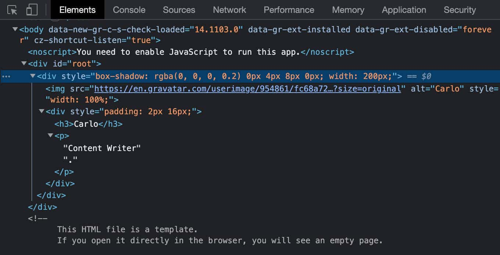<small>Unha tarxeta de exemplo creada con React</small>

Quizais teña notado que en todos os exemplos anteriores incluímos expresións JavaScript en [JSX](https://kinsta.com/es/base-de-conocimiento/que-es-jsx/) .

**✍️ JSX só acepta expresións JavaScript encerradas entre chaves. Non podes escribir declaracións dentro do seu código JSX.**

**Isto inclúe**

- **Variables**
- **Cadenas con comiñas**
- **Chamadas de funcións**
- **Obxectos**
- **Expresións condicionais**

## Inmutabilidade en React

Mutabilidade e Inmutabilidade son [dous conceptos clave](https://en.wikipedia.org/wiki/Immutable_object) na programación funcional e orientada a obxectos.

A inmutabilidade significa que non se podes cambiar un valor despois de que foi creado. Mutabilidade significa, por suposto, o contrario.

En Javascript, [os valores primitivos](https://developer.mozilla.org/en-US/docs/Glossary/Primitive) son [inmutables](https://developer.mozilla.org/en-US/docs/Glossary/Immutable) , é dicir, unha vez que se crea un valor primitivo, non se podes modificar. Pola contra, as matrices e os obxectos son mutables porque as súas propiedades e elementos pódense modificar sen reasignar un novo valor.

Hai varias razóns para usar obxectos inmutables en JavaScript:

- Mellora do rendemento
- Menor consumo de memoria
- Seguridade do fío
- Programación e depuración máis sinxelas

Seguindo o patrón de inmutabilidade, unha vez asignada unha variable ou obxecto, non se podes reasignar nin modificar. Cando necesites modificar datos, debes crear unha copia destes e modificar o seu contido, deixando o contido orixinal sen cambios.

**A inmutabilidade** tamén é un concepto clave en React.

A [documentación de React](https://react.dev/reference/react/Component%23state) indica

> O estado dun compoñente de clase está dispoñible como `this.state`. O campo de estado debe ser un obxecto. Non mute directamente o estado. Se queres cambiar o estado, chama `setState`co novo estado.

Cada vez que cambia o estado dun compoñente, React calcula se debe volver renderizar o compoñente e actualizar o DOM virtual. Se React descoñecía o estado anterior, non podería determinar se volver a renderizar o compoñente ou non. A documentación de React ofrece un [excelente exemplo diso](https://react.dev/learn/updating-objects-in-state%23treat-state-as-read-only) .

Que funcións de JavaScript podemos usar para garantir a inmutabilidade do obxecto de estado en React? Imos descubrir!

### Declarar variables

Ten tres formas de declarar unha variable en JavaScript: `var`, `let`, e `const`.

A [declaración`var`](https://developer.mozilla.org/en-US/docs/Web/JavaScript/Reference/Statements/var%23var_hoisting) existe desde o inicio de JavaScript. Úsase para declarar un ámbito global ou unha variable de ámbito de función, inicializándoa opcionalmente cun valor.

Cando declara unha variable mediante `var`, podes volver declarar e actualizar esa variable tanto no ámbito global como local. Permítese o seguinte código:

```js
// Declare a variable
var msg = "Hello!";

// Redeclare the same variable
var msg = "Goodbye!"

// Update the variable
msg = "Hello again!"
```

As instrucións `var`son procesadas antes de que se execute calquera código. Como resultado, declarar unha variable en calquera parte do código é equivalente a declarala ao principio. Este comportamento chámase [izado](https://developer.mozilla.org/en-US/docs/Glossary/Hoisting) .

Hai que ter en conta que só se levanta a declaración da variable, non a inicialización, que só se produce cando [o fluxo de control](https://developer.mozilla.org/en-US/docs/Glossary/Control_flow) chega á instrución de asignación. Ata entón, a variable é `undefined`:

```js
console.log(msg); // undefined
var msg = "Hello!";
console.log(msg); // Hello!
```

O alcance dunha `var`función declarada nunha función JS é [o corpo completo desa función](https://hacks.mozilla.org/2015/07/es6-in-depth-let-and-const/) .

Isto significa que a variable non está definida a nivel de bloque, senón a nivel de toda a función. Isto leva a unha serie de problemas que poden facer que o teu código JavaScript sexa defectuoso e sexa difícil de manter.

Para resolver estes problemas, ES6 introduciu a [palabra clave`let`](https://developer.mozilla.org/en-US/docs/Web/JavaScript/Reference/Statements/let) .

> A declaración `let`declara unha variable local **de ámbito de bloque** , inicializándoa opcionalmente cun valor.

Cales son as vantaxes do `let`sobre `var`? Aquí tes algúns:

- **`let`** **declara unha variable no ámbito dunha instrución de bloque** , mentres `var`declara unha variable global ou localmente a unha función enteira, independentemente do alcance do bloque.
- **As variables globais `let`non son propiedades do obxecto`window`** . Non podes acceder a eles con `window.variableName`.
- **`let`Só se podes acceder a el unha vez que se chegue á súa declaración.** A variable non se inicializa ata que o fluxo de control chega á liña de código onde se declara ( **non se levantan** as instrucións let ).
- **Redeclarar unha variable con `let`lanza un `SyntaxError`.**

Dado que as variables declaradas con `var`non se poden incluír nun bloque, se define unha variable con `var`nun bucle ou dentro dunha instrución `if`, pódese acceder a ela desde fóra do bloque, o que podes provocar erros no seu código.

O código do primeiro exemplo execútase sen erros. Agora substitúeo `var`polo `let`bloque de código visto arriba:

```js
console.log(msg);
let msg = "Hello!";
console.log(msg);
```

No segundo exemplo, usar `let`no canto de `var`produce `Uncaught ReferenceError`:

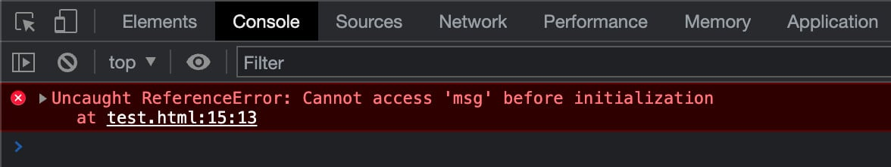 Error de referencia non detectado en Chrome

**✍️ Polo tanto, como regra xeral, debes usar sempre `let`en lugar de `var`.**

ES6 tamén introduce unha terceira palabra clave [`const`](https://developer.mozilla.org/en-US/docs/Web/JavaScript/Reference/Statements/const).

`const`é bastante semellante a `let`, pero cunha diferenza fundamental:

**✍️ Non se lles podes asignar un valor ás variables declaradas `const`con salvo no punto no que se declaran.**

Considere o seguinte exemplo:

```js
const MAX_VALUE = 1000;
MAX_VALUE = 2000;
```

O código anterior provocaría o seguinte [TypeError](https://kinsta.com/es/blog/errores-en-javascript/#typeerror) :

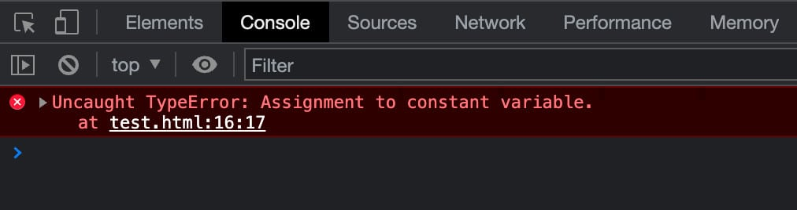

*Erro de tipo non detectado: asignación a variable constante* en Google Chrome

Ademais

**✍️ Non podes declarar un `const`sen darlle un valor.**

Declarar a `const`sen darlle un valor devolvería o seguinte `SyntaxError` (ver tamén [ES6 En profundidade: let e const](https://hacks.mozilla.org/2015/07/es6-in-depth-let-and-const/) ):

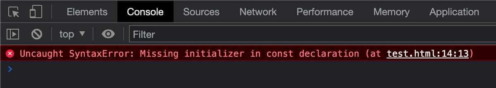
*SyntaxError non detectado: falta o inicializador na declaración const* en Chrome

**✍️ Non se podes volver declarar unha constante e non se podes cambiar o seu valor mediante a reasignación.**

Pero se unha constante é unha matriz ou un obxecto, podes editar propiedades ou elementos dentro desa matriz ou obxecto.

Por exemplo, podes cambiar, engadir e eliminar elementos dunha matriz:

```js
// Declare a constant array
const cities = ["London", "New York", "Sydney"];

// Change an item
cities[0] = "Madrid";

// Add an item
cities.push("Paris");

// Remove an item
cities.pop();

console.log(cities);

// Array(3)
// 0: "Madrid"
// 1: "New York"
// 2: "Sydney"
```

Pero non podes reasignar a matriz:

```js
const cities = ["London", "New York", "Sydney"];

cities = ["Athens", "Barcelona", "Naples"];
```

O código anterior produciría un [TypeError](https://developer.mozilla.org/en-US/docs/Web/JavaScript/Reference/Global_Objects/TypeError) .

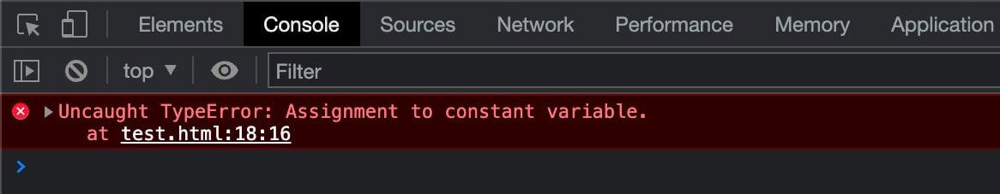
*Error de tipo non detectado: asignación a variable constante* en Chrome

Pode engadir, reasignar e eliminar propiedades e métodos do obxecto:

```js
// Declare a constant obj
const post = {
	id: 1,
	name: 'JavaScript is awesome',
	excerpt: 'JavaScript is an awesome scripting language',
	content: 'JavaScript is a scripting language that enables you to create dynamically updating content.'
};

// add a new property
post.slug = "javascript-is-awesome";

// Reassign property
post.id = 5;

// Delete a property
delete post.excerpt;

console.log(post);

// {id: 5, name: 'JavaScript is awesome', content: 'JavaScript is a scripting language that enables you to create dynamically updating content.', slug: 'javascript-is-awesome'}
```

Pero non podes reasignar o propio obxecto. O seguinte código pasaría por un `Uncaught TypeError`:

```js
// Declare a constant obj
const post = {
	id: 1,
	name: 'JavaScript is awesome',
	excerpt: 'JavaScript is an awesome scripting language'
};

post = {
	id: 1,
	name: 'React is powerful',
	excerpt: 'React lets you build user interfaces'
};
```

**✍️ En React, declarar variables con `const`é o predeterminado. `let`debe utilizarse cando `const`non sexa apropiado. É moi desaconsellable o seu uso `var`.**

### Object.freeze()

Agora estamos de acordo en que o uso `const`non sempre garante unha forte inmutabilidade (especialmente cando se traballa con obxectos e matrices). Entón, como podes implementar o patrón de inmutabilidade nas túas aplicacións React?

En primeiro lugar, cando queres evitar que se modifiquen os elementos dunha matriz ou as propiedades dun obxecto, podes usar o [método estático`Object.freeze()`](https://developer.mozilla.org/en-US/docs/Web/JavaScript/Reference/Global_Objects/Object/freeze) .

> Conxelar un obxecto impide extensións e fai que as propiedades existentes sexan inescribibles e inestables. Un obxecto conxelado xa non se podes modificar: non se poden engadir novas propiedades, non se poden eliminar as existentes, non se poden cambiar a súa enumerabilidade, configurabilidade, escribibilidade ou valor e non se podes reasignar o prototipo do obxecto. `freeze()`devolve o mesmo obxecto que se lle pasou.

Calquera intento de engadir, cambiar ou eliminar unha propiedade fallará, ben en silencio ou lanzando un `TypeError`, o máis comúnmente en [modo estrito](https://developer.mozilla.org/en-US/docs/Web/JavaScript/Reference/Strict_mode) .

Podes usar `Object.freeze()` deste xeito:

```js
'use strict'
// Declare a constant obj
const post = {
	id: 1,
	name: 'JavaScript is awesome',
	excerpt: 'JavaScript is an awesome scripting language'
};
// Freeze the object
Object.freeze(post);
```

Se agora tentas engadir unha propiedade, recibirás un `Uncaught TypeError`:

```js
// Add a new property
post.slug = "javascript-is-awesome"; // Uncaught TypeError
```

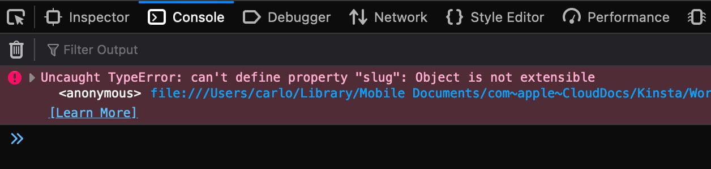
*Error de tipo non capturado: non se podes establecer a propiedade "slug":* o obxecto *non é extensible* en Firefox

Cando tentas reasignar unha propiedade, obtén outro tipo de `TypeError`:

```js
// Reassign property
post.id = 5; // Uncaught TypeError
```

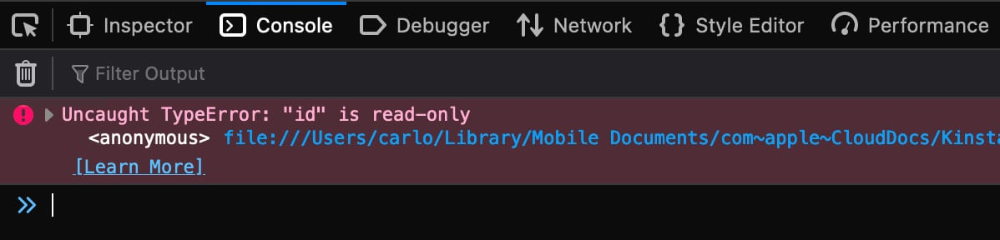
A reasignación dunha propiedade de só lectura xera un TypeError non detectado

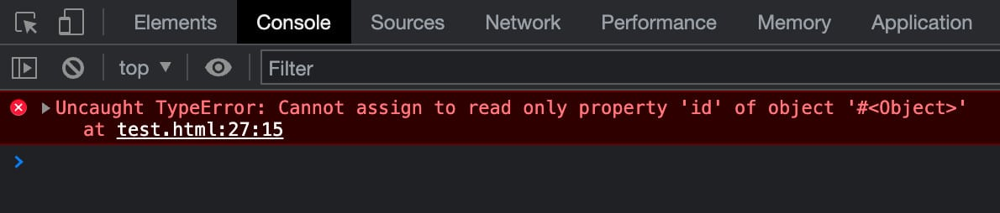
*Error de tipo non detectado: non se podes asignar a propiedade de só lectura 'id' do obxecto `#<Obxecto>` * en Google Chrome

Tamén podes tentar eliminar unha propiedade. O resultado será outro `TypeError` :

```js
// Delete a property
delete post.excerpt; // Uncaught TypeError
```

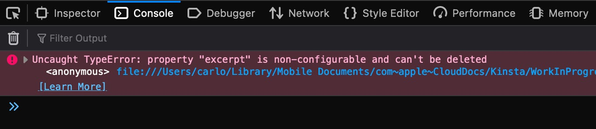
*Error de tipo non detectado: a propiedade "extracto" non se podes configurar e non se podes eliminar* en Firefox

## Literais de modelos

Cando precisa combinar cadeas coa saída de expresións en JavaScript, adoita utilizar o operador de adición `+`. Non obstante, tamén podes usar unha función JavaScript que lle permite incluír expresións dentro das cadeas sen utilizar o operador de adición: **Literais de modelos** .

[Os literais de modelos](https://developer.mozilla.org/en-US/docs/Web/JavaScript/Reference/Template_literals) son un tipo especial de cadeas delimitadas por caracteres de retroceso (\`\`\`) ~~ou de retroceso~~.

Nos literais de modelo podes incluír marcadores de posición, que son expresións incrustadas delimitadas por un carácter de dólar e encerradas entre chaves.

Aquí tes un exemplo:

```js
const align = 'left';
console.log(`This string is ${ align }-aligned`);
```

As cadeas e os marcadores de posición pásanse a unha función predeterminada que realiza a interpolación de cadeas para substituír os marcadores de posición e concatenar as partes nunha única cadea. Tamén podes substituír a función predeterminada por unha función personalizada.

Podes usar literais de modelos para:

**Cadenas de varias liñas**: os novos caracteres de liña forman parte do literal do modelo.

```js
console.log(`Twinkle, twinkle, little bat!
How I wonder what you’re at!`);
```

**Interpolación de cadeas:** sen literais de modelo, só podes usar o operador de adición para combinar a saída de expresións con cadeas. Observa o seguinte exemplo:

```js
const a = 3;
const b = 7;
console.log("The result of " + a + " + " + b + " is " + (a + b));
```

É un pouco confuso, non? Pero podes escribir ese código dun xeito máis lexible e mantible usando Template Literals:

```js
const a = 3;
const b = 7;
console.log(`The result of ${ a } + ${ b } is ${ a + b }`);
```

Pero ten en conta que hai unha [diferenza entre ambas sintaxes](https://developer.mozilla.org/en-US/docs/Web/JavaScript/Reference/Template_literals%23string_interpolation) :

**✍️ Os literais de modelos converten directamente as súas expresións en cadeas de texto, mentres que a suma converte primeiro os seus operandos en primitivos.**

Os literais de modelos préstanse a varios usos. No seguinte exemplo, usamos un [operador ternario](https://kinsta.com/es/blog/javascript-react/#ternary-operator) para asignar un valor a un atributo `class`.

```js
const page = 'archive';
console.log(`class=${ page === 'archive' ? 'archive' : 'single' }`);
```

A continuación, realizamos un cálculo sinxelo:

```js
const price = 100;
const VAT = 0.22;

console.log(`Total price: ${ (price * (1 + VAT)).toFixed(2) }`);
```

Tamén é posible aniñar literais de modelos incluíndoos nun marcador de posición `${expression}`(pero [use modelos aniñados con precaución](https://dev.to/remrkabledev/nesting-template-literals-a-recommended-approach-2jgj) porque as estruturas de cadea complexas poden ser difíciles de ler e manter).

**Modelos etiquetados** : Como mencionamos antes, tamén é posible definir unha función personalizada para realizar a concatenación de cadeas. Este tipo de modelo literal chámase [modelo etiquetado](https://developer.mozilla.org/en-US/docs/Web/JavaScript/Reference/Template_literals%23tagged_templates) .

> As etiquetas permítenche analizar literais de modelos cunha función. O primeiro argumento dunha función de etiqueta contén unha matriz de valores de cadea. Os argumentos restantes están relacionados con expresións.

As etiquetas permítenche analizar literais de modelos cunha función personalizada. O primeiro argumento desta función é unha matriz das cadeas incluídas no Modelo literal, os outros argumentos son as expresións.

Podes crear unha función personalizada para realizar calquera tipo de operación sobre os argumentos do modelo e devolver a cadea manipulada. Aquí tes un exemplo moi básico dun [modelo etiquetado](https://developer.mozilla.org/en-US/docs/Web/JavaScript/Reference/Template_literals%23tagged_templates) :

```js
const name = "Carlo";
const role = "student";
const organization = "North Pole University";
const age = 25;

function customFunc(strings, ...tags) {
	console.log(strings); // ['My name is ', ", I'm ", ', and I am ', ' at ', '', raw: Array(5)]
	console.log(tags); // ['Carlo', 25, 'student', 'North Pole University']
	let string = '';
	for ( let i = 0; i < strings.length - 1; i++ ){
		console.log(i + "" + strings[i] + "" + tags[i]);
		string += strings[i] + tags[i];
	}
	return string.toUpperCase();
}

const output = customFunc`My name is ${name}, I'm ${age}, and I am ${role} at ${organization}`;
console.log(output);
```

O código anterior imprime os elementos da matriz `strings`e, `tags`a continuación, escribe en maiúscula os caracteres da cadea antes de imprimir a saída na consola do navegador.

## Funcións de frecha

As funcións de frecha son unha alternativa ás funcións anónimas (funcións sen nome) en JavaScript, pero con algunhas diferenzas e limitacións.

As seguintes afirmacións son exemplos válidos de funcións de frecha:

```javascript
// Arrow function without parameters
const myFunction = () => expression;

// Arrow function with one parameter
const myFunction = param => expression;

// Arrow function with one parameter
const myFunction = (param) => expression;

// Arrow function with more parameters
const myFunction = (param1, param2) => expression;

// Arrow function without parameters
const myFunction = () => {
	statements
}

// Arrow function with one parameter
const myFunction = param => {
	statements
}

// Arrow function with more parameters
const myFunction = (param1, param2) => {
	statements
}
```

Podes omitir as chaves se só pasas un parámetro á función. Se pasa dous ou máis parámetros, debes encerralos entre chaves. Aquí tes un exemplo:

```javascript
const render = ( id, title, category ) => `${id}: ${title} - ${category}`;
console.log( render ( 5, 'Hello World!', "JavaScript" ) );
```

As funcións de frecha dunha liña devolven un valor predeterminado. Se usa a sintaxe de varias liñas, terá que devolver manualmente un valor:

```javascript
const render = ( id, title, category ) => {
	console.log( `Post title: ${ title }` );
	return `${ id }: ${ title } - ${ category }`;
}
console.log( `Post details: ${ render ( 5, 'Hello World!', "JavaScript" ) }` );
```

**✍️ Normalmente usarás a función de frecha nas aplicacións React, a menos que haxa un motivo específico para non usala.**

Unha diferenza fundamental a ter en conta entre as funcións normais e as funcións de frecha é que as funcións de frecha non teñen as súas propias ligazóns á palabra clave `this`. Se tentas usalo `this`nunha función de frecha, sairá fóra do alcance da función.

Para obter unha descrición máis detallada das funcións de frecha e exemplos de uso, lea tamén [mdn web docs](https://developer.mozilla.org/en-US/docs/Web/JavaScript/Reference/Functions/Arrow_functions) .

## Clases

As clases [en JavaScript](https://developer.mozilla.org/en-US/docs/Learn/JavaScript/Objects/Classes_in_JavaScript) son un tipo especial de función para crear obxectos que usan o mecanismo de herdanza prototípico.

Segundo a [documentación web de mdn](https://developer.mozilla.org/en-US/docs/Web/JavaScript/Inheritance_and_the_prototype_chain)

> Cando se trata de herdanza, JavaScript só ten unha estrutura: os obxectos. Cada obxecto ten unha propiedade privada (referida como o seu [[Prototipo]]) que contén unha ligazón a outro obxecto chamado o seu prototipo. Ese obxecto prototipo ten o seu propio prototipo, e así sucesivamente ata chegar a un obxecto cuxo prototipo sexa`null`

Do mesmo xeito que coas funcións, tes dúas formas de definir unha clase:

- Unha expresión de clase
- Unha declaración de clase

Podes usar a palabra clave `class`para definir unha clase dentro dunha expresión, como se mostra no seguinte exemplo:

```javascript
const Circle = class {
	constructor(radius) {
		this.radius = Number(radius);
	}
	area() {
		return Math.PI * Math.pow(this.radius, 2);
	}
	circumference() {
		return Math.PI * this.radius * 2;
	}
}
console.log('Circumference: ' + new Circle(10).circumference()); // 62.83185307179586
console.log('Area: ' + new Circle(10).area()); // 314.1592653589793
```

Unha clase ten un corpo, que é o código encerrado entre chaves. Aquí definirá o construtor e os métodos, que tamén se denominan membros da clase. O corpo da clase execútase en modo estrito aínda sen usar a directiva `'strict mode'`.

O método `constructor`úsase para crear e inicializar un obxecto creado cunha clase e execútase automaticamente cando se crea unha instancia da clase. Se non define un método de construtor na súa clase, JavaScript usará automaticamente un construtor predeterminado.

Unha clase pódese ampliar usando a palabra clave `extends`.

```javascript
class Book {
	constructor(title, author) {
		this.booktitle = title;
		this.authorname = author;
	}
	present() {
		return this.booktitle + ' is a great book from ' + this.authorname;
	}
}

class BookDetails extends Book {
	constructor(title, author, cat) {
		super(title, author);
		this.category = cat;
	}
	show() {
		return this.present() + ', it is a ' + this.category + ' book';
	}
}

const bookInfo = new BookDetails("The Fellowship of the Ring", "J. R. R. Tolkien", "Fantasy");
console.log(bookInfo.show());
```

Un construtor podes usar a palabra clave `super`para chamar ao construtor pai. Se pasa un argumento ao método `super()`, este argumento tamén estará dispoñible na clase de construtor pai.

Para unha mergullo máis profundo nas clases de JavaScript e varios exemplos de uso, consulta tamén os [documentos web de mdn](https://developer.mozilla.org/en-US/docs/Web/JavaScript/Reference/Classes) .

As clases úsanse a miúdo para crear compoñentes de React. Normalmente, non crearás as túas propias clases, senón que estenderás as clases de React integradas.

Todas as [clases React](https://react.dev/reference/react/Component%23defining-a-class-component) teñen un método `render()`que devolve un elemento React:

```javascript
class Animal extends React.Component {
	render() {
		return <h2>Hey, I am a {this.props.name}!</h2>;
	}
}
```

No exemplo anterior, `Animal`é un compoñente de clase. Ter en conta que

- O nome do compoñente debe comezar cunha letra maiúscula
- O compoñente debe incluír a expresión `extends React.Component`. Isto dá acceso aos métodos `React.Component`.
- O método `render()`devolve o HTML e é necesario.

Unha vez que creas o teu compoñente de clase, podes renderizar o HTML na páxina:

```javascript
const root = ReactDOM.createRoot(document.getElementById('root'));
const element = <Animal name="Rabbit" />;
root.render(element);
```

A imaxe de abaixo mostra o resultado na páxina (Podes velo [en acción en CodePen](https://codepen.io/carlodaniele/pen/LYgPvEP) ).

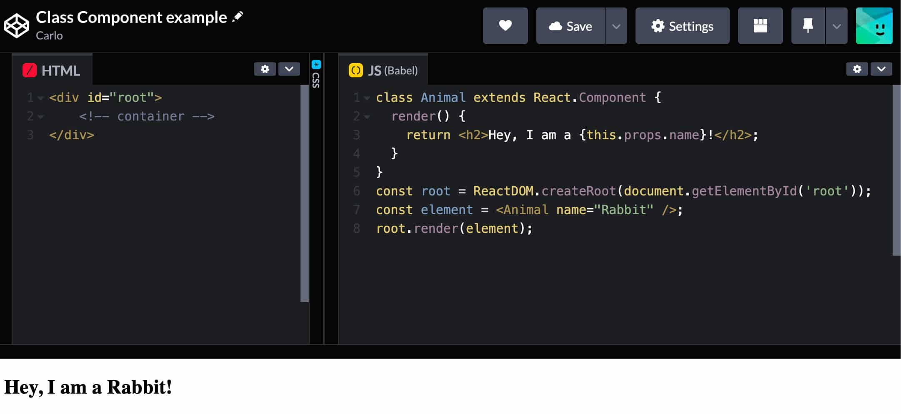Un compoñente sinxelo da clase React

Ter en conta, porén, que [non se recomenda usar compoñentes de clase en React](https://react.dev/reference/react/Component%23migrating-a-simple-component-from-a-class-to-a-function) e que é [preferible definir compoñentes como funcións](https://kinsta.com/es/blog/practicas-de-react/#12-make-use-of-functional-components) .

## A palabra clave 'isto'

En JavaScript, a palabra clave `this`é un marcador de posición xenérico que se usa a miúdo dentro de obxectos, clases e funcións, e fai referencia a diferentes elementos dependendo do contexto ou do ámbito.

**`this`pode ser usado globalmente.** Se escribes `this`na consola do teu navegador, obterás:

```
Window {window: Window, self: Window, document: document, name: '', location: Location, ...}
```

Podes acceder a calquera dos métodos e propiedades do obxecto `Window`. Polo tanto, se executas `this.location`na consola do teu navegador, obterás a seguinte saída:

```
Location {ancestorOrigins: DOMStringList, href: 'https://kinsta.com/', origin: 'https://kinsta.com', protocol: 'https:', host: 'kinsta.com', ...}
```

**Cando se usa `this`nun obxecto, refírese ao propio obxecto.** Deste xeito, podes facer referencia aos valores dun obxecto nos métodos do propio obxecto:

```javascript
const post = { 
	id: 5,
	getSlug: function(){
		return `post-${this.id}`;
	},
	title: 'Awesome post', 
	category: 'JavaScript' 
};
console.log( post.getSlug );
```

Agora imos tentar usalo `this`nunha función:

```javascript
const useThis = function () {
	return this;
}
console.log( useThis() );
```

Se non estás en modo estrito, conseguirás

```
Window {window: Window, self: Window, document: document, name: '', location: Location, ...}
```

Pero se invocas [o modo estrito](https://developer.mozilla.org/en-US/docs/Web/JavaScript/Reference/Strict_mode) , obterás un resultado diferente:

```javascript
const doSomething = function () {
	'use strict';
	return this;
}
console.log( doSomething() );
```

Neste caso, a función devolve `undefined`. Isto é porque `this`nunha función refírese ao seu valor explícito.

Entón, como configuralo de forma explícita `this`nunha función?

En primeiro lugar, podes asignar manualmente propiedades e métodos á función:

```javascript
function doSomething( post ) {
	this.id = post.id;
	this.title = post.title;
	console.log( `${this.id} - ${this.title}` );
}
new doSomething( { id: 5, title: 'Awesome post' } );
```

Pero tamén podes usar os métodos `call`, `apply`e `bind`, así como as funcións de frecha.

**✍️ O método `call()`dunha función acepta un obxecto ao que se refire `this`.**

```javascript
const doSomething = function() {
	console.log( `${this.id} - ${this.title}` );
}
doSomething.call( { id: 5, title: 'Awesome post' } );
```

O método `call()`pódese usar en calquera función e fai exactamente o que di: chama á función.

Ademais, `call()`acepta calquera outro parámetro definido na función:

```javascript
const doSomething = function( cat ) {
	console.log( `${this.id} - ${this.title} - Category: ${cat}` );
}
doSomething.call( { id: 5, title: 'Awesome post' }, 'JavaScript' );
```

**✍️ O método `apply()`acepta un obxecto ao que fará referencia `this`e unha matriz de parámetros de función.**

```javascript
const doSomething = function( cat1, cat2 ) {
	console.log( `${this.id} - ${this.title} - Categories: ${cat1}, ${cat2}` );
}
doSomething.apply( { id: 5, title: 'Awesome post' }, ['JavaScript', 'React'] );
```

**✍️ O método `bind()`asocia un obxecto cunha función, de xeito que sempre que chame a función, `this`faga referencia ao obxecto.**

```javascript
const post = { id: 5, title: 'Awesome post', category: 'JavaScript' };
const doSomething = function() {
	return `${this.id} - ${this.title} - ${this.category}`;
}
const bindRender = doSomething.bind( post );
console.log( bindRender() );
```

Unha alternativa ás opcións comentadas anteriormente é utilizar [as funcións de frecha](https://developer.mozilla.org/en-US/docs/Web/JavaScript/Reference/Functions/Arrow_functions) .

> As expresións de función de frecha só deben usarse para funcións que non son métodos, porque non teñen o seu propio `this`.

Isto fai que as funcións de frecha sexan especialmente útiles cos controladores de eventos.

Isto débese a que "cando o código se chama desde un atributo de controlador de eventos en liña, su `this`establécese no elemento DOM no que se coloca o escoita" (consulta a [documentación web de mdn](https://developer.mozilla.org/en-US/docs/Web/JavaScript/Reference/Operators/this%23this_in_inline_event_handlers) ).

Pero as cousas cambian coas funcións de frecha porque...

> ... as funcións de frecha establécense `this`en función do ámbito no que se define a función de frecha e o valor de `this`non cambia dependendo de como se invoque a función.

**✍️ Usar funcións de frecha permítelle vincular directamente o contexto a un controlador de eventos.**

### Vincular "isto" aos controladores de eventos en React

Cando se trata de React, tes varias formas de asegurarte de que o controlador de eventos non perda o seu contexto:

**1. Usando `bind()`dentro do método render:**

```javascript
import React, { Component } from 'react';
class MyComponent extends Component {
	state = { message: 'Hello World!' };

	showMessage(){
		console.log( 'This refers to: ', this );
		console.log( 'The message is: ', this.state.message );
	}

	render(){
		return( <button onClick={ this.showMessage.bind( this ) }>Show message from state!</button> );
	}
}
export default MyComponent;
```

**2. Vincular o contexto ao controlador de eventos no construtor:**

```javascript
import React, { Component } from 'react';
class MyComponent extends Component {
	state = { message: 'Hello World!' };

	constructor(props) {
		super(props);
		this.showMessage = this.showMessage.bind( this );
	}

	showMessage(){
		console.log( 'This refers to: ', this );
		console.log( 'The message is: ', this.state.message );
	}

	render(){
		return( <button onClick={ this.showMessage }>Show message from state!</button> );
	}
}
export default MyComponent;
```

**3. Definición do controlador de eventos mediante funcións de frecha:**

```javascript
import React, { Component } from 'react';
class MyComponent extends Component {
	state = { message: 'Hello World!' };

	showMessage = () => {
		console.log( 'This refers to: ', this );
		console.log( 'The message is: ', this.state.message );
	}

	render(){
		return( <button onClick={this.showMessage}>Show message from state!</button> );
	}
}
export default MyComponent;
```

**4. Usando funcións de frecha no método de renderizado:**

```javascript
import React, { Component } from 'react';
class MyComponent extends Component {
	state = { message: 'Hello World!' };

	showMessage() {
		console.log( 'This refers to: ', this );
		console.log( 'The message is: ', this.state.message );
	}

	render(){
		return( <button onClick={()=>{this.showMessage()}}>Show message from state!</button> );
	}
}
export default MyComponent;
```

Sexa cal sexa o método que escolla, ao premer o botón, a consola do navegador mostrará a seguinte saída:

```
This refers to:  MyComponent {props: {…}, context: {…}, refs: {…}, updater: {…}, state: {…}, …}
The message is:  Hello World!
```

## Operador Ternario

O [operador condicional](https://developer.mozilla.org/en-US/docs/Web/JavaScript/Reference/Operators/Conditional_Operator) (ou operador ternario) permítelle escribir expresións condicionais sinxelas en JavaScript. Toma tres operandos:

- unha condición seguida dun signo de interrogación ( `?`),
- unha expresión para executar se a condición é [verdadeira](https://developer.mozilla.org/en-US/docs/Glossary/Truthy) seguida dun punto e coma ( `:`),
- unha segunda expresión para executar se a condición é [falsa](https://developer.mozilla.org/en-US/docs/Glossary/Falsy) .

```javascript
const drink = personAge >= 18 ? "Wine" : "Juice";
```

Tamén é posible encadear varias expresións:

```javascript
const drink = personAge >= 18 ? "Wine" : personAge >= 6 ? "Juice" : "Milk";
```

Pero teña coidado, porque encadear varias expresións podes levar a un código desordenado e difícil de manter.

O operador ternario é especialmente útil en React, especialmente no teu código JSX, que só acepta expresións entre chaves.

Por exemplo, podes usar o operador ternario para establecer o valor dun atributo en función dunha condición específica:

```jsx
render(){			
	const person = {
		name: 'Carlo',
		avatar: 'https://en.gravatar.com/...',
		description: 'Content Writer',
		theme: 'light'
	}

	return (
		<div
			className='card' 
			style={
				person.theme === 'dark' ? 
				{ background: 'black', color: 'white' } : 
				{ background: 'white', color: 'black'} 
			}>
			
			<div style={ { padding: '2px 16px' } }>
				<h3>{person.name}</h3>
				<p>{person.description}.</p>
			</div>
		</div>
	);
}
```

No código anterior, comprobamos a condición `person.theme === 'dark'`para establecer o valor do atributo `style` do contedor `div`.

## Avaliación de curtocircuítos

O operador lóxico AND (`&&`) avalía os operandos de esquerda a dereita e devolve `true`se e só se todos os operandos son `true`.

AND lóxico é un [operador de curtocircuíto](https://developer.mozilla.org/en-US/docs/Web/JavaScript/Reference/Operators/Logical_AND%23short-circuit_evaluation) . Cada operando convértese nun booleano e, se o resultado da conversión é falso `false`, o operador AND detense e devolve o valor orixinal do operando. Se todos os valores son `true`, devolve o valor orixinal do último operando.


**✍️ En JavaScript, `true && expression`sempre devolve `expression`e `false && expression`sempre devolve `false`.**


A avaliación de curtocircuítos - *Short circuit evaluation*- é unha función de JavaScript que se usa habitualmente en React, xa que che permite devolver bloques de código en función de condicións específicas. [Aquí](https://kinsta.com/es/blog/bloques-dinamicos/#add-the-excerpt) tes un exemplo:


```jsx
{
	displayExcerpt &&
	post.excerpt.rendered && (
		<p>
			<RawHTML>
				{ post.excerpt.rendered }
			</RawHTML>
		</p>
	)
}
```

No código anterior, se `displayExcerpt` **Y** `post.excerpt.rendered` avalía como `true`, React devolve o bloque JSX final.

[Para recapitular](https://legacy.reactjs.org/docs/conditional-rendering.html%23inline-if-with-logical--operator) , "se a condición é `true`, o elemento inmediatamente posterior `&&`aparecerá na saída. Se é `false`, React ignorarao e saltaao.

## Sintaxe de propagación

En JavaScript, [a sintaxe propagada](https://developer.mozilla.org/en-US/docs/Web/JavaScript/Reference/Operators/Spread_syntax) permítelle expandir un elemento iterable, como unha matriz ou un obxecto, en argumentos de función, literais de matriz ou literais de obxecto.

No seguinte exemplo, estamos descomprimindo unha matriz nunha chamada de función:

```jsx
function doSomething( x, y, z ){
	return `First: ${x} - Second: ${y} - Third: ${z} - Sum: ${x+y+z}`;
}
const numbers = [3, 4, 7];
console.log( doSomething( ...numbers ) );
```

Podes usar a sintaxe de propagación para duplicar unha matriz (incluso matrices multidimensionais) ou para concatenar matrices. Nos seguintes exemplos, concatenamos dúas matrices de dúas formas diferentes:

```jsx
const firstArray = [1, 2, 3];
const secondArray = [4, 5, 6];
firstArray.push( ...secondArray );
console.log( firstArray );
```

Alternativamente:

```jsx
let firstArray = [1, 2, 3];
const secondArray = [4, 5, 6];
firstArray = [ ...firstArray, ...secondArray];
console.log( firstArray );
```

Tamén podes usar a sintaxe de propagación para clonar ou combinar dous obxectos:

```jsx
const firstObj = { id: '1', title: 'JS is awesome' };
const secondObj = { cat: 'React', description: 'React is easy' };

// clone object
const thirdObj = { ...firstObj };

// merge objects
const fourthObj = { ...firstObj, ...secondObj }

console.log( { ...thirdObj } );
console.log( { ...fourthObj } );
```

## Asignación de desestructuración

Outra estrutura de sintaxe que atoparás que se usa con frecuencia en React é a sintaxe [de asignación de destruturación .](https://developer.mozilla.org/en-US/docs/Web/JavaScript/Reference/Operators/Destructuring_assignment)

**✍️ A sintaxe de asignación de desestruturación permítelle descomprimir os valores dunha matriz, ou as propiedades dun obxecto, en variables separadas.**

No seguinte exemplo, descomprimimos os valores dunha matriz:

```javascript
const user = ['Carlo', 'Content writer', 'Kinsta'];
const [name, description, company] = user;
console.log( `${name} is ${description} at ${company}` );
```

E aquí tes un exemplo sinxelo de desestruturación da asignación cun obxecto:

```javascript
const user = {
	name: 'Carlo',
	description: 'Content writer',
	company: 'Kinsta'
}
const { name, description, company } = user;
console.log( `${name} is ${description} at ${company}` );
```

Pero podemos facer aínda máis. No seguinte exemplo, desestruturamos algunhas propiedades dun obxecto e asignamos as restantes a outro obxecto usando a sintaxe de propagación.

```javascript
const user = {
	name: 'Carlo',
	family: 'Daniele',
	description: 'Content writer',
	company: 'Kinsta',
	power: 'swimming'
}
const { name, description, company, ...rest } = user;
console.log( rest ); // {family: 'Daniele', power: 'swimming'}
```

Tamén podes asignar valores a unha matriz:

```javascript
const user = [];
const object = { name: 'Carlo', company: 'Kinsta' };
( { name: user[0], company: user[1] } = object );
console.log( user ); // (2) ['Carlo', 'Kinsta']
```

Ter en conta que se requiren parénteses ao redor da instrución de asignación cando se usa unha asignación literal non estruturada de obxecto sen declaración.

Para unha discusión máis profunda sobre a asignación de desestruturación, con varios exemplos de uso, consulta a [documentación web de mdn](https://developer.mozilla.org/en-US/docs/Web/JavaScript/Reference/Operators/Destructuring_assignment) .

## filter(), map() e reduce()

JavaScript fornece varios métodos útiles que empregará a miúdo en React.

### filtro()

**✍️ O [método`filter()`](https://developer.mozilla.org/en-US/docs/Web/JavaScript/Reference/Global_Objects/Array/filter) crea unha [copia superficial](https://developer.mozilla.org/en-US/docs/Glossary/Shallow_copy) dunha determinada parte dunha matriz filtrada ata os elementos que cumpren a condición da función dada.**

No seguinte exemplo, aplicamos o filtro á matriz `numbers`para obter unha matriz cuxos elementos sexan números superiores a 5:

```javascript
const numbers = [2, 6, 8, 2, 5, 9, 23];
const result = numbers.filter( number => number > 5);
console.log(result); // (4) [6, 8, 9, 23]
```

No seguinte exemplo, obtemos unha matriz de entradas coa palabra "JavaScript" incluída no título:

```javascript
const posts = [
	{id: 0, title: 'JavaScript is awesome', content: 'your content'},
	{id: 1, title: 'WordPress is easy', content: 'your content'},
	{id: 2, title: 'React is cool', content: 'your content'},
	{id: 3, title: 'With JavaScript to the moon', content: 'your content'},
];

const jsPosts = posts.filter( post => post.title.includes( 'JavaScript' ) );

console.log( jsPosts );
```

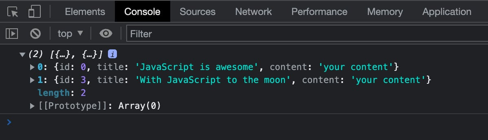Unha matriz de entradas cuxo título inclúe "JavaScript"

### mapa()

**✍️ O [método`map()`](https://developer.mozilla.org/en-US/docs/Web/JavaScript/Reference/Global_Objects/Array/map) executa unha función proporcionada en cada elemento dunha matriz e devolve unha nova matriz poboada con cada elemento resultante da función de devolución de chamada.**

```javascript
const numbers = [2, 6, 8, 2, 5, 9, 23];
const result = numbers.map( number => number * 5 );
console.log(result); // (7) [10, 30, 40, 10, 25, 45, 115]
```

Nun compoñente React, moitas veces atoparás o método `map()`usado para crear listas. No seguinte exemplo, estamos mapeando o `posts`obxecto de WordPress para [construír unha lista de entradas](https://kinsta.com/es/blog/bloques-dinamicos/) :

```javascript
<ul>
	{ posts && posts.map( ( post ) => {
		return (
			<li key={ post.id }>
				<h5>
					<a href={ post.link }>
						{ 
							post.title.rendered ? 
							post.title.rendered :
							__( 'Default title', 'author-plugin' )
						}
					</a>
				</h5>
			</li>
		)
	})}
</ul>
```

### diminuír()

**✍️ O [método`reduce()`](https://developer.mozilla.org/en-US/docs/Web/JavaScript/Reference/Global_Objects/Array/reduce) executa unha función de devolución de chamada ( \*redutor\* ) en cada elemento dunha matriz e pasa o valor devolto á seguinte iteración. Simplemente, o reductor "reduce" todos os elementos dunha matriz a un único valor.**

`reduce()`acepta dous parámetros:

- Unha función de devolución de chamada para executar para cada elemento da matriz. Devolve un valor que se converte no valor do parámetro acumulador na seguinte chamada. Na última chamada, a función devolve o valor que será o valor de retorno de `reduce()`.
- Un valor inicial que é o primeiro valor do acumulador pasado á función de devolución de chamada.

A función de devolución de chamada toma algúns parámetros:

- Un **acumulador** : o valor devolto pola chamada anterior á función de devolución de chamada. Na primeira chamada, establécese nun valor inicial se se especifica. En caso contrario, toma o valor do primeiro elemento da matriz.
- O valor do **elemento actual** : o valor establécese no primeiro elemento da matriz ( `array[0]`) se se estableceu un valor inicial, se non, toma o valor do segundo elemento ( `array[1]`).
- O **índice actual** é a posición do índice do elemento actual.

Un exemplo aclarará todo.

```javascript
const numbers = [1, 2, 3, 4, 5];
const initialValue = 0;
const sumElements = numbers.reduce(
	( accumulator, currentValue ) => accumulator + currentValue,
	initialValue
);
console.log( numbers ); // (5) [1, 2, 3, 4, 5]
console.log( sumElements ); // 15
```

Vexamos en detalle o que acontece en cada iteración. Volve ao exemplo anterior e cambia `initialValue`:

```javascript
const numbers = [1, 2, 3, 4, 5];
const initialValue = 5;
const sumElements = numbers.reduce(
	( accumulator, currentValue, index ) => {
		console.log('Accumulator: ' + accumulator + ' - currentValue: ' + currentValue + ' - index: ' + index);
		return accumulator + currentValue;
	},
	initialValue
);
console.log( sumElements );
```

A seguinte imaxe mostra a saída na consola do navegador:

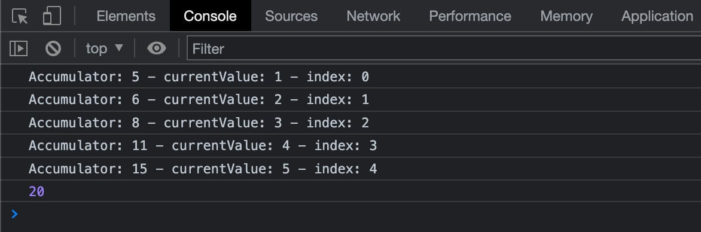usando reduce() co valor inicial establecido en 5

Agora vexamos que pasa sen o parámetro `initialValue`:

```javascript
const numbers = [1, 2, 3, 4, 5];
const sumElements = numbers.reduce(
	( accumulator, currentValue, index ) => {
		console.log( 'Accumulator: ' + accumulator + ' - currentValue: ' + currentValue + ' - index: ' + index );
		return accumulator + currentValue;
	}
);
console.log( sumElements );
```

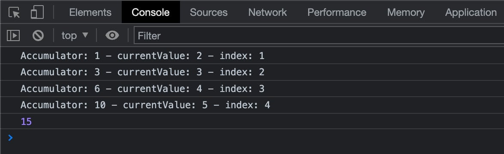Usando reduce() sen valor inicial

Podes atopar máis exemplos e casos de uso no sitio web [de mdn web docs](https://developer.mozilla.org/en-US/docs/Web/JavaScript/Reference/Global_Objects/Array/reduce) .

## Exportacións e importacións

A partir de ECMAScript 2015 (ES6), é posible exportar valores desde un módulo JavaScript e importalos a outro script. Usarás moito as importacións e exportacións nas túas aplicacións React, polo que é importante entender como funcionan.

O seguinte código crea un compoñente funcional. A primeira liña importa a biblioteca React:

```javascript
import React from 'react';

function MyComponent() {
	const person = {
		name: 'Carlo',
		avatar: 'https://en.gravatar.com/userimage/954861/fc68a728946aac04f8531c3a8742ac22?size=original',
		description: 'Content Writer',
		theme: 'dark'
	}
 
	return (
		<div
			className = 'card'
			style = {
				person.theme === 'dark' ?
				{ background: 'black', color: 'white' } :
				{ background: 'white', color: 'black'}
			}>
			
			<div
				style = { { padding: '2px 16px' } }
			>
				<h3>{ person.name }</h3>
				<p>{ person.description }.</p>
			</div>
		</div>
	);
}
export default MyComponent;
```

Usamos a palabra clave `import`seguida do nome que queremos asignar ao que estamos a importar, seguido do nome do paquete que queremos instalar tal e como se menciona no ficheiro **package.json** .

**✍️ As declaracións `import`utilízanse para [importar ligazóns en directo de só lectura](https://developer.mozilla.org/en-US/docs/Web/JavaScript/Reference/Statements/import) exportadas por outros módulos.**

Ter en conta que na `MyComponent()`función anterior, usamos algunhas das funcións de JavaScript comentadas nas seccións anteriores. Colocamos os valores das propiedades entre chaves e asignamos o valor da propiedade `style`usando a sintaxe do operador condicional.

O script remata coa exportación do noso compoñente personalizado.

Agora que sabemos un pouco máis sobre as importacións e exportacións, vexamos máis de cerca como funcionan.

### Exportar

**✍️ A declaración `export`úsase para exportar valores desde un módulo JavaScript.**

Cada módulo de React podes ter [dous tipos diferentes de exportación](https://developer.mozilla.org/en-US/docs/Web/JavaScript/Reference/Statements/export%23description) : **exportación denominada** e **exportación predeterminada**.

**✍️ Podes ter varias exportacións con nome por módulo, pero só unha exportación por defecto.**

Por exemplo, podes exportar varias funcións á vez cunha única instrución `export`:

```javascript
export { MyComponent, MyVariable };
```

Tamén podes exportar funcións individuais ( `function`, `class`, `const`, `let`):

```javascript
export function MyComponent() { ... };
export let myVariable = x + y;
```

Pero só podes ter unha única exportación predeterminada:

```javascript
export default MyComponent;
```

Tamén podes usar a exportación predeterminada para funcións individuais:

```javascript
export default function() { ... }
export default class { ... }
```

### Materia

Unha vez exportado o compoñente, podes importalo noutro ficheiro, por exemplo un ficheiro **index.js** , xunto con outros módulos:

```javascript
import React from 'react';
import ReactDOM from 'react-dom/client';
import './index.css';
import MyComponent from './MyComponent';

const root = ReactDOM.createRoot( document.getElementById( 'root' ) );
root.render(
	<React.StrictMode>
		<MyComponent />
	</React.StrictMode>
);
```

No código anterior, usamos a instrución import de varias maneiras.

Nas dúas primeiras liñas, asignamos un nome aos recursos importados, na terceira liña non asignamos un nome senón que simplemente importamos o ficheiro **./index.css** . A última instrución `import`importa o ficheiro **./MyComponent** e asígnalle un nome.

Vexamos as diferenzas entre esas importacións.

En total, hai catro tipos de importacións:

**Importación denominada**

```javascript
import { MyFunction, MyVariable } from "./my-module";
```

**Importación predeterminada**

```javascript
import MyComponent from "./MyComponent";
```

**Importación de espazos de nomes**

```javascript
import * as name from "my-module";
```

**Importación de efectos secundarios**

```javascript
import "module-name";
```

**`import`✍️ Utilízase unha instrución sen chaves para importar o valor predeterminado `export`. `import`Utilízase unha instrución con chaves para importar un nome `export`.**

Unha vez que engades algúns estilos ao teu **index.css** , a túa tarxeta debería parecerse á imaxe de abaixo, onde tamén podes ver o código HTML correspondente:

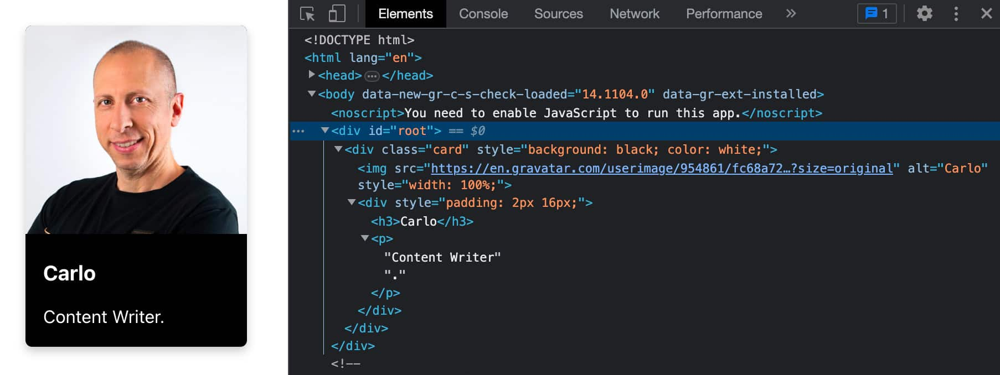Un simple compoñente React

Ter en conta que as declaracións `import`só se poden usar en módulos de nivel superior (non dentro de funcións, clases, etc.).

Para unha visión máis completa das `import`e declaracións `export`, tamén podes consultar os seguintes recursos:

- [exportar](https://developer.mozilla.org/en-US/docs/Web/JavaScript/Reference/Statements/export) (mdn web docs)
- [importar](https://developer.mozilla.org/en-US/docs/Web/JavaScript/Reference/Statements/import) (mdn web docs)
- [Importar e exportar compoñentes](https://react.dev/learn/importing-and-exporting-components) (desenvolvedor de React)
- [Cando debo usar chaves na importación ES6? ](https://stackoverflow.com/questions/36795819/when-should-i-use-curly-braces-for-es6-import/36796281)(Desbordamento de pila)

## Resumo

React é unha das [bibliotecas JavaScript máis populares](https://kinsta.com/es/blog/bibliotecas-javascript/#reactjs) na actualidade e é unha das [habilidades máis demandadas](https://kinsta.com/es/blog/salario-desarrollador-web/) no mundo do [desenvolvemento web](https://kinsta.com/es/blog/desarrollador-de-frontend/) .

Con React é posible crear aplicacións web dinámicas e interfaces avanzadas. Crear aplicacións grandes, dinámicas e interactivas podes ser doado grazas aos seus compoñentes reutilizables.

Pero React é unha biblioteca de JavaScript, e unha boa comprensión das principais características de JavaScript é esencial para comezar a súa viaxe con React. É por iso que reunimos nun só lugar algunhas das funcións de JavaScript que atoparás con máis frecuencia en React. Dominar esas funcións darache unha vantaxe na túa [viaxe de aprendizaxe de React](https://kinsta.com/es/blog/mejores-tutoriales-de-react/) .

E cando se trata de [desenvolvemento web](https://kinsta.com/es/blog/tipos-de-desarrolladores/) , pasar de JS/React a WordPress require moi pouco esforzo.

Agora é a túa quenda, que funcións de JavaScript cres que son máis útiles para desenvolver con React? Deixamos fóra algo importante que che gustaría ver na nosa lista? Comparte a túa opinión connosco nos comentarios.

---

Tradución do artigo de [Carlo Daniele](https://kinsta.com/es/blog/author/carlodaniele/), publicado orixinalmente en https://kinsta.com/es/blog/javascript-react/ o 25 de agosto, 2023 