# HTML

## 1

HTML, a abreviatura de *HyperText Markup Language*, é un dos bloques de construción máis fundamentais da web.

HTML naceu oficialmente en 1993 e desde entón evolucionou ata o seu estado actual, pasando de simples documentos de texto a potenciar aplicacións web de todo tipo.

<!-- Este manual está dirixido a un público amplo. -- Primeiro, o principiante. Explico HTML desde cero dunha forma sucinta pero completa, para que poidas usar este libro para aprender HTML dende o básico. -- Despois, o profesional. A miúdo considérase HTML como algo secundario para aprender. Podería darse por feito. -- Con todo, moitas cousas son escuras para moita xente. Eu incluído.--> Escribín este manual para axudarme a comprender o tema, porque cando necesito explicar algo, é mellor que me asegure de que primeiro coñezo a cousa por dentro.

Aínda que non escribas HTML no teu traballo diario, saber como funciona o HTML pode axudarche a aforrarche algúns dores de cabeza cando precisas entendelo de cando en vez, por exemplo mentres modificas unha páxina web.

HTML é a base da Web.

Hai un poder incrible debaixo deste conxunto de regras bastante sinxelo e limitado, que nos permite (desenvolvedores, creadores, deseñadores, escritores e retocadores) crear documentos, aplicacións e experiencias para persoas de todo o mundo.

O meu primeiro libro HTML saíu en 1997 e chamábase "HTML Unleashed". Un tomo longo e de moitas páxinas.

Pasaron máis de 20 anos e HTML segue sendo a base da web, con cambios mínimos desde entón.

Por suposto, temos máis etiquetas semánticas, o HTML de presentación xa non se emprega e CSS encargase do deseño das cousas.

O éxito de HTML baséase na sinxeleza .

Resistiuse a ser reducido a un dialecto XML a través de XHTML, cando finalmente a xente se decatou de que a cousa era demasiado complexa.

Fíxoo por outra característica que nos proporciona: **o perdón** . Hai *algunhas* regras, certo, pero despois de aprendelas, tes moita liberdade.

Os navegadores aprenderon a ser resistentes e a intentar sempre facer o mellor cando analizan e presentan HTML aos usuarios.

E toda a plataforma web fixo unha cousa ben: nunca rompeu a compatibilidade con versións anteriores. Moi incriblemente, podemos volver aos documentos HTML escritos en 1991, e parecen máis ou menos como antes.

Mesmo sabemos cal foi a primeira páxina web. É isto: [http://info.cern.ch/hypertext/WWW/TheProject.html](http://info.cern.ch/hypertext/WWW/TheProject.html)

E podes ver a fonte da páxina, grazas a outra gran característica da Web e do HTML: **podemos inspeccionar o HTML de calquera páxina web** .

Non deas isto por feito. Non coñezo ningunha outra plataforma que nos dea esta capacidade.

As excepcionales ferramentas para programadores integradas en calquera navegador permítennos inspeccionar e inspirarnos en HTML escrito por calquera persoa do mundo.

Se es novo en HTML, este libro pretende axudarche a comezar. Se es un programador web experimentado, este libro mellorará os teus coñecementos.

Aprendín moito mentres o escribín, aínda que levo máis de 20 anos traballando coa web e seguro que tamén atoparás algo novo.

Ou volverás aprender algo vello que esqueciches.

En todo caso, o obxectivo do libro é que che sexa de utilidade, e espero que teña éxito.

## 2. Conceptos básicos de HTML

HTML é un estándar definido polo **WHATWG**, un acrónimo de Web Hypertext Application Technology Working Group, unha organización formada por persoas que traballan no navegador web máis popular. Isto significa que está basicamente controlado por Google, Mozilla, Apple e Microsoft.

No pasado o **W3C** (World Wide Web Consortium) era a organización encargada de crear o estándar HTML.

O control pasou informalmente do W3C a WHATWG cando quedou claro que o impulso do W3C cara a XHTML non era unha boa idea.

Se nunca escoitou falar de XHTML, resúmoa aquí: A principios dos anos 2000, todos críamos que o futuro da web era XML :smirk: . Así que HTML pasou de ser unha linguaxe de autoría baseada na SGML a unha linguaxe de marcado XML.

Foi un gran cambio. Había que coñecer, e respectar, máis regras. Regras máis estritas.

Finalmente, os vendedores de navegadores decatáronse de que este non era o camiño correcto para a web e retrocederon, creando o que agora se coñece como HTML5.

O W3C non estaba de acordo en renunciar ao control de HTML, e durante anos tivemos 2 estándares competidores, cada un deles que pretendía ser o oficial. Finalmente, o 28 de maio de 2019, o W3C oficializou que a versión HTML "verdadeira" era a publicada por WHATWG.

Mencionei HTML5. Déixame explicar esta pequena historia. Seino, é algo confuso ata agora, como ocorre con moitas cousas da vida cando están implicados moitos actores, pero tamén é fascinante.

**A versión HTML1** publicouse en 1993. [Aquí tes o RFC orixinal](https://tools.ietf.org/html/rfc1983) .

**HTML2** seguiuno en 1995.

**HTML 3** apareceu en xaneiro de 1997 e **HTML 4** en decembro dese mesmo ano.

Tempos axitados!

Pasou o tempo e formulouse XHTML só para desaparecer arredado por esta "cousa" que denominamos HTML5, e que xa non é só *HTML* .

HTML5 é un termo que define todo un conxunto de tecnoloxías, que inclúe HTML pero engade moitas API e estándares como WebGL, SVG e moito máis.

O fundamental que hai que entender aquí é o seguinte: xa non existe (máis) unha versión HTML. É un nivel de vida. Como CSS, que se chama "3", pero en realidade é unha morea de módulos independentes desenvolvidos por separado. Como JavaScript, onde temos unha nova edición cada ano, pero hoxe en día o único que importa é que funcións individuais implementa o motor.

Aquí é onde "vive" agora o estándar: [https://html.spec.whatwg.org/multipage](https://html.spec.whatwg.org/multipage) .

**HTML é a linguaxe de marcado que usamos para estruturar o contido que consumimos na Rede.**

O HTML ofrécese ao navegador de diferentes xeitos.

- Pode ser xerado por unha aplicación do servidor que o constrúe dependendo da solicitude ou dos datos da sesión, por exemplo unha aplicación Rails ou Laravel ou Django.
- Pode ser xerado por unha aplicación do cliente de JavaScript que xera HTML sobre a marcha.
- No caso máis sinxelo, pódese almacenar nun arquivo e ser servido ao navegador por un servidor web.

Mergullémonos neste último caso. Aínda que na práctica probablemente sexa a forma menos popular de xerar HTML, aínda é esencial coñecer os bloques básicos de construción.

Por convención, un arquivo HTML gárdase cunha extensión `.html`ou `.htm`.

Dentro deste arquivo, organizamos o contido mediante **etiquetas** .

As etiquetas envolven o contido e cada etiqueta dá un significado especial ao texto que envolve.

Poñamos algúns exemplos.

Este fragmento HTML crea un parágrafo usando a etiqueta  `p`:

```html
<p>A paragraph of text</p>
```

Este fragmento HTML crea unha lista de elementos usando a etiqueta `ul`, que significa *lista non ordenada* , e as etiquetas `li`, que significan *elemento da lista* :

```html
<ul>
 <li>First item</li>
 <li>Second item</li>
 <li>Third item</li>
</ul>
```

Cando o navegador serve unha páxina HTML, as etiquetas son interpretadas e o navegador representa os elementos segundo as regras que definen a súa aparencia visual.

Algunhas desas regras están integradas, como como se representa unha lista ou como se subliña unha ligazón en azul.

Algunhas outras regras as estableces ti con CSS.

HTML non é de presentación. Non está preocupado por como *se ven* as cousas . Pola contra, preocúpase polo que *significan* as cousas .

Corresponde ao navegador determinar como se ven as cousas, coas directivas definidas por quen constrúe a páxina, coa linguaxe CSS.

Agora, eses dous exemplos que fixen son fragmentos HTML tomados fóra do contexto dunha páxina.

### 2.1. Estrutura da páxina HTML

Imos facer un exemplo dunha páxina HTML adecuada.

As cousas comezan coa Declaración do tipo de documento (tamén coñecido como *doctype* ), unha forma de dicirlle ao navegador que esta é unha páxina HTML e que versión de HTML estamos a usar.

HTML moderno usa este tipo de documento:

```html
<!DOCTYPE html>
```

Despois temos o elemento `html`, que ten unha etiqueta de apertura e peche:

```html
<!DOCTYPE html>
<html>
 ...
</html>
```

A maioría das etiquetas veñen en pares cunha etiqueta de apertura e unha etiqueta de peche. A etiqueta de peche escríbese igual que a etiqueta de apertura, pero cun `/`:

```html
<unhaetiqueta>algún contido</unhaetiqueta>
```

Hai algunhas etiquetas de peche automático, o que significa que non necesitan unha etiqueta de peche separada xa que non conteñen nada *nelas* .

A etiqueta `html` de inicio úsase ao principio do documento, xusto despois da declaración do tipo de documento.

A etiqueta `html` final é a última cousa presente nun documento HTML.

Dentro do elemento `html` temos 2 elementos: `head` e `body`:

```html
<!DOCTYPE html>
<html>
 <head>
  ...
 </head>
 <body>
  ...
 </body>
</html>
```

Dentro de `head` teremos etiquetas imprescindibles para crear unha páxina web, como o título, os metadatos e CSS e JavaScript internos ou externos. A maioría das cousas que non aparecen directamente na páxina, senón que só axudan ao navegador (ou a bots como o bot de busca de Google) a mostralo correctamente.

Dentro de `body` teremos o contido da páxina. As **cousas visibles** .

### 2.2. Etiquetas vs elementos

Etiquetas e elementos. Cal é a diferenza?

Os elementos teñen unha etiqueta de inicio e unha etiqueta de peche. Neste exemplo, usamos as etiquetas `p` de inicio e peche para crear un elemento `p`:

```html
<p>A paragraph of text</p>
```

Así, un elemento constitúe o *paquete* completo :

- etiqueta de inicio
- contido do texto (e posiblemente outros elementos)
- etiqueta de peche

Se un elemento non ten unha etiqueta de peche, só se escribe coa etiqueta de inicio e non pode conter ningún contido de texto.

Dito isto, podería usar o termo de etiqueta ou elemento no libro que significa o mesmo, excepto se menciono explícitamente a etiqueta de inicio ou a de final.

### 2.3. Atributos

A etiqueta de inicio dun elemento pode ter fragmentos especiais de información que podemos anexar, chamados **atributos** .

Os atributos teñen a `key="value"`sintaxe:

```html
<p class="a-class">A paragraph of text</p>
```

> Tamén podes usar comiñas simples, pero usar comiñas dobres en HTML é unha boa convención.

Podemos ter moitos deles:

```html
<p class="a-class" id="an-id">A paragraph of text</p>
```

e algúns atributos son booleanos, o que significa que só precisa a clave:

```html
<script defer src="file.js"></script>
```

Os atributos `class` e `id`son dous dos máis comúns que atoparás empregados.

Teñen un significado especial e son útiles tanto en CSS como en JavaScript.

A diferenza entre ambos é que an `id`é único no contexto dunha páxina web; non se pode duplicar.

As clases, por outra banda, poden aparecer varias veces en varios elementos.

Ademais, an `id`é só un valor. `class`pode conter varios valores, separados por un espazo:

```html
<p class="a-class another-class">A paragraph of text</p>
```

É común usar o guión `-`para separar palabras nun valor de clase, pero é só unha convención.

Eses son só dous dos posibles atributos que podes ter. Algúns atributos só se usan para unha etiqueta. Son altamente especializados.

Outros atributos pódense usar dun xeito máis xeral. Acabas de ver `id` e `class`, pero tamén temos outras, como `style`as que se poden usar para inserir regras CSS en liña nun elemento.

### 2.4. Non sensitivo - non distingue entre maiúsculas e minúsculas

HTML non distingue entre mayúsculas e minúsculas. As etiquetas pódense escribir en maiúsculas ou minúsculas. Nos primeiros tempos, as gorras eran a norma. Hoxe as minúsculas son a norma. É unha convención.

Normalmente escribes así:

```html
<p>A paragraph of text</p>
```

non así:

```html
<P>A paragraph of text</P>
```

### 2.5. Espazo en branco

Moi importante. En HTML, aínda que engadas varios espazos en branco nunha liña, está contraído polo motor CSS do navegador.

Por exemplo, a interpretación deste parágrafo

```html
<p>A paragraph of text</p>
```

é o mesmo que este:

```html
<p>A paragraph of text   </p>
```

e o mesmo que este:

```html
<p>


 A paragraph of text


 </p>
```

> Usando a [`white-space`propiedade CSS](https://developer.mozilla.org/en-US/docs/Web/CSS/white-space) pode cambiar o comportamento das cousas. Podes atopar máis información sobre como CSS procesa o espazo en branco na [especificación CSS](https://www.w3.org/TR/CSS2/text.html%23white-space-model)

Eu diría que use a sintaxe que fai que as cousas sexan visualmente máis organizadas e máis fáciles de ler, pero pode usar calquera sintaxe que lle guste.

Eu normalmente favor

```html
<p>A paragraph of text</p>
```

ou

```html
<p>
 A paragraph of text
</p>
```

As etiquetas anidadas deben estar sangradas con 2 ou 4 caracteres, dependendo da túa preferencia:

```html
<body>
 <p>A paragraph of text</p>
 <ul>
  <li>A list item</li>
 </ul>
</body>
```

> Nota: esta función de "espazo en branco non é relevante" significa que se queres engadir espazo adicional, podes enloquecer. Suxiro que use CSS para facer máis espazo cando sexa necesario.
> Nota: en casos especiais, podes usar a entidade HTML `&nbsp;` (un acrónimo que significa *espazo que non se rompe* ) - máis sobre as entidades HTML máis adiante. Creo que isto non se debe abusar. Sempre se prefire CSS para alterar a presentación visual.

## 3. O encabezamento do documento - `head`

A etiqueta `head` contén etiquetas especiais que definen as propiedades do documento.

Sempre está escrito antes da etiqueta `body`, xusto despois da etiqueta `html` de apertura:

```html
<!DOCTYPE html>
<html>
 <head>
  ...
 </head>
 ...
</html>
```

Nunca usamos atributos nesta etiqueta. E non escribimos contido nel.

É só un recipiente para outras etiquetas. No seu interior podemos ter unha gran variedade de etiquetas, dependendo do que necesites facer:

- `title`
- `script`
- `noscript`
- `link`
- `style`
- `base`
- `meta`

### 3.1. A etiqueta `title`

A etiqueta  `title` determina o título da páxina. O título móstrase no navegador, e é especialmente importante xa que é un dos factores clave para a optimización de motores de busca (SEO).

### 3.2. A etiqueta `script`

Esta etiqueta úsase para engadir JavaScript á páxina.

Podes incluílo en liña, usando unha etiqueta de apertura, o código JavaScript e despois a etiqueta de peche:

```html
<script>
 ..some JS
</script>
```

Ou pode cargar un arquivo JavaScript externo usando o atributo `src`:

```html
<script src="file.js"></script>
```

> O atributo `type`  por defecto está configurado en `text/javascript`, polo que é completamente opcional.

Hai algo moi importante que saber sobre esta etiqueta.

Ás veces, esta etiqueta úsase na parte inferior da páxina, xusto antes da etiqueta `</body>` de peche. Por que? Por razóns de rendemento.

A carga de scripts de forma predeterminada bloquea a representación da páxina ata que o script sexa analizado e cargado.

Ao poñelo na parte inferior da páxina, o script cárgase e execútase despois de que toda a páxina xa estea analizada e cargada, dándolle unha mellor experiencia ao usuario que mantelo na etiqueta `head`.

A miña opinión é que agora é unha mala práctica. Deixa `script` vivir na etiqueta `head`.

No JavaScript moderno temos unha alternativa que é máis eficaz que manter o script na parte inferior da páxina: o atributo `defer`. Este é un exemplo que carga un arquivo `file.js` en relación co URL actual:

```html
<script defer src="file.js"></script>
```

Este é o escenario que activa o camiño máis rápido a unha páxina de carga rápida e JavaScript de carga rápida.

> Nota: o atributo `async` é semellante, pero na miña opinión unha opción peor que `defer`. Describo por que, con máis detalle, na páxina [https://flaviocopes.com/javascript-async-defer/](https://flaviocopes.com/javascript-async-defer/)

### 3.3. A etiqueta `noscript`

Esta etiqueta úsase para detectar cando os scripts están desactivados no navegador.

> Nota: os usuarios poden optar por desactivar os scripts JavaScript na configuración do navegador. Ou é posible que o navegador non os admita por defecto.

Utilízase de forma diferente dependendo de se se coloca no encabezado do documento ou no corpo do documento.

Estamos a falar da cabeza do documento agora, así que primeiro imos presentar este uso.

Neste caso, a etiqueta `noscript` só pode conter outras etiquetas:

- `link`
- `style`
- `meta`

para alterar os recursos que serve a páxina, ou a `meta`información, se os scripts están desactivados.

Neste exemplo, configurei un elemento coa `no-script-alert`clase para mostrar se os scripts están desactivados, como estaba `display: none`por defecto:

```html
<!DOCTYPE html>
<html>
 <head>
   ...
    <noscript>
      <style>
        .no-script-alert {
          display: block;
        }
      </style>
    </noscript>

    ...
  </head>
  ...
</html>
```

> Resolvemos o outro caso: se se coloca no corpo, pode conter contido, como parágrafos e outras etiquetas, que se mostran na IU.

### 3.4. A etiqueta `link`

A etiqueta  `link` úsase para establecer relacións entre un documento e outros recursos.

Úsase principalmente para ligar un arquivo CSS externo que se vai cargar.

Este elemento non ten etiqueta de peche.

Uso:

```html
<!DOCTYPE html>
<html>
  <head>
    ...
    <link href="file.css" rel="stylesheet" />
    ...
  </head>
  ...
</html>
```

O atributo `media` permite cargar diferentes follas de estilo dependendo das capacidades do dispositivo:

```html
<link href="file.css" media="screen" rel="stylesheet" />
<link href="print.css" media="print" rel="stylesheet" />
```

Tamén podemos enlazar con outros recursos que non sexan follas de estilo.

Por exemplo podemos asociar un feed RSS usando

```html
<link rel="alternate" type="application/rss+xml" href="/index.xml" />
```

Ou podemos asociar un favicon usando:

```html
<link
  rel="apple-touch-icon"
  sizes="180x180"
  href="./assets/apple-touch-icon.png"
/>

<link
  rel="icon"
  type="image/png"
  sizes="32x32"
  href="./assets/favicon-32x32.png"
/>

<link
  rel="icon"
  type="image/png"
  sizes="16x16"
  href="./assets/favicon-16x16.png"
/>
```

Esta etiqueta tamén *se* utilizou para contido de varias páxinas, para indicar a páxina anterior e seguinte usando `rel="prev"` e `rel="next"`. Sobre todo para Google. A partir de 2019, [Google anunciou que xa non usa esta etiqueta](https://twitter.com/googlewmc/status/1108726443251519489) porque pode atopar a estrutura da páxina correcta sen ela.

### 3.5. A etiqueta `style`

Esta etiqueta pódese usar para engadir estilos ao documento, en lugar de cargar unha folla de estilos externa.

Uso:

```html
<style>
  .some-css {
  }
</style>
```

Do mesmo xeito que coa etiquetas `link`, podes usar o atributo `media` para usar ese CSS só no medio especificado:

```html
<style media="print">
  .some-css {
  }
</style>
```

### 3.6. A etiqueta `base`

Esta etiqueta úsase para establecer un URL base para todos os URL relativos contidos na páxina.

```html
<!DOCTYPE html>
<html>
  <head>
    ...
    <base href="https://bitsolto.com/" />
    ...
  </head>
  ...
</html>
```

### 3.7. A etiqueta `meta`

As metaetiquetas realizan unha variedade de tarefas e son moi, moi importantes.

Especialmente para SEO.

Os elementos `meta` só teñen a etiqueta de inicio.

A máis básica é a metaetiqueta `description`:

```html
<meta name="description" content="A nice page" />
```

Isto *pode* ser usado por Google para xerar a descrición da páxina nas súas páxinas de resultados, se considera que describe mellor a páxina que o contido  da páxina (non me preguntes como).

A metaetiqueta `charset` úsase para definir a codificación de caracteres da páxina. `utf-8`na maioría dos casos:

```html
<meta charset="utf-8" />
```

A metaetiqueta `robots` indica aos robots do buscador se deben indexar unha páxina ou non:

```html
<meta name="robots" content="noindex" />
```

Ou se deben seguir enlaces ou non:

```html
<meta name="robots" content="nofollow" />
```

> Tamén podes configurar nofollow en ligazóns individuais. Así é como pode configurar `nofollow`globalmente.

Podes combinalos:

```html
<meta name="robots" content="noindex, nofollow" />
```

O comportamento predeterminado é `index, follow`.

Podes usar outras propiedades, incluíndo `nosnippet`, `noarchive`, `noimageindex` etc.

Tamén podes dicirlle a Google en lugar de apuntar a *todos os* motores de busca:

```html
<meta name="googlebot" content="noindex, nofollow" />
```

E outros motores de busca tamén poden ter a súa propia metaetiqueta.

Falando diso, podemos dicirslle a Google que desactive algunhas funcións. Isto impide a funcionalidade de tradución nos resultados do buscador:

```html
<meta name="google" content="notranslate" />
```

A metaetiqueta `viewport` úsase para indicarlle ao navegador que estableza o ancho da páxina en función do ancho do dispositivo.

```html
<meta name="viewport" content="width=device-width, initial-scale=1" />
```

[Ver máis](https://developer.mozilla.org/en-US/docs/Mozilla/Mobile/Viewport_meta_tag) .

Outra metaetiqueta bastante popular é a `http-equiv="refresh"`. Esta liña indica ao navegador que agarde 3 segundos e que despois redireccione a esa outra páxina:

```html
<meta
  http-equiv="refresh"
  content="3;url=http://flaviocopes.com/another-page"
/>
```

Usando 0 en lugar de 3 redirixirase o antes posible.

Esta non é unha referencia completa; Existen outras metaetiquetas menos usadas.

Despois desta introdución do título do documento, podemos comezar a mergullarse no corpo do documento.

## 4. O corpo do documento - `body`

Despois da etiqueta head de peche, só podemos ter unha cousa nun documento HTML: o elemento `body`.

```html
<!DOCTYPE html>
<html>
  <head>
    ...
  </head>
  <body>
    ...
  </body>
</html>
```

Do mesmo xeito que as etiquetas `head` e `html`, só podemos ter unha etiqueta `body` nunha páxina.

Dentro da etiqueta `body` temos todas as etiquetas que definen o contido da páxina.

Tecnicamente, as etiquetas de inicio e final son opcionais. Pero considero unha boa práctica engadilos. Só por claridade.

Nos próximos capítulos definiremos a variedade de etiquetas que pode usar dentro do corpo da páxina.

Pero antes, debemos introducir unha diferenza entre os elementos de bloque e os elementos en liña.

### 4.1. Elementos de bloque vs elementos en liña

Os elementos visuais, os definidos no corpo da páxina, pódense clasificar xeralmente en dúas categorías:

- elementos de bloque ( `p`, `div`, elementos de título, listas e elementos de lista, ...)
- elementos en liña ( `a`, `span`, `img`, ...)

Cal é a diferenza?

Os elementos de bloque, cando se sitúan na páxina, non permiten outros elementos xunto a eles. Á esquerda, ou á dereita.

Os elementos en liña poden estar xunto a outros elementos en liña.

A diferenza tamén reside nas propiedades visuais que podemos editar usando CSS. Podemos alterar o ancho/alto, a marxe, o recheo e o bordo dos elementos do bloque. Non podemos facelo para elementos en liña.

> Teña en conta que mediante CSS podemos cambiar o valor predeterminado de cada elemento, configurando unha etiqueta `p` para que estea en liña, por exemplo, ou a `span` para que sexa un elemento de bloque.

Outra diferenza é que os elementos en liña poden estar contidos en elementos de bloque. Non é certo o contrario.

Algúns elementos de bloque poden conter outros elementos de bloque, pero depende. A etiqueta `p`, por exemplo, non permite esa opción.

## 5. Etiquetas que interactúan co texto

### 5.1. A etiqueta `p`

Esta etiqueta define un parágrafo de texto.

```html
<p>Some text</p>
```

É un elemento de bloque.

Dentro dela, podemos engadir calquera elemento en liña que nos guste, como `span`ou `a`.

Non podemos engadir elementos de bloque.

Non podemos aniñar un elemento `p` noutro.

Por defecto, os navegadores estilizan un parágrafo cunha marxe na parte superior e na parte inferior. `16px` en Chrome, pero o valor exacto pode variar entre os navegadores.

Isto fai que dous parágrafos consecutivos sexan espazados, replicando o que pensamos dun "parágrafo" no texto impreso.

### 5.2. A etiqueta `span`

Esta é unha etiqueta en liña que se pode usar para crear unha sección nun parágrafo que se pode orientar mediante CSS:

```html
<p>A part of the text <span>and here another part</span></p>
```

### 5.3. A etiqueta `br`

Esta etiqueta representa un salto de liña. É un elemento en liña e non necesita unha etiqueta de peche.

Utilizámolo para crear unha nova liña dentro dunha etiqueta `p`, sen crear un novo parágrafo.

E en comparación coa creación dun novo parágrafo, non engade espazo adicional.

```html
<p>Some text<br />A new line</p>
```

### 5.4. As etiquetas de título

HTML ofrécenos 6 etiquetas de título. Do máis importante ao menos importante, temos `h1`, `h2`, `h3`, `h4`, `h5`, `h6`.

Normalmente, unha páxina terá un elemento `h1`, que é o título da páxina. Entón pode ter un ou máis elementos `h2`dependendo do contido da páxina.

Os títulos, especialmente a organización do título, tamén son esenciais para o SEO, e os motores de busca utilízanos de varias maneiras.

O navegador por defecto fará que a etiqueta `h1` sexa máis grande e fará que o tamaño dos elementos sexa máis pequeno a medida que o número aumente `h`:

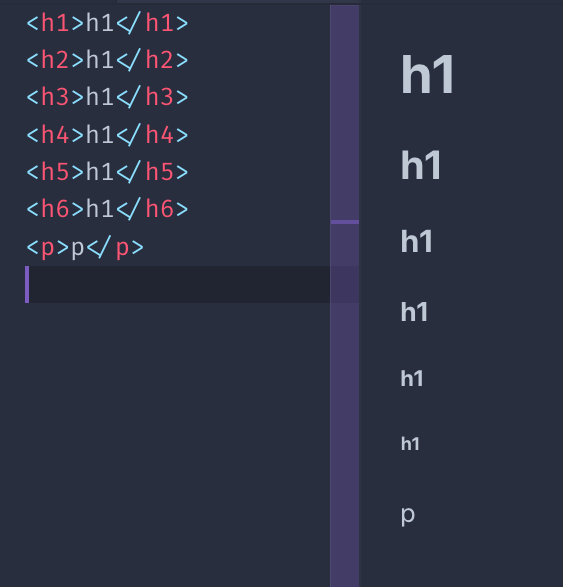

Todos os títulos son elementos de bloque. Non poden conter outros elementos, só texto.

### 5.5. A etiqueta `strong`

Esta etiqueta úsase para marcar o texto dentro dela como *forte* . Isto é moi importante, non é unha suxestión visual, senón unha suxestión semántica. Segundo o medio empregado, a súa interpretación variará.

Os navegadores por defecto fan que o texto desta etiqueta sexa **en negrita** .

### 5.6. A etiqueta `em`

Esta etiqueta úsase para marcar o texto dentro dela como *enfatizado* . Do mesmo xeito que con `strong`, non é unha suxestión visual senón unha suxestión semántica.

Por defecto, os navegadores fan que o texto estea en **cursiva** .

#### 5.6.1. `Quotes`- Citas

A etiqueta `blockquote` é útil para inserir citas no texto.

Os navegadores por defecto aplican unha marxe ao elemento `blockquote`. Chrome aplica unha marxe esquerda e dereita de 40px e unha marxe superior e inferior de 10px.

A etiqueta HTML  `q` úsase para as comiñas en liña.

### 5.7. Liña horizontal

Non se basea realmente no texto, pero a etiqueta `hr` úsase a miúdo dentro dunha páxina. Significa `horizontal rule`, e engade unha liña horizontal na páxina.

Útil para separar seccións na páxina.

### 5.8. Bloques de código

A etiqueta  `code` é especialmente útil para mostrar código, porque os navegadores danlle un tipo de letra monoespazado.

Normalmente iso é o único que fan os navegadores. Este é o CSS aplicado por Chrome:

```css
code {
  font-family: monospace;
}
```

Esta etiqueta adoita estar envolta nunha etiqueta `pre`, porque o elemento `code` ignora os espazos en branco e os saltos de liña. Como a etiqueta `p`.

Chrome dá este estilo predeterminado a `pre`:

```css
pre {
  display: block;
  font-family: monospace;
  white-space: pre;
  margin: 1em 0px;
}
```

que evita que o espazo en branco colapse e o converte nun elemento de bloque.

### 5.9. Listas

Temos 3 tipos de listas:

- listas non ordenadas
- listas ordenadas
- listas de definición

As listas non ordenadas créanse mediante a etiqueta `ul`. Cada elemento da lista créase coa etiqueta `li`:

```html
<ul>
  <li>First</li>
  <li>Second</li>
</ul>
```

As listas ordenadas son similares, só están feitas coa etiqueta `ol`:

```html
<ol>
  <li>First</li>
  <li>Second</li>
</ol>
```

A diferenza entre ambas é que as listas ordenadas teñen un número antes de cada elemento:

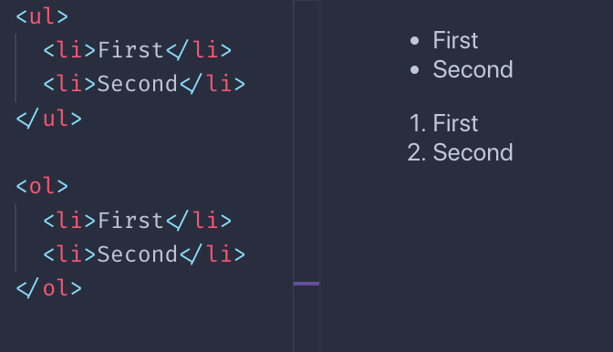

As listas de definicións son un pouco diferentes. Tes un termo e a súa definición:

```html
<dl>
  <dt>Flavio</dt>
  <dd>The name</dd>
  <dt>Copes</dt>
  <dd>The surname</dd>
</dl>
```

Así é como os navegadores adoitan representalos:

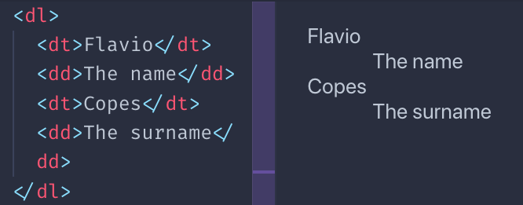

Debo dicir que poucas veces os ves en estado salvaxe, seguro que non tanto como `ul` e `ol`, pero ás veces poden ser útiles.

### 5.10. Outras etiquetas de texto

Hai unha serie de etiquetas con fins de presentación:

- a etiqueta `mark`
- a etiqueta `ins`
- a etiqueta `del`
- a etiqueta `sup`
- a etiqueta `sub`
- a etiqueta `small`
- a etiqueta `i`
- a etiqueta `b`

Este é un exemplo da representación visual dos mesmos que os navegadores aplican por defecto:

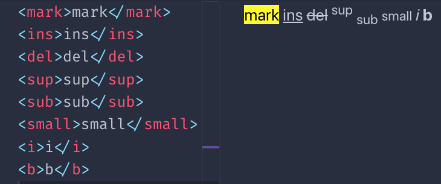

Podes preguntarche, `b` en que é diferente `strong`? E como `i`é diferente `em`?

A diferenza reside no significado semántico. Mentres que `b` e `i`son unha suxestión directa para que o navegador faga unha peza de texto en negra ou cursiva `strong` e `em`lle outorgue un significado especial ao texto, e correspóndelle ao navegador dar o estilo. O que pasa a ser exactamente o mesmo que `b` e `i`, por defecto. Aínda que podes cambialo usando CSS.

Existen outras etiquetas menos usadas relacionadas co texto. Acabo de mencionar as que vexo máis utilizadas.

## 6. Ligazóns

As ligazóns defínense mediante a etiqueta `a`. O destino da ligazón establécese mediante o seu atributo `href`.

**Exemplo**:

```html
<a href="https://ambosass.com">click here</a>
```

Entre a etiqueta de inicio e a de peche temos o texto da ligazón.

O exemplo anterior é un URL absoluto. As ligazóns tamén funcionan con URL relativos:

```html
<a href="/test">click here</a>
```

Neste caso, ao facer clic na ligazón o usuario móvese ao `/test`URL da orixe actual.

Teña coidado co `/`personaxe. Se se omite, en lugar de comezar desde a orixe, o navegador só engadirá a `test`cadea ao URL actual.

Exemplo, estou na páxina `https://ambosass.com/axios/` e teño estas ligazóns:

- `/test` unha vez que se fai clic lévame a`https://ambosass.com/test`
- `test` unha vez que se fai clic lévame a`https://ambosass.com/axios/test`

As etiquetas de ligazón poden incluír outras cousas no seu interior, non só texto. Por exemplo, imaxes:

```html
<a href="https://ambosass.com">
  
</a>
```

ou calquera outro elemento, agás outras etiquetas  `<a>`.

Se queres abrir a ligazón nunha nova pestana, podes usar o atributo `target`:

```html
<a href="https://ambosass.com" target="_blank">open in new tab</a>
```

## 7. Etiquetas de contedores e estrutura da páxina HTML

### 7.1. Etiquetas de contedores

HTML ofrece un conxunto de etiquetas de contedores. Esas etiquetas poden conter un conxunto non especificado doutras etiquetas.

Temos:

- `article`
- `section`
- `div`

e pode resultar confuso entender a diferenza entre eles.

A ver cando usar cada un deles.

#### 7.1.1.`article`

A etiqueta do artigo identifica unha *cousa* que pode ser independente doutras *cousas* dunha páxina.

Por exemplo, unha lista de publicacións do blog na páxina de inicio.

Ou unha lista de ligazóns.

```html
<div>
  <article>
    <h2>A blog post</h2>
    <a ...>Read more</a>
  </article>
  <article>
    <h2>Another blog post</h2>
    <a ...>Read more</a>
  </article>
</div>
```

Non nos limitamos a listas: un artigo pode ser o elemento principal dunha páxina.

```html
<article>
  <h2>A blog post</h2>
  <p>Here is the content...</p>
</article>
```

Dentro dunha etiqueta `article` deberíamos ter un título ( `h1`- `h6`) e

#### 7.1.2.`section`

Representa unha sección dun documento. Cada sección ten unha etiqueta de título ( `h1`- `h6`), despois o *corpo* da sección .

**Exemplo**:

```html
<section>
  <h2>A section of the page</h2>
  <p>...</p>
  
</section>
```

É útil dividir un artigo longo en diferentes **seccións** .

Non se debe usar como elemento xenérico do contedor. `div` está feito para iso.

#### 7.1.3.`div`

`div`é o elemento contenedor xenérico:

```html
<div>...</div>
```

Adoita engadir un `class`ou `id`un atributo a este elemento, para permitir que se dea estilo usando CSS.

Usamos `div` en calquera lugar onde necesitemos un recipiente pero as etiquetas existentes non son adecuadas.

### 7.2. Etiquetas relacionadas coa páxina

#### 7.2.1.`nav`

Esta etiqueta úsase para crear o marcado que define a navegación da páxina. A isto normalmente engadimos unha `ul`ou `ol`lista:

```html
<nav>
  <ol>
    <li><a href="/">Home</a></li>
    <li><a href="/blog">Blog</a></li>
  </ol>
</nav>
```

#### 7.2.2.`aside`

A etiqueta  `aside` úsase para engadir un contido relacionado co contido principal.

Un cadro onde engadir unha cita, por exemplo. Ou unha barra lateral.

**Exemplo**:

```html
<div>
  <p>some text..</p>
  <aside>
    <p>A quote..</p>
  </aside>
  <p>other text...</p>
</div>
```

Usar `aside`é un sinal de que as cousas que contén non forman parte do fluxo regular da sección na que vive.

#### 7.2.3.`header`

A etiqueta `header` representa unha parte da páxina que é a introdución. Por exemplo, podes conter unha ou máis etiquetas de título ( `h1`- `h6`), o lema para o artigo, unha imaxe.

```html
<article>
  <header>
    <h1>Article title</h1>
  </header>
  ...
</div>
```

#### 7.2.4.`main`

A etiqueta `main` representa a parte principal dunha páxina:

```html
<body>
  ....
  <main>
    <p>....</p>
  </main>
</body>
```

#### 7.2.5.`footer`

A etiqueta `footer` úsase para determinar o pé dun artigo ou o pé da páxina:

```html
<article>
 ....
  <footer>
    <p>Footer notes..</p>
  </footer>
</div>
```

## 8. Formularios

Os formularios son a forma en que podes interactuar cunha páxina ou unha aplicación creada con tecnoloxías web.

Tes un conxunto de controis, e cando envías o formulario, xa sexa cun clic  nun botón "enviar" ou mediante programación, o navegador enviará os  datos ao servidor.

De forma predeterminada, este envío de datos fai que a páxina se recargue  despois de enviar os datos, pero usando JavaScript podes alterar este  comportamento (non vai explicar como neste libro).

Créase un formulario usando a etiqueta `form`:

```html
<form>...</form>
```

Por defecto, os formularios envíanse mediante o método GET HTTP. O que ten os seus inconvenientes, e normalmente queres usar POST.

Podes configurar o formulario para que use POST cando se envíe usando o atributo `method`:

```html
<form method="POST">...</form>
```

O formulario envíase mediante GET ou POST ao mesmo URL onde reside.

Polo tanto, se o formulario está na `https://flaviocopes.com/contacts`páxina, premendo o botón "enviar" realizarase unha solicitude a ese mesmo URL.

O que pode provocar que non pase nada.

Necesitas algo do servidor para xestionar a solicitude e normalmente "escoitas"  os eventos de envío de formularios nun URL dedicado.

Podes especificar o URL mediante o `action`parámetro:

```html
<form action="/new-contact" method="POST">...</form>
```

Isto fará que o navegador envíe os datos do formulario mediante POST ao `/new-contact`URL da mesma orixe.

Se a orixe (protocolo + dominio + porto) é `https://ambosass.com`(o porto 80 é o predeterminado), isto significa que os datos do formulario enviaranse a `https://ambosass.com/new-contact`.

Falei de datos. Que datos?

Os datos son proporcionados polos usuarios a través do conxunto de controis que están dispoñibles na plataforma web:

- caixas de entrada (texto dunha soa liña)
- áreas de texto (texto multiliña)
- caixas de selección (escolla unha opción dun menú despregable)
- botóns de opción (escolla unha opción dunha lista sempre visible)
- caixas de verificación (escolla cero, unha ou máis opcións)
- cargas de arquivos
- e máis!

Imos presentar cada un deles na seguinte descrición xeral dos campos do formulario.

### 8.1. A etiqueta  `input`

O campo `input` é un dos elementos de formulario máis utilizados. Tamén é un elemento moi versátil e pode cambiar completamente o comportamento en función do atributo `type`.

O comportamento predeterminado é un control de entrada de texto dunha soa liña:

```html
<input />
```

Equivale a usar:

```html
<input type="text" />
```

Como ocorre con todos os outros campos que seguen, cómpre darlle un nome ao  campo para que o seu contido se envíe ao servidor cando se envíe o  formulario:

```html
<input type="text" name="username" />
```

O atributo `placeholder` úsase para que algún texto apareza, en gris claro, cando o campo está baleiro. Útil para engadir unha suxestión ao usuario sobre o que escribir:

```html
<input type="text" name="username" placeholder="Your username" />
```

#### 8.1.1. Correo electrónico

O uso `type="email"`validará un correo electrónico do lado do cliente (no navegador) para comprobar a corrección (corrección semántica, sen asegurar que o enderezo de correo electrónico exista) antes de enviar.

```html
<input type="email" name="email" placeholder="Your email" />
```

#### 8.1.2. Contrasinal

Ao usar `type="password"`cada clave introducida aparecerá como un asterisco (*) ou un punto, útil para campos que albergan un contrasinal.

```html
<input type="password" name="password" placeholder="Your password" />
```

#### 8.1.3. Números

Pode que un elemento de entrada acepte só números:

```html
<input type="number" name="age" placeholder="Your age" />
```

Podes especificar un valor mínimo e máximo aceptado:

```html
<input type="number" name="age" placeholder="Your age" min="18" max="110" />
```

O atributo `step` axuda a identificar os pasos entre diferentes valores. Por exemplo, isto acepta un valor entre 10 e 50, en pasos de 5:

```html
<input type="number" name="a-number" min="10" max="50" step="5" />
```

#### 8.1.4. Campo oculto

Os campos pódense ocultar ao usuario. Aínda se enviarán ao servidor cando se envíe o formulario:

```html
<input type="hidden" name="some-hidden-field" value="some-value" />
```

Este úsase habitualmente para almacenar valores como un token CSRF, usado  para a seguridade e a identificación do usuario, ou mesmo para detectar  robots que envían spam, utilizando técnicas especiais.

Tamén se pode usar só para identificar unha forma e a súa acción.

#### 8.1.5. Establecer un valor predeterminado

Todos eses campos aceptan un valor predefinido. Se o usuario non o cambia, este será o valor enviado ao servidor:

```html
<input type="number" name="age" value="18" />
```

Se estableces un marcador de posición, ese valor aparecerá se o usuario borra o valor do campo de entrada:

```html
<input type="number" name="age" placeholder="Your age" value="18" />
```

### 8.2. Enviar formulario

O `type="submit"`campo é un botón que, unha vez pulsado polo usuario, envía o formulario:

```html
<input type="submit" />
```

O atributo `value` establece o texto no botón, que se falta mostra o texto "Enviar":

```html
<input type="submit" value="Click me" />
```

### 8.3. Validación de formularios

Os navegadores proporcionan funcionalidades de validación do lado do cliente aos formularios.

Pode definir os campos segundo sexa necesario, asegurándose de que estean  cubertos e aplicar un formato específico para a entrada de cada campo.

Vexamos as dúas opcións.

#### 8.3.1. Establece os campos segundo sexa necesario

O atributo `required` axúdache coa validación. Se o campo non está definido, a validación do cliente falla e o navegador non envía o formulario:

```html
<input type="text" name="username" required />
```

#### 8.3.2. Aplicar un formato específico

Describín o campo `type="email"`anterior. Valida automaticamente o enderezo de correo electrónico segundo un formato establecido na especificación.

No campo `type="number"`, mencionei o `min` e `max`atribuír aos valores límite introducidos nun intervalo.

Pode aplicar un formato específico a calquera campo a través do atributo `pattern`, o que lle dá a posibilidade de establecer unha expresión regular para validar o valor.

Podes ver a Guía de expresións regulares de [flaviocopes.com/javascript-regular-expressions/](https://flaviocopes.com/javascript-regular-expressions/) .

**Exemplo**:

```html
<input type="text" name="username" pattern="[a-zA-Z]{8}" />
```

### 8.4. Outros campos

#### 8.4.1. Cargas de arquivos

Podes cargar arquivos desde o teu ordenador local e envialos ao servidor mediante un elemento `type="file"` de entrada:

```html
<input type="file" name="secret-documents" />
```

Podes anexar varios arquivos:

```html
<input type="file" name="secret-documents" multiple />
```

Podes especificar un ou máis tipos de arquivos permitidos mediante o atributo `accept`. Isto acepta imaxes:

```html
<input type="file" name="secret-documents" accept="image/*" />
```

Podes usar un tipo MIME específico, como `application/json`ou establecer unha extensión de arquivo como `.pdf`. Ou configura varias extensións de arquivo, como esta:

```html
<input type="file" name="secret-documents" accept=".jpg, .jpeg, .png" />
```

#### 8.4.2. Botóns

Os `type="button"`campos de entrada pódense usar para engadir botóns adicionais ao formulario, que non son botóns de envío:

```html
<input type="button" value="Click me" />
```

Utilízanse para facer algo mediante programación, usando JavaScript.

Hai un campo especial representado como un botón, cuxa acción especial é  borrar todo o formulario e devolver o estado dos campos ao inicial:

```html
<input type="reset" />
```

#### 8.4.3. Botóns de radio

Os botóns de opción úsanse para crear un conxunto de opcións, das cales se preme unha e todas as outras están desactivadas.

O nome provén das antigas radios de automóbiles que tiñan este tipo de interface.

Defines un conxunto de `type="radio"` entradas, todas co mesmo atributo `name` e atributo `value` diferente:

```html
<input type="radio" name="color" value="yellow" />
<input type="radio" name="color" value="red" />
<input type="radio" name="color" value="blue" />
```

Unha vez enviado o formulario, a `color`propiedade dos datos terá un único valor.

Sempre hai un elemento marcado. O primeiro elemento é o marcado por defecto.

Podes establecer o valor que está preseleccionado usando o atributo `checked`. Podes usalo só unha vez por grupo de entradas de radio.

#### 8.4.4. Casillas de verificación

Semellante ás caixas de radio, pero permiten escoller varios valores ou ningún.

Defines un conxunto de entradas `type="checkbox"`, todas co mesmo atributo `name` e atributo `value` diferente:

```html
<input type="checkbox" name="color" value="yellow" />
<input type="checkbox" name="color" value="red" />
<input type="checkbox" name="color" value="blue" />
```

Todas esas caixas de verificación estarán desmarcadas por defecto. Use o atributo `checked` para activalos na carga da páxina.

Dado que este campo de entrada permite varios valores, ao enviar o  formulario os valores enviaranse ao servidor como unha matriz.

#### 8.4.5. Data e hora

Temos algúns tipos de entrada para aceptar valores de data.

O `type="date"`campo de entrada permite ao usuario introducir unha data e, se é necesario, mostra un selector de datas:

```html
<input type="date" name="birthday" />
```

O `type="time"`campo de entrada permite ao usuario introducir unha hora e, se é necesario, mostra un selector de tempo:

```html
<input type="time" name="time-to-pickup" />
```

O `type="month"`campo de entrada permite ao usuario introducir un mes e un ano:

```html
<input type="month" name="choose-release-month" />
```

O `type="week"`campo de entrada permite ao usuario introducir unha semana e un ano:

```html
<input type="week" name="choose-week" />
```

Todos eses campos permiten limitar o intervalo e o paso entre cada valor. Recomendo consultar MDN para obter os pequenos detalles sobre o seu uso.

O `type="datetime-local"`campo permíteche escoller unha data e unha hora.

```html
<input type="datetime-local" name="date-and-time" />
```

Aquí tes unha páxina para probalos todos: [https://codepen.io/flaviocopes/pen/ZdWQPm](https://codepen.io/flaviocopes/pen/ZdWQPm)

#### 8.4.6. Selector de cores

Podes permitir que os usuarios elixan unha cor usando o elemento `type="color"`:

```html
<input type="color" name="car-color" />
```

Establece un valor predeterminado mediante o atributo `value`:

```html
<input type="color" name="car-color" value="#000000" />
```

O navegador encargarase de mostrar un selector de cores ao usuario.

#### 8.4.7. Rango

Este elemento de entrada mostra un elemento control deslizante. As persoas poden usalo para pasar dun valor inicial a un valor final:

```html
<input type="range" name="age" min="0" max="100" value="30" />
```

Podes proporcionar un paso opcional:

```html
<input type="range" name="age" min="0" max="100" value="30" step="10" />
```

#### 8.4.8. Teléfono

O `type="tel"`campo de entrada úsase para introducir un número de teléfono:

```html
<input type="tel" name="telephone-number" />
```

O principal punto de venda para usar `tel`over `text` está no móbil, onde o dispositivo pode optar por mostrar un teclado numérico.

Especifique un atributo `pattern` para unha validación adicional:

```html
<input type="tel" pattern="[0-9]{3}-[0-9]{8}" name="telephone-number" />
```

#### 8.4.9. URL

O `type="url"`campo úsase para introducir un URL.

```html
<input type="url" name="website" />
```

Podes validalo usando o atributo `pattern`:

```html
<input type="url" name="website" pattern="https://.*" />
```

### 8.5. A etiqueta `textarea`

O elemento `textarea` permite aos usuarios introducir texto de varias liñas. En comparación con `input`, require unha etiqueta de finalización:

```html
<textarea></textarea>
```

Podes establecer as dimensións usando CSS, pero tamén usando os atributos `rows` e :`cols`

```html
<textarea rows="20" cols="10"></textarea>
```

Como ocorre coas outras etiquetas do formulario, o atributo `name` determina o nome nos datos enviados ao servidor:

```html
<textarea name="article"></textarea>
```

### 8.6. A etiqueta `select`

Esta etiqueta úsase para crear un menú despregable.

O usuario pode escoller unha das opcións dispoñibles.

Cada opción créase mediante a etiqueta `option`. Engades un nome á selección e un valor a cada opción:

```html
<select name="color">
  <option value="red">Red</option>
  <option value="yellow">Yellow</option>
</select>
```

Podes configurar unha opción desactivada:

```html
<select name="color">
  <option value="red" disabled>Red</option>
  <option value="yellow">Yellow</option>
</select>
```

Podes ter unha opción baleira:

```html
<select name="color">
  <option value="">None</option>
  <option value="red">Red</option>
  <option value="yellow">Yellow</option>
</select>
```

As opcións pódense agrupar mediante a etiqueta `optgroup`. Cada grupo de opcións ten un atributo `label`:

```html
<select name="color">
  <optgroup label="Primary">
    <option value="red">Red</option>
    <option value="yellow">Yellow</option>
    <option value="blue">Blue</option>
  </optgroup>
  <optgroup label="Others">
    <option value="green">Green</option>
    <option value="pink">Pink</option>
  </optgroup>
</select>
```

## 9. Táboas

Nos primeiros tempos das táboas web eran unha parte moi importante dos deseños de construción.

Máis tarde foron substituídos por CSS e as súas capacidades de deseño, e  hoxe temos poderosas ferramentas como CSS Flexbox e CSS Grid para crear  deseños. Agora as táboas úsanse só para, adiviña que, construír táboas!

#### 9.0.1. A etiqueta `table`

Defines unha táboa usando a etiqueta `table`:

```html
<table></table>
```

Dentro da táboa definiremos os datos. Razonamos en termos de filas, o que significa que engadimos filas nunha táboa (non columnas). Definiremos columnas dentro dunha fila.

#### 9.0.2. Filas

Engádese unha fila usando a etiqueta `tr`, e iso é o único que podemos engadir a un elemento `table`:

```html
<table>
  <tr></tr>
  <tr></tr>
  <tr></tr>
</table>
```

Esta é unha táboa con 3 filas.

A primeira fila *pode* ocupar o papel da cabeceira.

#### 9.0.3. Cabeceiras das columnas

A cabeceira da táboa contén o nome dunha columna, normalmente en letra negra.

Pense nun documento de Excel / Google Sheets. A `A-B-C-D...`cabeceira superior.

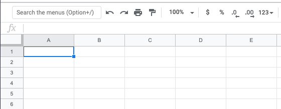

Definimos a cabeceira usando a etiqueta `th`:

```html
<table>
  <tr>
    <th>Column 1</th>
    <th>Column 2</th>
    <th>Column 3</th>
  </tr>
  <tr></tr>
  <tr></tr>
</table>
```

#### 9.0.4. O contido da táboa

O contido da táboa defínese mediante etiquetas `td`, dentro dos outros elementos `tr`:

```html
<table>
  <tr>
    <th>Column 1</th>
    <th>Column 2</th>
    <th>Column 3</th>
  </tr>
  <tr>
    <td>Row 1 Column 1</td>
    <td>Row 1 Column 2</td>
    <td>Row 1 Column 3</td>
  </tr>
  <tr>
    <td>Row 2 Column 1</td>
    <td>Row 2 Column 2</td>
    <td>Row 2 Column 3</td>
  </tr>
</table>
```

Así é como os navegadores o representan, se non engades ningún estilo CSS:

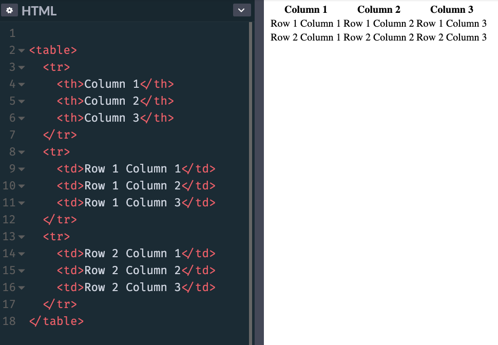

Engadindo este CSS:

```css
th,
td {
  padding: 10px;
  border: 1px solid #333;
}
```

fai que a táboa pareza máis a unha táboa adecuada:

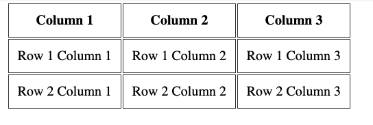

#### 9.0.5. Abarca columnas e filas

Unha fila pode decidir abarcar máis de 2 ou máis columnas, utilizando o atributo `colspan`:

```html
<table>
  <tr>
    <th>Column 1</th>
    <th>Column 2</th>
    <th>Column 3</th>
  </tr>
  <tr>
    <td colspan="2">Row 1 Columns 1-2</td>
    <td>Row 1 Column 3</td>
  </tr>
  <tr>
    <td colspan="3">Row 2 Columns 1-3</td>
  </tr>
</table>
```

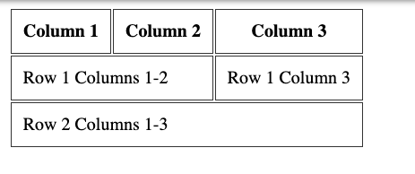

Ou pode abarcar máis de 2 ou máis filas, usando o atributo `rowspan`:

```html
<table>
  <tr>
    <th>Column 1</th>
    <th>Column 2</th>
    <th>Column 3</th>
  </tr>
  <tr>
    <td colspan="2" rowspan="2">Rows 1-2 Columns 1-2</td>
    <td>Row 1 Column 3</td>
  </tr>
  <tr>
    <td>Row 2 Column 3</td>
  </tr>
</table>
```

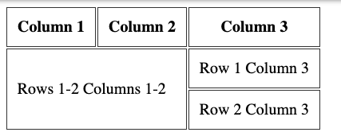

#### 9.0.6. Títulos de fila

Antes expliquei como pode ter títulos de columna, usando a etiqueta `th` dentro da primeira etiqueta `tr` da táboa.

Podes engadir unha etiqueta `th` como primeiro elemento dentro dun `tr` que non é o primeiro `tr` da táboa, para ter títulos de fila:

```html
<table>
  <tr>
    <th></th>
    <th>Column 2</th>
    <th>Column 3</th>
  </tr>
  <tr>
    <th>Row 1</th>
    <td>Col 2</td>
    <td>Col 3</td>
  </tr>
  <tr>
    <th>Row 2</th>
    <td>Col 2</td>
    <td>Col 3</td>
  </tr>
</table>
```

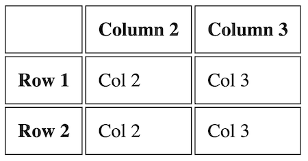

#### 9.0.7. Máis etiquetas para organizar a mesa

Podes engadir 3 etiquetas máis nunha táboa para organizala máis.

Isto é mellor cando se usan mesas grandes. E tamén para definir correctamente un encabezado e un pé de páxina.

Esas etiquetas son

- `thead`
- `tbody`
- `tfoot`

Envolven as etiquetas `tr` para definir claramente as diferentes seccións da táboa. Aquí tes un exemplo:

```html
<table>
  <thead>
    <tr>
      <th></th>
      <th>Column 2</th>
      <th>Column 3</th>
    </tr>
  </thead>
  <tbody>
    <tr>
      <th>Row 1</th>
      <td>Col 2</td>
      <td>Col 3</td>
    </tr>
    <tr>
      <th>Row 2</th>
      <td>Col 2</td>
      <td>Col 3</td>
    </tr>
  </tbody>
  <tfoot>
    <tr>
      <td></td>
      <td>Footer of Col 1</td>
      <td>Footer of Col 2</td>
    </tr>
  </tfoot>
</table>
```

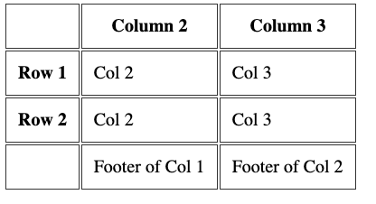

### 9.1. Lenda da táboa

Unha táboa debe ter unha etiqueta `caption` que describa o seu contido. Esa etiqueta debe poñerse inmediatamente despois da etiqueta `table` de apertura:

```html
<table>
  <caption>
    Dogs age
  </caption>
  <tr>
    <th>Dog</th>
    <th>Age</th>
  </tr>
  <tr>
    <td>Roger</td>
    <td>7</td>
  </tr>
</table>
```

## 10. Etiquetas multimedia: `audio` e `video`

Nesta sección quero mostrarche as etiquetas `audio` e  `video`.

### 10.1. A etiqueta `audio`

Esta etiqueta permíteche inserir contido de audio nas túas páxinas HTML.

Este elemento pode transmitir audio, quizais usando un micrófono a través de `getUserMedia()`, ou pode reproducir unha fonte de audio á que faga referencia usando o atributo `src`:

```html
<audio src="file.mp3"></audio>
```

Por defecto o navegador non mostra ningún control para este elemento. O que significa que o audio só se reproducirá se se define como  reprodución automática (máis sobre isto máis adiante) e o usuario non  pode ver como detelo nin controlar o volume nin moverse pola pista.

Para mostrar os controis integrados, pode engadir o atributo `controls`:

```html
<audio src="file.mp3" controls></audio>
```

Os controis poden ter un aspecto personalizado.

Podes especificar o tipo MIME do arquivo de audio usando o atributo `type`. Se non se configura, o navegador tentará determinalo automaticamente:

```html
<audio src="file.mp3" controls type="audio/mpeg"></audio>
```

Un arquivo de audio por defecto non se reproduce automaticamente. Engade o atributo `autoplay` para reproducir o audio automaticamente:

```html
<audio src="file.mp3" controls autoplay></audio>
```

> Nota: os navegadores móbiles non permiten a reprodución automática

O atributo `loop` reinicia a reprodución de audio ás 0:00 se se estableceu; en caso contrario, se non está presente, o audio detense ao final do arquivo:

```html
<audio src="file.mp3" controls autoplay loop></audio>
```

Tamén pode reproducir un arquivo de audio silenciado usando o atributo `muted` (non estou moi seguro de cal é a utilidade disto):

```html
<audio src="file.mp3" controls autoplay loop muted></audio>
```

Usando JavaScript pode escoitar varios eventos que ocorren nun elemento `audio`, os máis básicos dos cales son:

- `play`cando o arquivo comeza a reproducirse
- `pause`cando se puxo en pausa a reprodución de audio
- `playing`cando o audio se retoma a partir dunha pausa
- `ended`cando se chegou ao final do arquivo de audio

### 10.2. A etiqueta `video`

Esta etiqueta permíteche inserir contido de vídeo nas túas páxinas HTML.

Este elemento pode transmitir vídeo mediante unha cámara web a través `getUserMedia()`de **WebRTC** ou pode reproducir unha fonte de vídeo á que faga referencia mediante o atributo `src`:

```html
<video src="file.mp4"></video>
```

Por defecto, o navegador non mostra ningún control para este elemento, só o vídeo.

O que significa que o vídeo só se reproducirá se está configurado para a  reprodución automática (máis sobre isto máis adiante) e o usuario non  pode ver como detelo, deterlo, controlar o volume ou saltar a unha  posición específica do vídeo.

Para mostrar os controis integrados, pode engadir o atributo `controls`:

```html
<video src="file.mp4" controls></video>
```

Os controis poden ter un aspecto personalizado.

Podes especificar o tipo MIME do arquivo de vídeo mediante o atributo `type`. Se non se configura, o navegador tentará determinalo automaticamente:

```html
<video src="file.mp4" controls type="video/mp4"></video>
```

Un arquivo de vídeo por defecto non se reproduce automaticamente. Engade o atributo `autoplay` para reproducir o vídeo automaticamente:

```html
<video src="file.mp4" controls autoplay></video>
```

Algúns navegadores tamén requiren o atributo `muted` para a reprodución automática. O vídeo só se reproduce automaticamente se está silenciado:

```html
<audio src="file.mp3" controls autoplay muted></audio>
```

O atributo `loop` reinicia o vídeo que se reproduce ás 0:00 se se estableceu; en caso contrario, se non está presente, o vídeo detense ao final do arquivo:

```html
<video src="file.mp4" controls autoplay loop></video>
```

Podes configurar unha imaxe para que sexa a imaxe do póster:

```html
<video src="file.mp4" poster="picture.png"></video>
```

Se non está presente, o navegador mostrará o primeiro fotograma do vídeo en canto estea dispoñible.

Podes establecer os atributos `width` e `height`para establecer o espazo que ocupará o elemento para que o navegador poida  ter en conta e non cambie o deseño cando finalmente se cargue. Toma un valor numérico, expresado en píxeles.

Usando JavaScript pode escoitar varios eventos que ocorren nun elemento `video`, os máis básicos dos cales son:

- `play`cando o arquivo comeza a reproducirse
- `pause`cando se puxo en pausa o vídeo
- `playing`cando se retoma o vídeo desde unha pausa
- `ended`cando se chegou ao final do arquivo de vídeo

## 11. iframes

A etiqueta `iframe` permítenos incorporar contido procedente doutras orixes (outros sitios) na nosa páxina web.

Tecnicamente, un iframe crea un novo contexto de navegación anidado. Isto significa que calquera cousa no iframe non interfire coa páxina principal e viceversa. JavaScript e CSS non "filtran" a/desde iframes.

Moitos sitios usan iframes para realizar varias cousas. Quizais esteas familiarizado con Codepen, Glitch ou outros sitios que che  permitan codificar nunha parte da páxina e vexas o resultado nunha  caixa. Iso é un iframe.

Crea un deste xeito:

```html
<iframe src="page.html"></iframe>
```

Tamén podes cargar un URL absoluto:

```html
<iframe src="https://site.com/page.html"></iframe>
```

Podes establecer un conxunto de parámetros de ancho e alto (ou configuralos  mediante CSS), se non, o iframe usará os valores predeterminados, unha  caixa de 300x150 píxeles:

```html
<iframe src="page.html" width="800" height="400"></iframe>
```

### 11.1. Srcdoc

O atributo `srcdoc` permítelle especificar algún HTML en liña para mostrar. É unha alternativa a `src`, pero recente e non admitida en Edge 18 e anteriores, e en IE:

```html
<iframe srcdoc="<p>My dog is a good dog</p>"></iframe>
```

### 11.2. Sandbox

O atributo `sandbox` permítenos limitar as operacións permitidas nos iframes.

Se o omitimos, todo está permitido:

```html
<iframe src="page.html"></iframe>
```

Se o configuramos en "", non se permite nada:

```html
<iframe src="page.html" sandbox=""></iframe>
```

Podemos seleccionar o que queremos permitir engadindo opcións no atributo `sandbox`. Podes permitir varios engadindo un espazo no medio. Aquí tes unha lista incompleta das opcións que podes usar:

- `allow-forms`: permite enviar formularios
- `allow-modals`permite abrir fiestras modais, incluíndo chamadas `alert()` en JavaScript
- `allow-orientation-lock`permite bloquear a orientación da pantalla
- `allow-popups`permitir ventás emerxentes, usar `window.open()` e `target="_blank"`ligazóns
- `allow-same-origin`tratar o recurso que se está cargando como a mesma orixe
- `allow-scripts`permite que o iframe cargado execute scripts (pero non cree ventás emerxentes).
- `allow-top-navigation`dá acceso ao iframe ao contexto de navegación de nivel superior

### 11.3. Permitir

Actualmente experimental e só é compatible con navegadores baseados en Chromium,  este é o futuro do uso compartido de recursos entre a xanela principal e o iframe.

É semellante ao atributo `sandbox`, pero permítenos permitir funcións específicas, incluíndo:

- `accelerometer`dá acceso á interface do acelerómetro da API de sensores
- `ambient-light-sensor`dá acceso á interface AmbientLightSensor da API de sensores
- `autoplay`permite reproducir automaticamente arquivos de audio e vídeo
- `camera`permite acceder á cámara desde a API getUserMedia
- `display-capture`permite acceder ao contido da pantalla mediante a API getDisplayMedia
- `fullscreen`permite acceder ao modo de pantalla completa
- `geolocation`permite acceder á API de xeolocalización
- `gyroscope`dá acceso á interface de xiroscopio da API de sensores
- `magnetometer`dá acceso á interface do magnetómetro da API de sensores
- `microphone`dá acceso ao micrófono do dispositivo mediante a API getUserMedia
- `midi`permite o acceso á API Web MIDI
- `payment`dá acceso á API de solicitude de pago
- `speaker`permite o acceso para reproducir audio a través dos altofalantes do dispositivo
- `usb`dá acceso á API WebUSB.
- `vibrate`dá acceso á API de vibración
- `vr`dá acceso á API WebVR

### 11.4. Referente

Ao cargar un iframe, o navegador envíalle información importante sobre quen o está cargando na `Referer`cabeceira (nótese no single `r`, un erro de tipografía co que debemos convivir).

> A falta de ortografía do referente orixinouse na proposta orixinal do  científico informático Phillip Hallam-Baker para incorporar o campo á  especificación HTTP. A falta de ortografía foi gravada no momento da súa incorporación ao documento de normas de solicitude de comentarios RFC 1945

O atributo `referrerpolicy` permítenos configurar o referente para enviar ao iframe ao cargalo. O referente é unha cabeceira HTTP que fai saber á páxina quen a está cargando. Estes son os valores permitidos:

- `no-referrer-when-downgrade`é o predeterminado e non envía o referente cando a páxina actual se carga a través de HTTPS e o iframe se carga no protocolo HTTP
- `no-referrer`non envía a cabeceira de referencia
- `origin`o referente é enviado e só contén a orixe (porto, protocolo, dominio), non a orixe + ruta que é o predeterminado
- `origin-when-cross-origin`ao cargar dende a mesma orixe (porto, protocolo, dominio) no iframe, o referente envíase na súa forma completa (orixe + ruta). En caso contrario, só se envía a orixe
- `same-origin`o referente só se envía cando se carga dende a mesma orixe (porto, protocolo, dominio) no iframe
- `strict-origin` envía a orixe como referencia se a páxina actual se carga a través de HTTPS e o iframe tamén se carga no protocolo HTTPS. Non envía nada se o iframe se carga a través de HTTP
- `strict-origin-when-cross-origin` envía a orixe + o camiño como referencia cando se traballa na mesma orixe. Envía a orixe como referencia se a páxina actual se carga a través de HTTPS e o iframe tamén se carga no protocolo HTTPS. Non envía nada se o iframe se carga a través de HTTP
- `unsafe-url`: envía a orixe + o camiño como referencia mesmo cando se cargan recursos desde HTTP e a páxina actual se carga a través de HTTPS

## 12. Imaxes

As imaxes pódense mostrar usando a etiqueta `img`.

Esta etiqueta acepta un atributo `src`, que usamos para definir a fonte da imaxe:

```html

```

Podemos utilizar un amplo conxunto de imaxes. Os máis comúns son PNG, JPEG, GIF, SVG e, máis recentemente, WebP.

O estándar HTML require `alt`que estea presente un atributo para describir a imaxe. Isto é usado polos lectores de pantalla e tamén polos robots dos buscadores:

```html

```

Podes establecer os atributos `width` e `height`para establecer o espazo que ocupará o elemento, para que o navegador poida  ter en conta e non cambie o deseño cando estea completamente cargado. Toma un valor numérico, expresado en píxeles.

```html

```

### 12.1. A etiqueta  `figure`

A etiqueta `figure` úsase a miúdo xunto coa etiqueta `img`.

`figure` é unha etiqueta semántica que se usa a miúdo cando se quere mostrar unha imaxe cunha lenda. Usalo así:

```html
<figure>
  
  <figcaption>A nice dog</figcaption>
</figure>
```

A etiqueta `figcaption` envolve o texto do subtítulo.

### 12.2. Usando imaxes sensibles`srcset`

O atributo `srcset` permítelle configurar imaxes sensibles que o navegador pode usar  dependendo da densidade de píxeles ou do ancho da xanela, segundo as  súas preferencias. Deste  xeito, só pode descargar os recursos necesarios para renderizar a  páxina, sen descargar unha imaxe máis grande se está nun dispositivo  móbil, por exemplo.

Aquí tes un exemplo, onde damos 4 imaxes adicionais para 4 tamaños de pantalla diferentes:

```html

```

No `srcset`usamos a `w`medida para indicar o ancho da xanela.

Xa que o facemos, tamén necesitamos usar o atributo `sizes`:

```html

```

Neste exemplo, a `(max-width: 500px) 100vw, (max-width: 900px) 50vw, 800px`cadea do atributo `sizes` describe o tamaño da imaxe en relación coa ventana gráfica, con varias condicións separadas por coma.

A condición do medio `max-width: 500px` establece o tamaño da imaxe en correlación co ancho da ventana gráfica. En resumo, se o tamaño da xanela é < 500px, renderiza a imaxe ao 100% do tamaño da xanela.

Se o tamaño da xanela é maior pero < `900px`, renderiza a imaxe ao 50 % do tamaño da xanela.

E aínda que sexa máis grande, renderiza a imaxe en 800px.

A `vw`unidade de medida pode ser nova para ti e, en resumo, podemos dicir que 1 `vw`é o 1% do ancho da xanela, así como `100vw`o 100% do ancho da xanela.

Un sitio web útil para xerar `srcset`imaxes cada vez máis pequenas é [https://responsivebreakpoints.com/](https://responsivebreakpoints.com/) .

### 12.3. A etiqueta `picture`

HTML tamén nos dá a etiqueta `picture`, que fai un traballo moi similar a `srcset`, e as diferenzas son moi sutís.

Usas `picture`cando en lugar de servir só unha versión máis pequena dun arquivo, queres cambialo por completo. Ou ofrece un formato de imaxe diferente.

O mellor caso de uso que atopei é ao servir unha imaxe WebP, que é un formato que aínda non é moi compatible. Na etiqueta `picture` especificas unha lista de imaxes, e utilizaranse en orde, polo que no  seguinte exemplo, os navegadores que admiten WebP usarán a primeira  imaxe e, se non, volverán a JPG:

```html
<picture>
  <source type="image/webp" srcset="image.webp" />
  
</picture>
```

> A etiqueta `source` define un (ou máis) formatos para as imaxes. A etiqueta `img` é a alternativa no caso de que o navegador sexa moi antigo e non admita a etiqueta `picture`.

Na etiqueta `source` que hai dentro `picture` podes engadir un atributo `media` para establecer consultas multimedia.

O exemplo que segue funciona como o anterior con `srcset`:

```html
<picture>
  <source media="(min-width: 500w)" srcset="dog-500.png" sizes="100vw" />
  <source media="(min-width: 800w)" srcset="dog-800.png" sizes="100vw" />
  <source media="(min-width: 1000w)" srcset="dog-1000.png" sizes="800px" />
  <source media="(min-width: 1400w)" srcset="dog-1400.png" sizes="800px" />
  
</picture>
```

Pero ese non é o seu caso de uso, porque como podes ver é moito máis detallado.

A etiqueta `picture` é recente pero agora é [compatible](https://caniuse.com/%23search%3Dpicture) con todos os navegadores principais, excepto Opera Mini e IE (todas as versións).

## 13. Accesibilidade

É importante que deseñamos o noso HTML tendo en conta a accesibilidade.

Ter HTML accesible significa que as persoas con discapacidade poden usar a Web. Hai usuarios totalmente cegos ou con discapacidade visual, persoas con  problemas de perda auditiva e multitude doutras discapacidades  diferentes.

Desafortunadamente, este tema non cobra a importancia que precisa, e non parece tan xenial coma outros.

E se unha persoa non pode *ver* a túa páxina, pero aínda así quere consumir o seu contido? En primeiro lugar, como o fan? Non poden usar o rato, usan algo chamado **lector de pantalla** . Non tes que imaxinar iso. Podes probar un agora: Google ofrece a [extensión gratuíta de ChromeVox Chrome](https://chrome.google.com/webstore/detail/chromevox/kgejglhpjiefppelpmljglcjbhoiplfn/) . A accesibilidade tamén debe encargarse de que as ferramentas poidan seleccionar facilmente elementos ou navegar polas páxinas.

As páxinas web e as aplicacións web non sempre se crean coa accesibilidade como un dos seus primeiros obxectivos, e quizais a versión 1 non sexa  accesible, pero é posible facer accesible unha páxina web despois do  feito. Antes é mellor, pero nunca é tarde.

É importante e no meu país, os sitios web creados polo goberno ou outras organizacións públicas deben ser accesibles.

Que significa isto para facer accesible un HTML? Permíteme ilustrar as principais cousas nas que debes pensar.

> Nota: hai que ter en conta varias outras cousas, que poden estar no tema CSS, como cores, contraste e fontes. Ou [como facer que as imaxes SVG sexan accesibles](https://css-tricks.com/accessible-svgs/) . Aquí non falo deles.

### 13.1. Usa HTML semántico

O HTML semántico é moi importante e é unha das principais cousas que debes coidar. Permítanme ilustrar algúns escenarios comúns.

É importante utilizar a estrutura correcta para as etiquetas de título. O máis importante é `h1`, e usa números máis altos para os menos importantes, pero todos os  títulos do mesmo nivel deberían ter o mesmo significado (pénsao como  unha estrutura en árbore)

```css
h1
h2
h3
h2
h2
h3
h4
```

Use `strong` e `em`no canto de `b` e`i` . Visualmente teñen o mesmo aspecto, pero os 2 primeiros teñen máis significado asociado a eles. `b` e `i`son elementos máis visuais.

As listas son importantes. Un lector de pantalla pode detectar unha lista e proporcionar unha visión  xeral e, a continuación, permitir que o usuario elixa entrar na lista ou non.

Unha táboa debe ter unha etiqueta `caption` que describa o seu contido:

```html
<table>
  <caption>
    Dogs age
  </caption>
  <tr>
    <th>Dog</th>
    <th>Age</th>
  </tr>
  <tr>
    <td>Roger</td>
    <td>7</td>
  </tr>
</table>
```

### 13.2. Use atributos `alt` para imaxes

Todas as imaxes deben ter unha etiqueta `alt` que describa o contido da imaxe. Non é só unha boa práctica, é requirida polo estándar HTML e o teu HTML sen el non está validado.

```html

```

Tamén é bo para os buscadores, se iso é un incentivo para que o engadas.

### 13.3. Usa o atributo `role`

O`role` atributo permíteche asignar roles específicos aos distintos elementos da túa páxina.

Podes asignar moitos roles diferentes: complementario, lista, elemento de  lista, principal, navegación, rexión, pestana, alerta, aplicación,  artigo, banner, botón, cela, caixa de verificación, información de  contido, diálogo, documento, fonte, figura, formulario, cuadrícula,  celda de cuadrícula, encabezado, img, caixa de lista, fila, grupo de  filas, busca, interruptor, táboa, panel de pestanas, caixa de texto,  temporizador.

É moito e para a referencia completa de cada un deles déixovos [esta ligazón MDN](https://developer.mozilla.org/en-US/docs/Web/Accessibility/ARIA/Roles) . Pero non precisa asignar un rol a cada elemento da páxina. Os lectores de pantalla poden inferir a partir da etiqueta HTML na maioría dos casos. Por exemplo, non precisa engadir unha etiqueta de rol ás etiquetas semánticas como `nav`, `button`, `form`.

Poñamos o exemplo da etiqueta `nav`. Podes usalo para definir a navegación da páxina deste xeito:

```html
<nav>
  <ul>
    <li><a href="/">Home</a></li>
    <li><a href="/blog">Blog</a></li>
  </ul>
</nav>
```

Se estiveses *obrigado* a usar unha `div` etiqueta en lugar de `nav`, usarías o `navigation`rol:

```html
<div role="navigation">
  <ul>
    <li><a href="/">Home</a></li>
    <li><a href="/blog">Blog</a></li>
  </ul>
</div>
```

Entón, aquí tes un exemplo práctico: `role`úsase para asignar un valor significativo cando a etiqueta non transmite xa o significado.

### 13.4. Usa o atributo `tabindex`

O atributo `tabindex` permítelle cambiar a orde de como se preme a tecla Tabulador selecciona os elementos "seleccionables". De forma predeterminada, só se poden "seleccionar" as ligazóns e os  elementos do formulario mediante a navegación mediante a tecla Tabulador (e non é necesario configuralos `tabindex`).

Engadindo `tabindex="0"` fai seleccionable un elemento:

```html
<div tabindex="0">...</div>
```

Usando`tabindex="-1"` elimina un elemento desta navegación baseada en pestanas e pode ser bastante útil.

### 13.5. Usa os atributos `aria`

ARIA é un acrónimo que significa Aplicacións de Internet enriquecidas  accesibles e define a semántica que se pode aplicar aos elementos.

#### 13.5.1.`aria-label`

Este atributo úsase para engadir unha cadea para describir un elemento.

**Exemplo**:

```html
<p aria-label="The description of the product">...</p>
```

Utilizo este atributo na barra lateral do meu blog, onde teño unha caixa de  entrada para a busca sen unha etiqueta explícita, xa que ten un atributo de marcador de posición.

#### 13.5.2.`aria-labelledby`

Este atributo establece unha correlación entre o elemento actual e o que o etiqueta.

Se sabes como `input` se pode asociar un elemento a un elemento `label`, é semellante.

Pasamos o identificador do elemento que describe o elemento actual.

**Exemplo**:

```html
<h3 id="description">The description of the product</h3>

<p aria-labelledby="description">...</p>
```

#### 13.5.3.`aria-describedby`

Este atributo permítenos asociar un elemento con outro elemento que serve de descrición.

**Exemplo**:

```html
<button aria-describedby="payNowDescription">Pay now</button>

<div id="payNowDescription">
  Clicking the button will send you to our Stripe form!
</div>
```

#### 13.5.4. Usa aria-hidden para ocultar contido

Gústame un deseño minimalista nos meus sitios. O meu blog, por exemplo, é principalmente contido, con algunhas ligazóns na barra lateral. Pero algunhas cousas da barra lateral son só elementos visuais que non se  suman á experiencia dunha persoa que non pode ver a páxina. Como a imaxe do meu logotipo ou o selector de temas escuros/brillantes.

Engadir o atributo `aria-hidden="true"` indicará aos lectores de pantalla que ignoren ese elemento.
....

\* *in progress*
