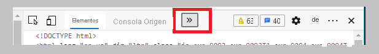
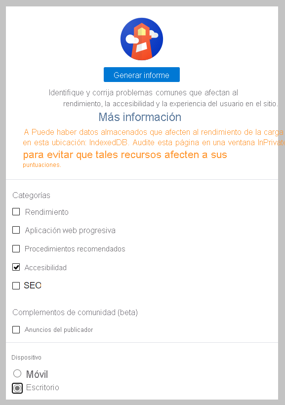
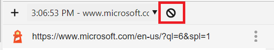
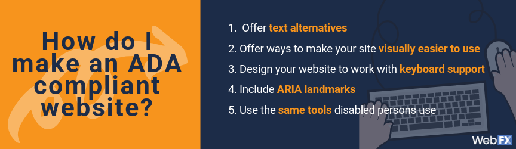

###### Obxectivos

- *Dereito a accesibilidade*
- *Importancia da accesibilidade*
- *Ferramentas que poden axudarche a garantir que os teus recursos web sexan accesibles*
- *Como desenvolver código tendo en conta a accesibilidade.*
- Tools that users use to browse through webpages.
- Tools that developers use to ensure accessibility.
- Skills for ensuring that your pages are accessible.


# Creación de páxinas web accesibles

[](https://github.com/microsoft/Web-Dev-For-Beginners/blob/main/sketchnotes/webdev101-a11y.png)

> Sketchnote de [Tomomi Imura](https://twitter.com/girlie_mac)

## O papel do desenvolvedor

Os desenvolvedores xogan un papel fundamental para facer accesible un sitio web.

Desde a perspectiva dun desenvolvedor, o obxectivo é codificar un sitio web ou unha aplicación web que, como mínimo, cumpra os estándares AA 2.0 das directrices de accesibilidade ao contido web (WCAG). Para o que o teu sitio ou aplicación web debe seguir os principios reitores de POUR da tecnoloxía accesible:

- **Perceptible**: os usuarios deben poder atopar cada elemento usando un dos seus sentidos.
- **Operable**: os usuarios deben poder interactuar co sitio e todas as súas funcións.
- **Comprensible**: o contido e a funcionalidade deben ser fáciles de seguir.
- **Robusto**: os sitios deben funcionar con varias tecnoloxías e considerar tecnoloxías futuras.

Obtén máis información sobre os [principios reitores de POUR (WebAIM)](http://webaim.org/articles/pour/) .

> O poder da Rede está na súa universalidade.
> O acceso de todos independentemente da discapacidade é un aspecto esencial.
>
> Tim Berners-Lee, director do W3C e inventor da World Wide Web

Esta cita destaca perfectamente a importancia de crear sitios web accesibles. Unha aplicación á que non todos poden acceder é por definición excluínte. **Como desenvolvedores web, debemos ter sempre presente a accesibilidade**. Ao ter este interese desde o principio, estarás ben encamiñado para asegurarte de que todos poidan acceder ás páxinas que crees. 

## Ferramentas a utilizar

### Lectores de pantalla

Unha das ferramentas de accesibilidade máis coñecidas son os lectores de pantalla.

Os [lectores de pantalla](https://en.wikipedia.org/wiki/Screen_reader) son clientes de uso habitual para persoas con discapacidade visual. Como dedicamos tempo a garantir que un navegador transmite correctamente a información que desexamos compartir, tamén debemos asegurarnos de que un lector de pantalla faga o mesmo.

Na forma máis básica, un lector de pantalla lerá unha páxina de arriba abaixo de forma audible. Se a túa páxina é todo texto, o lector transmitirá a información dun xeito similar a un navegador. Por suposto, as páxinas web raramente son puramente texto; conterán ligazóns, gráficos, cor e outros compoñentes visuais. Hai que ter coidado para asegurarse de que esta información sexa lida correctamente por un lector de pantalla.

Todo desenvolvedor web debería familiarizarse cun lector de pantalla. Como se dixo anteriormente, é o cliente que potencialmente utilizarán moitos dos teus usuarios. Do mesmo xeito que deberás familiarizarte co funcionamento dun navegador, deberías aprender como funciona un lector de pantalla. Afortunadamente, os lectores de pantalla están integrados na maioría dos sistemas operativos.

Algúns navegadores tamén teñen ferramentas e extensións integradas que poden ler o texto en voz alta ou incluso proporcionar algunhas funcións básicas de navegación, como [as ferramentas do navegador Edge centradas na accesibilidade](https://support.microsoft.com/help/4000734/microsoft-edge-accessibility-features) . Estas tamén son ferramentas de accesibilidade importantes, pero funcionan de forma moi diferente aos lectores de pantalla e non se deben confundir coas ferramentas de proba de lectores de pantalla.

✅Proba un lector de pantalla e un lector de texto do navegador. En Windows Inclúese [Narrator](https://support.microsoft.com/windows/complete-guide-to-narrator-e4397a0d-ef4f-b386-d8ae-c172f109bdb1) por defecto e tamén se poden instalar [JAWS](https://webaim.org/articles/jaws/) e [NVDA](https://www.nvaccess.org/about-nvda/) . En macOS e iOS, [VoiceOver](https://support.apple.com/guide/voiceover/welcome/10) está instalado de forma predeterminada.

### Zoom

Outra ferramenta que usan habitualmente as persoas con discapacidade visual é o zoom. O tipo máis básico de zoom é o zoom estático, controlado mediante `Control + signo máis (+)`ou diminuíndo a resolución da pantalla. Este tipo de zoom fai que toda a páxina cambie o tamaño, polo que é importante utilizar [un deseño responsivo](https://developer.mozilla.org/docs/Learn/CSS/CSS_layout/Responsive_Design) para ofrecer unha boa experiencia de usuario incluso en niveis de zoom elevados.

Outros tipo de zoom dependen dalgún software especializado para ampliar unha área da pantalla e facer unha panorámica, como se  se empregara unha lupa real. En Windows, [Magnifier](https://support.microsoft.com/windows/use-magnifier-to-make-things-on-the-screen-easier-to-see-414948ba-8b1c-d3bd-8615-0e5e32204198) está integrado e [ZoomText](https://www.freedomscientific.com/training/zoomtext/getting-started/) é un software de ampliación de terceiros con máis funcións e unha base de usuarios máis grande. Tanto macOS como iOS teñen un software de ampliación integrado chamado [Zoom](https://www.apple.com/accessibility/mac/vision/) .

### Validadores de contraste

As cores dos sitios web deben elixirse con coidado para responder ás necesidades dos usuarios daltónicos ou das persoas que teñen dificultades para ver cores de baixo contraste.

✅Proba un sitio web que che gusta usar para o uso da cor cunha extensión do navegador como [o corrector de cores de WCAG](https://microsoftedge.microsoft.com/addons/detail/wcag-color-contrast-check/idahaggnlnekelhgplklhfpchbfdmkjp?hl=en-US) . Que aprendeches?

### Lighthouse

Na área de ferramentas para desenvolvedores do teu navegador, atoparás a ferramenta Lighthouse. Esta ferramenta é importante para ter unha primeira visión da accesibilidade (así como doutras análises) dun sitio web. Aínda que é importante non confiar exclusivamente en Lighthouse, unha puntuación do 100 % é moi útil como referencia.

✅Busca Lighthouse no panel de ferramentas para desenvolvedores do teu navegador e realiza unha análise en calquera sitio. Que descobres?

#### Xeración de puntuación de accesibilidade dunha páxina con Lighthouse

Proba Lighthouse no explorador. Nas capturas de pantalla seguintes úsase Edge, pero podes seguir os mesmos pasos en Chrome e outros navegadores.

1. Abre o explorador e vai até á páxina web principal de Microsoft.

2. Presiona a tecla F12 para abrir as ferramentas de desenvolvemento.

3. Na parte superior, selecciona o botón de contido adicional (>>) para abrir a lista de pestanas ocultas.



4. Selecciona Lighthouse na lista.

5. En Categories (Categorías), desactiva tódolos elementos, excepto Accessibility (Accesibilidade).

6. En Device (Dispositivo), selecciona Desktop (Escritorio).



7. Selecciona 'Generate report' (Xerar informe).

8. Observa a puntuación e a información asociada sobre a páxina.

9. Para probar outras páxinas, selecciona Clear all (Borrar todo) en Lighthouse, vai a outra páxina e, a continuación, selecciona Generate report (Xerar informe).



Xa coñeces Lighthouse, e a información sobre accesibilidade que pode proporcionar. Emprega agora a ferramenta nos teus proxectos para mellorar a accesibilidade dos mesmos.

## Deseño para a accesibilidade

A accesibilidade é un tema ben extenso. Para axudarche a entedela hai moitos recursos dispoñibles.

- [U accesible - Universidade de Minnesota](https://accessibility.umn.edu/your-role/web-developers) (é un sitio para encetar)

Aínda que non poderemos cubrir todos os aspectos da creación de sitios accesibles, alo menos vexamos algúns dos principios fundamentais que é importante coñecer e implementar. 

**Deseñar unha páxina accesible desde o principio sempre é máis fácil que volver a unha páxina existente para facela accesible.**

## Bos principios de visualización

### Paletas de cores seguras

A xente ve o mundo de diferentes xeitos, e isto inclúe as cores. Cando selecciones un esquema de cores para o teu sitio, debes asegurarte de que estea accesible para todos. Unha excelente [ferramenta para xerar paletas de cores é Color Safe](http://colorsafe.co/) .

✅Identifica algúns sitios web que resulten problemático debido ao seu uso da cor. Que atopas?

### Usa o HTML correcto

Con CSS e JavaScript é posible facer que calquera elemento pareza calquera tipo de control. `<span>` podería usarse para crear un `<button>`, e `<b>` podería converterse nun hiperligazón. Pero isto sería unha sofisticación nada útil xa que non lle transmite nada, por exemplo, a un lector de pantalla. O que sería aínda máis evidente nos elementos de control -botóns, formularios, enlaces,...-.

Cada elemento html ten un uso. Emprega o HTML axeitado ao crear unha páxina. Se queres unha hiperligazón, usa `<a>`. Usar o HTML correcto para o elemento ou control correcto chámase uso de HTML semántico.

✅Vaia a calquera sitio web e vexa se os deseñadores e desenvolvedores están a usar HTML correctamente. Podes atopar un botón que debería ser unha ligazón? Consello: fai clic co botón dereito e escolle "Ver a fonte da páxina" no teu navegador para ver o código subxacente.

### Crea unha xerarquía de títulos descritivos

Os usuarios de lectores de pantalla [dependen moito dos títulos](https://webaim.org/projects/screenreadersurvey8/#finding) para atopar información e navegar por unha páxina. Escribir contido descritivo de títulos e usar etiquetas de títulos semánticos son importantes para crear un sitio facilmente navegable para os usuarios de lectores de pantalla.

### Use boas pistas visuais

CSS ofrece un control total sobre o aspecto de calquera elemento dunha páxina. Podes crear caixas de texto sen xustificado ou hipervínculos sen subliñado. Desafortunadamente, eliminar esas pistas pode facer máis difícil que alguén que dependa deles poida recoñecer o tipo de control.

## A importancia do texto da ligazón

Os hipervínculos son fundamentais para navegar pola web. Como resultado, garantir que un lector de pantalla poida ler correctamente as ligazóns permite que todos os usuarios naveguen polo seu sitio.

### Lectores de pantalla e ligazóns

Os lectores de pantalla len o texto das ligazóns do mesmo xeito que lerían calquera outro texto da páxina. Tendo isto en conta, o texto que se mostra a continuación pode parecer perfectamente aceptable.

> O pingüín pequeno, ás veces coñecido como o pingüín das fadas, é o pingüín máis pequeno do mundo. [Fai clic aquí](https://en.wikipedia.org/wiki/Little_penguin) para obter máis información.

> O pingüín pequeno, ás veces coñecido como o pingüín das fadas, é o pingüín máis pequeno do mundo. Visita [en.wikipedia.org/wiki/Little_penguin](https://en.wikipedia.org/wiki/Little_penguin) para obter máis información.

> **NOTA** Como estás a piques de ler, **nunca** debes crear ligazóns que se parezan ás anteriores.

**Lembra que os lectores de pantalla son unha interface diferente dos navegadores cun conxunto de funcións diferente.**

### O problema co uso do URL

Os lectores de pantalla len o texto. Se aparece unha URL no texto, o lector de pantalla lerá a URL. En xeral, unha URL non transmite información significativa e pode parecer pouco clara e ate molesta lida na súa integridade. *hachetetepedouspuntosbarrabarradobreuvedobreuvedobreuveoquesexapuntocom* :roll_eyes:

### O problema con "fai clic aquí"

Os lectores de pantalla tamén teñen a capacidade de ler só os hipervínculos dunha páxina, do mesmo xeito que unha persoa vidente ollearía unha páxina en busca de ligazóns. Se o texto da ligazón é sempre "clic aquí", o único que o usuario escoitará é "clic aquí, fai clic aquí, fai clic aquí, fai clic aquí, fai clic aquí, ..." E semella que iso non facilita que as ligazóns se poidan distinguir entre si.

### Bo texto da ligazón

Un bo texto da ligazón describe brevemente o que hai no outro lado da ligazón. No exemplo anterior falando de pingüíns pequenos, a ligazón é á páxina da Wikipedia sobre a especie. A frase *pingüíns* faría un texto de ligazón perfecto, xa que deixa claro o que alguén aprenderá se fai clic na ligazón: pingüíns.

> O [pingüín pequeno](https://en.wikipedia.org/wiki/Little_penguin) , ás veces coñecido como o pingüín das fadas, é o pingüín máis pequeno do mundo.

✅Navega pola web durante uns minutos para atopar páxinas que usan estratexias de ligazón pouco claras. Compáraos con outros sitios mellor vinculados. Que atopaches?

#### Unha mellora dobre

Garantir que o teu sitio sexa accesible para todos, axudará aos motores de busca a navegar polo teu sitio tamén. Os motores de busca usan o texto das ligazóns para coñecer os temas das páxinas. Entón, usar un bo texto nos enlaces resulta asemade unha moi boa estratexía de SEO orgánico. 

### ARIA

Imaxina a seguinte páxina:

| Produto      | Descrición                                                   | Orde                                                         |
| ------------ | ------------------------------------------------------------ | ------------------------------------------------------------ |
| Widget       | [Descrición](https://github.com/microsoft/Web-Dev-For-Beginners/blob/main/1-getting-started-lessons/3-accessibility/'#') | [Orde](https://github.com/microsoft/Web-Dev-For-Beginners/blob/main/1-getting-started-lessons/3-accessibility/'#') |
| Super widget | [Descrición](https://github.com/microsoft/Web-Dev-For-Beginners/blob/main/1-getting-started-lessons/3-accessibility/'#') | [Orde](https://github.com/microsoft/Web-Dev-For-Beginners/blob/main/1-getting-started-lessons/3-accessibility/'#') |

Neste exemplo, duplicar os textos 'Descrición' e 'Orde' ten sentido para alguén que use un navegador. Pero alguén que utilice un lector de pantalla só escoitaría as palabras *descrición* e *orde* repetidas sen contexto.

Neste tipo de escenarios, HTML admite un conxunto de atributos coñecidos como [ARIA (Accesible Rich Internet Applications)](https://developer.mozilla.org/docs/Web/Accessibility/ARIA) . Estes atributos permítenche proporcionar información adicional aos lectores de pantalla.

> **NOTA** : Como moitos aspectos do HTML, a compatibilidade con navegador e lector de pantalla pode variar. Non obstante, a maioría dos clientes principais admiten atributos ARIA.

Podes usar `aria-label` para describir unha ligazón cando o formato da páxina non o permita. A descrición do widget podería establecerse como

```
< a href =" # " aria-label =" Descrición do widget " > descrición </ a >   
```

✅En xeral, o uso dun marcado semántico axustado substitúe o uso de ARIA, pero ás veces non hai un equivalente semántico para os varios usos dos elementos HTML. Un bo exemplo é un esquema ou diagrama en árbore. Non hai un equivalente HTML para definir dita árbore, polo que so se identificaran os xenéricos `<div>` que comporían ese elemento. A menos que conten con roles e valores de aria adaptados. Consulta a [documentación de MDN sobre ARIA](https://developer.mozilla.org/docs/Web/Accessibility/ARIA).

```html
<h2 id="tree-label">Visor de arquivos</h2>
<div role="tree" aria-labelledby ="tag for tree" > < div role =" treeitem " aria-expanded =" false " tabindex =" 0 " > Cargas </ div > </ div >  
  
     
```

## Imaxes

Os lectores de pantalla non poden ler automaticamente o que hai nunha imaxe. Asegurar que as imaxes sexan accesibles non leva moito traballo; é para o que serve o atributo  `alt`. **Todas as imaxes significativas deben ter un `alt` para describir o que son**. 

As imaxes que sexan puramente decorativas deberían ter o seu atributo `alt` definido cunha cadea baleira: `alt=""`. Isto evita que os lectores de pantalla anuncien innecesariamente a imaxe decorativa.

✅Como se podería esperar, os motores de busca tampouco son capaces de entender o que hai nunha imaxe. Tamén precisan `alt` , o texto alternativo. E lembra, asegurarte de que a túa páxina é accesible aporta beneficios adicionais de posicio.

## O teclado

Algúns usuarios non poden usar un rato ou un panel táctil, e confían no teclado para saltar -de *tabulador en tabulador*- dun elemento a outro. É importante que o teu sitio web presente o contido nunha orde lóxica para que un usuario que empregue o teclado poida acceder a cada elemento interactivo mentres avanza polo documento. Se creas as túas páxinas web con marcas semánticas e usas CSS para diseñar o seu deseño visual, o teu sitio deberíase poder navegar co teclado, pero é importante probar este aspecto manualmente. Obtén máis información sobre [as estratexias de navegación do teclado](https://webaim.org/techniques/keyboard/) .

✅Vai a calquera sitio web e tenta navegar por el usando só o teclado. Que funciona, que non funciona? Por que?

## Lembra

Unha web accesible só para un poucos non é unha "web mundial". 

A mellor forma de garantir que os sitios que creas sexan accesibles é incorporar as mellores prácticas de accesibilidade desde o principio. Aínda que teñas que escribir algo máis de código, e aprender a incorporar estas habilidades ao teu fluxo de traballo, facer as túas páxinas accesibles significará moito para moita xente.

E demostrará que sabes resolver dous problemas dunha vez. :champagne:


## 🚀 Desafío

Toma este HTML e reescribío para que sexa o máis accesible posible, dadas as estratexias que aprendeches.


```html
<!DOCTYPE html>
<html>
  <head>
    <title>
      Example
    </title>
    <link href='../assets/style.css' rel='stylesheet' type='text/css'>
  </head>
  <body>
    <div class="site-header">
      <p class="site-title">Turtle Ipsum</p>
      <p class="site-subtitle">The World's Premier Turtle Fan Club</p>
    </div>
    <div class="main-nav">
      <p class="nav-header">Resources</p>
      <div class="nav-list">
        <p class="nav-item nav-item-bull"><a href="https://www.youtube.com/watch?v=CMNry4PE93Y">"I like turtles"</a></p>
        <p class="nav-item nav-item-bull"><a href="https://en.wikipedia.org/wiki/Turtle">Basic Turtle Info</a></p>
        <p class="nav-item nav-item-bull"><a href="https://en.wikipedia.org/wiki/Turtles_(chocolate)">Chocolate Turtles</a></p>
      </div>
    </div>
    <div class="main-content">
      <div>
        <p class="page-title">Welcome to Turtle Ipsum. 
            <a href="">Click here</a> to learn more.
        </p>
        <p class="article-text">
          Turtle ipsum dolor sit amet, consectetur adipiscing elit, sed do eiusmod tempor incididunt ut labore et dolore magna aliqua. Ut enim ad minim veniam, quis nostrud exercitation ullamco laboris nisi ut aliquip ex ea commodo consequat. Duis aute irure dolor in reprehenderit in voluptate velit esse cillum dolore eu fugiat nulla pariatur. Excepteur sint occaecat cupidatat non proident, sunt in culpa qui officia deserunt mollit anim id est laborum
        </p>
      </div>
    </div>
    <div class="footer">
      <div class="footer-section">
        <span class="button">Sign up for turtle news</span>
      </div><div class="footer-section">
        <p class="nav-header footer-title">
          Internal Pages
        </p>
        <div class="nav-list">
          <p class="nav-item nav-item-bull"><a href="../">Index</a></p>
          <p class="nav-item nav-item-bull"><a href="../semantic">Semantic Example</a></p>
        </div>
      </div>
      <p class="footer-copyright">&copy; 2016 Instrument</span>
    </div>
  </body>
</html>
```


## :book: Revisión e autoestudo

Moitos gobernos teñen leis sobre requisitos de accesibilidade. Consulta as leis de accesibilidade do teu país de orixe. Que está cuberto e que non? Un exemplo é [este sitio web do goberno](https://www.boe.es/diario_boe/txt.php?id=BOE-A-2018-12699) .


**.ref**: https://accessibility.umn.edu/your-role/web-developers


## Desenvolver un sitio accesible. Plan de Acción

### - Comeza cun modelo accesible

Para comezar o teu proxecto, podes empregar un modelo ou framework que inclua solucións de accesibilidade entre a súas caracteristicas. Asegúrate de que os elementos cos que construes o sitio sexan accesibles desde o principio. Afortunadamente, marcos como Bootstrap comezan a incorporar accesibilidade ao seu código e, o máis importante, aos seus exemplos.

Moitos exemplos na web afirman ser accesibles pero poden non selo, ou poden seguir un estándar diferente e menos rigoroso. Comproba sempre a accesibilidade de fragmentos de código, modelos e marcos antes de incorporalos ao teu proxecto.

### - Use o tema web Folwell

O [tema web Folwell](https://folwell.umn.edu/) da Universidade foi construído para ser accesible desde o comezo. Os compoñentes accesibles están incluídos nas versións empresariais de Drupal 8 e Drupal 8 Lite. **O sitio da [biblioteca de patróns](http://pattern-library.umn.edu/) alberga código Folwell para desenvolvedores que traballan fóra de Drupal**.

Todos os [compoñentes de Folwell](https://folwell.umn.edu/folwell-components) teñen en conta as medidas de accesibilidade que se incorporaron a cada compoñente. Consulte a pestana "Accesibilidade" na parte inferior de cada páxina de compoñente individual para obter máis información.

Pode ser un bo sitio onde probar, coñecer e entender as implicacións a nivel de redacción do código que escribes normalmente para facer un sitio accesible.

### - Escribir código accesible desde o principio

**A accesibilidade debería incorporarse tan pronto como comeces a escribir código**. A primeira vista, os estándares WCAG poden parecer confusos e complicados. Ademais, pode ser desalentador ter que aprender a usar diferentes tecnoloxías adaptadoras como lectores de pantalla. Aínda que debas superar esa curva de aprendizaxe inicial, cando remates levarache aproximadamente o mesmo tempo escribir código accesible que escribir código non accesible.

### Proba a miúdo

Deberías [auditar e probar a accesibilidade web con](https://accessibility.umn.edu/node/296) frecuencia *durante o desenvolvemento* .

Consulta os teus sitios web e aplicacións web nun navegador para asegurarte de que se mostran e funcionan correctamente. Os complementos e ferramentas do navegador poden axudarche a auditalos mentres codificas. Recoméndase probar o sitio web ou aplicación web mediante un lector de pantalla, inada que non sempre sexa estritamente necesario.

### Código para todas as tecnoloxías adaptadoras

Estamos codificando para que a información sexa accesible ás persoas que usan calquera tipo de tecnoloxías adaptadoras. Os lectores de pantalla son só un exemplo.

### Agora lembra

**No proceso desordenado para conseguir codificar un sitio web** ou unha aplicación web, é fácil esquecer ou renunciar á accesibilidade. Recomendamos estas estratexias:

- Crea e utiliza unha lista de verificación para programadores mentres traballas. 
    - [Listas de verificación de exemplo](http://webaim.org/standards/wcag/checklist): lista de verificación [WebAIM](http://webaim.org/standards/wcag/checklist) e [lista de verificación do proxecto A11y](http://a11yproject.com/checklist.html)
- Fai unha [declaración de accesibilidade como parte do teu modelo de confirmación de código](https://robots.thoughtbot.com/better-commit-messages-with-a-gitmessage-template).  
- Fai que as [probas](https://accessibility.umn.edu/node/296) básicas de [accesibilidade](https://accessibility.umn.edu/node/296) formen parte do proceso de garantía de calidade ou de aceptación do usuario.
- Fai da accesibilidade un requisito creando unha [historia de usuario](http://www.interactiveaccessibility.com/blog/how-write-user-stories-accessibility-requirements) para cada proxecto.xº


## Proba

A mellor maneira de entender como facer que as páxinas sexan accesibles e o impacto das decisións que se toman ao crear HTML é empregar algunhas das ferramientas que emplean os usuarios para navegar pola Web.

Desprázate por un par de páxinas mediante un lector de pantalla. Abre un sitio web que teña un formulario e use só o teclado para completalo. Esta actividade daráche unha idea do que algunos usuarios experimentan a diario al usar la Web y la importancia de garantizar que las páginas sean accesibles.




Máis información: [interactiveaccessibility](https://interactiveaccessibility.com/blog/how-write-user-stories-accessibility-requirements)

[Fai a túa web accesible](https://www.webfx.com/blog/marketing/do-websites-have-to-be-ada-compliant/)

[Accesibilidad Web - Universitat d'Alacant](http://accesibilidadweb.dlsi.ua.es/?menu=pautas-accesibilidad-contenido-web)

[Accesibilidade segundo Google](https://developers.google.com/web/fundamentals/accessibility)


Podes tomar esta lección en [Microsoft Learn](https://docs.microsoft.com/learn/modules/web-development-101/accessibility?WT.mc_id=academic-13441-cxa)


OUT 2021
Revisión Nov 2021
