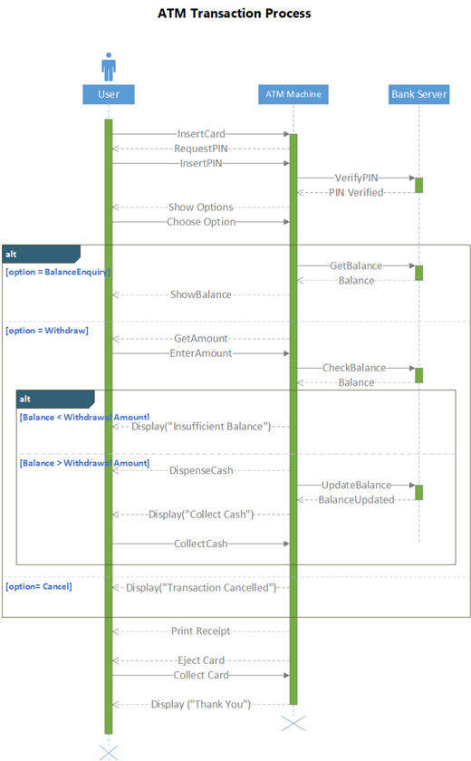

---

marp: true
---

# Deseño, estrutura e optimización de contidos

---

## :rocket: Apaga o ordenador e séntate fronte dunha folla en branco para planear o proxecto.

---

De como realicemos eses primeiros bosquexos nesa primeira folla e de como pensemos cada detalle de cada un dos elementos que intervirán na realización do proxecto depende o éxito do sitio e a satisfacción do cliente.

---

### Diagrama funcional

---

O diagrama funcional dun sitio é un documento técnico onde se especifican todos os procesos e comportamentos previstos no back-end (é dicir, aqueles  compoñentes que se poñen en marcha como resultado da interacción do usuario). Noutras palabras, é un análise do comportamento de navegación que pode satisfacer a actividade dun usuario dentro da web e que forma parte da arquitectura da información.

---

O diagrama funcional se elabora coa participación do cliente, que é  quen coñece con detalle os obxectivos do proxecto. 

---

Existen diversos procedementos para crear este esquema funcional ou wireframe. Adaptados sen dubida aos distintos grados de complexidade dun proxecto.

---

### WIREFRAMES

---

Os [wireframes](https://balsamiq.com/learn/articles/what-are-wireframes/) son diagramas de pantalla que se utilizan para definir a información, a estrutura e o comportamento dunha interface. 

Nos wireframes non se busca mostrar características visuais so observar e comunicar con liñas esquemáticas e sinxelas  os aspectos estruturais que requiren as funcionalidades previstas da aplicación.

---

---

O seu obxectivo é servir como ferramenta de comunicación entre investigadores, deseñadores UX, deseñadores UI, desenvolvedores e cliente.

É a forma máis eficaz de relacionar a arquitectura da información co deseño do produto.

---

---

As principais vantaxes de [facer wireframes](https://interactius.com/10-buenas-practicas-para-crear-wireframes-mas-eficientes/) antes do deseño visual son:

- Con menos tempo e polo tanto menores custos pódense definir decisións sobre estrutura, contidos, funcionalidades....
- Todas as iteracións seguirán tendo as vantaxes do punto anterior.
- Permite unha comunicación moito máis eficiente entre os actores implicados.
- Podes visualizar as interaccións e os fluxos de navegación ou interactividade funcional.
- Anticipar posibles problemas 

---

---

Os wireframes se poden crear perfectamente a man, ...ou empregando algún software especializado coma [Miro](https://miro.com/templates/wireframe/), [Figma](https://www.figma.com/blog/how-to-wireframe/), ...

---

---

### UML

---

---

Cando o proxecto web adquire unha complexidade elevada - por exemplo unha tenda online, onde hanse de considerar un amplo abanico de opcións e funcionalidades- se poden empregar técnicas de [UML](https://diagramasuml.com/) (*Unified Modeling Language*) mediante ás que se poden xerar **diagramas de casos de uso**, cos que analizar e deseñar as solucións a todas as funcións que pode ter o sitio web ou software en cuestión. 

---

Deste modo, e grazas ao esquema resultante, podemos observar como se desenvolve o proceso de comunicación e cal é o comportamento do sistema, deseñar a interacción cos usuarios e xestar as posibilidades que brindarán as funcionalidades do sitio.

---

---

---

UML se estableceu como un modelo estandarizado para describir un enfoque de programación orientada a obxectos (POO). 

---

Como as clases son os compoñentes básicos dos obxectos, os diagramas de clases son os compoñentes básicos do UML.

---

Os diagramas UML se poden empregar para:

---

- Ilustrar modelos de datos para sistemas de información, por simples ou complexos que sexan.
- Comprender mellor a visión xeral dos esquemas dunha aplicación.
- Expresar de modo visual calquera necesidade específica dun sistema e difundir esa información por toda a empresa.
- Crear diagramas detallados que destaquen calquera código específico que teña que ser programado e implementado na estrutura descrita.
- Proporcionar unha descrición independente da implementación dos tipos utilizados nun sistema que posteriormente se transfiren entre os seus compoñentes.

---

---

)

---

https://www.figma.com/

https://miro.com/templates/wireframe/

---

https://diagramasuml.com/

https://www.lucidchart.com/pages/examples/uml_diagram_tool

---

XAN 2023