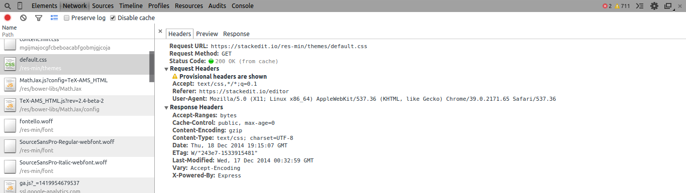
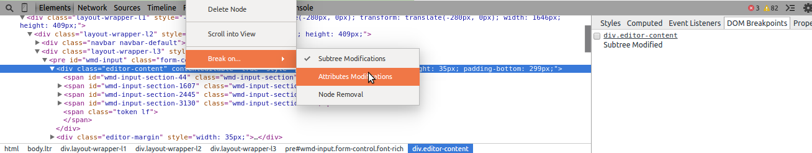
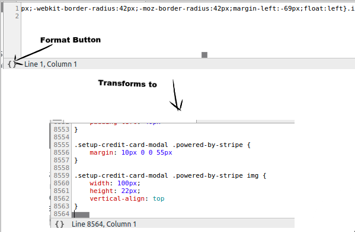

<!-- ---
marp: true
--- -->


# Desenvolvemento Web: Como usar as Ferramentas de Desenvolvedor do Navegador

------

As ferramentas para desenvolvedores do navegador, ou só "ferramentas de desenvolvemento", son de inmensa axuda para calquera desenvolvedor front-end, sexa principiante ou experto.

Aínda que están deseñados para desenvolvedores; técnicos de marketing, deseñadores e outros non desenvolvedores tamén poden usalos para realizar auditorías e probar cambios no sitio web.

---

Chamadas as veces *devtools*, permítenche inspeccionar, probar e depurar código nun navegador que afecta a interface de usuario. Así tamén os especialistas en SEO e os deseñadores poden usalas para probar cambios e optimizar as súas páxinas.

---

Antes de ver como usar *    DevTools, debes saber algunhas cousas:

- **HTML, CCS e JavaScript** execútanse nos navegadores web, así que eses son as linguaxes coas que poderás traballar en DevTools.

- **Calquera pode usar ferramentas de desenvolvemento do navegador e manipular o código**. Non obstante, os cambios só aparecerán no teu navegador e desaparecerán unha vez que actualices a páxina.

---

As ferramentas de desenvolvemento do navegador axúdanche a identificar os cambios que debes facer. Pero para que eses cambios sexan permanentes, terás que acceder ao código cun editor de código por fora do navegador.

---

1. Fai clic co botón dereito para inspeccionar a páxina.
2. Abrirase a xanela de ~~Chrome~~ DevTools.
3. Fai clic en cada pestana para acceder ás ferramentas.

---

### 1. Fai clic co botón dereito para inspeccionar a páxina.


Fai clic co botón dereito na páxina web que queres inspeccionar. Como atallo, tamén podes premer "Comando+Opción+C" en Mac ou "Control+Maiús+C" en Windows, Linux e Chrome OS. A continuación, fai clic en "Inspeccionar".

---

### 2. Abrirase a xanela de Chrome DevTools.


Navega por cada panel facendo clic na pestana situada na parte superior da pantalla.

---

### 3. Fai clic en cada pestana para acceder ás ferramentas.

### 

Unha vez que remates de usar ~~Chrome~~ DevTools, podes pechalo facendo clic no símbolo "X" situado na parte superior dereita da xanela.

---

A maioría dos navegadores web teñen o seu propio kit de ferramentas para desenvolvedores e hai moita superposición nas funcións. Aquí están as principais características:

- **Unha vista previa do dispositivo** para probar o deseño receptivo da túa páxina web
- **Un depurador de JavaScript** para identificar e corrixir erros
- **Un panel de rede** para rastrexar e analizar as solicitudes de páxinas
- **Unha ferramenta de inspector** para facer cambios de estilo, como fonte, espazamento, cores e marxes
- **Unha consola** para identificar erros de páxina e avisos
- **Un** **panel** de rendemento para comprobar o rendemento do seu sitio web, como a velocidade da páxina

---

### Proba o teu deseño con Mobile Chrome Developer Tools.

A barra de ferramentas de alternar dispositivo en Chrome DevTools permíteche ver como se ve a túa páxina web en varios dispositivos, incluídos modelos de iPhone, iPads e portátiles. Incluso podes engadir dimensións personalizadas se un dispositivo en particular non aparece na lista.


---

Durante unha fase inicial de desenvolvemento web ou un redeseño, esta barra de ferramentas pode axudar ao teu equipo a visualizar como se representa a páxina en diferentes dispositivos.

Pode ser especialmente útil para avaliar a [experiencia do usuario](https://blog.hubspot.com/marketing/ux-user-experience?hubs_content=blog.hubspot.com/customers/design-updates-in-browser-guide&hubs_content-cta=userexperience) na túa páxina.

---

Por exemplo, digamos que os teus datos indican que no móbil, os usuarios pasan a metade do tempo nas publicacións do teu blog que no escritorio. Ao comparar unha publicación no móbil con respecto ao escritorio, podes descubrir que os parágrafos son demasiado longos e voluminosos, o que crea unha experiencia de lectura negativa.

A solución sinxela aquí sería escribir parágrafos máis curtos e engadir máis elementos visuais para dividir o texto.

---

Usando esta mesma barra de ferramentas, tamén podes probar como os usuarios cunha conexión máis lenta experimentan a carga da túa páxina.


---

"Sen limitación" significa que non hai interrupcións na conexión. Un móbil de gama media ou baixa tardará máis tempo en mostrar todos os elementos da páxina. Se estás completamente fóra de liña, verás o código de erro "sen Internet".

Por que é útil isto? Queres que os teus usuarios teñan unha experiencia positiva no teu sitio, independentemente da súa conexión. Ao ver como se carga a túa páxina, podes identificar áreas para mellorar.

---

### Mide e optimiza a velocidade do teu sitio.

Para este paso, dispoñemos de [Lighthouse](https://developers.google.com/web/tools/lighthouse) , un produto de código aberto de Google que avalía o rendemento da páxina web e presenta oportunidades de mellora. Podes executalo en Chrome DevTools para probar todo, desde a velocidade do sitio e o SEO ata a accesibilidade tanto no móbil como no escritorio.


---

A velocidade da páxina xoga un papel importante na súa clasificación e debe ser unha prioridade cando se realiza unha auditoría de SEO.

Para comprobar a velocidade da túa páxina usando Lighthouse, consulta a imaxe de arriba. Selecciona "Rendemento" e o dispositivo no que queiras probar. A continuación, fai clic en "Xerar informe". Unha vez que se mostren os resultados, concéntrese no "Índice de velocidade".

---


---

Un índice de velocidade bo ou rápido está entre 0 e 4,3 segundos. Un moderado caerá entre 4,4 e 5,8 segundos. Se o teu índice supera os 5,8 segundos, a túa páxina é lenta e necesitará correccións para mellorar a velocidade da páxina.

Outra sección á que debes prestar atención mentres te desprazas cara abaixo é "Oportunidade", que mostrará formas de reducir a velocidade de carga da túa páxina.

---


Ademais de afectar o teu SEO, a velocidade da páxina tamén pode levar a altas taxas de rebote. Se queres reducir o tempo de carga da túa páxina, a ferramenta Lighthouse é un excelente lugar para comezar.

---

### Previsualiza os cambios de deseño.

Se o teu equipo quere visualizar como se verán determinados cambios estéticos no teu sitio web, un xeito rápido e sinxelo é usar a ferramenta de inspector para manipular o código.


---

#### ... pasa o rato por calquera elemento da páxina para obter detalles sobre o estilo da páxina.


#### Para facer cambios no estilo, selecciona o elemento que queres editar. O panel "Elementos" saltará ao código HTML e CSS dese elemento. A pestana "Estilos" é no que queres centrarte.


Aquí tes un exemplo de como cambiar a cor do texto.


---

### Realizar unha auditoría de SEO.

Toda marca quere clasificarse nos motores de busca porque significa chegar a máis persoas e conseguir máis tráfico ao teu sitio.

Para asegurarte de que o teu sitio web mantén unha posición elevada, realiza auditorías regulares para detectar calquera cousa que poida provocar que a túa páxina caia na clasificación. Con Chrome DevTools, podes realizar unha auditoría en Lighthouse para comprobar que pode estar afectando a túa clasificación.

---

#### ... fai clic na pestana Faro. Selecciona "SEO" en categorías e o dispositivo no que queres centrarte. A continuación, fai clic en "Xerar informe".

#### 


---

#### O informe mostra as auditorías superadas e as oportunidades de mellora.


Aínda que esta auditoría de SEO non é completa, é un excelente lugar para obter unha visión xeral rápida do rendemento de SEO do teu sitio.

---

### Monitoriza as túas solicitudes de Google Analytics.

Se estás facendo un seguimento do teu sitio web e das túas campañas de mercadotecnia en Google Analytics, o último que queres son datos suxos.

Usando Chrome DevTools, podes supervisar as solicitudes de Google Analytics, ver se se informan correctamente no Panel de control de Analytics, asegurarase de que está a recompilar datos precisos e axudar a identificar erros.

---

Aquí están os pasos:

1. Fai clic na pestana "Rede".
2. Carga a túa páxina web.
3. Busca as solicitudes de Google Analytics, sempre comezarán por "__utm.gif"
4. Fai clic na solicitude para ver que información se inclúe na solicitude.

---

Unha vez que saibas onde buscar, as ferramentas para programadores de Chrome poden ser bastante fáciles de usar. Aínda que algúns coñecementos de codificación son útiles, non son estritamente necesarios para empregar estas ferramentas.

Se es completamente novo coas ferramentas de desenvolvemento, deberías familiarizarte con elas e xogar un pouco. Premendo **F12** lanzaras as ferramentas para desenvolvedores na maioría dos novos navegadores de escritorio. 


---

#### A pestana Elementos

O panel Elementos (que se mostra arriba, aberto por defecto), mostra unha árbore HTML, que enumera todos os elementos DOM. Á dereita, a barra lateral mostra as propiedades relacionadas co elemento seleccionado actualmente. Por defecto, as regras de estilo CSS están listadas. Tamén podes ver o modelo de caixa para o elemento seleccionado, oíntes de eventos adxuntos a el, etc.

---

#### A pestana Rede

Esta pestana supervisa *todas* as solicitudes HTTP entrantes e saíntes da páxina web. Se a túa páxina web usa AJAX, tamén podes rastrexar as solicitudes AJAX desde aquí.


---

Facendo clic en calquera solicitude móstranse máis detalles sobre ela.



---

#### Pestana Fontes

Este é probablemente o lugar máis poderoso das ferramentas para desenvolvedores. Non é posible explicar todas e cada unha das funcións desta pestana nun artigo, pero aquí tes unha visión xeral.

A barra lateral mostra a lista de directorios de todos os recursos estáticos cargados para a páxina web actualmente aberta. Facendo clic en calquera, abrirase ese recurso na área de arquivos.


---

A barra lateral da dereita é para a inspección de JavaScript. Ao facer clic nun número de liña, pode engadir un punto de interrupción para esa liña do script aberta na área de arquivos. Cando esa liña estea a piques de executarse, a execución do script estará en pausa.

Para facilitar o seu uso, pode premer a tecla Esc para alternar o caixón da consola dividida, o que che permite ver a consola (e algunhas outras pestanas) xunto con calquera das pestanas principais.


---

Entón, digamos que queres inspeccionar unha variable definida na función. Non podes facelo directamente, xa que non está dispoñible no ámbito global, pero podes facelo engadindo un punto de interrupción na declaración da función. Cando a función está a piques de executarse, invocarase o depurador e pasará polas liñas unha a unha facendo clic no botón "Pasar sobre a seguinte chamada de función".


Durante isto, todas as variables accesibles nesa liña serían accesibles desde a consola, e tamén se listarían na sección Variables de alcance da barra lateral dereita.

---

#### Recursos

Esta pestana listará os diferentes recursos que unha páxina web garda no ordenador. Como `localStorage`, `sessionStorage`, cookies, etc.


---

Incluso pode editar os recursos directamente desde as ferramentas de desenvolvemento, en tempo real. Isto é útil para depurar aplicacións dunha soa páxina que gardan moitos datos como configuración, etc. en `localStorage`, ou un sitio cargado de cookies.

---

#### A consola

A consola serve como arquivo de rexistro, así como un parque infantil aberto.
Podes escribir calquera comando na consola e despois premer Intro. Calquera que sexa o valor de retorno do comando será impreso na consola.


---

Tamén podes imprimir na consola desde os teus arquivos de script mediante a `console.log`función.

```javascript
// your code here
var myVar = 'some data';
console.log(myVar); // will print myVar to the console
```

Para elementos DOM e obxectos moi grandes, usar `console.dir`en vez de `console.log`pode ser beneficioso, xa que mostra un tipo de estrutura de listado de directorios, que é expandible e contraábel. Máis funcións da consola están listadas no [artigo da API web da consola de MDN](https://developer.mozilla.org/en-US/docs/Web/API/console) .

---

### Fluxo de traballo

---

#### Atopar en estilos

Mentres inspeccionas as regras de estilo CSS para un elemento dunha páxina con moitos estilos, podes sentirte frustrado. Non obstante, podes filtrar as regras de estilo facilmente!


Isto é bastante útil cando está a usar un marco CSS como bootstrap.

---

#### Puntos de interrupción DOM

Se estás facendo moita manipulación do DOM e algo non funciona como se esperaba, podes engadir puntos de interrupción directamente aos elementos DOM. Só tes que facer clic co botón dereito sobre o elemento no panel Elementos, seleccionar Desactivar e comprobar as opcións nas que queres que o script se rompa.



Agora, sempre que se fagan cambios nese elemento DOM, a execución do script estará en pausa e invocarase o depurador, o que lle permitirá inspeccionar o estado da aplicación e identificar o(s) problema(s).

---

#### Pausa a execución do script

Premer F8 mentres as ferramentas de desenvolvemento están abertas faría unha pausa de inmediato en calquera script en execución. Isto é útil cando tes código asíncrono en execución ou animacións JavaScript en execución.


Ademais disto, os puntos de interrupción permítenche inspeccionar todas as variables no marco de execución actual desde a consola, o que che permite acceder a variables e funcións que, doutro xeito, están ocultas do ámbito global.

---

#### Fragmentos

Os fragmentos son a versión avanzada da consola. Os fragmentos permítenche escribir código JavaScript de varias liñas, gardalos na memoria de ferramentas de desenvolvemento (consérvanse para sempre ata que os eliminas), ter un historial de versións de estilo git (!), ter un autocompletado de código intelixente, resaltado de sintaxe, e que non! Tamén usan o mesmo poder dos puntos de ruptura.

Para usar fragmentos nas ferramentas de programador de Chrome, abre a pestana fontes. Na barra lateral da esquerda, fai clic na pestana Fragmentos e fai clic co botón dereito e crea un novo fragmento. Dálle un novo nome, se queres. E comeza a escribir o teu código!


Os fragmentos son moi bos para crear prototipos. Existe unha cousa semellante chamada ["Scratchpad"](https://developer.mozilla.org/en-US/docs/Tools/Scratchpad) para Firefox, que dá a mesma funcionalidade.

---

#### Espazos de traballo

Os espazos de traballo das ferramentas de desenvolvemento de Chrome permítenche traballar no código do teu sistema de arquivos directamente desde as ferramentas de desenvolvemento e facer cambios persistentes nos arquivos, ao tempo que utilizas todo o poder dos puntos de interrupción, a pila de chamadas, etc.

Para usar espazos de traballo, simplemente faga clic co botón dereito na barra lateral á esquerda da pestana Fontes, seleccione "Engadir cartafol ao espazo de traballo" e siga a guía.


---

Isto é bastante útil cando estás probando algo que ten moito que ver co front-end e queres interacción en directo co navegador, xa que o teu código cambia.

Recoméndase aos principiantes en JavaScript que se [centren só no núcleo ECMAScript](https://stackedit.io/viewer#!provider=gist&gistId=ca3770290d34b05b68d8&filename=HowToLearnJavaScript.md) e só despois aprendan API como a API DOM. Para iso, os lugares de traballo poden ser de gran axuda, xa que pode escribir e executar scripts de varias liñas de tamaño completo de forma persistente no mesmo ambiente.

Pódense atopar máis detalles na [documentación do sitio web de programadores de Chrome](https://developer.chrome.com/devtools/docs/workspaces).

---

#### Imprimir código directamente desde ferramentas de desenvolvemento.

Se queres inspeccionar algún minificado (código comprimido, que resulta en código ilexible para os humanos), podes imprimir o código desde as ferramentas de desenvolvemento.



Funciona para CSS, HTML e JavaScript!

---

#### Inspección `<iframes>`desde a consola

Se un dos teus scripts está nun iframe, que queres inspeccionar na consola, podes descubrir que escribir directamente os nomes de variables definidos para o iframe non funcionará.

Por exemplo, se tes un `iframe`na túa páxina e `iframe`contén un elemento co id `xyz`, escribindo `document.getElementById('xyz')`directamente na consola non dará o elemento, porque `document`referiríase á páxina principal.

---

Podes atopar isto se [usaches JSFiddle](http://jsfiddle.net/) . Pero pode cambiar o marco da fiestra que está a inspeccionar desde a consola.

---


---

#### A API da consola

A consola ten unha API moi agradable, especialmente para navegadores baseados en kits web como Chrome. Aquí tes 5 consellos rápidos para Chrome Web Console:

1. `$`é un alias para `document.querySelector`, e `$$`é un alias para `document.querySelectorAll`.
2. `$0, $1... $4`dar referencia aos últimos 4 elementos DOM seleccionados do inspector DOM. (Entón, cando teñas que seleccionar un elemento, fai clic co botón dereito e inspecciona o elemento, despois escribe `$0`na consola!)
3. `$_`contén o valor da última expresión avaliada na consola. Útil cando estás executando moitas expresións á vez. (Só Chrome).
4. `debug(function)`, escribindo isto na consola veríase a función pasada como primeiro parámetro a chamar. Cando se chame, invocarase o depurador e o script estará en pausa. (Só Chrome).
5. `getEventListeners(domElement)`enumeraría todos os oíntes de eventos conectados ao elemento DOM. (Só Chrome).

---

Podes ler máis sobre toda a API da consola e a API da liña de comandos na [documentación do sitio de programadores de Chrome](https://developer.chrome.com/devtools/docs/console-api) .

Ademais, o equipo de Mozilla Web anunciou recentemente o primeiro navegador feito para desenvolvedores: [Mozilla Firefox Developer Edition](https://www.mozilla.org/en-US/firefox/developer/) , que inclúe funcións especiais para facilitar o desenvolvemento front-end e AJAX. Tamén inclúe o IDE web e os recursos de desenvolvemento de aplicacións.

------

### Conclusión

As ferramentas de desenvolvemento son realmente moi poderosas e proporcionan un gran campo de xogo aberto para que os principiantes aprendan, especulen, experimenten e pensen.

Se es un principiante, sinte cómodo coas ferramentas de desenvolvemento desde o principio. Axudaríache no teu debido curso de aprendizaxe de JavaScript, así como de HTML e CSS.

Para intermedios e expertos, poden resultar de gran axuda para crear prototipos de pequenos módulos e cousas. Co tempo están engadindo funcións máis avanzadas ás ferramentas de desenvolvemento, como a depuración e inspección nativas de Canvas, métodos de consola adicionais para facilitar a inspección de datos, etc. Usalos só fai ben.

---

xan2023

ref: https://www.codementor.io/learn-development/javascript-css-html-tutorial-front-end-development-tools