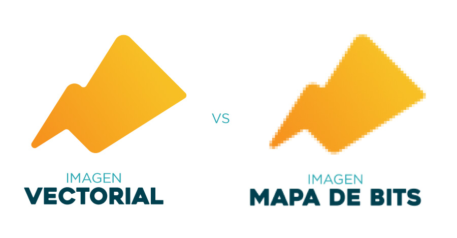
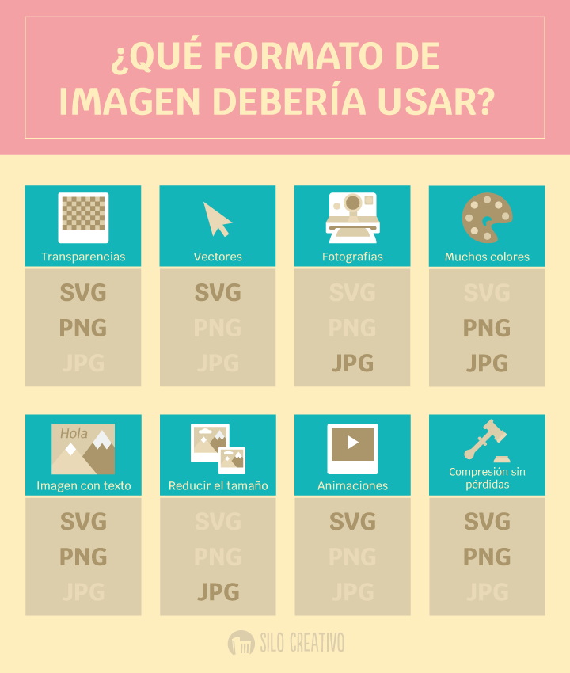
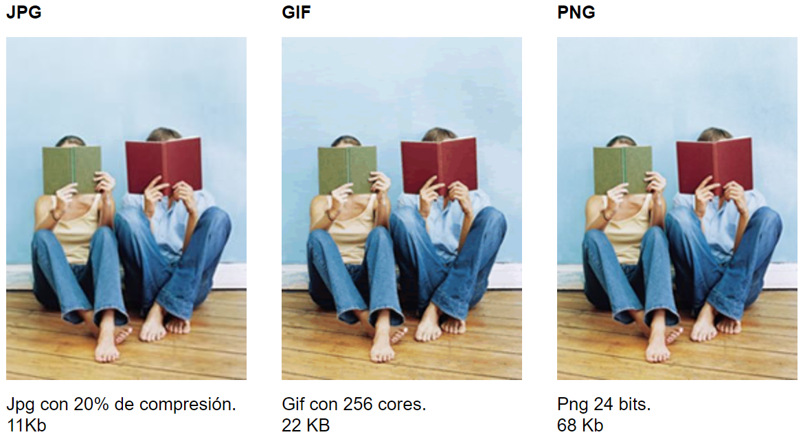
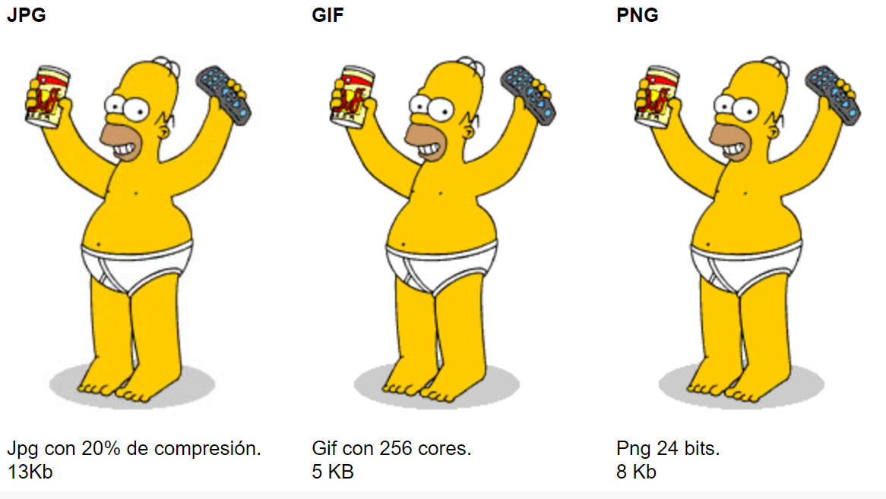
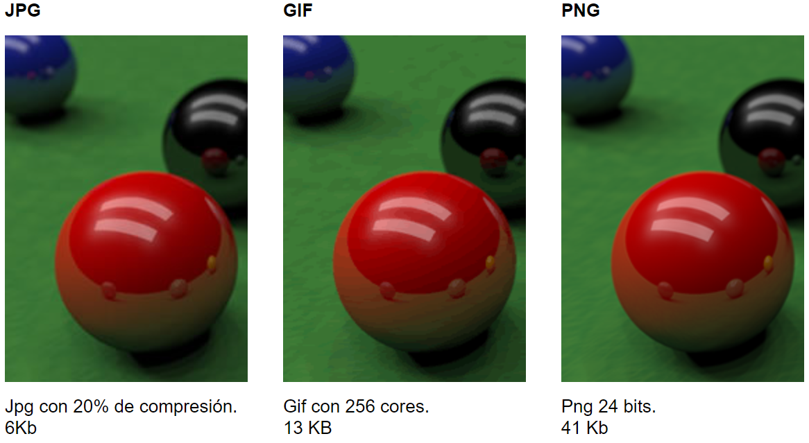
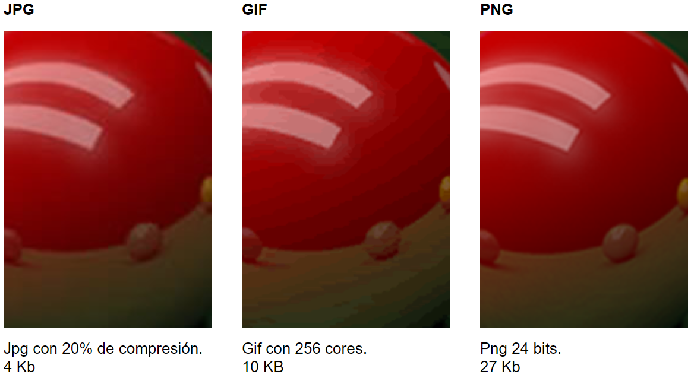

# Imaxes e elementos multimedia

---
Unha das principais decisións á hora de incluír gráficos na web vai ser **elixir o formato correcto para cada tipo de imaxe** de maneira que logremos unha **correcta relación entre a calidade visual da imaxe e o seu peso en Kb**.

---

As imaxes ofrecen un evidente **valor engadido,** revalorizando os proxectos ao tempo que destacan a información exposta nos textos, aclaran os contidos, ofrecen datos adicionais (no caso, por exemplo, das infografías) ou actúan como elementos que invitan á reflexión.

Aínda que tamén poden supor un problema de accesibilidade a ter en consideración en algúns contextos.

---

## As imaxes dixitais

---

En termos xerais, pódese distinguir dous tipos: mapas de bits e [imaxes vectoriais](https://www.ionos.es/digitalguide/paginas-web/diseno-web/que-es-una-imagen-vectorial/).

---

Formatos de imagen  soportados polos navegadores web.

---

---

Vemos que para obter unha calidade semellante os tamaños das imaxes son moi diferentes, neste caso a opción máis axeitada será optar polo formato JPG.

---

No caso dunha imaxe sinxela (con poucas cores) vemos que o formato máis axeitado é .gif, xa que aínda que a calidade da imaxe é idéntica á png, o peso da imaxe é considerablemente menor.

---

O formato png é o que ofrece mellor calidade, non obstante, a opción Jpg parece a máis axeitada pola súa relación calidade-peso, será unha decisión que debemos tomar, sobre todo en función da importancia da imaxe ou do detalle. que é necesario mostrar.

Para ver mellor a diferenza na calidade das imaxes a continuación móstrovos un detalle de ampliación feito nas imaxes anteriores.

---

Na ampliación, podemos ver como o formato PNG mantén unha calidade moito mellor que o resto, isto sucederá sempre cando traballemos con imaxes con degradados moi suaves e liñas moi ben definidas

---

https://blog.scaleflex.com/es/los-formatos-de-imagen-para-sitios-web-mas-populares/

https://okbinteractive.studio/insights/webp-y-avif-los-nuevos-formatos-de-imagen-que-deberias-usar-en-tu-web