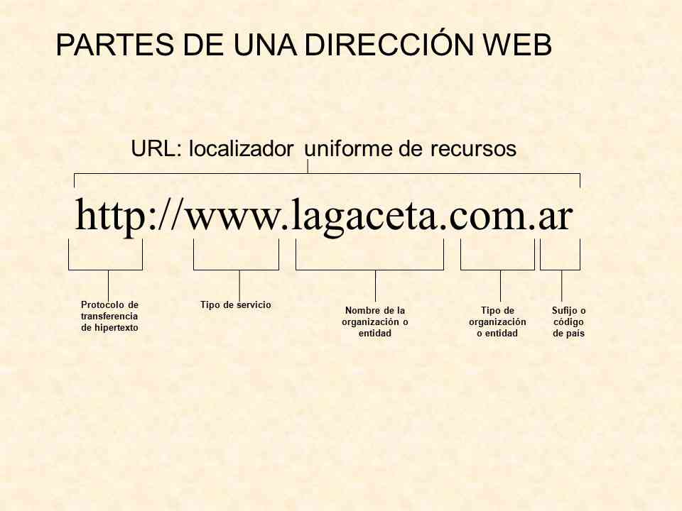

# Navegadores

---

Internet é unha rede xigante que conecta miles de ordenadores en todo o mundo. E, permítenos acceder e compartir información con persoas de todo o mundo en segundos. 

---

Probablemente utilizaches Internet para visitar sitios web, ver vídeos, enviar correos electrónicos, escoitar música ou xogar. 

Pero, sabes que cando te conectas a Internet e miras un sitio web estás usando un cadea de diferentes programas informáticos? 

---

Para ver un sitio web, ou consumir calquera outro servizo en Internet, uns programas nos nosos ordenadores chamados **navegadores web** se conectan a través das redes de Internet a programas que se executan nalgún aparato remoto denominado **servidor web**, permitíndonos compartir información de forma rápida e sinxela.

---

## World Wide Web

---

Internet está formada por moitas redes máis pequenas.
A World Wide Web (ou "a web") é unha rede que conecta moitos dos ordenadores, e outros dispositivos, usados a diario por millóns de persoas. 

---

A web está formada por moitas páxinas web individuais.

---

Unha páxina web é un arquivo escrito en código informático por un programador. 

---

As páxinas web están (case todas) escritas en HTML. Cada documento HTML contén a información que o teu ordenador precisa para mostrar unha páxina web en pantalla.

---

Cando un grupo de páxinas web están ligadas entre si formando un grupo distintivo falamos de **sitio web**. 

---

Para ver/acceder ás páxinas web publicadas utilizamos un tipo de programa chamado **navegador web**.

---

### Navegadores web

---

Os navegadores web son programas informáticos que nos permiten ver páxinas web. 

---

Pode que xa teñas oído falar dalgúns deles: Google Chrome, Microsoft Internet Explorer, Safari, Mozilla Firefox,...

---

...e seguro que os tes utilizado para acceder a todo tipo de sitios web.

---

Para atopar a páxina web que buscas na web, o teu navegador web usa un enderezo web. 

---

Con ese enderezo se accede á información da páxina web desexada usando un programa remoto, nun ordenador remoto, chamado servidor web.

---

### Servidores web

---

Os servidores son ordenadores que proven a outros ordenadores coa información que aqueles solicitan. 

---

Un servidor web pode ser hardware (unha computadora) ou software (un programa). Nos dous casos, o seu cometido é entregar contidos solicitados desde o teu navegador.

---

Para acceder a unha páxina web, o navegador web ten que conectarse ao servidor web onde se garda ou *aloxa* esa páxina. 

---

A chamada do navegador, se executa no servidor web, atopa a páxina web solicitada e a envía ao teu ordenador como código HTML.

---


---

### Enderezos web

---

A forma directa para que un navegador web atope un servidor web e o arquivo HTML que mostrará a web esperada é indicarlle un **enderezo web** ou **URL**.

---

Aínda que existen millóns de sitios web en Internet, cada páxina web ten unha URL individual para que o navegador poida atopala.

---
Unha URL ou enderezo web divídese en diferentes partes que indican, cada unha, unha información distinta que interesa ao navegador web.

---



---


---

### Páxinas web
Cando o servidor web envía ao teu navegador web unha páxina web, envía a información nun documento HTML. 

---

Os documentos HTML están formados por elementos HTML, como texto e imaxes, así como instrucións exactas para o navegador sobre como mostrar
e situar os elementos na pantalla.

---

Cando un navegador web le as instrucións do arquivo en código HTML, dicimos que o navegador *parses* - *parsea* &rarr; analiza- o documento HTML. 

---

A medida que analiza e descodifica as instrucións, o navegador debuxa cada elemento do documento na pantalla. 

---

Un documento HTML pode conter só unhas poucas palabras de texto, e moi pouco código a analizar e representar. Ou ter miles de liñas de código que o navegador web ten que manexar.

---

```html
<!DOCTYPE html>
<html>
<head>
 <title>Codificar mola</title>
</head>
<body> 
 Está preparado para codificar?
</body>
</html>
```

---

#### Estrutura dun documento HTML


---

Un **navegador web**, tamén chamado "browser" en inglés, é un software ou programa que nos permite acceder a Internet.

---

O navegador web solicita, recolle e representa os distintos elementos de cada sitio, páxina ou URL específico, e permite as persoas ver e consumir contido(s de moitos tipos e formas).

---

É o medio a través do cal podemos visitar e ver blogs, vídeos en liña, atender as nosas redes sociais, e moito máis. 

---

Isto é posible porque os navegadores web **son capaces de entender - ler e interpretar- linguaxes de programación como HTML ou JavaScript**.

---

En realidade para un programador unha páxina web só é un arquivo de texto.


---


---


---

É una das principais ferramentas de Google. Si só atenderamos ao numero de persoas que o teñen instalado nos seus ordenadores e dispositivos móbiles (case un 64%), seguramente poderíamos estar diante «do mellor» navegador web de sempre.


---


---

##### Avantaxes:

* Rápido, cunha interface lixeira, sinxela, fácil de usar, aínda que leva o seu tempo acostumarse a tódalas opcións que ten, sobre todo cando se trata das configuracións máis avanzadas.

* Dispón de **centos de extensións** que amplían a experiencia e un completo arsenal de ferramentas de desenvolvemento para programadores do lado cliente,... 

* Compatible con todos os sistemas operativos.

---

#####  Inconvenientes:

- O principal problema que presenta é o alto consumo de memoria RAM. Hai quen di que **é un dos que máis RAM consume**. Isto non é moi conveniente se non dispós dunha boa cantidade de memoria no equipo ou se a ocupas con outras tarefas.
- A súa combinación cos perfís de Google de moitas persoas que o usan, convérteno para moitos no "Gran Irmán Global".

---


---

Herdeiro dunha longa saga de navegadores que encetou nos 1990 con Netscape, é outro dos programas máis coñecidos. Conta cunha versión para dispositivos móbiles, esta menos coñecida.

---

#####  Avantaxes:

- Non é o máis rápido pero tampouco é lento.
- É un dos que máis liberdade ofrece de persoalización no modo de navegar por Internet, estéticamente falando.
- Ten un rendemento bastante decente e non consome moita memoria RAM, polo que se pode usar en calquera ordenador sen problemas.
- Dispón moitas extensións e aplicacións adicionais que o fan bastante completo.

---

#####  Inconvenientes:

- Unha interface que non acaba de ser todo o apetecible que poden resultar outras.
- Non é o máis lento pero tampouco o máis rápido.

---