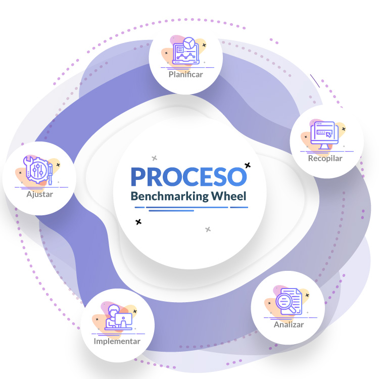

- Contacto Inicial
  - Definiendo objetivos
  - Briefing
  - Definición del alcance
  - Benchmarking
- Planificación: Mapa do sitio, Wireframes e UX
- Concepto: Creación de contenido
  - Difusión
  - SEO
- Diseño: Elementos visuales e Mockups
- Desenvolvemento
- Probas
- Lanzamento
- Mantemento

## Reunión inicial

&rarr; **Sentarse co cliente en estreita colaboración, co fin de establecer un obxectivo claro.**

O obxecto da reunión inicial, é obter unha correcta definición dos obxectivos a alcanzar.

Con esta información poderemos realizar un *briefing* para ver o alcance e dimensións do proxecto. 

Outro paso importante deste contacto inicial é o *benchmarking*: un análise da competencia co fin de obter ideas que axuden ao noso sitio.

### **Definir obxectivos**

Co fin de asegurarnos toda a información posible sobre o futuro proxecto nesta reunión inicial deben definirse e quedar claros varios puntos:

- Cal é o obxectivo principal do sitio a crear? É unha web informativa, comercial, de entretemento,...? Si é comercial… trátase de produtos ou servizos?
- A quen está dirixida? Se enfoca a un público específico? Se centra en usuarios dunha cidade, dun sexo específico o en cidadáns dunha franxa de idade concreta?
- Que é o que busca o cliente? Dar a coñecer unha información, crear un novo servicio ou prolongar un que xa exerce doutro xeito? Vender algún producto?
- Que esperan que faga exactamente a web? Será un portal informativo? Incluirá interacción co usuario vía ChatBot?  Precisará formularios cos que recadar datos dos usuarios?
- A páxina web busca transmitir a mensaxe dunha marca, ou polo tratase dunha estratexia de marca máis ampla cun enfoque propio?
- Ten competidores no sector? E de ser así… Busca similitudes cos competidores máis fortes ou prefire un estilo propio e distinto ao resto?

As respostas a estas preguntas son as que nos guiarán no noso futuro proxecto. 

Si non se empeza respondendo de maneira clara a cada unha das preguntas, corremos o risco de encetar na dirección incorrecta.

- Análisis de la competencia (Benchmarking)
- Características de la página (Definición del alcance)

### **Briefing** ou resumen de obxectivos

Un briefing é a redacción dun documento onde se plasma por escrito un resumen sobre o proxecto

Nese documento se resumen os datos que se recompilaron ao largo da **definición de obxectivos** e se inclúe toda a información necesaria para que o proxecto poida ser abordado segundo uns parámetros ou referencias aceptadas por as partes.

Trátase dun elemento clave en calquera proxecto, máis si é dixital, dado que axuda de maneira significativa a identificar o que o cliente quere ou espera.

Intentar lanzar un proxecto dixital sen ter ningún tipo de resumen de obxectivos ou briefing é como intentar a construción dun edificio sen ter os planos do mesmo. 

Un briefing acertado fai máis fácil o traballo: dende a valoración de custes, os tempos de desenvolvemento, as persoas implicadas,... E máis doado satisfacer as necesidades dol cliente.

Un briefing debe responder claramente a estas preguntas:

- Que se quere facer?
- Para que se quere facer?
- Canto tempo hai para facelo?
- De que medios dispomos para facelo?

En función das necesidades específicas nos podemos atopar con diferentes tipos de briefing:

- **Briefing de negocio:** Ten a mesma estrutura que un briefing de marketing, cun enfoque máis dirixido ao propio negocio.
- **Briefing de marketing:** Neste briefing se resumen os detalles principais da campaña de marketing que desexamos poñer en marcha. É un documento esencial tanto para os desenvolvedores, como para a dirección, dado que sirve como punto de partida para definir os briefings tanto creativos como publicitarios.
- **Briefing publicitario:** Se usa para definir campañas de publicidade, enfocándose en aspectos como os obxectivos a alcanzar, o público obxectivo, o orzamento da campaña, etc.
- **Briefing creativo:** É un documento de uso interno onde se detalla a información do proxecto a nivel gráfico e de deseño, e que serve de guía coa que os equipos creativos desenvolverán os seus proxectos.

Exemplo de como crear o(s diferentes) briefing(s) dun proxecto novo:

Se empezaría por un **briefing de negocio** onde recadar os siguientes datos:

**1. Características da empresa:**

- Breve descrición do obxecto de negocio.
- Produtos e/ou servicios.
- Información sobre o mercado.

**2. Características do sector:**

- Líderes da competencia.
- Competencia directa.
- Vantaxes competitivas.

**3. Análises do consumidor:**

- Análises do proceso de compra.
- Tendencias do mercado.

A continuación viría o **briefing de marketing**:

- Que produtos ou servicios ofrece a empresa e onde?
- Cal sería o cliente ideal?
- Ten algún nicho de mercado concreto?
- Cales son os obxectivos de venta?
- De que orzamento se dispón?
- Cal é a competencia?

Unha vez temos todos os datos tanto de negocio como de marketing, é a hora do **briefing publicitario**:

- Canles publicitarios que van a usarse?
- Cal é o target en cada un dos canles usados?
- Ton da mensaxe?
- Datas de lanzamento para as campañas en cada canal?
- Orzamento?
- Obxectivos por campaña?
- USP? Tes algo que destaque por encima da competencia?

Para rematar co **briefing creativo**:

- Que deseño gusta máis?
- Cal é a mensaxe que se desexa facer chegar aos clientes?

### **Definición do alcance**

Nun proxecto web, coma noutros, é importante definir o alcance.

Cando o obxectivo inicial establecido se expande ou cambia gradualmente durante o proceso de deseño ou programación, dando lugar a máis traballo do acordado; podémolo considerar non como un problema, sino como unha oportunidade para ampliar o contrato. Claro que, se o aumento de expectativas non se corresponde co aumento do orzamento, se corre o risco de que o proxecto se volva inviable.

Un exemplo moi común é que un cliente que contrata servicios para o deseño e creación dunha web, vexa co tempo que tamén quere outros servicios como a creación dunha aplicación web, correos electrónicos, inclusión de un chatbot, posicionamento estratéxico,...

Nun briefing é bo incluír un diagrama (de Gantt) para detallar un plan cronolóxico realista do proxecto; que axude a establecer uns límites e prazos viables e que proporcione unha referencia válida tanto para os deseñadores e desenvolvedores como para o cliente.

### **Benchmarking**

O **benchmarking** é un proceso continuo que toma como referencia os produtos e servicios das empresas líder do sector, co fin de crear unha comparativa cos da empresa cliente, e así visualizar as posibles melloras do negocio.

Non se trata de copiar ou imitar o que está facendo a competencia… senón máis ben adquirir técnicas eficaces da competencia para adaptalas ao propio negocio e, si é posible, mellorar o sistema da competencia.

Se o obxectivo é alcanzar un nivel de competitividade alto, o melljor camiño é estudar a fondo á competencia, analizando os seus métodos e técnicas, para a continuación perfeccionalas e adaptalas a nosa empresa.

Se poden distinguir tres tipos de benchmarking:

1. **Competitivo:** Se basea na medición dos servicios e produtos da competencia, co fin de crear unha comparativa coa nosa empresa e así mellorar a experiencia de usuario que ofrecemos.
2. **Interno:** É un estudo dentro da propia empresa. É unha práctica común das grandes empresas que desexan comparar diferentes departamentos; ou de grupos empresariais onde se busca un rendemento común entre todos os socios.
3. **Funcional:** Busca a mellora dos métodos ou procedementos. Aplicado ao deseño web: busca a mellora da(s) funcionalidade(s) dun sitio web. Polo que non é necesario que a empresa a analizar sexa competencia directa, senón que o que se busca son obxectivos moi produtivos e con gran acollida, dos que poidamos adquirir técnicas que axuden a incrementar a nosa eficacia.

Para crear un benchmarking é importante que nos baseemos nuns pasos preestablecidos:

**1. Planificación e estratexia:** Planificar a investigación e como a levaremos a cabo. Nos basaremos en las siguientes preguntas

1. Que trato de conseguir?
2. A quen vou a analizar?
3. Como o vou facer?

**2. Recopilación de ideas:** É o paso máis importante do benchmarking e del dependerá todo o proceso. As posibles melloras poden ser obtidas de diferentes fontes, ou saír do equipo.

**3. Análises de ideas:** Cando xa dispoñemos de toda a información que precisamos, hai que analizar as diferencias entre as empresas que estamos investigando e a nosa, e así identificar as oportunidades de mellora que nos aportan.

**4. Adaptación á web:** Implementar as melloras. Non só *copiando* á competencia, senón mellorandoa.

**5. Melloras e seguimento:** Finalmente se realiza un informe no que se engloba toda a información destacada analizada durante o proceso, o que facilitará retomar o traballo en futuros proxectos.

## Planificación: Sitemap, Wireframes e UX

### Mapa do sitio
O **sitemap** ou **mapa do sitio** é unha ferramenta dos webmasters que permite mellorar as buscas e o posicionamento en buscadores.

Gracias ao sitemap, os motores de busca son capaces de rastrexar facilmente os contidos dun sitio, proporcionar estatísticas de acceso melloradas, así como controlar posibles erros de indexación. 

Se trata dun arquivo no que se inclúe un listado das páxinas do sitio. 

Pode crearse en diferentes formatos, sendo o máis común XML, que permite recadar información adicional sobre as páxinas. Outros protocolos igualmente aceptados son os feeds RSS, os OAI-PMH ou incluso simples arquivos de texto plano.

Un sitemap proporciona aos deseñadores e programadores web unha idea clara da arquitectura informativa da páxina web, e explica tamén as relacións entre as diferentes páxinas e os elementos de contido.

### Wireframes
Una vez creado o sitemap, o seguinte paso é a construción dunha maqueta ou *plantilla* da estrutura ou esqueleto da web. 

Os wireframes proporcionan un marco no que almacenar tanto o deseño visual, como os elementos de contido, o que axuda a identificar posibles erros ou lagoas do sitemap.

Os wireframes non conteñan elementos do deseño final xa que só se trata dunha *plantilla* que actúa como orientación do aspecto final que terá a web. 

### UX

Este é un punto no que se pode comezar a avaliar a experiencia de usuario o UX.

Cando falamos de experiencia de usuario **UI**/**UX** nos referimos ao conxunto de factores e elementos que definen a posible percepción positiva ou negativa dun produto ou servicio. Esta experiencia depende de diferentes factores, que poden ir da gama de cores elixida ou o deseño visual, ate o hardware - un servidor lento, un dispositivo non axeitado,...-, o software, a accesibilidade, a responsividade e moito máis… 

A experiencia tamén depende de outros aspectos máis relacionados coas emocións, como a confianza na marca, os vínculos sociais,...

## **Creación de contido**

Unha vez completado o sitemap veremos a estrutura máis clara e poderemos encetar a elaborar os contidos do sitio. Crear cada páxina e elemento co aspecto e funcionalidade definitivos. Poñendo en práctica todo o que sabemos beneficia ao produto final. E sen esquecer a vida posterior do sitio: o seu posicionamento, a facilidade con que se vai cargar, ou o marketing de contidos.

Este posúe dúas características esenciais:

### **Difusión**

O contido atrae aos lectores e impulsa o compromiso e a acción pola súa parte. Pero a calidade do contido non é o único factor que inflúe no éxito. Unha páxina pode ser ou non atractiva dependendo de factores tan diversos como o interese que esperta o contido en sí, como pola forma en que se presenta, xa sexa pola tipografía, os elementos estruturales, etc. Non hai receitas para o éxito, pero si indicadores do fracaso ;).
Cousas como o coidado na redacción, o uso de palabras escollidas, a fragmentación axeitada do contido con párrafos no demasiado extensos, as imaxes e infografías que acompañen á lectura,... 

### **SEO**

A outra función do contido é a de aumentar a visibilidade nos motores de busca. Este proceso, baseado en optimizar ol contido co fin de mellorar a posición nos resultados de busca, se coñece como optimización do motor de busca ou SEO (Search Engine Optimization).

O mundo do SEO é moi extenso e vai moito máis ala do desenvolvemento dun sitio web. Pero si que os desenvolvedores deben ter moito coidado en favorecer o chamado posicionamento orgánico, coidando por exemplo a elección de palabras clave ou keywords para os titulares (H1, H2,...) os textos alternativos das imaxes (``alt="Texto alternativo"``), no corpo xeral do texto ou nos [enlaces](),... e tamén nas etiquetas meta da cabeceira -head- dos nosos documentos HTML.

O contido que está ben redactado, que é informativo e rico en palabras clave, será máis fácil de analizar e indexar por parte dos motores de busca, que aquel que non está optimizado para iso.

Como normalmente é o cliente o que aporta a maior parte do contido, é importante facerlle saber que ese contido *bruto* é moi posible que deba ser adaptado co fin de obter unha mellor optimización para os motores de busca.

## **Deseño: Elementos visuais e mockups**

Para finalizar la creación de la web, pasaremos a la elaboración de su estilo visual. Se trata de una parte del proceso de diseño que por lo general viene siempre condicionada por los elementos previamente existentes en la marca, tales como las opciones de color o los logotipos, los cuales vendrán estipulados por el cliente. Pero ojo, no pensar que todo viene cerrado sin dejar lugar a la imaginación del diseñador. De hecho, si un diseñador web quiere lucirse, este es su momento.

Y es que los artes o imágenes llevan un tiempo más fuertes que nunca, adquiriendo papeles más y más importantes a medida que pasa el tiempo.

Una imagen de calidad, que atraiga e informe al usuario, no solo dará a tu web un aspecto profesional, sino que además servirá de trampolín a la hora de darte a conocer.

Por ello, cuando ya se tienen todos los contenidos, tanto visuales como escritos, se procede a crear una plantilla con el resultado final de la web. En esta plantilla se incluye todo lo que será la web, desde sus páginas, hasta su contenido escrito y visual.

A esta plantilla se la conoce como **Mockup**, y sirve tanto para presentar un resultado final al cliente, como para localizar fallas o errores en la web antes de ser publicada definitivamente.

Los [Mockups](https://www.marketerosagencia.com/blog/diseno-web/mockup-web-que-es/) son fotomontajes que permiten a los diseñadores web mostrar al cliente cómo quedará su diseño, permitiendo rectificaciones en caso de ser necesarias, las cuales serán mucho más sencillas de realizar antes de la publicación de la web.

Volviendo al contenido visual, es bien sabido que afecta directamente a la cantidad de clics y al compromiso de los usuarios. Y es que no solo logran que la web se vea mucho más agradable y fácil de digerir, sino que además son capaces de mejorar el contenido de texto que lo acompaña transmitiendo información adicional.

Sin embargo, también es importante tener en cuenta que una imagen demasiado pesado puede lastrar nuestra web. Por ello es importante saber comprimir al máximo nuestras imágenes, ahorrandonos tiempo de carga y sin perder calidad.

Un buen diseño visual agilizará tus comunicaciones y atraerá a usuarios nuevos a tu web, no subestimes nunca su poder.

## Desarrollo

El desarrollo se podría definir como el punto en el que los desarrolladores maquetan el mockup en versión web. Se trata del paso en el que nos encargamos de las características y funciones internas de la página, o lo que es lo mismo, crea la parte interna de la web, como son los sistemas de funcionamiento, contenidos, base de datos, etc…

En este punto se deberá seleccionar el sistema de gestión de contenidos (CMS) eligiendo el más apropiado para nuestro proyecto.

Los lenguajes de programación más usados son ASP, JavaScript, XML y SQL, aunque con los nuevos requerimientos de programación se están empezando a desarrollar nuevas herramientas de programación. Sobre esto, también debe aclararse que algunas herramientas de superposición son usadas tanto como por los diseñadores como los desarrolladores en formatos HTML y CSS.

Entre los sistemas de gestión de base de datos, destaca sin duda MySQL, seguida de cerca por Oracle, SQL Server y PostgreSQL. Otras opciones válidas son Firebird o HSQL.

## **Probas**

Con ya todo el contenido montado y las imágenes ajustadas, es hora de lanzarnos con las pruebas en la web.

Es importante que se pruebe a fondo cada una de las páginas que daremos de alta, asegurándonos de que todos los enlaces funcionen correctamente, así como corroborar que la carga de la web se ejecuta correctamente en todos los diferentes dispositivos y navegadores que existen.

Es muy común localizar errores en esta fase. De hecho, lo preocupante es cuando no se encuentra ninguno, pues suele ser un síntoma de que algo se ha pasado por alto. Estos errores normalmente son resultado de pequeños errores de codificación, los cuales son complicados de localizar y corregir, pero mejor hacerlo ahora que presentar una web defectuosa al público…

Para esta función existen algunas herramientas que nos pueden facilitar el proceso de testeo, tales como SEO Spider de Screaming Frog, la cual se usa para revisar e identificar las fallas que perjudican su desempeño en los motores de búsqueda. Esto puede ahorrar mucho tiempo dado que la revisión manual página a página puede hacerse muy tedioso.

No olvides revisar muy bien todos los metatítulos y descripciones de cada página, y recuerda que incluso el mismo orden de las palabras tiene su importancia, pudiendo afectar al rendimiento de nuestra web en los motores de búsqueda.

Otras herramientas que pueden ser de utilidad a la hora de analizar nuestra web son SEMRush y SiteAnalyzer, ambos con sus propias características pero ambos útiles a la hora de ahorrarnos tiempo en el análisis de la web.

## **Lanzamiento** 

Cuando por fin lo tenemos todo preparado y presentable, y nos hemos asegurado de que toda página funciona como es debido, toca pasar al punto que todo diseñador web prefiere, el lanzamiento.

Un error común es caer en la desesperación cuando se ha lanzado la web y se localiza algún error que se haya logrado colar sin ser visto durante la etapa de testeo. No debes esperar la perfección, al menos no de primeras, pues es bastante habitual encontrarse con elementos que necesiten ser reparado.

Y es que el diseño de una página web es un proceso continuo y fluido que requiere de un mantenimiento constante para funcionar de manera óptima.

El diseño web, así como cualquier diseño de cualquier tipo, debe tratar de encontrar siempre un cierto equilibrio entre la función que desempeña y la forma en la que transmite su mensaje.

¿Qué significa esto? Pues que a la hora de diseñar una web debe tenerse en cuenta la utilización de formatos diferentes tales como las fuentes o los colores de fondo, pero sin olvidar que la experiencia de usuario de la gente que navega y experimenta en tu web es igual de importante.

Todo diseñador que se precie siempre tendrá en cuenta estos puntos, siendo capaz de crear una web que mantenga el equilibrio entre ambos.

Para terminar, algo que debemos tener muy presente es que, aunque la web ya esté dada de alta, el trabajo de un diseñador no acaba ahí ni de lejos…

¡Lo bonito de esta profesión es precisamente que nunca está terminada!

Siempre podremos ejecutar nuevas pruebas a usuarios en contenidos nuevos, así como monitorear nuestros análisis y refinar el mensaje que estamos mandando al usuario.

---

* :one: Recompilar datos e estudo de posicionamiento

  * unha páxina web se desenvolve cun **estudo previo sobre a que público nos diriximos, que produto ou servizo lles podemos ofrecer ou lles pode interesar, así como un estudo de cal será a nosa competencia**. Esta fase pode ter a súa vez diversas fases, como é a definición do público obxectivo, a definición dos contidos, a planificación do proceso de desenvolvemento, etc. 

    O mesmo para crear una tenda online como para crear unha web profesional, este estudo previo é clave para executar un proxecto con solvencia. Do contrario, non saberíamos a quen nos diriximos, nin que traballos nos esperan, nin por canto tempo, nin que prezo porlle ao noso produto/servizo, etc. 

    Pódese incluír nesta fase, **a elección dun nome de dominio** axeitado. Tendo en conta a importancia que isto vai ter no posicionamento e cara a presenza en redes sociais: comproba se podes usar un nome dado sen conflito, que ninguén se te adiante en Twitter, Facebook ou Instagram… que sexa fácil de lembrar, ...

* :two: Planificación: sitemap, UX, UI e deseño de contidos

  * Elaborar o **mapa do sitio**, planificar a **interface de usuario** ([UI](https://www.arsys.es/blog/ui)), a **experiencia das persoas na entorna proposta** ([UX](https://www.arsys.es/blog/ux)) e todo o **deseño** que imos darlle á páxina web. Esta é unha parte fundamental onde o proxecto cobra forma e onde calquera decisión debe seguir as indicacións da fase 1.

    - É a presentación do produto, tal é como se espera realizar. 
    - Debe reunir un estilo distintivo.
    - Debe amosar claramente a usabilidade posible do sitio, de xeito que o usuario entenda a organización de contidos e atope facilmente o que busca.
    - Sexa unha tenda, un blog de contidos, unha páxina de empresa, etc. é importante desenvolver unha estratexia de marca - branding - a fin de deixar claro quen somos, diferenciarnos e dotar a páxina coa filosofía do proxecto.

    Nas máis das ocasións, esta fase se divide en varias partes:

    - Planificación (wireframes/bocetos, primeiras ideas de deseño, etc.).
    - Concepto (definir contidos, alcance e  organización do sitio). 
    - Deseño: concepto e realización gráfica de elementos, iconas, fotos, collages, estrutura visual, tipos,...
      - Nesta fase se bebe adiantar toda planificación e traballo posible de cara a resolver asuntos prácticos da posta en funcionamento como son: o uso da cor (atendendo á problemas de accesibilidade), os tamaños relativos (atendendo á lexibilidade, usabilidade/accesibilidade e responsividade) e a responsividade ou adaptabilidade aos diferentes dispositivos,...

* :three: Desenvolvemento

  * Momento no que, con toda información dada e os modelos e guias de estilo elaboradas ata aquí, **os desenvolvedores codifican e constrúen a web.** 

    Este traballo se centra nas funcións internas do sitio: características, contidos (CMS), base de datos (NoSQL, MySQL,...), as linguaxes de programación empregados (XML, Javascript, PHP, SQL, CSS, ASP ou HTML). 

    Concretar nesta fase a **compatibilidade con dispositivos móbiles** e a **accesibilidade**, e que o deseño da web se adapte tanto a smartphones e tablets que acceden ao sitio con resolucións de pantalla distintas, como a tipos de navegación diferenciados: acceso para invidentes, lectores de pantalla,...

* :four: Probas+Probas+Probas...

  * Antes de publicar a web convén comprobar que nada falla e que completamos o plan inicial na súa totalidade. **Un erro común é lanzar unha páxina web a toda presa, para acabar dándose conta dos moitos fallos que pasamos por alto e provocando unha mala experiencia ás persoas que visitan o sitio.** 

    Crear unha web é como facer un **puzzle**: cada peza ten que funcionar correctamente, e hai moitas pezas. 

    Hai que probar todo a fondo:

    - Navegar polos distintos menús para ver que todo funciona correctamente, tanto en portátiles/sobremesas, como en dispositivos móbiles.
    - Probar todos os enlaces, facer clic en cada banner para ver que todo funciona perfectamente. 
    - Erros: non te preocupes si hai erros. Só trata de identificalos correctamente e corrixilos antes de publicar o sitio.
    - Usa ferramentas para testar a web, tamén as enfocadas ás probas con motores de busca. O [posicionamiento SEO](https://www.arsys.es/herramientas/seo) é a seguinte fronteira, porque temos que conseguir que o noso público obxectivo nos atope.
    - **Revisar** descricións, títulos, faltas de ortografía, erros gramaticais, calidade e peso das imaxes, funcionalidade, responsividade,... 

* :five: Publicación… e mantemento (SEO, growhaking, analytics, campañas, e-mail marketing,...)
  * Lembra que toda web, máis se é de carácter comercial, ten uns requirimentos legais que debes respectar. Redacta e publica: os textos legais axeitados para o sitio:  identificación e aviso legal, termos do servizo, politica de cookies,...
  
  * Necesitarás un provedor de servizos de aloxamento que te ceda o espazo e os servizos cos que poñer o teu sitio en marcha. E poderás publicar o teu sitio web.
  
    
  
  * Non caer no erro de esquecerse da web unha vez publicada. Un sitio web necesita actualizacións e mantemento:
    * As tecnoloxías implicadas sofren actualizacións que poden afectar ao funcionamento do noso sitio. Trata de manter o sitio actualizado e revisado periodicamente para non quedarse fora de xogo por calquera cambio.
    * Manterse no mercado. Se vendes produtos e/ou servizos precisaras actualizar prezos, xestionar pedidos, ofertas, rebaixas, promocións,... cambiar o look&feel do sitio, 
    * **Agora o teu sitio web é o primeiro fronte de negocio da túa empresa.**

