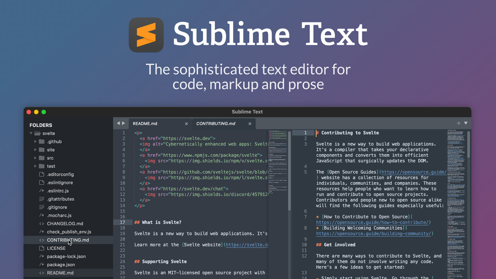

# Editores de código

Estas tomando unha cervexa cuns amigos e dous deles parecen non estar presentes, pero entre eles a conversa vese moi animada. De que estarán a falar?

Se son programadores so hai dúas posibilidades:

- do(s) formato(s) de código; ou
- do(s) editor(es) de código

Claro! iso só é válido para quen sabe apreciar a simpleza -extrema- de [Vim](vim.org) ou para quen experimenta o poder escondido dalgún prepositivo [EMACS](https://www.gnu.org/software/emacs/).

E, outra ronda, levan así tanto coma lles queda inda por discutir.

Para os que non participan da conversa - tan repetitiva coma pouco útil- bastaríalles saber que unha vez que te acostumas a unha entorna eficaz, a produtividade pode mellorar de xeito exponencial. Que **todas as entornas requiren un proceso de aprendizaxe**; e que non en todas é o mesmo. E que inda que a escarapela ''*vale para todo*'' - a máis reclamada por todos!-, en todos é moi opinable.

## Cal era o mellor, logo?

A lista é interminable. E se actualiza cada pouco.

Algún coma [Backets](https://brackets.io/) ou VSCode permiten incluso que creemos clons dende os seus repositorios en GitHub e dende aí fornecer o noso propio entorno de traballo.

**Como recoñecer un bo editor de código?** 

- **Curva de aprendizaxe** - non é determinante, pero para os que teñan certa presa polo resultado, non é un mal comezo.
- **Comunidade de usuarios** - si, aquí o número de formigas amoreadas sobre o pastel ten moita importancia. Que un editor teña certo numero de usuarios e contando con que unha alta porcentaxe deles si saiba o que está a facer... 
- **Desenvolvemento continuo** - estamos cheos de ver como os candidatos caen polo camiño[^1],. Todos queremos duración no tempo, actualizacións e melloras dos recursos, un desenvolvemento comprometido a resolver os problemas dos usuarios,...
- **Personalización** - algo do que todos, ou case todos, presumen; pero que, coma o peiteado ou a delimitación da comida lixo, cada quen entende a súa maneira.
- **Persistencia** - ás veces as grandes ondas de usuarios dun determinado editor poden ser unha moda pasaxeira; daquela é importante ver tamén o tempo que unha entorna leva no mercado, como se adapta, mellora, e inda que o mellor cun bloque de adeptos menor pero moi activo e estable, non perde o pulso das cambiantes necesidades dos seus usuarios.

## Un editor de código non é un IDE

Un editor de código non é un entorno de desenvolvemento integrado, malia que moitos aspiran a chegar máis lonxe. Os IDE xeralmente dan todo o que teñen, están pensados para determinados cometidos e fornecen todo aquilo que o cometido poida necesitar ou reclamar. **O editor de código espera que o usuario aprenda cales son as súas necesidades**. O certo é que os modernos editores dispoñen de centos de complementos que os achegan a case algo parecido a un IDE, ou ao caos.  Os editores, teñen iso si, o valor de medrar case ao par da habilidade do usuario e permitirlle unha **personalización funcional á medida**. Algún IDE pode resultar xa de partida moi intimidatorio.

## Cal instalo para encetar?

Buscas o mellor editor de código e texto para aumentar a túa eficacia, produtividade e rendemento?

Vexamos algunhas posibilidades:

1. **VSCode**: [Visual Studio Code](https://code.visualstudio.com/), é un editor de código aberto de Microsoft. É un editor de texto que se pode executar en calquera dispositivo, ben sexa Linux, Windows ou Mac.

   

   Moi centrado en aumentar o rendemento e con características coma o autocompletado ou a depuración do sistema que axudan nas tarefas diarias - as veces repetitivas- de desenvolvemento.

   É un editor ben áxil do que obter avantaxes dende o inicio; e o que, grazas a innumerable cantidade de complementos, máis se pode achegar a ser un IDE. Dispón dunha **terminal integrada**, coa que completar moitas tarefas dende a liña de comandos; e total compatibilidade e integración con Git, para o control de versións.

   Contras: require un tempo considerable para a posta en marcha. 

   Até o de agora gratuíto.

2. **[Sublime Text](https://www.sublimetext.com/)**: O candidato de sempre. Unha aplicación moi lixeira que sinalou o camiño a outras e cun considerable e incondicional número de adeptos.

   

   Con varios complementos moi prácticos, destaca polos atallos de teclado - fácil integración con Emmet-, unha interface moi sinxela e fácil de usar.

   Podes aproveitar o seu período de proba, e se te convence facerte con el por só 80$ de nada.

3. **[Atom](https://atom.io/)**: outro editor de código aberto dispoñible tanto para Linux coma para Windows ou Mac. Atom é compatible co control de versións de Git e dispón de centos de plugins - escritos en JavaScript-.

   

   Permite compartir o progreso do proxecto con colaboradores. E empregando Teletype para Atom (‎que permite tanto compartir coñecementos coma ensinalos‎) o converte nun moi interesante proxecto.

   Sinxelo de personalizar: todo se pode mudar con CSS ou JS, e asemade facilita o desenvolvemento de novos paquetes con diferentes funcionalidades.

4. [NetBeans](https://netbeans.org/): seguramente un dos preferidos polos deseñadores web. Sendo un editor de texto é o que máis se presenta coma un complexo IDE. Versátil e moi completo é compatible con diferentes linguaxes de programación. Moi interesante para o desenvolvemento con Angular e tamén para traballar con Node.js.

   

   Dispoñible para Mac, Windows e Linux

5. [Notepad++](https://notepad-plus-plus.org/), [Light Table](http://lighttable.com/), [Komodo edit](https://www.activestate.com/products/komodo-ide/downloads/edit/), e o sempre referente [Vim](https://www.vim.org/) son outras das tantas posibles candidaturas.

6. **Brackets**: de **[Brackets](http://brackets.io/)** poderíase falar bastante e case todo bo.

   

   Aínda que o seu avalista Adobe abandonará o seu desenvolvemento -set.2021- cedéndolle todo o protagonismo á comunidade de usuarios, que agora serán os encargados de continuar facendoio unha alternativa ben interesante.

## ... nunca é suficiente

Vaia por diante que non existe o editor perfecto nin a solución milagreira a todos os antollos de tódolos deseñadores e desenvolvedores web.

Pero antes de petalo disco duro instalando e desinstalando editores, configurando e reconfigurando entornas de desenvolvemento que non acaban por iluminar unha entorna cómoda e produtiva á nosa medida... proba na nube!

As avantaxes dos editores de código na nube é que non terás que configurar case nada.

Compilacións oficiais, actualizacións, plataformas compatibles, arquitectura do sistema, sincronización FTP... nada diso importa se tes un navegador!

E si está na web podes colaborar abertamente con outros membros do equipo. O editor de código do teu equipo farao todo algo máis complicado. No está deseñado para iso: Non terás opción de edición simultánea de código, comentarios ou resaltado do mesmo, sen acertar a configurar o(s) complemento(s) que o posibilite(n); e iso sempre que exista(n).

Asemade a maioría dos editores en liña entenden perfectamente a necesidade do control de versións: sempre teremos a man unha copia do repositorio. Sempre actualizado, cos últimos cambios creados, sen ter que enviar ou subir antes os cambios ao noso SCV. E con tódalas dependencias de desenvolvemento actualizadas e ao completo.

## :beer:+:beer:+:beer:+...​

Logo, como se pode tardar tanto en poñerse de acordo?

Seguro que un desenvolvedor podería argumentar que o acordo depende de moitas variables. Pero nunca recoñecería que os desenvolvedores rara vez sacrifican os seus caprichos polo ben común.

E, pensándoo ben: dous desenvolvedores na mesma oficina configuraran os seus editores de igual xeito?, poranse de acordo na constelación de complementos oportunos?... e si en vez de dous son tres ou catro, pode que máis, gardarán certa disciplina nos empaquetadores, minimizadores e dependencias de desenvolvemento, compiladores, manexadores de paquetes,... ?

# Un editor en liña é unha xoia

Inda que dependa de que teñas conexión ou non, sempre che permitirá decidir a configuración dos proxectos (até o formato do código), e simplemente se negará a aceptar o traballo ata que se adhira a tódolos estándares. Duro co usuario? Pode que si, pero garante para o proxecto: sen dubida!

Vexamos algúns editores de código en liña especialmente aptos para o desenvolvemento web.

[9 Best Online IDE and Code Editors to Develop Web Applications (geekflare.com)](https://geekflare.com/online-code-editors/)

_____

*Máis información*:

- https://geekflare.com/code-text-editors/

  

###### NOTAS:

[*1]:  - o seguinte na lista: [Backets](https://brackets.io/) de Adobe, empapelado xa para o lixo cibernético a menos que a comunidade consiga chegar a cita en Novembro 2021. 

OUT 2021
