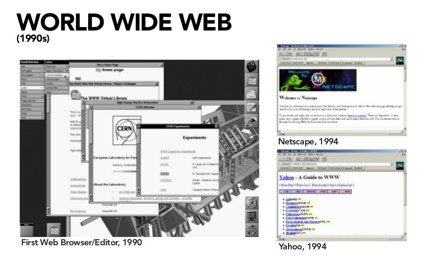

# *Navegadores*

> Ilustración de  [Wassim Chegham](https://dev.to/wassimchegham/ever-wondered-what-happens-when-you-type-in-a-url-in-an-address-bar-in-a-browser-3dob) para [Web Dev For Beginners](https://github.com/microsoft/Web-Dev-For-Beginners)

Que é exactamente un navegador? É unha aplicación de software que permite a un usuario final acceder ao contido dun servidor e visualizalo en páxinas web.

✅ Un pouco de historia: o primeiro navegador chamábase 'WorldWideWeb' e foi creado por Sir Timothy Berners-Lee en 1990.

> Algúns dos primeiros navegadores, vía [Karen McGrane](https://www.slideshare.net/KMcGrane/week-4-ixd-history-personal-computing)

Cando un usuario se conecta a Internet mediante un enderezo URL (Uniform Resource Locator), normalmente mediante o protocolo de transferencia de hipertexto mediante un enderezo `http` ou `https`, o navegador comunícase cun servidor web e obtén unha páxina web.

Neste punto, o motor de renderizado do navegador móstrao no dispositivo do usuario, que pode ser un teléfono móbil, escritorio ou portátil.

Os navegadores tamén teñen a capacidade de almacenar contido na **caché** para que non teña que ser recuperado do servidor cada vez. Poden rexistrar o **historial da actividade de navegación** dun usuario, almacenar **'cookies'**, que son pequenos anacos de datos que conteñen información utilizada para almacenar a actividade dun usuario, etc.

Unha cousa moi importante a ter en conta dos navegadores é que non son todos iguais!

Cada navegador ten os seus puntos fortes e débiles, e o desenvolvedor web debe entender como facer que as páxinas web funcionen ben nos diferentes navegadores. Isto inclúe o manexo de pantallas gráficas pequenas, como as dun teléfono móbil, así como a posibilidade do uso da aplicación sen conexión.

Un sitio web moi útil que probablemente deberías marcar no teu navegador favorito é [caniuse.com](https://www.caniuse.com/) . Cando estás a construír páxinas web, é moi útil utilizar as listas de tecnoloxías compatibles que proporciona *caniuse* para que poidas darlle sempre o mellor a todos os teus usuarios.

✅Se queres saber cales son os navegadores máis usados polos usuarios que acceden ao teu sitio web deberás activar algún sistema de estatística. Comproba se o teu servizo de hosting proporciona este tipo de información ou instala algún dos paquetes analíticos coma [Google Analytics](http://www.google.es/analytics). Estuda as túas estatísticas e aproveita a información que proporcionan no proceso de desenvolvemento.

## Extensións do navegador

**Os navegadores actúan como xanelas abertas a Internet. Ademais desta función, tamén podes ampliara as súas características e utilidade grazas ás extensións ou complementos**.

[Máis información sobre as extensións do navegador](https://www.osi.es/es/actualidad/blog/2019/11/20/extensiones-superpoderes-para-los-navegadores)

Amplía os teus coñecementos sobre os navegadores, a súa historia e a mesma historia de Internet:

- [Historia dos navegadores](https://www.mozilla.org/es-ES/firefox/browsers/browser-history/)
- [Historia da web](https://webfoundation.org/about/vision/history-of-the-web/)

___
XAN 2023
