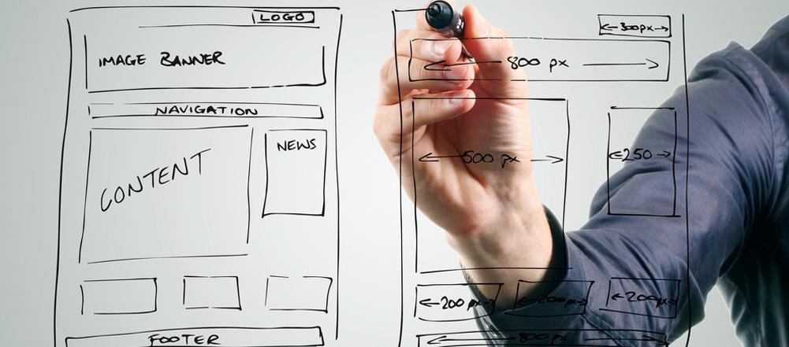
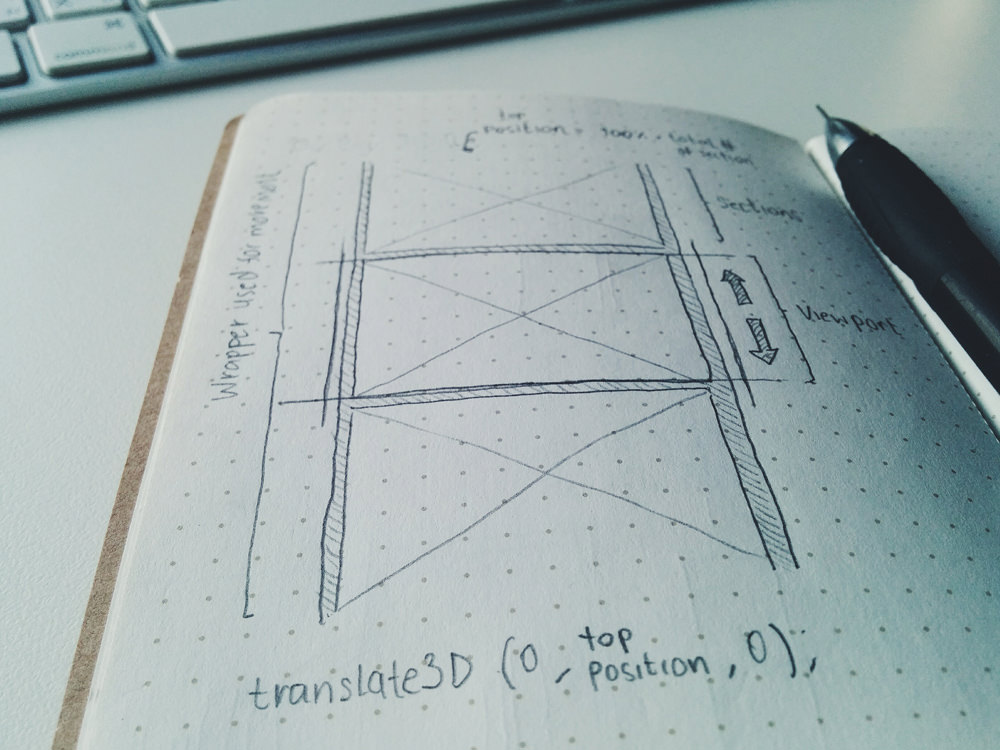

# Wireframes

Imaxina como será a túa páxina web e empeza a creala.

&rarr; **Tanto si creas unha web para ti, como si a creas para outro, non te esquezas de planificar, anticipándote aos posibles problemas e estudando os posibles recursos a mobilizar para levar o proxecto a bo fin.**

Os wireframes ou prototipos son bosquexos esquemáticos da estrutura visual, e funcional, dunha páxina web.

O obxectivo dos esquemas visuais é definir a distribución de contidos e a posición dos diversos bloques da túa web. Menús de navegación, bloques de contido, pé de paxina, etc… Isto, tamén che permite planear como vai ser a navegación no sitio ou como van a interactuar os distintos elementos entre si.

Nos wireframes ou esquemas visuais non tes porque empregar cores, nin tipografías nin ningún outro elemento gráfico. O importante é centrarse na **funcionalidade do sitio** e a **experiencia de usuario**.

<!-- [Funcionalidade do sitio e experiencia de usuario](axii-Navegadores.md/assets/wireframe_site_web_2.jpg) -->

Ao ser representacións sinxelas, podes crear diferentes versións dun mesmo sitio de xeito moi rápido, ou aplicar cambios ou novas ideas sobre a marcha. O importante é facerse cunha idea clara da estrutura da web ou aplicación. E coñecer de antemán que dependencias - de código, tecnoloxías, imaxes, textos,...- vai a precisar o teu proxecto.

<!-- [wireframes](./assets/wireframes.jpg)-->

...

____
OUT.2021

[https://webdesdecero.com/wireframes-que-son-y-como-crearlos/](https://webdesdecero.com/wireframes-que-son-y-como-crearlos/)
