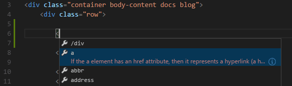

# HTML con VSCode

Visual Studio Code ofrece soporte básico para a programación HTML.

Resaltado de sintaxe, completado intelixente con IntelliSense, formato personalizable e soporte integrado para abreviaturas de Emmet.

## IntelliSense

Ofrece suxestións de código que axudan a completar a escritura do mesmo.



Tamén podes traballar con CSS e JavaScript incorporados. Pero este soporte de linguaxe só mira o contido HTML.

Podes activar as suxestións en calquera momento premendo ```Ctrl+Espazo```.

Se prefires non ver as suxestións correspondentes, podes variar a configuración de usuario ou a do espazo de traballo:

```json
// Configures if the built-in HTML language suggests HTML5 tags, properties and values.
"html.suggest.html5": true
```

Podes activar/desactivar o peche automático das etiquetas coa seguinte [configuración](https://code.visualstudio.com/docs/getstarted/settings) :

```json
"html.autoClosingTags": false
```

## Selector de cores

Selector de cores dispoñible nas seccións de estilo HTML.


O selector aparece ao pasar o rato sobre unha definición de cor.

## Pasa o rato

Move o rato sobre as etiquetas HTML ou estilos incrustados e JavaScript para obter máis información sobre o símbolo baixo o cursor.


## Validación

O soporte de linguaxe HTML realiza a validación de todos os JavaScript e CSS incorporados.

Podes desactivar esa validación cos seguintes axustes:

```JSON
// Configures if the built-in HTML language support validates embedded scripts.
"html.validate.scripts": true,

// Configures if the built-in HTML language support validates embedded styles.
"html.validate.styles": true
```

## Pregado de código

Podes pregar rexións do código usando as iconas de dobrado da beira entre os números de liña e o inicio da liña.

Tamén podes crear os teus propios marcadores con comentarios para definir unha rexión para pregar: 

`<!-- #region -->`  ........... `<!-- endregion -->`

## Formato

Podes usar o comando **Formatar documento** `Maiúsculas+Alt+F`para formatar todo o arquivo ou **Formatar a selección** `Ctrl+K Ctrl+F` para formatar só o texto seleccionado.

## Fragmentos de Emmet

VS Code admite a expansión de [fragmentos de Emmet](https://emmet.io/) . As abreviaturas de Emmet aparecen xunto con outras suxestións e fragmentos na lista de autocompletado do editor.


> **Consello:** consulta a sección HTML da [folla de trucos de Emmet](https://docs.emmet.io/cheat-sheet) para obter abreviaturas válidas.


### Próximos pasos

- [Emmet](https://code.visualstudio.com/docs/editor/emmet) : aprende sobre o poderoso soporte integrado de Emmet de VS Code.
- [Documentación oficial de Emmet](https://docs.emmet.io/) - Emmet, o conxunto de ferramentas esencial para desenvolvedores web.


NOV 2021

___

###### REFERENCIA

- https://code.visualstudio.com/docs/languages/html