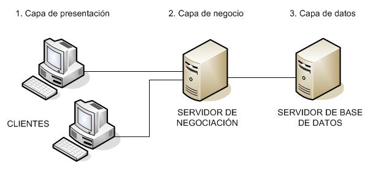
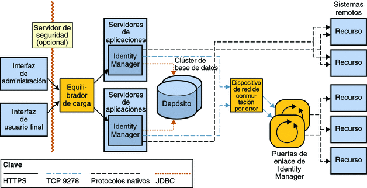
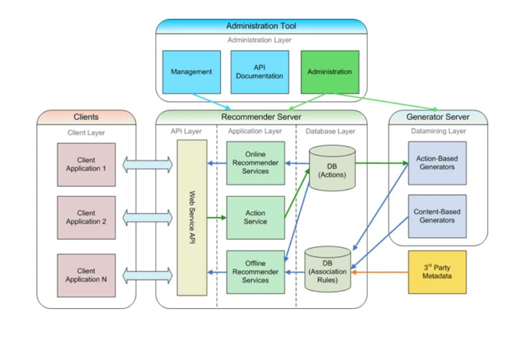
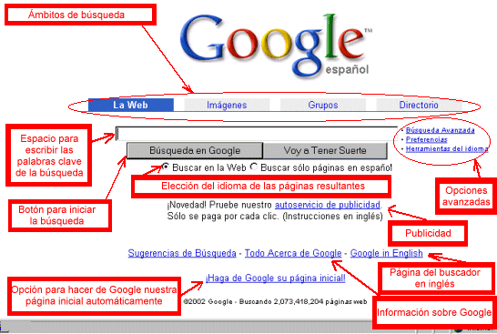
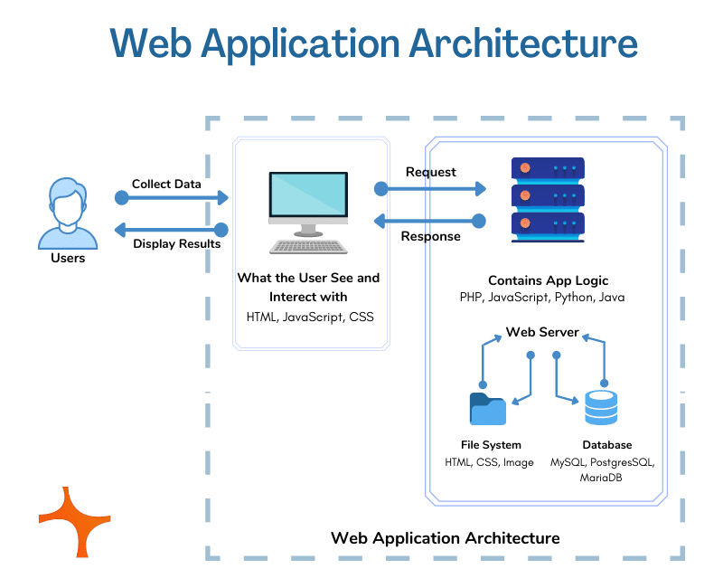
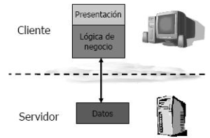
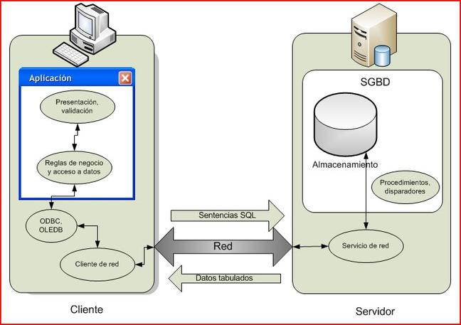
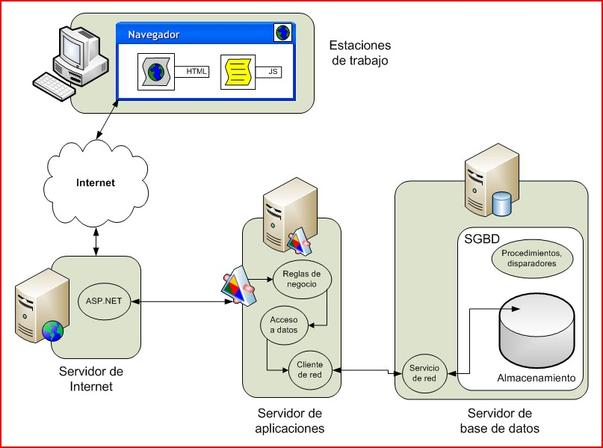
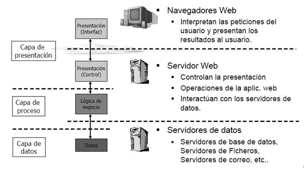

# Arquitectura das aplicacións web

Antes de falar sobre arquitectura web, vexamos - de xeito sinxelo - como funciona a web:

---

1. O usuario introduce a URL da túa aplicación na barra de enderezos do navegador ou fai clic nunha ligazón.
2. O navegador [busca o URL nos servidores DNS](https://kinsta.com/es/blog/propagacion-del-dns/) e identifica o enderezo IP da túa aplicación.
3. O navegador envía unha [solicitude HTTP](https://kinsta.com/es/base-de-conocimiento/que-es-una-peticion-http/) á túa aplicación.
4. A túa aplicación responde co contido correcto (normalmente unha páxina web).
5. O navegador mostra a páxina web na pantalla.

---

Máis en detalle, velaí como xestionaría unha solicitude unha *aplicación web*:

1. O usuario envía unha solicitude á súa aplicación a través da interface de usuario - frontend.
2. Se tes configurada unha caché relevante, a aplicación comprobaraa primeiro para ver se ten un rexistro válido que se pode enviar de volta ao cliente directamente. Se é así, devolverase o contido almacenado na caché e a solicitude marcarase como completa.
3. Se non hai caché, a solicitude envíase ao equilibrador de carga.
4. O equilibrador de carga identifica unha instancia do servidor que está dispoñible para xestionar a solicitude e reenvíaa.
5. A instancia do servidor procesa a solicitude e [chama a calquera API externa](https://kinsta.com/es/base-de-conocimiento/punto-final-de-la-api/) se é necesario.
6. Despois de recoller os resultados nun só lugar, o servidor devolve a resposta ao equilibrador de carga.
7. O equilibrador de carga devolve a resposta á pasarela da API, que á súa vez envíalla ao usuario no cliente frontend. A solicitude márcase entón como completa.

---

---

Do mesmo xeito que un edificio precisa dunha planificación baseada en **criterios técnicos, formais e funcionais**; tamén a www precisa dunha detida planificación que **establece os puntos de acceso, os sistemas de busca e recuperación de información de calquera aplicación soportada na web, e como se estruturan, organizan e etiquetan os contidos, con fin de que as persoas poidan satisfacer seus obxectivos e a súa experiencia sexa óptima**.

---

O mundo se amplía en Internet: **as aplicacións web son os novos lugares de traballo, comercio e ocio**.

---

Para dar cabida á variedade de propósitos aos que serven as aplicacións web actuais, cada unha delas ten que estar deseñada para ofrecer un alto rendemento e persoalización.

---

A(s) arquitectura(s) da(s) aplicación(s) web resolven este problema definindo como se estruturan os distintos compoñentes dunha aplicación baseada na web.

---

De xeito sinxelo pódese ver como un esquema de como interactúan entre si os distintos compoñentes dunha aplicación web dada.

---

Pode ser tan simple como definir a relación entre o cliente e o servidor. Ou tan complexa como definir as interpelacións entre un enxame de servidores backend en contedores, equilibradores de carga, pasarelas API e frontends dunha soa páxina orientados ao usuario.

---

<small>Arquitectura de 3 capas</small>

---

<small>*[Arquitectura](https://ws001.sspa.juntadeandalucia.es/confluence/display/GOBP/Soluciones+web%2C+arquitectura+de+referencia) de alta dispoñibilidade*</small>

---

<small>*Diagrama de arquitectura dunha aplicación de recomendación. (Fonte: [Wikipedia](https://www.wikipedia.org/))*</small>

---

A arquitectura dunha aplicación web é, sen dubida, unha das partes máis importantes da produción dunha aplicación web.

E cada aplicación requirirá unha arquitectura específica.

---

---

## :eye: Sen dubida trátase de algo máis relevante que escoller o framework ou editor de código a empregar

---

## *Fagamos unha aproximación rápida!*

---

Unha aplicación web é dispensada por un servidor web e usada polos usuarios que se conectan, desde calquera punto, a través de clientes web (navegadores). Daquela: toda arquitectura web ten (alo menos) 3 actores ou capas:

- un servidor web
- unha conexión de rede
- un (ou máis) cliente(s)

---

O servidor web distribúe páxinas de información **con formato** aos clientes que as soliciten.

---

As solicitudes realízanse a través dunha conexión de rede, e para iso utilízase o protocolo HTTP.

---

Unha vez feita a solicitude, a través do protocolo HTTP, o servidor web recíbea, localiza a páxina web no seu sistema de arquivos e envíaa de novo ao navegador que a solicitou.

---

---

As aplicacións web baséanse no modelo (ou arquitectura) **Cliente/Servidor** que xestiona servidores web e utiliza páxinas web como interfaces.

---

As páxinas web son o compoñente principal dunha aplicación ou sitio web.

---

Os navegadores solicitan páxinas (almacenadas ou creadas de forma dinámica\*) con información aos servidores web.

\* *Nalgunhas contornas de desenvolvemento de aplicacións web, as páxinas conteñen, ademais ou xunto ao código HTML, scripts dinámicos que son executados polo servidor antes de entregar a páxina. Falamos entón de [paxinas dinamicas](https://blog.hubspot.es/website/paginas-web-dinamicas-y-estaticas), en oposición a aquelas que so dispensan contidos previamente marcados e almacenados e que non requiren a participación das linguaxes de guión*.

---

Unha vez entregada a páxina ou documento solicitado, rómpese a conexión entre o navegador e o servidor web.

É dicir, a lóxica de negocio no servidor só se activa coa execución dos scripts das páxinas solicitadas polo navegador (no servidor, non no cliente).

---

Cando o navegador executa un script no cliente, o cliente non ten acceso directo aos recursos do servidor.

---

Hai outros compoñentes que non son scripts, como as miniaplicacións (unha aplicación especial que se executa dentro dun navegador) ou os compoñentes ActiveX(:skull:).

---

Os scripts do cliente adoitan ser código JavaScript - tamén [VBSscript](https://desarrolloweb.com/manuales/tutorial-visual-basic-script-manual.html)- mesturado con código HTML.

---

*As páxinas solicitadas en Internet son en gran parte dinámicas (ASP, PHP, etc.). Estas páxinas agrúpanse loxicamente para ofrecer un servizo ao usuario.*

---

O acceso ás páxinas tamén se asocia ao tempo que un usuario permanece interactuando co sitio (sesión).

---

### Compoñentes dunha aplicación web

---

#### 1. Lóxica de negocio

- Define os procesos implicados na funcionalidade da aplicación.
- Conxunto de operacións necesarias para prestar o servizo.

---

#### 2. Xestión de datos

- Manexo da información,  bases de datos, compoñentes e arquivos.

---

#### 3. Interface (UI/UX)

- Os usuarios acceden a través de navegadores, móbiles, PDA, etc. &rarr; *Responsividade*
- Funcionalidade accesible a través do navegador. &rarr; *Accesibilidade*
- Limitado e dirixido pola aplicación. &rarr; *Usabilidade*

---

As aplicacións web modélanse mediante o que se coñece como **modelo de capa**. Unha capa representa un elemento que procesa ou trata información. Segundo as capas que interveñen nunha aplicación atopamos:

- Modelo de dúas capas: a información atravesa dúas capas entre a interface e a administración dos datos.
- Modelo n-capa: A información pasa por varias capas - por exemplo no modelo de tres capas.

---

## **Modelo de dúas capas*

---

Gran parte da aplicación execútase no lado do cliente (*fat client*).

---

As capas son:

- Cliente (*fat client*): a lóxica de negocio está incrustada dentro da aplicación que presenta a interface de usuario no lado do cliente.
- Servidor: xestiona os datos.

---

As limitacións deste modelo son

- Escasa *escalabilidade*
- Permite un número reducido de conexións simultáneas
- Alta carga de rede
- Flexibilidade restrinxida
- Funcionalidade limitada

---

---

 *As arquitecturas de dúas capas foron as primeiras en aproveitarse da estrutura Cliente/Servidor*.

---

- **Capa da aplicación**:

  É onde se atopa a interface do sistema e é da que o usuario pode dispoñer para realizar a súa actividade co sistema.

- **Capa de datos**:

  É o repositorio ou almacén de datos, é a capa onde se almacena toda a información ingresada no sistema e que reside nel de forma permanente. É o nivel da base de datos.

---

## **Modelo de tres capas.**

---

---

Deseñado para superar as limitacións das arquitecturas co modelo de dous niveis, introduce unha capa intermedia:

- **a capa de proceso**.

---

Entre a presentación e os datos, os procesos pódense xestionar por separado da interface de usuario e dos datos.

Esta capa intermedia centraliza a lóxica de negocio, facilita a administración dos datos que se poden integrar desde múltiples fontes,...

As aplicacións web actuais prefiren este modelo - e aínda arquitecturas máis complexas-.

---

As capas deste modelo son:

---

### 1. Capa de presentación (parte no cliente e parte no servidor)

- Recolle a información do usuario e envíaa ao servidor (cliente)
- Envía información á capa de proceso para procesala
- Recibe os resultados da capa de proceso
- Xerar a presentación
- Ver a presentación ao usuario (cliente)

---

### 2. Capa de proceso (servidor web)

- Recibe entrada de datos da capa de presentación
- Interactúa coa capa de datos para realizar operacións
- Envía os resultados procesados á capa de presentación

---

### **3. Capa de datos (servidor de datos)**

- Almacena os datos
- recuperar datos
- Mantén os datos
- protexer a integridade dos datos

---

---

XAN 2023

---

<https://cynoteck.com/es/blog-post/reasons-to-treat-web-application-architecture-seriously/> :star:

<https://kinsta.com/es/blog/arquitectura-aplicaciones-web/#qu-es-la-arquitectura-de-las-aplicaciones-web>
