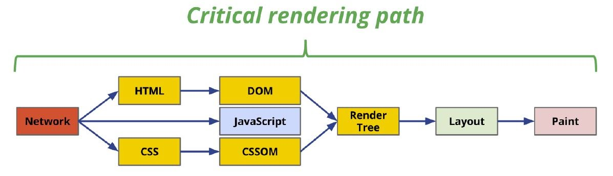

# Arquitectura dos navegadores web

---

### Como funcionan os navegadores web?

---

---

#### Interface de usuario

É a interface de usuario do navegador. Inclúe a barra de enderezos, o botón Atrás, as opcións de marcadores, o botón Actualizar, etc.

A interface de usuario do navegador non está definida en ningunha especificación formal, senón que se foi armando respondendo a prácticas comúns que ao longo de décadas de experiencia foron decantándose até facerse convencionais.

*As diferencias ou novidades que poida aportar algún navegador, se alcanzan un certo grado de aceptación, case sempre son rapidamente imitadas polo resto de navegadores.*

Como resultado, **todos os navegadores teñen interfaces de usuario moi similares entre si**.

---

#### O motor do navegador:

O motor do navegador organiza as accións entre a interface de usuario do navegador e o motor de renderizado do navegador.

Cando escriba un novo sitio web e prema a tecla Intro, a IU do navegador indicaralle ao motor do navegador, que se comunicará co motor de renderizado.

---

#### O motor de renderizado:

O motor de renderizado é o responsable de mostrar o contido solicitado.

O motor de renderización comezará obtendo o contido do documento solicitado da capa de rede.

Toma o código HTML e analízao para crear a árbore DOM (Document Object Model).

A continuación,...

---

... o motor de renderizado analizará o CSS para construír o CSSOM (Modelo de obxectos CSS). É como o DOM, pero para o CSS e non para o HTML.

Mentres se analiza o CSS e se crea o CSSOM, o navegador está descargando outros recursos a través da capa de rede, como arquivos JavaScript.

O motor de renderizado comunícase co motor JavaScript para executar o código JavaScript e manipular o DOM e o CSSOM.

A continuación, o motor de renderizado toma o DOM e o CSSOM e combínaos para crear a árbore de renderizado.

---

---

A continuación, o motor de renderizado usa o backend da IU para mostrar o sitio web na pantalla e, finalmente, pintar os píxeles na pantalla.

Todo o proceso polo que atravesa o motor de renderizado chámase Ruta crítica de renderizado.

---

---

##### Exemplos de motor de renderizado inclúen:

- **Safari** - Motor de renderizado WebKit
- **Chrome** - Blink Rendering Engine (Blink é un fork de WebKit)
- **Firefox** - Gecko Rendering Engine

---

<!-- _class: invert -->

Detalle do fluxo de WebKit

---

<!-- _class: invert -->

 Mozilla's Gecko rendering engine main flow

---

#### Capa de rede

A capa de rede é a responsable de facer chamadas de rede para obter recursos.

Impón os límites de conexión correctos, formatea as solicitudes, trata con proxies, caché e moito máis.

Podes ler máis sobre a capa de rede aquí.

---

#### Motor JavaScript

O motor JavaScript úsase para analizar e executar código JavaScript no DOM ou CSSOM. O código JavaScript é proporcionado polo servidor web ou pode ser proporcionado polo navegador web (extensións do navegador ou funcións do navegador como o bloqueo automático de anuncios).

Os primeiros navegadores usaban intérpretes de JavaScript, pero os motores JavaScript modernos usan a compilación Just-In-Time para mellorar o rendemento.

---

##### Exemplos de JavaScript Engine inclúen

- **Chrome** - Motor JavaScript V8
- **Safari** - JavaScriptCore
- **Firefox** - SpiderMonkey Engine

---

#### IU da Backend:

Esta capa é a responsable de debuxar os widgets básicos como caixas de selección ou entrada e ventás. Debaixo usa métodos de IU do sistema operativo.

O motor de renderizado usa a capa de fondo da IU durante as fases de deseño e pintura para mostrar a páxina web no navegador.

---

#### Almacenamento de datos:

O navegador necesita gardar datos localmente (cookies, caché, etc.) polo que o compoñente de almacenamento de datos xestiona esta parte.

Os navegadores modernos tamén admiten mecanismos de almacenamento como localStorage, IndexedDB e FileSystem. Este é un excelente artigo sobre todas as opcións de almacenamento no navegador.

Acabamos de cubrir o nivel de superficie aquí, se quere afondar sobre como funcionan os analizadores HTML e CSS, así como como funciona o motor JavaScript, le a publicación completa do blog [aquí](https://www.html5rocks.com/en/tutorials/internals/howbrowserswork/) .

---

https://dev.to/mahmoudessam/the-architecture-of-web-browsers-1o1k

https://web.dev/howbrowserswork/