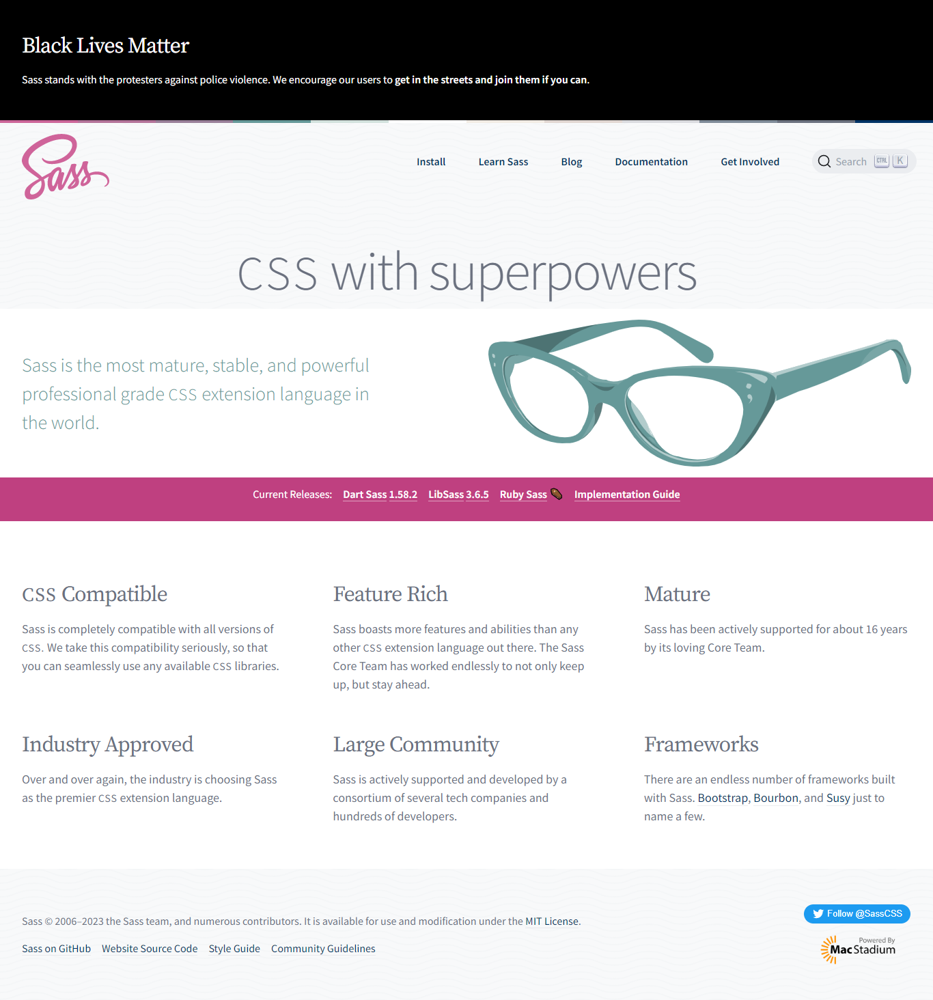

# Introdución a ``sass``

## Que é un preprocesador?

Segundo a definición do [Glosario de Mozilla](https://developer.mozilla.org/en-US/docs/Glossary/CSS_preprocessor):

*Un **preprocesador CSS** é un programa que permite xerar [CSS](https://developer.mozilla.org/en-US/docs/Glossary/CSS) a partir da [sintaxe](https://developer.mozilla.org/en-US/docs/Glossary/Syntax) propia do preprocesador*. Hai moitos preprocesadores CSS entre os que escoller: [Sass](https://sass-lang.com/), [Less](https://lesscss.org/), [Stylus](https://stylus-lang.com/),…

Os preprocesadores, asemade, amplían as capacidades predeterminadas de CSS con características como mixins, selector de aniñado, selector de herdanza, funcións, operacións matemáticas, etc.

O que non ten dubida é que **os preprocesadores contribúen a elaborar un código CSS con maior lóxica estrutural, máis lexible e máis fácil de manter e de escalar**.

Os preprocesadores CSS facilitan a automatización de tarefas repetitivas, reducen o número de erros e o *engorde* do código. Crean fragmentos de código reutilizables, engaden automaticamente prefixos de axente e garanten a compatibilidade con versións anteriores de CSS.

Para usar un preprocesador CSS, debes dispor dun compilador CSS operativo no teu [servidor](https://developer.mozilla.org/en-US/docs/Glossary/Server) web. Ou usar un preprocesador CSS para compilar no contorno de desenvolvemento e logo cargar o **arquivo CSS compilado** no servidor web.

*Moitos coñecidos frameworks de CSS engaden nas súas distribucións o código precompilado. Coñecer estas linguaxes abre a posibilidade de traballar con estes frameworks dun xeito máis intelixente e produtivo.*

## Sass: Syntactically Awesome Style Sheet



[Sass](https://sass-lang.com/) foi lanzado no 2006, polo que é o preprocesador CSS máis antigo. Os seus creadores, Natalie Weizenbaum e Hampton Catlin, inspiráronse na linguaxe de modelos [Haml](http://haml.info/) que engade características dinámicas ao HTML. O obxectivo era atopar unha funcionalidade dinámica similar para CSS.

Cando deron co seu preprocesador CSS chamárono *follas de estilo sinteticamente impresionantes*: Syntactically Awesome Style Sheets. Sass permite aos desenvolvedores de frontend usar variables, instrucións ``if/else``, bucles ``for/while/each``, herdanza e lóxica computacional no noso código CSS.

Sass está escrito en Ruby e orixinalmente necesitaba Ruby para compilar. Isto disuadiu a moitos desenvolvedores de usalo. A introdución da biblioteca [LibSass](https://sass-lang.com/libsass) deulle un importante impulso á súa utilización. LibSass foi unha biblioteca de C/C ++ que nos permitía integrar Sass noutros idiomas motor, por exemplo, [Node](https://github.com/sass/node-sass) , [PHP](https://github.com/sensational/sassphp) , ou o mesmo [C](https://github.com/sass/sassc) . Co paso do tempo acabou desprazada por [Dart Sass](https://sass-lang.com/dart-sass) en características e compatibilidade con CSS.

Dart Sass é, a día de hoxe, a implementación principal de Sass. Isto significa que obtén novas funcións antes de calquera outra implementación. É rápido, fácil de instalar e compílase a JavaScript puro, o que facilita a integración nos fluxos de traballo modernos de desenvolvemento web.

### Sintaxe

Sass ten dúas sintaxes:

- Unha sintaxe máis antiga baseada na sangría e que omite puntos, comas e corchetes no seu código e se garda en arquivos coa extensión **`.sass`**

  ```sass
  /* Sass */
  
  $primary-color: seashell
  $primary-bg: darkslategrey
  
  body
    color: $primary-color
    background: $primary-bg
  ```

- E outra sintaxe máis recente, máis utilizada, e que permite unha sintaxe CSS estándar con chaves, puntos e comas. E se garda en arquivos coa extensión **`.scss`**.

  ```scss
  /* SCSS */
  
  $primary-color: seashell;
  $primary-bg: darkslategrey;
  
  body {
    color: $primary-color;
    background: $primary-bg;
  }
  ```

O código simplemente declara dúas variables, `$primary-color` e `$primary-bg` e como aplica-las no elemento `body`.

O resultado da compilación de calquera deles da o mesmo CSS:

```css
/* Compiled CSS */

body {
  color:seashell;
  background: darkslategrey;
}
```

A sintaxe`.sass` é máis rápida e non resulta fácil equivocarse, é tamén a sintaxe orixinal do preprocesador.  Mentres a sintaxe `.scss` resulta máis apegada a sintaxe CSS estandar. A elección? Cousa de gustos?

Vexamos outro exemplo:

```SASS
/Sass*/

.container
 float: left
 width: 100%
 p
  color: #222
```

```SCSS
/SCSS*/

.container{
 float: left;
 width: 100%;
        p {
  color: #222;
    }
}
```

*Proponte adiviñar o resultado da compilación.*

*Par comprobar de xeito rápido a efectividade de Sass/SCSS podes empregar <https://codepen.io/>. Entre as características de configuración dispón da posibilidade de activar calquera dos preprocesadores CSS máis coñecidos: Less, SCSS, Sass, Stylus ou PostCSS*.

### Características

É importante ver cales son as diferenzas entre as dúas sintaxes:

| Sass                        | SCSS                       |
| :-------------------------- | :------------------------- |
| Indentation                 | Curly braces & semi-colons |
| Strict rules for whitespace | Ignores white space        |
| =my-mixin                   | @mixin my-mixin            |
| +my-mixin                   | @include my-mixin          |
| @import foo(same)           | @import foo                |
| @extend foo(same)           | @extend foo                |

Para almacenar valores que queremos reutilizar ao longo do código, Sass usa variables.  [As variables Sass](https://sass-lang.com/guide#topic-2) se presentan co signo `$`. As variables poden ser globais ou locais.

Seguindo o principio de programación [DRY (Don't Repeat Yourself)](http://wiki.c2.com/?DontRepeatYourself) para evitar duplicidades, Sass dispón de dúas características moi utiles: os mixins e a regra `@extend`.

[Mixins](https://sass-lang.com/guide#topic-6) permite crear unha morea de regras CSS relacionadas e aplicalas rapidamente a calquera propiedade.

Por exemplo, o seguinte mixin crea un deseño de tarxeta sinxelo con ancho, alto, fondo e bordo como parámetros:

```SCSS
/* SCSS */

@mixin card($width, $height, $bg, $border) {
  width: $width;
  height: $height;
  background: $bg;
  border: $border;
}
```

Cada vez que quiramos crear unha nova tarxeta, simplemente chamamos ao mixin `card` usando a regra  `@include` e pasámoslle os catro argumentos:

```SCSS
/* SCSS */
.card-1 {
  @include card(300px, 200px, yellow, red 2px solid);
}
.card-2 {
  @include card(400px, 300px, lightblue, black 1px dotted);
}
```

O resultado:  

```CSS
/* Compiled CSS */
.card-1 {
   width: 300px;
   height: 200px;
   background: yellow;
   border: red 2px solid;
   padding: 20px;
}
.card-2 {
   width: 400px;
   height: 300px;
   background: lightblue;
   border: black 1px dotted;
   padding: 20px;
}
```

A regra de herdanza `@extend` resulta moi útil cando temos diferentes elementos de deseño que comparten algunhas características:

```SCSS
/* SCSS */

.class-1 {
  width: 100%;
  height: auto;
}
.class-2 {
  @extend .class-1;
}
```

A regra `@extend` tamén estende todos os selectores aniñados, porque Sass tamén permite aniñar. [O aniñado](https://sass-lang.com/guide#topic-3) mellora a lexibilidade e o mantemento do código. Pódese usar cando temos selectores que comparten o mesmo pai, por exemplo:

```SCSS
/* SCSS */

article {
  p {
    line-height: 1.5;
  }
  img {
    max-width: 100%;
  }
}
```

Outra parte ben poderosa de Sass son os bucles -loop- e as expresión condicionais que nos permiten escribir regras CSS como en calquera linguaxe de script.

Sass ten unha [función incorporada `if()`](http://sass-lang.com/documentation/file.SASS_REFERENCE.html#if) e unha [directiva `@if`](http://sass-lang.com/documentation/file.SASS_REFERENCE.html#if) coa que podemos enxertar diferentes condicións e bucles [`@for`](http://sass-lang.com/documentation/file.SASS_REFERENCE.html#for), [`@each`](http://sass-lang.com/documentation/file.SASS_REFERENCE.html#each-directive) e  [`@while`](http://sass-lang.com/documentation/file.SASS_REFERENCE.html#while) cos que emitir repetidamente conxuntos específicos de estilos. Con todas estas opcións, a lóxica do noso CSS pode ser tan flexible como se queira.

Outra característica de Sass e a súa modularidade, que permite  usar [arquivos Sass parciais](https://sass-lang.com/guide#topic-4) que conteñen bloques de código que podemos empregar moitas veces. Así é habitual separar os elementos nunha arquitectura de cartafoles e arquivos parciais. Cada arquivo parcial se pode invocar e engadir a calquera outro arquivo Sass coa regra  [`@import`](https://sass-lang.com/guide#topic-5).

O preprocesador Sass tamén ten [funcións incorporadas](http://sass-lang.com/documentation/Sass/Script/Functions.html) que podemos empregar para converter e/ou mesturar cores, manipular cordas, realizar cálculos matemáticos e aplicar outras funcionalidades dinámicas ao noso deseño. E, se iso non abonda, tamén podemos definir as nosas propias [funcións personalizadas de Sass](http://sass-lang.com/documentation/file.SASS_REFERENCE.html#defining_custom_sass_functions) .

*Os dous frameworks frontend máis usados, [Bootstrap](https://getbootstrap.com/) e [Zurb Foundation](https://foundation.zurb.com/) están escritos en Sass.*

*Sass ten potentes bibliotecas mix e marcos de creación que melloran aínda máis a funcionalidade da linguaxe, como [Compass](http://compass-style.org/) e [Bourbon](https://www.bourbon.io/) . Hai varias compañías notables que usan Sass nos seus sitios de produción, por exemplo Airbnb, Kickstarter, Hubspot, Zapier, Freshbooks,…*

### Análise de erros

Mentres que CSS especifica como recuperarse da maioría dos erros; cando Sass atopa unha sintaxe non válida nunha folla de estilo: falla. E preséntalle ao usuario un erro coa información sobre a situación da sintaxe non válida e o motivo polo que resultou inválida.

Este é un dos poucos casos en que SCSS non é *estritamente* un superconxunto de CSS. Non obstante, é moito máis útil para os usuarios de Sass ver erros de inmediato, en lugar de facelos revisar á saída CSS .

Pódese acceder á localización dos erros de análise mediante API específicas da implementación. Por exemplo, en Dart Sass podes acceder con [`SassException.span`](https://pub.dartlang.org/documentation/sass/latest/sass/SassException/span.html), e na do apartado Sass e de Dart Sass JS API podes acceder as propiedades [`file`, `line` e `column`](https://github.com/sass/node-sass#error-object).

## Fundamentos de Sass

As follas de estilo son cada vez máis grandes, máis complexas e máis difíciles de manter. Para facilitar o a creación, edición e mantemento destas follas de estilo sen perdernos na morea de clases, propiedades, herdanzas, … temos Sass.

O poder inicial de Sass radica na liña de comandos.

&rarr; **Instalar en calquera lugar (autónomo)**

Podes instalar Sass en Windows, Mac ou Linux descargando o paquete para o teu sistema operativo [desde GitHub](https://github.com/sass/dart-sass/releases/tag/1.38.0) e [engadíndoo ao teu`PATH`](https://katiek2.github.io/path-doc/)

&rarr; **Instalar en calquera lugar (npm)**

Se usas Node.js, tamén podes instalar Sass usando [npm](https://www.npmjs.com/) executando

```bash
npm install -g sass
```

Se usas [o xestor de paquetes Chocolatey](https://chocolatey.org/) para Windows, podes instalar Dart Sass executando

```bash
choco install sass
```

&rarr; **Instalar en Mac OS X ou Linux (Homebrew)**

Se usas [o xestor de paquetes Homebrew](https://brew.sh/) para Mac OS X ou Linux, podes instalar Dart Sass executando

```bash
brew install sass/sass/sass
```

Unha vez instalado Sass, poderás compilar o teu Sass en CSS usando o comando `sass` . Só terás que indicarlle a Sass desde que arquivo construír e onde darlle saída ao CSS compilado. Desde a túa terminal pode facelo:

```bash
sass input.scss output.css
```

E así Sass compilaría `input.scss` , o arquivo orixe, devolvendo o CSS compilado no arquivo `output.css`.

Tamén podemos empregar o marcador `--watch`  para vixiar os cambios nos arquivos de orixe e que se volvan a compilar cada vez que gardamos o Sass.

```json
sass --watch input.scss output.css
```

Por suposto se poden compilar e dar saída a directorios. So temos que empregar os camiños de cartafol de entrada e de saída, separándoos con dous puntos. Neste exemplo:

```json
sass --watch app/sass:public/stylesheets
```

Sass observaría todos os arquivos do cartafol `app/sass` para os cambios e compilaría CSS no cartafol `public/stylesheets`.

### Variables

Aquela información relativa as propiedades de estilo da nosa paxina que vaiamos a empregar de xeito repetitivo podémola almacenar en **variables**. As variables son moi útiles para almacenar cousas como cores, pilas de letra ou calquera valor CSS que penses que quererás reutilizar.

Sass usa o símbolo `$` para declarar unha variable. Aquí tes un exemplo:

```SASS
/* Sass*/

$font-stack:    Helvetica, sans-serif
$primary-color: #333

body
  font: 100% $font-stack
  color: $primary-color

```

```SCSS
$font-stack:    Helvetica, sans-serif;
$primary-color: #333;

body {
  font: 100% $font-stack;
  color: $primary-color;
}
```

```css
/* css compilado */

body {
  font: 100% Helvetica, sans-serif;
  color: #333;
}
```

Cando se procesa o Sass, as variables que definimos para `$font-stack` e `$primary-color` se presentan no CSS compilado cos valores variables colocados na nosa folla de estilo. *Algo como traballar cos cores de marca nun deseño, pode resolverse dun xeito máis consistente en todo o sitio empregando variables*.

### Aniñado

HTML ten unha clara xerarquía aniñada e visual. CSS, non.

Sass permite aniñar os selectores CSS dun xeito que siga a mesma xerarquía visual que HTML. Iso si, as regras excesivamente aniñadas dan pé a CSS excesivamente cualificados que pode resultar difícil de manter. Normalmente o aniñado excesivo de regras considéranse unha mala práctica.

```Sass
/* Sass */

nav
  ul
    margin: 0
    padding: 0
    list-style: none

  li
    display: inline-block

  a
    display: block
    padding: 6px 12px
    text-decoration: none
```

```SCSS
/* SCSS */

nav {
  ul {
    margin: 0;
    padding: 0;
    list-style: none;
  }

  li { display: inline-block; }

  a {
    display: block;
    padding: 6px 12px;
    text-decoration: none;
  }
}
```

```CSS
/* CSS compilado */

nav ul {
  margin: 0;
  padding: 0;
  list-style: none;
}
nav li {
  display: inline-block;
}
nav a {
  display: block;
  padding: 6px 12px;
  text-decoration: none;
}
```

Observa como os selectores `ul`, `li`, `a` están aniñados en `nav`.

### Parciais

Podes crear arquivos Sass parciais que conteñan pequenos fragmentos de CSS que podes incluír noutros arquivos Sass. Esta é unha boa maneira de modular os teus estilos e axudar a manter as cousas máis fáciles de manter. Un parcial é un arquivo Sass marcado cun guión baixo no seu nome. Algo así como: `_partial.scss`. O subliñado fai saber a Sass que ese é só un arquivo parcial e que non se debe xerar nun arquivo CSS . Os parciais Sass chamanse coa regra `@use`.

### Módulos

Non temos que escribir todo o Sass que imos precisar nun só arquivo. Podes dividilo como queiras, e logo ilo chamando coa regra `@use`. Esta regra carga outro arquivo Sass como *módulo* , o que significa que podémonos referir ás súas variables, [mixins](https://sass-lang.com/guide#topic-6) e [funcións](https://sass-lang.com/documentation/at-rules/function) no noso arquivo Sass so co emprego dun espazo de nome baseado no nome do arquivo. Usar un arquivo tamén incluirá o CSS que xera na saída compilada.

```sass
// _base.sass
$font-stack:    Helvetica, sans-serif
$primary-color: #333

body
  font: 100% $font-stack
  color: $primary-color
  
  
// styles.sass
@use 'base'

.inverse
  background-color: base.$primary-color
  color: white
```

```SCSS
// _base.scss
$font-stack:    Helvetica, sans-serif;
$primary-color: #333;

body {
  font: 100% $font-stack;
  color: $primary-color;
}


// styles.scss
@use 'base';

.inverse {
  background-color: base.$primary-color;
  color: white;
}
```

```CSS
// CSS compilado

body {
  font: 100% Helvetica, sans-serif;
  color: #333;
}

.inverse {
  background-color: #333;
  color: white;
}
```

:eye:  Como se ve, estamos a usar `@use 'base';` no arquivo `styles.scss`. Cando usamos un arquivo non se precisa incluír a extensión do mesmo. Sass descubrirao sen máis.

### Mixins

En CSS, algunhas cousas son un pouco teimosas de escribir. Con CSS3 e os moitos prefixos de provedor que existen para facelo compatible, as cousas se poden engedellar bastante. Un *mixin* permite facer grupos de declaracións CSS que imos reutilizar en todo o sitio. Tamén se poden pasar valores para que o *mixin* sexa máis flexible. Un uso que lle podemos dar a un *mixin* é para solucionar os prefixos de provedor. Coma neste exemplo para `theme`.

```sass
@mixin theme($theme: DarkGray)
  background: $theme
  box-shadow: 0 0 1px rgba($theme, .25)
  color: #fff


.info
  @include theme

.alert
  @include theme($theme: DarkRed)

.success
  @include theme($theme: DarkGreen)
```

```scss
@mixin theme($theme: DarkGray) {
  background: $theme;
  box-shadow: 0 0 1px rgba($theme, .25);
  color: #fff;
}

.info {
  @include theme;
}
.alert {
  @include theme($theme: DarkRed);
}
.success {
  @include theme($theme: DarkGreen);
}

```

```css
.info {
  background: DarkGray;
  box-shadow: 0 0 1px rgba(169, 169, 169, 0.25);
  color: #fff;
}

.alert {
  background: DarkRed;
  box-shadow: 0 0 1px rgba(139, 0, 0, 0.25);
  color: #fff;
}

.success {
  background: DarkGreen;
  box-shadow: 0 0 1px rgba(0, 100, 0, 0.25);
  color: #fff;
}
```

Como se ve no exemplo, para crear un *mixin* se usa a directiva `@mixin` e se lle da un nome. Aquí chamamos ao *mixin*: `theme`. Tamén estamos a usar a variable `$theme` entre parénteses para poder pasar a `theme` todo o que queiramos. Despois de crear o seu mixin, pode usalo como declaración CSS QUE comeza `@include`seguido do nome do mixin.

### *Extend/Inheritance*

Pode que esta sexa unha das características máis útiles de Sass. Usar `@extend` permite compartir un conxunto de propiedades CSS dun selector con outro.

No seguinte exemplo, se crea unha sinxela serie de mensaxes para erros, avisos e éxitos usando outra característica que vai parella ás clases de marcador de posición ampliadas. Unha clase de marcador de posición é un tipo de clase especial que só imprime cando se amplía e pode axudarnos a manter o CSS compilado ordenado e limpo.

```sass
/* This CSS will print because %message-shared is extended. */
%message-shared
  border: 1px solid #ccc
  padding: 10px
  color: #333


// This CSS won't print because %equal-heights is never extended.
%equal-heights
  display: flex
  flex-wrap: wrap


.message
  @extend %message-shared


.success
  @extend %message-shared
  border-color: green


.error
  @extend %message-shared
  border-color: red


.warning
  @extend %message-shared
  border-color: yellow

```

```scss
/* This CSS will print because %message-shared is extended. */
%message-shared {
  border: 1px solid #ccc;
  padding: 10px;
  color: #333;
}

// This CSS won't print because %equal-heights is never extended.
%equal-heights {
  display: flex;
  flex-wrap: wrap;
}

.message {
  @extend %message-shared;
}

.success {
  @extend %message-shared;
  border-color: green;
}

.error {
  @extend %message-shared;
  border-color: red;
}

.warning {
  @extend %message-shared;
  border-color: yellow;
}
```

```css
/* This CSS will print because %message-shared is extended. */
.message, .success, .error, .warning {
  border: 1px solid #ccc;
  padding: 10px;
  color: #333;
}

.success {
  border-color: green;
}

.error {
  border-color: red;
}

.warning {
  border-color: yellow;
}
```

O código indicalle as clases `.message`, `.success`, `.error`, e `.warning` que se comporten exactamente como `%message-shared`. Isto significa que en calquera lugar que se amose `%message-shared`, `.message`, `.success`, `.error`, e `.warning` tamén o farán. A maxia ocorre no CSS xerado , onde cada unha destas clases obterá as mesmas propiedades CSS que `%message-shared`. Isto evita ter que escribir varios nomes de clase nos elementos HTML .

En Sass, pódense ampliar os selectores CSS máis sinxelos ademais das clases de marcadores de posición. Pero usar marcadores de posición é o xeito máis sinxelo de asegurarte que non estendas unha clase que está aniñada noutros lugares dos teus estilos, xa que podería producir selectores non desexados no teu CSS.

Notar como o CSS en `%equal-heights` non se xera porque `%equal-heights` nunca se estende.

### Operadores

Sass ten un puñado de operadores matemáticos estándar, como `+`, `-`, `*`, `/`, e `%`. E isto é algo que resulta moi útil. Unhas sinxelas operacións matemáticas poden darlle superpoderes ao noso código.

No exemplo que segue, imos a calcular a anchura dun `aside` e dun  `article`.

```sass
.container
  width: 100%


article[role="main"]
  float: left
  width: 600px / 960px * 100%


aside[role="complementary"]
  float: right
  width: 300px / 960px * 100%
```

```scss
.container {
  width: 100%;
}

article[role="main"] {
  float: left;
  width: 600px / 960px * 100%;
}

aside[role="complementary"] {
  float: right;
  width: 300px / 960px * 100%;
}
```

```css
.container {
  width: 100%;
}

article[role="main"] {
  float: left;
  width: 62.5%;
}

aside[role="complementary"] {
  float: right;
  width: 31.25%;
}
```

Creamos unha grella fluída - *fluid grid*- moi sinxela, baseada nun ancho total de 960px. As operacións en Sass permítennos facer cousas como tomar valores en píxels e convertelos facilmente en porcentaxes, p.ex..

## Extras

### **Bootstrap: un exemplo de modularidade Sass**

A modularidade de Sass permite que individualicemos asuntos.

Un exemplo desta modularidade podemola ver na documentación do coñecido [framework Bootstrap](https://getbootstrap.com/docs/5.0/customize/sass/).

Para encetar recomenda non modificar os arquivos principais do framework para o que recomenda crear unha nova folla de estilo que importe Bootstrap para que poidas modificala e estendela. Supoñendo que estamos empregando un xestor de paquetes como npm, a estrutura de arquivos do noso proxecto incluiría algo asi:

```bash
meu-proxecto/
├── sass
│   └── custom.scss
└── node_modules/
    └── bootstrap
        ├── js
        └── scss
```

No caso de non empregar un xestor de paquetes, a estrutura de arquivos debería manter os arquivos fonte de Bootstrap separados dos nosos.

```text
your-project/
├── scss
│   └── custom.scss
└── bootstrap/
    ├── js
    └── scss
```

Agora, no noso `custom.scss`, importaremos os arquivos Sass de orixe de Bootstrap. Hai dúas posibilidades: incluír todo Bootstrap ou escoller só aquelas pezas que vaiamos necesitar. A segunda opción é seguramente a máis axeitada, en termos de rendemento e eficacia, aínda haxa algúns requisitos e dependencias entre os compoñentes que temos que ter en conta. Lembrar que Bootstrap tamén require incluír un pouco de JavaScript para certos complementos.

- **Opción A**: Incluír todo Bootstrap

  ```scss
  // Custom.scss

  // Inclúe aquí calquera anulación de variable predeterminada (aínda que as funcións non estarán dispoñibles)

  @import "../node_modules/bootstrap/scss/bootstrap";

  // Entón engade o código personalizado adicional aquí
  ```

- **Opción B**: Inclúe partes de Bootstrap

  ```scss
  // Custom.scss
  // 
  
  // 1. Inclúe primeiro functions (para que poida manipular cores, SVGs, calc, etc)
  @import "../node_modules/bootstrap/scss/functions";
  
  // 2. Inclúa aquí calquera anulación de variable predeterminada
  
  // 3. Inclúe o resto de follas de estilo Bootstrap necesarias
  @import "../node_modules/bootstrap/scss/variables";
  @import "../node_modules/bootstrap/scss/mixins";
  
  // 4. Inclúe os compoñentes Bootstrap opcionais que queiras
  @import "../node_modules/bootstrap/scss/root";
  @import "../node_modules/bootstrap/scss/reboot";
  @import "../node_modules/bootstrap/scss/type";
  @import "../node_modules/bootstrap/scss/images";
  @import "../node_modules/bootstrap/scss/containers";
  @import "../node_modules/bootstrap/scss/grid";
  
  // 5. Engade aquí o código personalizado adicional
  ```

__

\_ ***RECURSOS***

- Ferramentas:
  - <https://scout-app.io/>   Preprocesador GUI
