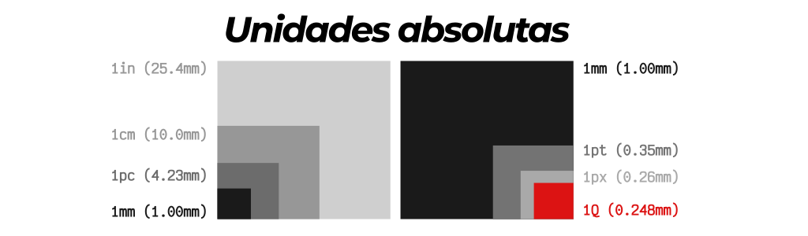
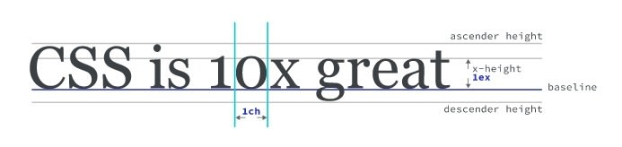
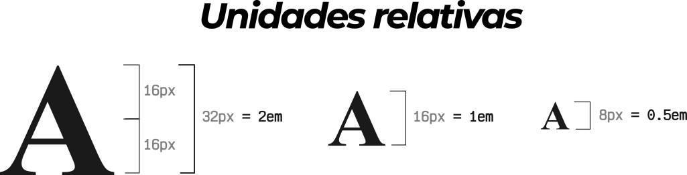
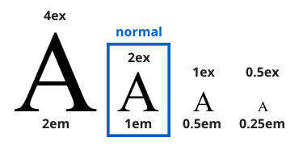
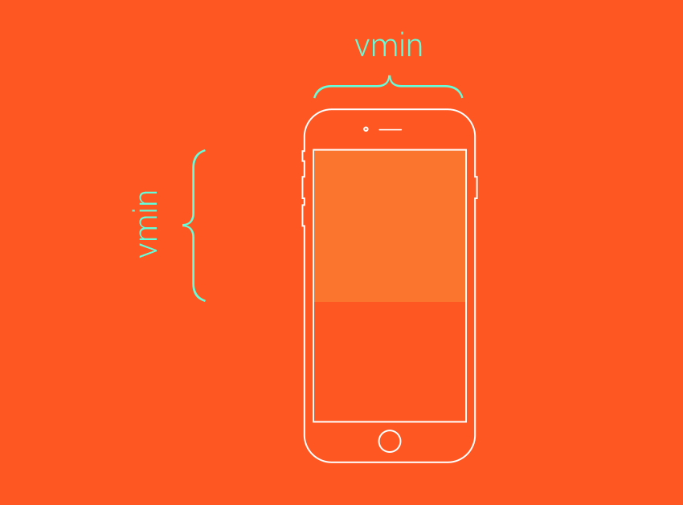
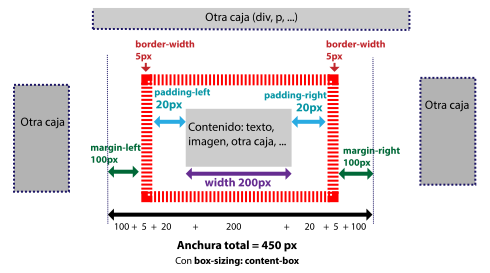
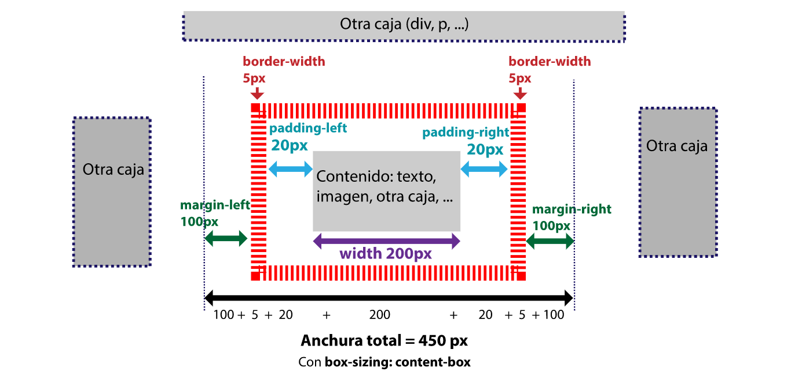
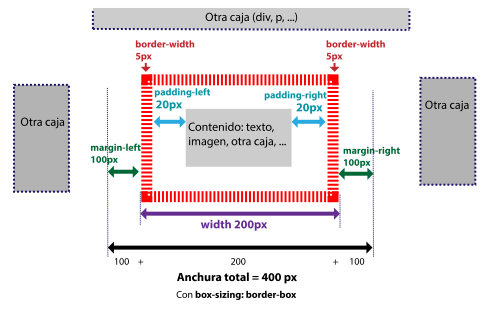

# Unidades de medida en CSS

---

En CSS tamén hai tipos de datos, as unidades de medida en CSS son un tipo de dato.

---

Os tipos de datos basicamente son o valor que asignamos a calquera propiedade.

---

Estes valores (tipos de datos) poden ser de diferentes tipos, por exemplo as unidades CSS son un tipo de dato

Outros tipos son as ``keywords`` palabras reservadas ou ou palabras clave como ``auto``, ``solid``, ``all``,... ou os valores de cor - ``#aabbcc``, `transparent,...`.

---

Algunhas propiedades CSS, como por exemplo ``width``, ``margin``, ``font-size`` reciben valores de lonxitude (``px``, ``em``, ``rem``, etc..). Este tipo de dato *denota medidas de distancia e serven para expresar unha dimensión*.

---

Dito doutro xeito: as unidades de medida - sexa cal sexa a que escollas - son fundamentais no código CSS da túa páxina.

Están presentes en practicamente todo o proxecto no modelo de caixa, o posicionamento, os tamaños dos elementos,...  Así que as veremos en propiedades como ``font-size`` , ``margin`` , ``padding`` , etc.

---

Todas se representa por un número seguido da súa unidade de medida (sen espazos).

---

De xeito xenérico podemos distribuílos en dous grandes grupos: **medidas absolutas** e **medidas relativas**.

---

## medidas absolutas

As **medidas absolutas** son *medidas físicas* (``cm, in, mm, pc, pt``) e a unidade ``px``.

Estas unidades se representan exactamente no tamaño que se lle da. O valor dado é o que se aplica sen mediar calculo ou referencia algunha.

As medidas absolutas,  **non son nada recomendables para a pantalla** . Aínda que sexan as máis axeitadas **para imprimir**, xa que os medios impresos adoitan medirse nesas unidades.

---



---

Só para facernos unha idea, a relación entre as medidas físicas absolutas é a seguinte:

## **1in = 2.54cm = 25.4mm = 72pt = 6pc**

---

Por outra banda, e dentro deste mesmo grupo de **medidas absolutas**, temos a unidade ``px``: o píxel.

Un píxel CSS é igual a un píxel do dispositivo, ou o que é o mesmo, a un punto da pantalla.

---

## medidas relativas

Como o nome indica, son relativas a outro valor e exprésanse en relación porcentual con dito valor referencial.  

Son escalables con respecto ao mesmo.

---

A vantaxe é que manterán as proporcións do deseño da páxina, polo que son moi **recomendables para traballar na pantalla**.

---

Estes valores establécense tomando como referencia:

### a) o tamaño das fontes

---

1. **rem:** É sempre relativo ao tamaño de fonte do elemento raíz que é `html`. Por defecto, a etiqueta `html`ten un tamaño de fonte de ``16px``, polo que ``1rem`` será igual a ``16px``. A maioría dos navegadores teñen este estándar no tamaño base da fonte que se asigna ao texto que vemos nun documento HTML - excluíndo os encabezados e o elemento `small`, entre outros-.

---

2. **em:** As unidades `em` para a propiedade `font-size`serán relativas ao `font-size` do elemento pai. Noutras propiedades que non sexan `font-size` serán relativas ao `font-size` elemento actual.

---

3. **ex:** Baseada na altura da “x” minúscula da fonte do elemento (depende da tipografía utilizada). A unidade ``ex`` é a metade do tamaño da fonte establecida polo navegador do usuario - que polo regular é ``16px = 1em``, entón a metade de ``16px`` é ``8``, polo que ``8/16 = 0.5``, polo que ``1ex`` é igual a ``.5em``.

   ---

   

   ---

4. **cap:** Baseada na altura das letras maiúsculas da fonte actual do elemento.

5. **ch:** Baseada na anchura do glifo “0” da letra do elemento.

   ---

   

   ---

6. **ic:** É unha medida nova que ten que ver coa anchura dos glifos. Para máis información pode consultar a especificación do w3c.

7. **lh:** Altura de liña do elemento.

8. **rlh:** Altura de liña do elemento raíz (html).

---

### b) o viewport - fiestra ou pantalla de visualización

1. Fiestra ou pantalla de visualización **vw** : en relación ao ancho da pantalla.
2. **vh** – Relativo á altura da pantalla.
3. **vmin** – Toma como referencia o valor máis pequeno entre vw e vh.
4. **vmax** – Toma como referencia o maior valor entre vw e vh.

---



---

| **medidas absolutas**                                        | **medidas relativas**                                        |
| ------------------------------------------------------------ | ------------------------------------------------------------ |
| **px** píxel<br>Aínda que é unha medida absoluta, é realmente relativa ao dispositivo de visualización (sexa impresión ou pantalla)<br>**1px CSS = 1 punto de pantalla**.<br>O píxel utilízase cando se quere ter un maior control das dimensións pero non sempre é a mellor opción cando se trata de páxinas web que se adaptan a calquera dispositivo (responsive) xa que o resultado será idéntico en todas as pantallas independentemente do tamaño. | **em**<br>Relativo ao tamaño da fonte do elemento pai.<br>Se ese elemento non ten un tamaño de letra definido, hérdao do pai, avó, etc. ata chegar ao html ou raíz (:root).<br>**1em** será igual ao valor da propiedade ``font-size`` que se está a usar por defecto, que sen cambios no documento CSS calculase como **1 em = 16 píxeles**<br>**``.container { font-size: 1.3em; }`` = ``.container { font-size: 20,8 px; }``** |
| **mm** milímetro                                             | **rem** raíz em<br>Relativo ao tamaño da fonte do html ou raíz (:root).<br>Dado que por defecto, un documento HTML ten un tamaño de letra de 16px, 1rem sempre será igual a 16px **a non ser que o cambiemos no elemento raíz**. |
| **cm** centímetro1 cm = 10 mm = 37,8 píxeles                 | **ex**<br>Relativo á altura x da fonte.<br>**1ex = 0,5 em**<br>A diferenza da unidade ``em``, a unidade ``ex`` cambia o seu valor se se cambia a familia de fontes. |
| **en** polgada1 polgada = 2,54 cm = 96 píxeles               | **ch** <br>Relativo a 0 (cero)Funciona igual que a unidade anterior excepto polo glifo ao que fai referencia. Ademais, o seu tamaño tamén cambia se se cambia a familia de fontes á súa vez. |
| **pt** punto1 punto = 1/72 polgadaEsta medida adoita utilizarse para imprimir. | **vw** ancho da vista<br>Relativo ao ancho da pantalla.1vw = 1% do ancho da pantalla. |
| **pc** pica1 unidade = 12 puntos                             | **vh** altura da vista<br>Relativo á altura da pantalla.<br>**1vh = 1% da altura da pantalla**. |
|                                                              | **vmin**<br>Toma como referencia o menor valor existente entre ``vw`` e ``vh``.<br>**1vmin = 1%** do valor máis baixo da pantalla (``vw`` ou ``vh``) |
|                                                              | **vmax** <br>Toma como referencia o maior valor existente entre ``vw`` e ``vh``. <br>**1vmax = 1 % do valor máis grande na pantalla (``vw`` ou ``vh``)**. |
|                                                              | **%** porcentaxe <br>Relativo á medida da mesma propiedade do seu elemento pai. <br>Por exemplo, se un elemento ten un ancho ancho: 1200px; e o seu fillo ten un ancho: 50%; o valor será igual á metade de 1200px. |

As **medidas relativas son máis vantaxosas para traballar en pantalla porque son escalables e flexibles** . Máis se se busca adaptar o deseño a calquera dispositivo ( **responsivo** ).

---



---

Elixir unha ou outra depende de ti: a que te faga sentir máis cómodo e por suposto, a que mellor se adapte ao tipo de proxecto no que estás a traballar será unha boa opción.

---



---

## Cálculo de ancho e alto

Os atributos **width** e **height** definen o ancho e o alto dos elementos HTML, son moi utilizados para definir a disposición da páxina, especialmente nos elementos contenedores (div, p, etc.). É importante ter en conta a que se refiren estes valores, xa que ás veces se comete o erro de crer que inclúen partes que realmente non inclúen.

Os atributos **width** e **height** definen o ancho e o alto dos elementos HTML, pero só inclúen o contido da etiqueta, non o **recheo** **,** a marxe **ou** o **bordo** .

Imos explicar o caso do **ancho** co seguinte esquema (a **altura** sería similar):



 

O esquema corresponde á definición dun contedor (por exemplo div ) con estes atributos:

```css
div {ancho: 200px; ancho do bordo: 5px; acolchado: 20px; marxe: 100px }
```

Por defecto (sen definir o **tamaño da caixa** ) debemos reservar un espazo de 450 px na nosa disposición de páxina, xa que debemos engadir o **recheo** e o **bordo ao** **ancho** do contido , e despois engadir a **marxe** . É dicir, 200 px, que ocupa o contido, máis 100 px, para cada lado da **marxe** ; outros 5px. a cada lado da **fronteira** ; outros 20px. para cada lado do **acolchado** .

Esta forma de calcular o ancho do modelo de caixa non é a máis intuitiva, e provocou numerosos erros no deseño, nalgúns casos pola súa complexidade e noutros por descoñecemento de como se calcula o ancho.

Afortunadamente, está a propiedade **do tamaño da caixa** que imos ver a continuación.

---

## box-sizing

A propiedad **box-sizing** indica cómo se calcula el ancho y alto de la etiqueta correspondiente. Tiene dos valores: **content-box** y **border-box**:

\- **content-box**, el ancho y el alto se calculan teniendo en cuenta sólo el **contenido**, **sin incluir** el **border** y el **padding**. Es el valor por defecto.

\- **border-box**, el ancho y el alto se calculan teniendo en cuenta el **contenido** y **también** el **border** y el **padding**. Es decir, el **border** y el **padding** están incluidos en el ancho y alto.

El caso de **content-box** lo hemos explicado en el punto anterior, ahora vamos a ver un esquema para ver el caso de **border-box**:



El esquema corresponde a la definición de un contenedor (por ejemplo div) con estos atributos:

```css
div { 
    box-size: border-box; 
    width: 200px; 
    border-width: 5px; 
    padding: 20px; 
    margin: 100px } 
```

El espacio que debemos reservar en nuestro diseño de la página es de 400 px., que corresponden al **width** del contenido y al **margin**. Es decir, 200 px, que ocupa el contenido, más 100 px, por cada lado del margin. En este caso los 5 px. por cada lado del **border**, y los 20 px. por cada lado del **padding**, **ya están incluidos** en el **width** del contenido.

A continuación puedes ver un primer ejemplo con box-sizing: border-box y un segundo ejemplo con el valor por defecto, box-sizing: content-box.

El resto de valores son igual para ambos ejemplos: border-width: 5px; border-style: solid; border-color: royalblue; padding: 20px; width: 200px; margin-left: 100px; margin-right: 100px;

Observa la diferencia de anchura.

Ejemplo con box-sizing: border-box :

Párrafo uno. Lorem ipsum dolor sit amet, consectetur adipisicing elit. eligendi porro ius soluta in voluptates voluptatem, nesciunt dolorem obcaecati nemo eligendi porro iusto, earum debitis. Lorem ipsum dolor sit amet, consectetur adipisicing elit.

Ejemplo con box-sizing: content-box :

Párrafo uno. Lorem ipsum dolor sit amet, consectetur adipisicing elit. eligendi porro ius soluta in voluptates voluptatem, nesciunt dolorem obcaecati nemo eligendi porro iusto, earum debitis. Lorem ipsum dolor sit amet, consectetur adipisicing elit.

---

XAN2023

---

[Tipos de unidades de medida en CSS. Recomendaciones para trabajar. (pensandoenweb.es)](https://pensandoenweb.es/unidades-medida-css/)

<https://dev.to/lupitacode/unidades-de-medida-en-css-fundamentos-4n0g>

<https://www.freecodecamp.org/news/html-role-attribute/>
