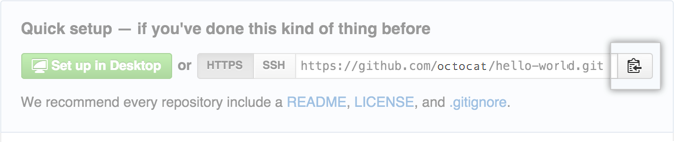

## Engadir un repositorio local a GitHub con GitHub CLI

1. Na liña de comandos, navega ata o directorio raíz do teu proxecto.

2. Inicializa o directorio local como repositorio Git.

   ```shell
   git init -b main
   ```

3. Prepara e confirma todos os arquivos do teu proxecto.

   ```shell
   git add . && git commit -m "initial commit"
   ```

4. Para crear un repositorio para o teu proxecto en GitHub, usa o subcomando `gh repo create`. Cando se te solicite, selecciona **Enviar un repositorio local existente a GitHub** e introduce o nome desexado para o teu repositorio. Se queres que o teu proxecto pertenza a unha organización en lugar da túa  conta de usuario, especifica o nome da organización e o nome do  proxecto con `organization-name/project-name`.

5. Sigue as indicacións interactivas. Para engadir o control remoto e empurrar o repositorio, confirma 'Si' cando se te solicite engadir o control remoto e empurra os commits á rama  actual.

6. Alternativamente, para omitir todas as solicitudes, proporciona a ruta ao repositorio coa marca `--source` e pasa unha marca de visibilidade ( `--public`, `--private`, ou `--internal`). Por exemplo, `gh repo create --source=. --public`. Especifica un control remoto coa marca `--remote`. Para impulsar os teus compromisos, emprega a marca `--push`. Para obter máis información sobre posibles argumentos ou marcas, consulta o [manual da CLI de GitHub](https://cli.github.com/manual/gh_repo_create) .

## Engadindo un repositorio local a GitHub usando Git

1. [Crea un novo repositorio](https://docs.github.com/en/repositories/creating-and-managing-repositories/creating-a-new-repository) en GitHub.com. Para evitar erros, non inicialice o novo repositorio con *README* , licenza ou `gitignore`arquivos. Podes engadir estes arquivos despois de que o teu proxecto fose enviado a GitHub.

   

2. Abre o terminal Git Bash .

3. Cambia o directorio de traballo actual ao teu proxecto local.

4. Usa o comando `init` para inicializar o directorio local como repositorio Git. Por defecto, a rama inicial chámase `main`.

   Se estás a usar Git 2.28.0 ou unha versión posterior, podes definir o nome da rama predeterminada usando `-b`.

   ```shell
   $ git init -b main
   ```

   Se estás a usar Git 2.27.1 ou unha versión anterior, podes definir o nome da rama predeterminada usando `&& git symbolic-ref HEAD refs/heads/main`.

   ```shell
   $ git init && git symbolic-ref HEAD refs/heads/main
   ```

5. Engade os arquivos no teu novo repositorio local. Isto os organiza para o primeiro compromiso.

   ```shell
   $ git add .
   # Adds the files in the local repository and stages them for commit. To unstage a file, use 'git reset HEAD YOUR-FILE'.
   ```

6. Confirma os arquivos que colócache no teu repositorio local.

   ```shell
   $ git commit -m "First commit"
   # Commits the tracked changes and prepares them to be pushed to a remote repository. To remove this commit and modify the file, use 'git reset --soft HEAD~1' and commit and add the file again.
   ```

7. Na parte superior do teu repositorio na páxina de configuración rápida de GitHub.com, fai clic para copiar o URL do repositorio remoto.                

​         

8. No Terminal, [engade o URL do repositorio remoto](https://docs.github.com/en/get-started/getting-started-with-git/managing-remote-repositories) onde se enviará o repositorio local.

   ```shell
   $ git remote add origin <REMOTE_URL>
   # Sets the new remote
   $ git remote -v
   # Verifies the new remote URL
   ```

9. [Envía os cambios](https://docs.github.com/en/get-started/using-git/pushing-commits-to-a-remote-repository) no teu repositorio local a GitHub.com.

   ```shell
   $ git push -u origin main
   # Pushes the changes in your local repository up to the remote repository you specified as the origin
   ```

## Lecturas adicionais

- " [Engadir un arquivo a un repositorio](https://docs-github-com.translate.goog/en/repositories/working-with-files/managing-files/adding-a-file-to-a-repository?_x_tr_sl=auto&_x_tr_tl=gl&_x_tr_hl=es#adding-a-file-to-a-repository-using-the-command-line) "