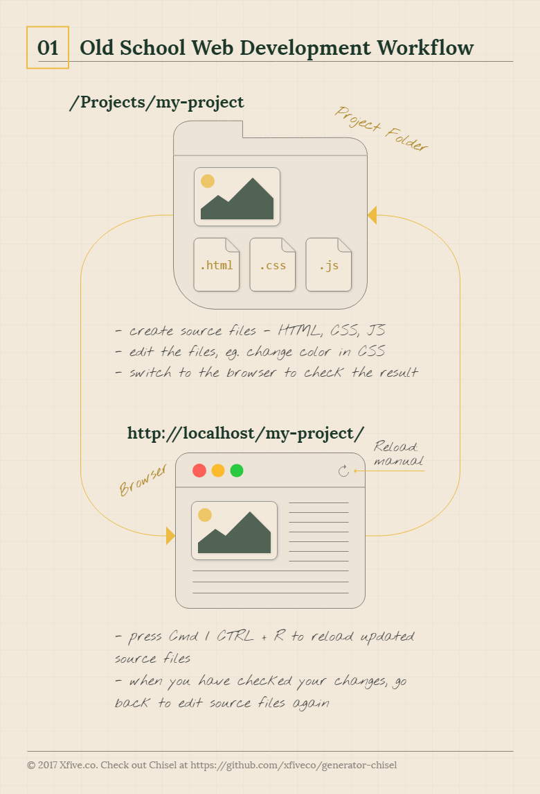

## **fluxos de traballo modernos de desenvolvemento web**

*_ref: https://www.xfive.co/blog/craft-perfect-websites-chisel/* 

xa nada parece tan sinxelo como cando desenvolver sitios web era tan simple como gardar un arquivo .html e logo abrilo con algún navegador.

### Fluxos de traballo

### 1) Desenvolvemento web da vella escola

O fluxo de traballo de desenvolvemento web d**a vella escola** é bastante  sinxelo: crea e edita ficheiros fonte como HTML, CSS ou JavaScript e  logo volve cargar a páxina no navegador para amosar a versión  actualizada do sitio web composta por estes ficheiros.



Os ficheiros fonte cárganse no navegador a medida que se gardan no  disco, polo que non hai ningunha transformación.  Por exemplo, se  comparas a fonte de CSS no navegador debería ser o mesmo que no ficheiro que estás editando no editor de texto. 

#### Pros

- Fácil de entender 
- Rápido para comezar incluso para principiantes 
- Non se precisa configuración 
- Non hai problemas co informe e a depuración de erros xa que os ficheiros non se transforman de ningún xeito 

#### Contra

- Non hai soporte para técnicas modernas como os preprocesadores CSS 
- Non se admite a optimización automática de datos (minificación CSS, optimización de imaxe, etc.) 
- Máis difícil de manter en proxectos medianos a grandes 
- Necesitas recargar manualmente o navegador despois de cada cambio 

## 2) A vella escola con modelos

É só unha lixeira variación do primeiro.  Para aforrar tempo na configuración do proxecto, o programador ten ficheiros  preparados como modelos e cópiaos a un novo cartafol do proxecto.  Poden ter varios modelos preparados para varios tipos de proxectos.  O resto  do fluxo de traballo é o mesmo que o primeiro fluxo de traballo. 


Pode parecer que este pequeno cambio non supón unha modificación substancial do fluxo de  traballo.  Non obstante, esta idea inicial dos modelos van a ser unha parte importante do concepto de xerador, que acabará incorporándose a moderna optimización  dos fluxos de traballo. 

### 3) Desenvolvemento web moderno 

Os fluxos de traballo de desenvolvemento web modernos xurdiron cando  apareceron novas extensións ás linguaxes de desenvolvemento web, por  exemplo, [Sass ](http://sass-lang.com/)como extensión a CSS. Como os navegadores non entenden Sass, necesitamos **transformar** o ficheiro Sass orixinal en CSS antes de envialo ao navegador. En vez de  facer esta transformación manualmente usando ferramentas externas,  podemos **configurar**  **ferramentas** como parte do noso proxecto e **definir tarefas** que se encargarán destes cambios. 


As ferramentas adoitan ser varios [Node.js. ](https://nodejs.org/en/)módulos **Node.js** é un **tempo de execución de JavaScript** que necesitamos instalar no noso ordenador para poder usar os módulos Node. Podemos instalar módulos de nodo usando o xestor de paquetes de nodos - [npm ](https://www.npmjs.com/). Hai miles de módulos para varias tarefas, por exemplo, o [gulp-sass ](https://www.npmjs.com/package/gulp-sass)módulo que transforma Sass en CSS. 

Como instruímoslle ao ordenador as **ferramentas para executar os** nosos ficheiros de proxecto? Facémolo creando **tarefas** . As tarefas pódense executar manualmente desde a liña de comandos ou  automaticamente cando cambian os ficheiros. Isto conséguese cunha  especial de **tarefa vixilancia** que vixía os cambios nos ficheiros e executa outras tarefas cando os ficheiros cambian. En conxunto con outras tarefas para **recargar automaticamente o sitio web nun navegador** , pode crear un ambiente de desenvolvemento favorable. 

As definicións de ferramentas e tarefas están escritas nun ficheiro especial - **package.json** . As tarefas tamén se definen a miúdo usando corredores de tarefas separados como [Gulp, ](http://gulpjs.com/)que poden permitir a personalización de tarefas adicionais. 

Os ficheiros transformados por tarefas adoitan almacenarse nun especial **cartafol dist** . Dist significa distribución ou distribución e significa que estes  ficheiros están listos para o seu uso en produción (por exemplo, están  reducidos). 

Hai unha gran cantidade de tarefas que podemos definir nos nosos proxectos, imos citar algunhas: 

- *Preprocesadores CSS* : transformando Sass ou [Less ](http://lesscss.org/)en CSS 
- *idiomas de modelos* - por exemplo. convertendo [Twig ](http://twig.sensiolabs.org/)a HTML 
- *concatenación de ficheiros* : facer un ficheiro a partir de máis ficheiros para reducir o número de solicitudes HTTP 
- *minificación* : eliminar espazo en branco para reducir o tamaño do ficheiro 
- *linting* : validación do ficheiro contra un conxunto de regras 
- *Validación HTML* 
- *optimización de imaxe* 
- *en directo recargando* 
- … e moitos máis 

#### Pros

- miles de módulos de nodo (ferramentas) para todas as tarefas comúns 
- elimina as tediosas tarefas manuais do fluxo de traballo de desenvolvemento 
- sen necesidade de recarga manual 

#### Contra

- tempo engadido para a transformación de ficheiros 
- a configuración inicial pode ser complicada para un principiante 
- novas ferramentas para aprender 

### Fluxo de traballo moderno con aplicacións

Hai unha variación deste fluxo de traballo. Aplicacións como [Prepros ](https://prepros.io/)ou [Codekit ](https://codekitapp.com/)permiten a configuración rápida e admiten moitas tarefas mencionadas  anteriormente como preprocesadores, optimización de ficheiros, recarga  en directo. 

#### Pros

- Configuración mínima.  Instala a aplicación e goza. 
- É bo comezar coas ferramentas modernas: podes comezar a aprendelas sen problemas. 

#### Contra:

- Estas aplicacións normalmente non son gratuítas. 
- Todas as persoas do teu equipo terán que usar a mesma aplicación  para asegurarte de compilar os mesmos ficheiros e aproveitar o fluxo de  traballo asociado.    

## 4) Fluxo de traballo moderno con modelos

Este fluxo de traballo é como o anterior, pero usamos modelos para  aforrar tempo e evitar configurar o noso proxecto desde cero.  Esta vez  tamén empregamos modelos para a definición de tarefas e ferramentas. 


Unha vez que copiamos os ficheiros necesarios, podemos editalos e axustalos ás necesidades específicas do proxecto. 

## 5) Modern Workflow cun xerador 

O último enfoque é a evolución do fluxo de traballo moderno de desenvolvemento web. Usamos un **xerador** para configurar un proxecto segundo as nosas necesidades. 

Nós **executar o xerador na liña de comandos** na nova carpeta de proxecto. O xerador fai un par de **preguntas sobre as nosas preferencias** para o proxecto concreto ás que respondemos directamente na liña de  comandos. Despois configura a estrutura e os ficheiros do proxecto e  tamén nos instala módulos Node. Este proceso tamén se denomina **estada** . 

Un **xerador ten modelos** almacenados nel e ademais de copialos no cartafol do proxecto pode **procesar o seu contido en** función das nosas respostas. Así, por exemplo, pode encher os nomes dos  proxectos nos ficheiros. Ou pode crear determinados ficheiros e tarefas  dependendo das nosas respostas. 


Un xerador tamén pode ter comandos individuais que nos permiten  realizar novas modificacións do proxecto incluso unha vez que o proxecto xa está configurado, por exemplo, para engadir novas páxinas ao noso  proxecto. 

A ferramenta máis común para crear xeradores é [Yeoman ](http://yeoman.io/). Hai unha serie de [xeradores, cada un deles para diferentes tipos de proxectos ](http://yeoman.io/generators/). En primeiro lugar, debemos coller un que sexa adecuado para o noso tipo de proxecto. Nós **instala-lo globalmente** , e podemos comezar a usalo. Se non atopamos un xerador adecuado, podemos incluso [crear o noso propio xerador ](http://yeoman.io/authoring/). 

Algunhas das bibliotecas de desenvolvemento web máis populares, como **React** ou **Vue.js,** tamén teñen ferramentas para crear novos proxectos que usan conceptos  similares como os xeradores de Yeoman, aínda que non usen Yeoman. ( [Mire Crear aplicación React ](https://github.com/facebookincubator/create-react-app)ou [vue-cli ](https://github.com/vuejs/vue-cli).) 

### Pros 

- configuración inicial sinxela incluso para principiantes 
- número de xeradores para diferentes tipos de proxectos 
- permite unha maior personalización do proxecto segundo as súas necesidades 
- elimina a tediosa tarefa manual do fluxo de traballo de desenvolvemento 
- sen necesidade de recarga manual 

### Contra 

- tempo engadido para a transformación de ficheiros 
- é posible que precise axustar as tarefas e ferramentas xeradas se se precisa máis personalización 


## Comparación de fluxos de traballo 

Compare todos os fluxos de traballo uns ao lado dos outros nunha imaxe. 


### Xeradores modernos

SSG

**Chisel** é un xerador desenvolvido por [Xfive](https://www.xfive.co). En esencia  é un xerador de Yeoman para configurar e desenvolver proxectos front-end e/ou de WordPress. 

E é por ese enfoque no desenvolvemento de WordPress polo que resulta especialmente atractivo. Con Chisel poderás desenvolver proxectos de WordPress baseados na [biblioteca Timber ](https://www.upstatement.com/timber/). 

Asemade Chisel  inclúe moitas funcións que soportan o desenvolvemento moderno de front-end desde cero.  Como: 

#### A Templating system

- [Twig](http://twig.sensiolabs.org/) templating engine

#### Styles

- SCSS with [ITCSS architecture](https://www.xfive.co/blog/itcss-scalable-maintainable-css-architecture/)

#### JavaScript

- optional ES6 with [Babel](https://babeljs.io/)
- [webpack](https://webpack.js.org/)
- optional jQuery

#### Linting and validation

- [stylelint](http://stylelint.io/)
- [Prettier](https://prettier.io/)
- [ESLint](http://eslint.org/) with [config tailored for Chisel](https://github.com/xfiveco/eslint-config-chisel) and [Prettier](https://prettier.io/) synced together for consistent and hassle free code formatting
- HTML validation with [htmlhint](https://github.com/bezoerb/gulp-htmlhint)

#### Build and dev tools

- [Gulp](http://gulpjs.com/) build system
- [Browsersync](https://www.browsersync.io/)
- [gulp-rev](https://github.com/sindresorhus/gulp-rev) support

#### WordPress support

- Automatic [WP-CLI](http://wp-cli.org/) based WordPress and plugins installation
- Automatic [Timber](http://upstatement.com/timber/) library facility to support Twig templates
- Chisel starter theme with the same workflow as for front-end projects
- WordPress page generation from command line


### [Craft Perfect Websites with Chisel](https://www.xfive.co/blog/craft-perfect-websites-chisel/)

[Chisel](https://github.com/xfiveco/generator-chisel) is a Yeoman generator for scaffolding and developing front-end and WordPress projects.        


## WSL

yo = yeoman

chisel    - wordpress developement / front en templates(?)

Primeiro instale [Node.js ](http://nodejs.org/)para que poida traballar con npm, o xestor de paquetes Node. É necesaria a versión 6+. 

A continuación, instale [Yeoman ](http://yeoman.io/), [Gulp ](http://gulpjs.com/)e Chisel desde a súa liña de comando. 

```javascript
npm install -g yo generator-chisel
```

Xa está listo para usar Chisel.  Crea un novo cartafol de proxecto, abre unha liña de comandos nel e escribe: 

```bash
 yo chisel
? ==========================================================================
We're constantly looking for ways to make yo better!
May we anonymously report usage statistics to improve the tool over time?
More info: https://github.com/yeoman/insight & http://yeoman.io
========================================================================== No

 *********************************************

  Welcome to Chisel

  https://github.com/xfiveco/generator-chisel

 *********************************************

? Please enter the project name: Pro Wp Dev
? Please enter author name: nunhes
? Please select project type: WordPress Website
? Include jQuery? Yes
? Would you like to configure vendor bundle for jQuery plugins? Yes

WORDPRESS SETUP

? Enter title for the new site: Pro Wp Dev
? Enter URL: http://pro-wp-dev.test/
? Enter admin user: aroela
? Enter admin password: [hidden]
? Enter admin email: nunhes@gmail.com
? Where do you want to place the 'src' folder: Project root folder
? Enter the database host: 127.0.0.1
? Enter the database port: 3306
? Enter the database name: pro-wp-dev
? Enter the database user: phpmyadmin
? Enter the database password: [hidden]
Error when testing database connection:
Error: ER_NOT_SUPPORTED_AUTH_MODE: Client does not support authentication protocol requested by server; consider upgrading MySQL client
```

____

*Non ten por que ocorrer pero se xurde algún erro, deberemos proceder a solucionalo antes de avanzar. Algún erro na instalación de phpMyAdmin obrígame a resolver esta continxencia*

Solución ao problema de privilexios de usuarios con phpmyadmin

```bash
ALTER USER 'phpmyadmin'@'localhost' IDENTIFIED WITH mysql_native_password BY 'admin';
```

*Sacado de [stackoverflow.com](https://stackoverflow.com/questions/50093144/mysql-8-0-client-does-not-support-authentication-protocol-requested-by-server)*

Execute the following query in MYSQL Workbench

```
ALTER USER 'root'@'localhost' IDENTIFIED WITH mysql_native_password BY 'password';
```

Where `root` as your user `localhost` as your URL and `password` as your password

Then run this query to refresh privileges:

```
flush privileges;
```

Try connecting using node after you do so.

If that doesn't work, try it without `@'localhost'` part.

____

**…continuamos:**

```bash
? Enter the database host: localhost
? Enter the database port: 3306
? Enter the database name: pro-wp-dev
? Enter the database user: root
? Enter the database password: [hidden]
? Select optional plugins Classic Editor, Advanced Custom Fields Pro, Gravity Forms, WP Sync DB, WP Sync DB Media File Addon

INSTALLATION


I'm all done. Running yarn install for you to install the required dependencies. If this fails, try running the command yourself.


   create package.json
    force .yo-rc.json
   create .babelrc
   create .browserslistrc
   create .editorconfig
   create .eslintignore
   create .eslintrc
   create .gitattributes
   create .htmlhintrc
   create .prettierignore
   create .prettierrc
   create .stylelintignore
   create .stylelintrc.yml
   create .gitignore
   create src/assets/fonts/.keep
   create src/assets/images/.keep
   create webpack.chisel.config.js
   create README.md
   ....
   // install all Wordpress staff
```

Responde as preguntas do cincel segundo as necesidades do seu proxecto e agarde ata que finalice a instalación. 

Despois, para engadir o tipo de primeira páxina: 

```javascript
yo chisel:page "Home"
```

Finalmente inicia un servidor de desenvolvemento e tarefas que procesarán os teus modelos, estilos e scripts. 

```javascript
npm run dev
```

O continuo **desenvolvemento do proxecto existente tamén** é  sinxelo; non esquezas que este proxecto xa se configurou con Chisel,  polo que non tes que configuralo de novo. Todo o que tes que facer cando clonaches o repositorio existente é executalo 

```javascript
npm install
```

para instalar módulos Node.  Entón podes correr 

```javascript
npm run dev
```

Se **continúas desenvolvendo** un **proxecto de WordPress** , executa o seguinte comando, *wp-config* e *creará o -local.php dev-vhost.conf* ficheiro (se o necesitas) 

```javascript
yo chisel:wp-config
```

A continuación, cree unha base de datos, importe o volcado da base de datos e execute 

```javascript
npm install
```

para instalar módulos Node.  Finalmente, pode construír o proxecto usando 

```javascript
npm run build
```

ou executa a tarefa de desenvolvemento 

```javascript
npm run dev
```

Para obter documentación detallada consulte [getchisel.co ](https://www.getchisel.co/)

# Non funciona!!!


# 2.

Sitio estático

```bash
$ mkdir chisel-static
$ cd chisel-static
$ chisel create
chisel: command not found
$ yo chisel

 *********************************************

  Welcome to Chisel

  https://github.com/xfiveco/generator-chisel

 *********************************************

? Please enter the project name: Chisel Static
? Please enter author name: nunhes
? Please select project type: Front-end Templates
? Include jQuery? Yes
? Would you like to configure vendor bundle for jQuery plugins? Yes

INSTALLATION


I'm all done. Running yarn install for you to install the required dependencies. If this fails, try running the command yourself.


   create package.json
    force .yo-rc.json
   create .babelrc
   create .browserslistrc
   create .editorconfig
   create .eslintignore
   create .eslintrc
   create .gitattributes
   create .htmlhintrc
   create .prettierignore
   create .prettierrc
   create .stylelintignore
   create .stylelintrc.yml
   create .gitignore
   create src/assets/fonts/.keep
   create src/assets/images/.keep
   create webpack.chisel.config.js
   create index/project-index.html
   create index/css/main.css
   create index.html
   create README.md
   create src/templates/components/footer.twig
   create src/templates/components/header.twig
   create src/templates/layouts/base.twig
   create src/templates/layouts/page.twig
   create src/styles/vendor/.keep
   create src/styles/main.scss
   create src/styles/components/_btn.scss
   create src/styles/components/_footer.scss
   create src/styles/components/_header.scss
   create src/styles/elements/_blockquote.scss
   create src/styles/elements/_headings.scss
   create src/styles/elements/_hr.scss
   create src/styles/elements/_html.scss
   create src/styles/elements/_images.scss
   create src/styles/elements/_links.scss
   create src/styles/elements/_lists.scss
   create src/styles/elements/_tables.scss
   create src/styles/generic/_box-sizing.scss
   create src/styles/generic/_font-face.scss
   create src/styles/generic/_normalize.scss
   create src/styles/generic/_reset.scss
   create src/styles/generic/_shared.scss
   create src/styles/objects/_layout.scss
   create src/styles/objects/_list-bare.scss
   create src/styles/objects/_list-inline.scss
   create src/styles/objects/_media.scss
   create src/styles/objects/_table.scss
   create src/styles/objects/_wrapper.scss
   create src/styles/settings/_global.scss
   create src/styles/tools/_breakpoints.scss
   create src/styles/tools/_clearfix.scss
   create src/styles/tools/_hidden.scss
   create src/styles/utilities/_align.scss
   create src/styles/utilities/_clearfix.scss
   create src/styles/utilities/_hide.scss
   create src/scripts/vendor/.keep
   create src/scripts/app.js
   create src/scripts/modules/greeting.js
   create src/scripts/vendor.json
   create gulpfile.js
   create gulp/NameAllModulesPlugin.js
   create gulp/helpers.js
   create gulp/prepareConfig.js
   create gulp/templatesFunctions.js
   create gulp/tasks/assets.js
   create gulp/tasks/build.js
   create gulp/tasks/lint.js
   create gulp/tasks/report.js
   create gulp/tasks/scripts.js
   create gulp/tasks/serve.js
   create gulp/tasks/styles.js
   create gulp/tasks/templates.js
   create gulp/tasks/vendor.js
yarn install v1.22.5
warning package.json: No license field
info No lockfile found.
warning chisel-static@0.0.1: No license field
[1/5] Validating package.json...
warning chisel-static@0.0.1: No license field
error chisel-static@0.0.1: The engine "node" is incompatible with this module. Expected version "^8.10.0 || ^10.13.0". Got "14.17.5"
error Found incompatible module.
info Visit https://yarnpkg.com/en/docs/cli/install for documentation about this command.
$ code .
$ yarn

// wait to install all dependencies
```

**Cando actualizamos as dependencias dun repositorio e convinte eliminar o vello cartafol de modulos de Node e volver a encetar:**

```bash
rm -rf node_modules && yarn

///or

rm -rf node_modules && npm install
```

