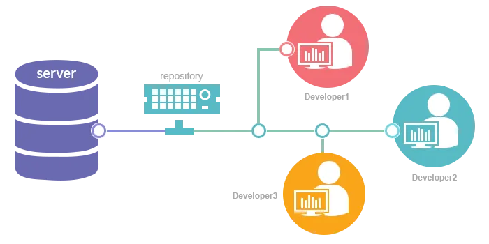
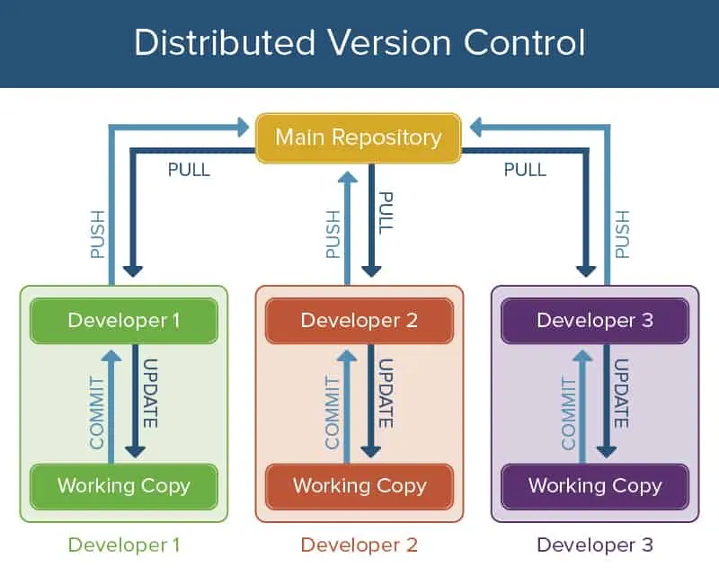

# Sistemas de control de versións (VCS): por que tan importante?

## Que é un sistema de control de versións (VCS)?

Os sistemas de control de versións son basicamente unha categoría de ferramentas de software que axudan a gardar e identificar os cambios realizados nos ficheiros de programas informáticos, documentos ou outras coleccións de información para que sexa máis fácil rastrexar eses cambios mesmo despois dun longo período de tempo. Faise máis interesante e útil para os desenvolvedores porque se poden restaurar as revisións.

## Por que hai tanta demanda dun sistema de control de versións?

Un sistema de control de versións sempre foi a necesidade dos DEV. Nos primeiros tempos, cando os equipos non eran tan grandes, tamén manter os rexistros de desenvolvemento da programación durante todo o desenvolvemento de software non era un pouco fácil. Inclúe moita e moita documentación e levou moito tempo. A través do desenvolvemento da tecnoloxía e dos estilos de traballo, prodúcese un novo tipo de problema que foi cando un equipo de desenvolvedores traballando nun proxecto, pode ser posible que estean traballando desde diferentes lugares e cada un deles teña que contribuír a algún tipo de características, entón compartir códigos para discutir e fusionar convértese nun traballo tedioso.

Entón, había dous problemas principais, o primeiro era a documentación e o segundo era fusionar códigos nun só lugar sen ningún tipo de conflito. Para resolver estes problemas, os desenvolvedores crearon un sistema de control de versións. VCS permite aos usuarios recuperar os ficheiros ao seu estado anterior, os usuarios poden incluso retrotraer todo o proxecto ao seu estado inicial, poden comparar os cambios, poden ver quen modificou o proxecto e cando.

## Beneficios que non podes ignorar

- Mellora a velocidade de desenvolvemento do proxecto
- Proporcionar unha colaboración moi eficiente dentro do equipo
- Reduce a posibilidade de erros e conflitos
- Incluso un cambio moi pequeno é rastrexable
- Os desenvolvedores poden contribuír ao proxecto desde calquera lugar
- Para diferentes colaboradores, pódese manter unha copia diferente e verificala antes de fusionarse co proxecto principal
- É posible a recuperación do estado anterior
- Moita información sobre quen, por que e cando se pode acceder
- Aforra moito tempo para o teu café.

## Tipos de sistema de control de versións

- Sistemas de control de versións locais
- Sistemas de control de versións centralizados
- Sistemas de control de versións distribuídos

***Sistema local de control de versións:\*** basicamente mantén a pista dos ficheiros dentro do sistema local. É o máis sinxelo pero o máis propenso a erros. As posibilidades de reescribir un ficheiro por erro son moi grandes.

***Sistema de control de versións centralizado:\*** nun VCS centralizado gárdanse basicamente as instantáneas dos cambios no servidor. O servidor principal ou centralizado rastrexa todos os cambios. Cada usuario pode ter a súa rama na que pode realizar cambios e combinarse coa rama principal despois de revisar.

***Sistema de control de versións distribuídas:\*** en Distributed VCS o usuario clona completamente unha copia dos ficheiros do servidor no seu repositorio local. Polo tanto, cada usuario ten unha copia de seguridade dos ficheiros do servidor. Polo tanto, isto supera o inconveniente do Control centralizado de versións, xa que aínda que o servidor caia ou falla ou morre, cada usuario ten unha copia de seguridade que se pode restaurar de novo no servidor.

## 5 Ferramentas VCS de código aberto gratuítas para comprobar

Existen varios sistemas de control de versións dispoñibles para o seu uso. Algúns deles son medios de código aberto de uso gratuíto e tamén podes contribuír ao seu código fonte. Abaixo está a lista dos principais sistemas gratuítos de control de versións de código aberto coa ligazón aos seus sitios oficiais. Podes pasar pola parte de documentación destas ligazóns para saber máis sobre estas ferramentas

- **[Git](https://git-scm.com/)**

  Git é un sistema de control de versións distribuído gratuíto e de código aberto deseñado para xestionar todo, desde pequenos ata moi grandes...www.git-scm.com

- **[Controis de versións simultáneas (CVS)](https://www.nongnu.org/cvs/)**

  CVS - Control de versións de código aberto CVS é un sistema de control de versións, un compoñente importante da Xestión da configuración de orixe (SCM). Utilizándoo podes...www.nongnu.org

- **[Apache Subversion (SVN)](https://subversion.apache.org/)**

  Apache Subversion"Control de versións centralizado de clase empresarial para as masas" Benvido a subversion.apache.org, a casa en liña do...subversion.apache.org

- **[Mercurial](https://www.mercurial-scm.org/)**

  Mercurial SCMMercurial é unha ferramenta de xestión de control de fontes distribuída gratuíta. Xestiona de forma eficiente proxectos de calquera tamaño e ofrece...www.mercurial-scm.org

- **[Bazaar](https://bazaar.canonical.com/en/)**

  Bazaar é un sistema de control de versións que che axuda a rastrexar o historial do proxecto ao longo do tempo e a colaborar facilmente con...bazaar.canonical.com

Se queres obter máis información sobre calquera ferramenta concreta da lista anterior, podes ir ás ligazóns indicadas.

---

***\_ref:***

- [https://medium.com/@knoldus/version-control-systems-vcs-why-so-important-64dde62944b7](https://medium.com/@knoldus/version-control-systems-vcs-why-so-important-64dde62944b7)
