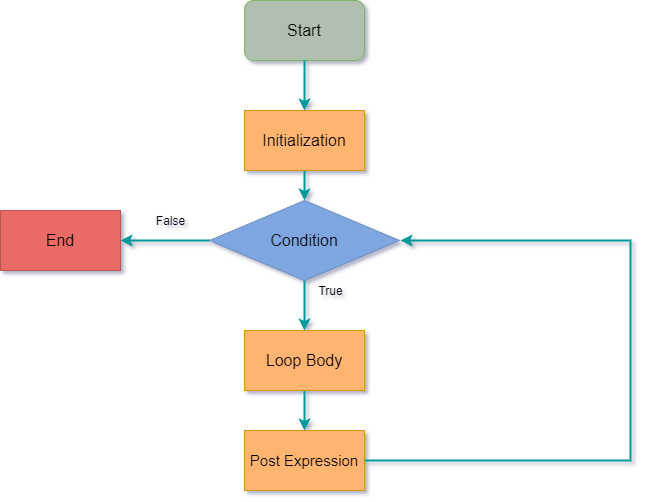
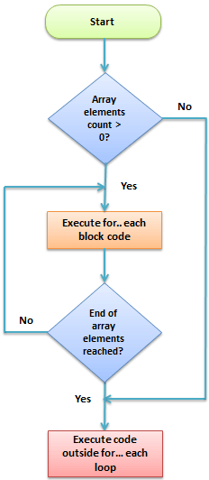
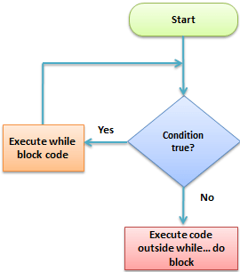
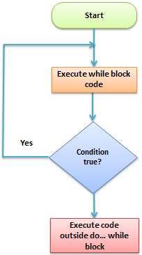

# PHP Loop: For, ForEach, While, Do While

Un bucle é unha estrutura de control iterativa que implica executar o  mesmo número de código varias veces ata que se cumpra unha determinada condición.

### PHP `for` 

**``for``** ten a seguinte **sintaxe básica:

```php
<?php
	for (initialize; condition; increment){
		//código a executar
	}
?>
```

-  **"for…{…}"** é o bloque do bucle (loop)
- "**initialize**" normalmente é un número enteiro; úsase para establecer o valor inicial do contador.
-  **"condition"** é a condición que se avalía para cada execución de php. Se se avalía como verdadeiro, a execución do bucle for... continúa. Se se avalía como falso, a execución do bucle for... finaliza.
-  **"increment"** úsase para incrementar o valor inicial do enteiro contador.

**Como funciona**

O diagrama de fluxo que se mostra a continuación ilustra como funciona o bucle for en php

 

​                           

**Como usar**

O seguinte código usa o bucle "for..." para imprimir os valores de multiplicar 10 por valores dende 0 ata 10

```php
<?php
	for ($i = 0; $i < 10; $i++){
		$product = 10 * $i;
		echo "O produto de 10 * $i é $product <br/>";
	}
?>
```

**Saída:**

```html
O produto de 10 x 0 é 0
O produto de 10 x 1 é 10
O produto de 10 x 2 é 20
O produto de 10 x 3 é 30
O produto de 10 x 4 é 40
O produto de 10 x 5 é 50
O produto de 10 x 6 é 60
O produto de 10 x 7 é 70
O produto de 10 x 8 é 80
O produto de 10 x 9 é 90
```

### PHP  ``foreach`` 

O bucle ``foreach`` úsase para *iterar* a través dos valores da matriz. Ten a seguinte sintaxe básica:

```php
<?php
foreach($array_variable as $array_values){
    //código a executar
}
?>
```

-  **"foreach(…){…}"** é o código do bloque de bucle ``foreach``
-  **"$array_data"** é a variable da matriz que se debe realizar en bucle
-  **“$array_value”** é a variable temporal que contén os valores actuais dos elementos da matriz.
- "// código a executar..." é a peza de código que opera sobre os valores da matriz

**Como funciona**

O diagrama de fluxo que se mostra a continuación ilustra como funciona o bucle ``foreach``

               

**Exemplo**

O código a continuación usa ``foreach``  para ler e imprimir os elementos dunha matriz:

```php
<?php
	$animals_list = array("Can","Lobo","Xabarín","Leitón","Toupa");
	foreach($animals_list as $array_values){
		echo $array_values . "<br>";
	}
?>
```

**Saída:**

```html
Can
Lobo
Xabarín
Leitón
Toupa
```

Vexamos outro exemplo que se executa sobre unha **matriz asociativa** - *associative array*.

:eye: a sintaxe para crear unha matriz asociativa usando a función array () é

```php
$myarray = array(key=>value, key=>value, key=>value)
```

Unha matriz asociativa pode usar cadeas alfanuméricas para claves e valores.

```php
<?php
$persoas = array("Isabel" => "Muller", "Xoán" => "Home", "Marta" => "Muller");
   foreach($persoas as $key => $value){
   echo "$key é $value"."<br>";
}
?>
```

Os nomes utilizáronse como claves de matriz e o xénero como valores.

**Saída:**

```html
Isabel é Muller
Xoán é Home
Marta é Muller
```

## Loop While

### PHP ``while ``

Utilízanse para executar un bloque de código a repetidamente ata que se cumpra a condición establecida

**Cando usar bucles while**

- Os bucles `while` utilízanse para executar un bloque de código ata que se faga verdadeira unha determinada condición.
- Podes usar un bucle `while` para ler os rexistros devoltos dunha consulta de base de datos.

**Tipos de bucles while**

-  **do... while** : executa o bloque de código polo menos unha vez antes de avaliar a condición
-  **while...** : comproba a condición primeiro. Se se avalía como verdadeira, o bloque de código execútase sempre que a condición sexa verdadeira. Se se avalía como falsa, finaliza a execución do bucle``while``.

**Bucle ``while``**

Ten a seguinte sintaxe

```php
<?php
	while (condition){
		//código a executar
	}
?>
```

-  **"while(…){…}"** é o bloque de código do bucle while
-  **"condition"** é a condición que debe ser avaliada polo bucle while
-  **// código a executar...** é o código que se vai executar se se cumpre a condición

**Como funciona**

O diagrama de fluxo que se mostra a continuación ilustra como funciona o bucle while...

               

O seguinte código usa o bucle while... para imprimir os números do 1 ao 5.

```php
<?php
    $i = 0;
	while ($i < 5){
        echo $i + 1 . "<br>";
        $i++;
	}
?>
```

**Saída:**

```html
1
2
3
4
5
```

### PHP ``Do While``

A diferenza entre ``while...``  e ``do... while`` é que ``do... while`` execútase polo menos unha vez antes de avaliar a condición.

Vexamos agora a sintaxe básica dun bucle ``do... while``

​                           

```php
<?php
	do{
		//código a executar
	} while(condition);
?>
```

mentres(condición);

**AQUÍ,**

-  **“do{…} while(…)”** é o código do bloque do bucle while
-  **"condition"** é a condición que debe ser avaliada polo bucle while
-  **"//código a executar"** é o código que se executa polo menos unha vez polo bucle do... while

**Como funciona**

O diagrama de fluxo que se mostra a continuación ilustra como funciona o bucle do...while...

               

 **Exemplo**

Agora imos modificar o exemplo de bucle while... e implementalo usando o  bucle do... while e establecer o valor inicial do contador en 9.

O seguinte código implementa o exemplo modificado anteriormente

```php
<?php
	$i = 3;
	do{
    echo "Agora é $i"." <br>";
} while($i++ < 9);
?>
```

**Saída:**

```html
Agora é 3
Agora é 4
Agora é 5
Agora é 6
Agora é 7
Agora é 8
Agora é 9 
```

Ou

```php
<?php
	$i = 9;
	do{
    echo "Agora é $i"." <br>";
} while($i++ < 9);
?>
```

**Saída:**

```html
Agora é 9 
```

*Aínda que non hai cifras menores a 9 o bucle do... while execútase polo menos unha vez, e responde cun valor .*

## Resumo

- O bucle ``for...`` úsase para executar un bloque un número especificado de veces
- O bucle ``foreach...`` úsase para recorrer matrices
- O bucle ``while...`` úsase para executar un bloque de código até que a condición establecida sexa falsa 
- O bucle ``do... while`` úsase para executar o bloque de código polo menos  unha vez, entón o resto da execución depende da avaliación da condición establecida


---

Podes probar os exemplos en:

https://www.w3schools.com/php/phptryit.asp?filename=tryphp_compiler