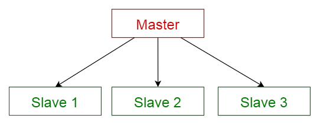

# Arquitecturas Web: Entendendo a estrutura do proxecto

Cando se fala de arquitectura web nos estamos referindo á estrutura esencial dun sistema ou aplicación web, incluíndo os seus compoñentes, as súas relacións e a organización dos seus elementos. A elección da arquitectura web pode ter un impacto significativo no rendemento, no mantemento e na escalabilidade dun proxecto web. Aquí tes unha visión xeral e algúns tipos comúns de arquitectura web:

## Que se entende por Arquitectura Web:

1. **Estrutura global:** Refire á organización global dos compoñentes do sistema e ás súas relacións. Inclúe a distribución de tarefas entre o lado do cliente e do servidor.
2. **Compoñentes principais:** Pódese dividir entre o lado do cliente (navegador) e o lado do servidor (onde se executa a lóxica do negocio e se accede á base de datos).
3. **Interacción Cliente-Servidor:** A comunicación entre o navegador do usuario (cliente) e o servidor, onde se solicitan e entregan datos.

Antes de comezar calquera desenvolvemento de software importante, debemos escoller unha arquitectura adecuada que nos proporcione a funcionalidade e os atributos de calidade desexados. Polo tanto, debemos comprender as diferentes arquitecturas, antes de aplicalas ao noso deseño.

## Tipos comúns de Arquitectura Web:

### Que é un patrón arquitectónico?

Segundo a Wikipedia,

> Un **patrón arquitectónico** é unha solución xeral e reutilizable a un problema común na arquitectura de software nun contexto determinado. Os patróns arquitectónicos son similares ao patrón de deseño de software pero teñen un alcance máis amplo.

Neste artigo, explicarei brevemente os seguintes 10 patróns arquitectónicos comúns co seu uso, pros e contras.

1. **Patrón de capas**
2. **Patrón cliente-servidor**
3. **Patrón mestre-escravo**
4. **Patrón de filtro de tubo**
5. **Patrón de corredor**
6. **Patrón Peer to Peer**
7. **patrón de bus de eventos**
8. **Modelo-vista-controlador**
9. **Patrón de pizarra**
10. **Patrón de intérprete**

## 1. Patrón de capas

Este patrón pódese usar para estruturar programas que se poden descompoñer en grupos de subtarefas, cada unha das cales está nun nivel de abstracción particular. Cada capa ofrece servizos á seguinte capa superior.

As 4 capas máis frecuentes dun sistema de información xeral son as seguintes.

- **Capa de presentación** (tamén coñecida como **capa de IU** )
- **Capa de aplicación** (tamén coñecida como **capa de servizo** )
- **Capa de lóxica empresarial** (tamén coñecida como **capa de dominio** )
- **Capa de acceso a datos** (tamén coñecida como **capa de persistencia** )

### Uso

- Aplicacións xerais de escritorio.
- Aplicacións web de comercio electrónico.

<small>Patrón de capas</small>

## 2. Patrón cliente-servidor

Este patrón consta de dúas partes; un **servidor** e varios **clientes** . O compoñente do servidor proporcionará servizos a varios compoñentes do cliente. Os clientes solicitan servizos ao servidor e o servidor ofrece servizos relevantes a eses clientes. Ademais, o servidor segue escoitando as solicitudes dos clientes.

### Uso

- Aplicacións en liña como correo electrónico, intercambio de documentos e banca.

<small>Patrón cliente-servidor</small>

## 3. Patrón mestre-escravo

Este patrón consta de dúas partes; **mestre** e **escravos** . O compoñente mestre distribúe o traballo entre compoñentes escravos idénticos e calcula o resultado final a partir dos resultados devoltos polos escravos.

### Uso

- Na replicación de bases de datos, a base de datos mestra considérase como a fonte autorizada e as bases de datos escravas están sincronizadas con ela.
- Periféricos conectados a un bus nun sistema informático (unidades mestra e escrava).

<small>Patrón mestre-escravo</small>

## 4. Patrón de filtro de tubos

Este patrón pódese usar para estruturar sistemas que producen e procesan unha secuencia de datos. Cada paso de procesamento inclúese dentro dun compoñente **de filtro** . Os datos a procesar pásanse polos **tubos** . Estes tubos poden usarse con fins de almacenamento ou sincronización.

### Uso

- Compiladores Os filtros consecutivos realizan análise léxica, análise sintáctica e xeración de código.
- Fluxos de traballo en bioinformática.

<small>Patrón de filtro de tubo</small>

## 5. Patrón de axente

Este patrón úsase para estruturar sistemas distribuídos con compoñentes desacoplados. Estes compoñentes poden interactuar entre si mediante invocacións de servizos remotos. Un compoñente **intermediario** é o responsable de coordinar a comunicación entre **os compoñentes** .

Os servidores publican as súas capacidades (servizos e funcións) a un intermediario. Os clientes solicitan un servizo ao corredor e este redirixe ao cliente a un servizo adecuado desde o seu rexistro.

### Uso

- Software Message Broker como [**Apache ActiveMQ**](https://en.wikipedia.org/wiki/Apache_ActiveMQ) , [**Apache Kafka**](https://en.wikipedia.org/wiki/Apache_Kafka) , [**RabbitMQ**](https://en.wikipedia.org/wiki/RabbitMQ) e [**JBoss Messaging**](https://en.wikipedia.org/wiki/JBoss_Messaging) .

<small>Patrón de corredor</small>

## 6. Patrón peer-to-peer

Neste patrón, os compoñentes individuais coñécense como **pares** . Os pares poden funcionar tanto como **cliente** , solicitando servizos doutros pares, como como **servidor** , proporcionando servizos a outros pares. Un par pode actuar como cliente ou servidor ou ambos, e pode cambiar o seu papel de forma dinámica ao longo do tempo.

### Uso

- Redes para compartir ficheiros como [**Gnutella**](https://en.wikipedia.org/wiki/Gnutella) e [**G2**](https://en.wikipedia.org/wiki/Gnutella2) )
- Protocolos multimedia como [**P2PTV**](https://en.wikipedia.org/wiki/P2PTV) e [**PDTP**](https://en.wikipedia.org/wiki/Peer_Distributed_Transfer_Protocol) .

<small>Patrón Peer to Peer</small>

## 7. Patrón de bus de eventos

Este patrón trata principalmente de eventos e ten 4 compoñentes principais; **fonte de eventos** , **escoita de eventos** , **canle** e **bus de eventos** . Os feeds publican mensaxes a canles particulares nun bus de eventos. Os oíntes subscríbanse a determinadas canles. Os oíntes reciben unha notificación das mensaxes que se publican nunha canle á que se subscribiron previamente.

### Uso

- Desenvolvemento de Android
- Servizos de notificación

<small>Patrón de bus de eventos</small>

## 8. Patrón modelo-vista-controlador

Este patrón, tamén coñecido como patrón MVC, divide unha aplicación interactiva en 3 partes, como

1. **modelo** : contén a funcionalidade básica e os datos
2. **vista** : mostra a información ao usuario (pódese definir máis dunha vista)
3. **controlador** : xestiona a entrada do usuario

Isto faise para separar as representacións internas da información das formas en que a información é presentada e aceptada polo usuario. Desacopla compoñentes e permite unha reutilización eficiente do código.

### Uso

- Arquitectura para aplicacións World Wide Web nas principais linguaxes de programación.
- Marcos web como [**Django**](https://en.wikipedia.org/wiki/Django_(web_framework)) e [**Rails**](https://en.wikipedia.org/wiki/Ruby_on_Rails) .

<small>Modelo-vista-controlador</small>

## 9. Patrón de pizarra

Este patrón é útil para problemas para os que non se coñecen estratexias de solución deterministas. O patrón de lousa consta de 3 compoñentes principais.

- **encerado** : unha memoria global estruturada que contén obxectos espaciais de solución
- **fonte de coñecemento** : módulos especializados con representación propia
- **compoñente de control** : selecciona, configura e executa módulos.

Todos os compoñentes teñen acceso ao taboleiro. Os compoñentes poden producir novos obxectos de datos que se engaden ao encerado. Os compoñentes buscan determinados tipos de datos no encerado e poden atopalos mediante a coincidencia de patróns coa fonte de coñecemento existente.

### Uso

- Recoñecemento de voz
- Identificación e seguimento de vehículos
- Identificación da estrutura proteica
- Sonar sinala a interpretación.

<small>Patrón de pizarra</small>

## 10. Patrón de intérprete

Este patrón úsase para deseñar un compoñente que interpreta programas escritos nunha linguaxe dedicada. Especifica principalmente como avaliar as liñas do programa, coñecidas como frases ou expresións escritas nunha lingua determinada. A idea básica é ter unha clase para cada símbolo na lingua.

### Uso

- Linguaxes de consulta de bases de datos como SQL.
- Linguaxes utilizadas para describir protocolos de comunicación.

<small>Patrón de intérprete</small>

## Comparación de patróns arquitectónicos

A seguinte táboa resume os pros e os contras de cada patrón arquitectónico.

<small>Comparación de patróns arquitectónicos</small>

[Lectura suxerida](https://medium.com/@maniakhitoccori/arquitectura-web-39fe6635f6b4)