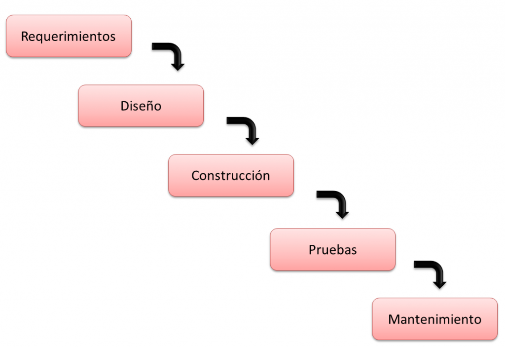
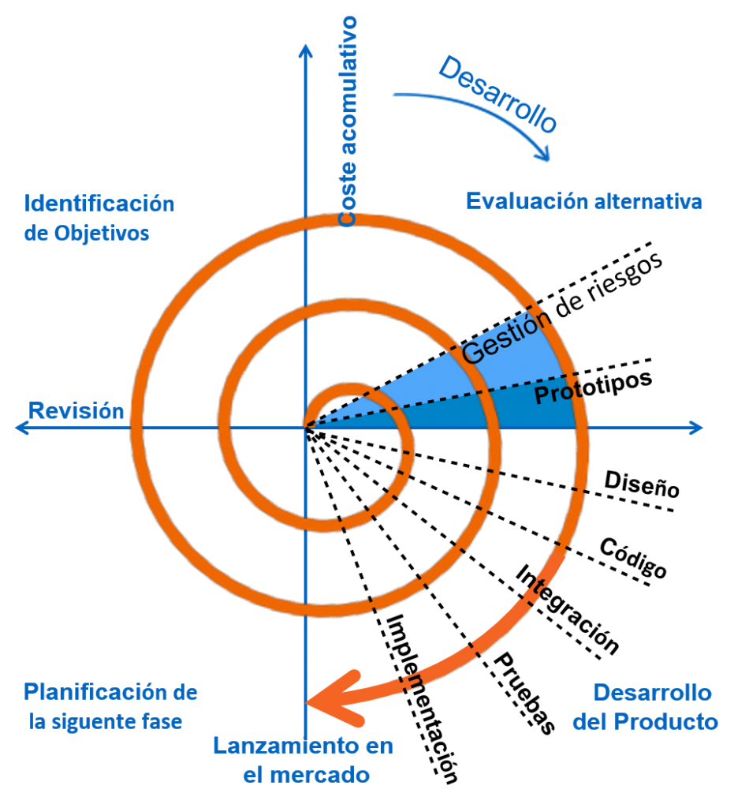

# Ciclo de vida do software

O proceso de desenvolvemento de software, ou ciclo de vida do software, consiste nos pasos que se deben completar para realizar con éxito o proxecto e completar os seus obxectivos. Tratase de establecer unha serie de procedementos a través dos cales se procede de xeito sistemático a realizar o proxecto. 

Arredor deste cometido, creáronse os métodos do ciclo de vida do software, que non son máis que metodoloxías que indican diferentes pasos a seguir para o desenvolvemento dun produto. 

A continuación, imos ver algúns **métodos ou modelos aplicados no ciclo de vida do software**.

## Proceso básico do ciclo de vida dun sistema

Aínda que é certo que **existen diversas metodoloxías e formas de desenvolver software, a realidade é que existen modelos tan antigos que xa son básicos no momento do ciclo de vida do software** . Un exemplo destes modelos é o **modelo en cascada** para o proceso de desenvolvemento dun sistema e a partir do que se comezarán a desenvolver moitos máis modelos.

• **Planificación**. Para acertar co desenvolvemento do sistema que necesita o cliente, o primeiro punto importante no ciclo de vida do software é analizar os requisitos que require ese cliente. Esta etapa require certos coñecementos sobre o medio para poder comprender a idea que propón o cliente e tomar constancia de cada un dos puntos importantes que se solicitan e as implicacións tecnolóxicas e loxísticas de cada unha delas. Tamén é o momento de aconsellar e guiar ao cliente cara unha solución realista. Deste xeito poderás planificar e mesmo determinar os tempos de desenvolvemento que necesitarás, ate poder entregar o produto rematado. A planificación debe estar sempre nos ciclos de vida do software. 

• **Implantación**. Unha vez que falamos co cliente e obtemos unha análise de requisitos, necesidades e funcionalidades aceptadas por ambas partes, procedemos co que é o ciclo de vida do desenvolvemento do software. Para este punto, hai tamén un número infinito de metodoloxías de desenvolvemento de software, que nos ofrecen a posibilidade de traballar de diferentes xeitos. Máis adiante falaremos deles. A implementación é basicamente a parte onde os programadores comezan a codificar ou desenvolver o sistema que se necesita, independentemente da linguaxe de programación a través da cal se faga.

**• Probas** . Unha vez que se desenvolve o sistema, é importante para o ciclo de vida do desenvolvemento do software que se realicen certas probas a medida que se avanza. A idea é que o desenvolvemento non estea rematado para encetar a facer probas. Durante o proceso de creación, xa se poden executar probas que garantan que os pasos dados son os correctos. As probas permitiranos ver se o sistema que se está a desenvolver é funcional, se ten algúns erros, se carece de certas cousas para funcionar correctamente,... Para avanzar ao seguinte punto do ciclo de desenvolvemento de software, será necesario ter superado as probas correctamente.

**• Documentación**. Moitas metodoloxías do que é o ciclo de vida do software, xeran documentación, a medida que se avanza no desenvolvemento do sistema. Outros prefiren non facer a documentación ata o final. Agora ben, sexa cal sexa a metodoloxía que elixas, a documentación sempre será importante. Ter en conta que ti e o teu equipo non estardes sempre dispoñibles e cando chegue outro equipo para continuar o que fixeches, será fundamental que haxa unha documentación coa que guiarse, e non ter que comezar de novo a desenvolver o sistema.

**• Despregue**. Case chegando ás que son as últimas etapas do desenvolvemento do software, atopamos a implementación. Este non é máis que o momento no que o sistema está rematado e aprobado. Agora será o momento de distribuílo. Desgraciadamente, esta é a fase á que moitos nunca chegan: unha gran cantidade de software queda incompleto debido a diferentes razóns. Podería ser que o equipo non se xuntase, que o cliente decline continuar, ou que o proxecto non resulte funcional, ou que quede desfasado antes de ser completado, etc.

**• Mantemento** . A última fase do desenvolvemento do software é o mantemento. Se pensaches que nunca volverías ver o software que fixeches, remataches e publicaches, ás veces non todo remata aquí. Queda o mantemento. Aquí comeza un novo ciclo onde podes planear as melloras e/ou engadir actualizacións, dependendo do tipo de desenvolvemento. Se o equipo seguiu traballando co software desenvolvido e atopou formas de facer melloras nel, entón parte do mantemento consistirá en actualizalo á versión final cando sexa preciso.

## Paradigmas dos modelos de ciclo de vida do software

**Unha das principais cousas que hai que escoller á hora de iniciar un proxecto de desenvolvemento de software son as fases de desenvolvemento do mesmo**. Aínda que temos claro que non todos temos as mesmas ideas e non todos pensamos do mesmo xeito, afortunadamente xa hai modelos preestablecidos baixo os que podemos desenvolver o noso proxecto. 

Vexamos algúns modelos diferentes para desenvolver software:

**• Paradigma Tradicional**. Existen algunhas metodoloxías do ciclo de vida do desenvolvemento de sistemas, que se manexan á antiga moda, tamén se coñecen como paradigmas tradicionais. Aínda que é certo que as metodoloxías actuais están baseadas nos alicerces do que foron os paradigmas tradicionais, hoxe xa evolucionamos, sen embargo os paradigmas tradicionais seguen aí.Estes paradigmas caracterízanse principalmente por ser lineais sen volta atrás, é dicir, consistía en completar cada proceso de principio a fin, ata que estaba listo para pasar á segunda fase do ciclo do software. Isto xeraba grandes dificultades e perda de tempo se se atopaba un erro en fase avanzada, xa que o proceso a realizar era,

**• Paradigma orientado a obxectos** . Un dos xenios máis exquisitos é o desenvolvemento de software a través da programación orientada a obxectos. Con esta forma do ciclo de vida dos sistemas, o que se pretende é que o código fonte sexa reutilizable para outros proxectos ou miniproxectos alternativos relacionados co programa base, xa que se utilizan as Clases.Basicamente as etapas do desenvolvemento do software no paradigma orientado. aos obxectos, o que é a creación de clases está conformado principalmente, seguido da análise de requisitos, un paso fundamental para determinar non só a duración do desenvolvemento, senón tamén os custos ao final do proxecto. E por suposto o deseño, porque co paradigma orientado a obxectos, o deseño é moito mellor que cun paradigma tradicional.

**• Paradigma de desenvolvemento áxil**. Os modelos de ciclo de vida áxiles son un dos máis utilizados na actualidade. O obxectivo deste paradigma é o desenvolvemento de proxectos en pouco tempo. Para o que, elimínanse procesos tediosos, racionalízanse as fases de desenvolvemento, realízanse as iteracións nun curto período de tempo, descartanse e evítanse os riscos para non ter que enfrontarse a eles e sempre se dá solución aos problemas con rapidez. Se algo leva moito tempo en resolver, o mellor é deixalo a un lado e seguir adiante.Unha das principais diferenzas entre o paradigma de desenvolvemento áxil e os paradigmas anteriores é que o cliente está implicado no proxecto durante o seu desenvolvemento. A diferenza do paradigma tradicional onde o cliente está só ao principio, o mesmo ocorre no paradigma orientado a obxectos. Aquí o cliente interfire, dá melloras, propón ideas e manténse ao tanto do desenvolvemento do produto. O que axuda aínda máis, xa que o produto final faise satisfactoriamente nun período de tempo máis curto.

## Ciclo de Vida do Software nas distintas Metodoloxías

**O ciclo de vida dun proxecto de software comeza cando se recollen os requisitos do programa que se vai desenvolver e remata cando o produto está rematado e se entrega ao cliente que o solicitou** . Porén, no medio, hai un gran número de fases polas que hai que pasar e cada metodoloxía ten diferentes fases no seu ciclo de desenvolvemento do programa, por iso veremos a continuación como se compón cada un dos modelos.ciclo de vida do software, sen entrar en escenarios profundos, xa que hai tantas metodoloxías que mencionar que poderiamos levar todo o día.

### Modelo de fervenza

**Unha das metodoloxías máis antigas no que é o ciclo de vida dun modelo informático é o modelo en cascada** . Esta metodoloxía é lineal e consta dunhas fases que se deben seguir e completar para poder avanzar á seguinte fase. Non é precisamente a mellor metodoloxía, pero se se usa correctamente os resultados poden ser moi bos. Componse das seguintes fases:

1. Requisitos 
2. Deseño 
3. Implementación e Desenvolvemento 
4. Integración 
5. Probas ou Validación 
6. Implantación ou Instalación 
7. Mantemento

Como podedes ver, **o ciclo de vida dun programa realizado baixo a metodoloxía en cascada é extenso pero moi ben estruturado** . O detalle aquí é que non pode saltar fases nin repetilas de novo, por exemplo.

Se se realiza unha análise de requisitos pasamos a deseñar o programa e xa estamos en desenvolvemento e de momento o cliente dinos que quere modificar os requisitos, digamos que por ser un modelo en cascada non o é. posible volver. Polo tanto, o proxecto tería que reiniciarse ou rematar e ver como se ve o software ao final.

Como comentei, **é unha metodoloxía lineal en cascada e se cada unha das fases non está rematada ao 100%, non é posible avanzar á seguinte fase,** así funciona e hai que seguila ao pé da letra, por máis que por esaxerado que isto pareza.

### Modelo en espiral

**O modelo en espiral en enxeñaría de software ten un enfoque moi diferente ao modelo en cascada, principalmente porque o seu foco está dirixido á análise de riscos** . O modelo de ciclo de vida en espiral consiste na realización de varias iteracións, pasando por cada unha das súas fases unha e outra vez. A diferenza do modelo en fervenza, que non ten volta atrás, no modelo en espiral pódense facer cantas iteracións consideres necesarias e estas son as súas fases principais:

1. Determinación de obxectivos 
2. Análise de riscos 
3. Desenvolvemento e probas 
4. Planificación

**Entre as principais vantaxes de desenvolver un proxecto co modelo en espiral está que os riscos diminúen a medida que avanzan os ciclos ou iteracións** , de feito non se pode avanzar a un novo ciclo se non se solucionaron todos os riscos latentes. Por desgraza, o modelo é realmente caro e para que teñas un alto nivel de eficiencia na avaliación final do teu proxecto con este ciclo de vida, necesitas que o teu equipo teña un alto nivel de coñecemento e, se é posible, boa experiencia para superar calquera risco ao que poidan enfrontarse.

### Modelo iterativo ou por Prototipos

**Un dos meus antigos modelos de ciclo de vida que é realmente un dos meus favoritos é o modelo iterativo. O motivo? Manéxase en base a prototipos** , é dicir. É un dos primeiros ciclos de vida que permitiu que o código fonte fose reutilizable, sen embargo co modelo iterativo non só é utilizable, senón que para moitos, estes prototipos poden converterse no produto final que sempre quixeron, que é o que querían. é realmente relevante e destacable, por riba do resto de modelos de antano que podes atopar.

Basicamente, as fases do ciclo de vida do sistema son as seguintes:

1. Inicialización 
2. Iteración 
3. Lista de verificación

**Unha das principais vantaxes do modelo iterativo é que o feedback aos usuarios é moi pronto, o que fai que entrar no proxecto sexa demasiado sinxelo** . Iso si, o feito de ter iteracións dános certas vantaxes, xa que con cada iteración realizada sepáranse as partes complexas da mesma, permitindo un maior acceso ao software. E por suposto, un sistema creado a través do ciclo de vida iterativo tende a fallar case nunca, o que supón unha garantía de satisfacción para o cliente neste caso ou para a empresa que está implantando esta metodoloxía.

### Modelos de ciclo de vida de desenvolvemento áxil

As tendencias, co paso do tempo, tenden a cambiar para mellor, e no caso das metodoloxías do ciclo de vida do desenvolvemento de software, esta non é unha excepción. E un claro exemplo diso son os modelos de desenvolvemento áxil. **Estes procesos caracterízanse por estar baseados nas etapas tradicionais do ciclo de vida do software, pero combinándoas con algunhas técnicas e sendo aínda máis superpostos** no que se refire á orde na que deben executarse. Pois non vos digo máis, vexamos brevemente cales son algunhas delas, as máis coñecidas e populares, por suposto, e as mellores de todas.

### modelo scrum

**O ciclo de vida do sistema pódese axilizar se se utiliza a metodoloxía Scrum, un dos modelos de ciclo de vida de desenvolvemento de software máis populares e máis recentes, ben non tanto, senón máis que os de antano** . O modelo Scrum baséase no que é o desenvolvemento incremental, é dicir, a medida que pasan as fases e iteracións, maior será o tamaño do proxecto que se está a desenvolver, por iso un dos principais requisitos para levalo a cabo é que o teu equipo de desenvolvemento sexa de calidade. Contando cunha alta calidade nos equipos, teremos garantido un excelente funcionamento.

Como comentei ao principio, **o modelo Scrum deixa de seguir metodoloxías lineais, podemos despedirnos do modelo en cascada e secuencial, porque agora procedemos a solapar as fases e non importará cando teñas que volver atrás, sempre haberá unha boa** calidade de equipo de traballo, que teña ese apoio para soportar os cambios que son certamente normais dentro da metodoloxía Scrum. Por último, como ingrediente vital temos a comunicación, e é que aquí esquezas as tendencias deses xefes que te teñen envolto nunha burbulla en desenvolvemento. Co modelo scrum podes estar en comunicación co teu equipo de traballo en todo momento, para estar ao tanto dos acontecementos.

Agora veremos brevemente cales son os procesos que utiliza o modelo Scrum:

1. Product Backlog 
2. Sprint Backlog 
3. Reunión de planificación de Sprint 
4. Reunión diaria de Scrum ou Stand-up 
5. Revisión de Sprint 
6. Retrospectiva de Sprint

Estas son as fases do ciclo de vida do software nesta metodoloxía, que **consiste basicamente en realizar unha análise dos requisitos do sistema (Product Backlog** ), indicando cales serán os obxectivos a curto ou medio prazo dentro dun **sprint** , é dicir, o fase de desenvolvemento. Posteriormente, os desenvolvedores farán o seu, realízanse algunhas probas e dáse feedback segundo o conseguido ao final da última fase. Lembra que aquí pódense engadir cousas novas en calquera momento, xa que o modelo Scrum non se atasca en ningunha das súas fases.

### Modelo Kanban

O modelo Kanban é un dos modelos máis visuais de metodoloxías áxiles. **Consiste na creación dun taboleiro con etiquetas, onde se seccionan cada unha das fases do seu desenvolvemento** , tamén se clasifica segundo os equipos de traballo e se lles asignan obxectivos a curto, medio e longo prazo.

Entre as vantaxes deste modelo de ciclo de vida do software **destaca o feito de non ter unha orde como tal, de feito todas as fases comezan a traballar conxuntamente, non hai tempos de espera e basicamente o seu obxectivo é que os desenvolvedores e programadores sexan traballando todo o tempo** . Se conclúes coas fases do proxecto que che corresponde, seguro que terás que avanzar en fases do novo proxecto que está por vir.

Por suposto, a metodoloxía Kanban tamén require dun equipo totalmente adestrado, porque só así se poden acadar os obxectivos. Así que aquí vos mostro as fases do proceso de ciclo de vida dun sistema, utilizando a metodoloxía xaponesa Kanban:

1. Definir o fluxo de traballo 
2. Fases do ciclo de produción 
3. Deixar de comezar, comezar a rematar 
4. Ter control

Se aínda non estás seguro de se implementar a metodoloxía Kanban ou non, digocho. A empresa Toyota foi unha das primeiras en implantar a metodoloxía, aumentando a eficiencia e a produtividade nunha alta porcentaxe. Considere como vantaxe principal que o produto final estará rematado nun período de tempo moito menor que con calquera das metodoloxías vistas ao principio.

### Modelo XP ou Programación Extrema

**Posiblemente a máis destacada das metodoloxías áxiles para os ciclos de vida do software sexa a metodoloxía XP ou modelo de programación extrema** . A diferenza do resto da metodoloxía existente, esta é adaptable segundo as necesidades e requisitos que se teñan que implantar, coa vantaxe de que podemos facer uso de calquera modelo previo para o desenvolvemento e saír inmediatamente del. O que proporciona moita máis liberdade ao equipo de traballo que o resto de modelos.

Ademais, na metodoloxía de programación extrema, o cliente está implicado no proceso de desenvolvemento, o que significa que ao final o produto pode estar rematado en menos tempo, xa que evitamos moitas perdas de tempo, preparando solucións que non o son e que o cliente desbotara na revisión. Co metodo XP o cliente ve o que se está a desenvolver e ten liberdade para propor cambios, ideas, requisitos ou actualizacións sen ningún problema.

Os valores que conforman o modelo de programación extrema son os seguintes:

1. Comunicación 
2. Sinxeleza 
3. Retroalimentación 
4. Coraxe 
5. Respecto

Esta serie de valores é sumamente importante para que se poida levar a cabo un proxecto de alta calidade. Cada un deles ten a súa razón de ser e de existir, por exemplo, a comunicación, que mesmo debe ser co cliente e por non falar do resto de equipos de traballo. A sinxeleza correspóndese co feito de non facer cousas que levan moito tempo, a idea é rematar rapidamente e é mellor deixar de lado as que levan moito tempo. **A retroalimentación é vital, sobre todo cando os equipos de traballo deben estar formados por dúas persoas, sempre é bo aprender cousas novas do noso compañeiro de traballo** e seguro que todos o vivimos nalgún momento.

A valentía é un valor integrado como programador, xa que debes ser valente para afrontar os cambios que veñen, tomar decisións radicais e manter en todo momento esa forza que debe manter a ti e ao teu equipo no seu mellor momento. E por suposto respecto, isto está en todo o equipo de traballo, incluso o cliente debe ter unha marxe de respecto polo equipo de desenvolvemento. Con estes valores, a metodoloxía terá unha boa formación, pero vexamos cales son as principais características da programación extrema:

1. Tipo de desenvolvemento iterativo e incremental 
2. Probas unitarias 
3. Traballo en equipo 
4. Traballar xunto co cliente 
5. Corrección de erros 
6. Reestruturación do código 
7. O Código é de todos 
8. O código sinxelo é a clave

Como podes ver, pasos como facer o código sinxelo ou probas unitarias para evitar erros e ter que pensar moito no código, ademais de que as fases están segmentadas en pequenas porcións, para que se hai erros, pódese modificar facilmente. .

Non obstante, probablemente notaches que non hai documentación en ningún lado, isto é porque con tanta comunicación non é realmente necesario, sen embargo, no código quedan comentarios con cousas que outro programador non pode entender e variables ou clases comprensibles para que todos poidan entendelo facilmente. Só en casos moi necesarios, procedemos a facer unha breve documentación dalgunhas partes, pero non se utiliza habitualmente de forma tradicional.

## conclusións

**Como se pode ver, os ciclos de vida do software son moi diversos**. Ao final, unha das cousas coas que hai que contar é o sentido da adaptación, e a falta de directrices claras ou método específico para traballar, saber cal pode adaptarse mellor a un proxecto concreto. **Por iso xestionar un modelo de programación extremo e acostumarse a el é unha excelente alternativa** , deste xeito estarás dominando cada unha das metodoloxías do ciclo de software de antano e poderás afrontar calquera situación complicada na que te atopes.