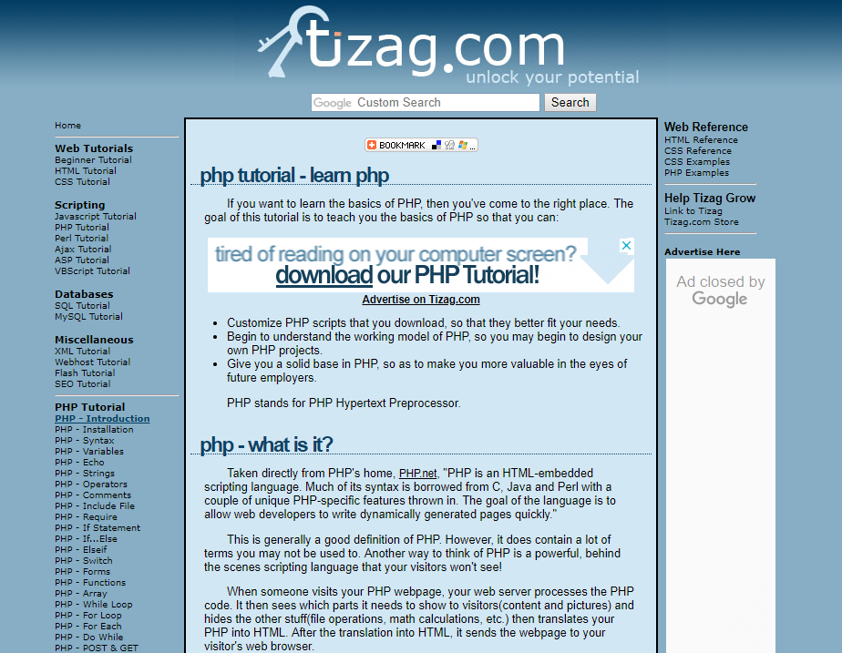
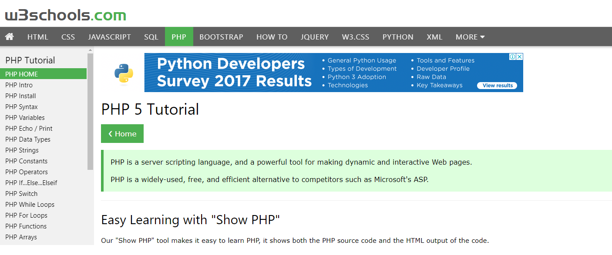

# Titorías de PHP: recursos, sitios web, cursos

​

Se estás interesado en aprender esta linguaxe, a busca en liña ofrece moitos resultados de titorías de PHP. Mantén a calma e non te desanimes. As habilidades de PHP, aínda que de natureza altamente técnicas, pódense adquirir cos recursos axeitados. E por recursos, entendemos a gran cantidade de información da web. Para utilizar plenamente esta información dispoñible, é mellor utilizar unha combinación destas referencias para aprender PHP de forma máis eficaz.

Como todos sabemos, PHP é unha linguaxe moi flexible e poderosa. Cambiou o xeito no que funcionan as páxinas web e como interactúan os usuarios con elas. Ademais os profesionais de PHP teñen unha boa demanda e pódeste unir ao carro.

Estes son algúns dos sitios web máis recoñecidos para aprender PHP - seguramente non todos-, seguidos dun resumo e referencias para obter máis información.

## 1. [Manual de PHP](http://php.net/manual/en/index.php)

Manual oficial en liña da linguaxe PHP. É unha fonte inmensa de documentación xa que abrangue dende o elemental ata as funcións máis avanzadas de PHP. Para facilitar o seu uso, todas as funcións de cada versión publicada recompílanse nunha lista. Tamén hai notas de contribución dos usuarios en cada función ou páxina específica. O deseño do sitio web é compatible con móbiles, polo que podes usalo mentres esteas conectado. En xeral, ofrece un percorrido completo por PHP.

Temas clave:

- Comezando
- Instalación e configuración
- Referencia lingüística
- Seguridade
- características
- Referencia da función
- O núcleo PHP: unha guía de hackers
- FAQ
- Apéndices

## 2. [Titoría de PHP por Tizag](http://tizag.com/phpT/)

Ademais de utilizar o manual de PHP, é mellor combinalo con outra fonte como o tutorial de PHP de Tizag. É sinxelo e fácil de navegar con todas as funcións listadas e pódese ver nunha soa páxina. Isto é perfecto para referencias rápidas de funcións PHP. A presentación de cada función é clara e comprensible. Tamén hai un botón de acceso rápido para marcar e compartir facilmente.

Temas clave:

- Introdución
- Ficheiros PHP
- Cadeas PHP
- PHP Avanzado

## 3. [W3Schools](http://w3schools.com/php)

Outro sitio recomendable e popular para encetar con PHP é W3CSchools. Todas as funcións pódense navegar e ver nunha soa páxina. A explicación é concisa e sinxela, e fácil de entender. Tamén hai unha xanela do editor onde podes introducir o código e executar mostras facilmente. Non é necesario cambiar de fiestra cos teus ambientes de desenvolvemento PHP.

Temas clave:

- Conceptos básicos de PHP
- Formularios PHP
- PHP Avanzado
- Base de datos MySQL
- PHP-XML
- PHP-AJAX
- Exemplos PHP
- Referencia PHP

## 4. [PHP 101](https://www.zend.com/training/php)

PHP 101 de Zend Developer Zone é un bo lugar para comezar. Se sabes pouco ou nada sobre esta lingua, entón é o lugar para estar. Está absolutamente deseñado para principiantes. O titorial divídese en varias partes, desde as funcións básicas ata as principais de PHP. Cada parte ten unha explicación moi completa e as mostras de código están dispoñibles.

Temas clave:

- Variables e operadores
- Estruturas de control, matrices e funcións de matriz PHP
- Ficheiros externos
- Funcións, argumentos, paso por referencia, globais e ámbito
- OOP en PHP4 e PHP5 (sic!)
- Base de datos MySQL forma PHP
- SQLite
- Sesións e Cookies
- O método máis sinxelo de PHP para tratar con XML
- Tratamento básico de erros e seguridade
- Implementación de aplicacións web
- Creación sinxela de agregadores de noticias RSS

## 5. [Killer PHP](https://www.killerphp.com/tutorials/object-oriented-php/)

Killer PHP é un tutorial de PHP para deseñadores web. Teña en conta que a aprendizaxe de PHP dispón de dúas fases: programación procesual e orientada a obxectos (OOP). Como principiante, é xenial comezar co procedemento, xa que só implica guións. Unha vez que teñas o dominio da tecnoloxía, é hora de subir de nivel e aprender OOP PHP. Killer PHP está especializado en PHP OOP. Ten titoriais prácticos con vídeos complementarios. Só ten que aprender os conceptos básicos de OOP PHP, aprender habilidades utilizables de PHP e todo seguirá. Ademais destes titoriais, tamén hai centos de cuestionarios para validar o teu  nivel de habilidade e o que aprendeches ata agora.

Tema clave:

- OOP PHP

## 6. [Aprende PHP](https://www.tutorialspoint.com/php/)

Learn PHP by Tutorials Point é unha sección dedicada enteiramente á programación PHP. É ideal para programadores principiantes e intermedios. A lista de funcións PHP pódese navegar facilmente e móstrase nunha única páxina. Tamén ofrecen un libro electrónico que podes descargar de balde.

Temas clave:

- Conceptos básicos de PHP
- PHP avanzado
- Exemplos de formularios PHP
- Exemplos de inicio de sesión en PHP
- Exemplos PHP Ajax
- Exemplo PHP XML
- Marcos PHP
- Patróns de deseño PHP
- Referencia da función PHP
- Recursos útiles de PHP

## 7. [Curso de Código](https://codecourse.com/)

Coñecida anteriormente como PHP Academy, Codecourse ofrece agora non só PHP,  senón tamén outras ferramentas e linguaxes de desenvolvemento web. Teñen contidos titorial altamente descritivos. Os seus vídeos titoriales están dispoñibles no seu sitio web oficial, así como na súa canle de YouTube.

Tema clave:

- Temas avanzados de PHP

## 8. [SitePoint PHP](https://www.sitepoint.com/php/)

SitePoint adopta un enfoque máis moderno coas súas guías e titoriais, que se ofrecen nun formato de artigo. É mellor se xa tes un pouco de coñecemento de PHP antes de mergullarte no tutorial PHP de SitePoint. Este é un bo recurso ao que ir cando teñas unha boa comprensión dos conceptos básicos.

Temas clave:

- APIs
- Base de datos
- Depuración e implantación
- Marcos
- Laravel
- Patróns e prácticas
- Rendemento e escalado
- Seguridade
- Drupal

## 9. [PHP 5 Power Programming](https://ptgmedia.pearsoncmg.com/images/013147149X/downloads/013147149X_book.pdf)

Aínda que a última versión é PHP 7, aprender PHP 5 non é un problema. Os fundamentos son os mesmos. PHP 5 Power Programming é en realidade unha guía de libros electrónicos para programadores intermedios e avanzados de PHP. Ter este libro electrónico require coñecementos previos de codificación en PHP. Pódese descargar de balde a menos que queiras a versión impresa.

Temas clave:

- Conceptos básicos de PHP
- OOP avanzado e patróns de deseño
- Aplicación Web
- Bases de datos
- Tratamento de erros
- XML
- Extensións principais
- PERA
- PHP Shell Scripting

## 10. [Hackear con PHP](http://www.hackingwithphp.com/)

Hacking With PHP é un dos mellores tutoriais de PHP para principiantes. Preséntase como un libro xa que comeza cunha táboa de contidos. Os temas están divididos en varios capítulos e subtemas diferentes. Ten exercicios prácticos con ligazóns engadidas a recursos. Esta é unha excelente referencia para os alumnos que prefiren clases que adopten un enfoque máis práctico.

Temas clave:

- Conceptos básicos de PHP
- Arquivos e bases de datos
- Multimedia
- Seguridade e rendemento
- PHP práctico
- O futuro de PHP

## 11. [PHP o camiño correcto](https://www.phptherightway.com/)

Este sitio fai fincapé nas boas prácticas de PHP. O sitio consta de extensos titoriais sobre diversos temas de PHP e varias referencias a outros titoriais e sitios de boas prácticas. Este titorial en liña pode conter información antiga e desactualizada e marcala en consecuencia.

Temas clave:

- Comezando
- Destacados lingüísticos
- Xestión da dependencia
- Prácticas de codificación
- Inxección de dependencia
- Bases de datos
- Modelos
- Erro e excepcións
- Seguridade
- Servidores e implantación
- Virtualización
- Almacenamento en caché
- Documentando o teu código

## 12. [Academia PHP](https://www.youtube.com/user/phpacademy)

PHP Academy é basicamente a canle de YouTube de CodeCourse mencionada anteriormente. Esta é unha referencia perfecta para que os estudantes visuais vexan a codificación e o resultado ao mesmo tempo. A mellor parte é que esta canle actualízase con frecuencia con titoriais de PHP máis novos.

Temas clave:

- Conceptos básicos de PHP
- Proxectos Prácticos PHP

## 13. [Desenvolver PHP](http://www.developphp.com/)

Desenvolver PHP é outro tutorial de estilo de vídeo. Os vídeos están realmente aloxados a través de YouTube e para facilitar o seu uso, incrustados no sitio web. O sitio web ofrece un xeito máis sinxelo, máis organizado e fácil de realizar diferentes cursos.

Temas clave:

- Fundamentos
- Funcións
- Videotutoriais

## 14. [PHP Jabbers](https://www.phpjabbers.com/)

PHP Jabbers é para programadores intermedios a avanzados. Contén unha gran cantidade de guías especializadas. Podes atopar unha gran biblioteca virtual de scripts PHP comerciais de alto  estándar, solucións de software con especificacións industriais  individuais, así como un montón de ferramentas web gratuítas e outros  recursos para administradores web.

Tema clave:

- Scripts PHP personalizados

## 15. [Tutorial interactivo Learn-PHP](http://www.learn-php.org/)

Está deseñado para principiantes cunha introdución e un código moi básico de programación PHP. O sitio é interactivo con codificación paso a paso para que poida  escribir e executar código de mostra sen instalar ningún software.

Temas clave:

- Aprende o básico
- Contribución de titoriais

## 16. [1Datos clave](https://www.1keydata.com/php-tutorial/)

1Keydata ofrece unha serie de titoriais guiados que abarcan case todos os temas de PHP que se poidan pensar. Estes son titoriais e guías só de texto que abarcan temas como a sintaxe e as funcións de cadea.

Temas clave:

- Tutorial de PHP
- Comandos PHP
- Funcións de cadeas de PHP
- Sintaxe PHP
- Mapa do sitio PHP
- Recursos PHP

## 17. [Cheatsheets de PHP](http://phpcheatsheets.com/)

PHP Cheatsheets, como o seu nome indica, é unha guía de referencia rápida  para programadores intermedios e avanzados que poden necesitar axuda con comparacións de variables e probas de variables en varias versións de  PHP.

Temas clave:

- Folla de trucos de comparación de variables
- Folla de trucos de aritmética variable
- Folla de trucos para probas variables

## 18. [Titoriais e documentación de Microsoft Azure PHP](https://azure.microsoft.com/en-us/develop/php/)

O titorial de Microsoft Azure PHP contén un titorial de PHP e  documentación relacionada cos servizos de computación en nube de Azure. Se está a traballar con PHP con Azure, esta é a referencia completa para vostede.

Tema clave:

- Cree a súa aplicación web PHP en Azure

## 19. [Lynda.com](https://www.lynda.com/)

Este sitio web non ofrece titoriais simples nin instrucións paso a paso; en cambio, Lynda ofrece unha plataforma para que os profesores que están  na parte superior dos seus campos mostren a súa experiencia. No curso de PHP, este sitio web ofrece unha base de coñecemento nun só  lugar co obxectivo de proporcionar unha excelente formación aos  estudantes. Non obstante, non vén de balde. Un estudante debe desembolsar unha pequena cantidade de diñeiro para aprender dos expertos.

Temas clave:

- PHP básico
- Consellos, trucos e técnicas de PHP
- PHP avanzado
- PHP: Programación Orientada a Obxectos
- PHP: patróns de deseño
- E moitos máis…

## 20. [Udemy.com](https://www.udemy.com/)

Udemy é unha plataforma educativa moi visitada pola súa ampla selección de contidos educativos e conferencias. A explosión dos traballos de medios dixitais levou a unha industria próspera como a programación PHP. Udemy ofrece cursos de programación PHP de expertos nos que os estudantes  poden aprender e ampliar as súas capacidades de aprendizaxe mediante a  investigación e unha pequena cantidade de diñeiro.

Temas clave:

- PHP para principiantes
- PHP orientado a obxectos e MVC
- E moitos máis…

## 21. [Desbordamento da pila](http://www.stackoverflow.com/)

Aprender a programar é sinónimo de aprender a falar un novo idioma. A programación é un proceso complicado e a web ofrece unha gran variedade de recursos para comezar. A etapa de aprendizaxe inclúe comprender o novo idioma, cometer erros e obter enerxía no proceso de depuración. O bo deste sitio web é que atende tanto a principiantes como a expertos. Os erros similares que atopan as persoas dentro desta comunidade están  facilmente dispoñibles e realmente axudarán a conseguir a resposta  correcta. Isto levou á resolución dun erro ou á prevención dun fallo do sistema.

Temas clave:

- Clases básicas de PHP
- Clases intermedias de PHP
- Clases avanzadas de PHP

## 22. [PHP Buddy](http://www.phpbuddy.com/)

PHP Buddy como o propio nome implica un ambiente amigable que contén  tutoriais, leccións, scripts e artigos sobre programación PHP. Aínda que o ambiente é puramente textual con vídeos limitados e fragmentos de código, aínda é unha referencia digna. O sitio tamén permite aos seus visitantes e subscritores enviar artigos e código PHP.

Temas clave:

- Inicio rápido PHP
- Instalación PHP
- Artigos PHP
- Scripts PHP

## 23. [Recursos PHP de Bento](https://bento.io/topic/php)

Cando aprendemos a codificar, recibimos mentores para que nos orienten. Hoxe en día, os mentores non son só físicos, senón principalmente virtuais. Dado que temos diferentes patróns persoais de aprendizaxe, necesitamos referencias que poidan atender ás nosas necesidades. Bento PHP Resources ofrece unha plataforma para superar a etapa de iniciación da codificación. Este sitio web ofrece os xenéricos da aprendizaxe de PHP, onde tes unha  lista de verificación de habilidades seguindo o seu currículo a medida  que avanzas na escaleira.

Temas clave:

- Conceptos básicos de PHP
- Aprende PHP

## 24. [Pluralsight](https://www.pluralsight.com/)

Que queres aprender? Este sitio web ofrece unha gran variedade de tecnoloxías que che animan a ser un experto. Si, escoitaches ben, un experto! A experiencia en datos, desenvolvemento, seguridade e operacións de TI está ben elaborada para atender ás súas necesidades. Podes comezar unha proba de 10 días e asegúrate de obter primeiro o teu Skill IQ. Isto axudarache a avaliar as túas habilidades e permitirache personalizar as túas listas de verificación.

Temas clave:

- PHP Iniciación
- Creación de sitios web dinámicos con PHP e MySQL
- Fundamentos de PHP
- Laravel
- Fundamentos de Nginx e PHP
- PHP orientado a obxectos: esenciais e construcións
- Servizos web RESTful con PHP e Laravel
- PHP de alto rendemento

## 25. [Medios de Travesía](https://www.traversymedia.com/)

O autor deste sitio web é Brad Traversy, especializado en ensinar desenvolvemento e programación web. Traversy Media tamén é unha das principais canles de titoriais de programación e desenvolvemento web en Youtube. Brad ofrece unha canle perfectamente afinada centrada nas tendencias  tecnolóxicas fundamentais, pero facilitando a súa comprensión. Brad é moi apaixonado por ensinar diferentes tecnoloxías como PHP a través da súa canle de YouTube. A súa lista de reprodución completa de PHP Front to Back é imprescindible para os principiantes.

Temas clave:

- Conceptos básicos de PHP
- PHP OOP
- Laravel
- API REST
- Curso intensivo PDO
- CodeIgniter

## Resumo

Presentamos os mellores recursos do sitio web para aprender PHP en liña. Agardamos que poidas escoller un bo sitio da lista recomendada. Por favor, non te limites a só un. Unha combinación de recursos proporciona maiores resultados. Teña en conta que escoller o que se adapte ás súas preferencias para comezar coa programación PHP. Tamén pode ampliar a súa investigación e proceder a marcos.

Converterse nun profesional de PHP é unha viaxe; aprende os conceptos básicos e mantén un ollo atento ás tendencias de desenvolvemento de PHP actualizadas. Unha vez que teña adquirido coñecementos suficientes, comeza e crea o teu propio sitio web. Si, presentamos unha lista de sitios web, pero o mellor sitio para aprender PHP é o teu propio sitio web. Se pensas que perdemos algún outro gran recurso, fáganos saber nos comentarios.

Stackify pode axudar a manter as súas aplicacións PHP funcionando sen problemas coa ferramenta APM de Stackify Retrace. [Descarga a túa proba gratuíta de dúas semanas hoxe!](https://s1.stackify.com/account/createclient?_ga%3D2.12300788.1973545731.1588002198-1971815645.1570122931%26_gac%3D1.207733030.1584390051.EAIaIQobChMIvenD6Oif6AIVnP7jBx3XjACyEAAYBCAAEgJmVPD_BwE)

### Máis información

A linguaxe de programación PHP é un tema moi amplo. Aquí tes recursos adicionais que poden axudarche a comezar.

- [Os 10 mellores marcos PHP para o desenvolvemento web](https://stackify-com.translate.goog/php-frameworks-development/?_x_tr_sl=auto&_x_tr_tl=gl&_x_tr_hl=es)
- [Como solucionar problemas das aplicacións web PHP](https://stackify-com.translate.goog/troubleshoot-php-application-problems/?_x_tr_sl=auto&_x_tr_tl=gl&_x_tr_hl=es)
- [Principais blogs PHP e canles de YouTube](https://stackify-com.translate.goog/php-blogs-youtube-channels/?_x_tr_sl=auto&_x_tr_tl=gl&_x_tr_hl=es)

---

ref: Iryne Somera, 29 de agosto de 2018[Desenvolvemento da carreira de programador](https://stackify-com.translate.goog/career/?_x_tr_sl=auto&_x_tr_tl=gl&_x_tr_hl=es) , [Consellos, trucos e recursos para programadores](https://stackify-com.translate.goog/developers/?_x_tr_sl=auto&_x_tr_tl=gl&_x_tr_hl=es)
