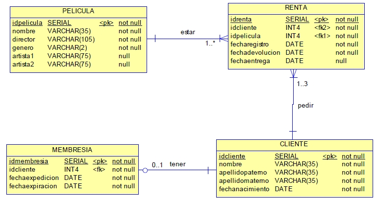

## Modelo físico de datos (Modelo relacional)

O modelo físico de datos se crea por medio dun diagrama de entidade-relación físico.

Este diagrama se basea no modelo relacional proposto por Codd en 1970, sustentado na teoría de conxuntos en onde a cada conxunto se lle denomina relación.

Cada relación agrupa obxectos da realidade que comparten características, tal e como o indica a teoría de conxuntos.

No diagrama entidade-relación ás relacións se as denomina táboas e á interdependencia entre as táboas: relacións.

## Estrutura de Datos

As estruturas de datos son abstraccións de baixo nivel que agrupan un conxunto de datos que están interrelacionados entre eles.

Ademais, a estrutura de datos define un conxunto de operacións que se poden realizar cos datos que contén. Hai diferentes tipos de estruturas: pilas, colas, árbores, listas, etc.
