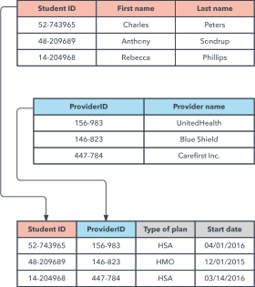
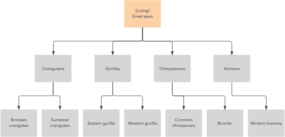
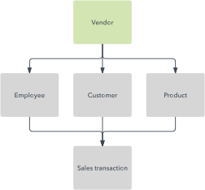
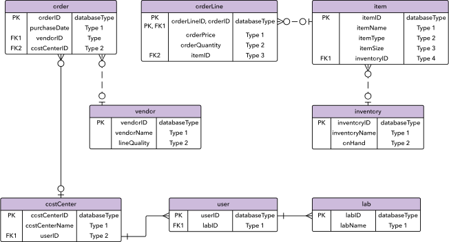

# Modelos de base de datos

Un modelo de base de datos mostra a estrutura lóxica da base de datos, incluíndo as relacións e restricións que determinan como se almacenan e acceden aos datos. Os modelos de bases de datos individuais deséñanse baseándose nas regras e conceptos de calquera modelo de datos máis amplo que adopten os deseñadores. A maioría dos modelos de datos pódense representar mediante un diagrama de base de datos que se acompaña.

## Tipos de modelos de bases de datos

Hai moitos tipos de modelos de bases de datos. Algúns dos máis comúns inclúen:

- Modelo xerárquico de bases de datos
- Modelo relacional
- Modelo de rede
- Modelo de base de datos orientado a obxectos
- Modelo entidade-relación
- Modelo de documento
- Modelo entidade-atributo-valor
- esquema estrela
- Modelo relacional obxecto, que combina os dous que compoñen o seu nome

Podes optar por describir unha base de datos con calquera deles dependendo de varios factores. O factor máis importante é se o sistema de xestión de bases de datos que está a usar admite un modelo en particular. A maioría dos sistemas de xestión de bases de datos desenvólvense pensando nun modelo de datos particular e requiren que os usuarios adopten ese modelo, aínda que algúns admiten varios modelos.

Ademais, aplícanse diferentes modelos a diferentes etapas do proceso de deseño da base de datos. Os modelos de datos conceptuais de alto nivel son mellores para crear mapas de relacións entre os datos na forma en que a xente percibe eses datos. Por outra banda, os modelos lóxicos baseados en rexistros reflicten máis de preto as formas en que os datos se almacenan no servidor.

Elixir un modelo de datos tamén depende de aliñar as túas prioridades coas fortalezas da base de datos dun modelo en particular, se esas prioridades inclúen a velocidade, a redución de custos, a usabilidade ou outra cousa.

Vexamos en detalle algúns dos modelos de bases de datos máis comúns.

## Modelo relacional

Sendo o modelo máis común, o modelo relacional organiza os datos en táboas, tamén coñecidas como relacións, cada unha das cales está formada por columnas e filas. Cada columna enumera un atributo da entidade en cuestión, por exemplo, prezo, código postal ou data de nacemento. Xuntos, os atributos dunha relación chámanse dominio. Escóllese un atributo ou combinación de atributos en particular como chave primaria, á que se pode facer referencia noutras táboas, onde se chama chave estranxeira.

Cada fila, tamén chamada tupla, inclúe datos sobre unha instancia específica da entidade en cuestión, por exemplo, un empregado específico.

O modelo tamén representa os tipos de relacións entre esas táboas, incluíndo relacións un-a-un, un-a-moitos e moitos-a-moitos. Este é un exemplo:

Dentro da base de datos pódense normalizar táboas, é dicir, facer que cumpran as regras de normalización que fan que a base de datos sexa flexible, adaptable e escalable. Ao estar normalizado, cada parte dos datos é atómica, é dicir, está dividida nas partes útiles máis pequenas posibles.

As bases de datos relacionais adoitan escribirse en **linguaxe de consulta estruturada** (SQL). O modelo foi introducido por E.F. Codd en 1970.

## Modelo xerárquico

O modelo xerárquico organiza os datos nunha estrutura de árbore, na que cada rexistro ten un único elemento ou raíz. Os rexistros do mesmo nivel están ordenados nunha orde específica. Esa orde úsase como unha orde física para almacenar a base de datos. O modelo é bo para describir moitas relacións do mundo real.

Este modelo foi utilizado principalmente por IBM Information Management Systems nos anos 60 e 70, pero hoxe en día raramente se ve debido a certas ineficiencias operativas.

## Modelo de rede

O modelo de rede baséase no modelo xerárquico, que permite relacións de moitos a moitos entre rexistros vinculados, o que implica varios rexistros principais. Baseado na teoría matemática de conxuntos, o modelo constrúese con conxuntos de rexistros relacionados. Cada conxunto consta dun rexistro de propietario ou pai e dun ou máis rexistros de membros ou fillos. Un rexistro pode ser un membro ou fillo en varios conxuntos, o que permite que este modelo represente relacións complexas.

Foi moi popular na década de 1970 despois de que fose definido formalmente pola Conferencia sobre Linguaxes de Sistemas de Datos (CODASYL).

## Modelo de base de datos orientado a obxectos

Este modelo define unha base de datos como unha colección de obxectos, ou elementos de software reutilizables, con funcións e métodos relacionados. Existen varios tipos de bases de datos orientadas a obxectos:

Unha **base de datos multimedia** incorpora elementos multimedia, como imaxes, que non se puideron almacenar nunha base de datos relacional.

Unha **base de datos de hipertexto** permite que calquera obxecto se conecte a calquera outro obxecto. É útil para organizar lotes de datos diferentes, pero non é ideal para a análise numérica.

O modelo de base de datos orientada a obxectos é o modelo de base de datos post-relacional máis coñecido xa que incorpora táboas, pero non se limita a elas. Estes modelos tamén se coñecen como modelos de bases de datos híbridos.

## Modelo relacional obxecto

Este modelo de base de datos híbrido combina a sinxeleza do modelo relacional con algunhas das funcionalidades avanzadas do modelo de base de datos orientada a obxectos. En esencia, permite aos deseñadores incorporar obxectos nunha estrutura de táboa familiar.

As linguaxes e interfaces de chamada inclúen SQL3, linguaxes de provedores, ODBC, JDBC e interfaces de chamada propietarias que son extensións de linguaxes e interfaces utilizadas polo modelo relacional.

## Modelo entidade-relación

Este modelo captura as relacións entre entidades do mundo real dun xeito moi similar ao modelo de rede, pero non está directamente ligado a unha estrutura física da base de datos. Pola contra, úsase a miúdo para deseñar conceptualmente unha base de datos.

Aquí, as persoas, lugares e cousas, sobre os que se almacenan puntos de datos, chámanse entidades, cada unha das cales ten certos atributos que en conxunto forman o seu dominio. A cardinalidade, ou relacións entre entidades, tamén se representa en diagramas.

Unha forma común do diagrama entidade-relación ER é o esquema en estrela, no que unha táboa central de información se conecta a táboas multidimensionais.

## Outros modelos de bases de datos

Utilizáronse outros modelos de bases de datos e seguen usándose na actualidade.

### Modelo de ficheiro invertido

Unha base de datos construída cunha estrutura de ficheiros invertida está deseñada para facilitar as buscas rápidas de texto completo. Neste modelo, o contido dos datos indízase como unha serie de claves nunha táboa de busca, onde os valores indican a localización dos ficheiros asociados. Esta estrutura pode proporcionar un informe case instantáneo de, por exemplo, grandes datos e análises estatísticas.

Este modelo foi utilizado polo sistema de xestión de bases de datos ADABAS de Software AG desde 1970, e aínda se usa na actualidade.

### Modelo plano

O modelo plano é o modelo de datos máis antigo e sinxelo. Simplemente presenta todos os datos nunha única táboa, que consta de columnas e filas. Para acceder ou manipular os datos, o ordenador ten que ler todo o ficheiro plano e traelo á memoria, o que fai que este modelo sexa ineficiente para todos os conxuntos de datos, excepto para os máis pequenos.

### Modelo multidimensional

Esta é unha variación do modelo relacional deseñado para facilitar un mellor procesamento analítico. Aínda que o modelo relacional está optimizado para o procesamento de transaccións en liña (OLTP), este modelo está deseñado para o procesamento analítico en liña (OLAP).

Cada cela dunha base de datos dimensional contén datos sobre as dimensións rexistradas pola base de datos. Visualmente, é como unha colección de cubos, en lugar de táboas bidimensionais.

### Modelo semiestruturado

Neste modelo, os datos estruturais habitualmente contidos no esquema da base de datos están integrados cos propios datos. Aquí a diferenza entre datos e esquema é imprecisa no mellor dos casos. Este modelo é útil para describir sistemas, como certas fontes de datos baseadas na web, que tratamos como bases de datos, pero que non podemos limitar cun esquema. Tamén é útil para describir interaccións entre bases de datos que non se adhiren ao mesmo esquema.

### Modelo de contexto

Este modelo pode incorporar elementos doutros modelos de bases de datos segundo sexa necesario. Improvisa elementos de modelos orientados a obxectos, semiestruturados e de rede.

### Modelo asociativo

Este modelo divide todos os puntos de datos en función de se describen unha entidade ou unha asociación. Neste modelo, unha entidade é calquera cousa que existe de forma independente, mentres que unha asociación é algo que só existe en relación con outra cousa.

O modelo asociativo estrutura os datos en dous grupos:

- Un grupo de elementos, cada un cun identificador, nome e tipo únicos.
- Un grupo de ligazóns, cada unha cun identificador único e os identificadores únicos dunha fonte, verbo ou destino. A información almacenada ten que ver coa fonte e cada un dos tres identificadores pode referirse a unha ligazón ou a un elemento.

Outros modelos de bases de datos menos comúns inclúen:

- Modelo semántico, que inclúe información sobre como se relacionan os datos almacenados co mundo real.
- Base de datos XML, que permite especificar datos e mesmo almacenalos en formato XML.
- Gráfico etiquetado.
- Triplestore.

## Modelos de bases de datos NoSQL

Ademais do modelo de base de datos de obxectos, xurdiron outros modelos non de tipo SQL en contraste co modelo relacional:

O **modelo de base de datos gráfica** , que é aínda máis flexible que o modelo de rede, permitindo que calquera nodo se conecte a calquera outro.

O **modelo multivalor** , que segue do modelo relacional, que permite que os atributos conteñan unha lista de datos en lugar dun único punto de datos.

O **modelo de documento** , que está deseñado para almacenar e xestionar documentos ou datos semiestruturados, en lugar de datos atómicos.

## Bases de datos na web

A maioría dos sitios web dependen dalgún tipo de base de datos para organizar e presentar os datos aos usuarios. Cada vez que alguén utiliza as funcións de busca destes sitios, os seus termos de busca convértense en consultas para que as procese un servidor de bases de datos. Xeralmente, os programas intermedios conectan o servidor web á base de datos.

A ampla presenza de bases de datos permite que se utilicen en case calquera campo, desde compras en liña ata orientación detallada a un segmento de votantes como parte dunha campaña política. Varias industrias desenvolveron os seus propios estándares para o deseño de bases de datos, desde o transporte aéreo ata a fabricación de vehículos.

---

ref: 

- https://www.ibm.com/es-es/topics/data-modeling
- https://www.erwin.com/mx-es/solutions/data-modeling/data-model.aspx
- https://ayudaleyprotecciondatos.es/bases-de-datos/modelos/
- https://www.lucidchart.com/pages/es/que-es-un-modelo-de-base-de-datos