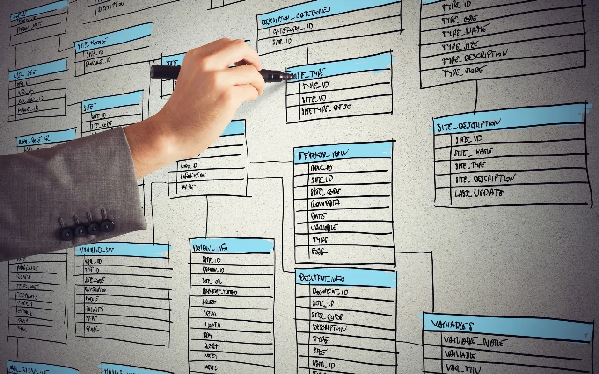
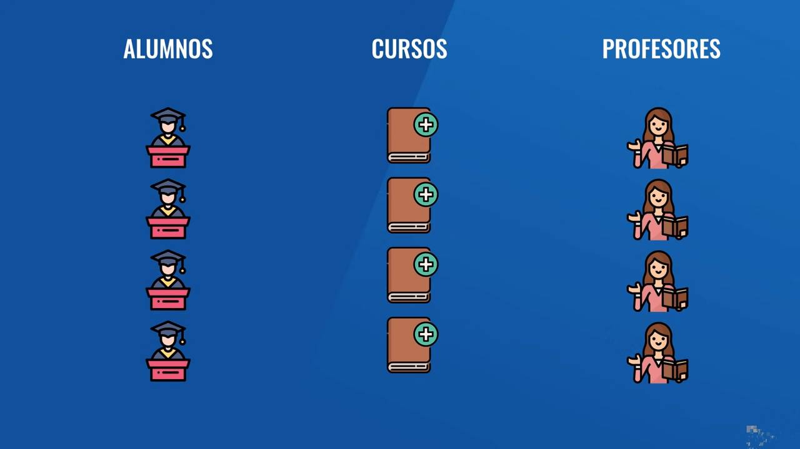
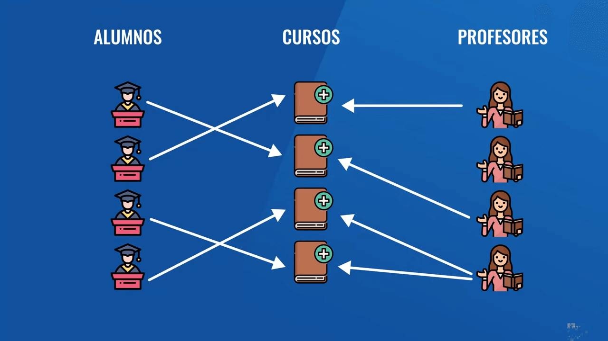
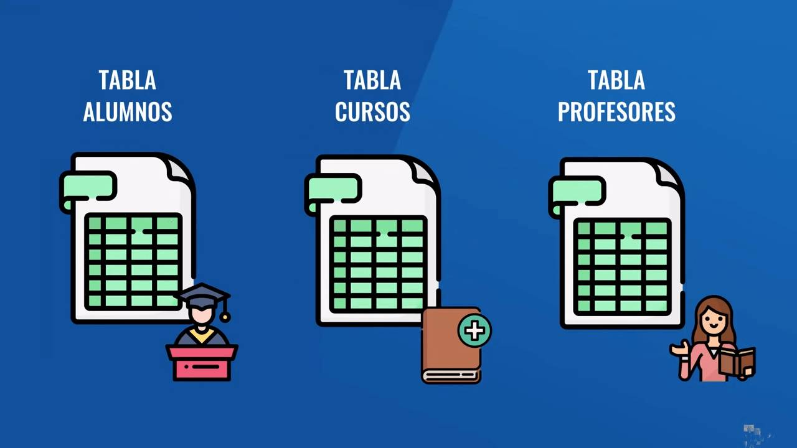
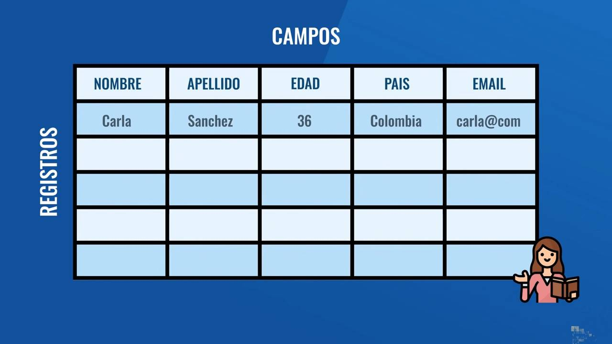
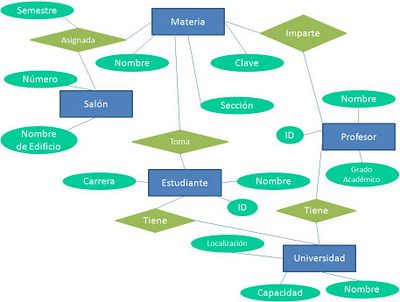

# Que son as bases de datos?

Non sei até que punto se empregan hoxe as bibliotecas. Pode que moitos de vos xa non usedes as bibliotecas para nada, pero na miña etapa de estudante era a forma máis fiable de atopar información. Daquela, a forma de atopar un libro era consultando un sistema de fichas gardadas en caixóns de madeira. As fichas se almacenaban por materia e por orde alfabética. En cada ficha se atopaba unha descrición utilitaria de cada libro almacenado na biblioteca, ademais de indicacións de en que sala, corredor ou estante da biblioteca podías atopalo. E se con aquelas indicacións da ficha non che bastaba, sempre quedaba a alternativa de preguntarlle á/ao bibliotecaria/o onde estaba o libro (sala, estante, fila, etc.). Se ti non eras capaz eles seguro que podían descifrar os datos da ficha que seleccionaras, en realidade aquelas fichas eran creadas por eles. E eles eran os encargados de devolver cada libro a súa sala, estante, fila,... así que seguro que sabían onde podías atopar o que buscabas.

Que teñen que ver as bibliotecas e os libros cas bases de datos? Pois seguramente nada, aínda que o proceso que se usaba daquela para almacenar e atopar libros eran, dalgún xeito, as bases de datos na súa forma máis arcaica.

## Que é unha base de datos?

Como nunha biblioteca, nas bases de datos se almacena información nunha orde que permita a súa consulta. Podemos quedarnos con esa analoxía ou probar cunha definición máis técnica:

> Unha base de datos é un conxunto de información almacenada e consultada sistematicamente
>
> Unha base de datos é unha recompilación organizada de información ou datos estruturados, que normalmente se almacena de forma electrónica nun sistema informático, que poden ser consultados de forma sistemática.

Analicemos esta definición:

**recompilación organizada de información:** moita información, como: un libro de receitas, a relación de vendas da tempada ou o catalogo de vinilos da túa colección de clásicos do jazz.

**para ser consultados:** para que senón?

**de forma sistemática:** empregando o índice ou, se tes un favorito, unha marca distintiva.

## Do papel ao software

As bases de datos físicas, como unha biblioteca, os libros de contas da túa empresa,... son unha grande complicación: unha dor. Son difíciles de manter, son lentos, poden deteriorarse, é moi complexo facer unha copia de seguridade, etc. Por este motivo as bases de datos dixitais ofrecen grandes vantaxes, e por iso se converteron no núcleo de gran parte do software de sistemas.

Pero, e como pasamos do papel ao software? 

Pois grazas aos sistemas ***xestores de bases de datos***. Moitas veces se os confunde pero lembra que as bases de datos son os datos, a información, mentres que e o xestor é un software especializado co que podemos crear a estrutura, almacenar, consultar, definir permisos e garantir a integridade das nosas bases de datos.

O primeiro problema que debeu resolver a informática foi a persistencia dos datos garadados nunha base de datos. Os primeiros ordenadores tiñan unha memoria volátil e a información desaparecía cando o ordenador non recibía enerxía eléctrica. O que resultaba ser un gran problema para as bases de datos. Pero a partires dos anos 70 se poido dar solución a ese problema da persistencia grazas a aparición dos discos duros. Foi entón cando, p.ex., se definiron tamén os principios das bases de datos relacionais. 

Dende aquela as bases de datos non pararon de evolucionar.

> Queres saber algo sobre a historia dos ordenadores e quen inventou a programación? Mira este artigo: https://ed.team/blog/quien-invento-la-programacion

## Bases de datos relacionais

Estas bases de datos, como o seu nome indica, resolven relacións entre os datos almacenados. Neste tipo de base de datos se definen distintas entidades (datos dalgún tipo ou **clase**) que manteñen unha determinada estrutura e as relacionas con outras entidades ou datos. Por exemplo, imaxina un almacén de datos dun colexio onde se gardan os datos dos cursos, dos alumnos e dos profesores.

Neste exemplo, un profesor non imparte todos os cursos e un alumno non asiste a todos os cursos, aínda que si a máis de un. Para resolver esta dinámica do sistema hai que definir a relación entre as distintas entidades - profesores, alumnos e cursos-.

Pero, non podes gardar todo no mesmo lugar. Onde gardas os cursos, non podes gardar os alumnos, e estes tampouco poden estar gardados onde gardas os profesores. Ten sentido? Así que hai que definir un lugar para os alumnos, outro para os profesores e outro para os cursos. Cada un deses lugares se denomina táboa, e dentro das táboas se almacenaran os datos ou rexistros.

Os rexistros son cada un dos datos almacenados en cada unha das táboas. Por exemplo, cada profesor é un rexistro na táboa de profesores, cada curso é un rexistro na táboa de cursos e cada alumno é un rexistro na táboa de alumnos. Se te fixas, cada táboa, resulta igual a unha folla de Excel.

As táboas dispoñen de columnas e filas. Cada columna ou campo ten un nome, a reunión de tódolos campos serven para definir de xeito clara cada entidade. E cada fila da táboa, ou *tupla*, garda os datos dunha instancia da entidade que garda a táboa.

Só queda resolver as relacións entre os campos ou rexistros almacenados en cada táboa, o que facemos é definir as relacións e programalas.

Isto faise co [modelo de relacións de entidades](https://sqlearning.com/es/introduccion-sql-server/modelo-entidad-relacion/).

## Web 2.0

Aínda así as bases de datos relacionais non as únicas formas de almacenar datos.

Nos anos 2000, coa democratización dos servizos de Internet - a Web 2.0-, os usuarios comezaron a crear contidos (blogs, vídeos, redes sociais). Xe xerou tanta información, que as bases de datos relacionais comezaron a quedarse curtas. Aparecen tamén outro modelos: as bases de datos non relacionais.

## Bases de datos non relacionais (NoSQL)

Estas bases de datos non teñen unha estrutura definida, incluso pódese ter redundancia de datos, é dicir, podemos ter os mesmos rexistros en diferentes táboas. Por que se permite isto? Debido a que o que se busca é rendemento, o acceso rápido é prioritario sobre a normalización, é necesario aforrar potencia informática para poder procesar a maior cantidade de datos no menor tempo posible.

## Conclusións

Hoxe en día, todo se fai con datos que se almacenan arredor do mundo, a creación de datos e o acceso a datos deixa datos e mobiliza as actividades sociais e económicas. 