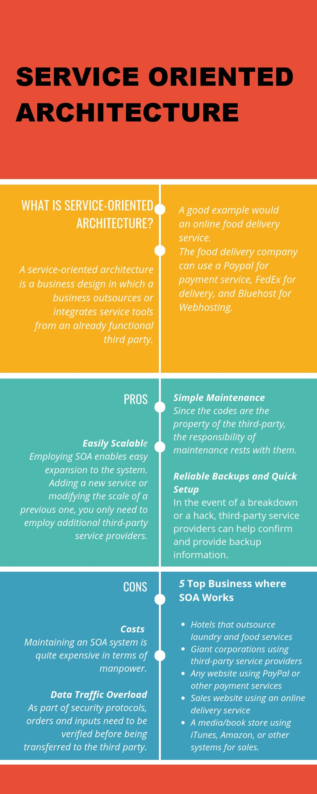

## Lecturas complementarias
- [API](api-beginners.md)
- [API web vs Web Services](https://es.parasoft.com/blog/web-api-vs-web-services-microservices-basics-differences/)
- [SGBD](https://es.wikipedia.org/wiki/Sistema_de_gesti%C3%B3n_de_bases_de_datos)
- [Tópicos típicos](https://www.redhat.com/es/topics)
- [Extras](https://www.educaciontrespuntocero.com/recursos/programacion/herramientas-online-aprender-programar/) [2](https://www.educaciontrespuntocero.com/recursos/programacion/programas-herramientas-para-programar-sin-saber-codigo/)

## Libros

 - [Jon Duckett: *PHP & MySQL – Server–side Web Development* ed.2022](https://www.amazon.es/PHP-MySQL-Jon-Duckett/dp/1119149223/ref=sr_1_3?qid=1681655860&refinements=p_27%3AJ+Duckett&s=books&sr=1-3) Autor
 - [Curso de PHP 8 y MySQL 8](https://www.amazon.es/Curso-MySQL-Miguel-Cabezas-Granado/dp/8441543720/ref=pd_bxgy_img_sccl_2/261-2009321-2971222?pd_rd_w=hnqFH&content-id=amzn1.sym.1f3e136f-80dc-4ee2-9d0d-548611b99b5c&pf_rd_p=1f3e136f-80dc-4ee2-9d0d-548611b99b5c&pf_rd_r=6V6CP7WT8PPDX6A4SHGW&pd_rd_wg=YuZMH&pd_rd_r=3b34b2c4-9adc-4bea-a715-d12b669ad5f9&pd_rd_i=8441543720&psc=1&asin=B08YRT2JPW&revisionId=b980ff00&format=1&depth=1) Anaya 2021

